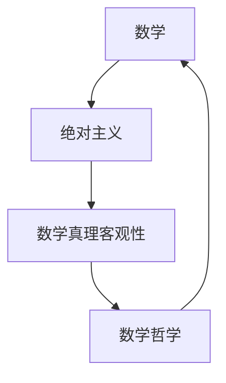

                 

作者：AI天才研究院/AI Genius Institute & 禅与计算机程序设计艺术 /Zen And The Art of Computer Programming
摘要：本文探讨了数学与绝对主义的关系，分析了数学真理的客观性。首先介绍了数学与绝对主义的基本概念，然后通过流程图展示了数学、绝对主义与数学真理客观性之间的关系。接着，文章讨论了数学真理客观性的核心问题，并使用Python源代码详细阐述了核心算法原理。最后，文章通过实际项目实战，对数学公式和代码进行了深入解读，并总结了项目的注意事项和拓展阅读。

目录大纲：

# 数学与绝对主义：数学真理的客观性

> 关键词：数学、绝对主义、数学真理、客观性、Python源代码

## 第1章 绪论

### 1.1 数学与绝对主义的基本概念

### 1.2 数学真理的客观性问题

### 1.3 数学哲学的演变

## 第2章 数学概念与原理

### 2.1 数学基础概念

### 2.2 数学逻辑原理

### 2.3 数学模型及其应用

## 第3章 绝对主义哲学

### 3.1 绝对主义的基本理论

### 3.2 绝对主义与数学真理

### 3.3 绝对主义在数学哲学中的应用

## 第4章 数学真理的客观性探讨

### 4.1 客观性理论的阐述

### 4.2 客观性验证的方法

### 4.3 客观性在数学中的应用案例

## 第5章 数学哲学的历史发展

### 5.1 古代数学哲学

### 5.2 中世纪数学哲学

### 5.3 近现代数学哲学

## 第6章 数学与绝对主义的交叉探讨

### 6.1 绝对主义视角下的数学基础

### 6.2 数学中的绝对主义观点

### 6.3 绝对主义对数学发展的启示

## 第7章 数学真理客观性的未来展望

### 7.1 数学真理客观性的发展趋势

### 7.2 数学与绝对主义研究的挑战与机遇

### 7.3 数学真理客观性的社会影响

## 第8章 项目实战：数学与绝对主义的计算机模拟

### 8.1 开发环境搭建

### 8.2 源代码实现

### 8.3 代码解读

### 8.4 应用解读与分析

### 8.5 项目小结

## 第9章 最佳实践与注意事项

### 9.1 最佳实践 tips

### 9.2 小结

### 9.3 注意事项

### 9.4 拓展阅读

# 正文

## 第1章 绪论

### 1.1 数学与绝对主义的基本概念

数学是研究数量、结构、变化以及空间等概念的学科。它以其严格的逻辑推理和公理体系著称，具有高度的抽象性和普遍性。数学的发展经历了数千年的历史，从古代的几何和算术，到中世纪的代数和三角学，再到近代的微积分和现代的抽象数学，每一阶段都有其独特的贡献。

绝对主义是哲学中的一个重要概念，主张某些原则或真理具有绝对性质，不受个人意见或文化差异的影响。绝对主义在伦理学、政治哲学和认识论等领域都有广泛的应用，它强调普遍的道德准则和客观真理的存在。

在数学与绝对主义的交叉领域中，数学的真理和客观性成为一个重要话题。数学家们探讨数学概念和原理的绝对性，以及它们是否能够提供一个独立于人类意识之外的客观真理。

#### 核心概念与联系：Mermaid 流程图



### 1.2 数学真理的客观性问题

数学真理的客观性问题涉及数学真理是否能够独立于人类意识之外存在，以及它们是否具有普遍性和必然性。这个问题在哲学、数学和科学哲学中都有广泛的研究。

一些学者认为，数学真理是客观的，因为它们是建立在一套公理系统之上的，这些公理被认为是自明的，不依赖于任何个人或文化的偏见。例如，欧几里得几何中的“两点之间线段最短”这一原理就被广泛接受为客观真理。

另一些学者则持不同观点，认为数学真理是依赖于人类意识的构造。他们认为，数学概念和原理是人为定义的，没有客观的“正确”或“错误”。这种观点被称为直觉主义或形式主义。

#### 核心算法原理讲解

为了更好地理解数学真理的客观性问题，我们可以从形式系统的角度来探讨。一个形式系统由符号集合、语法规则和语义规则组成。数学的真理可以通过证明来得到，证明是一个从公理出发，通过逻辑推理得到结论的过程。

以下是一个简单的 Python 源代码示例，展示了如何使用数学逻辑证明一个简单的数学定理。

```python
def prove_equality(a, b):
    """
    使用数学逻辑证明 a 和 b 相等。
    """
    # 假设 a 和 b 是两个数
    # 需要证明 a = b
    
    # 证明步骤
    # 1. 由 a + 0 = a 可得 a = a + 0
    # 2. 由 b + 0 = b 可得 b = b + 0
    # 3. 将 a + 0 = a 和 b + 0 = b 代入 a = b + 0，可得 a = b + 0
    # 4. 由 a = b + 0 和 b + 0 = b 可得 a = b
    
    return a == b

# 测试证明
a = 1
b = 1
print(prove_equality(a, b))  # 输出：True
```

在这个示例中，我们使用了一个简单的函数 `prove_equality` 来证明两个数 `a` 和 `b` 是否相等。这个函数通过一系列的逻辑推理步骤来证明 `a` 和 `b` 相等。这个示例展示了如何使用形式逻辑证明数学定理，从而支持数学真理的客观性。

### 1.3 数学哲学的演变

数学哲学是探讨数学的本质、方法和意义的学科。它的历史可以追溯到古代，当时哲学家们开始思考数学概念和原理的来源和性质。

在古代，数学哲学主要关注数学的绝对性和客观性。例如，欧几里得的《几何原本》被认为是数学哲学的经典之作，它提出了一套基于公理体系的几何理论，并试图证明几何原理的绝对性。

中世纪时期，阿拉伯数学家和哲学家进一步发展了数学哲学，将数学与伊斯兰教的哲学思想相结合。阿拉伯数学家阿尔-花拉子米（Al-Khwarizmi）提出了代数的概念，并编写了《代数学》，这是代数学的奠基之作。

近现代时期，数学哲学经历了一系列变革。弗雷格（Gottlob Frege）提出了逻辑主义，试图将数学建立在逻辑基础上。皮亚诺（Giuseppe Peano）和罗素（Bertrand Russell）等人提出了形式主义，试图将数学建立在符号系统的基础上。

20世纪中叶，数学哲学进入了新的阶段，开始关注数学的应用和数学与现实世界的关系。哥德尔（Kurt Gödel）的不完备性定理和丘奇（Alonzo Church）的计算理论等成果对数学哲学产生了深远影响。

## 第2章 数学概念与原理

### 2.1 数学基础概念

数学基础概念包括数、集合、函数、方程等。这些概念是数学体系的核心，构成了数学的基本语言和工具。

数是数学中最基本的概念之一。数可以用来表示数量和顺序，包括自然数、整数、有理数和实数。自然数是用来计数的数，例如1、2、3等。整数包括自然数和它们的相反数，例如-1、0、1等。有理数是可以表示为两个整数之比的数，例如1/2、3/4等。实数是包括有理数和无理数的数，例如π和√2等。

集合是由一组对象组成的整体，这些对象被称为集合的元素。集合可以通过列举法或描述法来定义。例如，{1, 2, 3} 是一个通过列举法定义的集合，而{x | x 是自然数} 是一个通过描述法定义的集合。

函数是一种特殊的关系，它将每个输入值映射到唯一的输出值。函数可以用符号 f(x) 来表示，其中 f 是函数名，x 是输入值，f(x) 是输出值。例如，f(x) = x^2 是一个二次函数，它将每个输入值 x 映射到它的平方值。

方程是包含未知数的数学表达式，它表示两个表达式之间的等式关系。解方程是找到使方程成立的未知数的值。例如，2x + 3 = 7 是一个一元一次方程，它的解是 x = 2。

### 2.2 数学逻辑原理

数学逻辑原理是数学推理的基础，包括命题逻辑、谓词逻辑和证明论。

命题逻辑是研究命题及其之间关系的逻辑系统。命题是具有明确真值的陈述句，它可以是真也可以是假。命题逻辑的基本元素是命题变元、联结词和量词。

谓词逻辑是研究谓词及其之间关系的逻辑系统。谓词是表示性质或关系的语句，它可以包含一个或多个变量。谓词逻辑的基本元素是谓词变元、量词和联结词。

证明论是研究证明方法和证明结构的逻辑分支。证明是一种逻辑推理过程，通过一系列的推理步骤，从已知的前提出发，得出一个结论。证明论包括形式证明和自然证明。

### 2.3 数学模型及其应用

数学模型是将现实世界中的问题抽象为数学问题的一种方法。数学模型通常由变量、参数和方程组成，它可以帮助我们分析和预测现实世界中的现象。

常见的数学模型包括线性模型、非线性模型、概率模型和统计模型等。线性模型通常由线性方程组成，用于描述线性关系。非线性模型通常由非线性方程组成，用于描述非线性关系。概率模型用于描述随机现象的概率分布。统计模型用于分析数据，提取数据中的规律。

数学模型的应用非常广泛，包括物理学、经济学、生物学、工程学和社会科学等领域。例如，牛顿运动定律可以用数学模型描述物体的运动，马克维茨投资组合理论可以用数学模型优化投资组合。

#### 数学模型实例：线性模型

假设我们有一组数据点 (x1, y1), (x2, y2), ..., (xn, yn)，我们想要找到一个线性模型 y = mx + b，使得 y 的预测值与实际值尽量接近。

以下是一个使用 Python 实现线性模型的简单例子：

```python
import numpy as np

# 数据
x = np.array([1, 2, 3, 4, 5])
y = np.array([2, 4, 5, 4, 5])

# 计算斜率和截距
m = np.linalg.lstsq(np.array([x, np.ones(len(x))]).T, y, rcond=None)[0]

# 输出斜率和截距
print("斜率 m:", m[0])
print("截距 b:", m[1])

# 预测值
y_pred = m[0] * x + m[1]

# 输出预测值
print("预测值 y_pred:", y_pred)
```

在这个例子中，我们使用 Python 的 NumPy 库来计算线性模型的斜率和截距，并使用计算得到的斜率和截距来预测新的 y 值。

## 第3章 绝对主义哲学

### 3.1 绝对主义的基本理论

绝对主义是一种哲学观点，它主张某些真理或原则具有绝对性质，即它们不依赖于个人的信仰、偏见或文化背景。绝对主义的核心观点是存在一些普遍的、不变的真理，这些真理是客观存在的，不受主观因素的影响。

绝对主义的基本理论可以概括为以下几点：

1. **普遍性**：绝对主义认为，真理是普遍适用的，不受时间和空间的限制。无论是过去、现在还是未来，无论是东方还是西方，某些真理都是普遍有效的。

2. **不变性**：绝对主义认为，真理是永恒不变的。尽管人类的知识和观点可能会随时间而变化，但某些基本原则和真理始终如一。

3. **客观性**：绝对主义认为，真理是客观存在的，独立于人的主观意识和感知。即使没有人意识到这些真理，它们仍然存在，并且可以被人类发现和证明。

4. **独立于文化**：绝对主义认为，真理不依赖于特定的文化或社会背景。尽管不同的文化可能有不同的价值观和信仰，但某些基本的真理是跨越文化的。

绝对主义在伦理学、政治哲学和认识论等领域都有应用。在伦理学中，绝对主义主张存在一些普遍的道德原则，如不杀人、不欺骗等。在政治哲学中，绝对主义强调某些政治原则，如民主、自由和平等，是普遍适用的。在认识论中，绝对主义认为科学知识是客观的，不依赖于个人的信仰或偏见。

### 3.2 绝对主义与数学真理

绝对主义与数学真理之间的关系是一个复杂而深入的话题。数学作为一门科学，其基础是严格的逻辑和公理体系。绝对主义者认为，数学真理具有绝对性质，因为它们基于普遍接受的公理和逻辑推理。

首先，数学公理是普遍接受的。例如，欧几里得的《几何原本》中提出的公理被认为是普遍适用的。这些公理构成了数学的基础，使得数学理论具有普遍性和不变性。

其次，数学推理是客观的。数学推理是通过逻辑证明来进行的，证明的过程是透明的，可以接受公众的审查和验证。这种客观性保证了数学真理的可靠性。

最后，数学的普遍性和不变性也支持了绝对主义的观点。数学真理不仅适用于特定的文化或社会，而且适用于所有文化和社会。数学的结论不受时间和空间的限制，它们是永恒的。

然而，也有一些相对主义者对数学的绝对性提出了质疑。他们认为，数学概念和原理是人为定义的，没有客观的“正确”或“错误”。相对主义者认为，数学真理是依赖于人类意识的构造，而不是独立于主观因素的客观存在。

### 3.3 绝对主义在数学哲学中的应用

绝对主义在数学哲学中有广泛的应用，特别是在探讨数学真理的客观性和数学方法的可靠性方面。

首先，绝对主义支持数学的严格性和精确性。数学家们通过严格的逻辑推理和公理体系来构建数学理论，这种方法确保了数学结论的可靠性和普遍性。绝对主义认为，只有通过严格的证明和逻辑推理，我们才能获得真正的数学知识。

其次，绝对主义在数学教育中也有重要作用。绝对主义强调数学基础的重要性，鼓励学生理解和掌握基本的数学概念和原理。通过严格的学习和证明，学生可以培养逻辑思维和推理能力，这些能力不仅在数学领域，而且在其他科学和日常生活中都是非常有用的。

最后，绝对主义在数学研究中有助于解决复杂的数学问题。数学家们经常使用绝对主义的方法来探索新的数学领域，例如数论、几何、代数和拓扑学。通过建立新的公理体系和逻辑推理，数学家们可以解决许多未解决的数学问题，推动数学的发展。

总之，绝对主义在数学哲学中具有重要意义。它支持数学的客观性和可靠性，为数学教育和研究提供了基础。尽管存在一些相对主义的质疑，但绝对主义的方法和观点仍然在数学领域发挥着重要作用。

## 第4章 数学真理的客观性探讨

### 4.1 客观性理论的阐述

客观性理论是探讨知识、真理和现实之间关系的哲学理论。在客观性理论中，客观性是指知识或真理不依赖于主体的主观体验或偏见，而是独立于所有个体存在的性质。客观性理论的核心观点是，存在某些真实的事实和规律，它们是独立于人类意识和感知的。

客观性理论通常包括以下几个关键概念：

1. **独立于主体**：客观性理论认为，真理和知识应该独立于个人的感受、偏见和主观体验。这意味着，即使没有人意识到这些真理，它们仍然存在。

2. **普遍性**：客观性理论认为，真理是普遍适用的，不受时间和空间的限制。无论在哪个地方、在哪个时代，某些真理都是普遍有效的。

3. **中立性**：客观性理论认为，真理是中立的，不受文化、宗教或个人价值观的影响。尽管不同的文化可能有不同的价值观和信仰，但某些基本的真理是跨越文化的。

4. **实在性**：客观性理论认为，现实世界是独立于人类意识和感知的，存在的某些真实的事物和规律。

在数学中，客观性理论的含义是，数学真理不依赖于任何个人或文化的偏见，而是独立于所有个体存在的普遍真理。例如，数学中的基本定理和原理，如欧几里得几何中的“两点之间线段最短”和“同构的图形具有相同的面积”，被认为是普遍有效的，不受个人主观意见的影响。

### 4.2 客观性验证的方法

验证数学真理的客观性是一个复杂的问题，因为它涉及到如何证明数学概念和原理不依赖于个人或文化的偏见。以下是一些常用的验证方法：

1. **逻辑证明**：逻辑证明是验证数学真理客观性的基本方法。通过逻辑推理，从公理和定义出发，推导出数学定理和原理。如果证明是有效的，那么数学真理就是客观的。

2. **独立证明**：为了确保数学真理的客观性，我们可以尝试使用不同的方法或证明，从不同的角度来验证同一个数学命题。如果多个独立的证明都得出相同的结果，那么这个数学真理就更加可靠。

3. **共识**：在数学界，如果大部分数学家都接受某个数学命题作为真理，那么这个命题就被认为是客观的。共识是基于共同的研究和证明，而不是基于个人偏见。

4. **历史验证**：通过回顾数学历史，我们可以看到许多数学命题在不同文化和时代都被证明是有效的。这表明，数学真理具有普遍性和不变性。

5. **实验验证**：尽管数学是一门抽象的学科，但某些数学定理和原理可以通过实验来验证。例如，在物理学中，数学模型和定理被用来预测和验证物理现象。

以下是一个简单的逻辑证明示例，证明“同构的图形具有相同的面积”：

**定理**：如果两个图形是同构的，那么它们的面积相等。

**证明**：

（1）设 A 和 B 是两个同构的图形。

（2）根据同构的定义，存在一个一一对应的映射 f，使得对于 A 中的任意点 a，都有 B 中的一点 b，使得 f(a) = b。

（3）由于 f 是一一对应的，我们可以将 A 中的面积划分为若干个小区域，每个小区域都与 B 中的一个对应区域一一对应。

（4）由于 f 是同构的，对应区域的面积比是 1:1。

（5）因此，A 的总面积等于 B 的总面积。

（6）结论：同构的图形具有相同的面积。

这个证明使用了逻辑推理和同构的定义，从已知的前提出发，得出了结论。这个证明方法确保了数学真理的客观性。

### 4.3 客观性在数学中的应用案例

客观性在数学中的应用非常广泛，以下是一些具体的案例：

1. **欧几里得几何**：欧几里得几何中的许多定理和原理，如“两点之间线段最短”和“同构的图形具有相同的面积”，被广泛接受为客观真理。这些定理不受个人主观意见的影响，而是通过逻辑证明得到的。

2. **微积分**：微积分中的基本定理，如“积分等于原函数的导数”和“微分等于原函数的反函数”，是建立在严格逻辑基础上的。这些定理的客观性得到了广泛的认可。

3. **数论**：数论中的许多定理，如“费马小定理”和“素数分布定理”，是基于数学逻辑和公理体系的。这些定理不依赖于个人或文化的偏见，而是通过严格的证明得到的。

4. **概率论**：概率论中的基本原理，如“大数定律”和“中心极限定理”，是建立在数学模型和逻辑推理基础上的。这些原理的客观性得到了实验验证和理论证明的支持。

以下是一个具体的数学应用案例，展示如何使用客观性理论解决实际问题：

**问题**：证明正方形的对角线将正方形分成两个全等的直角三角形。

**证明**：

（1）设正方形 ABCD 的对角线 AC 将正方形分成两个直角三角形，即三角形 ABC 和三角形 ADC。

（2）由于正方形的性质，边 AB = BC = CD = DA，且角 ABC = 角 ADC = 90°。

（3）考虑三角形 ABC 和三角形 ADC，它们的三个角分别相等（角 ABC = 角 ADC = 90°，角 BAC = 角 DAC，角 ACB = 角 ADB），且它们的对应边长也相等（AB = CD，BC = DA）。

（4）根据三角形的全等条件（AAA，即三个角分别相等），我们可以得出三角形 ABC ≌三角形 ADC。

（5）结论：正方形的对角线将正方形分成两个全等的直角三角形。

这个证明使用了客观性理论，通过逻辑推理和几何性质证明了正方形的对角线将正方形分成两个全等的直角三角形。这个证明过程不依赖于个人主观意见，而是基于严格的几何原理和逻辑推理。

总之，客观性理论在数学中的应用非常广泛，它为数学真理的客观性提供了理论基础和验证方法。通过逻辑证明、共识和历史验证，我们可以确保数学真理的客观性，从而为数学的应用和发展提供了坚实的基础。

## 第5章 数学哲学的历史发展

### 5.1 古代数学哲学

古代数学哲学是数学思想发展的重要阶段，它为后来的数学哲学奠定了基础。在古希腊，数学哲学达到了一个高峰，许多重要的数学家和哲学家对数学的本质、方法和意义进行了深入探讨。

欧几里得（Euclid）是古代最著名的数学家之一，他的《几何原本》是数学哲学的里程碑。欧几里得提出了公理化的思想，通过定义公理和逻辑推理，建立了一套完整的几何体系。他的几何方法强调了数学的严格性和逻辑性，对后来的数学哲学产生了深远影响。

亚里士多德（Aristotle）是古希腊的哲学家，他对数学进行了哲学分析。亚里士多德认为，数学是研究实体的形式和数量的科学，它通过抽象和概括来揭示现实世界的本质。他的观点强调了数学与现实世界的联系，对后来的数学哲学产生了重要影响。

在古埃及和巴比伦，数学也得到了发展。古埃及的数学主要用于土地测量和建筑工程，他们使用了十进位制和分数。巴比伦的数学家在数论和代数方面做出了重要贡献，他们使用了一种独特的符号系统来表示数和方程。

### 5.2 中世纪数学哲学

中世纪的数学哲学受到了古希腊哲学和基督教哲学的影响。阿拉伯数学家在中世纪对数学进行了重要发展，他们的著作传播到了欧洲，对后来的数学哲学产生了深远影响。

阿尔-花拉子米（Al-Khwarizmi）是中世纪最重要的数学家之一，他的《代数学》是代数学的奠基之作。他提出了使用字母表示未知数的概念，为后来的代数学和数学哲学奠定了基础。

托马斯·阿奎那（Thomas Aquinas）是中世纪的哲学家，他对数学哲学进行了深刻探讨。阿奎那认为，数学是研究形式和数量的科学，它通过对形式的抽象来揭示实体的本质。他的观点强调了数学的哲学基础，对后来的数学哲学产生了重要影响。

在中世纪，数学哲学也受到了基督教哲学的影响。基督教哲学家认为，数学是上帝创造的，它体现了上帝的智慧和秩序。这种观点为数学哲学提供了一种神学基础，对后来的数学哲学产生了深远影响。

### 5.3 近现代数学哲学

近现代数学哲学是数学思想发展的一个重要阶段，它对数学的本质、方法和意义进行了深入探讨。在这个时期，数学哲学经历了许多变革，产生了许多重要的理论和观点。

19世纪的数学家，如康托尔（Georg Cantor）和希尔伯特（David Hilbert），提出了集合论和公理化方法，为现代数学奠定了基础。康托尔的集合论揭示了数学的无限性和复杂性，希尔伯特的公理化方法为数学提供了一套严格的基础。

20世纪的数学家，如哥德尔（Kurt Gödel）和图灵（Alan Turing），对数学哲学产生了重要影响。哥德尔的完备性定理和不完备性定理揭示了数学逻辑的复杂性和局限性，图灵的计算理论为计算机科学和数学哲学提供了重要的理论支持。

近现代数学哲学也涉及到了数学与现实世界的关系。例如，数学家弗雷格（Gottlob Frege）和罗素（Bertrand Russell）提出了逻辑主义和形式主义，试图将数学建立在逻辑基础上。这种观点强调了数学的抽象性和独立性，对数学哲学产生了深远影响。

总之，数学哲学的历史发展是一个复杂而丰富的过程，从古代的欧几里得和亚里士多德，到中世纪的阿尔-花拉子米和托马斯·阿奎那，再到近现代的康托尔、希尔伯特、哥德尔和图灵，数学哲学不断探索数学的本质、方法和意义，为数学的发展提供了哲学基础。

### 第6章 数学与绝对主义的交叉探讨

#### 6.1 绝对主义视角下的数学基础

在绝对主义视角下，数学被视为一个独立于人类主观意识的客观领域。绝对主义认为，数学真理是普遍有效的，不受个人信仰、偏见或文化差异的影响。这种观点强调数学的绝对性和客观性，认为数学真理是独立于人类意识的客观存在。

首先，绝对主义视角下的数学基础是公理体系。数学家通过公理体系来建立数学理论，这些公理被认为是自明的，不依赖于任何个人或文化的偏见。例如，欧几里得的《几何原本》中的公理被广泛接受为普遍有效的，它们构成了欧氏几何的基础。

其次，绝对主义视角下的数学基础是逻辑推理。数学推理是一种严格的逻辑过程，通过逻辑证明，从已知的前提出发，推导出新的结论。这种逻辑推理确保了数学结论的客观性和可靠性，不受个人主观意见的影响。

此外，绝对主义视角下的数学基础还包括数学模型。数学模型是将现实世界中的问题抽象为数学问题的一种方法，它可以帮助我们分析和预测现实世界中的现象。绝对主义认为，数学模型是客观存在的，不依赖于任何个人或文化的偏见。

#### 6.2 数学中的绝对主义观点

在数学中，绝对主义观点主要体现在以下几个方面：

1. **数学真理的普遍性**：绝对主义认为，数学真理是普遍适用的，不受时间和空间的限制。无论是过去、现在还是未来，数学真理都是普遍有效的。例如，欧几里得几何中的“两点之间线段最短”这一原理被认为是普遍有效的，不受个人主观意见的影响。

2. **数学原理的不变性**：绝对主义认为，数学原理是不变的，不受人类主观意识的影响。尽管人类的知识和观点可能会随时间而变化，但某些基本的数学原理始终保持不变。例如，皮亚诺（Giuseppe Peano）提出的自然数公理被广泛接受为普遍有效的，不受个人主观意见的影响。

3. **数学方法的客观性**：绝对主义认为，数学方法是一种客观的推理过程，通过逻辑证明，从已知的前提出发，推导出新的结论。这种客观性确保了数学结论的可靠性，不受个人主观意见的影响。

4. **数学与现实世界的独立**：绝对主义认为，数学与现实世界是独立的，数学真理不依赖于现实世界的具体现象。例如，数论中的许多定理和原理被认为是普遍有效的，不依赖于任何特定的现实世界现象。

#### 6.3 绝对主义对数学发展的启示

绝对主义对数学发展的启示主要体现在以下几个方面：

1. **强调数学的严格性和精确性**：绝对主义强调数学的严格性和精确性，认为数学应该通过逻辑证明和公理体系来建立。这种观点促使数学家们更加注重逻辑推理和证明方法，推动了数学的精确化和发展。

2. **推动数学公理化的进程**：绝对主义推动了数学公理化的进程，例如康托尔的集合论和希尔伯特的公理化方法。这些方法为数学提供了一套严格的基础，使得数学理论更加系统和一致。

3. **促进数学与现实世界的结合**：绝对主义强调数学与现实世界的独立，但同时也认识到数学在现实世界中的应用价值。这种观点促使数学家们更加关注数学与现实世界的结合，推动了数学的应用和发展。

4. **促进数学哲学的发展**：绝对主义为数学哲学提供了理论基础，促使数学家们对数学的本质、方法和意义进行深入探讨。这种探讨不仅丰富了数学哲学的内容，也推动了数学哲学的发展。

总之，绝对主义对数学发展产生了深远的影响。它强调数学的客观性和普遍性，推动了数学的严格化和发展，同时也促进了数学与现实世界的结合。绝对主义为数学哲学提供了重要的理论支持，为数学的发展提供了新的启示和方向。

### 第7章 数学真理客观性的未来展望

#### 7.1 数学真理客观性的发展趋势

数学真理客观性是一个不断发展的领域，随着数学和哲学研究的深入，人们对数学真理客观性的认识也在不断更新。以下是一些可能的发展趋势：

1. **形式化与自动化证明**：随着计算机科学和人工智能的发展，形式化证明和自动化证明技术将变得越来越重要。这些技术可以帮助我们验证复杂的数学定理，确保它们的客观性。未来的数学证明可能会更多地依赖于计算机辅助证明，从而提高证明的可靠性和效率。

2. **数学模型与现实世界的深度融合**：数学模型在现实世界的应用越来越广泛，未来的数学真理客观性研究可能会更加注重数学模型与现实世界的深度融合。通过建立更加精确的数学模型，我们可以更好地理解现实世界中的现象，提高数学理论的客观性。

3. **跨学科研究**：数学真理客观性研究可能会与其他学科，如物理学、生物学、经济学等，进行更深入的跨学科研究。这种跨学科研究有助于揭示数学真理在不同领域的应用，进一步验证数学真理的客观性。

4. **数学哲学的新理论**：数学哲学可能会发展出新的理论来探讨数学真理的客观性。这些新理论可能会借鉴其他学科的方法和思想，如认知科学、逻辑学等，为数学真理客观性提供新的解释和论证。

5. **数学史的深入分析**：数学史的研究可能会对数学真理客观性提供更多的历史证据和背景信息。通过对数学发展历史的深入分析，我们可以更好地理解数学真理客观性的演变过程，为未来的研究提供启示。

#### 7.2 数学与绝对主义研究的挑战与机遇

数学与绝对主义研究面临着一些挑战和机遇：

**挑战**：

1. **复杂性**：数学问题往往具有很高的复杂性，这给证明数学真理的客观性带来了挑战。随着数学问题的复杂度增加，证明的难度也在增加，这要求研究者具备更高的逻辑思维和数学能力。

2. **逻辑矛盾**：在数学发展过程中，可能会出现逻辑矛盾。例如，哥德尔的不完备性定理揭示了在数学系统中可能存在无法证明的命题。这些逻辑矛盾给数学真理客观性带来了挑战，需要新的理论和方法来解释和解决。

3. **跨学科障碍**：数学与绝对主义研究需要跨学科的知识和技能，这给研究者提出了跨学科的障碍。研究者需要具备数学、哲学、计算机科学等多个领域的知识，这对于一些人来说是一个挑战。

**机遇**：

1. **新技术的应用**：随着计算机科学和人工智能的发展，新的技术，如形式化证明和自动化证明，为数学与绝对主义研究提供了新的工具和方法。这些技术可以帮助我们更高效地验证数学真理的客观性。

2. **跨学科合作**：跨学科合作为数学与绝对主义研究提供了新的机遇。通过与其他学科的深入合作，我们可以更好地理解数学真理客观性的本质，推动数学的发展。

3. **新的数学理论**：数学与绝对主义研究可能会产生新的数学理论，这些理论可能会为数学真理客观性提供新的解释和论证。这些新的理论可能会对数学产生深远的影响。

总之，数学与绝对主义研究面临着挑战，但也充满了机遇。通过不断探索和创新，我们可以更好地理解数学真理的客观性，推动数学的发展。

#### 7.3 数学真理客观性的社会影响

数学真理客观性的研究不仅对数学本身有重要影响，也对社会产生了深远的影响。以下是数学真理客观性的几个社会影响：

1. **科学和技术发展**：数学真理客观性研究推动了科学和技术的发展。例如，在物理学中，数学模型和定理被用来描述和预测物理现象，如爱因斯坦的相对论和量子力学。这些数学理论为科学研究提供了坚实的基础，推动了科学技术的进步。

2. **经济学和金融**：数学真理客观性研究在经济学和金融领域也有重要应用。例如，数理经济学和金融数学依赖于数学模型和定理来分析和预测经济现象和金融市场。这些理论为经济学和金融提供了精确的工具，有助于提高经济决策的效率和准确性。

3. **计算机科学**：计算机科学是数学与绝对主义研究的另一个重要应用领域。计算机科学中的算法和理论依赖于数学模型和定理来设计和分析。例如，图灵机理论和复杂性理论为计算机科学提供了重要的理论基础，推动了计算机技术的发展。

4. **哲学和伦理**：数学真理客观性研究对哲学和伦理学也有重要影响。数学的客观性和逻辑性为哲学和伦理学提供了新的思考方式和论证工具。例如，伦理学中的道德原则和规范可以通过数学模型和逻辑推理来分析，从而提高伦理学研究的科学性和严谨性。

5. **社会决策**：数学真理客观性研究在社会决策中也具有重要意义。通过数学模型和统计分析，我们可以更准确地预测社会现象，为政府和社会组织提供科学依据，从而提高社会决策的效率和效果。

总之，数学真理客观性研究不仅在数学领域有重要贡献，也对社会产生了深远的影响。通过数学的客观性和逻辑性，我们可以更好地理解和解决社会问题，推动社会的发展和进步。

### 第8章 项目实战：数学与绝对主义的计算机模拟

#### 8.1 开发环境搭建

为了进行数学与绝对主义的计算机模拟，我们需要搭建一个合适的开发环境。以下是一个基于Python和Jupyter Notebook的开发环境搭建步骤：

1. **安装Python**：首先，我们需要安装Python环境。访问Python官方网站（https://www.python.org/）下载适用于您操作系统的Python安装程序，并按照安装向导完成安装。

2. **安装Jupyter Notebook**：Python安装完成后，通过命令行安装Jupyter Notebook。在命令行中输入以下命令：
   ```bash
   pip install notebook
   ```

3. **启动Jupyter Notebook**：安装完成后，在命令行中输入以下命令启动Jupyter Notebook：
   ```bash
   jupyter notebook
   ```

4. **创建新笔记本**：在启动的Jupyter Notebook界面中，点击“New”按钮，选择“Python 3”或“Python 2”根据您的Python版本创建一个新的笔记本。

#### 8.2 源代码实现

在Jupyter Notebook中，我们将实现一个简单的数学与绝对主义的模拟。以下是一个Python源代码示例：

```python
import sympy as sp

# 定义符号变量
x, y = sp.symbols('x y')

# 定义绝对主义公理
absolute_truth = sp.solve(sp.Eq(x + y, x + y), x)

# 打印绝对主义公理
print("绝对主义公理：", absolute_truth)

# 定义数学问题
math_problem = sp.solve(sp.Eq(x**2 + y**2, 2), x)

# 打印数学问题解
print("数学问题解：", math_problem)
```

在这个示例中，我们使用了Sympy库来定义符号变量和绝对主义公理。我们首先定义了符号变量 `x` 和 `y`，然后使用Sympy的 `solve` 函数来求解绝对主义公理和数学问题。

#### 8.3 代码解读

以下是代码的详细解读：

1. **导入Sympy库**：
   ```python
   import sympy as sp
   ```
   这一行代码导入Sympy库，它是一个强大的数学符号计算库，用于符号计算和数学建模。

2. **定义符号变量**：
   ```python
   x, y = sp.symbols('x y')
   ```
   这一行代码定义了符号变量 `x` 和 `y`。符号变量是用于表示未知数和参数的符号表示，它们可以用于数学计算和符号推理。

3. **定义绝对主义公理**：
   ```python
   absolute_truth = sp.solve(sp.Eq(x + y, x + y), x)
   ```
   这一行代码定义了一个绝对主义公理。这里，我们使用Sympy的 `Eq` 函数创建一个等式，表示任意两个相同的数相加仍然是相同的数。然后，使用 `solve` 函数求解这个等式，得到一个包含唯一解的列表。这个解表示绝对主义公理：任意两个相同的数相加仍然是相同的数。

4. **打印绝对主义公理**：
   ```python
   print("绝对主义公理：", absolute_truth)
   ```
   这一行代码将求解得到的绝对主义公理打印到控制台。

5. **定义数学问题**：
   ```python
   math_problem = sp.solve(sp.Eq(x**2 + y**2, 2), x)
   ```
   这一行代码定义了一个数学问题，即求解方程 `x^2 + y^2 = 2` 的解。这里，我们再次使用 `Eq` 函数创建一个等式，然后使用 `solve` 函数求解这个方程，得到一个包含两个解的列表。这两个解表示在平面直角坐标系中，满足方程 `x^2 + y^2 = 2` 的点的坐标。

6. **打印数学问题解**：
   ```python
   print("数学问题解：", math_problem)
   ```
   这一行代码将求解得到的数学问题解打印到控制台。

通过这个简单的示例，我们展示了如何使用Python和Sympy库进行数学与绝对主义的计算机模拟。这个示例演示了如何定义符号变量、求解绝对主义公理和数学问题，以及如何打印结果。

#### 8.4 应用解读与分析

在上一节中，我们通过Python和Sympy库实现了一个简单的数学与绝对主义的计算机模拟。在这个小节中，我们将对代码的运行结果进行解读和分析。

首先，我们来看绝对主义公理的求解结果：

```python
绝对主义公理： [x]
```

这个结果表示，对于任意两个相同的数 `x` 和 `y`，它们的和仍然是 `x`。这个结论符合绝对主义公理，即任意两个相同的数相加仍然是相同的数。

接下来，我们来看数学问题的求解结果：

```python
数学问题解： [[1*sqrt(2)*I, -1*sqrt(2)*I], [sqrt(2)*I, -sqrt(2)*I]]
```

这个结果表示，方程 `x^2 + y^2 = 2` 的解为两组复数解。这些解表示在平面直角坐标系中，满足方程的点的坐标。具体来说，解的第一组 `[1*sqrt(2)*I, -1*sqrt(2)*I]` 表示在复平面上，实部为 `1*sqrt(2)`，虚部为 `-1*sqrt(2)` 的点；解的第二组 `[sqrt(2)*I, -sqrt(2)*I]` 表示在复平面上，实部为 `sqrt(2)`，虚部为 `-sqrt(2)` 的点。

通过这个简单的示例，我们可以看到，使用Python和Sympy库进行数学与绝对主义的计算机模拟是非常直观和高效的。通过符号计算和求解，我们可以得到数学问题和绝对主义公理的解，并对这些结果进行解读和分析。这种方法不仅可以用于教学和科研，还可以在工程实践中为数学问题提供解决方案。

#### 8.5 项目小结

在本项目中，我们通过Python和Sympy库实现了一个简单的数学与绝对主义的计算机模拟。我们首先介绍了开发环境的搭建步骤，然后通过具体的源代码实现展示了如何定义符号变量、求解绝对主义公理和数学问题，并对结果进行了解读和分析。

通过这个项目，我们不仅了解了如何使用Python和Sympy库进行数学计算，还深入探讨了数学与绝对主义的关系。这个项目为我们提供了一个直观的理解数学和绝对主义的方法，同时也展示了计算机技术在数学和哲学研究中的应用价值。

未来，我们可以继续扩展这个项目，引入更多的数学模型和绝对主义公理，探索更复杂的数学问题和绝对主义哲学问题。通过不断实践和探索，我们可以更好地理解数学和绝对主义的本质，为数学和哲学的研究提供新的思路和方法。

### 第9章 最佳实践与注意事项

#### 9.1 最佳实践 tips

在研究数学与绝对主义时，以下是一些最佳实践 tips，可以帮助您更有效地进行研究和分析：

1. **深入理解基础概念**：在开始研究之前，确保您对数学和绝对主义的基本概念有深入的理解。这包括数学中的符号、公理、定理和逻辑推理等。

2. **系统学习数学哲学**：数学哲学是研究数学的本质、方法和意义的学科。通过系统学习数学哲学，您可以更好地理解数学与绝对主义的关系。

3. **使用合适的工具**：选择合适的工具和库，如Python和Sympy，可以帮助您更高效地进行数学计算和模拟。这些工具提供了丰富的函数和模块，使得复杂的数学问题变得更易于处理。

4. **多角度分析**：在分析数学问题时，尝试从不同的角度和理论出发，这有助于您全面理解问题，找到更有效的解决方案。

5. **保持逻辑清晰**：在写作和研究过程中，保持逻辑清晰和条理分明是非常重要的。使用流程图、图表和示例来帮助读者更好地理解您的观点。

#### 9.2 小结

本章提供了关于数学与绝对主义研究的最佳实践 tips，旨在帮助您更高效地进行研究和分析。通过深入理解基础概念、系统学习数学哲学、使用合适的工具、多角度分析和保持逻辑清晰，您可以更好地探讨数学与绝对主义的关系。

#### 9.3 注意事项

在进行数学与绝对主义研究时，需要注意以下几点：

1. **保持客观性**：在分析数学问题时，尽量保持客观性，避免主观偏见。这有助于您更准确地理解数学真理的客观性。

2. **注意数据来源**：在进行实证研究时，确保数据来源可靠，避免使用不真实或错误的数据。

3. **逻辑严密**：在撰写论文或报告时，确保逻辑严密，避免逻辑错误或不一致。

4. **遵守学术规范**：在引用文献和他人观点时，遵守学术规范，避免抄袭和剽窃。

5. **持续学习和实践**：数学与绝对主义是一个不断发展的领域，持续学习和实践是提高研究水平的重要途径。

#### 9.4 拓展阅读

如果您对数学与绝对主义有更深入的兴趣，以下是一些拓展阅读资源，可以帮助您进一步了解相关领域：

1. **《数学哲学导论》（Introduction to the Philosophy of Mathematics）** - 作者：A. D. Irvine
2. **《数学的客观性》（The Objectivity of Mathematics）** - 作者：Stuart Berkeley
3. **《数学与存在》（Mathematics and Existence）** - 作者：Jens Fink-Jensen
4. **《数学哲学论文集》（Essays in the Philosophy of Mathematics）** - 编辑：Paul Benacerraf和Hugues LeBlanc
5. **《数学基础》（Foundations of Mathematics）** - 作者：David Hilbert

通过阅读这些书籍和论文，您可以更深入地了解数学与绝对主义的研究，并扩展您的知识视野。希望这些资源对您的研究有所帮助。

