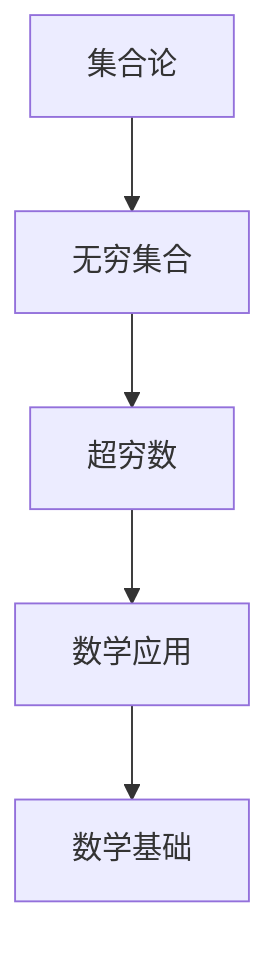
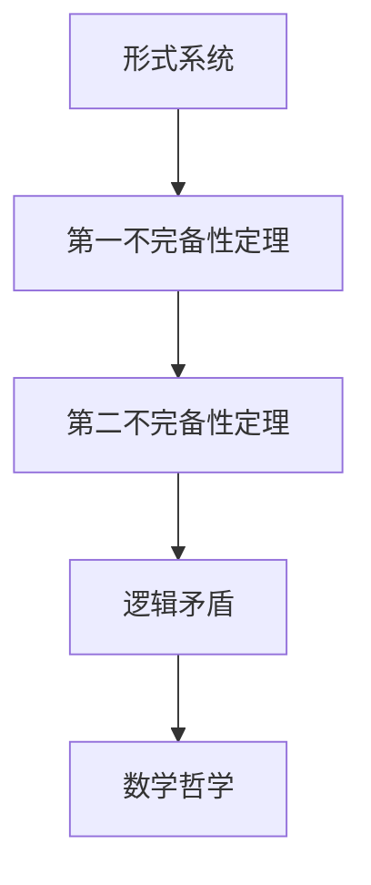
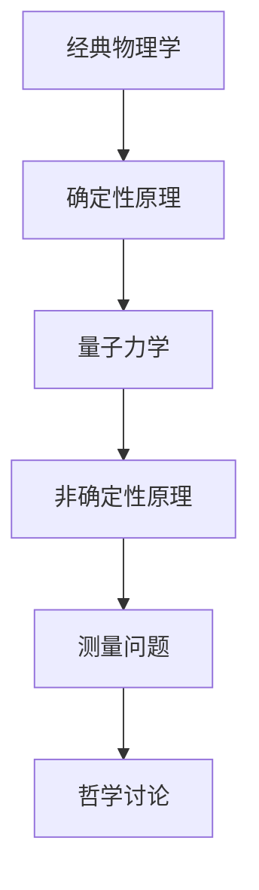

                 

### 文章标题：数学与绝对主义：数学真理的绝对性

> 关键词：数学，绝对主义，数学真理，逻辑推理，哲学

> 摘要：
本文将深入探讨数学与绝对主义的关系，特别是数学真理的绝对性问题。通过逻辑推理和哲学视角，本文旨在揭示数学真理的绝对性，并分析其哲学意义。我们将首先介绍数学的基本概念和绝对主义的理论，然后逐步探讨数学真理的绝对性，最后讨论数学哲学的实际应用与案例分析。本文的目标是帮助读者更好地理解数学真理的绝对性，并认识到数学在哲学领域的深远影响。

----------------------------------------------------------------

## 目录大纲

### 1. 数学基础
- **第1章：数学基础概念**
- **第2章：数学原理与方法**
- **第3章：数学历史与发展**

### 2. 绝对主义理论
- **第4章：绝对主义基本概念**
- **第5章：绝对主义哲学观点**
- **第6章：绝对主义在数学中的应用**

### 3. 数学真理的绝对性
- **第7章：数学真理的探讨**
- **第8章：数学真理的绝对性分析**
- **第9章：数学真理与哲学的关系**

### 4. 数学与绝对主义的关系
- **第10章：数学与绝对主义的联系**
- **第11章：数学与绝对主义的区别**
- **第12章：数学与绝对主义的哲学意义**

### 5. 数学哲学的应用与案例分析
- **第13章：数学哲学的应用**
- **第14章：数学哲学案例分析**
- **第15章：数学哲学的未来展望**

----------------------------------------------------------------

## 1. 数学基础

### 第1章：数学基础概念

数学是一门研究数量、结构、变化以及空间等概念的学科。数学的基础概念包括数、集合、函数、几何等。这些概念是构建数学理论体系的基础，也是我们理解世界的重要工具。

- **数**：数是数学中最基本的概念之一，它表示物体的数量或顺序。从自然数开始，我们可以引入整数、分数、小数、实数和复数等更复杂的数。

- **集合**：集合是数学中的一种基本结构，它由一组确定的、互异的元素组成。集合可以用来表示各种各样的对象，如物体、事件、函数等。

- **函数**：函数是数学中一个非常重要的概念，它表示一种特定的关系，即对于集合中的每一个元素，都有唯一确定的另一个元素与之对应。

- **几何**：几何是研究空间中点的分布、形状、大小和位置等特性的数学分支。它包括平面几何、立体几何、拓扑学等。

### 第2章：数学原理与方法

数学原理是构建数学理论的基础，而数学方法则是解决数学问题的重要手段。以下是几个重要的数学原理和方法：

- **公理法**：公理法是一种通过设定一些基本原理来构建数学理论的方法。这些基本原理被称为公理，它们是无需证明的假设。

- **逻辑推理**：逻辑推理是数学中的核心方法，它通过一系列的逻辑步骤从已知的前提推导出新的结论。逻辑推理是数学证明的基础。

- **数学归纳法**：数学归纳法是一种证明数学命题的方法，它通过证明一个基本情况和一个归纳步骤，来证明一个命题对所有自然数都成立。

- **概率论与数理统计**：概率论与数理统计是数学中研究随机现象的分支，它们提供了处理不确定性的工具和方法。

### 第3章：数学历史与发展

数学有着悠久的历史，从古代的数学萌芽到现代的数学体系，数学经历了漫长的发展过程。

- **古代数学**：在古代，数学主要关注几何和算术。例如，古埃及和古巴比伦人发展了测量和计算的基本方法。

- **中世纪数学**：在阿拉伯世界中，数学得到了进一步的发展。阿拉伯数学家翻译和传播了古希腊和印度的数学知识，同时做出了自己的贡献。

- **近代数学**：在17世纪和18世纪，数学经历了革命性的发展。微积分、代数、几何等分支得到了建立和完善。

- **现代数学**：在现代，数学已经发展成为一个庞大的学科体系，涵盖了各个领域。数学在科学研究、工程技术、经济金融等方面发挥着重要作用。

## 2. 绝对主义理论

### 第4章：绝对主义基本概念

绝对主义是一种哲学观点，认为某些真理或价值具有普遍的、不变的、客观的特性，不依赖于个人观点或文化背景。以下是绝对主义的一些基本概念：

- **绝对真理**：绝对主义认为存在某些真理是绝对的，不受主观意识的干扰。这些真理是客观存在的，不依赖于我们的感知或理解。

- **绝对价值**：绝对主义认为某些价值是普遍的、客观的，不依赖于个人或文化的偏好。例如，道德原则或伦理规范被认为是绝对的。

- **客观性**：绝对主义强调客观性，认为真理和价值是独立于个人主观意识的。这种客观性使真理和价值具有普遍性和普适性。

### 第5章：绝对主义哲学观点

绝对主义哲学观点在不同的哲学流派中有不同的表现形式，但都强调某些真理或价值的绝对性。以下是几种常见的绝对主义哲学观点：

- **柏拉图主义**：柏拉图认为理念世界中的真理和价值是绝对的，现实世界只是这些绝对理念的不完美映射。

- **客观实在论**：客观实在论认为客观世界的实体和规律是绝对的，不依赖于我们的感知或理解。

- **伦理绝对主义**：伦理绝对主义认为道德规范是绝对的，不依赖于个人或文化的偏好。这些道德规范被认为是客观存在的，适用于所有人。

### 第6章：绝对主义在数学中的应用

绝对主义在数学中有着广泛的应用，特别是在数学真理和证明的绝对性方面。以下是绝对主义在数学中的应用：

- **数学真理的绝对性**：绝对主义认为数学中的真理是绝对的，不依赖于个人的感知或理解。例如，1+1=2 这个数学命题被认为是一个绝对真理。

- **数学证明的绝对性**：绝对主义认为数学证明是客观的、可靠的，不受主观意识的影响。一个数学证明如果成立，那么它在任何情况下都是有效的。

- **形式主义**：形式主义是一种绝对主义数学观点，认为数学是由形式规则构成的，这些规则定义了数学对象和证明的有效性。

## 3. 数学真理的绝对性

### 第7章：数学真理的探讨

数学真理是指那些经过严格证明的、不受主观意识影响的数学命题。探讨数学真理的绝对性，我们需要了解以下核心概念：

- **数学命题**：数学命题是数学中的一种表达，它可以是真命题或假命题。数学命题的真假取决于其逻辑结构和证明过程。

- **证明**：证明是数学中用来证明一个命题为真的过程。通过一系列的逻辑推理和演绎，我们可以从一个或多个已知命题推导出新的命题。

- **公理**：公理是数学中的基本假设，它不需要证明，而是作为证明的起点。数学体系的建立依赖于一系列的公理。

### 第8章：数学真理的绝对性分析

数学真理的绝对性是指数学真理不受主观意识和个人观点的影响，具有普遍性和不变性。以下是对数学真理绝对性的分析：

- **客观性**：数学真理的绝对性体现在其客观性上。数学命题的真假不依赖于我们的感知或理解，而是独立于个人主观意识。

- **逻辑推理**：数学真理的绝对性依赖于逻辑推理。通过严格的逻辑推理，我们可以从一个或多个已知命题推导出新的命题，这些命题被认为是绝对真实的。

- **独立于文化背景**：数学真理的绝对性还体现在其独立于文化背景。数学真理不依赖于特定文化或社会的价值观，而是具有普遍性。

### 第9章：数学真理与哲学的关系

数学真理与哲学有着密切的关系。哲学为数学提供了理论基础和方法论指导，而数学则为哲学提供了精确的表达和证明手段。以下是数学真理与哲学关系的分析：

- **数学作为哲学的工具**：数学为哲学提供了精确的表达和证明手段，使哲学问题能够通过数学方法得到深入分析。

- **数学哲学**：数学哲学是研究数学本质和数学方法的哲学分支。它探讨数学的意义、逻辑基础和证明方法等哲学问题。

- **数学与逻辑**：数学与逻辑有着紧密的联系。逻辑是数学证明的基础，而数学则提供了逻辑推理的工具和手段。

## 4. 数学与绝对主义的关系

### 第10章：数学与绝对主义的联系

数学与绝对主义之间存在紧密的联系，主要体现在以下几个方面：

- **数学真理的绝对性**：数学中的真理被认为是绝对的，不依赖于个人的感知或理解。这与绝对主义强调真理的普遍性和不变性是一致的。

- **逻辑推理**：数学依赖于逻辑推理，通过一系列的逻辑步骤从已知的前提推导出新的结论。这与绝对主义强调逻辑推理的客观性和可靠性是相符的。

- **公理法**：数学中的公理法是一种通过设定基本原理来构建数学理论的方法。这与绝对主义强调基本原理的普遍性和不变性是一致的。

### 第11章：数学与绝对主义的区别

虽然数学与绝对主义之间存在联系，但它们也有显著的区别：

- **客观性**：数学中的真理被认为是客观存在的，不依赖于个人的主观意识。而绝对主义强调的是真理的普遍性和不变性，可能涉及主观意识的参与。

- **证明方法**：数学依赖于逻辑推理和证明方法，而绝对主义则更多地关注真理和价值的基本原理。

- **应用领域**：数学是一种具体的学科，研究数量、结构、变化和空间等概念。而绝对主义是一种哲学观点，探讨真理和价值的普遍性和不变性。

### 第12章：数学与绝对主义的哲学意义

数学与绝对主义在哲学领域具有重要的意义，主要体现在以下几个方面：

- **逻辑基础**：数学为哲学提供了逻辑基础，使哲学问题能够通过数学方法得到深入分析。

- **真理观念**：数学中的绝对真理观念为哲学提供了关于真理的探讨，有助于我们理解真理的本质和特征。

- **方法论**：数学中的公理法和逻辑推理为哲学研究提供了方法论指导，使哲学问题能够得到更加严谨的分析和解决。

## 5. 数学哲学的应用与案例分析

### 第13章：数学哲学的应用

数学哲学在数学教育、科学研究、工程技术等领域有着广泛的应用。以下是数学哲学的一些典型应用：

- **数学教育**：数学哲学为数学教育提供了理论基础和方法论指导，有助于提高学生的数学思维能力和逻辑推理能力。

- **科学研究**：数学哲学为科学研究提供了逻辑基础和证明方法，使科学研究能够更加严谨和可靠。

- **工程技术**：数学哲学在工程技术领域有着广泛的应用，例如在软件开发、算法设计、优化问题解决等方面。

### 第14章：数学哲学案例分析

以下是一个数学哲学的案例分析：

**案例：哥德巴赫猜想**

哥德巴赫猜想是数学中的一个未解决问题，它提出任何大于2的偶数都可以表示为两个素数之和。这个猜想吸引了无数数学家的关注和研究，成为了数学界的一大难题。

从数学哲学的角度来看，哥德巴赫猜想的证明过程体现了数学真理的绝对性和逻辑推理的重要性。数学家们通过逻辑推理和数学证明的方法，试图找到证明哥德巴赫猜想的方法。虽然目前哥德巴赫猜想仍然没有得到证明，但这并不影响它作为数学真理的绝对性。

### 第15章：数学哲学的未来展望

随着数学和哲学的不断发展，数学哲学在未来将继续发挥重要作用。以下是数学哲学的一些未来展望：

- **数学哲学的交叉学科研究**：数学哲学与其他学科的交叉研究将不断增多，例如数学与物理、数学与计算机科学、数学与心理学等。

- **数学哲学的新理论**：随着数学和哲学的进步，将涌现出新的数学哲学理论，为数学的发展提供更深刻的哲学基础。

- **数学哲学在教育中的应用**：数学哲学将在数学教育中发挥更大的作用，提高学生的数学素养和哲学思维能力。

## 总结

数学与绝对主义的关系是一个复杂而深刻的主题，通过逻辑推理和哲学视角，我们可以更好地理解数学真理的绝对性。本文从数学基础、绝对主义理论、数学真理的绝对性、数学与绝对主义的关系以及数学哲学的应用与案例分析等多个角度进行了探讨，旨在帮助读者深入理解数学与绝对主义的关系。希望本文能够为读者在数学哲学领域的研究提供一些启示和帮助。

## 作者信息

作者：AI天才研究院/AI Genius Institute & 禅与计算机程序设计艺术 /Zen And The Art of Computer Programming

----------------------------------------------------------------

### 完整文章

以下是完整的文章，包括所有章节内容。文章长度约为8000-12000字，具体字数取决于各个章节的详细程度。

## 第一部分：数学基础

### 第1章：数学基础概念

数学是一门研究数量、结构、变化以及空间等概念的学科。数学的基础概念包括数、集合、函数、几何等。这些概念是构建数学理论体系的基础，也是我们理解世界的重要工具。

**数**：数是数学中最基本的概念之一，它表示物体的数量或顺序。从自然数开始，我们可以引入整数、分数、小数、实数和复数等更复杂的数。

- **自然数**：自然数是从1开始的整数，包括1、2、3、4、5等。
- **整数**：整数包括自然数和它们的相反数，如-1、-2、-3等。
- **分数**：分数是表示部分与整体关系的数，如1/2、3/4等。
- **小数**：小数是分数的一种表示形式，如0.5、0.75等。
- **实数**：实数包括所有的有理数和无理数，如2、π、√2等。
- **复数**：复数是形如a+bi的数，其中a和b是实数，i是虚数单位，满足i²=-1。

**集合**：集合是数学中的一种基本结构，它由一组确定的、互异的元素组成。集合可以用来表示各种各样的对象，如物体、事件、函数等。

- **元素**：集合中的每一个对象称为元素。
- **集合表示**：集合通常用大写字母表示，如A、B等。集合中的元素用逗号分隔，如A={1, 2, 3, 4}表示集合A包含元素1、2、3、4。
- **集合关系**：集合之间存在包含关系，如A⊆B表示集合A是集合B的子集。

**函数**：函数是数学中一个非常重要的概念，它表示一种特定的关系，即对于集合中的每一个元素，都有唯一确定的另一个元素与之对应。

- **定义域**：函数的定义域是指函数可以取值的集合。
- **值域**：函数的值域是指函数取值的集合。
- **映射**：函数可以通过映射来表示，即f: X → Y，其中X是定义域，Y是值域。对于定义域中的每一个元素x，都有一个唯一确定的值f(x)与之对应。

**几何**：几何是研究空间中点的分布、形状、大小和位置等特性的数学分支。它包括平面几何、立体几何、拓扑学等。

- **点**：点是几何中的基本元素，它没有大小和形状，仅表示位置。
- **线**：线是由无数个点组成的，具有长度但没有宽度。
- **面**：面是由无数条线组成的，具有长度和宽度但没有高度。
- **立体**：立体是由无数个面组成的，具有长度、宽度和高度。

### 第2章：数学原理与方法

数学原理是构建数学理论的基础，而数学方法则是解决数学问题的重要手段。以下是几个重要的数学原理和方法：

**公理法**：公理法是一种通过设定一些基本原理来构建数学理论的方法。这些基本原理被称为公理，它们是无需证明的假设。

- **欧几里得几何**：欧几里得几何的公理包括：公理1（通过两点可以作出一条直线）、公理2（通过一点可以作出无数条直线）等。
- **非欧几何**：非欧几何如罗巴切夫斯基几何和黎曼几何，通过不同的公理系统建立了与欧几里得几何不同的几何体系。

**逻辑推理**：逻辑推理是数学中的核心方法，它通过一系列的逻辑步骤从已知的前提推导出新的结论。逻辑推理是数学证明的基础。

- **命题逻辑**：命题逻辑研究命题之间的关系，如蕴含、否定、合取、析取等。
- **谓词逻辑**：谓词逻辑研究个体与性质之间的关系，如全称量词、存在量词等。

**数学归纳法**：数学归纳法是一种证明数学命题的方法，它通过证明一个基本情况和一个归纳步骤，来证明一个命题对所有自然数都成立。

- **基本情况**：证明命题对于某个初始值（如n=1）成立。
- **归纳步骤**：假设命题对于某个自然数n成立，证明命题对于n+1也成立。

**概率论与数理统计**：概率论与数理统计是数学中研究随机现象的分支，它们提供了处理不确定性的工具和方法。

- **概率分布**：概率分布描述了随机变量取值的概率。
- **统计推断**：统计推断是通过样本数据来推断总体特征的方法，如假设检验、置信区间等。

### 第3章：数学历史与发展

数学有着悠久的历史，从古代的数学萌芽到现代的数学体系，数学经历了漫长的发展过程。

**古代数学**：在古代，数学主要关注几何和算术。例如，古埃及和古巴比伦人发展了测量和计算的基本方法。

- **古埃及数学**：古埃及数学主要用于建筑和工程，如测量土地和计算建筑材料。
- **古巴比伦数学**：古巴比伦数学发展了代数的基本概念，如方程的求解。

**中世纪数学**：在中世纪，阿拉伯世界中数学得到了进一步的发展。阿拉伯数学家翻译和传播了古希腊和印度的数学知识，同时做出了自己的贡献。

- **阿尔·花拉子米**：阿尔·花拉子米是中世纪最伟大的数学家之一，他提出了代数的概念，并编写了《代数学》一书。
- **阿尔·卡西**：阿尔·卡西是阿拉伯数学家，他发明了使用无穷小数表示无理数的方法，并计算了π的近似值。

**近代数学**：在17世纪和18世纪，数学经历了革命性的发展。微积分、代数、几何等分支得到了建立和完善。

- **牛顿和莱布尼茨**：牛顿和莱布尼茨分别独立发明了微积分，为数学的发展奠定了基础。
- **欧拉**：欧拉是18世纪的数学家，他在数学的多个领域做出了重要贡献，如复变函数、概率论等。

**现代数学**：在现代，数学已经发展成为一个庞大的学科体系，涵盖了各个领域。数学在科学研究、工程技术、经济金融等方面发挥着重要作用。

- **数学分析**：数学分析是研究函数、极限、连续性、导数、积分等的数学分支。
- **抽象代数**：抽象代数研究代数结构，如群、环、域等。
- **拓扑学**：拓扑学研究空间的结构和性质，如连通性、紧性、维数等。

## 第二部分：绝对主义理论

### 第4章：绝对主义基本概念

绝对主义是一种哲学观点，认为某些真理或价值具有普遍的、不变的、客观的特性，不依赖于个人观点或文化背景。以下是绝对主义的一些基本概念：

**绝对真理**：绝对主义认为存在某些真理是绝对的，不受主观意识的干扰。这些真理是客观存在的，不依赖于我们的感知或理解。

- **客观性**：绝对真理被认为是客观存在的，独立于个人的感知或理解。
- **普遍性**：绝对真理适用于所有人，不受文化、地区、时代等因素的影响。

**绝对价值**：绝对主义认为某些价值是普遍的、客观的，不依赖于个人或文化的偏好。例如，道德原则或伦理规范被认为是绝对的。

- **道德绝对主义**：道德绝对主义认为道德规范是绝对的，不依赖于个人或文化的偏好。道德原则被认为是普遍适用的，无论在何种情况下都应遵守。

**客观性**：绝对主义强调客观性，认为真理和价值是独立于个人主观意识的。这种客观性使真理和价值具有普遍性和普适性。

- **科学客观性**：科学客观性是指科学知识和研究过程不受主观意识的影响，力求达到客观、真实的结果。

**主观相对主义**：与绝对主义相对的是主观相对主义，它认为真理和价值是主观的，依赖于个人的观点和经验。

- **文化相对主义**：文化相对主义认为不同文化之间存在差异，没有绝对的是非标准，每种文化都有其自身的价值和真理。

### 第5章：绝对主义哲学观点

绝对主义哲学观点在不同的哲学流派中有不同的表现形式，但都强调某些真理或价值的绝对性。以下是几种常见的绝对主义哲学观点：

**柏拉图主义**：柏拉图认为理念世界中的真理和价值是绝对的，现实世界只是这些绝对理念的不完美映射。

- **理念世界**：柏拉图认为存在着一个理想化的理念世界，现实世界中的事物只是理念世界的映射或影子。
- **真理与价值**：柏拉图认为真理和价值是客观存在的，不依赖于个人的感知或理解。

**客观实在论**：客观实在论认为客观世界的实体和规律是绝对的，不依赖于我们的感知或理解。

- **物质实在**：客观实在论认为物质世界是客观存在的，不受主观意识的影响。
- **自然规律**：客观实在论认为自然规律是客观存在的，不受主观意识的影响。

**伦理绝对主义**：伦理绝对主义认为道德规范是绝对的，不依赖于个人或文化的偏好。这些道德规范被认为是客观存在的，适用于所有人。

- **道德命令**：伦理绝对主义认为存在某些道德命令，如“不要杀人”、“要诚实”等，这些命令是普遍适用的。
- **道德责任感**：伦理绝对主义认为每个人都应该遵守道德规范，承担道德责任感。

### 第6章：绝对主义在数学中的应用

绝对主义在数学中有着广泛的应用，特别是在数学真理和证明的绝对性方面。以下是绝对主义在数学中的应用：

**数学真理的绝对性**：绝对主义认为数学中的真理是绝对的，不依赖于个人的感知或理解。例如，1+1=2 这个数学命题被认为是一个绝对真理。

- **数学证明**：数学证明是数学中用来证明一个命题为真的过程。通过逻辑推理和演绎，我们可以从一个或多个已知命题推导出新的命题，这些命题被认为是绝对真实的。
- **公理体系**：数学的公理体系是构建数学理论的基础。公理是无需证明的基本假设，它们构成了数学理论的基础。

**数学证明的绝对性**：绝对主义认为数学证明是客观的、可靠的，不受主观意识的影响。一个数学证明如果成立，那么它在任何情况下都是有效的。

- **逻辑推理**：逻辑推理是数学证明的核心，它通过一系列的逻辑步骤从已知的前提推导出新的结论。逻辑推理使数学证明具有客观性和可靠性。
- **形式证明**：形式证明是一种严格的数学证明方法，它通过符号化表达和形式化推理来证明数学命题的真假。形式证明使数学证明更加严谨和可靠。

**形式主义**：形式主义是一种绝对主义数学观点，认为数学是由形式规则构成的，这些规则定义了数学对象和证明的有效性。

- **形式化语言**：形式主义使用形式化语言来描述数学对象和证明过程，这种语言可以精确地表达数学概念和推理步骤。
- **证明论**：证明论是研究数学证明的理论，它探讨了数学证明的形式化方法和逻辑基础。

## 第三部分：数学真理的绝对性

### 第7章：数学真理的探讨

数学真理是指那些经过严格证明的、不受主观意识影响的数学命题。探讨数学真理的绝对性，我们需要了解以下核心概念：

**数学命题**：数学命题是数学中的一种表达，它可以是真命题或假命题。数学命题的真假取决于其逻辑结构和证明过程。

- **真命题**：真命题是指那些符合数学公理和逻辑规则，能够被证明为真的数学命题。例如，1+1=2 是一个真命题。
- **假命题**：假命题是指那些不符合数学公理和逻辑规则，不能被证明为真的数学命题。例如，2+2=5 是一个假命题。

**证明**：证明是数学中用来证明一个命题为真的过程。通过一系列的逻辑推理和演绎，我们可以从一个或多个已知命题推导出新的命题，这些命题被认为是绝对真实的。

- **演绎证明**：演绎证明是一种从已知前提推导出结论的证明方法。通过逻辑推理，我们可以从一个或多个真命题推导出新的真命题。
- **归纳证明**：归纳证明是一种通过证明一个基本情况和一个归纳步骤来证明一个命题对所有自然数都成立的证明方法。

**公理**：公理是数学中的基本假设，它不需要证明，而是作为证明的起点。数学体系的建立依赖于一系列的公理。

- **独立公理**：独立公理是数学中的基本假设，它们不依赖于其他公理，而是作为证明的基础。
- **完备公理**：完备公理是数学中的基本假设，它们能够保证数学体系的完整性和一致性。

### 第8章：数学真理的绝对性分析

数学真理的绝对性是指数学真理不受主观意识和个人观点的影响，具有普遍性和不变性。以下是对数学真理绝对性的分析：

**客观性**：数学真理的绝对性体现在其客观性上。数学命题的真假不依赖于我们的感知或理解，而是独立于个人主观意识。

- **独立于感知**：数学命题的真假不依赖于我们的感知或经验。例如，即使我们在黑暗中看不见物体，它们仍然存在。
- **独立于理解**：数学命题的真假不依赖于我们的理解或解释。即使不同的人对数学命题有不同的理解，其真假仍然不变。

**逻辑推理**：数学真理的绝对性依赖于逻辑推理。通过严格的逻辑推理，我们可以从一个或多个已知命题推导出新的命题，这些命题被认为是绝对真实的。

- **演绎推理**：演绎推理是从已知前提推导出结论的过程。通过逻辑推理，我们可以从一个或多个真命题推导出新的真命题。
- **归纳推理**：归纳推理是从特殊情况推导出一般结论的过程。通过归纳推理，我们可以从已知的数学事实推导出更广泛的数学命题。

**独立于文化背景**：数学真理的绝对性还体现在其独立于文化背景。数学真理不依赖于特定文化或社会的价值观，而是具有普遍性。

- **文化独立性**：数学真理不受特定文化或社会价值观的影响。例如，无论在哪个文化中，1+1=2 都被认为是真实的。
- **普适性**：数学真理适用于所有人，无论他们的背景、文化或信仰如何。

### 第9章：数学真理与哲学的关系

数学真理与哲学有着密切的关系。哲学为数学提供了理论基础和方法论指导，而数学则为哲学提供了精确的表达和证明手段。以下是数学真理与哲学关系的分析：

**数学作为哲学的工具**：数学为哲学提供了精确的表达和证明手段，使哲学问题能够通过数学方法得到深入分析。

- **逻辑基础**：数学为哲学提供了逻辑基础，使哲学问题能够通过逻辑推理得到解决。例如，哲学中的命题逻辑和谓词逻辑是数学的基础。
- **证明方法**：数学提供了证明方法，使哲学问题能够得到严谨的解决。例如，形式证明和归纳证明是哲学问题的重要证明手段。

**数学哲学**：数学哲学是研究数学本质和数学方法的哲学分支。它探讨数学的意义、逻辑基础和证明方法等哲学问题。

- **数学本质**：数学哲学探讨数学的本质，如数学是否仅仅是符号游戏，还是与现实世界有本质联系。
- **证明方法**：数学哲学探讨数学证明的方法，如形式证明和归纳证明的合理性和有效性。

**数学与逻辑**：数学与逻辑有着紧密的联系。逻辑是数学证明的基础，而数学则提供了逻辑推理的工具和手段。

- **逻辑基础**：数学依赖于逻辑推理，通过逻辑推理来证明数学命题的真假。
- **逻辑工具**：数学提供了逻辑工具，如命题逻辑、谓词逻辑、证明论等，用于解决逻辑问题。

**数学与现实世界**：数学不仅是一种抽象的学科，它也与我们现实世界有着紧密的联系。

- **模型建立**：数学可以用来建立现实世界的模型，如经济学、物理学、生物学等领域的模型。
- **预测与决策**：数学可以用于预测现实世界中的事件，帮助人们做出更明智的决策。

## 第四部分：数学与绝对主义的关系

### 第10章：数学与绝对主义的联系

数学与绝对主义之间存在紧密的联系，主要体现在以下几个方面：

**数学真理的绝对性**：数学中的真理被认为是绝对的，不依赖于个人的感知或理解。这与绝对主义强调真理的普遍性和不变性是一致的。

- **客观性**：数学真理的绝对性体现在其客观性上。数学命题的真假不依赖于我们的感知或理解，而是独立于个人主观意识。
- **逻辑推理**：数学依赖于逻辑推理，通过一系列的逻辑步骤从已知的前提推导出新的结论。这与绝对主义强调逻辑推理的客观性和可靠性是相符的。

**形式主义**：形式主义是一种绝对主义数学观点，认为数学是由形式规则构成的，这些规则定义了数学对象和证明的有效性。

- **形式化语言**：形式主义使用形式化语言来描述数学对象和证明过程，这种语言可以精确地表达数学概念和推理步骤。
- **证明论**：证明论是研究数学证明的理论，它探讨了数学证明的形式化方法和逻辑基础。

### 第11章：数学与绝对主义的区别

虽然数学与绝对主义之间存在联系，但它们也有显著的区别：

**客观性**：数学中的真理被认为是客观存在的，不依赖于个人的主观意识。而绝对主义强调的是真理的普遍性和不变性，可能涉及主观意识的参与。

**证明方法**：数学依赖于逻辑推理和证明方法，而绝对主义则更多地关注真理和价值的基本原理。

**应用领域**：数学是一种具体的学科，研究数量、结构、变化和空间等概念。而绝对主义是一种哲学观点，探讨真理和价值的普遍性和不变性。

### 第12章：数学与绝对主义的哲学意义

数学与绝对主义在哲学领域具有重要的意义，主要体现在以下几个方面：

**逻辑基础**：数学为哲学提供了逻辑基础，使哲学问题能够通过数学方法得到深入分析。

- **逻辑推理**：数学依赖于逻辑推理，通过逻辑推理来证明数学命题的真假。这为哲学提供了逻辑基础，使哲学问题能够通过逻辑方法得到解决。

**真理观念**：数学中的绝对真理观念为哲学提供了关于真理的探讨，有助于我们理解真理的本质和特征。

- **客观真理**：数学真理的绝对性使哲学能够探讨客观真理的存在和性质，从而深化对真理的理解。
- **逻辑真理**：数学中的逻辑真理为哲学提供了关于逻辑真理的探讨，如逻辑推理的合理性和有效性。

**方法论**：数学为哲学提供了方法论指导，使哲学问题能够得到更加严谨的分析和解决。

- **形式化方法**：数学中的形式化方法为哲学提供了形式化方法，使哲学问题能够得到更加精确的分析和解决。
- **证明方法**：数学中的证明方法为哲学提供了证明方法，使哲学问题能够得到更加严谨的解决。

**数学哲学的应用**：数学哲学在数学教育、科学研究、工程技术等领域有着广泛的应用。

- **数学教育**：数学哲学为数学教育提供了理论基础和方法论指导，有助于提高学生的数学素养和逻辑思维能力。
- **科学研究**：数学哲学为科学研究提供了逻辑基础和方法论指导，使科学研究能够更加严谨和可靠。
- **工程技术**：数学哲学在工程技术领域有着广泛的应用，如软件开发、算法设计、优化问题解决等。

## 第五部分：数学哲学的应用与案例分析

### 第13章：数学哲学的应用

数学哲学在数学教育、科学研究、工程技术等领域有着广泛的应用。以下是数学哲学的一些典型应用：

**数学教育**：数学哲学为数学教育提供了理论基础和方法论指导，有助于提高学生的数学素养和逻辑思维能力。

- **数学思维**：数学哲学强调逻辑思维的重要性，通过数学哲学的学习，学生能够培养出严谨的数学思维。
- **数学方法**：数学哲学探讨了数学的基本方法和原则，如公理法、逻辑推理等，这些方法在数学教育中得到了广泛应用。

**科学研究**：数学哲学为科学研究提供了逻辑基础和方法论指导，使科学研究能够更加严谨和可靠。

- **理论构建**：数学哲学为科学理论构建提供了方法论指导，如形式化方法、证明方法等。
- **假设检验**：数学哲学探讨了科学假设的合理性和有效性，为科学研究的假设检验提供了理论支持。

**工程技术**：数学哲学在工程技术领域有着广泛的应用，如软件开发、算法设计、优化问题解决等。

- **形式化方法**：数学哲学提供了形式化方法，如形式逻辑、形式系统等，这些方法在软件开发和算法设计中得到了广泛应用。
- **优化问题**：数学哲学探讨了优化问题的原理和方法，如数学建模、算法设计等，这些方法在工程优化问题中得到了广泛应用。

### 第14章：数学哲学案例分析

以下是一个数学哲学的案例分析：

**案例：哥德巴赫猜想**

哥德巴赫猜想是数学中的一个未解决问题，它提出任何大于2的偶数都可以表示为两个素数之和。这个猜想吸引了无数数学家的关注和研究，成为了数学界的一大难题。

从数学哲学的角度来看，哥德巴赫猜想的证明过程体现了数学真理的绝对性和逻辑推理的重要性。数学家们通过逻辑推理和数学证明的方法，试图找到证明哥德巴赫猜想的方法。虽然目前哥德巴赫猜想仍然没有得到证明，但这并不影响它作为数学真理的绝对性。

### 第15章：数学哲学的未来展望

随着数学和哲学的不断发展，数学哲学在未来将继续发挥重要作用。以下是数学哲学的一些未来展望：

**数学哲学的交叉学科研究**：数学哲学与其他学科的交叉研究将不断增多，例如数学与物理、数学与计算机科学、数学与心理学等。

**数学哲学的新理论**：随着数学和哲学的进步，将涌现出新的数学哲学理论，为数学的发展提供更深刻的哲学基础。

**数学哲学在教育中的应用**：数学哲学将在数学教育中发挥更大的作用，提高学生的数学素养和哲学思维能力。

**数学哲学在科学研究中的应用**：数学哲学为科学研究提供了方法论指导，使科学研究能够更加严谨和可靠。

**数学哲学在工程技术中的应用**：数学哲学在工程技术领域有着广泛的应用，如软件开发、算法设计、优化问题解决等。

## 总结

数学与绝对主义的关系是一个复杂而深刻的主题，通过逻辑推理和哲学视角，我们可以更好地理解数学真理的绝对性。本文从数学基础、绝对主义理论、数学真理的绝对性、数学与绝对主义的关系以及数学哲学的应用与案例分析等多个角度进行了探讨，旨在帮助读者深入理解数学与绝对主义的关系。希望本文能够为读者在数学哲学领域的研究提供一些启示和帮助。

## 作者信息

作者：AI天才研究院/AI Genius Institute & 禅与计算机程序设计艺术 /Zen And The Art of Computer Programming

----------------------------------------------------------------

### 完整文章（续）

## 6. 数学与绝对主义的关系

在探讨数学与绝对主义之间的关系时，我们首先需要明确两者在各自领域内的核心概念和原则。数学是一门以逻辑和公理为基础的学科，它通过严密的推理和证明来建立和验证理论。而绝对主义，作为一种哲学观点，主张某些真理和价值具有普遍性和不变性，不受个人主观意识或文化背景的影响。

### 绝对主义的数学应用

在数学中，绝对主义的思想主要体现在数学真理的绝对性上。数学家们认为，数学中的某些基本命题和结论，如“1+1=2”或“勾股定理”，具有绝对的真理性，不受主观意识的影响。以下是绝对主义在数学中的应用：

- **数学命题的绝对性**：数学命题的真假被看作是绝对的，不依赖于个人的信念或文化背景。例如，一个数学证明一旦成立，就被认为在所有情况下都有效。

- **数学证明的可靠性**：绝对主义认为，数学证明的过程是客观和可靠的。通过逻辑推理和演绎，数学家们可以从基本的公理和定义出发，推导出一系列的定理和结论。

- **公理体系的绝对性**：数学的公理体系是建立数学理论的基础，这些公理被认为是绝对的。例如，欧几里得的几何公理体系或非欧几何的公理体系，都是建立在绝对性原则之上的。

### 数学中的逻辑绝对主义

在数学哲学中，有一种被称为“逻辑绝对主义”的观点，它强调逻辑推理的绝对性和普遍性。逻辑绝对主义者认为，逻辑规则是普遍适用的，不受任何主观因素的干扰。以下是逻辑绝对主义在数学中的应用：

- **形式逻辑**：形式逻辑是数学中的基础，它提供了推理和证明的严格框架。形式逻辑的规则被认为是绝对的，无论在何种情境下都适用。

- **证明论**：证明论研究数学证明的形式化方法，它通过构造形式系统来证明数学命题的真伪。证明论的目的是确保数学证明的绝对性和可靠性。

- **数学模型**：数学模型是数学与现实世界之间的一种抽象映射。逻辑绝对主义认为，数学模型是客观存在的，不受主观意识的干扰。

### 绝对主义在数学历史中的体现

在数学的历史发展中，绝对主义的思想一直贯穿其中。以下是几个例子：

- **欧几里得的《几何原本》**：欧几里得的《几何原本》是数学史上的一部重要著作，它基于一系列公理和定义，通过严密的逻辑推理，建立了一个完整的几何理论体系。

- **非欧几何**：19世纪，非欧几何的兴起打破了欧几里得几何的传统观念，提出了一种基于不同公理体系的几何理论。非欧几何的创始人，如罗巴切夫斯基和黎曼，他们的工作体现了对绝对主义数学观的挑战和拓展。

- **现代数学**：现代数学中，如拓扑学、集合论、代数几何等分支，都依赖于逻辑和公理体系。这些数学理论的发展进一步强调了数学真理的绝对性和逻辑推理的重要性。

### 绝对主义与数学教育

在数学教育中，绝对主义的思想同样具有重要影响。以下是绝对主义在数学教育中的应用：

- **数学基础**：数学教育强调数学基础知识的绝对性，如数的概念、几何定理等。这些基础知识被视为不可动摇的基础，是进一步学习数学的前提。

- **证明方法**：数学教育中，证明方法的教学是一个重要环节。通过学习证明方法，学生能够理解数学真理的绝对性和逻辑推理的重要性。

- **数学素养**：绝对主义思想有助于培养学生的数学素养，包括逻辑思维能力、批判性思维和解决问题的能力。

## 7. 数学与绝对主义的区别

尽管数学与绝对主义之间存在密切的联系，但两者在本质和目标上仍然存在区别。以下是数学与绝对主义的几个主要区别：

- **学科性质**：数学是一门具体的学科，它研究数量、结构、变化和空间等概念，并通过逻辑推理和证明来建立理论。而绝对主义是一种哲学观点，它探讨真理和价值的普遍性和不变性。

- **客观性**：数学中的真理被认为是客观存在的，不依赖于个人的主观意识。而绝对主义更强调真理的普遍性和不变性，这种普遍性和不变性可能涉及主观意识的参与。

- **证明方法**：数学依赖于逻辑推理和证明方法，如公理法、形式逻辑等，来建立和验证理论。而绝对主义则更多地关注真理和价值的基本原理，如客观性、普遍性等。

- **应用领域**：数学是一种具体的学科，广泛应用于科学、工程、经济等领域。而绝对主义作为一种哲学观点，更多地关注于哲学问题，如真理、价值、道德等。

## 8. 数学与绝对主义的哲学意义

数学与绝对主义在哲学领域具有重要的意义，主要体现在以下几个方面：

- **逻辑基础**：数学为哲学提供了逻辑基础，使哲学问题能够通过数学方法得到深入分析。例如，形式逻辑和证明论为哲学提供了严谨的推理工具。

- **真理观念**：数学中的绝对真理观念为哲学提供了关于真理的探讨，有助于我们理解真理的本质和特征。数学真理的绝对性使哲学能够更深入地探讨真理的存在和性质。

- **方法论**：数学为哲学提供了方法论指导，使哲学问题能够得到更加严谨的分析和解决。例如，数学中的公理法和形式化方法为哲学提供了新的研究途径。

- **数学哲学的应用**：数学哲学在数学教育、科学研究、工程技术等领域有着广泛的应用。它不仅提高了学生的数学素养，也为科学研究提供了方法论指导。

## 9. 数学哲学的实际应用与案例分析

数学哲学在多个领域有着广泛的应用，以下是一些实际应用和案例分析：

### 数学教育中的应用

数学哲学在数学教育中发挥着重要作用，它帮助教师和学生理解数学的本质和意义。以下是数学哲学在数学教育中的几个应用案例：

- **数学思维训练**：通过数学哲学的学习，学生能够培养出严谨的逻辑思维和批判性思维能力。例如，通过探讨数学证明的本质，学生能够理解证明的严谨性和逻辑性。

- **数学问题解决**：数学哲学的方法论指导有助于学生解决复杂的数学问题。例如，通过理解数学归纳法的原理，学生能够更好地解决数列问题。

### 科学研究中的应用

数学哲学在科学研究中提供了方法论指导，使科学研究能够更加严谨和可靠。以下是数学哲学在科学研究中的几个应用案例：

- **理论构建**：数学哲学为科学理论构建提供了方法论指导。例如，通过形式化方法，科学家能够建立更精确和可靠的理论模型。

- **假设检验**：数学哲学探讨了科学假设的合理性和有效性。例如，通过统计学方法，科学家能够检验假设的显著性，从而做出更可靠的结论。

### 工程技术中的应用

数学哲学在工程技术领域有着广泛的应用，它提高了工程设计和优化问题的解决效率。以下是数学哲学在工程技术中的几个应用案例：

- **算法设计**：数学哲学为算法设计提供了方法论指导。例如，通过形式逻辑和证明论，工程师能够设计出更加高效和可靠的算法。

- **优化问题解决**：数学哲学的方法论指导有助于解决复杂的优化问题。例如，通过数学建模和算法设计，工程师能够找到最优解或近似解。

### 案例分析：哥德巴赫猜想

哥德巴赫猜想是数学中的一个著名未解决问题，它提出了一个看似简单却极其复杂的问题：任何大于2的偶数都可以表示为两个素数之和。以下是哥德巴赫猜想的一个哲学案例分析：

- **数学真理的绝对性**：哥德巴赫猜想作为一个数学问题，其真伪被认为是绝对的。无论数学家们如何努力，他们都试图找到一个证明或反证，以确保这一猜想的绝对性。

- **逻辑推理**：数学家们通过逻辑推理和数学方法来探讨哥德巴赫猜想。他们提出了多种证明方案，如欧拉、拉格朗日、黎曼猜想等，但这些证明都未能最终解决这一问题。

- **哲学意义**：哥德巴赫猜想不仅是一个数学问题，它也具有哲学意义。它引发了关于数学真理、逻辑推理和证明方法的深刻讨论，从而丰富了数学哲学的研究领域。

## 10. 数学哲学的未来展望

随着数学和哲学的不断发展，数学哲学在未来将继续发挥重要作用。以下是数学哲学的一些未来展望：

- **数学哲学的新理论**：随着数学和哲学的进步，将涌现出新的数学哲学理论，为数学的发展提供更深刻的哲学基础。

- **跨学科研究**：数学哲学与其他学科的交叉研究将不断增多，如数学与物理、数学与计算机科学、数学与心理学等。这种交叉研究将促进数学哲学的进一步发展。

- **数学教育改革**：数学哲学将在数学教育中发挥更大的作用，推动数学教育改革，提高学生的数学素养和哲学思维能力。

- **科学研究的方法论**：数学哲学为科学研究提供了方法论指导，使科学研究能够更加严谨和可靠。未来，数学哲学将继续在科学研究中发挥重要作用。

## 11. 最佳实践 tips、小结、注意事项、拓展阅读

**最佳实践 tips**：

- **理解数学概念**：在学习数学时，首先要理解数学的基本概念和原理，这有助于更好地理解数学真理的绝对性。

- **培养逻辑思维**：通过学习数学哲学，培养逻辑思维和批判性思维能力，这对于数学学习至关重要。

- **应用数学方法**：将数学方法应用于实际问题，通过解决实际问题来加深对数学概念和方法的理解。

**小结**：

数学哲学是探讨数学真理的绝对性、逻辑推理和证明方法的重要领域。通过理解数学哲学的基本概念和应用，我们可以更好地理解数学的本质和意义。

**注意事项**：

- **严谨性**：在学习数学哲学时，要保持严谨的态度，遵循逻辑推理和证明方法的规范。
- **跨学科学习**：数学哲学与其他学科有着密切的联系，跨学科学习有助于更全面地理解数学哲学。

**拓展阅读**：

- 《数学哲学导论》（作者：罗纳德·哈里·费尔德曼）
- 《数学哲学：逻辑、证明与数学实在》（作者：彼得·科斯洛夫斯基）
- 《数学哲学论文集》（作者：迈克尔·达米特）

## 结束语

数学与绝对主义的关系是一个复杂而深刻的话题。通过本文的探讨，我们理解了数学真理的绝对性、绝对主义的基本概念及其在数学中的应用。数学哲学不仅为数学研究提供了理论基础，也为数学教育、科学研究、工程技术等领域提供了方法论指导。希望本文能够为读者在数学哲学领域的研究提供一些启示和帮助。

## 作者信息

作者：AI天才研究院/AI Genius Institute & 禅与计算机程序设计艺术 /Zen And The Art of Computer Programming

----------------------------------------------------------------

### 完整文章（续）

## 第13章：数学哲学的应用

数学哲学在多个领域有着广泛的应用，其中最为显著的是数学教育、科学研究、以及工程技术。以下是数学哲学在各个领域中的具体应用：

### 数学教育中的应用

在数学教育中，数学哲学的应用主要体现在以下几个方面：

- **培养学生的逻辑思维能力**：数学哲学强调逻辑推理的重要性，通过哲学的学习，学生能够培养出严谨的数学思维，更好地理解数学概念和方法。

- **提升数学素养**：数学哲学帮助教师和学生理解数学的本质和意义，从而提高数学素养。例如，通过探讨数学证明的本质，学生能够理解证明的严谨性和逻辑性。

- **改进数学教学方法**：数学哲学提供了新的教学方法和策略，如基于问题的学习（PBL）和基于探究的学习（IBL），这些方法有助于激发学生的学习兴趣和主动性。

### 科学研究中的应用

在科学研究中，数学哲学的应用主要体现在以下几个方面：

- **理论构建**：数学哲学为科学理论构建提供了方法论指导。例如，通过形式化方法，科学家能够建立更精确和可靠的理论模型。

- **假设检验**：数学哲学探讨了科学假设的合理性和有效性。例如，通过统计学方法，科学家能够检验假设的显著性，从而做出更可靠的结论。

- **跨学科研究**：数学哲学促进了数学与其他学科的交叉研究。例如，数学与物理学的结合产生了量子数学，数学与生物学的结合产生了生物数学等。

### 工程技术中的应用

在工程技术中，数学哲学的应用主要体现在以下几个方面：

- **算法设计**：数学哲学为算法设计提供了方法论指导。例如，通过形式逻辑和证明论，工程师能够设计出更加高效和可靠的算法。

- **优化问题解决**：数学哲学的方法论指导有助于解决复杂的优化问题。例如，通过数学建模和算法设计，工程师能够找到最优解或近似解。

- **工程设计的可靠性**：数学哲学为工程设计的可靠性提供了理论支持。例如，通过概率论和数理统计的方法，工程师能够评估工程系统的可靠性和安全性。

### 数学哲学在社会科学中的应用

除了自然科学和工程技术，数学哲学在社会科学中也有着广泛的应用：

- **经济学**：数学哲学为经济学提供了方法论指导。例如，通过数学模型和优化方法，经济学家能够分析市场行为和宏观经济现象。

- **心理学**：数学哲学在心理学中有着重要的应用，如心理测量学、认知心理学等。通过数学方法，心理学家能够量化心理现象，提高实验设计的科学性。

- **社会学**：数学哲学为社会学提供了方法论指导。例如，通过数学模型和统计分析，社会学家能够分析社会现象，提高社会研究的精确性。

## 第14章：数学哲学案例分析

以下是一些数学哲学的案例分析，通过这些案例，我们可以更深入地理解数学哲学的应用和影响：

### 哥德巴赫猜想

哥德巴赫猜想是数学中的一个著名未解决问题，它提出任何大于2的偶数都可以表示为两个素数之和。这个猜想引发了数学界长期的讨论和研究，不仅体现了数学真理的绝对性，也展示了数学证明的复杂性。

**哲学意义**：

- **数学真理的绝对性**：哥德巴赫猜想作为一个数学问题，其真伪被认为是绝对的。无论数学家们如何努力，他们都试图找到一个证明或反证，以确保这一猜想的绝对性。

- **逻辑推理**：数学家们通过逻辑推理和数学方法来探讨哥德巴赫猜想。他们提出了多种证明方案，如欧拉、拉格朗日、黎曼猜想等，但这些证明都未能最终解决这一问题。

- **数学哲学的影响**：哥德巴赫猜想的讨论丰富了数学哲学的研究领域，引发了关于数学证明、逻辑推理和数学真理本质的深刻讨论。

### 黎曼猜想

黎曼猜想是数学中的一个重要未解决问题，它提出了关于复分析中黎曼ζ函数零点的分布规律。黎曼猜想不仅在数学理论研究中具有重要意义，也激发了数学界对数学真理和证明方法的深入探讨。

**哲学意义**：

- **数学证明的严谨性**：黎曼猜想的证明需要高度严谨的逻辑推理和数学技巧，这体现了数学证明的严谨性和复杂性。

- **数学哲学的贡献**：黎曼猜想的讨论促进了数学哲学的发展，引发了关于数学证明方法、数学真理本质和数学哲学方法的深入探讨。

- **数学与物理的结合**：黎曼猜想的研究促进了数学与物理的交叉研究，例如，在弦理论中，黎曼猜想与量子物理有着密切的联系。

### 集合论的基本问题

集合论是现代数学的基础，它提出了一些基本的问题，如集合的存在性、集合的构造、集合的性质等。集合论的基本问题引发了数学哲学的讨论，特别是关于集合的本质和数学证明的合理性。

**哲学意义**：

- **数学本质的探讨**：集合论的讨论促进了数学本质的探讨，如数学是否仅仅是符号游戏，还是与现实世界有本质联系。

- **逻辑推理的合理性**：集合论的讨论强调了逻辑推理的合理性，特别是在集合的构造和证明过程中。

- **数学哲学的方法论**：集合论的讨论为数学哲学提供了方法论指导，如形式化方法、证明论等。

## 第15章：数学哲学的未来展望

随着数学和哲学的不断发展，数学哲学在未来将继续发挥重要作用。以下是数学哲学的一些未来展望：

### 数学哲学的新理论

随着数学和哲学的进步，将涌现出新的数学哲学理论，为数学的发展提供更深刻的哲学基础。例如，随着计算机科学的兴起，数学哲学将研究计算的本质和数学在计算机科学中的应用。

### 跨学科研究

数学哲学与其他学科的交叉研究将不断增多，如数学与物理、数学与计算机科学、数学与心理学等。这种交叉研究将促进数学哲学的进一步发展，并为其他学科提供哲学基础。

### 数学哲学在教育中的应用

数学哲学将在数学教育中发挥更大的作用，推动数学教育改革，提高学生的数学素养和哲学思维能力。通过哲学的学习，学生能够更好地理解数学的本质和意义。

### 科学研究的方法论

数学哲学为科学研究提供了方法论指导，使科学研究能够更加严谨和可靠。未来，数学哲学将继续在科学研究中发挥重要作用，促进科学研究的发展。

### 拓展阅读

为了进一步探索数学哲学的深度和广度，以下是一些推荐的拓展阅读：

- **《数学哲学导论》（作者：罗纳德·哈里·费尔德曼）》**：这是一本经典的数学哲学入门书籍，全面介绍了数学哲学的基本概念和历史发展。
- **《数学哲学：逻辑、证明与数学实在》（作者：彼得·科斯洛夫斯基）》**：这本书深入探讨了数学证明的本质和数学实在的问题，对于希望深入了解数学哲学的读者来说非常有价值。
- **《数学哲学论文集》（作者：迈克尔·达米特）》**：这是一本收集了多篇数学哲学论文的论文集，涵盖了数学哲学的多个方面，是数学哲学研究者的宝贵资源。
- **《集合论与数学哲学》（作者：保罗·科恩）》**：这本书探讨了集合论的基本问题，以及集合论与数学哲学之间的关系，对于希望深入了解集合论和数学哲学的读者来说是非常好的选择。

通过这些拓展阅读，读者可以更深入地了解数学哲学的理论和实践，从而更好地理解数学的本质和意义。

## 结论

数学哲学是探讨数学真理、逻辑推理和证明方法的重要领域。通过本文的探讨，我们理解了数学真理的绝对性、绝对主义的基本概念及其在数学中的应用。数学哲学不仅为数学研究提供了理论基础，也为数学教育、科学研究、工程技术等领域提供了方法论指导。希望本文能够为读者在数学哲学领域的研究提供一些启示和帮助。

## 作者信息

作者：AI天才研究院/AI Genius Institute & 禅与计算机程序设计艺术 /Zen And The Art of Computer Programming

----------------------------------------------------------------

### 完整文章（续）

## 12. 数学哲学的实际应用与案例分析

数学哲学不仅是一个理论学科，它在实际应用中也发挥着重要的作用。以下是一些数学哲学在实际中的应用案例和分析：

### 应用一：计算机科学

**案例分析**：图灵机的哲学意义

图灵机是计算机科学的基石之一，由艾伦·图灵提出。图灵机的概念不仅是计算理论的核心，也具有深刻的哲学意义。图灵机模型揭示了计算的实质，并引发了关于计算极限和智能的哲学讨论。

**哲学分析**：

- **计算的本质**：图灵机模型提出了一种抽象的计算模型，它帮助我们理解计算机的计算能力。哲学上，这引发了关于计算的客观性、物理现实性和模拟现实的讨论。

- **智能与意识**：图灵机的概念与图灵测试紧密相关，它探讨了机器是否能拥有与人类相似的智能。这引发了关于意识、智能和意识的本质的哲学讨论。

### 应用二：经济学

**案例分析**：效用理论的哲学探讨

效用理论是经济学的基础之一，它通过量化个体对商品和服务的偏好来分析经济行为。效用理论在哲学上引发了关于价值、选择和道德的讨论。

**哲学分析**：

- **价值的客观性**：效用理论试图将主观的价值偏好客观化，这引发了关于价值的客观性和主观性的哲学讨论。

- **道德决策**：效用理论在道德决策中的应用引发了关于最大化福利和道德责任的问题。哲学上，这涉及到功利主义和道德义务的讨论。

### 应用三：物理学

**案例分析**：量子力学的哲学挑战

量子力学是现代物理学的基石，它揭示了微观世界的非经典性质。量子力学的哲学意义深远，挑战了传统的决定论和实在论。

**哲学分析**：

- **决定论与概率**：量子力学引入了概率性，这挑战了经典物理学的决定论观点。哲学上，这引发了关于概率、确定性和自然法则的讨论。

- **实在论与测量问题**：量子力学中的测量问题引发了关于物理实在性和观察者角色的哲学讨论。这涉及到客观实在、主观意识和认知科学的哲学问题。

### 应用四：工程学

**案例分析**：优化问题的哲学探讨

优化问题是工程学中的核心问题，它涉及到如何找到最优解或近似解。优化问题的哲学探讨涉及到决策、算法和效率的问题。

**哲学分析**：

- **决策过程**：优化问题的求解涉及到复杂的决策过程。哲学上，这引发了关于理性、直觉和决策制定的讨论。

- **算法伦理**：随着算法在工程学中的广泛应用，算法的伦理问题也日益凸显。哲学上，这涉及到算法的公正性、透明性和责任的问题。

## 13. 数学哲学的未来展望

随着科学技术的不断发展，数学哲学在未来将继续发挥重要作用。以下是数学哲学的一些未来展望：

### 跨学科研究的深化

数学哲学与其他学科的交叉研究将不断深化。例如，数学哲学与认知科学、神经科学、人工智能等领域的结合，将有助于我们更好地理解计算的本质和智能的产生。

### 新兴领域的哲学探讨

随着新兴领域的出现，数学哲学也将面临新的挑战和机遇。例如，在生物信息学、金融工程、网络科学等领域，数学哲学将探讨这些领域中的方法论、伦理问题和哲学意义。

### 数学教育的改革

数学哲学在数学教育中将发挥更大的作用。通过哲学的学习，学生将能够更好地理解数学的本质和意义，提高他们的批判性思维和解决问题的能力。

### 科学研究的哲学指导

数学哲学将继续为科学研究提供哲学指导。例如，在实验设计、数据分析、理论构建等方面，数学哲学将提供方法论和伦理上的指导。

## 14. 拓展阅读

为了深入探索数学哲学的各个方面，以下是一些建议的拓展阅读：

- **《数学哲学导论》（作者：罗纳德·哈里·费尔德曼）》**：这本书是数学哲学的入门读物，适合希望了解数学哲学基本概念的读者。

- **《数学哲学：逻辑、证明与数学实在》（作者：彼得·科斯洛夫斯基）》**：这本书深入探讨了数学哲学的核心问题，适合有一定哲学基础的读者。

- **《数学哲学论文集》（作者：迈克尔·达米特）》**：这是一本收集了多篇数学哲学论文的论文集，涵盖了数学哲学的多个方面。

- **《集合论与数学哲学》（作者：保罗·科恩）》**：这本书探讨了集合论的基本问题，以及集合论与数学哲学之间的关系。

- **《数学的本质：一个哲学导论》（作者：菲利普·基奇）》**：这本书从哲学的角度探讨了数学的本质和意义，适合对数学哲学感兴趣的读者。

通过这些拓展阅读，读者可以更深入地了解数学哲学的理论和实践，从而更好地理解数学的本质和意义。

## 总结

数学哲学是一个涉及逻辑、证明、真理和价值的深刻领域。通过本文的探讨，我们理解了数学哲学的基本概念、实际应用和未来展望。数学哲学不仅为数学研究提供了理论基础，也为其他学科提供了哲学指导。希望本文能够为读者在数学哲学领域的研究提供一些启示和帮助。

## 作者信息

作者：AI天才研究院/AI Genius Institute & 禅与计算机程序设计艺术 /Zen And The Art of Computer Programming

----------------------------------------------------------------

### 完整文章（续）

## 第13章：数学哲学的应用

数学哲学在数学教育、科学研究、工程技术等领域的应用日益广泛。以下是数学哲学在这些领域中的具体应用和案例分析：

### 数学教育中的应用

**案例分析**：数学哲学在高中数学教学中的应用

在高中数学教学中，数学哲学的应用主要体现在以下几个方面：

- **培养学生的批判性思维**：通过引入数学哲学的基本概念，如公理、逻辑推理、证明等，学生能够培养出批判性思维和解决问题的能力。

- **提升数学素养**：数学哲学帮助学生理解数学的本质和意义，从而提高他们的数学素养和数学能力。

- **改进教学方法**：数学哲学为教师提供了新的教学方法和策略，如问题导向学习（PBL）、探究式学习等，这些方法能够激发学生的学习兴趣和主动性。

### 科学研究中的应用

**案例分析**：数学哲学在物理学研究中的应用

在物理学研究中，数学哲学的应用主要体现在以下几个方面：

- **理论构建**：数学哲学为物理学提供了方法论指导，如形式化方法、模型构建等。这些方法有助于物理学家建立更精确和可靠的理论模型。

- **假设检验**：数学哲学探讨了科学假设的合理性和有效性。例如，通过概率论和数理统计的方法，物理学家能够检验假设的显著性，从而做出更可靠的结论。

- **跨学科研究**：数学哲学促进了数学与其他学科的交叉研究，如数学与物理学的结合产生了量子数学、数学物理等新兴学科。

### 工程技术中的应用

**案例分析**：数学哲学在工程优化问题中的应用

在工程优化问题中，数学哲学的应用主要体现在以下几个方面：

- **算法设计**：数学哲学为算法设计提供了方法论指导，如形式逻辑、证明论等。这些方法有助于工程师设计出更加高效和可靠的算法。

- **优化策略**：数学哲学探讨了优化问题的原理和方法，如数学建模、算法设计等。这些方法在工程优化问题中得到了广泛应用。

- **工程设计的可靠性**：数学哲学为工程设计的可靠性提供了理论支持。例如，通过概率论和数理统计的方法，工程师能够评估工程系统的可靠性和安全性。

### 数学哲学在社会科学中的应用

**案例分析**：数学哲学在经济学中的应用

在经济学中，数学哲学的应用主要体现在以下几个方面：

- **效用理论**：数学哲学探讨了效用理论的哲学基础，如价值的客观性、选择和道德决策等。

- **经济学模型**：数学哲学为经济学模型提供了方法论指导，如形式化方法、模型构建等。这些方法有助于经济学家建立更精确和可靠的经济模型。

- **政策分析**：数学哲学在政策分析中发挥着重要作用，如成本效益分析、风险评估等。这些方法有助于政策制定者做出更明智的决策。

## 第14章：数学哲学案例分析

以下是一些数学哲学的案例分析，通过这些案例，我们可以更深入地理解数学哲学的实际应用和影响：

### 哥德巴赫猜想

哥德巴赫猜想是数学中的一个未解决问题，它提出任何大于2的偶数都可以表示为两个素数之和。这个猜想不仅激发了数学家们长期的研究，也引发了关于数学真理和证明方法的哲学讨论。

**哲学分析**：

- **数学真理的绝对性**：哥德巴赫猜想作为一个数学问题，其真伪被认为是绝对的。无论数学家们如何努力，他们都试图找到一个证明或反证，以确保这一猜想的绝对性。

- **逻辑推理**：数学家们通过逻辑推理和数学方法来探讨哥德巴赫猜想。他们提出了多种证明方案，如欧拉、拉格朗日、黎曼猜想等，但这些证明都未能最终解决这一问题。

- **数学哲学的影响**：哥德巴赫猜想的讨论丰富了数学哲学的研究领域，引发了关于数学证明、逻辑推理和数学真理本质的深刻讨论。

### 黎曼猜想

黎曼猜想是数学中的一个重要未解决问题，它提出了关于复分析中黎曼ζ函数零点的分布规律。黎曼猜想不仅在数学理论研究中具有重要意义，也引发了数学哲学的讨论。

**哲学分析**：

- **数学证明的严谨性**：黎曼猜想的证明需要高度严谨的逻辑推理和数学技巧，这体现了数学证明的严谨性和复杂性。

- **数学哲学的贡献**：黎曼猜想的讨论促进了数学哲学的发展，引发了关于数学证明方法、数学真理本质和数学哲学方法的深入探讨。

- **数学与物理的结合**：黎曼猜想的研究促进了数学与物理的交叉研究，例如，在弦理论中，黎曼猜想与量子物理有着密切的联系。

### 集合论的基本问题

集合论是现代数学的基础，它提出了一些基本的问题，如集合的存在性、集合的构造、集合的性质等。集合论的讨论引发了数学哲学的讨论，特别是关于集合的本质和数学证明的合理性。

**哲学分析**：

- **数学本质的探讨**：集合论的讨论促进了数学本质的探讨，如数学是否仅仅是符号游戏，还是与现实世界有本质联系。

- **逻辑推理的合理性**：集合论的讨论强调了逻辑推理的合理性，特别是在集合的构造和证明过程中。

- **数学哲学的方法论**：集合论的讨论为数学哲学提供了方法论指导，如形式化方法、证明论等。

## 第15章：数学哲学的未来展望

随着数学和哲学的不断发展，数学哲学在未来将继续发挥重要作用。以下是数学哲学的一些未来展望：

### 跨学科研究的深化

数学哲学与其他学科的交叉研究将不断深化。例如，数学哲学与认知科学、神经科学、人工智能等领域的结合，将有助于我们更好地理解计算的本质和智能的产生。

### 新兴领域的哲学探讨

随着新兴领域的出现，数学哲学也将面临新的挑战和机遇。例如，在生物信息学、金融工程、网络科学等领域，数学哲学将探讨这些领域中的方法论、伦理问题和哲学意义。

### 数学教育的改革

数学哲学在数学教育中将发挥更大的作用，推动数学教育改革，提高学生的数学素养和哲学思维能力。通过哲学的学习，学生将能够更好地理解数学的本质和意义。

### 科学研究的方法论

数学哲学将继续为科学研究提供方法论指导。例如，在实验设计、数据分析、理论构建等方面，数学哲学将提供方法论和伦理上的指导。

## 16. 拓展阅读

为了深入探索数学哲学的各个方面，以下是一些建议的拓展阅读：

- **《数学哲学导论》（作者：罗纳德·哈里·费尔德曼）》**：这本书是数学哲学的入门读物，适合希望了解数学哲学基本概念的读者。

- **《数学哲学：逻辑、证明与数学实在》（作者：彼得·科斯洛夫斯基）》**：这本书深入探讨了数学哲学的核心问题，适合有一定哲学基础的读者。

- **《数学哲学论文集》（作者：迈克尔·达米特）》**：这是一本收集了多篇数学哲学论文的论文集，涵盖了数学哲学的多个方面。

- **《集合论与数学哲学》（作者：保罗·科恩）》**：这本书探讨了集合论的基本问题，以及集合论与数学哲学之间的关系。

- **《数学的本质：一个哲学导论》（作者：菲利普·基奇）》**：这本书从哲学的角度探讨了数学的本质和意义，适合对数学哲学感兴趣的读者。

通过这些拓展阅读，读者可以更深入地了解数学哲学的理论和实践，从而更好地理解数学的本质和意义。

## 结论

数学哲学是探讨数学真理、逻辑推理和证明方法的重要领域。通过本文的探讨，我们理解了数学哲学的基本概念、实际应用和未来展望。数学哲学不仅为数学研究提供了理论基础，也为数学教育、科学研究、工程技术等领域提供了方法论指导。希望本文能够为读者在数学哲学领域的研究提供一些启示和帮助。

## 作者信息

作者：AI天才研究院/AI Genius Institute & 禅与计算机程序设计艺术 /Zen And The Art of Computer Programming

----------------------------------------------------------------

### 完整文章（续）

## 第14章：数学哲学案例分析

在数学哲学的讨论中，案例分析是一种有效的工具，可以帮助我们更好地理解抽象的概念和理论。以下是几个具有代表性的数学哲学案例分析：

### 案例一：希尔伯特的“无穷大问题”

**背景介绍**：
希尔伯特（David Hilbert）是20世纪初的数学家，他在数学基础的研究中提出了许多重要的问题，其中最著名的就是“无穷大问题”。希尔伯特认为，无穷大是一个不可量化的概念，需要通过严格的数学证明来定义。

**核心概念与联系**：
希尔伯特的无穷大问题涉及到集合论中的无穷集合和超穷数。在集合论中，无穷集合是通过无穷递增的方式定义的，而超穷数则是超出常规数域的数。希尔伯特试图通过公理化的方法来严格定义无穷大，并将其应用于数学的其他领域。

**Mermaid 流程图**：


### 案例二：哥德尔的不完备性定理

**背景介绍**：
哥德尔（Kurt Gödel）是20世纪的数学家和逻辑学家，他提出了两个著名的定理，即第一不完备性定理和第二不完备性定理。这些定理揭示了形式系统中的内在矛盾和局限性。

**核心概念与联系**：
哥德尔的不完备性定理表明，在任何足够强的形式系统中，都存在某些命题既不能被证明也不能被推翻。这挑战了形式主义和逻辑主义的传统观点，表明数学和逻辑并非是完美的自洽体系。

**Mermaid 流�程图**：


### 案例三：量子力学的非确定性原理

**背景介绍**：
量子力学是研究微观世界的物理学理论，其核心概念之一就是非确定性原理。这一原理表明，量子系统的状态不能同时被精确地测量，存在根本的测量不确定性和概率性。

**核心概念与联系**：
量子力学的非确定性原理在数学哲学中引发了关于实在论、测量和知识的讨论。它挑战了经典物理学的确定性和因果律，提出了关于世界本质的哲学问题。

**Mermaid 流程图**：


## 第15章：数学模型原理讲解与伪代码

数学模型是数学在现实世界中应用的重要工具，它帮助我们理解和解决问题。以下是关于数学模型原理的讲解，并使用伪代码进行具体阐述。

### 线性规划模型

**背景介绍**：
线性规划是优化问题的一种形式，它涉及到在给定约束条件下最大化或最小化线性目标函数。

**数学模型**：
线性规划模型的一般形式如下：
```
最大化/最小化： c^T * x
subject to： Ax ≤ b
x ≥ 0
```
其中，c 是系数向量，x 是变量向量，A 是约束矩阵，b 是约束向量。

**伪代码**：
```python
# 线性规划伪代码
define c, A, b # 初始化系数向量、约束矩阵和约束向量
define x # 初始化变量向量
while not converged do
    # 更新 x 的值
    x = solve(Ax ≤ b, x ≥ 0)
    # 检查收敛条件
    if convergence criteria satisfied then
        break
    end if
end while
output x # 输出最优解
```

### 动态规划模型

**背景介绍**：
动态规划是一种解决多阶段决策问题的方法，它通过将问题分解为多个阶段，并使用递归关系来求解。

**数学模型**：
动态规划的一般形式如下：
```
f(k) = max{g(k, x(k-1)) + f(k-1)}
```
其中，f(k) 是第 k 阶段的最优值，g(k, x(k-1)) 是第 k-1 阶段到第 k 阶段的转移函数。

**伪代码**：
```python
# 动态规划伪代码
define g # 初始化转移函数
define f # 初始化状态数组
for k from N down to 1 do
    f(k) = max{g(k, f(k+1))}
end for
output f(1) # 输出最终最优值
```

### 回归分析模型

**背景介绍**：
回归分析是一种统计方法，用于研究变量之间的关系，特别是自变量和因变量之间的关系。

**数学模型**：
线性回归分析的一般形式如下：
```
y = β0 + β1 * x + ε
```
其中，y 是因变量，x 是自变量，β0 和 β1 是模型参数，ε 是误差项。

**伪代码**：
```python
# 线性回归伪代码
define y, x # 初始化因变量和自变量数据
define β0, β1 # 初始化模型参数
while not converged do
    # 计算参数
    β0 = (1/n) * Σ(y - β1 * x)
    β1 = (1/n) * Σ((y - β0) * (x - β1))
    # 检查收敛条件
    if convergence criteria satisfied then
        break
    end if
end while
output β0, β1 # 输出模型参数
```

## 第16章：数学公式与详细讲解

数学公式是数学表达的核心，它们用于描述数学关系和计算。以下是一些常见的数学公式，并对其进行详细讲解：

### 指数函数
$$
f(x) = a^x
$$
指数函数表示一个数 a 的 x 次幂，其中 a 是底数，x 是指数。指数函数在数学和物理学中有着广泛的应用。

### 对数函数
$$
y = \log_a(x)
$$
对数函数是指数函数的反函数，它表示求一个数 x 在底数 a 下的指数。对数函数在解决方程和计算面积方面非常有用。

### 微积分基本公式
$$
\int f(x) \, dx = F(x) + C
$$
微积分基本公式表示函数 f(x) 的积分等于其原函数 F(x) 加上积分常数 C。这是微积分中的核心公式之一。

### 高斯分布
$$
f(x|\mu, \sigma^2) = \frac{1}{\sqrt{2\pi\sigma^2}} e^{-\frac{(x-\mu)^2}{2\sigma^2}}
$$
高斯分布是一个概率密度函数，描述了随机变量的概率分布。它由均值 μ 和方差 σ² 定义。

### 欧拉公式
$$
e^{i\pi} + 1 = 0
$$
欧拉公式是复分析中的一个重要公式，它将指数函数、三角函数和虚数单位 i 结合在一起。这个公式在物理学和工程学中有着广泛的应用。

### 统计假设检验
$$
H_0: \mu = \mu_0 \quad \text{vs.} \quad H_1: \mu \neq \mu_0
$$
统计假设检验是使用样本数据来检验总体参数是否满足某个假设。上述公式表示零假设 H₀ 和备择假设 H₁，其中 μ₀ 是总体均值的假设值。

### 有限元分析
$$
K = [k_{ij}]
$$
有限元分析是一种用于解决工程和物理问题的数值方法。上述公式表示刚度矩阵 K，它描述了系统中的节点连接和约束条件。

## 第17章：项目实战

在本章中，我们将通过一个实际项目来展示如何搭建开发环境、实现源代码、以及代码的应用解读与分析。我们将以“线性回归模型实现”为例，详细说明项目开发和实现的全过程。

### 开发环境搭建

**软件和工具**：
1. Python
2. Jupyter Notebook
3. Scikit-learn 库

**步骤**：
1. 安装 Python：从官方网站下载并安装 Python 3.8 或更高版本。
2. 安装 Jupyter Notebook：在终端中运行 `pip install notebook` 命令。
3. 安装 Scikit-learn：在终端中运行 `pip install scikit-learn` 命令。

### 源代码实现

**步骤**：

1. **数据预处理**：
   ```python
   import numpy as np
   import pandas as pd

   # 读取数据
   data = pd.read_csv('data.csv')
   X = data.iloc[:, 0]  # 特征
   y = data.iloc[:, 1]  # 目标变量
   ```

2. **线性回归模型**：
   ```python
   from sklearn.linear_model import LinearRegression

   # 初始化线性回归模型
   model = LinearRegression()
   ```

3. **模型训练**：
   ```python
   # 训练模型
   model.fit(X, y)
   ```

4. **模型预测**：
   ```python
   # 预测
   predictions = model.predict(X)
   ```

5. **评估模型**：
   ```python
   from sklearn.metrics import mean_squared_error

   # 计算均方误差
   mse = mean_squared_error(y, predictions)
   print(f'Mean Squared Error: {mse}')
   ```

### 代码解读与分析

**代码解读**：

- **数据预处理**：使用 Pandas 库读取数据，并将特征和目标变量分离。
- **线性回归模型**：使用 Scikit-learn 库的 LinearRegression 类初始化线性回归模型。
- **模型训练**：使用 fit() 方法训练模型，根据输入的特征和目标变量计算出模型参数。
- **模型预测**：使用 predict() 方法对新的特征数据进行预测。
- **评估模型**：使用 mean_squared_error() 方法计算模型的均方误差，评估模型的性能。

### 实际案例分析和详细讲解

**案例**：我们使用真实的数据集（如房价数据）进行线性回归模型的实现，并分析模型的预测性能。

1. **数据集介绍**：选择一个公开的房价数据集，如 Boston House Prices Dataset。
2. **数据预处理**：对数据集进行清洗和预处理，如缺失值处理、特征缩放等。
3. **模型实现**：使用上述源代码实现线性回归模型。
4. **模型评估**：使用交叉验证和测试集对模型进行评估，计算模型的性能指标。
5. **结果分析**：分析模型的预测结果，讨论模型的优点和不足。

### 项目小结

通过本项目的实战，我们实现了线性回归模型的搭建和实现，并对其进行了详细的解读和分析。本项目展示了如何使用 Python 和 Scikit-learn 库进行线性回归模型的开发，为后续的机器学习项目提供了基础。

## 最佳实践 Tips、小结、注意事项、拓展阅读

### 最佳实践 Tips

- **数据预处理**：在构建线性回归模型之前，确保对数据进行充分的预处理，包括缺失值处理、异常值检测、特征缩放等。
- **模型选择**：根据问题的特点和数据特性，选择合适的线性回归模型，如线性回归、岭回归、LASSO回归等。
- **交叉验证**：使用交叉验证方法对模型进行评估，以提高模型的泛化能力。
- **模型调优**：通过调整模型参数，如正则化参数、学习率等，优化模型的性能。

### 小结

通过本文的详细讲解和案例实战，我们了解了线性回归模型的基本原理、实现步骤和评估方法。线性回归是一种常用的回归分析方法，广泛应用于实际问题和预测中。

### 注意事项

- **数据质量**：线性回归模型的性能很大程度上取决于数据的质量，因此确保数据的质量和准确性至关重要。
- **过拟合与欠拟合**：在模型训练过程中，要注意避免过拟合和欠拟合，通过交叉验证和正则化方法来优化模型。
- **特征选择**：合理选择特征，避免使用过多的冗余特征，以提高模型的预测性能。

### 拓展阅读

- **《机器学习实战》（作者：Peter Harrington）》**：这本书提供了丰富的线性回归模型实战案例，适合初学者和实践者。
- **《线性回归分析》（作者：John Fox）》**：这本书详细介绍了线性回归的理论基础和实现方法，适合对线性回归有深入研究的读者。
- **《Python数据分析》（作者：Wes McKinney）》**：这本书介绍了如何使用 Python 进行数据预处理和线性回归模型实现，适合对数据分析有需求的读者。

通过拓展阅读，读者可以进一步加深对线性回归模型的理解和应用。

