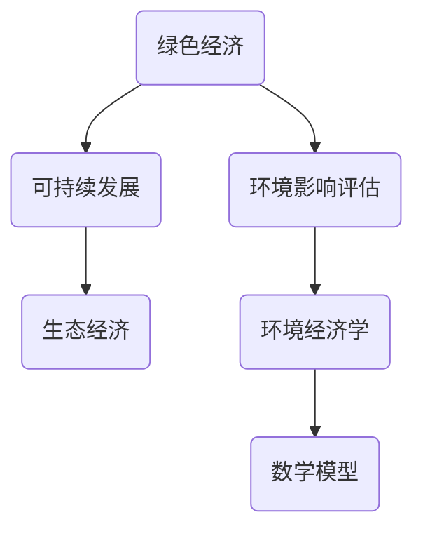

                 


## 《数学与绿色经济：环保经济的数学评估》

### 关键词：绿色经济，数学评估，环保绩效，可持续发展，环境影响评价

### 摘要

本文旨在探讨绿色经济的数学评估方法及其在环保经济领域的应用。通过对绿色经济概念的理解，我们将介绍一系列数学模型和工具，用于评估环保经济的绩效和影响。文章分为三大部分：引论、绿色经济的数学评估方法和案例分析、以及总结与展望。通过逐步分析和推理，我们将深入理解绿色经济的本质，为实践中的环保决策提供科学依据。

### 第一部分：引论

#### 第1章：绿色经济的概念与数学分析框架

绿色经济是一种以可持续发展为核心的经济模式，它强调在经济发展的同时，保护生态环境和资源。为了深入理解绿色经济的内涵，我们首先需要了解以下几个核心概念：

- **可持续发展**：满足当前需求而不损害后代满足其需求的能力。
- **环境影响评估**：对项目或政策实施过程中对环境可能产生的影响进行评估。
- **生态经济**：将生态环境视为经济系统的一部分，进行综合评价。
- **环境经济学**：研究环境资源的经济价值和如何优化配置。

为了更好地理解这些概念之间的联系，我们可以使用Mermaid流程图进行展示：



接下来，我们介绍评估环保经济绩效的常用数学模型。其中，环境影响评价指数（EPI）是一个重要的指标，用于衡量环境影响的大小。其公式如下：

$$
EPI = \frac{E_c - E_p}{E_c + E_p}
$$

其中，\( E_c \) 表示当前环境影响，\( E_p \) 表示计划环境影响。这个公式可以帮助我们直观地了解项目实施后环境影响的改善程度。

#### 第2章：绿色经济中的数学方法与工具

绿色经济的数学评估需要运用一系列的数学方法和工具。其中，线性规划算法是一种常用的优化方法，用于解决资源分配问题。以下是线性规划算法的伪代码：

```plaintext
// 输入：目标函数f(x)，约束条件g_i(x) <= 0
// 输出：最优解x*
Function LinearProgramming(f, g):
    x = [初始解]
    while 不收敛:
        求解梯度g'(x)
        更新x：x = x - alpha * g'(x)
    return x
```

这个算法可以帮助我们找到最优的资源分配方案，以实现环保目标。

### 第二部分：绿色经济的数学评估方法

#### 第3章：环境影响评估的数学模型

环境影响评估是绿色经济评估的重要组成部分。为了评估项目或政策的环境影响，我们需要建立相应的数学模型。其中，环境影响评价指数（EPI）是一个常用的指标。其公式如下：

$$
EPI = \frac{E_c - E_p}{E_c + E_p}
$$

通过这个公式，我们可以计算项目实施前后的环境影响差异，从而评估项目的环保效益。

#### 第4章：环境经济学的数学方法

环境经济学研究环境资源的经济价值和如何优化配置。为了评估环境资源的经济价值，我们可以使用成本效益分析（CBA）方法。其公式如下：

$$
CBA = \frac{\sum_{i=1}^{n} (B_i - C_i)}{n}
$$

其中，\( B_i \) 表示第 \( i \) 个项目的效益，\( C_i \) 表示第 \( i \) 个项目的成本。通过这个公式，我们可以评估不同项目的经济价值，从而选择最优的项目方案。

#### 第5章：碳排放与气候变化的经济模型

碳排放和气候变化是当前全球关注的重要环境问题。为了评估碳排放的经济影响，我们可以使用碳税模型。其公式如下：

$$
T = \frac{C \cdot q}{100}
$$

其中，\( T \) 表示碳税，\( C \) 表示碳的价格，\( q \) 表示碳排放量。通过这个模型，我们可以计算碳税对碳排放的调控效果。

#### 第6章：绿色金融的数学评估

绿色金融是支持绿色经济发展的重要手段。为了评估绿色金融产品的经济效益，我们可以使用债券评估模型。其公式如下：

```plaintext
// 输入：债券收益r，风险溢价p，市场利率i
// 输出：债券评估值V
Function GreenBondEvaluation(r, p, i):
    V = r / (1 + i)^n
    return V
```

这个模型可以帮助我们评估绿色债券的经济价值。

#### 第7章：绿色经济的政策分析

绿色经济政策的实施需要科学的评估方法。为了评估政策的效果，我们可以使用环境补贴模型。其公式如下：

$$
S = C \cdot (1 - e^{-kt})
$$

其中，\( S \) 表示补贴金额，\( C \) 表示初始成本，\( k \) 表示补贴效率，\( t \) 表示时间。通过这个模型，我们可以评估政策对环保经济的推动作用。

### 第三部分：结论与展望

#### 第8章：绿色经济的数学评估总结与展望

通过对绿色经济的数学评估方法的探讨，我们可以看到数学在环保经济领域的重要作用。未来的研究方向可以包括：

- **改进现有模型**：进一步完善和优化现有的数学评估模型，提高评估的准确性。
- **跨学科研究**：结合经济学、环境科学等多学科知识，为绿色经济提供更全面的理论支持。
- **政策建议**：基于数学评估结果，为政府制定环保政策提供科学依据。

### 结论

绿色经济的数学评估是一项复杂而重要的任务。通过本文的探讨，我们了解了绿色经济的核心概念、数学评估方法和实际应用。希望本文能为大家提供有价值的参考，共同推动绿色经济的发展。

### 作者信息

作者：AI天才研究院/AI Genius Institute & 禅与计算机程序设计艺术 /Zen And The Art of Computer Programming

