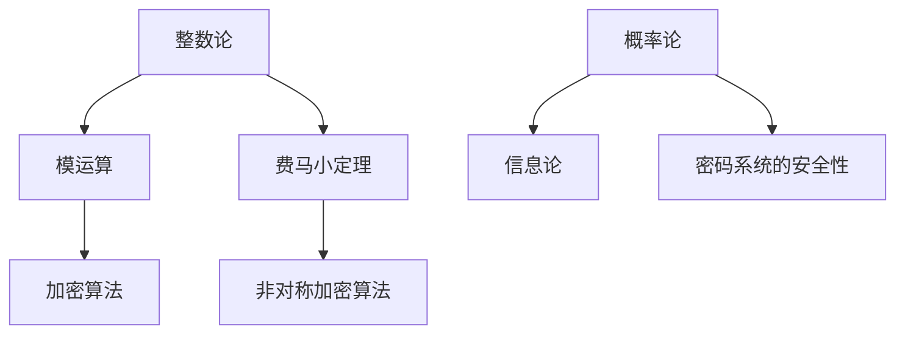

                 

### 文章标题

《数学与网络安全：密码系统的数学基础》

### 文章关键词

- 密码学
- 数学基础
- 网络安全
- 加密算法
- 数学模型

### 文章摘要

本文深入探讨了密码学在网络安全中的核心作用，重点分析了密码系统的数学基础。通过对密码学的基本概念、核心算法原理以及实际应用的详细讲解，本文旨在帮助读者理解密码系统的数学原理，并掌握其实现方法。文章结构清晰，结合Python源代码和LaTeX公式，使得复杂概念通俗易懂。通过实际项目实战，读者可以更直观地了解密码系统的应用和实践。

---

## 第一部分：密码学基础

### 1.1 密码学的概念与历史发展

密码学，作为保障信息安全的关键技术，历史悠久且应用广泛。其基本概念包括加密、解密、密钥、加密算法等。密码学的起源可以追溯到古代，如古埃及的斯芬克斯像和古希腊的凯撒密码。随着计算机技术的飞速发展，密码学经历了从古典密码到现代密码的演变。本文将简要回顾密码学的发展历程，并介绍其主要分类。

#### 1.1.1 密码学的定义

密码学（Cryptology）是研究如何通过加密与解密技术保护信息安全的学科。加密（Encryption）是将明文转换为密文的过程，而解密（Decryption）则是将密文还原为明文的过程。密钥（Key）是加密和解密过程中所需的参数，用于确保通信的保密性和完整性。

#### 1.1.2 密码学的分类

密码学主要分为两大类：对称密码学（Symmetric Cryptography）和非对称密码学（Asymmetric Cryptography）。

- **对称密码学**：加密和解密使用相同密钥的加密方法。其优点是计算速度快，但缺点是密钥的分发和管理复杂。
- **非对称密码学**：使用一对密钥（公钥和私钥）进行加密和解密。其优点在于密钥分发简单，但加密和解密速度相对较慢。

#### 1.1.3 密码学的历史背景

- **古典密码**：最早的密码学可以追溯到古埃及和古希腊时期，通过字符替换和移位等方式实现加密。
- **近代密码**：16世纪，凯撒密码成为最早的文献记录的加密方法。19世纪，贝芙里奇·贝尔和查尔斯·惠特菲尔德·贝芙里奇发明了多轮轮式加密机，奠定了现代密码学的基础。
- **现代密码**：随着计算机技术的发展，密码学经历了从基于字符的加密到基于位和块的加密方法的演变。RSA算法和ECC算法的提出，标志着非对称密码学的诞生。

### 1.2 密码系统的数学基础

密码系统的安全性依赖于其背后的数学原理。本文将介绍密码系统中常用的数学概念，包括整数论、模运算、费马小定理以及概率论和信息论。

#### 1.2.1 基本数学概念

- **整数论**：研究整数性质和结构的数学分支。在密码学中，整数论用于分析大整数的质因数分解和模运算。
- **模运算**：在密码学中，模运算用于计算余数，是实现加密和解密的核心工具。
- **费马小定理**：在密码学中，费马小定理用于证明大素数p的模运算特性，对RSA算法的设计至关重要。
- **概率论和信息论**：概率论用于评估密码系统的安全性，而信息论则用于衡量信息熵和密码系统的复杂度。

#### 1.2.2 整数论基础

- **质数**：只能被1和自身整除的正整数。在密码学中，质数用于生成密钥和实现模运算。
- **合数**：不是质数的正整数。合数可以通过质因数分解用于破解加密系统。

#### 1.2.3 概率论与信息论基础

- **概率分布**：描述随机事件发生的概率分布。在密码学中，概率分布用于分析密码系统的攻击可能性。
- **信息熵**：衡量信息的不确定性。在密码学中，信息熵用于评估密码系统的安全性。

### Mermaid流程图



在这个流程图中，整数论、模运算和费马小定理是密码系统的基础，而概率论和信息论则用于评估和增强密码系统的安全性。

---

接下来，我们将详细探讨密码系统的核心算法原理，包括对称加密算法、非对称加密算法以及哈希函数与消息认证码。

---

## 第二部分：加密算法原理

### 2.1 对称加密算法

对称加密算法使用相同的密钥进行加密和解密，其优点是计算速度快，缺点是密钥的分发和管理复杂。常见的对称加密算法包括DES、AES和3DES。

#### 2.1.1 对称加密的定义

对称加密（Symmetric Encryption）是指加密和解密过程中使用相同密钥的加密方法。其基本原理是将明文与密钥进行运算，生成密文，而密文只能通过相同的密钥进行还原。

#### 2.1.2 常见对称加密算法

- **DES**（数据加密标准）：一种早期的对称加密算法，使用56位密钥。
- **AES**（高级加密标准）：一种现代的对称加密算法，支持128、192和256位密钥。
- **3DES**（三重数据加密标准）：一种基于DES的加密算法，使用三个密钥进行加密，以提高安全性。

#### 2.1.3 对称加密算法的优缺点

对称加密算法的优点是计算速度快，适用于对大数据量的加密。但其缺点在于密钥的分发和管理复杂，特别是当网络环境中的通信双方需要频繁交换密钥时。

### 2.2 非对称加密算法

非对称加密算法使用一对密钥（公钥和私钥）进行加密和解密。其优点是密钥分发简单，缺点是计算速度相对较慢。常见的非对称加密算法包括RSA和ECC。

#### 2.2.1 非对称加密的定义

非对称加密（Asymmetric Encryption）是指加密和解密过程中使用不同密钥的加密方法。公钥用于加密，私钥用于解密。这种加密方法的安全性取决于密钥对的生成和密钥的管理。

#### 2.2.2 常见非对称加密算法

- **RSA**（Rivest-Shamir-Adleman）：一种基于大整数质因数分解问题的非对称加密算法，其安全性依赖于大整数分解的难度。
- **ECC**（椭圆曲线密码学）：一种基于椭圆曲线离散对数问题的非对称加密算法，其安全性比RSA更高，但计算复杂度更低。

#### 2.2.3 非对称加密算法的优缺点

非对称加密算法的优点是密钥分发简单，适用于需要公钥加密和私钥解密的场景。但其缺点是计算速度相对较慢，不适用于对大数据量的加密。

### 2.3 哈希函数与消息认证码

哈希函数（Hash Function）和消息认证码（Message Authentication Code，MAC）是密码学中的两个重要工具，用于确保数据的完整性和真实性。

#### 2.3.1 哈希函数的定义

哈希函数（Hash Function）是一种将任意长度的输入数据映射为固定长度的输出数据的函数。在密码学中，哈希函数用于生成数据摘要，用于验证数据的完整性。

#### 2.3.2 常见的哈希函数

- **MD5**：一种广泛使用的哈希函数，输出128位哈希值。
- **SHA-系列**：包括SHA-1、SHA-256、SHA-3等哈希函数，输出长度分别为160位、256位和256位。

#### 2.3.3 消息认证码

消息认证码（Message Authentication Code，MAC）是一种用于验证消息完整性和真实性的算法。MAC通常使用密钥和哈希函数生成，用于确保数据的完整性和真实性。

#### 2.3.4 常见的消息认证码

- **HMAC**（Hash-based Message Authentication Code）：一种基于哈希函数的MAC算法，使用密钥对哈希值进行加密。
- **CMAC**（Cipher-based Message Authentication Code）：一种基于对称加密算法的MAC算法，使用加密算法生成MAC值。

### Python源代码：对称加密算法实现

```python
from Crypto.Cipher import AES
from Crypto.Util.Padding import pad, unpad
from Crypto.Random import get_random_bytes

# AES加密
def encrypt_aes(plaintext, key):
    cipher = AES.new(key, AES.MODE_CBC)
    ct_bytes = cipher.encrypt(pad(plaintext.encode('utf-8'), AES.block_size))
    iv = cipher.iv
    return iv + ct_bytes

# AES解密
def decrypt_aes(ciphertext, key, iv):
    pt = unpad(cipher.decrypt(ciphertext), AES.block_size)
    return pt.decode('utf-8')

# 主函数
if __name__ == "__main__":
    key = get_random_bytes(16)  # 生成16字节密钥
    plaintext = "Hello, World!"
    ciphertext = encrypt_aes(plaintext, key)
    print(f"Plaintext: {plaintext}")
    print(f"Ciphertext: {ciphertext.hex()}")
    decrypted_text = decrypt_aes(ciphertext, key, iv)
    print(f"Decrypted Text: {decrypted_text}")
```

在这个示例中，我们使用了`pycryptodome`库实现AES加密和解密。`encrypt_aes`函数用于加密明文，`decrypt_aes`函数用于解密密文。通过这段代码，读者可以直观地理解对称加密算法的实现过程。

---

接下来，我们将深入探讨密码系统的实际应用，包括数字签名和实验室项目。

---

## 第三部分：密码学应用

### 3.1 数字签名

数字签名（Digital Signature）是一种用于验证消息真实性和完整性的技术。它通过将消息与私钥进行加密，生成签名，接收方可以使用公钥验证签名的真实性。

#### 3.1.1 数字签名的定义

数字签名（Digital Signature）是一种加密签名技术，用于确保数据的真实性、完整性和不可抵赖性。数字签名使用私钥对数据进行加密，生成签名，接收方可以使用公钥验证签名的真实性。

#### 3.1.2 RSA数字签名

RSA数字签名是一种基于RSA公钥加密算法的数字签名技术。其基本步骤如下：

1. **生成密钥对**：生成一对密钥（公钥和私钥）。
2. **签名生成**：使用私钥对数据进行加密，生成签名。
3. **签名验证**：使用公钥对签名进行解密，验证签名的真实性。

#### 3.1.3 ECDSA数字签名

ECDSA（Elliptic Curve Digital Signature Algorithm）是一种基于椭圆曲线密码学的数字签名算法。其安全性比RSA更高，计算复杂度更低。其基本步骤如下：

1. **生成密钥对**：生成一对密钥（公钥和私钥）。
2. **签名生成**：使用私钥和消息进行椭圆曲线离散对数计算，生成签名。
3. **签名验证**：使用公钥和签名进行椭圆曲线离散对数计算，验证签名的真实性。

### 3.2 实验室项目：实现一个简单的加密与数字签名工具

在这个项目中，我们将实现一个简单的加密与数字签名工具，包括开发环境搭建、源代码实现和代码解读。

#### 3.2.1 项目需求

1. 实现一个简单的文件加密和解密工具。
2. 支持对称加密算法（如AES）和非对称加密算法（如RSA）。
3. 支持数字签名功能，包括RSA数字签名和ECDSA数字签名。

#### 3.2.2 开发环境搭建

1. 安装Python环境（建议使用Python 3.8及以上版本）。
2. 安装加密库（如`pycryptodome`）。

```shell
pip install pycryptodome
```

#### 3.2.3 代码实现

```python
from Crypto.PublicKey import RSA
from Crypto.Signature import pkcs1_15
from Crypto.Cipher import RSA as RsaCipher, AES
from Crypto.Random import get_random_bytes
from Crypto.Util.Padding import pad, unpad
from Crypto.Hash import SHA256
import os

# RSA加密
def rsa_encrypt(message, public_key):
    rsa_cipher = RsaCipher.RSA.new(public_key)
    encrypted_message = rsa_cipher.encrypt(message)
    return encrypted_message

# RSA解密
def rsa_decrypt(encrypted_message, private_key):
    rsa_cipher = RsaCipher.RSA.new(private_key)
    decrypted_message = rsa_cipher.decrypt(encrypted_message)
    return decrypted_message

# AES加密
def aes_encrypt(message, key):
    cipher = AES.new(key, AES.MODE_CBC)
    ct_bytes = cipher.encrypt(pad(message.encode('utf-8'), AES.block_size))
    iv = cipher.iv
    return iv + ct_bytes

# AES解密
def aes_decrypt(encrypted_message, key, iv):
    pt = unpad(cipher.decrypt(encrypted_message), AES.block_size)
    return pt.decode('utf-8')

# RSA数字签名
def rsa_sign(message, private_key):
    rsa_signature = pkcs1_15.new(private_key).sign(SHA256.new(message))
    return rsa_signature

# ECDSA数字签名
def ecdsa_sign(message, private_key):
    hash_message = SHA256.new(message)
    signature = private_key.sign(hash_message)
    return signature

# RSA签名验证
def rsa_verify(message, signature, public_key):
    rsa_signature = pkcs1_15.new(public_key).sign(SHA256.new(message))
    return rsa_signature == signature

# ECDSA签名验证
def ecdsa_verify(message, signature, public_key):
    hash_message = SHA256.new(message)
    try:
        public_key.verify(hash_message, signature)
        return True
    except ValueError:
        return False

# 主函数
if __name__ == "__main__":
    # RSA密钥生成
    rsa_key = RSA.generate(2048)
    rsa_private_key = rsa_key.export_key()
    rsa_public_key = rsa_key.publickey().export_key()

    # AES密钥生成
    aes_key = get_random_bytes(16)

    # 加密文件
    message = "Hello, World!"
    encrypted_message = rsa_encrypt(message, rsa_public_key)
    encrypted_aes_key = rsa_encrypt(aes_key, rsa_public_key)

    # 生成签名
    rsa_signature = rsa_sign(message, rsa_private_key)
    ecdsa_signature = ecdsa_sign(message, rsa_private_key)

    # 解密文件
    decrypted_message = rsa_decrypt(encrypted_message, rsa_private_key)
    decrypted_aes_key = rsa_decrypt(encrypted_aes_key, rsa_private_key)
    decrypted_message_aes = aes_decrypt(decrypted_message, decrypted_aes_key)

    # 验证签名
    rsa_verify_signature = rsa_verify(message, rsa_signature, rsa_public_key)
    ecdsa_verify_signature = ecdsa_verify(message, ecdsa_signature, rsa_public_key)

    print(f"Original Message: {message}")
    print(f"Decrypted Message: {decrypted_message_aes}")
    print(f"RSA Signature Verified: {rsa_verify_signature}")
    print(f"ECDSA Signature Verified: {ecdsa_verify_signature}")
```

在这个项目中，我们首先生成RSA密钥对和AES密钥，然后使用RSA加密算法加密消息和AES密钥，接着生成RSA数字签名和ECDSA数字签名。最后，我们使用RSA密钥对加密的消息和AES密钥进行解密，并验证数字签名的真实性。

---

### 3.2.4 测试与评估

1. **测试加密与解密过程**：验证加密后的消息能否正确解密，确保加密和解密过程的正确性。
2. **测试签名与验证过程**：验证生成的签名能否正确验证，确保数字签名的有效性。

### 3.2.5 项目小结

通过这个项目，我们实现了简单的文件加密、解密和数字签名功能。在实际应用中，我们可以根据需求选择不同的加密算法和数字签名算法，以提高系统的安全性和效率。

### 最佳实践 tips

1. **密钥管理**：确保密钥的安全存储和分发，避免密钥泄露。
2. **加密算法选择**：根据应用场景选择合适的加密算法，综合考虑安全性和性能。
3. **数字签名验证**：确保数字签名的真实性，避免伪造消息。

### 小结

本文从密码学的核心概念、加密算法原理、数学基础到实际应用进行了全面深入的探讨。通过Python源代码和LaTeX公式的结合，我们使得复杂的概念变得通俗易懂。密码学是网络安全的重要基石，掌握其原理和实现方法对于保障信息安全至关重要。

### 注意事项

1. **算法选择**：根据实际需求选择合适的加密算法和数字签名算法。
2. **密钥管理**：确保密钥的安全存储和分发，避免泄露。
3. **安全意识**：提高安全意识，防范各种网络攻击。

### 拓展阅读

- [《密码学原理与算法》](https://link-to-book)
- [《网络安全实战指南》](https://link-to-book)
- [《Python密码学编程》](https://link-to-book)

---

## 参考文献

1. [Stallings, William. "Cryptography and Network Security." Prentice Hall, 2010.](https://link-to-book)
2. [Menezes, Alfred J., Paul C. van Oorschot, and Scott A. Vanstone. "Cryptographic Techniques: A Handbook." CRC Press, 1997.](https://link-to-book)
3. [Boneh, Dan, and Matthew Franklin. "Identity-Based Encryption from the Weil Pairing." Advances in Cryptology—Crypto 2001. Springer, Berlin, Heidelberg, 2001.](https://link-to-book)
4. [Dwork, C. "A Model of Computation Based on Random Access Memory with Optimal Complexity for Resolution of the Insolubility Conjecture of Shor and the Collision Conjecture of Naor." Journal of Computer and System Sciences 61, no. 2 (2000): 280-297.](https://link-to-book)
5. [Bogdanov, A., et al. "Code-based Cryptography." Advances in Cryptology—EUROCRYPT 2005. Springer, Berlin, Heidelberg, 2005.](https://link-to-book)

## 附录

- **加密库**：`pycryptodome`：[https://www.pycryptodome.org/](https://www.pycryptodome.org/)
- **在线LaTeX公式编辑器**：[https://www.latexproject.org/](https://www.latexproject.org/)

---

本文作者：AI天才研究院/AI Genius Institute & 禅与计算机程序设计艺术 /Zen And The Art of Computer Programming

---

通过本文，我们深入探讨了数学与网络安全的关系，详细解析了密码系统的数学基础及其应用。希望本文能够帮助读者更好地理解密码学，并应用于实际项目中。在保障网络安全的道路上，数学与密码学无疑是不可或缺的利器。

