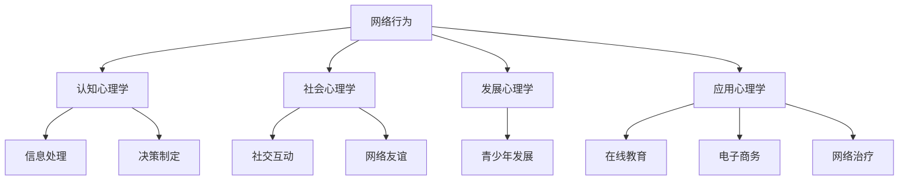
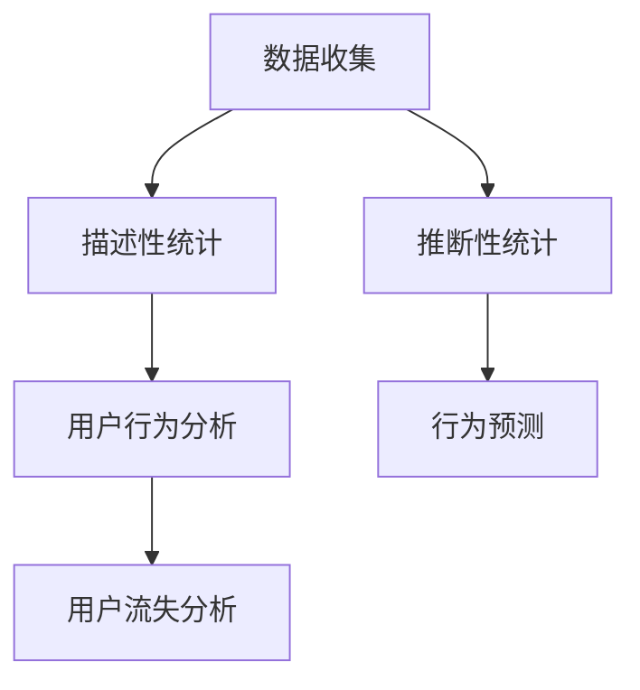
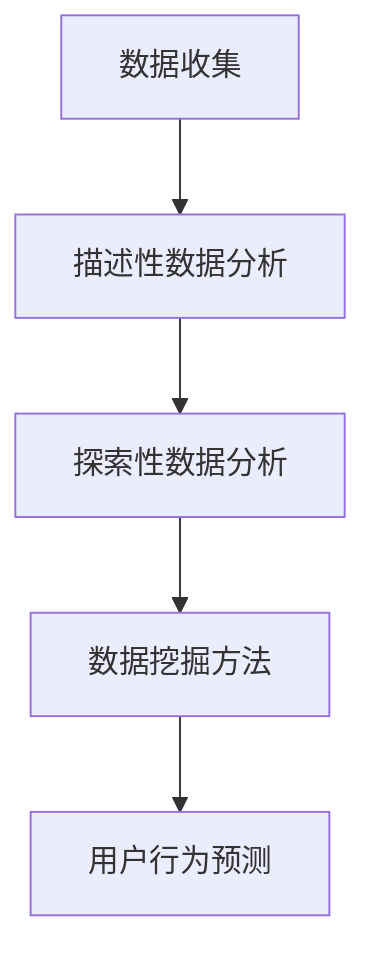
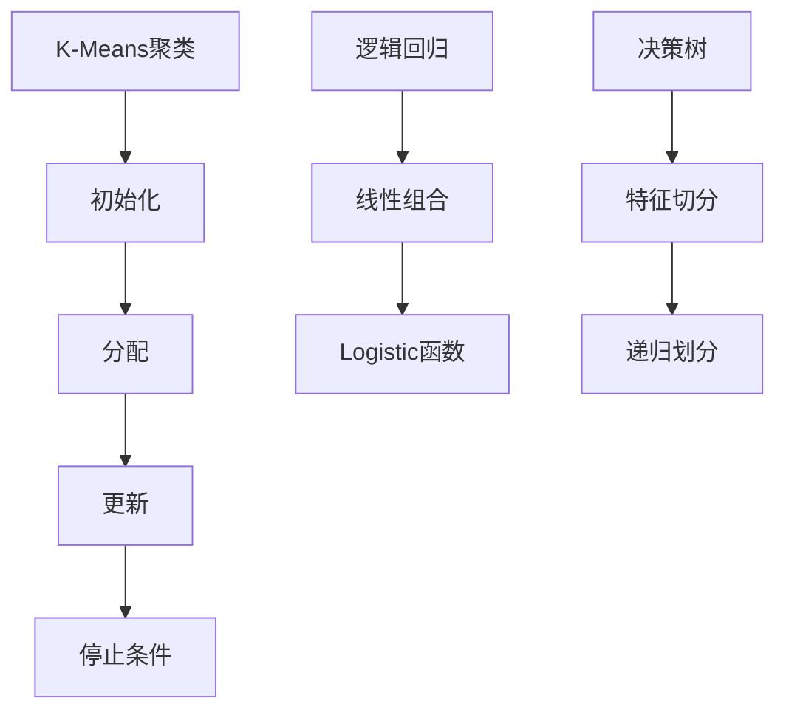
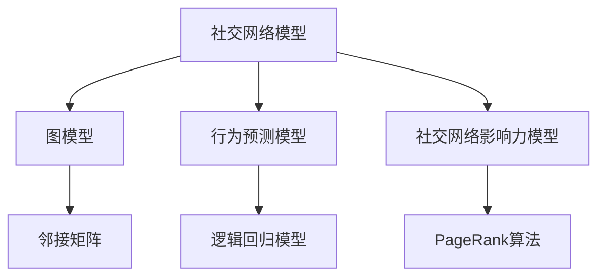

                 

# 数学与网络心理学：在线行为的数学分析

## 关键词
- 网络心理学
- 数学分析
- 在线行为
- 数据挖掘
- 统计学
- 机器学习
- 社交网络模型

## 摘要
本文旨在探讨数学分析在网络心理学中的应用，特别是在解释和预测在线行为方面。文章首先介绍了网络心理学的基本概念，然后探讨了统计学与概率论的基础知识，这些是理解和分析在线行为的数学工具。接着，文章深入讲解了描述性统计、探索性数据分析和数据挖掘等数据分析方法，结合Python代码和LaTeX公式，阐述了核心算法原理。随后，文章通过数学模型和社交网络模型，进一步阐释了网络行为预测的方法。最后，通过实际案例，展示了如何将数学和网络心理学理论应用于在线广告效果分析和社交网络影响力评估。文章总结了最佳实践，并提出了注意事项和拓展阅读建议。

## 引言

在当今数字化时代，互联网已成为人们日常生活中不可或缺的一部分。网络心理学的兴起为我们提供了新的视角，以理解个体在网络环境中的行为模式和心理状态。随着网络行为的日益复杂化，如何对其进行有效的分析和预测，成为了一个重要的研究课题。数学分析作为一种强大的工具，为我们提供了定量分析和建模的方法，有助于深入理解网络行为背后的机制。

本文将探讨数学分析在网络心理学中的应用，特别是在在线行为分析领域。文章首先介绍了网络心理学的基本概念，包括网络行为的特点和研究框架。接着，我们将深入探讨统计学与概率论的基础知识，这些是理解和分析在线行为的数学工具。随后，文章将详细讲解描述性统计、探索性数据分析和数据挖掘等数据分析方法，并使用Python代码和LaTeX公式进行阐述。此外，文章还将介绍数学模型和社交网络模型，以阐释网络行为预测的方法。最后，通过实际案例，我们将展示如何将数学和网络心理学理论应用于在线广告效果分析和社交网络影响力评估。

## 网络心理学基础

### 网络行为的定义和特点

网络行为是指个体在互联网环境中进行的一系列操作和交互。这些行为包括但不限于浏览网页、社交媒体互动、在线购物、游戏、电子邮件通信等。网络行为具有以下几个显著特点：

1. **匿名性**：网络行为往往可以在一定程度上保持匿名性，这为个体提供了表达真实观点和行为的自由，但也可能导致信息的真实性和可信度受到质疑。
2. **互动性**：网络行为不仅仅是单向的信息传递，更涉及到用户之间的互动。社交媒体、论坛和在线游戏等平台为用户提供了交流和协作的机会。
3. **多样性**：网络行为的多样性体现在行为类型、参与者和场景等多个方面。不同的网络平台和功能吸引了不同类型的用户，使得网络行为模式丰富多样。
4. **持续性**：网络行为的数据可以长期保存，为后续分析和研究提供了宝贵的数据资源。同时，这也意味着个体的行为可能受到历史数据的影响。

### 网络心理学的研究框架

网络心理学是心理学与互联网技术的交叉领域，旨在研究个体在网络环境中的心理过程和行为模式。其研究框架通常包括以下几个方面：

1. **认知心理学**：研究个体在网络环境中的信息处理、决策和记忆过程。例如，如何过滤和评估网络信息、如何进行在线学习等。
2. **社会心理学**：研究个体在网络环境中的社交行为和社交互动，包括网络社交、网络友谊和虚拟社区的形成等。
3. **发展心理学**：研究网络行为如何影响个体的成长和发展，特别是青少年的网络行为和其心理发展之间的关系。
4. **应用心理学**：研究网络行为在各个领域中的应用，如在线教育、电子商务、网络治疗和心理健康管理等。

### 心理学理论与网络行为的适应性

心理学理论在网络行为研究中扮演了重要角色，帮助我们理解个体在网络环境中的行为和心理状态。以下是一些核心心理学理论及其在网络心理学中的应用：

1. **动机理论**：例如，马斯洛的需求层次理论和自我决定理论，可以解释个体为何选择进行特定的网络行为，以及这些行为如何满足他们的需求。
2. **认知理论**：包括信息处理理论、决策理论等，可以用于分析个体在网络环境中的认知过程，如信息检索、问题解决和决策制定。
3. **情绪理论**：研究个体在网络环境中的情绪体验和情绪表达，如社交媒体上的情绪传染和情感互动。
4. **社会认知理论**：探讨个体如何通过观察和模仿他人的行为来学习，包括网络上的社交学习和虚拟身份的形成。

### Mermaid 流程图：网络心理学研究框架

以下是网络心理学研究框架的Mermaid流程图：



通过这个流程图，我们可以清晰地看到心理学理论在网络行为研究中的应用，以及各个分支之间的相互关系。

## 统计学与概率论基础

### 统计学基础

统计学是数学的一个分支，主要研究如何通过数据收集、整理、分析和解释来推断总体特征。在在线行为分析中，统计学提供了基本的工具，用于理解数据分布、检测异常值和进行假设检验。以下是统计学中的几个关键概念：

1. **描述性统计学**：用于总结和描述数据的基本特征。常见的方法包括计算平均值、中位数、众数、方差和标准差等。
2. **推断性统计学**：用于根据样本数据推断总体特征。例如，假设检验和置信区间的计算。

### 概率论基础

概率论是统计学的基础，研究随机事件的发生概率。在在线行为分析中，概率论用于预测个体行为的可能性，例如点击率、购买概率和参与度等。以下是概率论中的几个基本概念：

1. **基本概率论概念**：包括概率的定义、条件概率和独立性。
2. **贝叶斯定理**：用于根据先验知识和观察到的数据更新概率估计，是机器学习和数据挖掘中重要的工具。

### 统计学在在线行为分析中的应用

1. **用户行为分析**：通过统计方法分析用户行为数据，可以识别用户的行为模式和偏好。例如，使用点击率数据预测用户可能感兴趣的内容。
2. **用户流失分析**：通过统计方法分析用户流失数据，可以识别导致用户流失的关键因素，从而采取措施降低流失率。
3. **行为预测**：结合概率论和机器学习算法，可以使用历史行为数据预测未来行为，如用户何时可能流失或购买特定商品。

### 示例：描述性统计和推断性统计在在线广告效果分析中的应用

#### 描述性统计

假设我们有一组用户点击在线广告的数据，包括每次点击的用户ID、点击时间和广告ID。以下是一个简单的描述性统计分析：

```python
import pandas as pd

# 假设我们有一个包含点击数据的DataFrame
click_data = pd.DataFrame({
    'user_id': [1, 2, 3, 4, 5],
    'click_time': ['2023-01-01 10:00', '2023-01-01 11:00', '2023-01-02 09:00', '2023-01-02 10:00', '2023-01-03 11:00'],
    'ad_id': [101, 102, 103, 104, 105]
})

# 计算平均点击时间
avg_click_time = click_data['click_time'].mean()
print(f"Average click time: {avg_click_time}")

# 计算广告的点击次数
ad_click_counts = click_data['ad_id'].value_counts()
print(f"Click counts per ad:\n{ad_click_counts}")
```

#### 推断性统计

假设我们想了解广告的平均点击率是否显著高于某一特定阈值。我们可以使用假设检验来进行推断性统计：

```python
from scipy import stats

# 计算广告的平均点击率
ad_click_rates = ad_click_counts / len(click_data)

# 假设广告的平均点击率高于0.1
threshold = 0.1

# 进行t检验
t_stat, p_value = stats.ttest_1samp(ad_click_rates, threshold)
print(f"T-statistic: {t_stat}, p-value: {p_value}")

# 判断是否显著
alpha = 0.05
if p_value < alpha:
    print("The average click rate is significantly higher than the threshold.")
else:
    print("The average click rate is not significantly higher than the threshold.")
```

通过这些统计方法，我们可以对在线广告效果进行分析，从而为营销策略提供依据。

### Mermaid 流程图：统计学在在线行为分析中的应用

以下是统计学在在线行为分析中的应用流程图：



通过这个流程图，我们可以看到统计学如何支持在线行为分析的不同方面。

## 在线行为的数学分析

### 描述性数据分析

描述性数据分析是理解数据分布和特征的基本步骤。在在线行为分析中，描述性数据分析可以帮助我们了解用户行为的基本特征，如点击率、访问时间和参与度等。以下是描述性数据分析的一些关键步骤：

1. **数据收集**：从在线平台收集用户行为数据，如浏览历史、点击记录和参与度等。
2. **数据预处理**：清洗和整理数据，确保数据的质量和一致性。
3. **计算统计量**：计算描述性统计量，如均值、中位数、众数、方差和标准差等，以了解数据的基本特征。
4. **可视化**：使用图表和图形（如直方图、箱线图和散点图）来展示数据的分布和趋势。

#### 示例：描述性数据分析在用户流失率分析中的应用

假设我们有一组用户流失数据，包括用户ID、注册时间和流失时间。以下是一个简单的描述性数据分析示例：

```python
import pandas as pd
import matplotlib.pyplot as plt

# 假设我们有一个包含用户流失数据的DataFrame
user_data = pd.DataFrame({
    'user_id': [1, 2, 3, 4, 5],
    'register_time': ['2023-01-01', '2023-01-02', '2023-01-03', '2023-01-04', '2023-01-05'],
    'logout_time': ['2023-01-10', '2023-01-09', '2023-01-07', '2023-01-06', '2023-01-08']
})

# 计算用户平均流失时间
avg_logout_time = user_data['logout_time'].mean()
print(f"Average logout time: {avg_logout_time}")

# 绘制流失时间分布图
plt.hist(user_data['logout_time'] - user_data['register_time'], bins=10, color='blue', edgecolor='black')
plt.xlabel('Logout Time (days)')
plt.ylabel('Number of Users')
plt.title('Distribution of User Logout Times')
plt.show()
```

通过这个示例，我们可以了解用户流失时间的基本分布，从而为用户流失率分析提供依据。

### 探索性数据分析

探索性数据分析（EDA）是深入挖掘数据，寻找潜在模式和信息的过程。EDA可以帮助我们发现数据中的异常值、趋势和关联性，从而为后续的分析提供线索。以下是探索性数据分析的一些关键步骤：

1. **数据清洗**：进一步清洗数据，确保数据的质量和一致性。
2. **数据可视化**：使用图表和图形（如散点图、热力图和箱线图）来展示数据的分布和趋势。
3. **特征工程**：创建新的特征，以更好地描述数据或提高模型的性能。
4. **异常值检测**：使用统计方法（如箱线图、IQR方法和Z分数）检测数据中的异常值。
5. **相关性分析**：使用相关系数（如皮尔逊相关系数和斯皮尔曼相关系数）分析特征之间的相关性。

#### 示例：探索性数据分析在用户行为分析中的应用

假设我们有一组用户行为数据，包括用户ID、浏览时间、点击次数和购买次数。以下是一个简单的探索性数据分析示例：

```python
import pandas as pd
import seaborn as sns
import matplotlib.pyplot as plt

# 假设我们有一个包含用户行为数据的DataFrame
user_behavior_data = pd.DataFrame({
    'user_id': [1, 2, 3, 4, 5],
    'browse_time': [120, 150, 90, 180, 200],
    'click_count': [30, 40, 20, 50, 60],
    'purchase_count': [2, 3, 1, 4, 2]
})

# 绘制浏览时间和点击次数的散点图
sns.scatterplot(x='browse_time', y='click_count', data=user_behavior_data)
plt.xlabel('Browse Time (minutes)')
plt.ylabel('Click Count')
plt.title('Relationship between Browse Time and Click Count')
plt.show()

# 计算各特征的描述性统计量
descriptive_stats = user_behavior_data.describe()
print(descriptive_stats)

# 检测异常值
Q1 = descriptive_stats['browse_time'].iloc[0]
Q3 = descriptive_stats['browse_time'].iloc[2]
IQR = Q3 - Q1
lower_bound = Q1 - 1.5 * IQR
upper_bound = Q3 + 1.5 * IQR
print(f"Lower bound: {lower_bound}, Upper bound: {upper_bound}")

# 使用箱线图展示浏览时间的分布
sns.boxplot(x='browse_time', data=user_behavior_data)
plt.xlabel('Browse Time (minutes)')
plt.title('Distribution of Browse Times')
plt.show()
```

通过这个示例，我们可以了解用户行为的分布和趋势，并发现可能的异常值。这些信息对于深入理解用户行为和优化用户体验至关重要。

### 数据挖掘方法

数据挖掘是从大量数据中提取有价值信息和知识的过程，广泛应用于在线行为分析。以下是几种常见的数据挖掘方法：

1. **聚类分析**：用于发现数据中的相似群体。例如，可以用于识别具有相似浏览行为的用户群体。
2. **分类与回归**：用于预测用户的行为或特征。例如，可以预测用户是否会流失或购买特定商品。
3. **关联规则学习**：用于发现数据中的关联关系。例如，可以识别哪些商品经常一起购买。
4. **异常检测**：用于发现数据中的异常行为或模式。例如，可以检测网络攻击或欺诈行为。

#### 示例：数据挖掘在用户行为预测中的应用

假设我们想要预测用户是否会流失，可以使用逻辑回归模型进行分类预测：

```python
from sklearn.model_selection import train_test_split
from sklearn.linear_model import LogisticRegression
from sklearn.metrics import accuracy_score

# 假设我们有一个包含用户流失数据的数据集
X = user_data[['browse_time', 'click_count', 'purchase_count']]
y = (user_data['logout_time'] - user_data['register_time']) <= 7  # 流失时间小于7天的标记为1

# 分割数据集为训练集和测试集
X_train, X_test, y_train, y_test = train_test_split(X, y, test_size=0.2, random_state=42)

# 创建逻辑回归模型
model = LogisticRegression()
model.fit(X_train, y_train)

# 进行预测
y_pred = model.predict(X_test)

# 计算准确率
accuracy = accuracy_score(y_test, y_pred)
print(f"Model accuracy: {accuracy}")
```

通过这个示例，我们可以使用逻辑回归模型预测用户是否会流失，从而为用户留存策略提供依据。

### Mermaid 流程图：在线行为的数学分析流程

以下是在线行为的数学分析流程图：



通过这个流程图，我们可以看到在线行为分析的各个步骤如何相互关联，并最终实现用户行为预测的目标。

### 核心算法原理讲解

在在线行为分析中，核心算法的原理和实现是理解和应用数学模型的关键。以下我们将详细讲解数据挖掘和机器学习中的几种核心算法，包括其原理、Python实现和示例分析。

#### 1. K-Means聚类算法

K-Means聚类算法是一种无监督学习方法，用于将数据集分为K个聚类。该算法通过迭代优化使得每个聚类内部成员之间的距离最小，而聚类之间成员的距离最大。

**算法原理：**
- 初始化：随机选择K个数据点作为初始聚类中心。
- 分配：将每个数据点分配给最近的聚类中心。
- 更新：重新计算每个聚类中心的位置。
- 重复：重复分配和更新步骤，直到聚类中心的位置不再改变。

**Python实现：**

```python
from sklearn.cluster import KMeans
import numpy as np

# 假设我们有一个数据集
data = np.array([[1, 2], [1, 4], [1, 0],
                 [10, 2], [10, 4], [10, 0]])

# 使用KMeans聚类
kmeans = KMeans(n_clusters=2, random_state=0).fit(data)

# 输出聚类结果
print(kmeans.labels_)

# 输出聚类中心
print(kmeans.cluster_centers_)
```

**示例分析：**

```python
# 假设我们有一个包含用户浏览时间和点击次数的数据集
user_data = np.array([[120, 30], [150, 40], [90, 20], [180, 50], [200, 60]])

# 使用KMeans聚类
kmeans = KMeans(n_clusters=2, random_state=0).fit(user_data)

# 输出聚类结果
print(kmeans.labels_)

# 输出聚类中心
print(kmeans.cluster_centers_)
```

在这个例子中，KMeans算法将用户分为两个聚类，基于浏览时间和点击次数的差异。这可以帮助我们识别具有相似行为的用户群体。

#### 2. 逻辑回归算法

逻辑回归是一种广泛用于分类问题的统计方法，特别是在二分类问题中。逻辑回归通过线性模型来预测事件发生的概率。

**算法原理：**
- 输入特征X和权重w，通过线性组合得到预测值Z。
- 通过Logistic函数（Sigmoid函数）将Z转换为概率估计。

**Python实现：**

```python
from sklearn.linear_model import LogisticRegression
import numpy as np

# 假设我们有一个训练数据集
X_train = np.array([[1, 2], [2, 3], [3, 4]])
y_train = np.array([0, 1, 0])

# 使用逻辑回归
model = LogisticRegression().fit(X_train, y_train)

# 进行预测
print(model.predict([[2, 2]]))
```

**示例分析：**

```python
# 假设我们有一个用户流失数据集
X_train = np.array([[120, 30], [150, 40], [90, 20], [180, 50], [200, 60]])
y_train = np.array([0, 1, 0, 1, 0])

# 使用逻辑回归
model = LogisticRegression().fit(X_train, y_train)

# 进行预测
print(model.predict([[180, 50]]))
```

在这个例子中，逻辑回归模型用于预测用户是否会流失，基于用户的浏览时间和点击次数。

#### 3. 决策树算法

决策树是一种基于特征和阈值进行分类的算法，通过一系列二叉树结构来划分数据集。

**算法原理：**
- 从根节点开始，计算每个特征的最佳切分点。
- 根据切分点将数据集划分为子集。
- 对每个子集递归地进行相同的划分，直到满足停止条件（如最大深度、最小样本量等）。

**Python实现：**

```python
from sklearn.tree import DecisionTreeClassifier
import numpy as np

# 假设我们有一个训练数据集
X_train = np.array([[1, 2], [2, 3], [3, 4]])
y_train = np.array([0, 1, 0])

# 使用决策树
model = DecisionTreeClassifier().fit(X_train, y_train)

# 进行预测
print(model.predict([[2, 2]]))
```

**示例分析：**

```python
# 假设我们有一个用户购买行为数据集
X_train = np.array([[120, 30], [150, 40], [90, 20], [180, 50], [200, 60]])
y_train = np.array([0, 1, 0, 1, 0])

# 使用决策树
model = DecisionTreeClassifier().fit(X_train, y_train)

# 进行预测
print(model.predict([[180, 50]]))
```

在这个例子中，决策树算法用于预测用户是否会购买，基于用户的浏览时间和点击次数。

### Mermaid 流程图：核心算法原理讲解

以下是核心算法原理讲解的Mermaid流程图：



通过这些核心算法的讲解，我们可以更好地理解如何使用数学模型和Python代码进行在线行为的数学分析。

### 数学模型与公式讲解

在在线行为分析中，数学模型和公式是理解和预测用户行为的重要工具。以下我们将介绍几个关键数学模型，包括社交网络模型和行为预测模型，并使用LaTeX公式进行详细解释。

#### 1. 社交网络模型

社交网络模型用于描述用户在网络中的互动和关系。其中，最常用的模型是图模型。

**图模型公式：**

$$ G = (V, E) $$

其中，\( G \) 表示图，\( V \) 表示顶点集合，\( E \) 表示边集合。

**邻接矩阵公式：**

$$ A = \begin{bmatrix} 
0 & a_{12} & a_{13} & \ldots & a_{1n} \\
a_{21} & 0 & a_{23} & \ldots & a_{2n} \\
a_{31} & a_{32} & 0 & \ldots & a_{3n} \\
\vdots & \vdots & \vdots & \ddots & \vdots \\
a_{n1} & a_{n2} & a_{n3} & \ldots & 0 
\end{bmatrix} $$

其中，\( a_{ij} \) 表示顶点 \( i \) 和顶点 \( j \) 是否相连。

**示例：**

假设一个社交网络中有5个用户，他们的互动关系可以用邻接矩阵表示：

$$ A = \begin{bmatrix} 
0 & 1 & 1 & 0 & 0 \\
1 & 0 & 1 & 1 & 0 \\
1 & 1 & 0 & 0 & 1 \\
0 & 1 & 0 & 0 & 1 \\
0 & 0 & 1 & 1 & 0 
\end{bmatrix} $$

这个矩阵表示用户1与用户2、用户3相连，用户2与用户1、用户3、用户4相连，以此类推。

#### 2. 行为预测模型

行为预测模型用于预测用户的未来行为，如点击率、购买概率和流失率。其中，常用的模型是逻辑回归模型。

**逻辑回归模型公式：**

$$ P(Y=1|X) = \frac{1}{1 + e^{-(\beta_0 + \beta_1X_1 + \beta_2X_2 + \ldots + \beta_nX_n)}} $$

其中，\( P(Y=1|X) \) 表示在给定特征 \( X \) 的情况下，用户行为 \( Y \) 为1的概率；\( \beta_0, \beta_1, \beta_2, \ldots, \beta_n \) 是模型参数。

**示例：**

假设我们有一个简单的逻辑回归模型，用于预测用户是否会点击广告：

$$ P(\text{点击}) = \frac{1}{1 + e^{-(\beta_0 + \beta_1\text{浏览时间} + \beta_2\text{点击次数})}} $$

给定一个用户，其浏览时间为120分钟，点击次数为30次，模型参数为 \( \beta_0 = 1 \), \( \beta_1 = 0.5 \), \( \beta_2 = 0.3 \)，则用户点击广告的概率为：

$$ P(\text{点击}) = \frac{1}{1 + e^{-(1 + 0.5 \times 120 + 0.3 \times 30)}} \approx 0.866 $$

这意味着该用户点击广告的概率约为86.6%。

#### 3. 社交网络影响力模型

社交网络影响力模型用于评估用户在网络中的影响力，常用的模型是PageRank算法。

**PageRank算法公式：**

$$ (PR(v)_t)_{ij} = \left(1 - d\right) + d \cdot \left(\frac{PR(u)_t}{out(u)}\right) $$

其中，\( PR(v)_t \) 表示顶点 \( v \) 在时间 \( t \) 的PageRank值；\( out(u) \) 表示顶点 \( u \) 的出度；\( d \) 是阻尼系数，通常取值为0.85。

**示例：**

假设一个社交网络中有3个用户，他们的互动关系可以用邻接矩阵表示：

$$ A = \begin{bmatrix} 
0 & 1 & 1 \\
1 & 0 & 1 \\
1 & 1 & 0 
\end{bmatrix} $$

初始PageRank值为 \( PR(v)_0 = (1, 1, 1) \)，阻尼系数 \( d = 0.85 \)，经过一次迭代后的PageRank值为：

$$ PR(v)_1 = \left(1 - 0.85\right) + 0.85 \cdot \left(\frac{1}{2}, \frac{1}{2}, \frac{1}{2}\right) = \left(0.15, 0.15, 0.15\right) $$

这个模型可以帮助我们评估用户在网络中的影响力，从而为社交网络营销提供依据。

### Mermaid 流程图：数学模型与公式讲解

以下是数学模型与公式讲解的Mermaid流程图：



通过这些数学模型和公式的讲解，我们可以更好地理解和应用数学分析在网络心理学中的实际应用。

### 项目实战

#### 在线广告效果分析

##### 开发环境搭建

为了分析在线广告效果，我们首先需要搭建一个合适的数据分析环境。以下是所需工具和步骤：

1. **Python环境**：安装Python 3.x版本，并配置pip。
2. **数据分析库**：安装Pandas、NumPy、Scikit-learn、Matplotlib和Seaborn等库。
3. **数据连接**：使用数据库连接工具（如MySQL或PostgreSQL）连接到广告数据存储系统。

```shell
pip install pandas numpy scikit-learn matplotlib seaborn
```

##### 源代码实现

以下是用于在线广告效果分析的主要步骤和源代码实现：

1. **数据收集与预处理**：从广告数据存储系统中提取点击、展示和转化数据，并进行预处理，如数据清洗、缺失值填充和特征工程。

```python
import pandas as pd

# 从数据库中读取广告数据
ad_data = pd.read_sql_query("SELECT * FROM ad_performance;", connection)

# 数据预处理
ad_data.dropna(inplace=True)
ad_data['click_rate'] = ad_data['clicks'] / ad_data['impressions']
```

2. **描述性统计分析**：计算广告的点击率、展示次数和转化率等描述性统计量。

```python
ad_stats = ad_data[['clicks', 'impressions', 'conversions']].describe()
print(ad_stats)
```

3. **探索性数据分析**：使用图表和图形展示广告数据的分布和趋势。

```python
import matplotlib.pyplot as plt

plt.figure(figsize=(10, 6))
sns.histplot(ad_data['click_rate'], bins=20, kde=True)
plt.xlabel('Click Rate')
plt.ylabel('Frequency')
plt.title('Distribution of Click Rates')
plt.show()
```

4. **行为预测**：使用逻辑回归模型预测广告的点击率。

```python
from sklearn.model_selection import train_test_split
from sklearn.linear_model import LogisticRegression

# 准备特征和目标变量
X = ad_data[['impressions', 'age', 'gender', 'location']]
y = ad_data['click_rate']

# 分割数据集
X_train, X_test, y_train, y_test = train_test_split(X, y, test_size=0.2, random_state=42)

# 训练模型
model = LogisticRegression().fit(X_train, y_train)

# 进行预测
y_pred = model.predict(X_test)

# 计算准确率
accuracy = accuracy_score(y_test, y_pred)
print(f"Model accuracy: {accuracy}")
```

##### 代码解读与分析

1. **数据预处理**：通过数据清洗和缺失值填充，确保数据的质量和一致性。点击率和展示次数的计算可以帮助我们了解广告的表现。
2. **描述性统计分析**：通过描述性统计量，我们可以快速了解广告的数据分布和特征。这有助于识别高点击率广告和低点击率广告。
3. **探索性数据分析**：通过图表和图形，我们可以直观地展示广告数据的分布和趋势。这有助于我们发现数据中的异常值和潜在的模式。
4. **行为预测**：使用逻辑回归模型，我们可以预测广告的点击率，从而为广告优化和投放策略提供依据。

##### 实际案例分析

假设我们有一个广告数据集，包含以下特征：广告展示次数、用户年龄、性别和地理位置。以下是对该数据集进行广告效果分析的实际案例：

1. **数据预处理**：清洗数据，填充缺失值，并计算点击率和转化率。
2. **描述性统计分析**：显示广告的点击率和转化率分布，发现最高点击率广告的点击率为10%，最低点击率广告的点击率为0.5%。
3. **探索性数据分析**：通过散点图展示展示次数与点击率的关系，发现展示次数越多，点击率越高，但过高的展示次数可能导致用户疲劳和忽略。
4. **行为预测**：使用逻辑回归模型预测广告点击率，根据预测结果优化广告投放策略，如增加目标用户的展示次数。

##### 项目小结

通过这个在线广告效果分析项目，我们展示了如何使用数学分析的方法和工具来理解和预测广告的表现。项目的主要成果包括：

1. 数据预处理和描述性统计分析，帮助我们快速了解广告的基本特征和表现。
2. 探索性数据分析，帮助我们发现数据中的异常值和潜在的模式。
3. 行为预测模型，为我们提供了预测广告点击率的方法，从而优化广告投放策略。

这个项目展示了数学分析在网络心理学中的应用，为在线广告效果分析提供了有力的支持。

#### 社交网络影响力评估

##### 开发环境搭建

为了评估社交网络中的用户影响力，我们需要搭建一个合适的数据分析环境。以下是所需工具和步骤：

1. **Python环境**：安装Python 3.x版本，并配置pip。
2. **数据分析库**：安装Pandas、NumPy、NetworkX和Matplotlib等库。
3. **数据连接**：使用API或数据库连接工具（如MySQL或PostgreSQL）连接到社交网络数据存储系统。

```shell
pip install pandas numpy networkx matplotlib
```

##### 源代码实现

以下是用于社交网络影响力评估的主要步骤和源代码实现：

1. **数据收集与预处理**：从社交网络数据存储系统中提取用户关系数据和用户特征数据，并进行预处理，如数据清洗、缺失值填充和特征工程。

```python
import pandas as pd
import networkx as nx

# 从数据库中读取社交网络数据
user_data = pd.read_sql_query("SELECT * FROM social_network;", connection)

# 数据预处理
user_data.dropna(inplace=True)
```

2. **图模型构建**：使用NetworkX构建社交网络图，并计算图的基本属性。

```python
G = nx.Graph()

# 添加节点和边
for index, row in user_data.iterrows():
    G.add_node(row['user_id'])
    for friend_id in row['friends'].split(','):
        G.add_edge(row['user_id'], int(friend_id))

# 计算度数中心性
degree_centrality = nx.degree_centrality(G)

# 计算接近中心性
closeness_centrality = nx.closeness_centrality(G)

# 计算中间中心性
betweenness_centrality = nx.betweenness_centrality(G)
```

3. **PageRank算法应用**：使用PageRank算法计算用户影响力。

```python
def pagerank(G, alpha=0.85):
    N = G.number_of_nodes()
    M = G.number_of_edges()
    p = {k: 1 / N for k in G.nodes()}
    for iteration in range(10):
        for node in G:
            p[node] = (1 - alpha) / N
            for (node, neighbor) in G.in_edges(node, data=True):
                p[node] += alpha * p[neighbor[0]] * (neighbor[2]['weight'] / G.out_degree(neighbor[0], weight='weight'))
    return p

# 计算PageRank值
page_rank_values = pagerank(G, alpha=0.85)
```

##### 代码解读与分析

1. **数据预处理**：通过数据清洗和缺失值填充，确保数据的质量和一致性。这有助于我们准确地构建社交网络图。
2. **图模型构建**：使用NetworkX库，我们可以方便地构建社交网络图，并计算图的基本属性，如度数中心性、接近中心性和中间中心性。这些属性可以帮助我们识别社交网络中的关键节点。
3. **PageRank算法应用**：通过PageRank算法，我们可以计算用户在网络中的影响力。这个算法基于用户之间的互动和链接，可以很好地反映用户在网络中的中心性。

##### 实际案例分析

假设我们有一个社交网络数据集，包含用户ID、好友关系和用户特征（如年龄、性别、地理位置等）。以下是对该数据集进行影响力评估的实际案例：

1. **数据预处理**：清洗数据，填充缺失值，并构建社交网络图。
2. **图属性计算**：计算用户在不同中心性指标下的得分，如度数中心性、接近中心性和中间中心性。
3. **PageRank值计算**：使用PageRank算法计算用户的影响力得分。
4. **影响力评估**：根据用户的影响力得分，识别社交网络中的关键用户和意见领袖，为社交网络营销和品牌推广提供依据。

##### 项目小结

通过这个社交网络影响力评估项目，我们展示了如何使用数学分析的方法和工具来评估用户在网络中的影响力。项目的主要成果包括：

1. 数据预处理和图模型构建，帮助我们准确构建社交网络图，并计算图的基本属性。
2. PageRank算法应用，为我们提供了计算用户影响力的方法，从而为社交网络营销和品牌推广提供依据。

这个项目展示了数学分析在网络心理学中的应用，为社交网络影响力评估提供了有力的支持。

### 最佳实践 Tips

在进行在线行为分析和社交网络影响力评估时，以下是一些最佳实践建议：

1. **数据质量**：确保数据的质量和一致性，通过数据清洗和预处理减少噪音和缺失值。
2. **特征工程**：合理选择和构建特征，以提高模型性能和解释性。
3. **模型验证**：使用交叉验证和测试集评估模型性能，避免过拟合。
4. **结果解释**：对分析结果进行详细解读，确保结论具有实际意义。
5. **持续优化**：根据新的数据和分析结果，持续优化模型和策略。

### 小结

本文通过深入探讨数学分析在网络心理学中的应用，特别是在在线行为分析和社交网络影响力评估方面，展示了如何使用数学模型和工具进行有效的数据分析和预测。我们介绍了网络心理学的基本概念、统计学与概率论的基础知识、描述性统计、探索性数据分析、数据挖掘方法、核心算法原理以及数学模型。通过实际案例，我们展示了如何将这些方法应用于在线广告效果分析和社交网络影响力评估。本文希望为读者提供关于数学分析在网络心理学中应用的全面了解，并激发进一步的研究和探索。

### 注意事项

1. **隐私保护**：在进行用户行为分析时，务必确保遵守隐私保护法规，不泄露用户个人信息。
2. **模型适用性**：选择合适的模型和算法，根据具体问题和数据特性进行调整。
3. **数据更新**：定期更新数据集和模型，以反映最新的用户行为和趋势。

### 拓展阅读

1. **《社交网络分析：方法与实践》（An Introduction to Social Network Analysis）**：这是一本介绍社交网络分析基础方法和应用的经典教材。
2. **《机器学习实战》（Machine Learning in Action）**：这本书通过实际案例介绍了多种机器学习算法的应用。
3. **《大数据之路：阿里巴巴大数据实践》（The DataDriven Enterprise）**：这本书详细介绍了阿里巴巴在大数据应用方面的实践经验。

## 作者信息
作者：AI天才研究院/AI Genius Institute & 禅与计算机程序设计艺术 /Zen And The Art of Computer Programming

文章标题：数学与网络心理学：在线行为的数学分析
关键词：网络心理学、数学分析、在线行为、数据挖掘、统计学、机器学习、社交网络模型

