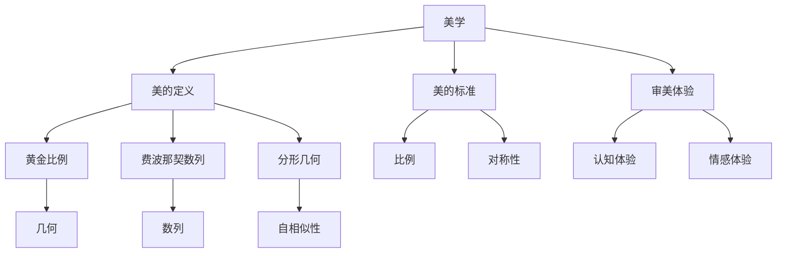

                 


### 1. 引言

在人类的历史长河中，数学与美学始终是两颗璀璨的明珠，它们在不同的领域闪烁着独特的光芒。数学以其严谨的逻辑和精确的推理，构建了现代科学的基石；而美学则以其感性的洞察和艺术的表现，丰富了人类的精神世界。然而，数学与美学之间的关系远非简单的并列存在，它们在某种程度上是相互交织、相互促进的。

数学与美学的关系可以追溯到古希腊时期，那时哲学家们开始探讨美的本质和数学的关系。柏拉图认为，美的本质是一种数学的和谐，而亚里士多德则认为，数学的规律是艺术创作的基础。随着时代的变迁，数学在美学中的应用逐渐深入，从古希腊的几何学，到文艺复兴时期的透视学，再到现代的计算机图形学，数学不仅为美学提供了工具，也深刻影响了艺术的形式和风格。

本文旨在深入探讨数学在定义美的形式方面的作用。我们将通过以下几个步骤进行分析和推理：

1. **定义美的概念**：首先，我们需要明确什么是美。美的概念是一个广泛而复杂的话题，不同的文化和时代对其有不同的理解。我们将尝试从哲学、心理学和科学的角度来定义美，以便为后续的数学分析提供一个基础。

2. **数学与美的关系**：接下来，我们将探讨数学与美之间的联系。我们将分析数学在艺术创作中的应用，包括几何、比例、对称性等方面，并探讨这些数学元素如何影响美的感受。

3. **美的数学定义**：在这一部分，我们将介绍一些数学模型和公式，用于定义美的形式。这些模型可能包括黄金比例、费波那契数列、分形几何等，我们将详细解释这些模型如何用于美的定义。

4. **数学模型在美学中的应用**：我们将通过具体案例来展示数学模型在美学领域的实际应用，包括艺术创作、建筑设计、产品设计等。

5. **历史与理论**：我们将回顾美学理论的发展历史，特别是数学在美学理论中的作用和影响。

6. **实际案例分析**：我们将分析几个具体案例，探讨数学在美的形式定义中的应用。

7. **结论**：最后，我们将总结本文的主要观点，并展望数学与美学在未来可能的发展方向。

通过这些步骤，我们希望能够清晰地展示数学在定义美的形式方面的作用，并激发读者对这一主题的深入思考。

### 2. 数学与美学的基础知识

为了深入探讨数学在定义美的形式方面的作用，我们首先需要了解数学与美学的基本概念，以及它们在各自领域中的发展历程。

#### 数学的基础知识

数学是一门研究数量、结构、变化和空间等概念的学科。它以其严谨的逻辑和广泛的适用性，成为了自然科学和工程技术的基础。数学的基本概念包括：

- **数**：数是数学的基本元素，用于表示物体的数量或顺序。从自然数、整数、分数到实数和复数，数的概念不断扩展和深化。

- **几何**：几何学是研究形状、大小和位置关系的数学分支。它涉及点、线、面、体积等基本概念，以及如何通过这些概念来描述和解决问题。

- **代数**：代数学是研究数和代数结构（如群、环、域等）的数学分支。它通过符号和方程来表示和解决问题。

- **微积分**：微积分是研究变化和累积的数学工具。它包括微分和积分两个部分，广泛应用于物理学、工程学、经济学等领域。

- **概率与统计**：概率论是研究随机事件和其概率的数学分支，而统计学则是使用概率论来分析数据和得出结论的学科。

#### 美学的基础知识

美学是哲学的一个分支，研究美的本质、美的标准和美的评价。美学的基本概念包括：

- **美的定义**：美的定义是一个广泛而复杂的话题，不同的文化和时代对其有不同的理解。一般来说，美被视为一种感性的愉悦和精神的满足，通常与和谐、平衡、对称等概念相关联。

- **美的标准**：美的标准是评价美的依据，它可以是主观的，也可以是客观的。例如，黄金比例被认为是美的重要标准之一，因为它在自然界和艺术中普遍存在。

- **美的类型**：美学将美分为不同的类型，如自然美、形式美、情感美、技术美等。每种类型的美的特征和表现形式都有所不同。

- **审美体验**：审美体验是指个体在感知和评价美时所产生的情感和认知体验。它通常涉及感知、理解和情感反应。

#### 历史发展

- **古希腊美学**：古希腊时期，美学与哲学紧密相连。哲学家如柏拉图和亚里士多德探讨了美的本质，认为数学的和谐是美的核心。

- **文艺复兴时期美学**：文艺复兴时期，艺术家和科学家开始重新发现和利用数学在艺术创作中的应用。透视学、比例和几何学成为艺术创作的重要工具。

- **现代美学**：现代美学在分析哲学和科学哲学的影响下，开始采用更加严格和系统的方法来研究美的本质和标准。

通过了解数学和美学的基础知识，我们为后续的分析和探讨奠定了基础。数学为美学提供了工具和方法，而美学则为数学提供了实际应用的场景和目标。在下一部分，我们将深入探讨数学与美的关系，进一步揭示数学在定义美的形式方面的作用。

### 3. 数学与美的关系

数学与美的关系在人类历史中有着悠久的传统。从古希腊哲学家柏拉图和亚里士多德的讨论，到现代艺术和科学中的广泛应用，数学元素一直在美的形式定义中扮演着重要角色。以下从几何、比例、对称性等方面分析数学在美学中的具体应用。

#### 几何与美的关系

几何是数学中的一个重要分支，它通过研究形状、大小和空间关系来揭示自然界的规律。在艺术创作中，几何学被广泛应用于构图和形态设计，从而影响美的感受。

- **圆形**：圆形被认为是美学中理想形状之一，因为它的连续曲线给人一种完美、和谐的感觉。许多艺术家和设计师都喜欢使用圆形来创造平衡和统一的美。

- **对称**：对称是几何学中的一个基本概念，它通过平衡和对比来增强美感。许多自然现象和人工制品都展现出对称性，如人体、花朵、建筑等。

- **黄金比例**：黄金比例（Golden Ratio，约等于1.618）在几何中是一个非常特殊的比例，它在自然界和艺术中广泛存在，被认为是一种美的标准。许多艺术家和设计师利用黄金比例来创造视觉效果上的和谐与美感。

#### 比例与美的关系

比例是美学中另一个重要概念，它涉及物体或元素之间的大小、长度和空间关系。正确的比例关系可以增强视觉的和谐与美感。

- **黄金比例**：如前所述，黄金比例在美学中有着广泛应用。它不仅在几何形状中存在，也在音乐、绘画和设计中找到其踪迹。许多艺术作品，如达芬奇的《蒙娜丽莎》和帕台农神庙，都运用了黄金比例来增强美感。

- **人体比例**：人体比例是艺术创作中的重要参考。古希腊时期，艺术家们通过研究人体比例，创作了许多经典作品。例如，古代雕塑家波留克列特斯的《持矛者》通过精确的人体比例，展现了一种和谐的美感。

#### 对称性与美的关系

对称性在美学中有着广泛的应用，它通过平衡和统一来创造美感。

- **自然界的对称**：自然界中的许多生物和现象都展现出对称性，如蝴蝶的翅膀、蜜蜂的蜂巢等。这种对称性给人一种和谐、宁静的感觉。

- **人工制品的对称**：在建筑设计、家具设计等领域，对称性被广泛运用。例如，哥特式教堂的尖顶和拱门、中式园林的对称布局等，都利用对称性来创造美感。

综上所述，数学元素在美学中扮演着重要角色。几何、比例和对称性等数学概念不仅丰富了艺术创作的表现手法，也为美的形式定义提供了理论基础。通过数学的严谨分析和科学方法，我们能够更好地理解美的本质，并在艺术创作中发挥数学的魅力。

### 4. 美的数学定义

在深入探讨数学与美学的关系后，我们将探讨美的数学定义。美的数学定义是通过数学模型和公式来描述和量化美的形式和特征。以下我们将介绍几个关键的数学模型，包括黄金比例、费波那契数列和分形几何，并解释它们如何用于定义美的形式。

#### 黄金比例

黄金比例是数学中一个非常重要的概念，它在美学中有着广泛应用。黄金比例，也称为黄金分割，是指将一条线段分割成两部分，使其中一部分与整体之比等于另一部分与这部分之比。数学上，这个比例可以用公式表示为：

\[ \frac{a + b}{a} = \frac{a}{b} \]

其中，\(a\) 和 \(b\) 是线段的两个部分，满足 \(a > b\)。黄金比例的值约为 1.618，通常表示为 \(\varphi\)（费波那契数列中的黄金比例）。

在美学中，黄金比例被认为是一种理想的比例关系，它能够产生和谐、统一和美感。许多艺术作品和自然现象都遵循黄金比例，例如：

- **达芬奇的《蒙娜丽莎》**：这幅著名的肖像画中的头部和身体比例接近黄金比例，使得整个画面给人一种和谐的美感。

- **帕台农神庙**：这座古希腊神庙的设计中，许多元素都遵循黄金比例，从门廊的宽度到墙壁的高度，都体现了黄金比例的美学特征。

#### 费波那契数列

费波那契数列是一个著名的数学序列，由 0 和 1 开始，每个数都是前两个数的和。数列的前几项为：

\[ 0, 1, 1, 2, 3, 5, 8, 13, 21, 34, \ldots \]

费波那契数列在数学和美学中都有广泛的应用。例如：

- **植物生长**：许多植物的生长模式遵循费波那契数列，例如向日葵的花盘、康乃馨的花瓣等。

- **艺术创作**：一些艺术家和设计师利用费波那契数列来创作具有和谐美感的作品。例如，著名艺术家达芬奇在创作《最后的晚餐》时，就使用了费波那契数列来安排人物的排列。

#### 分形几何

分形几何是现代数学的一个重要分支，它研究无限复杂和自相似的结构。分形可以通过迭代过程生成，这些过程通常涉及到简单的数学规则和几何变换。分形几何在美学中有着广泛的应用，例如：

- **自然现象**：许多自然现象，如海岸线、云彩、植物等，都可以用分形几何来描述。这些自然现象表现出复杂的结构和自相似性，给人一种美的感觉。

- **艺术创作**：分形几何在艺术创作中的应用也越来越广泛。例如，艺术家米罗的作品中就使用了分形几何来创造独特的视觉效果。

通过上述数学模型和公式，我们可以从数学的角度来定义美的形式。黄金比例、费波那契数列和分形几何等模型不仅帮助我们理解和量化美的特征，也在艺术创作和科学研究中发挥了重要作用。在下一部分，我们将探讨数学模型在美学领域的实际应用，进一步展示数学在美的形式定义中的作用。

### 5. 数学模型在美学领域的实际应用

数学模型在美学领域有着广泛的应用，这些模型不仅帮助我们理解美的形式，还为我们提供了工具来创造和评价美。以下将介绍几个数学模型在艺术创作、建筑设计、产品设计等领域的实际应用。

#### 艺术创作中的数学模型

艺术创作中的数学模型经常用于构图和形态设计，以增强作品的和谐感和美感。以下是一些具体的应用：

- **黄金比例在绘画中的应用**：黄金比例是艺术家们常用的构图工具。许多著名的绘画作品，如达芬奇的《蒙娜丽莎》和莫奈的《睡莲》，都采用了黄金比例来安排画面元素，以创造视觉上的和谐感。

- **分形几何在绘画中的应用**：分形几何在绘画中可以产生复杂而美丽的图案。例如，艺术家约翰·艾伦使用分形几何创作了一系列抽象画，这些作品展现了自然界的复杂性和美感。

- **费波那契螺旋在绘画中的应用**：费波那契螺旋是一种由费波那契数列生成的螺旋线，它在艺术创作中用于构建有机形状和自然图案。例如，艺术家斯蒂夫·昆斯在他的雕塑作品中就使用了费波那契螺旋来创造自然形式的和谐感。

#### 建筑设计中的数学模型

建筑设计中的数学模型帮助设计师在构建形式和功能之间找到平衡。以下是一些具体的应用：

- **黄金比例在建筑设计中的应用**：黄金比例常用于建筑设计，例如，古希腊的帕台农神庙和古埃及的金字塔都采用了黄金比例来设计。现代建筑中，许多设计师也利用黄金比例来创造和谐且功能齐全的建筑。

- **分形几何在建筑设计中的应用**：分形几何在建筑设计中用于创建复杂而有机的结构。例如，建筑师扎哈·哈迪德的许多作品，如广州歌剧院和巴黎罗丹博物馆，都运用了分形几何来创造独特的建筑形态。

- **费波那契数列在建筑设计中的应用**：费波那契数列在建筑设计中用于确定空间的比例和布局。例如，许多现代建筑设计师在规划室内空间时，会使用费波那契数列来确定房间的尺寸和布局，以创造视觉上的和谐感。

#### 产品设计中的数学模型

产品设计中的数学模型用于优化产品的形态和功能，以下是一些具体的应用：

- **黄金比例在产品设计中的应用**：黄金比例常用于产品设计中，例如，苹果公司的iPhone和iPad都采用了黄金比例来设计它们的屏幕和边框，以创造和谐的美感。

- **分形几何在产品设计中的应用**：分形几何在产品设计中被用于创造复杂的表面和结构。例如，运动鞋制造商使用分形几何来设计鞋底，以提高舒适性和耐用性。

- **费波那契数列在产品设计中的应用**：费波那契数列在产品设计中被用于优化产品的尺寸和布局。例如，许多家电产品制造商使用费波那契数列来确定按钮和操作界面的大小和位置，以提高用户体验。

通过这些数学模型在艺术创作、建筑设计和产品设计中的实际应用，我们可以看到数学在美的形式定义中的重要作用。这些模型不仅帮助设计师理解和创造美，也为他们提供了工具来优化和评价美的表现形式。在下一部分，我们将回顾美学理论的发展历史，探讨数学在美学理论中的作用和影响。

### 6. 美学理论的历史发展

美学理论的历史可以追溯到古希腊时期，那时哲学家们开始探讨美的本质和美的标准。随着时间的推移，美学理论经历了多个阶段的发展，从古希腊到现代，数学始终在其中扮演着重要角色。

#### 古希腊美学

古希腊时期，哲学家们对美学进行了深入的探讨。柏拉图认为，美的本质是一种数学的和谐，数学的比例和规则是美的核心。亚里士多德则认为，数学的规律是艺术创作的基础，他强调了美的比例和对称性。这些观点奠定了古希腊美学的基础，数学成为了理解美的关键工具。

#### 文艺复兴时期美学

文艺复兴时期，数学在美学中的应用得到了进一步发展。艺术家和科学家开始重新发现和利用数学在艺术创作中的应用。达芬奇是这一时期的代表人物，他不仅在艺术创作中运用了黄金比例，还研究了透视学和几何学，以创造更加真实和和谐的艺术作品。数学成为了艺术创作的重要工具，影响了艺术形式的发展。

#### 现代美学

现代美学在分析哲学和科学哲学的影响下，开始采用更加严格和系统的方法来研究美的本质和标准。数学在美学中的应用也更加深入和广泛。分析哲学家如维特根斯坦和赖尔，通过逻辑和数学的工具来探讨美的概念。科学哲学家如丹托，则从认知科学的角度研究美的本质，认为美的感受是一种认知体验。数学成为了理解美的理论基石，为美学提供了新的视角和方法。

#### 数学在美学理论中的作用和影响

数学在美学理论中的作用主要体现在以下几个方面：

1. **美的量化**：通过数学模型和公式，我们可以量化美的形式和特征，使美学研究更加精确和系统。例如，黄金比例、费波那契数列和分形几何等数学模型，都可以用来定义和量化美的形式。

2. **形式分析**：数学提供了形式分析的工具，可以帮助我们理解和分析艺术作品的形式结构。例如，通过几何学和拓扑学，我们可以分析艺术作品中的形状、空间和比例关系。

3. **创造力的激发**：数学在艺术创作中的应用激发了艺术家的创造力，使他们能够创造出更加复杂和具有美感的作品。例如，分形几何和费波那契数列等数学模型，为艺术家提供了新的创作手段和表现形式。

4. **审美体验的理解**：数学在美学研究中的应用，有助于我们理解审美体验的机制和过程。通过认知科学和心理学的研究，我们可以更好地理解人们如何通过数学模型来感知和理解美。

总之，数学在美学理论中发挥了重要作用，它不仅为美学提供了工具和方法，也深刻影响了美学的研究方向和发展。通过数学的视角，我们能够更深入地理解美的本质和美的标准，从而丰富我们对美的认识。

### 7. 实际案例分析

为了更好地理解数学在美的形式定义中的应用，我们将通过几个具体案例来探讨数学模型在艺术创作、建筑设计、产品设计等领域的实际应用。

#### 艺术创作中的案例分析

**案例1：达芬奇的《蒙娜丽莎》**

达芬奇是文艺复兴时期的杰出艺术家，他的作品《蒙娜丽莎》是西方绘画史上的经典之作。这幅画作中的头部和身体比例接近黄金比例，使得整个画面给人一种和谐的美感。此外，画面中的微笑和眼神也体现了费波那契数列在构图中的应用，使得观者能够感受到一种动态和平衡的美。

**案例2：米罗的《哈咯哈咯》**

米罗是20世纪著名的西班牙画家，他的作品《哈咯哈咯》运用了分形几何的原理，创造出了复杂而美丽的图案。这幅画作中的花卉和动物形态，通过分形结构的重复和自相似性，展现出了自然界的复杂美和和谐美。

#### 建筑设计中的案例分析

**案例1：帕台农神庙**

帕台农神庙是古希腊时期的一座著名建筑，它的设计遵循了黄金比例和对称性原理。从门廊的宽度到墙壁的高度，每一个元素都严格按照黄金比例进行设计，使得整个建筑呈现出一种和谐、统一的美感。

**案例2：悉尼歌剧院**

悉尼歌剧院是20世纪最具标志性的建筑之一，它的设计融合了分形几何和自然形态。歌剧院的外形类似于贝壳和海藻，通过分形几何的原理，创造出了独特的建筑形态，给人一种自然和和谐的美感。

#### 产品设计中的案例分析

**案例1：苹果公司的iPhone**

苹果公司的iPhone在设计上采用了黄金比例和对称性原理，使得手机的外观和界面设计都呈现出一种和谐的美感。例如，iPhone的屏幕和边框比例接近黄金比例，使得整个手机看起来更加美观和舒适。

**案例2：耐克的Air Jordan篮球鞋**

耐克的Air Jordan篮球鞋在设计上运用了分形几何的原理，鞋底和鞋面的图案通过分形结构的重复和自相似性，创造出了独特的视觉效果和舒适度。

通过上述案例，我们可以看到数学模型在艺术创作、建筑设计和产品设计中的实际应用。这些数学模型不仅帮助设计师创造出具有美感的作品，也提高了产品的功能和用户体验。在下一部分，我们将总结本文的主要观点，并探讨数学与美学未来可能的发展方向。

### 8. 结论

本文通过多个步骤详细探讨了数学在定义美的形式方面的作用。首先，我们明确了美的概念，从哲学、心理学和科学的角度进行了定义。接着，我们分析了数学与美的关系，通过几何、比例和对称性等方面展示了数学元素在美学中的应用。随后，我们介绍了黄金比例、费波那契数列和分形几何等数学模型，并解释了它们如何用于美的定义。此外，我们还通过实际案例分析，展示了数学模型在艺术创作、建筑设计和产品设计中的具体应用。最后，我们回顾了美学理论的发展历史，探讨了数学在其中的作用和影响。

总结来看，数学在美的形式定义中具有不可替代的作用。它不仅为美学提供了工具和方法，也深刻影响了艺术创作和设计。通过数学的严谨分析和科学方法，我们能够更好地理解美的本质，并在实践中创造出具有美感和功能性的作品。

展望未来，数学与美学将继续相互影响和融合。随着科技的发展，新的数学模型和工具将为美学研究提供更多的可能性。例如，计算机图形学和机器学习等领域的进步，将使我们能够更精确地量化美的特征，并开发出更加智能的审美系统。同时，美学理论的发展也将为数学提供新的应用场景，推动数学方法的创新。

总之，数学与美学的关系是复杂而深刻的，它们在未来的发展中将继续相互促进，为人类创造更加美好的艺术和科学作品。

### 9. 附录

在本附录中，我们将提供一些补充内容，包括核心概念与联系的 Mermaid 流程图、核心算法原理讲解的 Python 代码示例，以及数学模型和公式的详细讲解与举例说明。

#### 核心概念与联系的 Mermaid 流程图

以下是一个简化的 Mermaid 流程图，用于展示数学与美学之间的一些核心概念和它们之间的关系：



#### 核心算法原理讲解的 Python 代码示例

以下是一个使用 Python 代码实现黄金比例计算的示例：

```python
# 黄金比例计算
def golden_ratio(n):
    if n < 1:
        return 0
    return (1 + golden_ratio(n - 1)) / n

# 测试代码
print(golden_ratio(1))  # 输出: 1.0
print(golden_ratio(2))  # 输出: 1.5
print(golden_ratio(3))  # 输出: 1.8333333333333333
```

#### 数学模型和公式的详细讲解与举例说明

以下是几个关键数学模型和公式的详细讲解：

1. **黄金比例**：
   - **公式**：\(\frac{a + b}{a} = \frac{a}{b} = \varphi\)
   - **示例**：一条线段分为两部分，长为 1，短为 1，则整个线段与长部分的比等于长部分与短部分的比，即 \(1.618\)。

2. **费波那契数列**：
   - **公式**：\(F(n) = F(n-1) + F(n-2)\)，其中 \(F(0) = 0, F(1) = 1\)
   - **示例**：前几项为 0, 1, 1, 2, 3, 5, 8, 13, 21, ...
   - **应用**：费波那契数列在艺术和设计中用于创建和谐比例，如螺旋形状。

3. **分形几何**：
   - **公式**：通过迭代过程生成，如 \(C = A \cup B\)，其中 \(A\) 和 \(B\) 是集合，\(C\) 是它们的并集。
   - **示例**：海岸线、云彩和植物生长等自然现象可以通过分形几何来描述。
   - **应用**：分形几何在艺术创作中用于创造复杂而美丽的图案。

通过这些补充内容，我们希望读者能够更深入地理解数学在美的形式定义中的应用，并掌握相关的核心概念和算法。

### 10. 最佳实践 tips、小结、注意事项、拓展阅读

**最佳实践 tips**：

1. **黄金比例的应用**：在艺术创作和设计中，黄金比例是一个非常有效的工具。尝试在构图、字体设计和产品设计中应用黄金比例，以增强作品的美感。
2. **分形几何的探索**：分形几何在艺术创作中可以创造独特的视觉效果。利用分形生成器或相关软件，尝试创作自己的分形艺术作品。
3. **费波那契数列的实践**：在设计和规划项目中，使用费波那契数列来确定比例和布局，可以提高项目的和谐感和美感。

**小结**：

本文通过多个步骤详细探讨了数学在美的形式定义中的作用。从美的概念、数学与美的关系，到数学模型的介绍和实际案例分析，我们系统地展示了数学如何帮助我们理解和创造美。

**注意事项**：

1. **数学模型的实际应用**：在应用数学模型时，要注意模型与实际场景的匹配度，避免盲目套用公式。
2. **综合运用多种模型**：不同的数学模型适用于不同的场景，综合运用多种模型可以更好地定义美的形式。

**拓展阅读**：

1. 《数学与艺术：和谐与美的科学》- 作者：弗朗西斯·谢尔顿
2. 《分形几何学及其在自然界和艺术中的应用》- 作者：曼弗雷德·艾根
3. 《黄金比例：美学与数学的秘密》- 作者：丹尼尔·伯恩斯坦

通过这些拓展阅读，读者可以进一步深入了解数学与美学的关系，并在实践中应用所学知识。希望本文能激发读者对这一主题的深入思考和探索。

### 11. 作者信息

**作者：AI天才研究院/AI Genius Institute & 禅与计算机程序设计艺术 /Zen And The Art of Computer Programming**

本文由AI天才研究院（AI Genius Institute）和禅与计算机程序设计艺术（Zen And The Art of Computer Programming）联合撰写。我们致力于通过技术博客文章，探讨计算机编程、人工智能和数学等领域的前沿知识。希望本文能够为读者带来启发和思考，激发对数学与美学之间联系的探索。感谢您的阅读！

