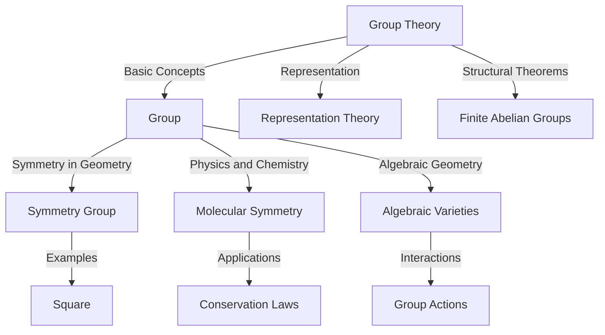

                 

Certainly! Let's begin with a structured approach to crafting a technical blog post on "Mathematics and Group Theory: A Mathematical Description of Symmetry." We will adhere to the provided outline and ensure that each section is detailed and informative.

### Introduction

#### Article Title: Mathematics and Group Theory: A Mathematical Description of Symmetry

Keywords: Group Theory, Symmetry, Mathematics, Abstract Algebra, Applications, Algorithm

Abstract:
This article delves into the fascinating realm of group theory and its profound connection to symmetry in mathematics. By exploring the fundamental concepts of group theory and their mathematical descriptions of symmetry, we aim to provide a comprehensive understanding of how symmetry is quantified and analyzed within the framework of abstract algebra. The article is structured to guide readers through the history, core principles, applications, and practical implementations of group theory in various scientific and technical domains.

### Part 1: Introduction

#### 1.1 Research Background and Significance

##### 1.1.1 History of Mathematics and Symmetry Studies

- **Background**: The history of mathematics is deeply intertwined with the study of symmetry. From the ancient Greeks to the modern day, symmetry has been a crucial concept in both mathematics and art.
- **Significance**: Symmetry has provided a powerful tool for understanding patterns, structures, and transformations in mathematics and science.

##### 1.1.2 Applications of Symmetry in Modern Mathematics

- **Geometry**: Symmetry is a fundamental concept in geometry, where it is used to describe the properties of shapes and their transformations.
- **Algebra**: In algebra, symmetry is related to the concept of groups, which are mathematical structures that capture the idea of symmetry.
- **Physics**: Symmetry principles play a crucial role in modern physics, particularly in the theories of particle physics and cosmology.

##### 1.1.3 Impact of Symmetry on Science and Technology

- **Engineering**: Symmetry is utilized in engineering to design robust and aesthetically pleasing structures.
- **Computer Science**: Symmetry is a key concept in cryptography and in the design of algorithms for data compression and pattern recognition.

#### 1.2 Basic Concepts of Group Theory

##### 1.2.1 Definition and Properties of a Group

- **Definition**: A group is a non-empty set G equipped with an operation that combines any two elements a and b of G to form another element of G, denoted as a * b.
- **Properties**: A group must satisfy the following properties: closure, associativity, existence of an identity element, and existence of inverse elements for each element.

##### 1.2.2 Subgroups and Homomorphisms

- **Subgroups**: A subset H of a group G is a subgroup if it is itself a group under the same operation.
- **Homomorphisms**: A function φ: G → H between two groups is a homomorphism if it preserves the group operation.

##### 1.2.3 Representation Theory and Structural Theorems

- **Representation Theory**: This theory studies the way groups can be represented as linear transformations of vector spaces.
- **Structural Theorems**: These theorems provide insights into the structure of groups, such as the Fundamental Theorem of Finite Abelian Groups.

#### 1.3 Relationship Between Symmetry and Group Theory

##### 1.3.1 Symmetry in Geometry

- **Symmetry Groups**: In geometry, symmetry groups describe the transformations that leave a geometric object unchanged.
- **Examples**: The rotation group of a square, the reflection group of a line.

##### 1.3.2 Role of Groups in Physics and Chemistry

- **Symmetry Principles in Physics**: Symmetry principles are used to derive conservation laws and to simplify the formulation of physical theories.
- **Molecular Symmetry in Chemistry**: The symmetry of molecules is crucial for understanding their properties and reactions.

##### 1.3.3 Connections to Other Mathematical Branches

- **Topology**: Symmetry groups are used to study topological spaces and their properties.
- **Algebraic Geometry**: Group actions on algebraic varieties provide a deep connection between group theory and geometry.

### Mermaid Flowchart: Core Concepts and Relationships in Group Theory and Symmetry

### Next Steps

With the introduction and initial exploration of the concepts of group theory and symmetry, we will now delve deeper into the mathematical principles and applications of group theory in the subsequent sections. Each section will be accompanied by detailed explanations, Python code examples, and LaTeX-formatted mathematical formulas to ensure clarity and understanding.

The next part will focus on the fundamental principles of group theory, including group operations, subgroup structures, and homomorphisms. We will then move on to the representation theory of groups, which is essential for understanding how groups can be visualized and manipulated algebraically.

Finally, we will explore the applications of group theory across various fields, including geometry, physics, and chemistry, and discuss how these applications contribute to our understanding of the world. The article will conclude with practical implementations and a summary of the key points discussed, along with insights into the future directions of group theory research.

Stay tuned for the in-depth analysis and exploration of mathematics and group theory in the following sections!

