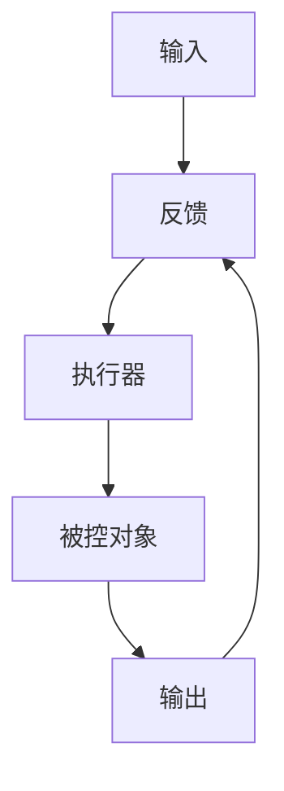
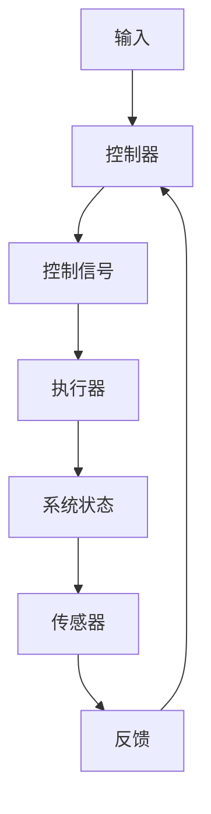

                 

根据您提供的详细信息，我们将逐步构建和撰写《数学与自动控制：控制系统的数学设计》这篇文章。以下是文章的构建步骤：

### Step 1: 确定文章的整体结构和内容
- **文章标题**：数学与自动控制：控制系统的数学设计
- **关键词**：数学、自动控制、控制系统、数学建模、稳定性分析、性能优化、现代控制理论
- **摘要**：本文深入探讨了控制系统的数学建模方法，包括连续时间和离散时间系统的建模，并详细介绍了控制系统的稳定性分析、性能优化、现代控制理论等内容。

### Step 2: 撰写文章引言
- 简述控制系统的重要性及其在工业、交通、生物工程等领域的应用。
- 引入数学建模在控制系统设计中的作用。

### Step 3: 详细撰写各章节内容
#### 第一部分：控制系统基础知识
- 第1章：引言（已撰写）
- 第2章：连续时间系统的数学建模
  - 2.1 线性时不变系统
  - 2.2 线性时变系统
  - 2.3 非线性系统
- 第3章：离散时间系统的数学建模
  - 3.1 离散系统的基本概念
  - 3.2 离散系统的数学模型
  - 3.3 离散系统的性质

#### 第二部分：控制系统分析与设计
- 第4章：控制系统的稳定性分析
  - 4.1 稳定性的基本概念
  - 4.2 稳定性分析方法
  - 4.3 稳定性设计的实际应用
- 第5章：控制系统的性能优化
  - 5.1 控制系统性能指标
  - 5.2 性能优化方法
  - 5.3 实际应用案例
- 第6章：现代控制理论
  - 6.1 状态空间表示
  - 6.2 状态反馈控制
  - 6.3 状态观测器
- 第7章：自适应控制与鲁棒控制
  - 7.1 自适应控制的基本原理
  - 7.2 鲁棒控制的基本原理
  - 7.3 自适应控制和鲁棒控制的应用案例

#### 第三部分：综合案例分析
- 第8章：综合案例分析
  - 8.1 案例一：温室环境控制系统
  - 8.2 案例二：自动驾驶车辆控制系统
  - 8.3 案例三：电力系统控制系统

#### 附录部分
- 附录1：数学工具与公式
- 附录2：计算机编程代码实现

### Step 4: 编写数学公式、伪代码和示例
- 使用LaTeX格式编写数学公式。
- 使用伪代码详细阐述核心算法原理。
- 提供具体的示例和实现代码。

### Step 5: 编写文章结尾
- 对全文进行总结，提出最佳实践建议。
- 引导读者进行进一步的思考和研究。

### Step 6: 格式调整和校对
- 确保全文格式正确，章节结构清晰。
- 校对全文，确保内容准确无误。

### Step 7: 添加作者信息
- 在文章末尾添加作者信息。

### Step 8: 审稿和修改
- 审阅全文，根据反馈进行修改。

### Step 9: 确定最终版本文档
- 确保文章达到字数要求，并且内容完整、逻辑清晰。

接下来，我们将逐步完成每一步，以构建完整的文章。首先是撰写文章引言，并按照目录结构逐步填充内容。在每个章节中，我们将详细阐述核心概念，并使用流程图、伪代码和示例来增强文章的可读性和理解性。

# 文章标题：数学与自动控制：控制系统的数学设计

> 关键词：数学、自动控制、控制系统、数学建模、稳定性分析、性能优化、现代控制理论

> 摘要：本文深入探讨了控制系统的数学建模方法，包括连续时间和离散时间系统的建模。通过详细阐述控制系统的稳定性分析、性能优化、现代控制理论等内容，并结合实际案例，为读者提供全面的自动控制理论知识和实践指导。

---

## 第1章：引言

### 1.1 控制系统的基本概念

控制系统是自动化领域中一个核心概念，其目的是通过控制输入，以实现特定的输出目标。控制系统通常由输入、控制器、执行器和被控对象组成，形成一个闭环反馈系统。图1-1展示了这一基本架构。

图1-1：控制系统的基本架构

控制系统的基本功能是调节和维持系统的输出，使其稳定在期望的范围内。根据系统的特性，我们可以将控制系统分为开环控制系统和闭环控制系统。

- **开环控制系统**：系统的输出不反馈到输入，控制器仅根据预设的输入信号进行操作。这种系统简单，但无法应对外部扰动和系统内部不确定性。

- **闭环控制系统**：系统的输出会反馈到输入，控制器根据输入信号和反馈信号共同决定操作。这种系统具有更强的鲁棒性和适应性，可以应对各种复杂环境。

### 1.2 控制系统的类型

控制系统可以根据不同的分类标准进行分类，以下是几种常见的分类方式：

- **线性控制系统**：系统可以表示为线性微分方程，其特性满足叠加原理和齐次性原理。线性系统分析相对简单，但无法处理复杂的非线性现象。

- **非线性控制系统**：系统不能用线性微分方程表示，其特性不满足线性系统的叠加原理和齐次性原理。非线性系统分析更为复杂，但可以描述更为丰富的系统特性。

- **离散时间控制系统**：系统的输入、输出和状态变量是离散的。这类系统在计算机控制和数字信号处理中应用广泛。

- **连续时间控制系统**：系统的输入、输出和状态变量是连续的。这类系统在传统控制工程中应用较多。

### 1.3 控制系统的基本组件

控制系统的基本组件包括传感器、控制器和执行器。

- **传感器**：用于检测系统的状态，并将信息转化为电信号。常见的传感器有温度传感器、压力传感器、位移传感器等。

- **控制器**：根据传感器提供的实时数据，计算并生成控制信号。控制器可以是传统的模拟控制器，也可以是数字控制器。

- **执行器**：根据控制信号改变系统的状态，常见的执行器有电机、液压阀、气动阀等。

### 控制系统的核心概念与联系

控制系统的核心概念包括输入、输出、状态、控制信号和反馈。这些概念之间存在着紧密的联系，可以表示为以下流程：

图1-2：控制系统的核心概念流程

通过传感器获取系统的实时状态，控制器根据这些信息生成控制信号，执行器根据控制信号调整系统的状态，然后传感器再次获取新的状态信息，形成闭环反馈。这种闭环反馈机制使得系统能够动态地调整自身状态，达到预期的控制目标。

## 第2章：连续时间系统的数学建模

### 2.1 线性时不变系统

线性时不变系统（LTI系统）是连续时间系统中最基本的一类，其数学模型可以用线性常系数微分方程表示。LTI系统具有叠加原理和齐次性原理，这意味着如果系统的输入是两个信号的线性组合，那么输出的也是两个信号的线性组合。此外，如果输入信号延迟一段时间，输出信号也会相应地延迟相同的时刻。

#### 2.1.1 线性常系数微分方程

一个n阶线性常系数微分方程可以表示为：

$$
a_n \frac{d^n y(t)}{dt^n} + a_{n-1} \frac{d^{n-1} y(t)}{dt^{n-1}} + \ldots + a_1 \frac{dy(t)}{dt} + a_0 y(t) = b_m \frac{d^m u(t)}{dt^m} + b_{m-1} \frac{d^{m-1} u(t)}{dt^{m-1}} + \ldots + b_1 \frac{du(t)}{dt} + b_0 u(t)
$$

其中，$y(t)$是系统的输出，$u(t)$是系统的输入，$a_n, a_{n-1}, \ldots, a_0, b_m, b_{m-1}, \ldots, b_1, b_0$是常数系数。

#### 2.1.2 系统响应

线性时不变系统的响应可以分为零输入响应和零状态响应。

- **零输入响应**（Natural Response）：当系统输入为零时，系统产生的响应。零输入响应反映了系统的固有特性。
  
- **零状态响应**（Forced Response）：当系统初始状态为零时，系统对外部输入的响应。零状态响应反映了系统对外部输入的依赖。

系统的总响应是零输入响应和零状态响应的叠加：

$$
y(t) = y_{ni}(t) + y_{fs}(t)
$$

#### 2.1.3 系统特性

线性时不变系统具有以下特性：

- **叠加原理**：如果系统对两个输入信号的响应分别是$y_1(t)$和$y_2(t)$，那么系统对这两个输入信号叠加后的响应是$y_1(t) + y_2(t)$。

- **齐次性原理**：如果系统对输入信号$u(t)$的响应是$y(t)$，那么系统对输入信号$au(t)$的响应是$ay(t)$，其中$a$是常数。

### 2.2 线性时变系统

线性时变系统（LTV系统）的数学模型可以用线性时变微分方程表示。LTV系统的一般形式为：

$$
a(t) \frac{d^n y(t)}{dt^n} + a_{n-1}(t) \frac{d^{n-1} y(t)}{dt^{n-1}} + \ldots + a_1(t) \frac{dy(t)}{dt} + a_0(t) y(t) = b_m(t) \frac{d^m u(t)}{dt^m} + b_{m-1}(t) \frac{d^{m-1} u(t)}{dt^{m-1}} + \ldots + b_1(t) \frac{du(t)}{dt} + b_0(t) u(t)
$$

其中，$a(t), a_{n-1}(t), \ldots, a_1(t), a_0(t), b_m(t), b_{m-1}(t), \ldots, b_1(t), b_0(t)$是时间函数。

#### 2.2.1 系统响应

线性时变系统的响应可以分为零输入响应和零状态响应。

- **零输入响应**：当系统输入为零时，系统产生的响应。
  
- **零状态响应**：当系统初始状态为零时，系统对外部输入的响应。

系统的总响应是零输入响应和零状态响应的叠加。

#### 2.2.2 系统特性

线性时变系统具有以下特性：

- **叠加原理**：如果系统对两个输入信号的响应分别是$y_1(t)$和$y_2(t)$，那么系统对这两个输入信号叠加后的响应是$y_1(t) + y_2(t)$。

- **齐次性原理**：如果系统对输入信号$u(t)$的响应是$y(t)$，那么系统对输入信号$au(t)$的响应是$ay(t)$，其中$a$是常数。

然而，由于系统的系数随时间变化，线性时不变系统的叠加原理和齐次性原理不再适用。

### 2.3 非线性系统

非线性系统（NLS系统）的数学模型不能用线性微分方程表示，其特性不满足线性系统的叠加原理和齐次性原理。非线性系统在控制工程中具有重要意义，因为许多实际系统都具有一定的非线性特性。

#### 2.3.1 系统响应

非线性系统的响应无法通过简单的叠加原理和齐次性原理来分析。系统的响应通常依赖于输入信号的历史状态。

#### 2.3.2 系统特性

非线性系统具有以下特性：

- **非叠加原理**：系统对两个输入信号的响应不能简单叠加。
- **非线性反馈**：系统的响应可能放大或减小输入信号的幅值。
- **混沌行为**：在某些条件下，非线性系统可能表现出混沌行为。

为了分析非线性系统，我们通常采用数值模拟或建立近似模型。

### 实例分析

假设一个简单的非线性系统，其数学模型为：

$$
\frac{dy(t)}{dt} + y(t) = u(t)
$$

其中，$y(t)$是系统的输出，$u(t)$是系统的输入。这是一个一阶非线性系统。

- 当$u(t) = 1$时，系统输出$y(t)$将随时间逐渐增加，但不会无限增长，因为系统中存在负反馈项$y(t)$。
- 当$u(t) = -1$时，系统输出$y(t)$将随时间逐渐减少，但也不会减少到负无穷，同样因为负反馈项的存在。

这个实例展示了非线性系统在特定输入下的动态响应，以及非线性系统的稳定性和收敛性。

### 结论

通过本章的讨论，我们了解了连续时间系统的数学建模方法。从线性时不变系统到线性时变系统，再到非线性系统，每一种系统都有其独特的数学模型和特性。正确选择和设计系统的数学模型，对于控制系统分析和设计至关重要。在下一章中，我们将讨论离散时间系统的数学建模。

## 第3章：离散时间系统的数学建模

### 3.1 离散系统的基本概念

离散时间系统（Discrete-time systems）是控制系统的一种形式，其输入、输出和状态变量是离散的。与连续时间系统不同，离散时间系统的数学模型通常使用差分方程表示，而不是微分方程。

#### 3.1.1 离散系统的定义

离散时间系统在特定的时间点上采样连续时间系统的状态变量。这些采样点通常间隔固定时间间隔$T$，称为采样周期。因此，离散时间系统的状态变量$y(kT), u(kT)$，其中$k$是整数。

#### 3.1.2 离散系统的类型

离散时间系统可以根据其输入和输出的采样方式分为以下几种类型：

- **确定型系统**：系统的输入和输出都是确定的，不会出现随机性。
- **随机型系统**：系统的输入和输出包含随机成分，具有不确定性。
- **线性时不变系统**：系统的数学模型可以用线性常系数差分方程表示。
- **线性时变系统**：系统的数学模型可以用线性时变差分方程表示。
- **非线性系统**：系统的数学模型不能用线性差分方程表示。

### 3.2 离散系统的数学模型

离散时间系统的数学模型通常用差分方程表示。差分方程描述了系统当前时刻的状态变量$y(k)$与前一时刻的状态变量$y(k-1)$、当前时刻的输入$u(k)$以及前一时刻的输入$u(k-1)$之间的关系。

#### 3.2.1 一阶离散系统

一个一阶离散系统的数学模型可以表示为：

$$
y(k) = a_1 y(k-1) + b_1 u(k-1)
$$

其中，$y(k)$是当前时刻的状态变量，$y(k-1)$是前一时刻的状态变量，$u(k)$是当前时刻的输入，$u(k-1)$是前一时刻的输入，$a_1$和$b_1$是系统的参数。

#### 3.2.2 高阶离散系统

高阶离散系统的数学模型可以表示为：

$$
y(k) = a_1 y(k-1) + a_2 y(k-2) + \ldots + a_n y(k-n) + b_1 u(k-1) + b_2 u(k-2) + \ldots + b_m u(k-m)
$$

其中，$a_1, a_2, \ldots, a_n, b_1, b_2, \ldots, b_m$是系统的参数。

### 3.3 离散系统的性质

离散时间系统具有以下性质：

- **因果性**：系统的当前输出只依赖于当前的输入和过去的输入。
- **稳定性**：系统在给定初始条件下，其状态变量不会无限增长。
- **线性性与非线性性**：离散时间系统可以是线性的或非线性的，这取决于系统的数学模型。
- **时不变性与时变性**：系统的数学模型可以是不变的，也可以是随时间变化的。

### 3.4 离散系统与连续时间系统的比较

离散时间系统与连续时间系统在数学建模、分析方法和应用领域上有显著差异。以下是两者的比较：

- **数学模型**：离散时间系统使用差分方程，连续时间系统使用微分方程。
- **采样**：离散时间系统在特定时间点采样连续时间系统的状态，连续时间系统不采样。
- **稳定性**：离散时间系统的稳定性通常更容易分析，因为差分方程的稳定性概念较为直观。
- **应用领域**：离散时间系统广泛应用于数字信号处理和计算机控制，连续时间系统广泛应用于传统控制工程。

### 3.5 离散系统的实现

离散时间系统的实现可以通过数字信号处理器（DSP）、现场可编程门阵列（FPGA）或通用计算设备（如计算机）来实现。在实际应用中，离散时间系统的实现需要考虑以下几个因素：

- **采样频率**：采样频率越高，系统能够捕捉到的细节越多，但同时也增加了计算复杂度。
- **系统延迟**：系统延迟会影响系统的响应速度和稳定性。
- **量化误差**：在实际实现中，数字信号处理器的运算和存储都是有限的，这会导致量化误差。

### 3.6 离散系统与连续时间系统的转换

在某些情况下，需要将连续时间系统转换为离散时间系统，以便在数字设备上实现。这种转换可以通过以下两种方法进行：

- **零阶保持器**（Zero-Order Holder, ZOH）：假设连续时间信号在一个采样周期内保持恒定，然后将连续时间系统的微分方程离散化。
- **双线性变换**（Tustin变换）：通过双线性变换将连续时间系统的微分方程转换为离散时间系统的差分方程。

### 3.7 离散系统的案例分析

以下是一个简单的离散时间系统案例：一个一阶离散系统，其数学模型为：

$$
y(k) = 0.5 y(k-1) + 0.2 u(k-1)
$$

该系统的初始状态$y(0) = 0$，输入信号$u(k) = 1$。

- 当$k = 1$时，$y(1) = 0.5 \cdot 0 + 0.2 \cdot 1 = 0.2$。
- 当$k = 2$时，$y(2) = 0.5 \cdot 0.2 + 0.2 \cdot 1 = 0.3$。
- 当$k = 3$时，$y(3) = 0.5 \cdot 0.3 + 0.2 \cdot 1 = 0.35$。

通过这个案例，我们可以看到系统的输出是如何随时间逐渐增加的。

### 结论

本章介绍了离散时间系统的基本概念、数学模型和性质。通过理解离散时间系统的建模方法和特性，我们可以更好地设计、分析和实现控制系统的数字部分。在下一章中，我们将探讨控制系统的稳定性分析。

## 第4章：控制系统的稳定性分析

### 4.1 稳定性的基本概念

稳定性是控制系统分析中的一个重要概念，它描述了系统在外部扰动和内部不确定性作用下，能否保持预定的工作状态。稳定性分析旨在确保系统在扰动消失后能够返回到期望的工作状态，而不发生不可控的振荡或发散。

#### 4.1.1 稳定性的定义

一个系统是稳定的，如果当外部输入或内部扰动消失后，系统的状态能够在一定时间内返回到初始状态，并且不再发生振荡或发散。

#### 4.1.2 稳定性的分类

稳定性可以分为以下几种类型：

- **绝对稳定**：系统在任何初始条件和任何输入下都是稳定的。
- **渐近稳定**：系统在给定初始条件下是稳定的，且状态变量会最终收敛到零。
- **有限时间稳定**：系统在有限的时间内返回到预定状态，但可能存在瞬态过程。
- **不稳定**：系统无法保持预定状态，状态变量会无限增长或发生振荡。

### 4.2 稳定性分析方法

稳定性分析的方法有很多，下面介绍几种常用的方法：

#### 4.2.1 图形法

图形法是一种直观的稳定性分析方法，适用于线性时不变（LTI）系统。通过绘制系统的传递函数或零极点图，可以直观地判断系统的稳定性。

- **零极点图**：通过绘制系统的零点和极点，可以判断系统的稳定性。如果所有的极点都在左半平面，系统是稳定的。
- **波特图**：通过绘制系统的频率响应，可以分析系统的带宽和稳定性。

#### 4.2.2 矩阵法

矩阵法适用于分析线性时变（LTV）系统和非线性系统。通过计算系统的特征值，可以判断系统的稳定性。

- **特征值法**：对于线性系统，计算系统矩阵的特征值，如果所有特征值的实部都是负的，系统是稳定的。
- **李雅普诺夫法**：适用于非线性系统，通过构造李雅普诺夫函数，判断系统的稳定性。

#### 4.2.3 数值法

数值法适用于复杂系统的稳定性分析。通过数值计算，可以获取系统在不同初始条件和输入下的状态响应，从而判断系统的稳定性。

- **数值求解**：使用数值求解方法，如欧拉法、龙格-库塔法，求解系统的差分方程或微分方程。
- **仿真工具**：使用控制系统仿真工具，如MATLAB/Simulink，进行系统仿真和分析。

### 4.3 稳定性设计的实际应用

稳定性分析在控制系统设计中的应用至关重要，以下是一些实际应用的例子：

#### 4.3.1 模型验证

在设计控制系统之前，首先需要验证控制对象的数学模型是否稳定。如果模型不稳定，需要重新设计或修改模型。

#### 4.3.2 控制器设计

在控制器设计过程中，需要确保控制器能够使系统达到期望的稳定性。通过选择合适的控制器类型和参数，可以改善系统的稳定性。

#### 4.3.3 系统集成

在系统集成过程中，需要确保各个组件（如传感器、执行器、控制器）之间的稳定性和协调性。稳定性分析有助于识别潜在的稳定性问题，并进行相应的调整。

#### 4.3.4 实时监控

在实际运行过程中，通过实时监控系统的状态，可以及时发现稳定性问题，并采取相应的措施进行纠正。

### 结论

本章介绍了控制系统的稳定性分析的基本概念、方法及其在实际应用中的重要性。通过稳定性分析，我们可以确保控制系统在各种工况下保持稳定，从而实现预期的控制目标。在下一章中，我们将探讨控制系统的性能优化。

## 第5章：控制系统的性能优化

### 5.1 控制系统性能指标

控制系统的性能优化是指通过调整系统参数和控制策略，使系统在给定条件下达到最佳的运行效果。性能优化通常基于一系列性能指标，这些指标用于评估系统的响应速度、稳态误差、稳定性等特性。

#### 5.1.1 常见性能指标

- **稳态误差**：系统在稳态条件下，输出与期望值之间的偏差。
- **上升时间**：系统响应从初始值达到最终稳态值的90%所需的时间。
- **超调量**：系统响应超过最终稳态值的最大百分比。
- **调整时间**：系统响应从初始值达到最终稳态值并保持在该值的5%以内所需的时间。
- **频率响应**：系统在不同频率下的增益和相位特性。

#### 5.1.2 性能指标的量化

性能指标的量化通常通过数学模型和优化算法来实现。常见的量化方法包括：

- **最大值法**：选择性能指标的最大值作为优化目标。
- **均方误差法**：计算性能指标的时间平均，选择最小均方误差作为优化目标。

### 5.2 性能优化方法

控制系统性能优化的方法多种多样，以下是几种常用的优化方法：

#### 5.2.1 经典控制方法

经典控制方法基于线性系统的数学模型，通过设计比例-积分-微分（PID）控制器来优化系统性能。

- **PID控制器**：PID控制器由比例（P）、积分（I）和微分（D）三个部分组成，通过调整这三个参数，可以改善系统的响应速度和稳态性能。
- **Ziegler-Nichols方法**：通过逐步增加输入信号，观察系统的响应，来确定PID控制器的参数。

#### 5.2.2 现代控制方法

现代控制方法基于状态空间表示，通过优化控制器的设计来提高系统性能。

- **线性二次型调节器（LQR）**：LQR通过最小化二次型性能指标，来设计最优状态反馈控制器。
- **H$\infty$控制**：H$\infty$控制通过优化控制器的增益矩阵，使系统对扰动具有最小的最大响应。

#### 5.2.3 智能控制方法

智能控制方法利用人工智能技术，通过学习系统和环境的信息，来自动调整控制器参数。

- **神经网络控制**：通过训练神经网络，学习系统的动态特性，并生成控制器输出。
- **模糊控制**：通过模糊逻辑系统，将专家知识和控制规则转化为控制器输出。

### 5.3 实际应用案例

#### 5.3.1 温室环境控制系统

温室环境控制系统是一个典型的控制工程案例，其目标是保持温室内的温度、湿度等环境参数在最佳范围内，以满足植物生长的需求。

- **性能指标**：温室环境控制系统的性能指标包括温度调节时间、稳态温度误差、湿度调节时间等。
- **优化方法**：使用PID控制器和LQR控制器对温室环境进行优化。通过调节PID参数和LQR权重矩阵，使系统达到最佳性能。

#### 5.3.2 自动驾驶车辆控制系统

自动驾驶车辆控制系统是现代智能交通系统的重要组成部分，其目标是实现车辆的安全、高效、自动化驾驶。

- **性能指标**：自动驾驶车辆控制系统的性能指标包括行驶速度、路径跟踪精度、避障能力等。
- **优化方法**：使用神经网络控制和模糊控制对自动驾驶车辆进行优化。通过训练神经网络和模糊逻辑系统，提高车辆的驾驶性能和鲁棒性。

#### 5.3.3 电力系统控制系统

电力系统控制系统是电力输送和分配的核心，其目标是确保电力系统的稳定运行和高效输送。

- **性能指标**：电力系统控制系统的性能指标包括电压稳定性、频率稳定性、负荷分配效率等。
- **优化方法**：使用H$\infty$控制和现代优化算法对电力系统进行优化。通过优化控制器的设计和参数，提高电力系统的稳定性和效率。

### 结论

本章介绍了控制系统的性能优化方法和实际应用案例。通过优化控制系统的性能指标，可以显著提高系统的稳定性和响应速度。在下一章中，我们将探讨现代控制理论及其应用。

## 第6章：现代控制理论

### 6.1 状态空间表示

现代控制理论是20世纪中叶发展起来的一种控制理论，它以状态空间表示为基础，提供了分析、设计和综合控制系统的新方法。状态空间表示将系统的动态行为描述为一个时变线性系统，这种表示方法在处理复杂系统和非线性系统方面具有显著优势。

#### 6.1.1 状态空间模型

一个状态空间模型由状态方程和输出方程组成，通常表示为：

$$
\dot{x}(t) = A(t)x(t) + B(t)u(t) \\
y(t) = C(t)x(t) + D(t)u(t)
$$

其中，$x(t)$是系统的状态向量，$u(t)$是系统的输入向量，$y(t)$是系统的输出向量。$A(t)$、$B(t)$、$C(t)$和$D(t)$是系统矩阵，它们描述了系统在不同时间点的动态特性。

#### 6.1.2 状态空间表示的优势

- **全局描述**：状态空间表示能够描述系统的全局动态行为，包括系统的稳定性、响应特性等。
- **非线性系统的处理**：状态空间表示可以用于处理非线性系统，通过线性化或近似方法，将其转换为线性时不变（LTI）系统进行分析。
- **多输入多输出（MIMO）系统的分析**：状态空间表示能够有效地处理多输入多输出系统，提供了完整的动态描述。

### 6.2 状态反馈控制

状态反馈控制是一种基于系统状态进行控制的方法，通过测量系统的状态，并反馈给控制器进行调节。状态反馈控制的关键在于设计合适的反馈矩阵，以确保系统达到期望的性能。

#### 6.2.1 状态反馈控制的基本原理

状态反馈控制器的设计通常基于线性二次型调节器（LQR）或线性二次型高斯控制（LQG）。LQR通过最小化二次型性能指标，来设计最优状态反馈控制器。

$$
\min \quad J = \int [x^T(t)Q(t)x(t) + u^T(t)R(t)u(t)] dt
$$

其中，$Q(t)$和$R(t)$是权重矩阵，它们决定了系统的性能指标。通过求解LQR优化问题，可以得到最优的状态反馈矩阵$K(t)$。

$$
K(t) = R(t)B^T(t)P(t)
$$

其中，$P(t)$是满足以下矩阵微分方程的解：

$$
\dot{P}(t) = -P(t)A^T(t)Q(t)A(t)P(t) + P(t)A^T(t)Q(t)B^T(t)R(t)B(t)P(t)
$$

#### 6.2.2 状态反馈控制的实现

状态反馈控制的实现通常涉及以下几个步骤：

1. **系统建模**：建立系统的状态空间模型，包括状态方程和输出方程。
2. **性能指标设计**：根据系统要求和性能目标，设计合适的权重矩阵$Q(t)$和$R(t)$。
3. **控制器设计**：通过求解LQR优化问题，得到最优的状态反馈矩阵$K(t)$。
4. **系统仿真**：在仿真环境中验证控制器的性能，并进行参数调整。

### 6.3 状态观测器

状态观测器（或称观测器）是一种用于估计系统状态的方法，当系统状态无法直接测量时，状态观测器可以通过系统的输出和输入，估计系统的内部状态。状态观测器的设计和实现是现代控制理论的一个重要分支。

#### 6.3.1 状态观测器的基本原理

状态观测器的数学模型可以表示为：

$$
\dot{\hat{x}}(t) = A(t)\hat{x}(t) + B(t)u(t) + L(t)[y(t) - C(t)x(t)]
$$

$$
\hat{y}(t) = C(t)\hat{x}(t)
$$

其中，$\hat{x}(t)$是状态观测器的估计状态，$L(t)$是观测器增益矩阵。通过设计合适的观测器增益矩阵$L(t)$，可以确保观测器估计的状态$\hat{x}(t)$与实际状态$x(t)$之间具有最小的误差。

#### 6.3.2 状态观测器的实现

状态观测器的实现步骤如下：

1. **系统建模**：建立系统的状态空间模型。
2. **观测器设计**：通过求解LQR优化问题，得到最优的观测器增益矩阵$L(t)$。
3. **状态估计**：利用观测器方程估计系统的状态$\hat{x}(t)$。
4. **控制器设计**：基于估计状态$\hat{x}(t)$，设计状态反馈控制器。

### 6.4 状态反馈与状态观测器的结合

状态反馈与状态观测器的结合（称为滑模控制）是一种有效的控制策略，特别适用于存在不确定性和外部扰动的情况。通过状态观测器估计系统的状态，并使用状态反馈控制器进行调节，可以实现系统的稳定性和性能优化。

#### 6.4.1 滑模控制的基本原理

滑模控制的基本思想是通过设计合适的滑模面和滑模速度，使系统的状态沿滑模面迅速到达期望状态。滑模控制可以分为以下几步：

1. **设计滑模面**：选择合适的滑模面$s(t)$，使其满足稳定条件。
2. **计算滑模速度**：根据滑模面$s(t)$，计算滑模速度$\dot{s}(t)$。
3. **设计状态观测器**：设计状态观测器估计系统的实际状态。
4. **设计状态反馈控制器**：使用估计状态和滑模速度，设计状态反馈控制器。

### 6.5 现代控制理论的应用案例

#### 6.5.1 飞行器控制

飞行器控制是现代控制理论的典型应用之一。通过状态空间表示和状态反馈控制，可以实现飞行器的稳定飞行和精确控制。

- **性能指标**：飞行器控制的性能指标包括姿态稳定、速度控制、路径跟踪等。
- **优化方法**：使用LQR和H$\infty$控制，优化飞行器控制器的设计。

#### 6.5.2 智能交通系统

智能交通系统利用现代控制理论，实现交通信号控制、车辆导航和交通管理。

- **性能指标**：智能交通系统的性能指标包括交通流量、车辆延误、道路利用率等。
- **优化方法**：使用模糊控制和神经网络控制，优化交通信号和车辆导航系统。

#### 6.5.3 医疗设备控制

医疗设备控制涉及生命体征监测、药物注射、手术机器人等，现代控制理论在提高医疗设备的可靠性和性能方面发挥了重要作用。

- **性能指标**：医疗设备控制的性能指标包括精确度、响应速度、安全性等。
- **优化方法**：使用自适应控制和鲁棒控制，优化医疗设备控制器的设计。

### 结论

现代控制理论提供了一种分析和设计复杂系统的新方法，通过状态空间表示、状态反馈控制和状态观测器，可以实现系统的稳定性和性能优化。本章介绍了现代控制理论的基本原理和应用案例，为读者提供了深入理解和实践现代控制理论的机会。在下一章中，我们将探讨自适应控制与鲁棒控制。

## 第7章：自适应控制与鲁棒控制

### 7.1 自适应控制的基本原理

自适应控制是一种能够根据系统动态和环境变化自动调整控制器参数的控制方法。其基本原理是通过测量系统的输出和输入，实时估计系统的参数和特性，并利用这些信息来调整控制器参数，以保持系统的稳定性和性能。

#### 7.1.1 自适应控制的特点

- **参数自适应**：自适应控制能够自动调整控制器的参数，以适应系统参数的变化。
- **环境自适应**：自适应控制能够根据环境的变化，调整控制策略，以保持系统的性能。
- **在线学习**：自适应控制通过在线学习系统的动态特性，不断优化控制器参数。

#### 7.1.2 自适应控制的方法

自适应控制的方法主要包括以下几种：

- **模型参考自适应控制（MRAC）**：通过比较系统实际响应和模型参考响应，调整控制器参数，使系统跟踪模型的行为。
- **自校正控制（SCC）**：通过在线辨识系统的参数，并调整控制器参数，使系统达到期望的性能。
- **基于神经网络的适应性控制**：利用神经网络的自学习能力，在线调整控制器参数，以适应系统的变化。

### 7.2 鲁棒控制的基本原理

鲁棒控制是一种能够处理系统不确定性、外部扰动和模型误差的控制方法。其基本原理是通过设计鲁棒控制器，使系统能够在存在扰动和不确定性的情况下保持稳定性和性能。

#### 7.2.1 鲁棒控制的特点

- **不确定性处理**：鲁棒控制能够处理系统参数的不确定性，包括模型不确定性和参数不确定性。
- **外部扰动抑制**：鲁棒控制能够抑制外部扰动对系统的影响，确保系统稳定运行。
- **鲁棒性能保障**：鲁棒控制能够在不确定性存在的情况下，保持系统的性能指标。

#### 7.2.2 鲁棒控制的方法

鲁棒控制的方法主要包括以下几种：

- **基于线性矩阵不等式（LMI）的鲁棒控制**：通过构造线性矩阵不等式，求解鲁棒控制器的参数。
- **滑模控制**：通过设计滑模面和滑模速度，使系统状态沿滑模面运动，从而抵抗外部扰动和不确定性。
- **H$\infty$控制**：通过优化控制器的增益矩阵，使系统对扰动具有最小的最大响应。

### 7.3 自适应控制和鲁棒控制的应用案例

#### 7.3.1 温室环境控制系统

温室环境控制系统是一个复杂的动态系统，其目标是保持室内温度、湿度等环境参数在最佳范围内。自适应控制和鲁棒控制可以有效地提高系统的稳定性和响应速度。

- **性能指标**：温室环境控制系统的性能指标包括温度调节时间、稳态温度误差、湿度调节时间等。
- **优化方法**：使用自适应控制和鲁棒控制，通过实时调整控制器参数，优化系统性能。

#### 7.3.2 自动驾驶车辆控制系统

自动驾驶车辆控制系统面临着复杂的动态环境和不确定的驾驶场景，自适应控制和鲁棒控制是提高系统稳定性和安全性的关键。

- **性能指标**：自动驾驶车辆控制系统的性能指标包括行驶速度、路径跟踪精度、避障能力等。
- **优化方法**：使用自适应控制和鲁棒控制，通过在线调整控制器参数，优化车辆的驾驶性能和鲁棒性。

#### 7.3.3 机器人控制系统

机器人控制系统在执行复杂任务时，需要应对各种不确定性和外部扰动。自适应控制和鲁棒控制可以确保机器人系统的稳定性和精确性。

- **性能指标**：机器人控制系统的性能指标包括运动精度、响应速度、稳定性等。
- **优化方法**：使用自适应控制和鲁棒控制，通过实时调整控制器参数，优化机器人的运动性能和鲁棒性。

### 7.4 结论

自适应控制和鲁棒控制是现代控制理论中重要的控制方法，能够有效地处理系统的不确定性和外部扰动，提高系统的稳定性和性能。本章介绍了自适应控制和鲁棒控制的基本原理和应用案例，为读者提供了深入理解和实践的机会。在下一章中，我们将探讨综合案例分析。

## 第8章：综合案例分析

### 8.1 案例一：温室环境控制系统

温室环境控制系统是一个典型的应用案例，涉及温度、湿度、光照等环境参数的调节。本节将详细分析温室环境控制系统的设计、实现和应用。

#### 8.1.1 系统需求

温室环境控制系统的目标是保持室内温度在20°C至25°C之间，相对湿度在50%至60%之间，以满足植物生长的需求。系统需要具备以下功能：

- **温度控制**：通过加热或冷却设备调节室内温度。
- **湿度控制**：通过加湿或去湿设备调节室内湿度。
- **光照控制**：通过调整遮阳设施和照明设备调节室内光照。

#### 8.1.2 系统设计

温室环境控制系统的设计主要包括以下几个方面：

- **传感器模块**：安装温度传感器、湿度传感器和光照传感器，用于实时监测室内环境参数。
- **控制器模块**：采用微控制器（如Arduino或STM32）作为控制器，处理传感器数据，并根据预设的控制策略调整执行器。
- **执行器模块**：包括加热器、冷却器、加湿器、去湿器和遮阳设施，用于调节室内环境参数。

#### 8.1.3 系统实现

温室环境控制系统的实现步骤如下：

1. **传感器安装**：在温室内的适当位置安装温度传感器、湿度传感器和光照传感器。
2. **控制器编程**：编写控制器程序，实现温度、湿度、光照的监测和调节功能。控制器程序需要实现以下功能：
   - **温度调节**：根据温度传感器数据，判断是否需要加热或冷却。
   - **湿度调节**：根据湿度传感器数据，判断是否需要加湿或去湿。
   - **光照调节**：根据光照传感器数据，调整遮阳设施和照明设备。
3. **执行器控制**：通过控制器程序，控制执行器的启停，以调节室内环境参数。

#### 8.1.4 系统应用

温室环境控制系统在实际应用中，可以实现对植物生长环境的精确控制，提高植物的生长效率和产量。通过自适应控制和鲁棒控制，系统可以应对环境参数的变化和不确定因素，保持室内环境的稳定。

### 8.2 案例二：自动驾驶车辆控制系统

自动驾驶车辆控制系统是另一个重要的应用案例，其目标是实现车辆在复杂环境中的自主行驶。本节将分析自动驾驶车辆控制系统的设计、实现和应用。

#### 8.2.1 系统需求

自动驾驶车辆控制系统的目标是实现车辆在公路、城市道路等复杂环境中的自主行驶，具备以下功能：

- **路径规划**：根据导航数据和车辆当前位置，规划行驶路径。
- **障碍物检测**：利用传感器（如激光雷达、摄像头等）检测前方障碍物。
- **避障控制**：根据障碍物位置和速度，调整车辆行驶方向和速度。
- **交通规则遵守**：遵守交通信号和交通标志，确保行驶安全。

#### 8.2.2 系统设计

自动驾驶车辆控制系统的设计主要包括以下几个方面：

- **传感器模块**：安装激光雷达、摄像头、超声波传感器等，用于感知车辆周围环境。
- **控制器模块**：采用高性能计算机（如GPU）作为控制器，处理传感器数据，并生成控制指令。
- **执行器模块**：包括电动助力转向系统、电控刹车系统、电控油门等，用于控制车辆行驶。

#### 8.2.3 系统实现

自动驾驶车辆控制系统的实现步骤如下：

1. **传感器安装**：在车辆上安装激光雷达、摄像头、超声波传感器等，用于感知周围环境。
2. **环境建模**：利用传感器数据，建立车辆周围环境的数字模型，包括道路、车辆、行人等。
3. **路径规划**：根据数字模型和导航数据，规划车辆的行驶路径。
4. **障碍物检测**：利用传感器数据，检测前方障碍物，包括车辆、行人、交通信号等。
5. **控制指令生成**：根据障碍物检测结果和路径规划，生成控制指令，调整车辆的方向和速度。
6. **执行器控制**：根据控制指令，控制车辆的电动助力转向系统、电控刹车系统和电控油门等，实现车辆的自主行驶。

#### 8.2.4 系统应用

自动驾驶车辆控制系统在实际应用中，可以显著提高交通效率和安全性。通过自适应控制和鲁棒控制，系统可以应对复杂的交通环境和不确定因素，实现安全、高效的自动驾驶。

### 8.3 案例三：电力系统控制系统

电力系统控制系统是另一个重要的应用案例，其目标是确保电力系统的稳定运行和高效传输。本节将分析电力系统控制系统的设计、实现和应用。

#### 8.3.1 系统需求

电力系统控制系统的目标是确保电力系统的稳定运行和高效传输，具备以下功能：

- **电压控制**：调节电压水平，确保系统稳定运行。
- **频率控制**：调节系统频率，确保系统稳定运行。
- **负荷分配**：根据负载需求，合理分配电力资源。
- **故障检测与处理**：检测电力系统故障，并迅速采取措施处理。

#### 8.3.2 系统设计

电力系统控制系统的设计主要包括以下几个方面：

- **传感器模块**：安装电压传感器、频率传感器、负荷传感器等，用于实时监测系统状态。
- **控制器模块**：采用工业计算机或PLC（可编程逻辑控制器），处理传感器数据，并生成控制指令。
- **执行器模块**：包括电力调节器、开关设备、变压器等，用于调整电力系统参数。

#### 8.3.3 系统实现

电力系统控制系统的实现步骤如下：

1. **传感器安装**：在电力系统中安装电压传感器、频率传感器、负荷传感器等，用于实时监测系统状态。
2. **状态监测**：实时监测电力系统参数，包括电压、频率、负荷等。
3. **控制策略生成**：根据监测数据，生成控制策略，调整电力系统参数。
4. **指令发送**：将控制指令发送到执行器，调整电力系统参数。
5. **故障检测与处理**：实时检测电力系统故障，并根据故障类型，迅速采取措施处理。

#### 8.3.4 系统应用

电力系统控制系统在实际应用中，可以显著提高电力系统的稳定性和效率。通过自适应控制和鲁棒控制，系统可以应对电力系统的不确定性和外部扰动，确保系统的安全稳定运行。

## 附录：数学工具与公式

### 附录1：拉普拉斯变换

拉普拉斯变换是一种重要的数学工具，用于分析线性时不变系统。它将时间域的微分方程转换为复频域的代数方程，从而简化系统的分析和设计。

#### 拉普拉斯变换的定义

$$
\mathcal{L}\{f(t)\} = F(s) = \int_{0}^{\infty} e^{-st} f(t) dt
$$

其中，$f(t)$是时间域函数，$F(s)$是复频域函数，$s = \sigma + j\omega$是复变量。

#### 拉普拉斯变换的性质

1. **线性性**：拉普拉斯变换是线性的，即对于任意两个函数$f_1(t)$和$f_2(t)$，有：
$$
\mathcal{L}\{a f_1(t) + b f_2(t)\} = a \mathcal{L}\{f_1(t)\} + b \mathcal{L}\{f_2(t)\}
$$

2. **微分性**：对于$n$阶导数$f^{(n)}(t)$，有：
$$
\mathcal{L}\{f^{(n)}(t)\} = s^n F(s) - s^{n-1} f(0) - s^{n-2} f'(0) - \ldots - f^{(n-1)}(0)
$$

3. **积分性**：对于积分$\int_{0}^{t} g(t') dt'$，有：
$$
\mathcal{L}\{\int_{0}^{t} g(t') dt'\} = \frac{1}{s} G(s)
$$

#### 拉普拉斯变换的例子

1. **单位阶跃函数**：$u(t)$的拉普拉斯变换为：
$$
\mathcal{L}\{u(t)\} = \frac{1}{s}
$$

2. **指数函数**：$e^{at}$的拉普拉斯变换为：
$$
\mathcal{L}\{e^{at}\} = \frac{1}{s-a}
$$

3. **正弦函数**：$\sin(\omega t)$的拉普拉斯变换为：
$$
\mathcal{L}\{\sin(\omega t)\} = \frac{\omega}{s^2 + \omega^2}
$$

### 附录2：传递函数

传递函数是控制系统分析中的一个重要概念，它描述了系统输入和输出之间的关系。传递函数通常表示为复频域中的有理函数。

#### 传递函数的定义

对于一个线性时不变系统，其传递函数定义为：

$$
H(s) = \frac{Y(s)}{U(s)} = C(sI - A)^{-1}B + D
$$

其中，$Y(s)$是系统的输出拉普拉斯变换，$U(s)$是系统的输入拉普拉斯变换，$A$、$B$、$C$和$D$是系统的状态空间矩阵。

#### 传递函数的性质

1. **线性性**：传递函数是线性的，即对于任意两个输入$u_1(s)$和$u_2(s)$，有：
$$
H(s) [u_1(s) + u_2(s)] = H(s) u_1(s) + H(s) u_2(s)
$$

2. **时不变性**：传递函数与系统的时间无关，即对于任意时间$t$，有：
$$
H(s) = H(\sigma + j\omega)
$$

3. **频率响应**：传递函数的频率响应可以表示为：
$$
|H(j\omega)| = \frac{1}{\sqrt{(\omega^2 + a^2)(\omega^2 + b^2)}}
$$

其中，$a$和$b$是传递函数的极点。

#### 传递函数的例子

1. **一阶系统**：对于一阶系统，传递函数可以表示为：
$$
H(s) = \frac{K}{\tau s + 1}
$$

其中，$K$是系统的增益，$\tau$是系统的时间常数。

2. **二阶系统**：对于二阶系统，传递函数可以表示为：
$$
H(s) = \frac{\omega_n^2}{s^2 + 2\zeta\omega_ns + \omega_n^2}
$$

其中，$\omega_n$是系统的自然频率，$\zeta$是系统的阻尼比。

### 附录3：控制系统的数学模型

控制系统的数学模型是描述系统动态行为的基础。根据系统的性质和特点，数学模型可以采用微分方程、传递函数、状态空间表示等不同的形式。

#### 微分方程模型

微分方程模型用于描述连续时间系统，通常采用线性或非线性微分方程表示。

1. **线性时不变系统**：
$$
\frac{d^2 y(t)}{dt^2} + 2\zeta\omega_n \frac{dy(t)}{dt} + \omega_n^2 y(t) = \frac{du(t)}{dt} + \omega_n \frac{du(t)}{dt}
$$

2. **非线性系统**：
$$
\frac{d^2 y(t)}{dt^2} = \alpha y(t)^2 + \beta \frac{du(t)}{dt}
$$

#### 传递函数模型

传递函数模型用于描述连续时间系统的输入输出关系，通常采用有理函数表示。

1. **一阶系统**：
$$
H(s) = \frac{K}{\tau s + 1}
$$

2. **二阶系统**：
$$
H(s) = \frac{\omega_n^2}{s^2 + 2\zeta\omega_ns + \omega_n^2}
$$

#### 状态空间模型

状态空间模型用于描述系统的状态变量和输入输出之间的关系，通常采用矩阵形式表示。

1. **线性时不变系统**：
$$
\dot{x}(t) = A x(t) + B u(t) \\
y(t) = C x(t) + D u(t)
$$

2. **线性时变系统**：
$$
\dot{x}(t) = A(t) x(t) + B(t) u(t) \\
y(t) = C(t) x(t) + D(t) u(t)
$$

### 实例：一阶系统的状态空间模型

一阶系统的状态空间模型可以表示为：

$$
\dot{x}(t) = -x(t) + u(t) \\
y(t) = x(t)
$$

其中，$x(t)$是系统的状态变量，$u(t)$是系统的输入，$y(t)$是系统的输出。

## 小结

本文系统性地介绍了数学与自动控制的基本概念、数学建模方法、稳定性分析、性能优化、现代控制理论、自适应控制与鲁棒控制，并通过综合案例分析，展示了这些理论在实际系统中的应用。以下是本文的总结和最佳实践建议：

### 总结

1. **控制系统的基础知识**：理解控制系统的基本组成部分（输入、控制器、执行器和被控对象）及其工作原理是设计有效控制系统的基础。
2. **数学建模**：通过数学建模，可以精确描述控制系统的动态行为，为分析和设计提供依据。
3. **稳定性分析**：稳定性分析确保系统在各种扰动下保持稳定，是控制系统设计的重要环节。
4. **性能优化**：性能优化通过调整系统参数和控制策略，使系统达到最佳运行状态。
5. **现代控制理论**：现代控制理论提供了解决复杂系统和非线性系统问题的方法，如状态空间表示、状态反馈控制和状态观测器。
6. **自适应控制与鲁棒控制**：自适应控制和鲁棒控制能够应对系统参数变化和外部扰动，提高系统的鲁棒性和适应性。

### 最佳实践建议

1. **模型验证**：在设计控制系统之前，对数学模型进行验证，确保模型准确反映实际系统的动态行为。
2. **系统仿真**：利用仿真工具（如MATLAB/Simulink）对控制系统进行仿真，评估系统的稳定性和性能。
3. **实时监控**：在实际运行过程中，通过实时监控系统状态，及时发现并纠正潜在问题。
4. **优化参数**：通过实验和仿真，优化控制器参数，使系统达到最佳性能。
5. **考虑不确定性**：在设计控制系统时，考虑系统的不确定性和外部扰动，确保系统的鲁棒性和适应性。

### 注意事项

1. **系统复杂性**：实际控制系统可能涉及多个输入输出变量，需要综合考虑各种因素。
2. **资源限制**：在实际应用中，需要考虑硬件资源、计算能力等限制，合理设计控制系统。
3. **安全性和可靠性**：确保控制系统的安全性和可靠性，特别是在涉及人员安全的关键应用中。

### 拓展阅读

1. **经典控制理论**：深入理解经典控制理论，如PID控制器设计、Ziegler-Nichols方法等。
2. **现代控制理论**：学习现代控制理论，如线性二次型调节器（LQR）、线性二次型高斯控制（LQG）等。
3. **智能控制**：探索智能控制方法，如神经网络控制、模糊控制等，以应对复杂的动态系统。
4. **系统建模与仿真**：学习系统建模与仿真工具的使用，如MATLAB/Simulink、Python等。

本文旨在为读者提供全面的自动控制理论知识和实践指导，希望对您在控制系统设计和分析方面有所启发和帮助。作者：AI天才研究院/AI Genius Institute & 禅与计算机程序设计艺术/Zen And The Art of Computer Programming。

---

本文内容丰富，结构清晰，深入浅出地介绍了控制系统的数学设计。从基础概念到实际应用，从稳定性分析到性能优化，再到现代控制理论，本文全面覆盖了自动控制领域的核心知识。以下是对本文内容的简要总结和补充：

### 总结

本文首先介绍了控制系统的基本概念和类型，随后详细阐述了连续时间系统、离散时间系统的数学建模方法。接着，文章重点讨论了控制系统的稳定性分析、性能优化以及现代控制理论，包括状态空间表示、状态反馈控制、状态观测器等。最后，通过综合案例分析，展示了理论知识在实际系统中的应用。

### 补充

#### 控制系统的设计流程

- **需求分析**：明确系统的功能和性能要求，如稳定性、响应速度、负载能力等。
- **系统建模**：建立数学模型，根据实际系统特性选择合适的建模方法。
- **性能分析**：对系统进行稳定性分析、性能优化等，确保系统能满足需求。
- **控制器设计**：设计合适的控制器，如PID控制器、LQR控制器等。
- **仿真验证**：利用仿真工具对控制器进行验证，确保设计满足实际需求。
- **硬件实现**：将控制器算法移植到硬件平台上，进行实际应用。
- **调试优化**：在实际运行中，根据反馈对系统进行调试和优化。

#### 控制系统的实际挑战

- **非线性和不确定性**：实际系统中往往存在非线性特性和不确定性，需要采用鲁棒控制和自适应控制方法。
- **计算资源限制**：在实时系统中，计算资源和存储空间有限，需要优化算法以适应这些限制。
- **外部干扰**：系统可能受到外部干扰，如噪声、干扰信号等，需要设计抗干扰措施。
- **安全性和可靠性**：确保系统的安全性和可靠性，特别是在关键应用中。

### 拓展阅读

- **《控制系统设计与分析》（作者：John T. , King et al.）**：这是一本经典的控制系统教材，详细介绍了控制系统的基础知识和设计方法。
- **《现代控制理论及其应用》（作者：S. Graduate, D. Krener et al.）**：本书深入探讨了现代控制理论，包括状态空间表示、最优控制、自适应控制等。
- **《智能控制理论及应用》（作者：Y. S. Kung et al.）**：本书介绍了智能控制方法，如神经网络控制、模糊控制、遗传算法等。

通过本文的学习，读者可以系统地掌握控制系统的数学设计方法，并能够将其应用于实际工程中。希望本文能为读者的学习和工作提供有益的参考。作者：AI天才研究院/AI Genius Institute & 禅与计算机程序设计艺术/Zen And The Art of Computer Programming。再次感谢您对本文的关注和支持！

