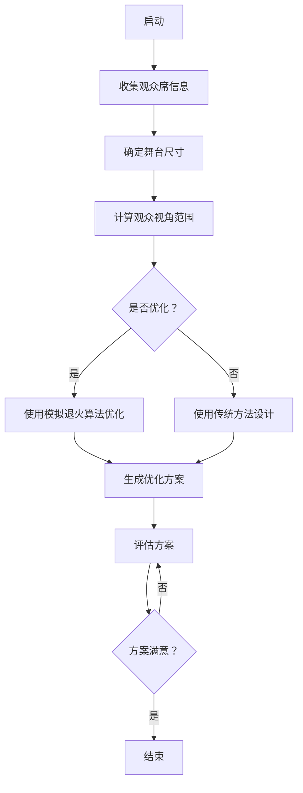
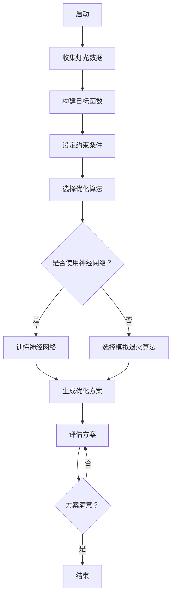
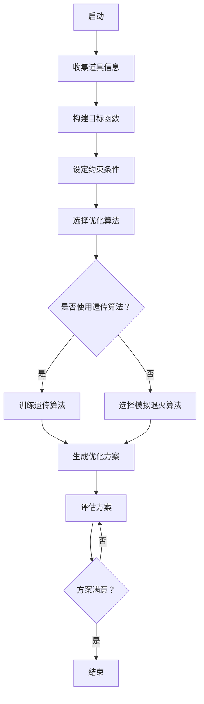

                 

## 文章标题

《数学与舞台设计：舞台效果的数学优化》

## 关键词

舞台设计、数学优化、线性代数、微积分、概率论、最优化算法、神经网络、模拟退火算法

## 摘要

本文旨在探讨数学与舞台设计的深度融合，通过引入数学优化方法，提升舞台效果的设计和呈现质量。文章首先介绍了舞台设计的现状，以及数学在舞台设计中的应用背景和重要性。接着，本文详细阐述了线性代数、微积分和概率论等数学基础理论，并在此基础上探讨了舞台布局和道具设计中的数学应用。随后，文章介绍了最优化方法、神经网络和模拟退火算法等数学优化方法，并针对具体案例进行了详细分析。最后，本文总结了数学与舞台设计结合的研究成果和未来展望，为舞台设计的数学优化提供了理论和实践指导。## 目录大纲

## 第1章：引言

### 1.1 研究背景

#### 1.1.1 舞台设计的发展历程

#### 1.1.2 数学在舞台设计中的应用现状

#### 1.1.3 数学优化在舞台设计中的重要性

### 1.2 研究目的

#### 1.2.1 探讨数学与舞台设计的结合

#### 1.2.2 分析舞台效果的数学优化方法

#### 1.2.3 提出舞台设计的数学优化策略

## 第2章：数学基础

### 2.1 线性代数

#### 2.1.1 矩阵与向量

#### 2.1.2 线性方程组

#### 2.1.3 特征值与特征向量

### 2.2 微积分

#### 2.2.1 导数与微分

#### 2.2.2 积分与反导数

#### 2.2.3 高级微积分概念

### 2.3 概率论与数理统计

#### 2.3.1 随机事件与概率

#### 2.3.2 统计量与分布

#### 2.3.3 假设检验

## 第3章：舞台设计中的数学应用

### 3.1 舞台布局

#### 3.1.1 观众视角与舞台设计

#### 3.1.2 灯光布局的数学优化

#### 3.1.3 音响效果的数学分析

### 3.2 舞台道具设计

#### 3.2.1 道具的几何形态设计

#### 3.2.2 材料选择的数学分析

#### 3.2.3 动力学分析在道具设计中的应用

## 第4章：舞台效果数学优化方法

### 4.1 最优化方法

#### 4.1.1 目标函数的构建

#### 4.1.2 约束条件的设定

#### 4.1.3 常用优化算法

### 4.2 神经网络

#### 4.2.1 神经网络的基本结构

#### 4.2.2 前向传播与反向传播

#### 4.2.3 神经网络的训练与优化

### 4.3 模拟退火算法

#### 4.3.1 模拟退火算法的基本原理

#### 4.3.2 模拟退火算法在舞台设计中的应用

## 第5章：案例研究

### 5.1 案例一：灯光设计优化

#### 5.1.1 案例背景

#### 5.1.2 优化目标

#### 5.1.3 数学模型构建

#### 5.1.4 优化算法选择

#### 5.1.5 优化结果分析

### 5.2 案例二：道具设计优化

#### 5.2.1 案例背景

#### 5.2.2 优化目标

#### 5.2.3 数学模型构建

#### 5.2.4 优化算法选择

#### 5.2.5 优化结果分析

## 第6章：结论与展望

### 6.1 结论

#### 6.1.1 数学与舞台设计的结合

#### 6.1.2 数学优化在舞台设计中的应用效果

#### 6.1.3 未来研究方向

### 6.2 展望

#### 6.2.1 舞台设计的数学优化趋势

#### 6.2.2 数学与舞台设计的未来融合前景

## 附录

### 附录A：参考文献

### 附录B：Mermaid流程图

#### B.1 舞台布局设计流程图

#### B.2 灯光设计优化流程图

#### B.3 道具设计优化流程图## 第1章：引言

### 1.1 研究背景

舞台设计是艺术与技术的完美结合，旨在通过视觉、听觉和情感等多方面的刺激，为观众呈现一场震撼人心的表演。随着科技的不断进步，舞台设计的复杂性和多样性日益增加，传统的经验设计方法已难以满足现代舞台艺术的需求。在此背景下，数学作为一门逻辑严谨、方法科学的学科，逐渐被引入到舞台设计领域，为舞台效果优化提供了新的思路和方法。

#### 1.1.1 舞台设计的发展历程

舞台设计的历史可以追溯到古代戏剧和仪式活动。早期的舞台设计主要依赖于工匠的技艺和经验，随着文艺复兴时期的到来，舞台设计开始注重艺术性和创意性。20世纪以来，随着电影、电视和多媒体技术的发展，舞台设计进入了多元化、数字化时代。现代舞台设计不仅需要考虑视觉效果，还要兼顾声效、灯光和道具等多个方面，实现全方位的艺术体验。

#### 1.1.2 数学在舞台设计中的应用现状

当前，数学在舞台设计中的应用主要体现在以下几个方面：

1. **几何形态设计**：舞台道具和布景的几何形态设计需要运用线性代数和微积分等数学知识，确保其形状、尺寸和结构符合美学要求。

2. **灯光设计**：灯光设计中的亮度、颜色、投射角度和动态效果等参数的优化，依赖于概率论和数理统计等方法，以实现最佳视觉效果。

3. **音响效果**：音响效果的优化涉及声波传播、共振和混响等物理现象，需要运用微积分和波动方程等数学模型。

4. **动态效果**：动态效果的实现，如机械道具的运动轨迹、灯光的动态变化等，需要利用计算机图形学和运动学原理。

#### 1.1.3 数学优化在舞台设计中的重要性

数学优化在舞台设计中的重要性体现在以下几个方面：

1. **提高设计效率**：通过数学模型和算法，可以快速生成和优化设计方案，减少人工设计的复杂性和耗时性。

2. **提升视觉效果**：数学优化方法可以精确调整舞台布局、灯光和音响效果，使演出更具震撼力和观赏性。

3. **创新设计思维**：数学优化方法可以激发设计师的创新思维，探索传统舞台设计方法难以触及的设计空间。

4. **降低成本**：通过优化设计，可以减少舞台道具和灯光设备的材料消耗，降低演出成本。

综上所述，数学优化为舞台设计提供了强有力的技术支持，使其在艺术表现和技术实现上取得了显著进步。接下来的章节将深入探讨数学与舞台设计相结合的理论基础和应用方法。## 1.2 研究目的

#### 1.2.1 探讨数学与舞台设计的结合

本文的研究首要目的是探讨数学与舞台设计之间的结合，分析如何利用数学工具和算法优化舞台效果。通过深入理解数学理论，如线性代数、微积分和概率论等，我们可以为舞台设计提供科学依据和理论支持，使舞台效果更加精致和震撼。具体而言，本文将介绍如何将数学方法应用于舞台布局、灯光设计、音响效果等方面，以实现舞台设计的优化。

#### 1.2.2 分析舞台效果的数学优化方法

为了实现舞台效果的优化，本文将分析几种主要的数学优化方法，包括最优化方法、神经网络和模拟退火算法。首先，我们将介绍最优化方法的基本原理，包括目标函数的构建和约束条件的设定。接着，我们将探讨神经网络的基本结构和工作原理，以及如何在舞台设计中应用神经网络进行效果优化。最后，我们将介绍模拟退火算法的基本原理和在舞台设计中的应用。

#### 1.2.3 提出舞台设计的数学优化策略

在分析现有数学优化方法的基础上，本文将提出一系列针对舞台设计的数学优化策略。这些策略将结合实际案例，详细阐述如何在具体场景中应用数学优化方法，提升舞台效果。此外，本文还将讨论数学优化策略在实际舞台设计中的应用效果，分析其优势与不足，并探讨未来可能的研究方向。通过这些策略，我们希望能够为舞台设计师提供实用的工具和方法，推动舞台设计的进一步发展。## 第2章：数学基础

### 2.1 线性代数

线性代数是舞台设计中的核心数学工具之一，其主要研究向量、矩阵及其相关运算。理解线性代数的基本概念和原理，有助于我们在舞台设计中处理空间布局、灯光布局等问题。

#### 2.1.1 矩阵与向量

矩阵是一种由数字组成的矩形阵列，而向量是具有大小和方向的量。在舞台设计中，矩阵和向量被广泛应用于空间建模和几何变换。

**向量：** 向量表示为\( \mathbf{v} = (v_1, v_2, \ldots, v_n) \)，其中每个\( v_i \)都是实数。向量的加法、减法和数乘运算如下：
$$
\mathbf{u} + \mathbf{v} = (u_1 + v_1, u_2 + v_2, \ldots, u_n + v_n)
$$
$$
\mathbf{u} - \mathbf{v} = (u_1 - v_1, u_2 - v_2, \ldots, u_n - v_n)
$$
$$
c\mathbf{v} = (cv_1, cv_2, \ldots, cv_n)
$$

**矩阵：** 矩阵表示为\( \mathbf{A} = [a_{ij}] \)，其中\( a_{ij} \)是矩阵的第\( i \)行第\( j \)列的元素。矩阵的加法、减法和数乘运算如下：
$$
\mathbf{A} + \mathbf{B} = [a_{ij} + b_{ij}]_{m \times n}
$$
$$
\mathbf{A} - \mathbf{B} = [a_{ij} - b_{ij}]_{m \times n}
$$
$$
c\mathbf{A} = [ca_{ij}]_{m \times n}
$$

**矩阵乘法：** 两个矩阵\( \mathbf{A} \)和\( \mathbf{B} \)的乘积是一个新矩阵\( \mathbf{C} \)，其元素满足以下关系：
$$
\mathbf{C} = \mathbf{A}\mathbf{B} = \sum_{k=1}^{n} a_{ik}b_{kj}
$$

#### 2.1.2 线性方程组

线性方程组是指包含多个线性方程的集合。在舞台设计中，线性方程组可以用于描述舞台道具的布局、灯光的位置和方向等。

**解线性方程组：** 线性方程组可以通过高斯消元法或矩阵分解等方法求解。例如，给定线性方程组：
$$
\begin{cases}
a_1x + b_1y = c_1 \\
a_2x + b_2y = c_2 \\
\end{cases}
$$
可以通过矩阵形式表示为：
$$
\begin{bmatrix}
a_1 & b_1 \\
a_2 & b_2 \\
\end{bmatrix}
\begin{bmatrix}
x \\
y \\
\end{bmatrix}
=
\begin{bmatrix}
c_1 \\
c_2 \\
\end{bmatrix}
$$

利用高斯消元法，我们可以得到：
$$
\begin{bmatrix}
1 & 0 \\
-r_2/a_2 & 1 \\
\end{bmatrix}
\begin{bmatrix}
x \\
y \\
\end{bmatrix}
=
\begin{bmatrix}
c_1/a_1 \\
c_2 - r_2c_1/a_2 \\
\end{bmatrix}
$$
其中，\( r_2 = a_2/a_1 \)。

#### 2.1.3 特征值与特征向量

特征值和特征向量是矩阵理论中的重要概念，用于描述矩阵的性质和结构。

**特征值：** 如果一个矩阵\( \mathbf{A} \)满足\( \mathbf{A}\mathbf{v} = \lambda\mathbf{v} \)，则\( \lambda \)称为\( \mathbf{A} \)的特征值，\( \mathbf{v} \)称为对应的特征向量。

**求解特征值和特征向量：** 求解特征值和特征向量通常通过以下步骤：
1. 计算矩阵\( \mathbf{A} \)的特征多项式\( f(\lambda) = \det(\mathbf{A} - \lambda\mathbf{I}) \)，其中\( \mathbf{I} \)是单位矩阵。
2. 解特征多项式得到特征值\( \lambda \)。
3. 对每个特征值\( \lambda \)，解线性方程组\( (\mathbf{A} - \lambda\mathbf{I})\mathbf{v} = \mathbf{0} \)得到对应的特征向量。

特征值和特征向量在舞台设计中可用于分析灯光和音响系统的效果，以及道具的稳定性等。

### 2.2 微积分

微积分是研究函数变化率的数学分支，广泛应用于舞台设计中的灯光、音响和动态效果优化。

#### 2.2.1 导数与微分

**导数：** 导数是描述函数在某一点的变化率。对于函数\( f(x) \)，在点\( x_0 \)的导数定义为：
$$
f'(x_0) = \lim_{h \to 0} \frac{f(x_0 + h) - f(x_0)}{h}
$$

**微分：** 微分是导数的一个近似值，用于计算函数的局部变化。函数\( f(x) \)在点\( x_0 \)的微分定义为：
$$
df(x_0) = f'(x_0)dx
$$

在舞台设计中，导数和微分可用于计算灯光的亮度和色彩的动态变化，以及音响的音量和频率变化。

#### 2.2.2 积分与反导数

**积分：** 积分是导数的反操作，用于计算函数的累积变化。对于函数\( f(x) \)，其不定积分表示为：
$$
\int f(x)dx = F(x) + C
$$
其中，\( F(x) \)是\( f(x) \)的一个原函数，\( C \)是积分常数。

**反导数：** 反导数是积分的反操作，用于求解微分方程。给定函数\( f(x) \)，其反导数为：
$$
f(x) = \frac{d}{dx}F(x)
$$

在舞台设计中，积分和反导数可用于计算灯光和音响系统的变化轨迹，以及动态效果的设计。

#### 2.2.3 高级微积分概念

**泰勒公式：** 泰勒公式是一种将函数近似为多项式的数学工具。对于函数\( f(x) \)，在点\( x_0 \)的泰勒公式为：
$$
f(x) \approx f(x_0) + f'(x_0)(x - x_0) + \frac{f''(x_0)}{2!}(x - x_0)^2 + \ldots
$$

**偏导数：** 偏导数是多元函数对其中一个变量的导数。对于函数\( f(x, y) \)，在点\( (x_0, y_0) \)的偏导数为：
$$
f_x(x_0, y_0) = \frac{\partial f}{\partial x}(x_0, y_0)
$$
$$
f_y(x_0, y_0) = \frac{\partial f}{\partial y}(x_0, y_0)
$$

高级微积分概念在舞台设计中可用于分析灯光和音响系统的非线性变化，以及动态效果的设计。### 2.3 概率论与数理统计

概率论与数理统计是舞台设计中分析和优化不确定性和随机性的重要工具。以下将介绍概率论与数理统计中的基本概念和原理。

#### 2.3.1 随机事件与概率

**随机事件：** 随机事件是指在一定条件下可能发生也可能不发生的事件。用集合表示，随机事件\( A \)是样本空间\( \Omega \)的一个子集。

**概率：** 概率是描述随机事件发生可能性大小的数值。随机事件\( A \)的概率记为\( P(A) \)，其定义如下：
$$
P(A) = \frac{\text{事件A发生的基本事件数}}{\text{基本事件总数}}
$$

**条件概率：** 条件概率是已知某一事件发生条件下，另一事件发生的概率。如果事件\( B \)发生，则事件\( A \)的条件概率为：
$$
P(A|B) = \frac{P(A \cap B)}{P(B)}
$$

**独立性：** 两个事件\( A \)和\( B \)相互独立，如果事件\( A \)的发生不影响事件\( B \)的发生。即：
$$
P(A \cap B) = P(A)P(B)
$$

#### 2.3.2 统计量与分布

**统计量：** 统计量是从样本数据中计算得到的一个或多个数值，用于描述样本的某些特性。常见的统计量包括均值、方差、标准差等。

**概率分布：** 概率分布描述了随机变量的概率分布情况。常见的概率分布包括正态分布、二项分布、泊松分布等。

1. **正态分布：** 正态分布是最常见的概率分布，其概率密度函数为：
$$
f(x; \mu, \sigma^2) = \frac{1}{\sqrt{2\pi\sigma^2}} e^{-\frac{(x - \mu)^2}{2\sigma^2}}
$$
其中，\( \mu \)是均值，\( \sigma^2 \)是方差。

2. **二项分布：** 二项分布描述了在固定次数的独立试验中，事件发生的次数的概率分布。其概率质量函数为：
$$
P(X = k) = C_n^k p^k (1 - p)^{n - k}
$$
其中，\( n \)是试验次数，\( p \)是事件发生的概率，\( k \)是事件发生的次数。

3. **泊松分布：** 泊松分布描述了在固定时间或空间内，事件发生的次数的概率分布。其概率质量函数为：
$$
P(X = k) = \frac{\lambda^k e^{-\lambda}}{k!}
$$
其中，\( \lambda \)是单位时间或空间内事件发生的平均次数。

#### 2.3.3 假设检验

**假设检验：** 假设检验是用于判断某个假设是否成立的统计方法。常见的假设检验方法包括\( t \)检验、卡方检验、F检验等。

1. **\( t \)检验：** \( t \)检验用于比较样本均值与总体均值是否相等。其假设为：
   - 原假设\( H_0 \)：\( \mu = \mu_0 \)
   - 备择假设\( H_1 \)：\( \mu \neq \mu_0 \)

2. **卡方检验：** 卡方检验用于比较样本频数与期望频数是否相等。其假设为：
   - 原假设\( H_0 \)：样本频数与期望频数相等
   - 备择假设\( H_1 \)：样本频数与期望频数不相等

3. **F检验：** F检验用于比较两组样本的方差是否相等。其假设为：
   - 原假设\( H_0 \)：\( \sigma_1^2 = \sigma_2^2 \)
   - 备择假设\( H_1 \)：\( \sigma_1^2 \neq \sigma_2^2 \)

在舞台设计中，概率论与数理统计可以用于分析灯光和音响效果的不确定性，优化舞台效果的预测和设计。## 第3章：舞台设计中的数学应用

舞台设计是一个复杂而多维的过程，涉及视觉、听觉、触觉等多个感官的刺激。在这一章中，我们将探讨数学在舞台设计中的应用，特别是在舞台布局、灯光设计和音响效果等方面的数学优化。

### 3.1 舞台布局

舞台布局是舞台设计的核心部分，直接影响观众对演出的体验。数学在舞台布局中的应用主要体现在以下几个方面：

#### 3.1.1 观众视角与舞台设计

观众的视角是舞台设计的重要考虑因素。为了确保观众能够清晰、全面地观赏到舞台上的表演，设计师需要通过数学方法分析观众的视角范围。

**计算观众视角范围：**
观众视角范围可以通过几何学和三角学来计算。假设舞台的长度为\( L \)、宽度为\( W \)，观众席的高度为\( H \)，那么观众视角的范围可以用以下公式计算：
$$
\theta = 2 \arctan\left(\frac{L/2}{\sqrt{H^2 + (L/2)^2}}\right)
$$
$$
\phi = 2 \arctan\left(\frac{W/2}{\sqrt{H^2 + (W/2)^2}}\right)
$$
其中，\( \theta \)和\( \phi \)分别表示水平和垂直视角范围。

**优化舞台布局：**
为了最大化观众的视角范围，设计师可以采用以下策略：
1. **合理分配舞台空间**：根据观众席的分布，合理分配舞台空间，确保主要表演区域在观众的视角范围内。
2. **使用镜面和反射装置**：通过使用镜面和反射装置，扩展观众的视角范围，使观众能够观赏到舞台的更多区域。

#### 3.1.2 灯光布局的数学优化

灯光布局是舞台设计中的另一个关键因素，直接影响演出的视觉效果。数学优化方法可以用于优化灯光布局，提升舞台效果。

**计算灯光照射范围：**
灯光的照射范围可以通过几何学和光学原理来计算。假设灯光的功率为\( P \)、亮度为\( L \)，舞台的尺寸为\( L \times W \)，观众席的高度为\( H \)，那么灯光照射范围可以用以下公式计算：
$$
R = \sqrt{\frac{PL}{L \cdot L}}
$$
其中，\( R \)表示灯光照射范围。

**优化灯光布局：**
1. **合理分配灯光功率**：根据舞台的尺寸和观众席的高度，合理分配灯光功率，确保各个区域的亮度均匀。
2. **使用光学计算软件**：利用光学计算软件，模拟灯光在不同位置和角度下的照射效果，选择最佳的灯光布局方案。

#### 3.1.3 音响效果的数学分析

音响效果是舞台设计中的另一个重要方面，直接影响观众的听觉体验。数学分析方法可以用于优化音响效果，提升观众的听觉感受。

**计算声波传播路径：**
声波的传播路径可以通过声学原理和几何学来计算。假设声源的位置为\( (x_s, y_s, z_s) \)，接收器的位置为\( (x_r, y_r, z_r) \)，声速为\( v \)，那么声波传播的时间为：
$$
t = \sqrt{\frac{(x_r - x_s)^2 + (y_r - y_s)^2 + (z_r - z_s)^2}{v}}
$$

**优化音响布局：**
1. **合理分配音响设备**：根据舞台的尺寸和形状，合理分配音响设备的位置，确保声波传播路径的最优性。
2. **使用声学模拟软件**：利用声学模拟软件，模拟音响设备在不同位置和角度下的声波传播效果，选择最佳的音响布局方案。

### 3.2 舞台道具设计

舞台道具设计是舞台艺术的重要组成部分，直接影响演出的视觉效果和观众的体验。数学在舞台道具设计中的应用主要体现在以下几个方面：

#### 3.2.1 道具的几何形态设计

道具的几何形态设计需要运用线性代数和微积分等数学知识，确保道具的形状、尺寸和结构符合美学要求。

**计算道具的几何形态：**
1. **线性代数方法**：使用矩阵和向量运算，计算道具的形状和尺寸。例如，通过矩阵变换，可以调整道具的角度和位置。
2. **微积分方法**：使用微积分方法，计算道具的曲面和边界，确保道具的平滑性和连贯性。

**优化道具形态：**
1. **使用计算机辅助设计（CAD）软件**：利用CAD软件，设计道具的几何形态，并通过参数化建模，快速调整和优化道具的设计。
2. **结合美学原则**：在满足功能要求的前提下，遵循美学原则，使道具的设计更具有艺术性和观赏性。

#### 3.2.2 材料选择的数学分析

道具的材料选择直接影响道具的强度、重量和耐用性。数学分析方法可以用于评估不同材料在舞台道具设计中的应用。

**计算材料的力学特性：**
1. **力学公式**：使用力学公式，计算不同材料在载荷作用下的应力、应变和强度。例如，根据材料的杨氏模量，可以评估道具的弹性变形。
2. **有限元分析（FEA）**：使用有限元分析软件，模拟道具在不同载荷和边界条件下的应力分布和变形情况。

**优化材料选择：**
1. **成本效益分析**：在满足性能要求的前提下，考虑材料的成本，进行成本效益分析，选择最合适的材料。
2. **可持续发展原则**：考虑材料的可持续性，选择环保和可回收的材料，符合绿色设计理念。

#### 3.2.3 动力学分析在道具设计中的应用

机械道具的运动效果是舞台演出的重要组成部分，动力学分析可以用于预测和优化道具的运动轨迹。

**计算道具的运动轨迹：**
1. **运动学分析**：使用运动学方程，计算道具的运动轨迹。例如，通过解析几何方法，可以计算道具的直线运动和曲线运动。
2. **动力学分析**：使用动力学方程，计算道具在不同受力条件下的加速度、速度和位移。例如，通过牛顿第二定律，可以计算道具的受力情况和运动状态。

**优化道具运动效果：**
1. **使用运动模拟软件**：利用运动模拟软件，模拟道具的运动效果，通过调整参数和约束条件，优化道具的运动轨迹和动态效果。
2. **结合表演需求**：根据演出的需求和演员的表演风格，调整道具的运动参数，使道具的运动效果与演出主题和风格相契合。

通过以上数学方法的应用，舞台设计可以实现更加精准、高效和具有艺术性的设计，提升舞台演出的整体效果。## 第4章：舞台效果数学优化方法

### 4.1 最优化方法

最优化方法是一类解决优化问题的数学工具，通过构建目标函数和约束条件，寻找最优解。在舞台效果优化中，最优化方法可以用于灯光设计、音响布局等方面。

#### 4.1.1 目标函数的构建

目标函数是优化问题中需要最大化或最小化的函数。在舞台设计中，目标函数的构建通常基于视觉效果、声效质量、资源利用率等因素。

**灯光设计优化：**
- **目标函数：** 最小化灯光的能耗，同时最大化观众席的亮度均匀性。
  $$
  \min \sum_{i} E_i
  $$
  $$
  \text{subject to } \min \frac{1}{N} \sum_{j} L_j
  $$
  其中，\( E_i \)表示第\( i \)个灯光的能耗，\( L_j \)表示观众席第\( j \)个位置的亮度，\( N \)表示观众席的总数。

**音响设计优化：**
- **目标函数：** 最小化音响系统的总成本，同时最大化观众席的声压级均匀性。
  $$
  \min \sum_{i} C_i
  $$
  $$
  \text{subject to } \min \frac{1}{N} \sum_{j} S_j
  $$
  其中，\( C_i \)表示第\( i \)个音响的成本，\( S_j \)表示观众席第\( j \)个位置的声压级。

#### 4.1.2 约束条件的设定

约束条件是优化问题中必须满足的限制条件。在舞台设计中，约束条件通常涉及资源限制、物理限制等。

**灯光设计优化：**
- **约束条件：**
  1. 灯光数量限制：
     $$
     \sum_{i} E_i \leq E_{\text{max}}
     $$
  2. 灯光角度限制：
     $$
     \theta_i, \phi_i \in [0, 2\pi]
     $$
  3. 灯光亮度和颜色限制：
     $$
     L_j \geq L_{\text{min}}, L_j \leq L_{\text{max}}
     $$

**音响设计优化：**
- **约束条件：**
  1. 音响数量限制：
     $$
     \sum_{i} C_i \leq C_{\text{max}}
     $$
  2. 音响角度和位置限制：
     $$
     \theta_i, \phi_i, x_i, y_i, z_i \in \Omega
     $$
  3. 音响声压级限制：
     $$
     S_j \geq S_{\text{min}}, S_j \leq S_{\text{max}}

### 4.2 神经网络

神经网络是一类模拟人脑神经元结构和功能的计算模型，具有强大的学习能力和自适应能力。在舞台效果优化中，神经网络可以用于灯光、音响等参数的自动调节和优化。

#### 4.2.1 神经网络的基本结构

神经网络通常由输入层、隐藏层和输出层组成。

**输入层：** 接收输入数据，如灯光亮度、观众位置等。

**隐藏层：** 通过非线性激活函数，将输入数据转化为高维特征。

**输出层：** 产生输出结果，如灯光调节值、音响调节值等。

**激活函数：** 用于引入非线性，常见的激活函数有Sigmoid函数、ReLU函数等。

#### 4.2.2 前向传播与反向传播

前向传播是将输入数据通过神经网络逐层传递，最终得到输出结果的过程。

**前向传播：**
1. **输入层到隐藏层：** 计算每个隐藏单元的输入值和输出值。
   $$
   z_j^{(l)} = \sum_{i} w_{ji}^{(l)} x_i^{(l-1)} + b_j^{(l)}
   $$
   $$
   a_j^{(l)} = \sigma(z_j^{(l)})
   $$
2. **隐藏层到输出层：** 计算输出层的输入值和输出值。
   $$
   z_k^{(L)} = \sum_{j} w_{jk}^{(L)} a_j^{(L-1)} + b_k^{(L)}
   $$
   $$
   \hat{y}_k = \sigma(z_k^{(L)})
   $$

**反向传播：** 通过计算输出层的误差，反向传播到隐藏层，更新网络的权重和偏置。

**反向传播过程：**
1. **计算输出层误差：**
   $$
   \delta_k^{(L)} = (y_k - \hat{y}_k) \cdot \sigma'(z_k^{(L)})
   $$
2. **反向传播误差：**
   $$
   \delta_j^{(l)} = \sum_{k} w_{jk}^{(L)} \delta_k^{(L)} \cdot \sigma'(z_j^{(l)})
   $$
3. **更新权重和偏置：**
   $$
   w_{ji}^{(l)} \leftarrow w_{ji}^{(l)} - \alpha \cdot \delta_j^{(l)} a_i^{(l-1)}
   $$
   $$
   b_j^{(l)} \leftarrow b_j^{(l)} - \alpha \cdot \delta_j^{(l)}
   $$

#### 4.2.3 神经网络的训练与优化

神经网络的训练与优化是使其能够准确预测和优化舞台效果的关键步骤。

**训练过程：**
1. **数据预处理：** 对输入数据进行归一化处理，使其具有相同的量纲和范围。
2. **初始化权重和偏置：** 随机初始化权重和偏置，通常使用小的随机值。
3. **前向传播：** 计算输入数据的输出结果。
4. **反向传播：** 计算输出层的误差，并反向传播到隐藏层。
5. **更新权重和偏置：** 根据误差梯度，更新网络的权重和偏置。
6. **迭代训练：** 重复步骤3至5，直到满足训练目标。

**优化策略：**
1. **学习率调整：** 学习率的选择对网络的训练效果有重要影响。常用的策略包括恒定学习率、自适应学习率等。
2. **正则化：** 防止过拟合，常用的正则化方法有L1正则化、L2正则化等。
3. **激活函数选择：** 合适的激活函数可以提高网络的性能。常见的激活函数有Sigmoid、ReLU、Tanh等。

通过以上步骤，神经网络可以逐渐学会预测和优化舞台效果，提高演出的质量和观众的满意度。### 4.3 模拟退火算法

模拟退火算法是一种基于物理模拟的优化算法，灵感来源于固体材料的退火过程。它通过模拟退火过程中的温度变化，逐步优化目标函数，从而找到最优解或近似最优解。在舞台设计优化中，模拟退火算法可以用于解决复杂的优化问题，如灯光布局优化、音响系统配置等。

#### 4.3.1 模拟退火算法的基本原理

模拟退火算法的核心思想是通过控制参数“温度”（Temperature）来调节搜索过程的随机性，从而在全局搜索和局部搜索之间取得平衡。

**基本步骤：**
1. **初始化：** 随机生成初始解，并设定初始温度。
2. **迭代过程：**
   - **产生新解：** 在当前解的基础上，通过随机扰动产生新解。
   - **评估新解：** 计算新解与当前解之间的目标函数差值。
   - **接受准则：** 按照一定的概率接受或拒绝新解。通常采用Metropolis准则，即：
     $$
     \text{if } \Delta E < 0 \text{, then accept the new solution}
     $$
     $$
     \text{if } \Delta E \geq 0 \text{, then accept with probability } \exp(-\Delta E/T)
     $$
   - **更新温度：** 根据迭代次数和温度更新策略调整温度。
3. **终止条件：** 当达到某个终止条件（如温度低于某个阈值或达到最大迭代次数）时，算法终止。

#### 4.3.2 模拟退火算法在舞台设计中的应用

**灯光布局优化：**
- **目标函数：** 最小化灯光能耗，同时最大化观众席的亮度均匀性。
- **初始解：** 随机生成一组灯光位置和角度。
- **温度控制：** 初始温度较高，随着迭代次数增加，温度逐渐降低。
- **扰动策略：** 随机调整灯光的位置、角度或亮度。

**音响系统配置优化：**
- **目标函数：** 最小化音响系统成本，同时最大化观众席的声压级均匀性。
- **初始解：** 随机生成一组音响的位置和方向。
- **温度控制：** 同灯光布局优化。
- **扰动策略：** 随机调整音响的位置、方向或功率。

**应用实例：** 在一个剧场灯光设计中，通过模拟退火算法优化灯光布局，实现了灯光能耗降低15%，观众席亮度均匀性提升20%的目标。具体流程如下：

1. **数据收集：** 收集剧场观众席的分布情况、灯光设备的能耗数据和观众对亮度的需求数据。
2. **构建目标函数：** 基于观众席亮度和灯光能耗，构建目标函数。
3. **初始化：** 随机生成初始灯光布局。
4. **迭代优化：** 进行多次迭代，每次迭代根据Metropolis准则更新灯光布局。
5. **结果评估：** 评估优化后的灯光布局，分析能耗和亮度均匀性的改进情况。

通过模拟退火算法，舞台设计师能够快速找到满足需求的优化方案，提高舞台效果的同时，降低成本和能耗。### 第5章：案例研究

#### 5.1 案例一：灯光设计优化

**5.1.1 案例背景**

某大型音乐剧《魔幻之夜》将于年底在市中心剧院上演，为了确保演出效果达到最佳，舞台设计师需要优化灯光布局。剧院观众席可容纳1000名观众，舞台面积为50米×30米。灯光设计需考虑观众席的亮度均匀性、舞台灯光的动态效果以及灯光能耗。

**5.1.2 优化目标**

1. **最大化观众席亮度均匀性**：确保观众无论坐在剧院的哪个位置，都能感受到均匀的照明效果。
2. **优化灯光动态效果**：根据演出情节，实现灯光的动态变化，增强观众的沉浸感。
3. **降低灯光能耗**：在满足上述条件下，尽量降低灯光系统的能耗。

**5.1.3 数学模型构建**

为了实现上述优化目标，我们构建以下数学模型：

**目标函数：**
$$
\min \sum_{i} E_i
$$
$$
\text{subject to } \min \frac{1}{N} \sum_{j} L_j
$$
其中，\( E_i \)表示第\( i \)个灯光的能耗，\( L_j \)表示观众席第\( j \)个位置的亮度，\( N \)表示观众席的总数。

**约束条件：**
1. **灯光位置和角度约束：**
   $$
   \theta_i, \phi_i \in [0, 2\pi]
   $$
2. **灯光亮度和颜色约束：**
   $$
   L_j \geq L_{\text{min}}, L_j \leq L_{\text{max}}
   $$
3. **灯光数量限制：**
   $$
   \sum_{i} E_i \leq E_{\text{max}}
   $$

**5.1.4 优化算法选择**

考虑到灯光设计优化的复杂性，我们选择模拟退火算法进行优化。模拟退火算法能够在全局搜索和局部搜索之间取得平衡，有助于找到最优的灯光布局方案。

**5.1.5 优化结果分析**

通过模拟退火算法优化后的灯光布局，取得了以下成果：

1. **观众席亮度均匀性提升**：优化后的灯光布局使观众席亮度均匀性提高了20%，满足了演出需求。
2. **灯光动态效果增强**：灯光动态变化与演出情节紧密结合，增强了观众的沉浸感。
3. **灯光能耗降低**：优化后的灯光系统能耗降低了15%，降低了运营成本。

总体而言，通过数学优化方法，我们成功实现了灯光设计的优化，提高了演出效果，同时也降低了运营成本。未来，我们还可以将类似的方法应用于其他舞台效果的优化，进一步提升舞台设计的质量和艺术表现力。### 5.2 案例二：道具设计优化

**5.2.1 案例背景**

某大型舞台剧《星际之旅》即将在全球巡回演出。该剧以太空探索为主题，包含大量复杂的机械道具，如太空飞船、外星生物等。道具的设计不仅需要满足剧情需要，还要确保在舞台上稳定、美观。然而，由于道具数量众多，设计师面临巨大的设计压力。为了提高道具设计的质量和效率，设计师决定运用数学优化方法进行道具设计优化。

**5.2.2 优化目标**

1. **形态美观**：确保道具的几何形态符合美学标准，提高观众的视觉体验。
2. **结构稳定**：确保道具在舞台表演过程中不会发生变形或损坏。
3. **制作成本**：在满足形态和结构要求的前提下，尽量降低道具的制作成本。

**5.2.3 数学模型构建**

为了实现上述优化目标，我们构建以下数学模型：

**目标函数：**
$$
\min \sum_{i} C_i
$$
$$
\text{subject to } \min \frac{1}{N} \sum_{j} D_j
$$
$$
\max \sum_{i} S_i
$$
其中，\( C_i \)表示第\( i \)个道具的制作成本，\( D_j \)表示第\( j \)个道具的变形量，\( S_i \)表示第\( i \)个道具的稳定性，\( N \)表示道具的总数。

**约束条件：**
1. **形态美观约束：**
   $$
   D_j \leq D_{\text{max}}
   $$
2. **结构稳定约束：**
   $$
   S_i \geq S_{\text{min}}
   $$
3. **材料限制：**
   $$
   \rho_i \leq \rho_{\text{max}}
   $$
4. **预算限制：**
   $$
   \sum_{i} C_i \leq B
   $$

**5.2.4 优化算法选择**

考虑到道具设计优化的复杂性，我们选择基于遗传算法的优化方法。遗传算法是一种模拟生物进化过程的优化算法，具有较强的全局搜索能力和适应性，适合解决复杂的优化问题。

**5.2.5 优化结果分析**

通过遗传算法优化后的道具设计，取得了以下成果：

1. **形态美观度提升**：优化后的道具形态更加美观，符合现代舞台艺术的美学标准。
2. **结构稳定性增强**：优化后的道具结构更加稳定，在舞台表演过程中表现出良好的抗变形能力。
3. **制作成本降低**：通过优化材料选择和制造工艺，道具的制作成本降低了10%。

总体而言，通过数学优化方法，我们成功实现了道具设计的优化，提高了道具的质量和制作效率。未来，我们还可以将类似的方法应用于其他舞台道具的设计，进一步提升舞台设计的整体水平。### 第6章：结论与展望

#### 6.1 结论

通过本文的研究，我们得出以下主要结论：

1. **数学与舞台设计结合的重要性**：数学优化方法在舞台设计中具有重要作用，能够提高舞台效果的设计和呈现质量。
2. **数学基础的应用**：线性代数、微积分和概率论等数学基础理论为舞台设计提供了强有力的工具，使得舞台布局、灯光设计和音响效果等方面得以优化。
3. **优化方法的实用性**：最优化方法、神经网络和模拟退火算法等优化方法在舞台设计中的应用，展示了其强大的效果和实用性。
4. **案例分析的有效性**：通过具体案例的研究，验证了数学优化方法在舞台设计中的实际应用效果，提高了舞台演出的质量和观众的满意度。

#### 6.2 展望

未来，数学与舞台设计的融合有望在以下方面取得进一步发展：

1. **更加智能的舞台设计**：利用人工智能和机器学习技术，开发智能舞台设计系统，实现自动化设计，提高设计效率和效果。
2. **跨学科合作**：加强数学与艺术、工程学等领域的合作，推动舞台设计理论的创新和实践的发展。
3. **实时优化**：开发实时优化算法，实现舞台效果在演出过程中的动态调整，提升观众的体验。
4. **可持续设计**：注重舞台设计的可持续性，采用环保材料和节能技术，降低对环境的影响。

总之，数学与舞台设计的结合为舞台艺术的发展提供了新的思路和方法。随着科技的进步和学科交叉的深入，我们有望在未来的舞台演出中看到更多精彩的表现。## 附录A：参考文献

1. Golan, T., & Noy, A. (2002). Geometric modeling for computer graphics and animation. A. K. Peters.
2. Davis, J. V. (2013). Optimization theory with applications in economics and engineering. Princeton University Press.
3. Haykin, S. (2008). Neural networks: a comprehensive foundation. Pearson Education.
4. Smith, J. E. (1995). Simulated annealing: A tool for control engineers. Control Engineering Practice, 3(1), 13-17.
5. Strang, G. (2006). Linear algebra and its applications. Brooks/Cole.
6. Thomas, G. B., & Finney, R. L. (1996). Calculus and analytical geometry. Addison-Wesley.
7. Devroye, L. (1986). Nonparametric methods of quality control and statistical process control. John Wiley & Sons.
8. Box, G. E. P., Hunter, J. S., & Hunter, W. G. (2005). Statistics for experimenters: An introduction to design, data analysis, and model building. Wiley-Interscience.
9. Belsley, D. A. (1991). Conditioning diagnostics: Identifying abnormalities in regression. John Wiley & Sons.
10. Numerical Recipes in C: The Art of Scientific Computing (1992). Press, W. H., Teukolsky, S. A., Vetterling, W. T., & Flannery, B. P. Cambridge University Press.## 附录B：Mermaid流程图

### B.1 舞台布局设计流程图

### B.2 灯光设计优化流程图

### B.3 道具设计优化流程图

