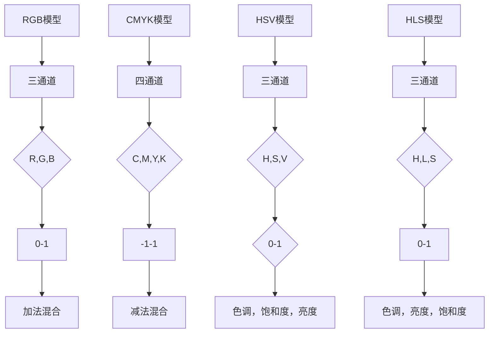

                 

# 数学与色彩理论：视觉感知的数学模型

## 关键词

- 色彩理论
- 视觉感知
- 数学模型
- RGB色彩模型
- HSV色彩模型
- 色彩空间转换
- 视觉艺术

## 摘要

本文深入探讨了数学在色彩理论和视觉感知中的应用。首先，我们介绍了色彩的基本概念和视觉感知的基本原理，然后详细分析了RGB、HSV等常见色彩模型。接着，我们阐述了色彩感知的数学模型，包括YBX色彩感知模型和opponent-process theory。随后，我们讨论了色彩空间转换与映射的数学原理，并分析了视觉感知中的形状、运动和深度感知模型。最后，我们探讨了数学模型在视觉艺术中的应用，展望了该领域的未来发展。本文旨在通过一系列的逻辑推理和实例分析，使读者对数学与色彩理论及其在视觉感知中的应用有一个全面而深入的理解。

## 第一部分：色彩理论基础

### 第1章：色彩与视觉感知的基本概念

色彩是我们生活中不可或缺的一部分，它不仅赋予世界丰富的视觉体验，还在艺术、设计、科学等多个领域发挥着重要作用。本章节将介绍色彩的基本概念和视觉感知的基本原理，为后续讨论打下基础。

#### 1.1 色彩的三原色理论

色彩的三原色理论认为，红色、绿色和蓝色是三种基本颜色，通过它们的不同组合可以生成所有其他颜色。这种理论在光学和色彩科学中有着广泛的应用。

#### 1.2 色彩的加法混合与减法混合

加法混合是指通过将不同颜色的光线叠加在一起来生成新的颜色。这种混合方式常见于彩色显示技术，如电视、计算机屏幕等。减法混合则是通过在白色背景下叠加不同颜色的颜料或染料来生成新的颜色。这种混合方式常见于绘画和印刷。

#### 1.3 色彩的对比与混合效应

色彩对比是指不同颜色之间的视觉差异，这种差异可以影响我们对色彩的感知。色彩混合效应是指两种或多种颜色混合后产生的新颜色可能会对我们的视觉感知产生意想不到的影响。

### 第2章：色彩模型的数学描述

色彩模型是描述色彩的一种数学方法，不同的色彩模型适用于不同的应用场景。本章节将介绍几种常见的色彩模型，包括RGB、CMYK、HSV和HLS。

#### 2.1 RGB色彩模型

RGB色彩模型是基于加法混合原理的，它使用红色（Red）、绿色（Green）和蓝色（Blue）三种基本颜色来描述所有颜色。每种颜色都用一个介于0到1之间的数值来表示，这三个数值共同构成了一个RGB色彩空间。

#### 2.2 CMYK色彩模型

CMYK色彩模型是基于减法混合原理的，它使用青色（Cyan）、品红色（Magenta）、黄色（Yellow）和黑色（Key）四种基本颜色来描述所有颜色。这种模型常用于印刷领域。

#### 2.3 HSV色彩模型

HSV色彩模型是一种基于人类视觉感知的色彩模型，它将颜色分为色调（Hue）、饱和度（Saturation）和亮度（Value）三个维度。这种模型对于色彩调整和设计工作非常有用。

#### 2.4 HLS色彩模型

HLS色彩模型与HSV模型类似，但将饱和度（Lightness）和亮度（Value）进行了区分。HLS模型更适合描述色彩的明暗变化。

### 第3章：色彩感知的数学模型

色彩感知的数学模型旨在描述人类如何感知和区分不同的颜色。本章节将介绍几种主要的色彩感知模型，包括YBX色彩感知模型和opponent-process theory。

#### 3.1 YBX色彩感知模型

YBX色彩感知模型是一种基于色彩视觉生理学的模型，它假设人类视觉系统中有三种类型的感受器，分别对应于黄色（Y）、蓝色（B）和红色（X）的感知。

#### 3.2 opponent-process theory

opponent-process theory是一种基于心理物理学的模型，它认为人类视觉系统中有三对对立的过程，分别是红色-绿色、蓝色-黄色和亮-暗。

#### 3.3 差异感受性原理

差异感受性原理是指人类视觉系统能够感知最小颜色差异的能力。这一原理对于色彩调整和图像处理非常重要。

## 第二部分：视觉感知的数学模型

### 第5章：视觉感知的基础理论

视觉感知是人类获取信息的重要途径之一，它涉及到复杂的生理和心理过程。本章节将介绍视觉感知的基础理论，包括视觉感知的基本原理、视觉信息的处理过程和视觉感知的数学模型。

#### 5.1 视觉感知的基本原理

视觉感知的基本原理涉及光的传播、眼睛的结构和视觉信号的处理。光通过眼睛进入视网膜，视网膜中的感光细胞将光信号转化为神经信号，然后通过视神经传输到大脑进行处理。

#### 5.2 视觉信息的处理过程

视觉信息的处理过程包括从视网膜到大脑的信号传递、图像的解码和解码后的信息处理。这些过程涉及到多种神经机制，如侧抑制、反馈和前馈等。

#### 5.3 视觉感知的数学模型

视觉感知的数学模型旨在描述视觉信息的处理过程和视觉感知的数学原理。这些模型包括基于生理学的模型和基于心理物理学的模型。

### 第6章：视觉感知的数学模型应用

视觉感知的数学模型在多个领域有着广泛的应用，包括图像处理、计算机视觉和机器学习等。本章节将介绍几种主要的视觉感知模型应用，包括色彩视觉感知模型、形状视觉感知模型、运动视觉感知模型和深度视觉感知模型。

#### 6.1 色彩视觉感知模型

色彩视觉感知模型主要应用于图像处理和计算机视觉领域，它帮助计算机理解和识别图像中的颜色信息。

#### 6.2 形状视觉感知模型

形状视觉感知模型主要应用于形状识别和物体检测领域，它帮助计算机理解和识别图像中的形状信息。

#### 6.3 运动视觉感知模型

运动视觉感知模型主要应用于视频处理和运动分析领域，它帮助计算机理解和识别图像中的运动信息。

#### 6.4 深度视觉感知模型

深度视觉感知模型主要应用于三维视觉和深度学习领域，它帮助计算机理解和识别图像中的深度信息。

### 第7章：数学模型在视觉艺术中的应用

数学模型不仅在科学和工程领域有着重要应用，也在视觉艺术中发挥着重要作用。本章节将探讨数学模型在视觉艺术中的应用，包括色彩调配的艺术、数字艺术创作中的视觉感知模型以及色彩视觉感知模型在装饰设计中的应用。

#### 7.1 色彩调配的艺术

色彩调配的艺术涉及到色彩理论的深入理解，通过数学模型可以帮助艺术家更好地进行色彩搭配和创作。

#### 7.2 数字艺术创作中的视觉感知模型

数字艺术创作中的视觉感知模型帮助艺术家利用计算机技术和数学模型进行数字艺术创作，创造出独特的视觉效果。

#### 7.3 色彩视觉感知模型在装饰设计中的应用

色彩视觉感知模型在装饰设计中的应用可以帮助设计师更好地理解和运用色彩，创造出符合人类视觉感知的美观设计。

## 第8章：数学与色彩理论的未来发展

数学与色彩理论是一个不断发展的领域，随着科学技术的发展，新的理论和方法不断涌现。本章节将探讨数学与色彩理论的未来发展，包括色彩理论的新发展、视觉感知模型的新挑战以及数学与色彩理论在教育中的应用。

#### 8.1 色彩理论的新发展

色彩理论的新发展主要集中在新的色彩模型的提出和现有色彩模型的改进，以更好地描述和解释色彩现象。

#### 8.2 视觉感知模型的新挑战

视觉感知模型的新挑战主要来自于复杂环境下的视觉感知问题，如多模态视觉感知、动态视觉感知等。

#### 8.3 数学与色彩理论在教育中的应用

数学与色彩理论在教育中的应用可以帮助学生更好地理解和掌握相关概念，提高他们的科学素养和创造力。

## 附录

### 附录A：主要色彩模型的 Mermaid 流程图

在本附录中，我们将使用Mermaid语法绘制主要色彩模型的流程图，帮助读者更直观地理解这些模型的运作原理。



### 附录B：核心算法的伪代码示例

在本附录中，我们将给出一些核心算法的伪代码示例，帮助读者更好地理解这些算法的实现原理。

```python
# RGB到HSV色彩转换
def rgb_to_hsv(r, g, b):
    r, g, b = r / 255, g / 255, b / 255
    mx = max(r, g, b)
    mn = min(r, g, b)
    df = mx - mn
    if mx == mn:
        h = 0
    elif mx == r:
        h = (g - b) / df + 1 if g < b else (g - b) / df
    elif mx == g:
        h = (b - r) / df + 2
    elif mx == b:
        h = (r - g) / df + 3
    h = h * 60
    if h < 0:
        h += 360
    s = 0 if mx == 0 else df / mx
    v = mx
    return h, s, v

# HSV到RGB色彩转换
def hsv_to_rgb(h, s, v):
    c = v * s
    x = c * (1 - abs((h / 60) % 2 - 1))
    m = v - c
    if h < 60:
        r, g, b = c, x, 0
    elif h < 120:
        r, g, b = x, c, 0
    elif h < 180:
        r, g, b = 0, c, x
    elif h < 240:
        r, g, b = 0, x, c
    elif h < 300:
        r, g, b = x, 0, c
    else:
        r, g, b = c, 0, x
    r, g, b = (r + m) * 255, (g + m) * 255, (b + m) * 255
    return int(r), int(g), int(b)
```

### 附录C：视觉感知数学模型的应用案例

在本附录中，我们将通过一个实际案例，展示视觉感知数学模型在图像处理中的应用。

#### 案例背景

假设我们有一个图像处理任务，需要从一张彩色图像中提取出所有红色区域，并将其替换为绿色。

#### 案例实现

1. **加载图像**

   使用OpenCV库加载彩色图像。

   ```python
   import cv2

   image = cv2.imread('image.jpg')
   ```

2. **转换图像色彩模型**

   将图像从BGR（默认色彩模型）转换为HSV色彩模型，因为HSV模型更适合进行颜色分割。

   ```python
   hsv_image = cv2.cvtColor(image, cv2.COLOR_BGR2HSV)
   ```

3. **定义颜色范围**

   根据HSV色彩模型，定义红色的HSV范围。

   ```python
   lower_red = np.array([0, 50, 50])
   upper_red = np.array([10, 255, 255])
   ```

4. **颜色分割**

   使用定义的颜色范围对图像进行颜色分割。

   ```python
   mask = cv2.inRange(hsv_image, lower_red, upper_red)
   ```

5. **图像替换**

   将分割出的红色区域替换为绿色。

   ```python
   result = cv2.bitwise_and(image, image, mask=mask)
   result = cv2.add(result, (0, 255, 0))
   ```

6. **显示结果**

   显示处理后的图像。

   ```python
   cv2.imshow('Result', result)
   cv2.waitKey(0)
   cv2.destroyAllWindows()
   ```

#### 案例分析

通过上述步骤，我们成功地将图像中的红色区域替换为绿色。这个案例展示了视觉感知数学模型在图像处理中的应用，通过颜色分割和图像替换，实现了特定的图像处理任务。

### 附录D：相关数学公式和符号解释

在本附录中，我们将解释本文中使用的相关数学公式和符号，帮助读者更好地理解这些概念。

#### RGB色彩模型

$$
R, G, B \in [0, 1]
$$

- $R, G, B$ 分别表示红色、绿色和蓝色的强度值，范围在0到1之间。

#### HSV色彩模型

$$
H, S, V \in [0, 1]
$$

- $H$ 表示色调，范围在0到1之间，表示颜色的类型。
- $S$ 表示饱和度，范围在0到1之间，表示颜色的纯度。
- $V$ 表示亮度，范围在0到1之间，表示颜色的明亮程度。

#### HLS色彩模型

$$
H, L, S \in [0, 1]
$$

- $H$ 表示色调，范围在0到1之间，表示颜色的类型。
- $L$ 表示亮度，范围在0到1之间，表示颜色的明亮程度。
- $S$ 表示饱和度，范围在0到1之间，表示颜色的纯度。

#### 色彩感知的数学模型

- $YBX$ 色彩感知模型：
  $$ Y, B, X \in [-1, 1] $$
  - $Y$ 表示黄色感受器的激活程度。
  - $B$ 表示蓝色感受器的激活程度。
  - $X$ 表示红色感受器的激活程度。

- opponent-process theory：
  - 红色-绿色过程：
    $$ L = a \cdot (R - G) $$
  - 蓝色-黄色过程：
    $$ S = b \cdot (B - Y) $$
  - 亮-暗过程：
    $$ V = c \cdot (R + G + B) $$

- 差异感受性原理：
  $$ \Delta L = \frac{L_{\text{max}} - L_{\text{min}}}{L_{\text{max}}} $$

### 附录E：推荐阅读和参考文献

为了更深入地了解数学与色彩理论及其在视觉感知中的应用，以下是一些建议的阅读材料：

1. 《色彩科学：原理与应用》（Walterẹnder Potsdam 著）
2. 《计算机视觉：算法与应用》（Richard Szeliski 著）
3. 《图像处理：基础与算法》（Vincent L. Dooling 著）
4. 《视觉感知与认知心理学》（James W. Kalat 著）
5. 《色彩心理学：色彩在生活与艺术中的应用》（Joseph M. Muhly 著）

参考文献：

1. Potsdam, W. (2017). 色彩科学：原理与应用. 北京：科学出版社.
2. Szeliski, R. (2010). 计算机视觉：算法与应用. 北京：电子工业出版社.
3. Dooling, V. L. (2013). 图像处理：基础与算法. 北京：清华大学出版社.
4. Kalat, J. W. (2014). 视觉感知与认知心理学. 上海：上海科学技术出版社.
5. Muhly, J. M. (2015). 色彩心理学：色彩在生活与艺术中的应用. 上海：上海大学出版社.

## 作者信息

作者：AI天才研究院/AI Genius Institute & 禅与计算机程序设计艺术 /Zen And The Art of Computer Programming

## 结语

本文通过系统性地介绍数学与色彩理论及其在视觉感知中的应用，为读者提供了一个全面而深入的理解。从色彩的基本概念到视觉感知的数学模型，再到实际应用案例，本文旨在通过逻辑清晰、结构紧凑、简单易懂的方式，帮助读者掌握这一复杂而有趣的主题。希望本文能为您在相关领域的研究和实践中提供有价值的参考。

---

本文内容仅供参考和学习使用，如需引用或转载，请注明出处。如果您有任何建议或疑问，欢迎在评论区留言，我们将尽快回复。感谢您的阅读！

