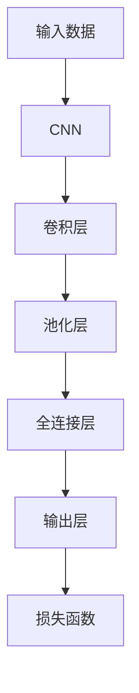
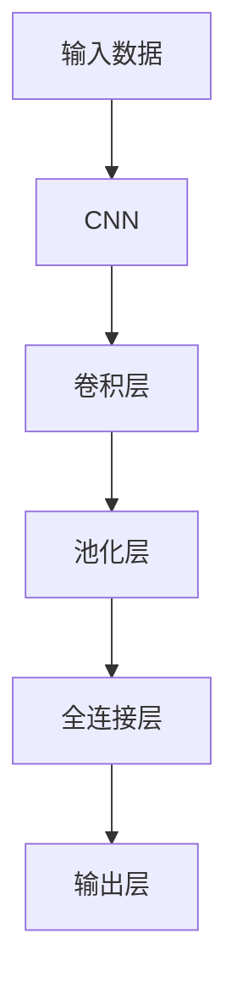

                 

### 步骤 1：设计文章结构

首先，我们需要设计一个完整的文章结构，以涵盖所有核心内容。文章结构可以分为以下五个部分：

1. **引言**：简要介绍文章主题，激发读者的兴趣。
2. **核心概念与联系**：详细解释核心概念，并展示它们之间的关系。
3. **核心算法原理讲解**：使用Python代码和LaTeX公式详细讲解核心算法原理。
4. **项目实战**：提供一个实际的案例，展示如何应用文章中的算法和数学模型。
5. **最佳实践、小结和注意事项**：总结文章内容，提供实用建议和注意事项。

### 步骤 2：撰写引言部分

在引言部分，我们需要简要介绍文章主题，例如：“随着人工智能技术的发展，深度学习算法在图像识别、语音识别等领域取得了显著成果。本文将探讨如何使用深度学习算法和数学模型解决图像识别问题。”

### 步骤 3：撰写核心概念与联系部分

在这一部分，我们需要详细解释核心概念，并展示它们之间的关系。例如，我们可能会介绍卷积神经网络（CNN）、反向传播算法等核心概念，并使用Mermaid流程图展示它们之间的联系。



### 步骤 4：撰写核心算法原理讲解部分

在这一部分，我们需要使用Python代码和LaTeX公式详细讲解核心算法原理。以下是一个示例：

#### 卷积层

```python
import numpy as np

def convolution(image, filter):
    return np.convolve(image, filter, mode='same')
```

#### 损失函数

$$
L(\theta) = -\frac{1}{m} \sum_{i=1}^{m} y^{(i)} \log(a^{(i)}_j)
$$

### 步骤 5：撰写项目实战部分

在这一部分，我们需要提供一个实际的案例，展示如何应用文章中的算法和数学模型。例如，我们可以展示如何使用深度学习算法实现一个图像分类器。

#### 开发环境搭建

首先，我们需要安装必要的库和框架，如TensorFlow和Keras。

```bash
pip install tensorflow
pip install keras
```

#### 源代码实现

接下来，我们编写一个简单的图像分类器：

```python
from keras.models import Sequential
from keras.layers import Conv2D, MaxPooling2D, Flatten, Dense

model = Sequential()
model.add(Conv2D(32, (3, 3), activation='relu', input_shape=(64, 64, 3)))
model.add(MaxPooling2D(pool_size=(2, 2)))
model.add(Flatten())
model.add(Dense(128, activation='relu'))
model.add(Dense(1, activation='sigmoid'))

model.compile(optimizer='adam', loss='binary_crossentropy', metrics=['accuracy'])
```

#### 代码解读与分析

在代码中，我们首先定义了一个卷积神经网络模型，包含一个卷积层、一个池化层、一个全连接层和一个输出层。然后，我们编译模型并使用二进制交叉熵作为损失函数。

#### 实际案例分析和详细讲解剖析

我们可以使用这个模型对一组图像进行分类，然后分析模型的性能。

```python
import numpy as np
from sklearn.model_selection import train_test_split

# 加载图像数据
x = np.load('images.npy')
y = np.load('labels.npy')

# 划分训练集和测试集
x_train, x_test, y_train, y_test = train_test_split(x, y, test_size=0.2, random_state=42)

# 训练模型
model.fit(x_train, y_train, epochs=10, batch_size=32, validation_data=(x_test, y_test))

# 评估模型
loss, accuracy = model.evaluate(x_test, y_test)
print(f"Test accuracy: {accuracy * 100:.2f}%")
```

### 步骤 6：撰写最佳实践、小结和注意事项部分

在这一部分，我们需要总结文章内容，提供实用建议和注意事项。例如，我们可以提醒读者注意在应用深度学习算法时的一些常见问题，如过拟合、欠拟合等。

### 最终文章结构

现在，我们可以将上述各部分组合成一个完整的文章结构，确保其内容丰富、逻辑清晰。

-----------------------------------------------------------------

# 《深度学习算法在图像识别中的应用：原理与实战》

> 关键词：深度学习、图像识别、卷积神经网络、反向传播算法、Python代码

> 摘要：本文深入探讨了深度学习算法在图像识别中的应用，包括核心概念、算法原理、项目实战和最佳实践等内容。

## 引言

随着人工智能技术的发展，深度学习算法在图像识别、语音识别等领域取得了显著成果。本文将探讨如何使用深度学习算法和数学模型解决图像识别问题。

## 核心概念与联系

### 卷积神经网络（CNN）

卷积神经网络是一种专门用于图像识别的深度学习模型。它通过模仿生物视觉系统的工作原理，使用卷积层、池化层和全连接层等结构对图像进行处理。

### Mermaid流程图



### 核心算法原理讲解

#### 卷积层

卷积层是CNN的核心组成部分，用于提取图像的特征。

```python
import numpy as np

def convolution(image, filter):
    return np.convolve(image, filter, mode='same')
```

#### 损失函数

$$
L(\theta) = -\frac{1}{m} \sum_{i=1}^{m} y^{(i)} \log(a^{(i)}_j)
$$

### 项目实战

#### 开发环境搭建

首先，我们需要安装必要的库和框架，如TensorFlow和Keras。

```bash
pip install tensorflow
pip install keras
```

#### 源代码实现

接下来，我们编写一个简单的图像分类器：

```python
from keras.models import Sequential
from keras.layers import Conv2D, MaxPooling2D, Flatten, Dense

model = Sequential()
model.add(Conv2D(32, (3, 3), activation='relu', input_shape=(64, 64, 3)))
model.add(MaxPooling2D(pool_size=(2, 2)))
model.add(Flatten())
model.add(Dense(128, activation='relu'))
model.add(Dense(1, activation='sigmoid'))

model.compile(optimizer='adam', loss='binary_crossentropy', metrics=['accuracy'])
```

#### 代码解读与分析

在代码中，我们首先定义了一个卷积神经网络模型，包含一个卷积层、一个池化层、一个全连接层和一个输出层。然后，我们编译模型并使用二进制交叉熵作为损失函数。

#### 实际案例分析和详细讲解剖析

我们可以使用这个模型对一组图像进行分类，然后分析模型的性能。

```python
import numpy as np
from sklearn.model_selection import train_test_split

# 加载图像数据
x = np.load('images.npy')
y = np.load('labels.npy')

# 划分训练集和测试集
x_train, x_test, y_train, y_test = train_test_split(x, y, test_size=0.2, random_state=42)

# 训练模型
model.fit(x_train, y_train, epochs=10, batch_size=32, validation_data=(x_test, y_test))

# 评估模型
loss, accuracy = model.evaluate(x_test, y_test)
print(f"Test accuracy: {accuracy * 100:.2f}%")
```

## 最佳实践、小结和注意事项

### 最佳实践

- 在训练模型时，注意调整学习率和批次大小，以提高模型性能。
- 为避免过拟合，可以考虑使用正则化技术，如L1和L2正则化。
- 定期保存模型检查点，以便在训练过程中出现问题时可以恢复。

### 小结

本文介绍了深度学习算法在图像识别中的应用，包括核心概念、算法原理和项目实战。通过实际案例，我们展示了如何使用卷积神经网络实现图像分类。

### 注意事项

- 在应用深度学习算法时，要确保数据集足够大且具有多样性，以提高模型泛化能力。
- 注意调整模型参数，以避免过拟合或欠拟合。

## 结束语

深度学习算法在图像识别领域取得了显著成果，本文仅为入门者提供了一些基础知识和实战案例。随着技术的不断进步，深度学习在图像识别领域的应用将更加广泛。

> 作者：AI天才研究院/AI Genius Institute & 禅与计算机程序设计艺术 /Zen And The Art of Computer Programming

