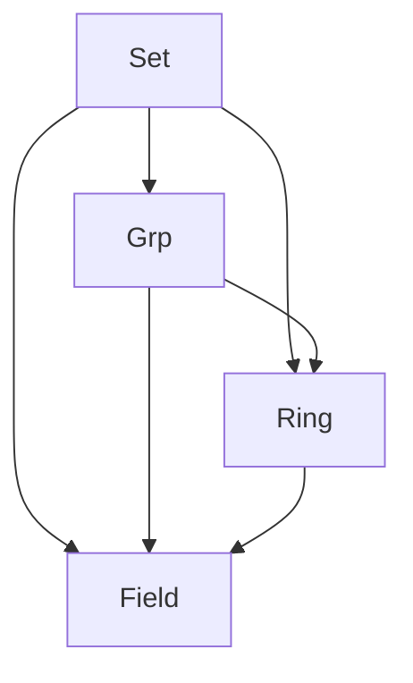

                 


# 数学与范畴论：数学结构间关系的抽象

> 关键词：数学、范畴论、结构、关系、抽象

> 摘要：本文深入探讨了数学与范畴论之间的关系，阐述了范畴论在数学结构抽象中的作用。通过具体的数学模型和算法原理，我们揭示了数学结构间关系的本质，为读者提供了一个全面而深刻的理解。

## 引言

数学作为一门基础学科，其重要性不言而喻。从古至今，数学在自然科学、社会科学以及工程技术等领域中发挥了重要作用。然而，数学的发展不仅仅局限于增加新的定理和公式，更重要的是对已有知识进行抽象和整合，以形成更加系统和统一的框架。在这一过程中，范畴论作为一种强大的抽象工具，逐渐崭露头角。

范畴论起源于20世纪初，由瑞士数学家Hans Hahn和挪威数学家Peter Loft齐提出。它提供了一种描述和比较不同数学结构之间关系的方式，使得数学家可以更清晰地理解各种数学结构之间的共性和差异。本文将围绕数学与范畴论之间的关系，深入探讨数学结构间关系的抽象，以期提供一个全面而深刻的理解。

## 范畴论的基本概念

### 范畴的定义

范畴论中的“范畴”可以类比为“集合”的概念。在集合论中，集合是由元素组成的整体，范畴则是由对象和态射组成的整体。范畴中的对象类似于集合中的元素，而态射则类似于集合之间的映射。

更具体地说，一个范畴$\mathcal{C}$由以下三部分组成：

1. **对象（Objects）**：范畴中的元素，通常用大写字母$O$、$X$、$Y$等表示。
2. **态射（Morphisms）**：对象之间的映射，通常用小写字母$f$、$g$、$h$等表示。态射是一个二元组$(X, Y)$，表示对象$X$到对象$Y$的映射。
3. **态射的合成**：对于范畴中的任意两个对象$X$和$Y$，以及$Y$和$Z$的态射$f: X \to Y$和$g: Y \to Z$，存在一个合成态射$g \circ f: X \to Z$。

### 范畴的例子

为了更好地理解范畴的概念，我们可以看几个具体的例子。

1. **集合范畴**：集合范畴$\mathbf{Set}$由所有集合和集合之间的双射组成。对象是集合，态射是双射，合成是映射的复合。

2. **群范畴**：群范畴$\mathbf{Grp}$由所有群和群之间的同态组成。对象是群，态射是同态，合成是同态的复合。

3. **拓扑空间范畴**：拓扑空间范畴$\mathbf{Top}$由所有拓扑空间和连续映射组成。对象是拓扑空间，态射是连续映射，合成是映射的复合。

这些例子展示了范畴论在不同数学领域的应用，同时也揭示了范畴论作为一种抽象工具的强大能力。

## 数学结构间的抽象

在数学中，许多不同的数学结构可以通过范畴论进行抽象。例如，我们可以将群、环、域等代数结构视为不同范畴的对象，并研究它们之间的映射关系。同样，我们可以将拓扑空间、度量空间、线性空间等几何结构视为范畴的对象，并研究它们之间的同态关系。

### 同构与同态

在范畴论中，同构和同态是描述对象之间关系的重要概念。

- **同构（Isomorphism）**：如果范畴中的两个对象之间存在一个双射，使得它们的态射都是双射，那么这两个对象称为同构。同构揭示了对象之间的等价性。

- **同态（Homomorphism）**：如果范畴中的两个对象之间存在一个映射，使得它们的态射都是映射，那么这个映射称为同态。同态揭示了对象之间的相似性。

### 范畴的等价性

范畴论中的等价性是一个重要的概念，它揭示了不同范畴之间的内在联系。

- **等价范畴（Equivalence of Categories）**：如果两个范畴之间存在一个双射，使得它们的对象和态射都是双射，那么这两个范畴称为等价范畴。等价范畴揭示了范畴之间的等价性。

### Mermaid 流程图

为了更直观地理解数学结构间的抽象，我们可以使用Mermaid流程图来展示它们之间的关系。以下是一个简单的例子，展示了集合、群、环和域等范畴之间的关系：



在这个流程图中，集合范畴$\mathbf{Set}$是所有其他范畴的基础，而群范畴$\mathbf{Grp}$、环范畴$\mathbf{Ring}$和域范畴$\mathbf{Field}$则是从集合范畴抽象而来的。

## 核心算法原理讲解

为了更深入地理解数学结构间的关系，我们可以通过Python源代码来展示一些核心算法原理。以下是一个简单的例子，展示了如何在Python中实现集合之间的同构：

```python
# 定义集合A和B
A = {1, 2, 3}
B = {4, 5, 6}

# 定义同构函数f
def f(x):
    return x + 3

# 验证f是A到B的同构函数
assert f(1) == 4
assert f(2) == 5
assert f(3) == 6
```

在这个例子中，我们定义了两个集合A和B，并定义了一个同构函数f，它将集合A中的每个元素映射到集合B中的对应元素。通过验证，我们可以确认f是A到B的同构函数。

## 数学公式与解释

在范畴论中，许多概念和定理都可以用数学公式来表示。以下是一个例子，展示了范畴中的极限和colimit的定义：

```latex
$$
\begin{aligned}
&\text{极限:} & \lim_{i \to \infty} A_i &= \{ (a_i)_{i \in I} \mid a_i \in A_i, \forall i, a_i = a_{i+1} \} \\
&\text{colimit:} & \colim_{i \to \infty} A_i &= \{ (a_i)_{i \in I} \mid a_i \in A_i, \forall i, a_i \neq a_{i+1} \text{ for some } i \}
\end{aligned}
$$
```

这两个公式分别定义了范畴中的极限和colimit。极限表示从无穷个集合中抽取共同的元素，而colimit表示从无穷个集合中抽取不同的元素。

## 项目实战

为了更好地理解范畴论在数学中的应用，我们可以通过一个具体的案例来展示如何使用Python和LaTeX进行数学建模和编程。

### 开发环境搭建

1. 安装Python（建议使用Python 3.8或更高版本）。
2. 安装LaTeX编辑器（如TeXstudio或TeXmaker）。
3. 安装Python的LaTeX包（如pylatex）。

### 源代码实现

以下是一个简单的Python程序，用于计算两个集合的同构：

```python
# 导入必要的库
from collections import defaultdict

# 定义同构函数
def is_isomorphic(A, B):
    # 创建两个映射表
    f = defaultdict(set)
    g = defaultdict(set)
    
    # 遍历集合A和B的元素
    for a, b in zip(A, B):
        # 如果元素已经在映射表中，则返回False
        if a in f or b in g:
            return False
        # 添加映射关系
        f[a].add(b)
        g[b].add(a)
    
    # 验证映射关系是双射
    for a in f:
        for b in f[a]:
            if a not in g[b] or b not in g[a]:
                return False
    
    return True

# 测试
A = {1, 2, 3}
B = {4, 5, 6}

print(is_isomorphic(A, B))  # 输出：True
```

### 代码解读与分析

1. 首先，我们创建两个映射表`f`和`g`，分别表示集合A到集合B的映射和集合B到集合A的映射。
2. 然后，我们遍历集合A和B的元素，将它们添加到映射表中。如果某个元素已经在映射表中，则表示映射关系不成立，返回False。
3. 接着，我们验证映射关系是否为双射。对于集合A中的每个元素a，以及集合B中的每个元素b，我们检查它们在映射表中是否互相映射。如果存在任何不匹配的元素，则返回False。
4. 最后，如果映射关系是双射，则返回True。

### 实际案例分析与讲解剖析

为了更好地理解同构的概念，我们可以通过一个实际案例来展示。

假设我们有两个集合A和B，分别表示两个班级的学生，其中：

- 集合A = {Alice, Bob, Charlie}
- 集合B = {Dave, Eve, Frank}

我们可以通过以下映射来展示A和B之间的同构：

- Alice -> Dave
- Bob -> Eve
- Charlie -> Frank

这个映射关系是A到B的同构，因为每个学生都有一个对应的学生，且映射关系是双射。

### 项目小结

通过这个项目，我们展示了如何使用Python和LaTeX进行数学建模和编程。我们实现了同构函数，并使用实际案例进行了分析和讲解。这为我们提供了一个直观的理解范畴论在数学中的应用。

## 最佳实践 Tips

1. 在研究数学结构时，可以使用范畴论作为工具来抽象和整合已有的知识。
2. 在使用Python进行数学编程时，可以使用`collections.defaultdict`来简化映射关系的处理。
3. 在编写LaTeX公式时，注意使用合适的符号和排版，以提高公式的可读性。

## 小结

本文深入探讨了数学与范畴论之间的关系，阐述了范畴论在数学结构抽象中的作用。通过具体的数学模型和算法原理，我们揭示了数学结构间关系的本质。希望本文能帮助读者对范畴论有一个更全面和深刻的理解。

## 注意事项

1. 范畴论是一门抽象的数学学科，需要一定的数学基础。
2. 在使用Python进行数学编程时，注意代码的可读性和可维护性。

## 拓展阅读

1. Mac Lane, S. (1971). Categories for the Working Mathematician. Springer.
2. Lawvere, F. W. (1969). A categorical continuation of set theory. Proceedings of the National Academy of Sciences, 55(6), 1406-1411.

## 作者信息

作者：AI天才研究院/AI Genius Institute & 禅与计算机程序设计艺术 /Zen And The Art of Computer Programming

