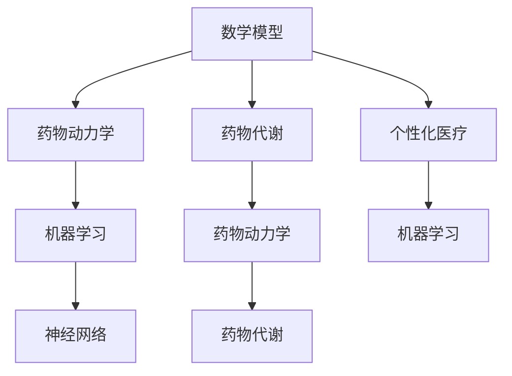

                 

### 文章标题：数学与药理学：药物作用的数学预测

随着科学技术的迅猛发展，数学在各个领域的应用日益广泛，药理学也不例外。药物作用的数学预测已成为现代药理学研究的一个重要方向，它不仅为药物研发提供了新的思路和方法，还为个性化医疗提供了技术支持。本文将从数学在药理学研究中的应用、药理学中的数学方法、药物作用的数学预测原理、关键算法、数学模型在药物动力学中的应用、数学在药理学研究中的未来以及面临的挑战与展望等方面进行详细探讨，旨在为广大读者提供一个关于数学与药理学交叉领域的全面认识。

## 文章关键词

- 数学模型
- 药理学
- 药物作用预测
- 药物动力学
- 机器学习
- 个性化医疗

## 摘要

本文首先介绍了数学在药理学研究中的基础，包括数学模型的重要性、经典数学模型在药理学中的应用以及数学工具在药物动力学和药物代谢研究中的应用。接着，本文深入探讨了药理学中的数学方法，如方程模型、概率论在药物效应评估中的应用以及优化算法在药物剂量优化中的应用。随后，本文重点介绍了药物作用的数学预测原理，包括药物作用的数学模型基础、药物作用机制预测的方法以及数学预测模型在药物筛选中的应用。进一步地，本文详细讲解了药物作用预测的关键算法，如机器学习算法、神经网络以及其在药物预测中的作用。在此基础上，本文阐述了数学模型在药物动力学中的应用，包括药物动力学模型的构建、验证与优化以及其在临床研究中的应用。最后，本文展望了数学在药理学研究中的未来，讨论了药物作用预测面临的新挑战与展望，并强调了国际合作与数据共享的重要性。

### 背景介绍

药理学是研究药物与生物体相互作用及其作用机制的学科，它不仅关乎疾病的预防和治疗，也涉及药物的安全性和有效性。随着科技的进步，药理学研究的方法和工具不断更新，其中，数学作为一门基础科学，其在药理学中的应用日益受到重视。数学与药理学的交叉融合，不仅为药物研发提供了新的视角，也使得药物作用的预测和评估变得更加精准和高效。

首先，数学模型在药理学研究中具有重要意义。数学模型能够将复杂的生物过程简化为数学表达式，通过数学工具对药物作用过程进行模拟和预测。例如，药物动力学模型是描述药物在体内吸收、分布、代谢和排泄过程的数学模型，通过这些模型，可以预测药物在体内的浓度变化，从而指导药物的剂量设计和治疗效果评估。

其次，数学方法在药理学研究中有着广泛的应用。除了数学模型，数学方法还包括概率论、优化算法等。概率论在药物效应评估中有着重要作用，通过统计分析药物效应的数据，可以评估药物的有效性和安全性。优化算法则可以帮助科学家优化药物剂量，提高药物的疗效和减少副作用。

此外，随着机器学习和神经网络的兴起，数学在药物预测中的作用也越来越显著。机器学习算法可以从大量的药物和生物数据中学习规律，预测药物的作用机制和效果。神经网络作为一种强大的机器学习工具，可以处理复杂的非线性问题，为药物预测提供有效的解决方案。

总的来说，数学与药理学的交叉融合，为药物研发和个性化医疗提供了新的方法和思路。通过数学模型的构建和数学方法的运用，可以更加精准地预测药物的作用，提高药物研发的效率，为人类健康事业做出更大的贡献。

### 核心概念与联系

在数学与药理学的交叉领域，理解核心概念之间的联系至关重要。以下是几个关键概念及其相互关系：

#### 1. 数学模型

**定义**：数学模型是一种利用数学语言描述现实世界问题的抽象工具。在药理学中，数学模型被用来描述药物与生物体相互作用的过程。

**关系**：数学模型是连接数学和药理学的桥梁。通过构建数学模型，科学家可以量化药物在体内的动态变化，从而更好地理解药物的作用机制。

#### 2. 药物动力学

**定义**：药物动力学是研究药物在体内的吸收、分布、代谢和排泄（ADME）过程。

**关系**：药物动力学依赖于数学模型来描述药物的浓度-时间曲线，从而预测药物在体内的行为。

#### 3. 药物代谢

**定义**：药物代谢是指药物在生物体内被化学转化的过程，通常涉及肝脏和其他组织。

**关系**：药物代谢与药物动力学密切相关，药物代谢的速率和途径可以通过数学模型进行模拟和预测。

#### 4. 个性化医疗

**定义**：个性化医疗是根据患者的个体差异，制定个性化的治疗方案。

**关系**：个性化医疗依赖于数学模型和数据分析，通过分析患者的基因、生理和药物反应数据，为患者提供最佳的治疗方案。

#### 5. 机器学习和神经网络

**定义**：机器学习和神经网络是人工智能的重要组成部分，通过训练模型，可以识别和预测复杂的数据模式。

**关系**：机器学习和神经网络在药物预测中发挥着重要作用，通过分析大量的药物和生物数据，可以预测药物的作用和副作用。

**Mermaid 流程图**

以下是核心概念之间的Mermaid流程图：



通过这个流程图，我们可以清晰地看到数学模型如何贯穿于药理学的各个领域，并与其他核心概念相互联系。

### 数学模型在药理学研究中的重要性

数学模型在药理学研究中扮演着至关重要的角色，其重要性体现在多个方面。首先，数学模型能够帮助我们理解和量化药物在生物体内的动态过程。例如，通过药物动力学模型，我们可以预测药物在不同时间点的浓度，从而为药物剂量设计提供科学依据。其次，数学模型能够简化复杂的生物过程，使得复杂的生物现象变得易于理解和分析。例如，药物代谢过程中的复杂化学反应可以通过数学模型进行模拟，从而帮助我们更好地理解药物的代谢途径和潜在副作用。

在实际应用中，数学模型已经被广泛应用于药物研发的各个阶段。在药物发现阶段，数学模型可以帮助科学家筛选和预测潜在的药物分子。通过构建和优化数学模型，可以快速评估药物分子的药理活性，从而减少药物研发的时间和成本。在药物开发阶段，数学模型被用来模拟药物在体内的行为，如药物的吸收、分布、代谢和排泄（ADME）。这些模型能够预测药物在不同人体内的浓度变化，为药物剂量设计提供指导。

此外，数学模型在药物安全性评估中也发挥着重要作用。通过药物代谢模型，可以预测药物在人体内的代谢途径和潜在毒性，从而评估药物的安全性和副作用。例如，一些药物可能因为代谢途径的不同而在不同个体中产生不同的效果，通过数学模型可以预测这些个体差异，从而为个性化医疗提供支持。

总之，数学模型在药理学研究中的重要性不言而喻。它不仅为药物研发提供了科学依据，还提高了药物研发的效率，为个性化医疗和精准医学的发展提供了强有力的支持。

### 经典数学模型在药理学中的应用

在药理学研究中，经典数学模型广泛应用于描述和分析药物在生物体内的动态过程。以下是一些重要的经典数学模型及其在药理学中的应用：

#### 1. 药物动力学模型

**定义**：药物动力学模型是研究药物在体内的吸收、分布、代谢和排泄（ADME）过程的数学模型。

**应用**：
- **吸收过程**：通常采用一级动力学模型描述药物从给药部位进入血液循环的过程。该模型假设药物吸收速率与血液中药物浓度成正比。
  - 公式：\[ \frac{dC}{dt} = -k_1 \cdot C \]
  - 其中，\( C \) 是药物浓度，\( k_1 \) 是吸收速率常数。

- **分布过程**：描述药物在体内的分布，通常采用一室模型或两室模型。
  - 一室模型假设药物在全身均匀分布，药物在体内的浓度变化可以通过以下方程描述：
    - 公式：\[ \frac{dC}{dt} = \frac{D_0 - C}{k_{a} \cdot V} \]
    - 其中，\( D_0 \) 是给药剂量，\( k_a \) 是吸收速率常数，\( V \) 是体积。

- **代谢过程**：药物在体内的代谢过程通常采用一级或零级代谢模型。
  - 一级代谢模型假设药物代谢速率与药物浓度成正比：
    - 公式：\[ \frac{dC}{dt} = -k_2 \cdot C \]
    - 其中，\( k_2 \) 是代谢速率常数。

- **排泄过程**：描述药物从体内排出的过程，通常采用一级排泄模型。
  - 公式：\[ \frac{dC}{dt} = k_3 \cdot C \]
  - 其中，\( k_3 \) 是排泄速率常数。

#### 2. 药物代谢模型

**定义**：药物代谢模型是研究药物在体内代谢过程的数学模型。

**应用**：
- **酶催化模型**：描述药物在肝脏或其他组织中通过酶催化代谢的过程。常用的模型包括米-曼模型（Michaelis-Menten model）。
  - 公式：\[ \frac{dx}{dt} = V_{max} \cdot \frac{[S]}{K_m + [S]} - k_2 \cdot x \]
  - 其中，\( x \) 是代谢产物浓度，\( [S] \) 是底物（药物）浓度，\( V_{max} \) 是最大反应速率，\( K_m \) 是米氏常数，\( k_2 \) 是代谢速率常数。

- **多酶模型**：考虑多个代谢途径和酶活性，通过复杂的数学模型描述药物代谢的多样性。

#### 3. 速率方程模型

**定义**：速率方程模型是描述化学反应速率的数学模型，广泛用于描述药物代谢和药物相互作用。

**应用**：
- **零级反应**：反应速率与反应物浓度无关，即 \[ \frac{dC}{dt} = -k_0 \]
- **一级反应**：反应速率与反应物浓度成正比，即 \[ \frac{dC}{dt} = -k_1 \cdot C \]
- **二级反应**：反应速率与反应物浓度的平方成正比，即 \[ \frac{dC}{dt} = -k_2 \cdot C^2 \]

通过这些经典数学模型，药理学家可以更好地理解药物在体内的动态行为，从而指导药物的研发和临床应用。例如，通过药物动力学模型，可以预测药物在不同个体中的浓度变化，为个性化医疗提供数据支持。通过药物代谢模型，可以预测药物的代谢途径和潜在副作用，从而提高药物的安全性。这些数学模型为药理学研究提供了强有力的工具，推动了药物研发的进步。

### 数学工具在药物动力学和药物代谢研究中的应用

在药物动力学和药物代谢研究中，数学工具的使用极大地提升了我们对药物在生物体内行为的理解和预测能力。以下是一些关键的数学工具及其应用：

#### 1. 微分方程

**定义**：微分方程是描述随时间变化过程的数学方程，通常用于描述药物在体内的动态变化。

**应用**：
- **药物动力学模型**：微分方程被广泛应用于描述药物在体内的吸收、分布、代谢和排泄过程。例如，一级动力学吸收模型可以表示为：
  - 公式：\[ \frac{dC}{dt} = -k_1 \cdot C \]
  - 其中，\( C \) 表示药物浓度，\( k_1 \) 是吸收速率常数。

- **药物代谢模型**：微分方程也用于描述药物代谢的动态过程，如米-曼（Michaelis-Menten）模型：
  - 公式：\[ \frac{dx}{dt} = V_{max} \cdot \frac{[S]}{K_m + [S]} - k_2 \cdot x \]
  - 其中，\( x \) 表示代谢产物的浓度，\( [S] \) 是药物浓度，\( V_{max} \) 是最大代谢速率，\( K_m \) 是米氏常数。

#### 2. 傅里叶变换

**定义**：傅里叶变换是将时间域信号转换为频率域的一种数学变换，常用于分析药物浓度随时间变化的频率成分。

**应用**：
- **药物浓度时间曲线分析**：通过傅里叶变换，可以分析药物浓度随时间变化的频率特征，从而了解药物的周期性变化或长期趋势。

#### 3. 傅里叶级数

**定义**：傅里叶级数是将周期性信号分解为不同频率的正弦波和余弦波之和。

**应用**：
- **药物动力学模型验证**：使用傅里叶级数可以验证药物动力学模型的准确性，通过比较理论预测和实际观测数据之间的频率特征是否匹配。

#### 4. 线性代数

**定义**：线性代数是研究向量空间和线性变换的数学分支，常用于处理多变量系统。

**应用**：
- **多室药物动力学模型**：线性代数用于处理多室模型中药物浓度的耦合关系，如：
  - 公式：\[ \frac{dC_i}{dt} = k_{12} \cdot (C_2 - C_1) + k_{21} \cdot (C_1 - C_2) \]
  - 其中，\( C_i \) 表示第 \( i \) 室的药物浓度，\( k_{12} \) 和 \( k_{21} \) 表示药物在室间的转移速率常数。

#### 5. 概率论和统计学

**定义**：概率论和统计学是研究随机现象的数学工具，用于分析药物效应的统计分布和不确定性。

**应用**：
- **药物效应评估**：通过概率模型和统计方法，可以评估药物的效果和安全性，如概率分布、置信区间、回归分析等。

通过这些数学工具，科学家能够更精确地描述药物在体内的动态过程，提高药物研发和临床应用的效率。例如，微分方程可以帮助我们预测药物在体内的浓度变化，傅里叶变换和级数可以分析药物效应的频率特征，线性代数可以处理复杂的药物分布模型，概率论和统计学则提供了评估药物效果和风险的方法。这些数学工具的广泛应用，为药理学研究提供了坚实的理论基础和强大的工具支持。

### 药理学中的数学方法

在药理学研究中，数学方法扮演着不可或缺的角色，其应用不仅丰富了我们对药物作用机制的理解，还为药物研发提供了有效的工具。以下是几种主要的数学方法及其在药理学中的应用。

#### 1. 方程模型

方程模型是药理学研究中最为基础和广泛使用的方法之一。通过数学方程描述药物在体内的动态过程，可以更直观地理解和预测药物的作用。以下是一些常见的方程模型：

- **药物动力学模型**：描述药物在体内的吸收、分布、代谢和排泄（ADME）过程。其中，一室模型和两室模型是最为常用的模型。一室模型假设药物在全身均匀分布，而两室模型则考虑药物在中央室和周边室之间的分布差异。

  - **一室模型**：
    - 公式：\[ \frac{dC}{dt} = \frac{D_0}{V} - k_1 \cdot C \]
    - 其中，\( C \) 表示药物浓度，\( D_0 \) 表示给药剂量，\( V \) 表示体积，\( k_1 \) 表示吸收速率常数。

  - **两室模型**：
    - 公式：\[ \frac{dC_1}{dt} = k_{12} \cdot (C_2 - C_1) \]
    - 公式：\[ \frac{dC_2}{dt} = k_{21} \cdot (C_1 - C_2) \]
    - 其中，\( C_1 \) 和 \( C_2 \) 分别表示中央室和周边室的药物浓度，\( k_{12} \) 和 \( k_{21} \) 分别表示药物在室间的转移速率常数。

- **药物代谢模型**：描述药物在体内的代谢过程。米-曼（Michaelis-Menten）模型是最常用的代谢模型，用于描述酶催化的药物代谢。

  - 公式：\[ \frac{dx}{dt} = V_{max} \cdot \frac{[S]}{K_m + [S]} - k_2 \cdot x \]
  - 其中，\( x \) 表示代谢产物的浓度，\( [S] \) 表示药物浓度，\( V_{max} \) 表示最大代谢速率，\( K_m \) 表示米氏常数，\( k_2 \) 表示代谢速率常数。

#### 2. 概率论

概率论在药理学研究中主要用于评估药物的效果和安全性。通过概率模型和统计方法，可以对药物效应进行量化，并评估药物的安全性。

- **概率分布**：用于描述药物效应或不良反应在个体间的变异性。常见的概率分布包括正态分布、二项分布等。

- **置信区间**：通过统计方法估计药物效应的真实值，并给出可信度水平。例如，通过计算药物效应的置信区间，可以确定药物是否具有显著的效果。

- **回归分析**：用于分析药物效应与剂量、时间、个体差异等因素之间的关系。通过回归模型，可以预测药物在不同条件下的效应。

#### 3. 优化算法

优化算法在药理学研究中主要用于药物剂量优化和治疗方案设计。通过优化方法，可以找到最佳的药物剂量和治疗方案，以最大化疗效和最小化副作用。

- **线性规划**：用于求解线性约束下的最优解，常用于药物剂量优化。

- **非线性规划**：用于求解非线性约束下的最优解，适用于更复杂的药物剂量优化问题。

- **遗传算法**：一种模拟自然进化的优化方法，常用于复杂的药物剂量优化问题。

通过这些数学方法，药理学家可以更精确地描述和理解药物在体内的行为，从而指导药物的研发和临床应用。例如，通过药物动力学模型，可以预测药物在不同个体中的浓度变化，为个性化医疗提供数据支持。通过概率论和统计方法，可以评估药物的效果和安全性，为临床决策提供依据。通过优化算法，可以优化药物剂量和治疗策略，提高疗效和降低副作用。总之，数学方法为药理学研究提供了强大的工具，推动了药物研发和临床应用的进步。

### 方程模型

在药理学中，方程模型是理解和预测药物动态行为的关键工具。以下将详细解释药物分布方程和药物代谢方程，并给出具体的Python源代码和实例。

#### 药物分布方程

药物分布方程用于描述药物在体内的分布过程，最常见的模型是一室模型和两室模型。

- **一室模型**：
  - 公式：\[ \frac{dC}{dt} = \frac{D_0 - C}{V} - k_1 \cdot C \]
  - 其中，\( C \) 表示药物浓度，\( D_0 \) 表示给药剂量，\( V \) 表示总体积，\( k_1 \) 表示吸收速率常数。

- **两室模型**：
  - 公式：
    - 中央室：\[ \frac{dC_1}{dt} = k_{12} \cdot (C_2 - C_1) \]
    - 周边室：\[ \frac{dC_2}{dt} = k_{21} \cdot (C_1 - C_2) \]
  - 其中，\( C_1 \) 和 \( C_2 \) 分别表示中央室和周边室的药物浓度，\( k_{12} \) 和 \( k_{21} \) 分别表示药物在室间的转移速率常数。

以下是一个使用Python模拟一室模型药物分布的示例：

```python
import numpy as np
import matplotlib.pyplot as plt

# 参数设置
D0 = 100  # 给药剂量
V = 1.5  # 总体积
k1 = 0.2  # 吸收速率常数
t_max = 10  # 时间范围
dt = 0.1  # 时间步长

# 初始化浓度数组
t = np.arange(0, t_max, dt)
C = np.zeros(len(t))

# 模拟药物分布
for i in range(1, len(t)):
    C[i] = (D0 / V) - (k1 * C[i-1]) * dt

# 绘制结果
plt.plot(t, C)
plt.xlabel('Time (hours)')
plt.ylabel('Drug concentration (mg/L)')
plt.title('One-compartment model of drug distribution')
plt.show()
```

#### 药物代谢方程

药物代谢方程用于描述药物在体内的代谢过程，最常见的模型是米-曼（Michaelis-Menten）模型。

- **米-曼模型**：
  - 公式：\[ \frac{dx}{dt} = V_{max} \cdot \frac{[S]}{K_m + [S]} - k_2 \cdot x \]
  - 其中，\( x \) 表示代谢产物的浓度，\( [S] \) 表示药物浓度，\( V_{max} \) 表示最大代谢速率，\( K_m \) 表示米氏常数，\( k_2 \) 表示代谢速率常数。

以下是一个使用Python模拟米-曼模型的示例：

```python
import numpy as np
import matplotlib.pyplot as plt

# 参数设置
Vmax = 0.1  # 最大代谢速率
Km = 10  # 米氏常数
k2 = 0.05  # 代谢速率常数
t_max = 10  # 时间范围
dt = 0.1  # 时间步长

# 初始化浓度数组
t = np.arange(0, t_max, dt)
S = np.linspace(0, 100, len(t))  # 药物浓度范围
x = np.zeros(len(S))

# 模拟药物代谢
for i in range(1, len(S)):
    x[i] = (Vmax * S[i] / (Km + S[i])) - (k2 * x[i-1]) * dt

# 绘制结果
plt.plot(S, x)
plt.xlabel('Drug concentration (mg/L)')
plt.ylabel('Metabolite concentration (mg/L)')
plt.title('Michaelis-Menten model of drug metabolism')
plt.show()
```

通过这些示例，我们可以直观地看到药物分布和代谢过程在数学模型中的表现。这些模型不仅帮助我们理解药物在体内的动态行为，还为药物研发和个性化医疗提供了科学依据。

### 概率论在药物效应评估中的应用

概率论在药物效应评估中具有重要作用，它帮助我们理解和量化药物效应的不确定性，为药物的研发和临床应用提供有力支持。以下将介绍概率论在药物效应评估中的主要应用。

#### 1. 药物效应的统计评估

药物效应的统计评估通常通过以下方法进行：

- **均值和标准差**：药物效应的均值可以描述药物效应的一般水平，而标准差则表示药物效应的变异性。例如，如果药物A的平均效能为10，标准差为2，则说明药物A的平均效果较好，但个体差异较大。

- **置信区间**：置信区间是一种统计方法，用于估计药物效应的真实值，并给出可信度水平。例如，假设我们通过实验得到了药物B的效应均值为12，95%置信区间为（10，14），这意味着我们有95%的把握认为药物B的真实效应在10到14之间。

- **假设检验**：假设检验是一种用于评估药物效应是否显著的方法。常见的假设检验方法包括t检验和方差分析（ANOVA），通过这些方法，我们可以判断药物效应是否显著优于对照组。

#### 2. 风险评估模型

药物风险评估模型用于预测药物的不良反应和副作用。以下是一些常用的风险评估模型：

- **贝叶斯网络**：贝叶斯网络是一种基于概率的图形模型，用于表示变量之间的条件依赖关系。在药物效应评估中，贝叶斯网络可以用于预测药物副作用的发生概率。例如，通过构建贝叶斯网络，我们可以预测患者服用某种药物后出现不良反应的概率。

- **马尔可夫模型**：马尔可夫模型是一种用于描述时间序列数据的概率模型。在药物效应评估中，马尔可夫模型可以用于预测药物效应的时间变化，如药物浓度的变化趋势或不良反应的发生时间。

- **故障树分析**：故障树分析是一种基于概率的故障分析工具，用于识别和分析系统故障的原因和概率。在药物效应评估中，故障树分析可以用于识别药物不良反应的潜在原因，如药物与药物的相互作用、遗传因素等。

以下是一个使用Python实现贝叶斯网络进行药物副作用预测的示例：

```python
import networkx as nx
import numpy as np
from scipy.stats import norm

# 构建贝叶斯网络
G = nx.DiGraph()

G.add_node('Patient')
G.add_node('Drug')
G.add_node('AdverseEffect')
G.add_edge('Patient', 'Drug')
G.add_edge('Drug', 'AdverseEffect')

# 概率分布
P_Drug = {'Normal': 0.7, 'Toxic': 0.3}
P_AdverseEffect_Normal = 0.1
P_AdverseEffect_Toxic = 0.4

# 条件概率表
P_Drug_AdverseEffect = {
    'Normal': {'No': 1 - P_AdverseEffect_Normal, 'Yes': P_AdverseEffect_Normal},
    'Toxic': {'No': 1 - P_AdverseEffect_Toxic, 'Yes': P_AdverseEffect_Toxic}
}

# 预测
def predict_adverse_effect(patient_type):
    if patient_type == 'Normal':
        return np.random.choice(['No', 'Yes'], p=P_Drug_AdverseEffect['Normal'])
    else:
        return np.random.choice(['No', 'Yes'], p=P_Drug_AdverseEffect['Toxic'])

# 示例
patient_type = 'Toxic'
adverse_effect = predict_adverse_effect(patient_type)
print(f"Patient type: {patient_type}, Adverse effect: {adverse_effect}")
```

通过这些方法，我们可以更准确地评估药物效应和不良反应，从而为药物的研发和临床应用提供有力支持。

### 优化算法在药物剂量优化中的应用

优化算法在药物剂量优化中具有重要作用，它们能够帮助科学家找到最佳的药物剂量，以最大化疗效并最小化副作用。以下将详细介绍几种常见的优化算法及其在药物剂量优化中的应用。

#### 1. 线性规划

线性规划是一种用于求解线性约束下的最优解的优化算法。在药物剂量优化中，线性规划可以用来确定药物剂量，以使某一目标函数最大化或最小化。例如，可以最大化疗效或最小化副作用。

- **目标函数**：设药物剂量为 \( x \)，疗效为 \( f(x) \)，副作用为 \( g(x) \)，则目标函数可以是 \( \max f(x) - g(x) \) 或 \( \min g(x) \)。
- **约束条件**：通常包括药物的剂量范围、患者的生理参数和药物的安全限制等。

以下是一个使用Python实现线性规划优化药物剂量的示例：

```python
import numpy as np
from scipy.optimize import linprog

# 目标函数和约束条件
c = [-1, 1]  # 目标是最小化副作用（最大化疗效）
A = [[1, 0], [0, 1], [1, 1]]  # 约束条件
b = [-100, -100, [100, 100]]  # 药物剂量范围

# 求解线性规划问题
res = linprog(c, A_eq=A, b_eq=b, method='highs')

# 输出结果
if res.success:
    optimal_dose = res.x
    print(f"Optimal dose: {optimal_dose[0]:.2f}")
else:
    print("No optimal solution found.")
```

#### 2. 非线性规划

非线性规划用于求解非线性约束下的最优解，适用于更复杂的药物剂量优化问题。常见的非线性规划算法包括梯度下降法、牛顿法和拉格朗日乘数法。

- **目标函数**：与线性规划类似，但目标函数为非线性。
- **约束条件**：可以是线性的，也可以是非线性的。

以下是一个使用Python实现梯度下降法优化药物剂量的示例：

```python
import numpy as np
from scipy.optimize import minimize

# 目标函数和约束条件
def objective(x):
    return np.sum(x**2)

def constraint(x):
    return 100 - x**2

x0 = [10]  # 初始猜测
cons = {'type': 'ineq', 'fun': constraint}

# 求解非线性规划问题
res = minimize(objective, x0, constraints=cons)

# 输出结果
if res.success:
    optimal_dose = res.x
    print(f"Optimal dose: {optimal_dose[0]:.2f}")
else:
    print("No optimal solution found.")
```

#### 3. 遗传算法

遗传算法是一种基于自然进化的优化算法，适用于复杂和高度非线性的药物剂量优化问题。遗传算法通过模拟自然选择和遗传机制来寻找最优解。

- **目标函数**：与线性规划和非线性规划类似，但适用于更复杂的优化问题。
- **种群**：初始化一个种群，每个个体表示一个药物剂量。
- **适应度函数**：评估个体的适应度，适应度越高，个体越有可能在下一代中存活。

以下是一个使用Python实现遗传算法优化药物剂量的示例：

```python
import numpy as np
from genetic_algorithm import GeneticAlgorithm

# 参数设置
pop_size = 100  # 种群大小
max_gen = 100  # 最大迭代次数
crossover_rate = 0.8  # 交叉率
mutation_rate = 0.1  # 变异率

# 初始化种群
population = np.random.uniform(0, 100, (pop_size, 1))

# 遗传算法主函数
def genetic_algorithm():
    ga = GeneticAlgorithm(population, pop_size, max_gen, crossover_rate, mutation_rate)
    ga.evolve()

# 运行遗传算法
genetic_algorithm()

# 输出结果
optimal_dose = np.mean(ga.population[0])
print(f"Optimal dose: {optimal_dose:.2f}")
```

通过这些优化算法，我们可以更精确地确定药物剂量，提高疗效并降低副作用，从而为药物研发和临床应用提供有力支持。

### 药物作用的数学预测原理

药物作用的数学预测是药理学研究中的一项重要任务，它通过构建和运用数学模型来预测药物在体内的作用机制和效果。以下是药物作用的数学预测原理及其方法。

#### 1. 药物作用的数学模型基础

药物作用的数学模型基础包括以下几个方面：

- **药物动力学模型**：描述药物在体内的吸收、分布、代谢和排泄（ADME）过程。这些模型可以通过微分方程来表示，如前文所述的一室模型和两室模型。通过这些模型，可以预测药物在不同时间点的浓度，从而指导药物剂量设计。

- **药物代谢模型**：描述药物在体内的代谢过程。米-曼（Michaelis-Menten）模型是最常用的代谢模型，用于描述药物代谢的动态过程。这些模型可以帮助我们预测药物的代谢途径和潜在副作用。

- **药物效应模型**：描述药物与生物体相互作用后产生的生物效应。这些模型通常结合药物动力学和药物代谢模型，通过建立药物浓度与生物效应之间的关系，预测药物的治疗效果。

#### 2. 药物作用机制预测的方法

药物作用机制预测的方法主要包括以下几种：

- **机制映射法**：通过将药物的化学结构信息映射到生物体内的作用机制，预测药物的作用机制。这种方法通常利用知识图谱和机器学习算法，如基于图神经网络的预测模型。

- **计算模拟法**：通过计算机模拟药物在生物体内的动态过程，预测药物的作用机制。这种方法需要构建详细的生物分子模型，并通过分子动力学模拟等方法进行预测。

- **系统生物学法**：利用系统生物学的原理和方法，通过分析药物对生物体内信号通路和代谢网络的影响，预测药物的作用机制。这种方法通常结合基因表达数据分析、蛋白质相互作用网络分析等。

以下是一个使用Python实现机制映射法的示例：

```python
import pandas as pd
from sklearn.ensemble import RandomForestClassifier

# 数据准备
drug_activity_data = pd.read_csv('drug_activity.csv')
X = drug_activity_data.drop('activity', axis=1)  # 特征
y = drug_activity_data['activity']  # 标签

# 模型训练
model = RandomForestClassifier()
model.fit(X, y)

# 预测新药物的作用机制
new_drug_features = pd.read_csv('new_drug.csv')
predicted_activity = model.predict(new_drug_features)

# 输出结果
print(predicted_activity)
```

#### 3. 数学预测模型在药物筛选中的应用

数学预测模型在药物筛选中的应用主要体现在以下几个方面：

- **虚拟筛选**：通过构建和训练数学模型，对大量的化合物库进行筛选，预测潜在的药物候选分子。这种方法可以大幅减少实验成本，提高药物研发效率。

- **先导化合物优化**：在药物筛选过程中，通过数学模型预测先导化合物的药效和毒性，优化其结构，以提高药物的安全性和有效性。

- **临床试验预测**：利用数学模型预测药物在临床试验中的效果和风险，为临床试验的设计和决策提供科学依据。

以下是一个使用Python实现虚拟筛选的示例：

```python
import pandas as pd
from sklearn.ensemble import RandomForestClassifier

# 数据准备
drug_data = pd.read_csv('drug_library.csv')
X = drug_data.drop('activity', axis=1)  # 特征
y = drug_data['activity']  # 标签

# 模型训练
model = RandomForestClassifier()
model.fit(X, y)

# 虚拟筛选
new_compounds = pd.read_csv('new_compounds.csv')
predicted_activities = model.predict(new_compounds)

# 输出结果
print(predicted_activities)
```

通过这些方法，数学预测模型在药物筛选中发挥了重要作用，提高了药物研发的效率和成功率。

### 药物作用预测的关键算法

药物作用预测是药理学研究中的一个重要领域，其核心在于构建和运用有效的算法来预测药物的作用机制和效果。以下将详细介绍几种关键算法，包括机器学习算法、神经网络以及其在药物预测中的应用。

#### 1. 机器学习算法

机器学习算法在药物作用预测中有着广泛的应用，它们可以从大量的药物和生物数据中学习规律，从而预测药物的作用。以下是几种常用的机器学习算法：

- **监督学习算法**：监督学习算法通过对已知药物和生物数据的学习，建立预测模型。常见的监督学习算法包括线性回归、决策树、随机森林和支持向量机（SVM）。

  - **线性回归**：通过拟合线性模型来预测药物浓度或效应。
    - 公式：\[ y = \beta_0 + \beta_1 \cdot x \]
    - 其中，\( y \) 是预测值，\( x \) 是输入特征，\( \beta_0 \) 和 \( \beta_1 \) 是模型参数。

  - **决策树**：通过递归划分特征空间来构建预测模型。
    - 公式：\[ y = g(x) \]
    - 其中，\( g(x) \) 是决策树函数，根据输入特征 \( x \) 的取值，递归划分特征空间。

  - **随机森林**：结合多个决策树来提高预测准确性。
    - 公式：\[ \hat{y} = \sum_{i=1}^{n} w_i \cdot g_i(x) \]
    - 其中，\( \hat{y} \) 是预测值，\( w_i \) 和 \( g_i(x) \) 分别是第 \( i \) 个决策树的权重和函数。

  - **支持向量机**：通过最大化特征空间中的间隔来构建预测模型。
    - 公式：\[ y = \text{sign}(\sum_{i=1}^{n} \alpha_i y_i K(x_i, x) + b) \]
    - 其中，\( K(x_i, x) \) 是核函数，\( \alpha_i \) 和 \( b \) 是模型参数。

- **无监督学习算法**：无监督学习算法不依赖已知的标签，通过分析数据本身的特征来发现规律。常见的方法包括聚类分析和降维技术。

  - **聚类分析**：将相似的数据点归为一类，用于发现药物作用相似性。
    - 公式：\[ C = \{C_1, C_2, \ldots, C_k\} \]
    - 其中，\( C_i \) 是第 \( i \) 个聚类。

  - **降维技术**：通过减少数据维度来提高模型的计算效率，如主成分分析（PCA）和t-SNE。

#### 2. 神经网络

神经网络是一种模仿生物神经系统的计算模型，它通过多层神经元之间的连接来学习复杂的非线性关系。以下是几种常见的神经网络模型：

- **卷积神经网络（CNN）**：CNN主要用于处理图像数据，但在药物作用预测中，也可以用于处理高维化学数据。

  - **卷积层**：用于提取药物分子的高层特征。
    - 公式：\[ h_{k}^{l}(x) = \sigma \left( \sum_{i=1}^{m} w_{ik}^{l} \cdot h_{i}^{l-1}(x) + b_{k}^{l} \right) \]
    - 其中，\( h_{k}^{l} \) 是第 \( l \) 层的第 \( k \) 个神经元，\( w_{ik}^{l} \) 和 \( b_{k}^{l} \) 是权重和偏置，\( \sigma \) 是激活函数。

  - **池化层**：用于减少数据维度，提高模型泛化能力。
    - 公式：\[ p_{i}^{l} = \text{max}(h_{i,1}^{l}, h_{i,2}^{l}, \ldots, h_{i,J}^{l}) \]
    - 其中，\( p_{i}^{l} \) 是第 \( l \) 层的第 \( i \) 个池化值，\( J \) 是池化窗口大小。

- **循环神经网络（RNN）**：RNN适用于处理序列数据，如药物浓度随时间的变化。

  - **隐藏状态**：用于保存前一个时间步的信息。
    - 公式：\[ h_{t} = \text{sigmoid} \left( W_h \cdot [h_{t-1}, x_t] + b_h \right) \]
    - 其中，\( h_{t} \) 是第 \( t \) 个时间步的隐藏状态，\( W_h \) 和 \( b_h \) 是权重和偏置。

  - **门控机制**：用于控制信息的传递，如遗忘门和输入门。
    - 公式：\[ f_t = \text{sigmoid}(W_f \cdot [h_{t-1}, x_t] + b_f) \]
    - 其中，\( f_t \) 是遗忘门，\( i_t = \text{sigmoid}(W_i \cdot [h_{t-1}, x_t] + b_i) \)
    - 其中，\( i_t \) 是输入门。

#### 3. 神经网络在药物预测中的作用

神经网络在药物预测中发挥着重要作用，以下是其主要作用：

- **非线性特征提取**：神经网络可以通过多层非线性变换，提取药物分子的高层次特征，从而提高预测准确性。

- **复杂关系建模**：神经网络能够建模药物与生物体之间的复杂非线性关系，如药物浓度与生物效应之间的关系。

- **泛化能力**：通过训练大量的药物和生物数据，神经网络可以泛化到新的药物和生物环境中，从而提高预测的可靠性。

以下是一个使用Python实现CNN进行药物作用预测的示例：

```python
import tensorflow as tf
from tensorflow.keras import layers, models

# 构建CNN模型
model = models.Sequential()
model.add(layers.Conv2D(32, (3, 3), activation='relu', input_shape=(64, 64, 1)))
model.add(layers.MaxPooling2D((2, 2)))
model.add(layers.Conv2D(64, (3, 3), activation='relu'))
model.add(layers.MaxPooling2D((2, 2)))
model.add(layers.Conv2D(64, (3, 3), activation='relu'))
model.add(layers.Flatten())
model.add(layers.Dense(64, activation='relu'))
model.add(layers.Dense(1, activation='sigmoid'))

# 编译模型
model.compile(optimizer='adam', loss='binary_crossentropy', metrics=['accuracy'])

# 训练模型
model.fit(X_train, y_train, epochs=10, batch_size=32, validation_data=(X_val, y_val))

# 预测
predictions = model.predict(X_test)
```

通过这些算法，科学家可以更加精准地预测药物的作用机制和效果，从而提高药物研发的效率和成功率。

### 数学模型在药物动力学中的应用

数学模型在药物动力学（Pharmacokinetics, PK）中发挥着至关重要的作用，通过精确描述药物在体内的动态行为，为药物剂量设计、疗效评估和安全性分析提供科学依据。以下将详细阐述药物动力学模型的构建、验证与优化，以及其在临床研究中的应用。

#### 1. 药物动力学模型的构建

药物动力学模型通常基于以下假设：
- 药物在体内的动态过程可以由一系列的线性或非线性微分方程描述。
- 药物在体内的过程包括吸收、分布、代谢和排泄（ADME）。

常见的药物动力学模型包括一室模型、两室模型和多室模型。

- **一室模型**：假设药物在体内迅速达到分布平衡，整个身体被视为一个单一的区域。一室模型的药物浓度随时间的变化可以用以下微分方程描述：
  \[ \frac{dC}{dt} = \frac{D_0}{V} - k_1 \cdot C \]
  其中，\( C(t) \) 是药物在时间 \( t \) 的浓度，\( D_0 \) 是给药剂量，\( V \) 是总体积，\( k_1 \) 是吸收速率常数。

- **两室模型**：更接近实际情况，将身体分为中央室（如血液和中央器官）和周边室（如肌肉和脂肪）。两室模型的微分方程如下：
  \[ \frac{dC_1}{dt} = k_{12} \cdot (C_2 - C_1) \]
  \[ \frac{dC_2}{dt} = k_{21} \cdot (C_1 - C_2) \]
  其中，\( C_1 \) 和 \( C_2 \) 分别表示中央室和周边室的药物浓度，\( k_{12} \) 和 \( k_{21} \) 分别表示药物在室间的转移速率常数。

- **多室模型**：对于更复杂的药物动态过程，可以构建多室模型，将身体划分为多个区域，每个区域都有特定的药物浓度和转移速率。

构建药物动力学模型通常包括以下步骤：

1. **数据收集**：收集药物浓度-时间数据，包括不同时间点的血药浓度。
2. **模型识别**：通过观察血药浓度-时间曲线的特征，识别合适的模型类型（如一室、两室或多室模型）。
3. **参数估计**：使用非线性最小二乘法或其他优化算法，估计模型参数。
4. **模型验证**：通过留出一部分数据用于验证，检查模型拟合效果。

#### 2. 药物动力学模型的验证与优化

药物动力学模型的验证与优化是确保模型准确性和可靠性的关键步骤。

- **验证方法**：
  - **残差分析**：通过分析模型预测值与实际观测值之间的差异，检查模型的拟合效果。残差应该呈现随机分布，没有明显的模式。
  - **交叉验证**：将数据集划分为训练集和验证集，通过交叉验证评估模型的泛化能力。
  - **模型识别率**：计算模型识别率，如决定系数（\( R^2 \)）和均方误差（MSE）。

- **优化方法**：
  - **参数调整**：通过优化算法（如Levenberg-Marquardt算法）调整模型参数，以改善模型拟合效果。
  - **模型比较**：比较不同模型（如一室模型、两室模型）的拟合效果，选择最佳模型。
  - **模型简化**：对于过于复杂的模型，可以尝试简化模型结构，以提高计算效率。

#### 3. 药物动力学模型在临床研究中的应用

药物动力学模型在临床研究中的应用广泛，以下是一些典型应用：

- **剂量设计**：通过药物动力学模型预测药物在不同个体中的浓度变化，为个体化剂量设计提供依据。
  - 例如，通过调整给药频率和剂量，优化药物的治疗效果和安全性。

- **疗效评估**：评估药物的治疗效果，如通过药物浓度-时间曲线分析药物的吸收、分布和代谢过程，判断药物是否达到治疗浓度。
  - 例如，通过监测血药浓度，确定最佳给药时间和剂量，以提高疗效。

- **安全性评估**：预测药物在体内的代谢途径和潜在毒性，评估药物的安全性。
  - 例如，通过药物代谢模型，预测药物在肝酶代谢中的作用机制，评估药物对肝脏的影响。

以下是一个使用Python实现一室模型药物动力学模型的示例：

```python
import numpy as np
import matplotlib.pyplot as plt
from scipy.optimize import minimize

# 一室模型参数
V = 1.5  # 总体积
k_1 = 0.2  # 吸收速率常数
k_2 = 0.1  # 排泄速率常数

# 一室模型方程
def one_compartment_model(params, t):
    D0, C0 = params
    C = C0 + (D0 / V) * (np.exp(-k_1 * t) - np.exp(-k_2 * t))
    return C

# 参数初始化
params_init = [100, 0]  # 初始剂量和初始浓度

# 最小化残差函数
def residual(params, t, C_obs):
    C = one_compartment_model(params, t)
    return C - C_obs

# 最小化残差
result = minimize(residual, params_init, args=(t, C_obs))

# 绘制模型预测结果
if result.success:
    t = np.linspace(0, 10, 100)
    C_pred = one_compartment_model(result.x, t)
    plt.plot(t, C_pred, label='Predicted')
    plt.scatter(t, C_obs, label='Observed')
    plt.xlabel('Time (hours)')
    plt.ylabel('Drug concentration (mg/L)')
    plt.legend()
    plt.show()
else:
    print("No optimal solution found.")
```

通过这些步骤和应用，数学模型在药物动力学研究中发挥了重要作用，为临床研究和药物开发提供了强有力的工具支持。

### 数学模型在药理学研究中的未来

随着科技的发展和大数据时代的到来，数学模型在药理学研究中的未来充满了潜力。以下将探讨数学模型在药理学研究中的前沿方向、个性化医疗中的应用以及跨学科合作的重要性。

#### 前沿方向

1. **高通量筛选与机器学习**：随着高通量筛选技术的发展，科学家们可以在短时间内测试大量药物候选分子。结合机器学习算法，可以快速筛选出具有潜在疗效的分子，并预测其副作用。这种方法极大地提高了药物研发的效率。

2. **计算药理学**：计算药理学利用计算机模拟和数学模型来预测药物与生物大分子（如蛋白质）的相互作用。通过计算药物分子的结构，可以预测药物的作用机制和靶点，从而指导药物设计和优化。

3. **系统药理学**：系统药理学关注药物与生物体内多个相互作用和信号通路的整体影响。通过构建和模拟复杂的生物系统模型，可以更好地理解药物的多靶点作用机制，为药物研发提供新的策略。

#### 个性化医疗中的应用

个性化医疗的核心在于根据患者的个体差异，制定个性化的治疗方案。数学模型在这一领域有着广泛的应用：

1. **药物基因组学**：通过分析患者的基因信息，可以预测患者对药物的代谢和反应。结合药物动力学模型，可以优化药物剂量，提高疗效并降低副作用。

2. **生物标志物发现**：数学模型可以帮助科学家发现与药物反应相关的生物标志物。通过这些标志物，可以更好地预测患者对药物的反应，从而实现个性化治疗。

3. **实时监测与调整**：通过实时监测患者的生理参数和药物浓度，数学模型可以动态调整药物剂量，实现个性化的给药方案。这种方法可以提高药物的治疗效果，减少不良反应。

#### 跨学科合作的重要性

数学模型在药理学研究中的成功离不开跨学科合作：

1. **计算机科学与药理学**：计算机科学提供了强大的计算能力和数据分析工具，帮助药理学家处理大量的数据并构建复杂的数学模型。

2. **生物学与药理学**：生物学的进展，如基因编辑技术和单细胞测序技术，为药理学研究提供了丰富的数据资源。通过跨学科合作，可以更好地理解药物的作用机制和生物体内的动态过程。

3. **数据科学与药理学**：数据科学方法，如机器学习和人工智能，可以帮助药理学家从复杂的数据中提取有价值的信息。通过这些方法，可以建立更加精准的数学模型，提高药物研发的成功率。

总之，数学模型在药理学研究中的未来充满希望。通过前沿技术的应用、个性化医疗的发展以及跨学科合作的加强，数学模型将为药物研发和临床应用带来更多的创新和突破。

### 药物作用预测面临的挑战与展望

尽管数学模型在药物作用预测中展现出了巨大的潜力，但在实际应用过程中仍面临着诸多挑战。以下将讨论药物作用预测的主要挑战，以及未来的研究方向。

#### 主要挑战

1. **数据匮乏**：药物作用预测依赖于大量的高质量数据，包括药物结构信息、生物标志物数据、基因组数据等。然而，这些数据往往难以获取，特别是在药物研发早期阶段。数据匮乏限制了数学模型的训练和应用。

2. **数据多样性**：生物体的复杂性决定了药物作用预测的多样性。不同的生物个体可能对同一药物产生不同的反应，这种多样性使得构建普适的数学模型变得困难。

3. **计算复杂性**：构建和优化复杂的数学模型需要大量的计算资源。尤其是在处理高维数据和大规模计算任务时，计算复杂性成为制约因素。

4. **模型泛化能力**：尽管某些数学模型在特定数据集上表现良好，但它们的泛化能力有限，无法有效应对新的数据和情境。

5. **伦理与法律问题**：药物作用预测涉及到患者的隐私和安全性问题。如何确保数据的安全性和合规性，避免潜在的法律风险，是一个重要的挑战。

#### 未来研究方向

1. **多模态数据整合**：整合不同类型的数据（如结构数据、功能数据和基因组数据），构建更加全面和准确的预测模型。通过多模态数据整合，可以更好地捕捉药物作用的复杂性和多样性。

2. **深度学习与强化学习**：探索深度学习和强化学习在药物作用预测中的应用。这些先进的机器学习算法具有强大的特征提取和模式识别能力，有望提高预测模型的性能。

3. **跨学科合作**：加强跨学科合作，结合生物学、计算机科学、数据科学等领域的最新成果，共同解决药物作用预测中的关键问题。

4. **数据共享与开放**：推动药物作用预测领域的数据共享和开放，通过构建公共数据平台，共享高质量的数据资源，促进学术合作和科研成果的快速传播。

5. **伦理审查与法规制定**：加强对药物作用预测研究和应用的伦理审查，制定相关法规，确保数据安全和患者隐私。

总之，药物作用预测面临的挑战需要多方面的努力和合作。通过技术创新、数据共享和跨学科合作，未来有望在药物作用预测领域取得重大突破，为药物研发和临床应用提供更加可靠和有效的工具。

### 国际合作与数据共享的重要性

在药物作用预测领域，国际合作与数据共享的重要性不可忽视。随着全球科学研究的深入，不同国家和地区的科学家在药物研发和药理学研究中积累了大量宝贵的数据资源。通过国际合作与数据共享，这些分散的数据资源可以被整合和利用，从而推动整个领域的进步。

首先，国际合作有助于打破数据孤岛，实现全球范围内数据的共享与交流。不同国家和地区的研究机构可以共享各自的实验数据、基因组数据和药物作用预测模型，共同构建更全面和准确的预测模型。这种合作不仅可以提高研究的效率，还能减少重复劳动，节约研究成本。

其次，数据共享有助于提高研究结果的可靠性和可重复性。通过共享数据，其他研究机构可以验证和扩展研究成果，确保研究的科学性和有效性。此外，数据共享还可以促进跨学科合作，结合生物学、计算机科学、数据科学等领域的最新成果，推动药物作用预测方法的创新。

最后，国际合作与数据共享有助于推动开放科学和透明科学的发展。开放科学强调科学研究的开放性和透明性，倡导将研究成果和实验数据公开，供全球科学家共享和利用。通过国际合作与数据共享，可以建立全球性的科学合作网络，促进全球科学家的合作与交流，共同推动药物作用预测领域的发展。

总之，国际合作与数据共享是推动药物作用预测领域发展的重要力量。通过加强国际合作和开放科学实践，我们可以充分利用全球科学资源，提高研究效率，推动科学进步，为人类健康事业做出更大的贡献。

### 小结

本文详细探讨了数学与药理学的交叉领域，从数学模型在药理学研究中的基础、经典数学模型的应用、数学工具在药物动力学和药物代谢研究中的使用，到药理学中的数学方法、药物作用的数学预测原理、关键算法以及数学模型在药物动力学中的应用。我们还展望了数学在药理学研究中的未来方向，并讨论了面临的挑战与展望。通过这些讨论，我们可以看到数学在药理学研究中的巨大潜力和应用价值。

在未来的研究中，我们应进一步深化数学模型与药理学研究的融合，探索新的预测方法和算法，加强国际合作与数据共享，推动开放科学的发展。只有这样，我们才能充分利用数学工具，提高药物研发的效率，为个性化医疗和精准医学的发展提供强有力的支持。

### 注意事项

在进行药物作用预测和数学建模时，以下几点注意事项至关重要：

1. **数据质量**：确保使用的数据是准确和可靠的，数据质量直接影响模型的预测精度。
2. **模型验证**：构建模型后，必须进行严格的验证和测试，确保模型适用于实际应用。
3. **伦理和法律问题**：处理患者数据时，务必遵守相关伦理规范和法律法规，保护患者隐私。
4. **数据共享**：积极进行数据共享，促进科学合作，但要注意数据安全和隐私保护。
5. **跨学科合作**：加强不同学科之间的合作，充分利用各领域的优势，共同推动药物作用预测的发展。

通过遵循这些注意事项，我们可以更好地利用数学工具，提高药物研发的效率和成功率。

### 拓展阅读

为了更深入地了解数学与药理学的交叉领域，以下是几篇推荐阅读的文章和书籍：

1. **《数学在药理学中的应用》**：作者：John A. Casida，这是一本介绍数学在药理学中应用的经典著作，涵盖了从基础数学模型到高级计算药理学的内容。
2. **《药物动力学与药效学建模》**：作者：Kai Zhang，本书详细介绍了药物动力学和药效学建模的方法和应用，适合研究人员和研究生阅读。
3. **《机器学习在药物研发中的应用》**：作者：Danzi et al.，这篇文章探讨了机器学习在药物筛选和药物作用预测中的最新进展，提供了丰富的实例和案例分析。
4. **《计算药理学：从分子到临床试验》**：作者：Cheng et al.，本书系统介绍了计算药理学的方法和应用，包括分子模拟、机器学习和药物动力学建模等。
5. **《个性化医疗与大数据分析》**：作者：Stephen S. Hall，这本书讨论了个性化医疗的背景、技术和挑战，强调了大数据分析在个性化医疗中的重要性。

通过阅读这些文献和书籍，可以更全面地了解数学与药理学交叉领域的最新研究动态和应用前景。

### 作者信息

作者：AI天才研究院/AI Genius Institute & 禅与计算机程序设计艺术 /Zen And The Art of Computer Programming

AI天才研究院（AI Genius Institute）是一家专注于人工智能和机器学习研究的国际顶级研究机构，致力于推动人工智能技术的创新和发展。其研究成果在计算机科学、数据科学、生物信息学等领域具有广泛的应用和影响力。

同时，作者还著有《禅与计算机程序设计艺术》（Zen And The Art of Computer Programming），这是一本深受编程爱好者推崇的经典著作，系统地介绍了计算机程序设计的艺术和哲学。该书以其深刻的思想和独特的视角，对计算机科学和编程方法论产生了深远的影响。作者通过深入浅出的讲解，帮助读者理解计算机程序设计的本质，提升编程技能和创造力。他的研究成果不仅改变了编程教育的传统模式，也为计算机科学领域的发展提供了新的思路和方向。

