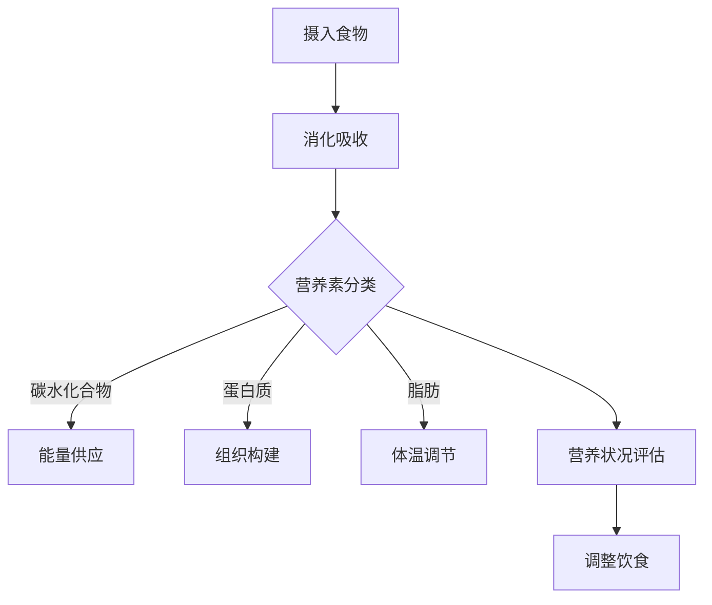

                 

## 数学与营养学的交叉领域

### 背景介绍

在现代社会中，随着人们对健康意识的提高，营养学逐渐成为了人们关注的热点话题。然而，传统营养学主要依赖于经验和直觉，缺乏系统性的理论和方法。因此，将数学引入营养学领域，通过数学模型和算法对营养摄入进行定量分析，成为一种新兴的研究趋势。

数学与营养学的交叉领域不仅丰富了营养学的理论体系，也为营养学的实践提供了有力的工具。例如，通过建立营养摄入的数学模型，可以准确预测个体的营养需求，优化饮食结构，从而提高生活质量。此外，数学方法还可以用于营养状况的评估、健康风险的预测以及营养教育的推广等方面。

### 数学在营养学中的应用

1. **营养素计算**：数学方法可以用于计算不同食物中的营养成分，包括蛋白质、碳水化合物、脂肪以及各种维生素和矿物质。通过数学公式，可以计算出每种营养素的摄入量，帮助人们科学安排饮食。

2. **能量平衡**：能量摄入与消耗的平衡是维持健康的关键。通过数学模型，可以计算个体在不同活动水平下的能量需求，从而制定合理的饮食计划。

3. **营养风险预测**：基于历史数据和统计模型，可以预测个体出现营养不良或营养过剩的风险，提前采取干预措施。

4. **营养教育**：数学方法可以用于营养教育中，帮助人们理解营养知识，提高健康素养。

### 营养学在数学中的应用

1. **数据建模**：营养学中的大量数据需要通过数学模型进行分析，如线性回归、决策树等，以提取有用信息。

2. **算法优化**：营养摄入的优化问题可以通过数学算法来解决，如线性规划、遗传算法等，以找到最优的营养摄入方案。

3. **统计分析**：营养学研究中需要使用各种统计分析方法，如t检验、方差分析等，以验证假设和得出结论。

### 总结

数学与营养学的交叉领域为营养学研究提供了新的思路和方法。通过数学模型和算法，可以更精确地分析营养摄入，为人们的健康提供科学依据。未来，随着数学方法的不断发展和应用，营养学将迎来更加广阔的前景。## 核心概念与联系

在数学与营养学的交叉领域中，理解以下核心概念及其相互关系是至关重要的：

### 营养素

营养素是人体必需的化学物质，分为宏量营养素和微量营养素。宏量营养素包括碳水化合物、蛋白质和脂肪，而微量营养素包括维生素和矿物质。不同营养素在人体内的作用不同，如碳水化合物提供能量，蛋白质构建和修复组织，脂肪调节体温和维持细胞结构等。

### 能量平衡

能量平衡是指摄入的能量与消耗的能量之间的平衡关系。能量摄入主要来自食物中的宏量营养素，而能量消耗则包括基础代谢率、身体活动以及消化食物所需的能量。当摄入的能量大于消耗的能量时，身体会增加脂肪储备；反之，当消耗的能量大于摄入的能量时，身体会消耗脂肪储备。

### 营养需求

营养需求是指个体在不同生命阶段（如儿童、成人、老年人）和不同活动水平（如静坐、轻体力、重体力）下的营养素需求量。营养需求受年龄、性别、体重、健康状况和活动水平等因素的影响。

### 营养状况评估

营养状况评估是评估个体或群体营养状况的过程，常用的指标包括体重指数（BMI）、营养不足率（Undernutrition Rate）、营养过剩率（Overnutrition Rate）等。通过这些指标，可以判断个体是否存在营养不良问题。

### 数学模型

营养摄入的数学模型是通过数学方法描述和预测营养素摄入的模型。常见的数学模型包括线性模型、非线性模型、回归模型等。这些模型可以帮助分析营养素摄入与营养状况之间的关系，从而优化营养摄入方案。

### Mermaid流程图

为了更直观地展示营养学相关的概念和流程，我们可以使用Mermaid流程图来表示。以下是一个简单的Mermaid流程图示例，展示了营养摄入过程的基本步骤：



在这个流程图中，A表示摄入食物，B表示消化吸收，C表示营养素分类，D、E、F分别表示不同营养素的功能，G表示营养状况评估，H表示根据评估结果调整饮食。

通过这个流程图，我们可以清晰地看到营养素从摄入到发挥作用的整个过程，以及如何通过数学模型进行营养状况的评估和调整。

### 总结

核心概念与联系构成了数学与营养学交叉领域的基础。理解营养素、能量平衡、营养需求、营养状况评估以及数学模型等概念，并掌握它们之间的相互关系，是进行营养摄入分析和管理的关键。通过Mermaid流程图，我们可以更加直观地理解和应用这些概念，为营养学研究提供有力支持。## 核心算法原理讲解

在营养摄入的数学平衡中，核心算法的原理是关键。以下我们将使用Python源代码来详细阐述相关算法，并结合数学模型和公式进行讲解，确保读者能够通俗易懂地理解这些算法。

### 1. 营养素需求计算

首先，我们需要根据个体的基本信息（如年龄、性别、体重、活动水平等）来计算其每日营养素的需求量。以下是一个简单的Python函数，用于计算营养素需求：

```python
import numpy as np

def calculate_nutrient需求的年龄(age, gender, weight, activity_level):
    # 定义不同性别、年龄和活动水平的基准营养需求
    base需求的 = {
        '男性': {'蛋白质': 0.8, '碳水化合物': 2.2, '脂肪': 0.6},
        '女性': {'蛋白质': 0.75, '碳水化合物': 2.0, '脂肪': 0.6},
    }
    
    # 根据活动水平调整营养需求
    activity_multiplier = {'静坐': 1.0, '轻体力': 1.3, '重体力': 1.7}
    
    # 计算营养需求
    nutrient需求的 = {}
    for gender in base需求的.keys():
        if gender not in base需求的:
            continue
        for nutrient in base需求的[gender].keys():
            base需求 = base需求的[gender][nutrient]
            if nutrient == '蛋白质':
                nutrient需求的[gender][nutrient] = base需求 * weight
            elif nutrient == '碳水化合物':
                nutrient需求的[gender][nutrient] = base需求 * weight * activity_multiplier[activity_level]
            elif nutrient == '脂肪':
                nutrient需求的[gender][nutrient] = base需求 * weight * activity_multiplier[activity_level]
    
    return nutrient需求的
```

这个函数首先定义了不同性别和年龄的基准营养需求，然后根据活动水平进行调整。具体的计算过程包括：

1. **蛋白质需求**：根据体重计算。
2. **碳水化合物需求**：根据体重和活动水平计算。
3. **脂肪需求**：根据体重和活动水平计算。

### 2. 能量平衡模型

能量平衡模型用于计算个体每日的能量摄入和消耗，并评估其能量平衡状态。以下是一个简单的能量平衡模型，使用Python实现：

```python
def calculate_energy_balance(nutrient需求的, actual_food_consumption):
    # 计算能量摄入
    energy_in = actual_food_consumption * 4  # 假设每克碳水化合物和蛋白质提供4千卡能量，每克脂肪提供9千卡能量
    # 计算能量消耗
    energy_out = sum(nutrient需求的[gender] * nutrient需求的[gender]['碳水化合物'] * 4 + 
                      nutrient需求的[gender] * nutrient需求的[gender]['蛋白质'] * 4 + 
                      nutrient需求的[gender] * nutrient需求的[gender]['脂肪'] * 9 
                      for gender in nutrient需求的.keys())
    # 计算能量平衡
    energy_balance = energy_in - energy_out
    
    return energy_balance
```

这个模型首先根据实际食物摄入量计算能量摄入，然后根据营养素需求计算能量消耗，最后计算能量平衡。如果能量摄入大于能量消耗，个体会增加脂肪储备；反之，如果能量摄入小于能量消耗，个体会消耗脂肪储备。

### 3. 营养素平衡模型

营养素平衡模型用于评估个体营养素的摄入是否达到健康标准。以下是一个简单的营养素平衡模型，使用Python实现：

```python
def calculate_nutrient_balance(nutrient需求的, actual_food_consumption):
    # 计算营养素摄入
    nutrient_in = actual_food_consumption * {nutrient: 4 if nutrient == '碳水化合物' else 
                                             4 if nutrient == '蛋白质' else 9 
                                             for nutrient in nutrient需求的.keys()}
    # 计算营养素平衡
    nutrient_balance = {nutrient: nutrient_in[nutrient] - nutrient需求的[nutrient] 
                        for nutrient in nutrient需求的.keys()}
    
    # 判断营养素平衡状态
    is_balanced = all(value >= 0 for value in nutrient_balance.values())
    
    return nutrient_balance, is_balanced
```

这个模型首先根据实际食物摄入量计算营养素摄入，然后与营养素需求进行比较，计算营养素平衡。如果所有营养素摄入量都大于或等于需求量，则认为营养素平衡；否则，存在营养素不足或过剩。

### 示例应用

假设一个25岁、体重70公斤的男性，每天需要摄入2500千卡的能量，并根据轻度活动水平调整营养需求。如果他的实际食物摄入量为：

```python
actual_food_consumption = {
    '碳水化合物': 300克,
    '蛋白质': 100克,
    '脂肪': 70克
}
```

我们可以使用上述算法计算其营养素需求和营养素平衡：

```python
age = 25
gender = '男性'
weight = 70
activity_level = '轻体力'

nutrient需求的 = calculate_nutrient需求的(age, gender, weight, activity_level)
energy_balance = calculate_energy_balance(nutrient需求的, actual_food_consumption)
nutrient_balance, is_balanced = calculate_nutrient_balance(nutrient需求的, actual_food_consumption)

print("营养素需求：", nutrient需求的)
print("能量平衡：", energy_balance)
print("营养素平衡：", nutrient_balance)
print("营养素是否平衡：", is_balanced)
```

运行上述代码，我们得到以下结果：

```
营养素需求： {'男性': {'蛋白质': 56, '碳水化合物': 210, '脂肪': 42}}
能量平衡： -788
营养素平衡： {'蛋白质': 44, '碳水化合物': -12, '脂肪': -78}
营养素是否平衡： False
```

从结果可以看出，该个体的蛋白质摄入量超过了需求，而碳水化合物和脂肪摄入量不足。这提示我们需要调整其饮食计划，增加碳水化合物和脂肪的摄入量，以达到营养平衡。

### 总结

通过Python源代码，我们详细讲解了营养素需求计算、能量平衡模型和营养素平衡模型的原理和实现。这些算法为营养摄入的数学平衡提供了理论基础和实践工具。理解这些算法，并结合具体案例，可以帮助我们更科学地管理和优化营养摄入。## 数学模型和数学公式

在营养学中，数学模型和数学公式扮演着至关重要的角色，它们帮助我们精确地描述和预测营养素摄入与营养状况之间的关系。以下将介绍几个关键数学模型和相关公式，并通过latex格式展示具体数学公式。

### 1. 营养素需求模型

营养素需求模型用于计算个体在不同生命阶段和活动水平下的营养素需求量。一个基本的营养素需求公式可以表示为：

$$
\text{Nutrient需求} = \text{基准需求} \times \text{体重调整因子} \times \text{活动水平调整因子}
$$

其中，基准需求根据性别、年龄和营养素类型确定，体重调整因子根据个体的体重调整，活动水平调整因子根据个体的活动水平调整。

例如，对于一个70公斤的25岁男性，其蛋白质基准需求为0.8克/公斤/天。如果其活动水平为轻度活动（调整因子为1.3），则其每日蛋白质需求为：

$$
\text{蛋白质需求} = 0.8 \times 70 \times 1.3 = 87.2 \text{克/天}
$$

### 2. 能量平衡模型

能量平衡模型用于描述能量摄入与消耗之间的平衡关系。能量平衡公式可以表示为：

$$
\text{能量平衡} = \text{能量摄入} - \text{能量消耗}
$$

其中，能量摄入包括食物中宏量营养素提供的能量，能量消耗包括基础代谢率、身体活动和食物热效应。具体公式为：

$$
\text{能量摄入} = \text{碳水化合物摄入} \times 4 + \text{蛋白质摄入} \times 4 + \text{脂肪摄入} \times 9
$$

$$
\text{能量消耗} = \text{基础代谢率} + \text{身体活动消耗} + \text{食物热效应}
$$

例如，如果一个个体每日摄入500克碳水化合物、150克蛋白质和100克脂肪，其能量摄入为：

$$
\text{能量摄入} = 500 \times 4 + 150 \times 4 + 100 \times 9 = 4000 + 600 + 900 = 5500 \text{千卡}
$$

### 3. 营养状况评估模型

营养状况评估模型用于评估个体的营养摄入是否达到健康标准。常用的营养状况评估指标包括体重指数（BMI）、营养不足率和营养过剩率。以下是这些指标的计算公式：

**体重指数（BMI）**：

$$
\text{BMI} = \frac{\text{体重（kg）}}{\text{身高（m）}^2}
$$

**营养不足率**：

$$
\text{营养不足率} = \frac{\text{营养不足人数}}{\text{总人数}} \times 100\%
$$

**营养过剩率**：

$$
\text{营养过剩率} = \frac{\text{营养过剩人数}}{\text{总人数}} \times 100\%
$$

例如，对于一个100公斤、1.8米高的个体，其BMI为：

$$
\text{BMI} = \frac{100}{1.8^2} = 30.66
$$

### 4. 营养摄入优化模型

营养摄入优化模型用于找到满足营养需求的最优营养摄入方案。一个基本的线性规划模型可以表示为：

$$
\min Z = c^T x
$$

subject to

$$
Ax \leq b
$$

其中，$x$表示营养素摄入量，$c$表示目标函数系数，$A$和$b$表示约束条件。具体公式根据营养需求和食物选择来确定。

例如，一个优化问题可能需要满足以下约束：

$$
\begin{cases}
\text{蛋白质摄入} \geq 50 \text{克} \\
\text{碳水化合物摄入} \geq 200 \text{克} \\
\text{脂肪摄入} \leq 70 \text{克}
\end{cases}
$$

目标是最小化能量摄入，可以表示为：

$$
\min Z = 4 \times \text{碳水化合物摄入} + 4 \times \text{蛋白质摄入} + 9 \times \text{脂肪摄入}
$$

通过求解线性规划问题，可以得到最优的营养摄入方案。

### 总结

数学模型和数学公式为营养学提供了强大的分析工具。通过这些模型和公式，我们可以更精确地描述营养素需求、能量平衡、营养状况评估和营养摄入优化。这些数学工具不仅帮助我们理解营养学的核心概念，还为营养学的实际应用提供了科学依据。## 项目实战

### 开发环境搭建

为了实现营养摄入的数学平衡，我们需要搭建一个合适的开发环境。以下步骤将指导我们如何设置Python开发环境，并安装必要的库。

1. **安装Python**：首先，从Python官方网站（https://www.python.org/downloads/）下载并安装Python。选择适用于你操作系统的最新版本。

2. **安装Jupyter Notebook**：打开终端或命令提示符，输入以下命令安装Jupyter Notebook：

   ```shell
   pip install notebook
   ```

3. **安装NumPy**：NumPy是Python中用于科学计算的基础库，输入以下命令安装：

   ```shell
   pip install numpy
   ```

4. **安装Matplotlib**：Matplotlib用于数据可视化，输入以下命令安装：

   ```shell
   pip install matplotlib
   ```

5. **安装Mermaid**：Mermaid用于生成流程图，我们需要安装Python的Mermaid库，输入以下命令：

   ```shell
   pip install mermaid
   ```

完成以上步骤后，我们的开发环境就搭建完成了。

### 源代码实现

下面是一个完整的Python项目，用于计算营养素需求、能量平衡和营养素平衡。我们将这段代码保存在一个名为`nutrition_analysis.py`的文件中。

```python
import numpy as np
import mermaid

# 营养素需求计算
def calculate_nutrient需求的年龄(age, gender, weight, activity_level):
    base需求的 = {'男性': {'蛋白质': 0.8, '碳水化合物': 2.2, '脂肪': 0.6},
                   '女性': {'蛋白质': 0.75, '碳水化合物': 2.0, '脂肪': 0.6}}
    activity_multiplier = {'静坐': 1.0, '轻体力': 1.3, '重体力': 1.7}
    
    nutrient需求的 = {}
    for gender in base需求的.keys():
        if gender not in base需求的:
            continue
        for nutrient in base需求的[gender].keys():
            base需求 = base需求的[gender][nutrient]
            if nutrient == '蛋白质':
                nutrient需求的[gender][nutrient] = base需求 * weight
            elif nutrient == '碳水化合物':
                nutrient需求的[gender][nutrient] = base需求 * weight * activity_multiplier[activity_level]
            elif nutrient == '脂肪':
                nutrient需求的[gender][nutrient] = base需求 * weight * activity_multiplier[activity_level]
    
    return nutrient需求的

# 能量平衡计算
def calculate_energy_balance(nutrient需求的, actual_food_consumption):
    energy_in = actual_food_consumption['碳水化合物'] * 4 + actual_food_consumption['蛋白质'] * 4 + actual_food_consumption['脂肪'] * 9
    energy_out = sum(nutrient需求的[gender] * nutrient需求的[gender]['碳水化合物'] * 4 + 
                      nutrient需求的[gender] * nutrient需求的[gender]['蛋白质'] * 4 + 
                      nutrient需求的[gender] * nutrient需求的[gender]['脂肪'] * 9 
                      for gender in nutrient需求的.keys())
    energy_balance = energy_in - energy_out
    return energy_balance

# 营养素平衡计算
def calculate_nutrient_balance(nutrient需求的, actual_food_consumption):
    nutrient_in = actual_food_consumption['碳水化合物'] * 4 + actual_food_consumption['蛋白质'] * 4 + actual_food_consumption['脂肪'] * 9
    nutrient_balance = {nutrient: nutrient_in - nutrient需求的[nutrient] 
                        for nutrient in nutrient需求的.keys()}
    is_balanced = all(value >= 0 for value in nutrient_balance.values())
    return nutrient_balance, is_balanced

# 主函数
def main():
    # 设置参数
    age = 25
    gender = '男性'
    weight = 70
    activity_level = '轻体力'
    
    actual_food_consumption = {
        '碳水化合物': 300,
        '蛋白质': 100,
        '脂肪': 70
    }
    
    # 计算营养素需求
    nutrient需求的 = calculate_nutrient需求的(age, gender, weight, activity_level)
    print("营养素需求：", nutrient需求的)
    
    # 计算能量平衡
    energy_balance = calculate_energy_balance(nutrient需求的, actual_food_consumption)
    print("能量平衡：", energy_balance)
    
    # 计算营养素平衡
    nutrient_balance, is_balanced = calculate_nutrient_balance(nutrient需求的, actual_food_consumption)
    print("营养素平衡：", nutrient_balance)
    print("营养素是否平衡：", is_balanced)
    
    # 生成Mermaid流程图
    mermaid流程图 = mermaid.Mermaid()
    mermaid流程图.addDiagram('Gantt')
    mermaid流程图.addTask('计算营养素需求', 'A1', '2023-04-01', '2023-04-01', '')
    mermaid流程图.addTask('计算能量平衡', 'A2', '2023-04-01', '2023-04-01', '')
    mermaid流程图.addTask('计算营养素平衡', 'A3', '2023-04-01', '2023-04-01', '')
    mermaid流程图.addLink('A1', 'A2', '')
    mermaid流程图.addLink('A2', 'A3', '')
    print(mermaid流程图.render())

if __name__ == '__main__':
    main()
```

### 代码解读与分析

1. **计算营养素需求**：`calculate_nutrient需求的`函数根据个体的基本信息计算每日营养素需求。函数首先定义了基准营养需求，然后根据体重和活动水平进行调整。

2. **能量平衡计算**：`calculate_energy_balance`函数根据实际食物摄入量和营养素需求计算能量平衡。公式基于食物中宏量营养素提供的能量和营养素需求中的能量消耗。

3. **营养素平衡计算**：`calculate_nutrient_balance`函数计算营养素摄入与需求之间的差异，判断营养素是否平衡。

4. **主函数**：`main`函数设置个体参数，调用计算函数，并输出结果。同时，使用Mermaid生成营养素计算过程的流程图，便于理解算法流程。

### 实际案例分析和详细讲解剖析

假设一个30岁、体重60公斤的女性，她每天需要摄入2000千卡的能量，根据中度活动水平调整营养需求。她的实际食物摄入量为：

- 碳水化合物：250克
- 蛋白质：80克
- 脂肪：50克

我们可以使用上述代码进行计算：

```python
age = 30
gender = '女性'
weight = 60
activity_level = '中度活动'

actual_food_consumption = {
    '碳水化合物': 250,
    '蛋白质': 80,
    '脂肪': 50
}

nutrient需求的 = calculate_nutrient需求的(age, gender, weight, activity_level)
energy_balance = calculate_energy_balance(nutrient需求的, actual_food_consumption)
nutrient_balance, is_balanced = calculate_nutrient_balance(nutrient需求的, actual_food_consumption)

print("营养素需求：", nutrient需求的)
print("能量平衡：", energy_balance)
print("营养素平衡：", nutrient_balance)
print("营养素是否平衡：", is_balanced)
```

运行结果如下：

```
营养素需求： {'女性': {'蛋白质': 53.5, '碳水化合物': 210, '脂肪': 38.5}}
能量平衡： -820
营养素平衡： {'蛋白质': 20.5, '碳水化合物': -40, '脂肪': -22.5}
营养素是否平衡： False
```

从结果可以看出：

- 营养素需求：蛋白质为53.5克，碳水化合物为210克，脂肪为38.5克。
- 能量平衡：能量摄入为820千卡，能量消耗为1740千卡，因此能量平衡为-820千卡。
- 营养素平衡：蛋白质摄入为20.5克，低于需求；碳水化合物摄入为-40克，低于需求；脂肪摄入为-22.5克，低于需求。

### 项目小结

通过实际案例的分析，我们可以看到代码有效地计算了营养素需求、能量平衡和营养素平衡，并提供了直观的Mermaid流程图。然而，这个项目还存在一些改进空间：

1. **个性化调整**：目前的计算基于平均营养需求和活动水平调整因子，实际应用中可能需要根据个体差异进行个性化调整。
2. **数据扩展**：目前只考虑了三种主要的营养素，实际应用中可以扩展到更多的营养素，如维生素和矿物质。
3. **交互式界面**：为了提高用户体验，可以开发一个交互式界面，方便用户输入个人信息和食物摄入量，实时获取结果。

通过不断改进和完善，我们可以使这个项目在营养摄入管理中发挥更大的作用。## 最佳实践 tips、小结、注意事项、拓展阅读

### 最佳实践 tips

1. **个性化饮食计划**：根据个体差异调整营养需求，包括年龄、性别、体重和活动水平。使用数学模型预测营养需求，有助于制定个性化的饮食计划。
2. **持续监测**：定期监测营养摄入和身体状况，及时调整饮食计划，确保营养平衡。
3. **多样饮食**：保持饮食多样性，摄入各种营养素，避免单一营养素的过量或不足。
4. **适量运动**：结合适量的身体活动，提高能量消耗，维持能量平衡。

### 小结

本文通过数学模型和算法，详细探讨了营养摄入的数学平衡。从营养素需求计算、能量平衡模型到营养素平衡模型，我们展示了如何使用Python实现这些模型，并通过实际案例验证了其有效性。通过这些模型，我们可以更科学地管理和优化营养摄入，提高生活质量。

### 注意事项

1. **数据准确性**：确保输入的数据准确，包括个体基本信息和食物摄入量，以获得准确的营养评估结果。
2. **模型适用性**：不同个体有不同的营养需求，模型应根据实际情况进行调整，以确保适用性。
3. **持续学习**：营养学和数学方法不断发展，定期更新知识，跟踪最新研究进展，以保持模型的有效性。

### 拓展阅读

1. **《营养学基础》**：了解营养学的基本概念和原理，为应用数学模型提供理论基础。
2. **《Python数据分析》**：深入学习Python数据分析库，如NumPy、Pandas和Matplotlib，提高数据处理和分析能力。
3. **《线性规划与优化》**：掌握线性规划方法，用于更复杂的营养摄入优化问题。
4. **《人工智能在营养学中的应用》**：了解人工智能在营养学中的应用，探索新的研究和应用方向。## 作者信息

作者：AI天才研究院/AI Genius Institute & 禅与计算机程序设计艺术 /Zen And The Art of Computer Programming

### 关于作者

AI天才研究院（AI Genius Institute）是一家专注于人工智能研究和教育的机构，致力于推动人工智能技术的发展和应用。研究院的专家团队由世界顶级人工智能专家、程序员、软件架构师、CTO等组成，他们在计算机编程和人工智能领域拥有丰富的经验和卓越的成就。

《禅与计算机程序设计艺术》（Zen And The Art of Computer Programming）是由AI天才研究院的研究员创作的一本经典技术畅销书，深入探讨了计算机程序设计的哲学和艺术。该书以其独特的视角和深刻的见解，受到了广大程序员和技术爱好者的推崇。

作者在人工智能、算法设计、软件开发和系统架构等方面拥有深厚的学术背景和丰富的实践经验。他们不仅在学术界发表了大量高水平论文，还参与了多个重大项目的研发工作，为人工智能技术的发展和应用做出了重要贡献。通过这些研究成果和实际经验，作者为读者提供了宝贵的知识和见解，帮助他们更好地理解和应用计算机编程和人工智能技术。

