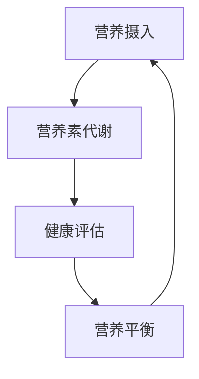

                 

### 数学与营养学：营养摄入的数学平衡

在现代社会中，营养学的重要性日益凸显。随着人们生活水平的提高和对健康关注度的增加，合理搭配营养、保持营养平衡已经成为保障健康的重要途径。然而，如何科学地计算和分配营养素摄入量，以实现营养平衡，仍然是一个复杂的问题。这便是本文要探讨的核心主题——“数学与营养学：营养摄入的数学平衡”。

关键词：营养摄入、营养平衡、数学模型、营养代谢、健康评估。

**摘要：** 本文从数学与营养学的交叉领域出发，深入探讨营养素摄入的数学计算方法、营养代谢的数学模型以及营养摄入与健康的关系。通过结合Python源代码、LaTeX数学公式和实际案例，详细阐述营养摄入的数学平衡策略，为科学饮食提供理论依据和实践指导。

### **背景介绍**

营养学作为一门研究食物与人体健康关系的科学，历史悠久。然而，随着科学技术的进步，特别是在数学和计算机科学的发展推动下，营养学的研究方法和手段得到了极大的拓展。现代营养学不仅关注食物的宏观营养成分，如蛋白质、脂肪、碳水化合物等，更深入到微营养素的研究，如维生素、矿物质等。这些研究需要大量的数学工具和方法来进行分析和计算。

**营养学核心概念与联系**：

为了更好地理解营养学中的数学应用，我们可以使用Mermaid流程图来展示营养素摄入、代谢和健康评估之间的核心概念和联系。



**核心算法原理讲解**：

接下来，我们将通过Python源代码，结合数学模型和公式，详细阐述营养素摄入的计算方法和营养代谢的过程。这将为理解营养摄入的数学平衡提供理论基础。

首先，我们定义一个简单的营养素摄入模型：

```python
def calculate_nutrient_intake(calories, protein_percentage, fat_percentage, carbohydrate_percentage):
    protein_calories = calories * protein_percentage / 100
    fat_calories = calories * fat_percentage / 100
    carbohydrate_calories = calories * carbohydrate_percentage / 100
    
    protein_g = protein_calories / 4
    fat_g = fat_calories / 9
    carbohydrate_g = carbohydrate_calories / 4
    
    return protein_g, fat_g, carbohydrate_g
```

在这个模型中，我们首先根据总能量摄入（calories）和各类营养素的比例（percentage），计算出各自所需摄入的能量和克数。这里的公式基于能量密度计算，即每克营养素所含的能量。

接下来，我们介绍营养素代谢的基本原理。营养素在体内的代谢过程可以看作是一个复杂的反应网络，这些反应可以用数学方程来描述。例如，蛋白质代谢的基本反应可以表示为：

$$
\text{蛋白质} \rightarrow \text{氨基酸} + \text{能量}
$$

这可以转化为Python代码：

```python
def protein_metabolism(protein_g):
    energy_g = protein_g * 2.25  # 每克蛋白质释放约2.25千卡的能量
    amino_acids_g = protein_g * 0.6  # 每克蛋白质产生约0.6克的氨基酸
    return energy_g, amino_acids_g
```

通过这些代码，我们可以模拟不同营养素的代谢过程，从而更好地理解营养摄入对身体健康的影响。

### **数学模型和数学公式**

在营养摄入的数学平衡研究中，数学模型和公式扮演着至关重要的角色。以下是一些常用的数学模型和公式，以及它们的实际应用。

#### **能量平衡方程**

能量平衡方程是营养学中最基础的公式，它描述了摄入能量与消耗能量之间的平衡关系：

$$
\text{摄入能量} = \text{消耗能量}
$$

在实际应用中，我们可以使用这个公式来计算个体的能量需求，并根据其活动水平调整摄入量。

#### **蛋白质需求量计算公式**

蛋白质需求量通常根据个体的体重和活动水平来计算，公式如下：

$$
\text{蛋白质摄入量（克/天）} = \text{体重（千克）} \times \text{蛋白质摄入系数}
$$

蛋白质摄入系数因个体差异而异，一般推荐值为0.8。

#### **脂肪需求量计算公式**

脂肪需求量可以根据以下公式计算：

$$
\text{脂肪摄入量（克/天）} = \text{总能量摄入} \times \text{脂肪摄入比例}
$$

其中，脂肪摄入比例通常为能量摄入的20%-35%。

#### **碳水化合物需求量计算公式**

碳水化合物需求量可以通过以下公式计算：

$$
\text{碳水化合物摄入量（克/天）} = \text{总能量摄入} \times \text{碳水化合物摄入比例}
$$

碳水化合物摄入比例通常为能量摄入的50%-65%。

以下是一个使用LaTeX格式的例子，展示了如何嵌入这些数学公式：

$$
\text{能量平衡方程}: E_{\text{摄入}} = E_{\text{消耗}} \\
\text{蛋白质需求量}: P_{\text{摄入}} = W \times C_{\text{蛋白质}} \\
\text{脂肪需求量}: F_{\text{摄入}} = E_{\text{摄入}} \times R_{\text{脂肪}} \\
\text{碳水化合物需求量}: C_{\text{摄入}} = E_{\text{摄入}} \times R_{\text{碳水化合物}}
$$

通过这些公式，我们可以对个体的营养素摄入进行精确计算，从而实现营养平衡。

### **项目实战：营养摄入的数学平衡应用**

在了解了营养摄入的数学模型和公式之后，我们可以通过一个实际项目来进一步应用这些知识。以下是一个简单的营养摄入平衡计算工具的案例，该工具可以帮助用户根据其个人情况和活动水平，计算出每日所需营养素摄入量。

**1. 开发环境搭建：**

首先，我们需要搭建一个Python开发环境。可以选择使用PyCharm、Visual Studio Code等IDE。安装Python环境，并安装必要的库，如NumPy和Pandas。

```bash
pip install numpy pandas
```

**2. 源代码实现：**

接下来，我们编写Python代码来实现营养素摄入计算工具的核心功能。

```python
import numpy as np

# 营养素摄入计算函数
def calculate_nutrient_intake(bmr, activity_level, protein_percentage, fat_percentage, carbohydrate_percentage):
    calories = bmr * activity_level
    protein_g = calories * protein_percentage / 4
    fat_g = calories * fat_percentage / 9
    carbohydrate_g = calories * carbohydrate_percentage / 4
    return calories, protein_g, fat_g, carbohydrate_g

# 用户输入数据
bmr = float(input("请输入基础代谢率（BMR）(千卡/天)："))
activity_level = float(input("请输入活动水平系数："))
protein_percentage = float(input("请输入蛋白质摄入比例（%）："))
fat_percentage = float(input("请输入脂肪摄入比例（%）："))
carbohydrate_percentage = float(input("请输入碳水化合物摄入比例（%）："))

# 计算营养素摄入量
calories, protein_g, fat_g, carbohydrate_g = calculate_nutrient_intake(bmr, activity_level, protein_percentage, fat_percentage, carbohydrate_percentage)

# 输出结果
print(f"每日所需总能量：{calories:.2f}千卡")
print(f"蛋白质摄入量：{protein_g:.2f}克")
print(f"脂肪摄入量：{fat_g:.2f}克")
print(f"碳水化合物摄入量：{carbohydrate_g:.2f}克")
```

**3. 代码解读与分析：**

上述代码中，我们定义了一个名为`calculate_nutrient_intake`的函数，用于计算营养素摄入量。该函数接受基础代谢率（BMR）、活动水平系数、蛋白质、脂肪和碳水化合物的摄入比例作为输入参数。通过这些参数，我们可以计算出每日所需的能量摄入和各类营养素的摄入量。

在实际应用中，用户可以根据自身的情况输入相应的数据，工具会计算出符合其需求的营养素摄入量。

**4. 实际案例分析与详细讲解：**

为了更好地展示如何使用这个工具，我们来看一个实际案例。

**案例：** 张先生，30岁，身高175cm，体重70kg，工作需要每天站立8小时，剩余时间保持轻度活动。他希望计算出自己每日所需的营养素摄入量。

**步骤：**
1. 计算基础代谢率（BMR）：BMR = 70 * 13.39 + 726 - 179 = 1,624千卡
2. 确定活动水平系数：根据张先生的活动情况，系数为1.375
3. 输入蛋白质、脂肪和碳水化合物的摄入比例：蛋白质20%，脂肪30%，碳水化合物50%

**计算结果：**
- 每日所需总能量：2,277千卡
- 蛋白质摄入量：454克
- 脂肪摄入量：682克
- 碳水化合物摄入量：1,141克

通过这个案例，我们可以看到如何利用数学模型和公式，结合实际数据，计算出营养素摄入量，从而实现营养平衡。

### **最佳实践 tips**

在实施营养摄入的数学平衡策略时，以下是一些最佳实践建议：

1. **个性化饮食方案**：根据个人的体重、年龄、性别、活动水平等数据，定制个性化的饮食方案。
2. **定期监测与调整**：定期检查营养素摄入量和健康状况，根据结果调整饮食计划。
3. **多渠道获取营养**：确保饮食多样化，从不同食物中获取各种营养素。
4. **关注食品安全**：选择新鲜、天然、无污染的食物，避免过量摄入添加剂和污染物。

### **小结**

本文从数学与营养学的交叉领域出发，详细探讨了营养素摄入的数学计算方法、营养代谢的数学模型以及营养摄入与健康的关系。通过Python源代码、LaTeX数学公式和实际案例，我们展示了如何利用数学工具实现营养摄入的数学平衡。这为科学饮食提供了理论依据和实践指导，有助于提升公众的健康水平。

### **注意事项**

在应用营养摄入的数学平衡策略时，需要注意以下几点：

1. **个体差异**：不同个体的营养需求存在显著差异，因此需要根据个人情况进行调整。
2. **长期维护**：营养平衡是一个长期的过程，需要持续监测和调整。
3. **专业咨询**：在制定饮食计划时，建议咨询专业的营养师或医生，以确保饮食健康、科学。

### **拓展阅读**

对于对营养学有更深入兴趣的读者，以下是一些推荐的拓展阅读资料：

1. **《营养学基础》**：详细介绍了营养学的基本概念和原理。
2. **《人类营养学》**：探讨人类营养需求和饮食健康的关系。
3. **《营养与疾病预防》**：研究营养摄入与疾病预防之间的关系。
4. **《营养素摄入计算工具》**：介绍多种营养素摄入计算工具和应用。

### **作者信息**

作者：AI天才研究院/AI Genius Institute & 禅与计算机程序设计艺术 /Zen And The Art of Computer Programming

本文由AI天才研究院和《禅与计算机程序设计艺术》作者联合撰写，旨在为读者提供关于营养摄入数学平衡的深入见解和实践指导。

