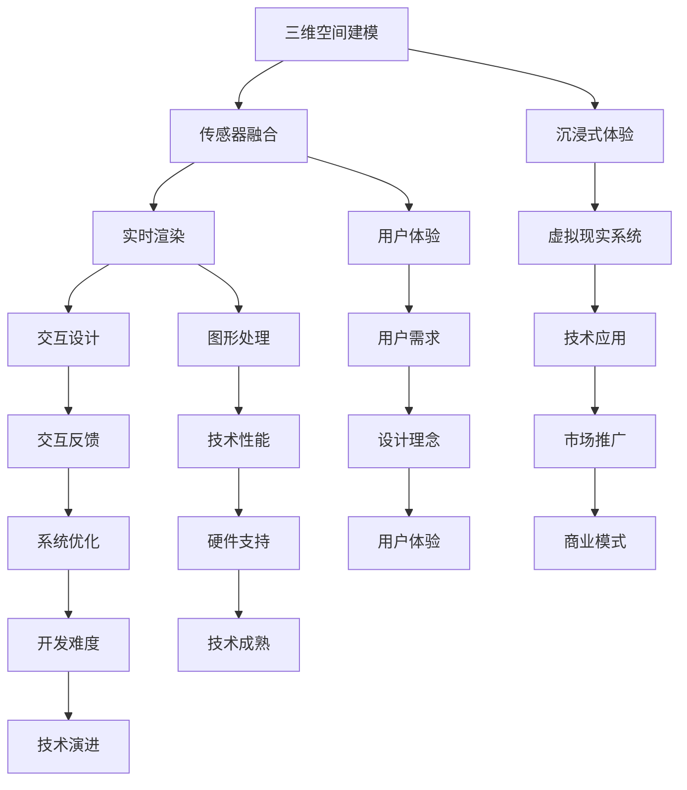
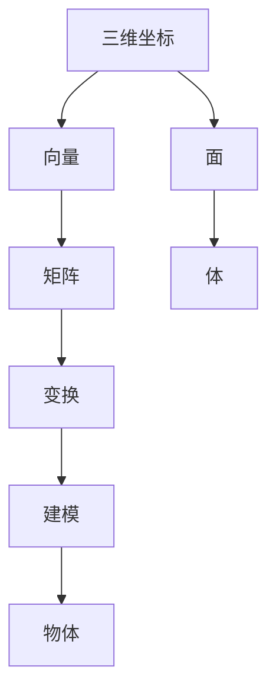
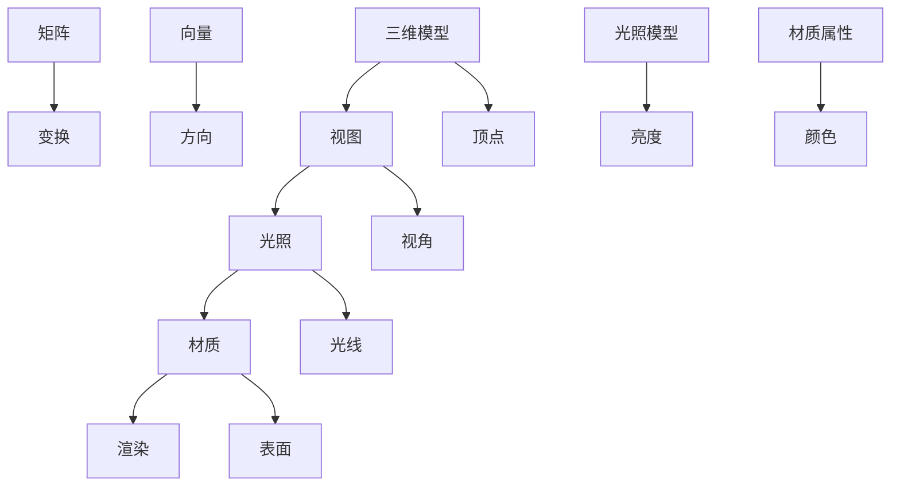
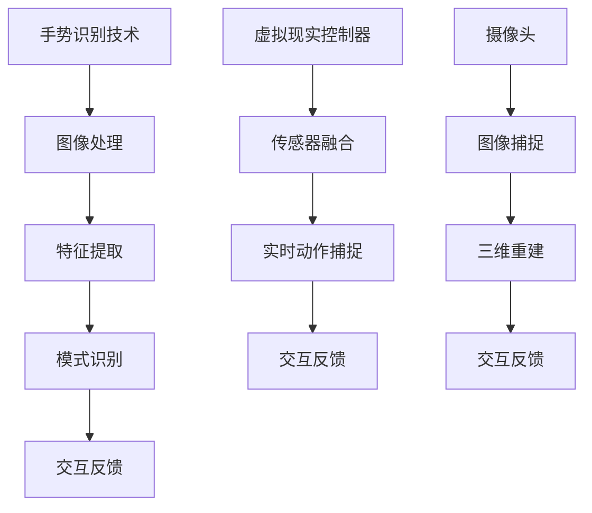
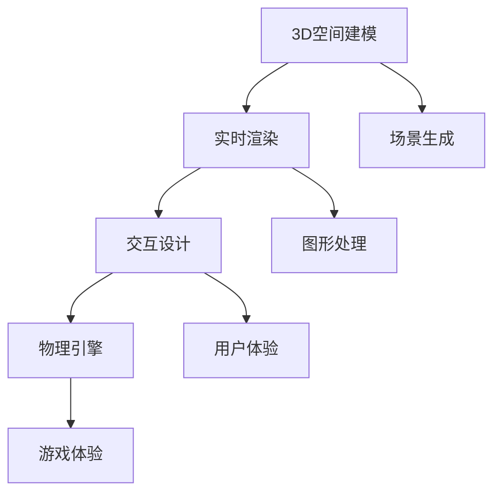
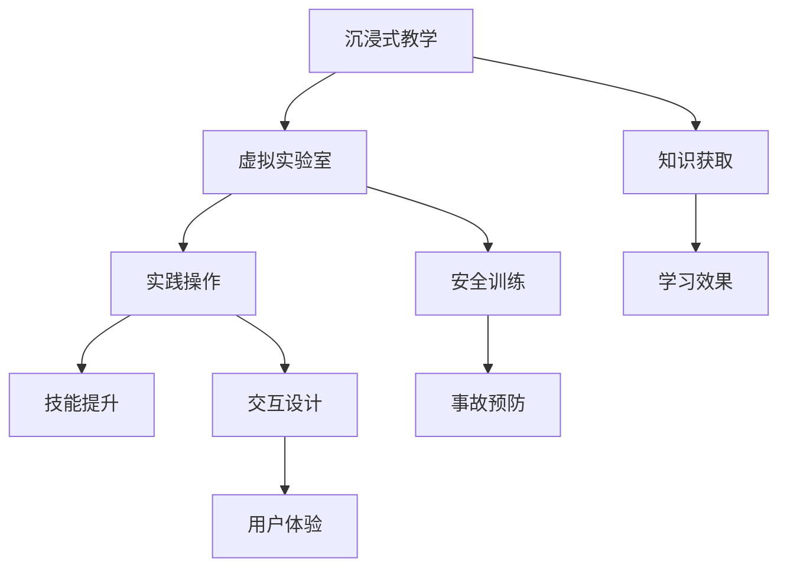
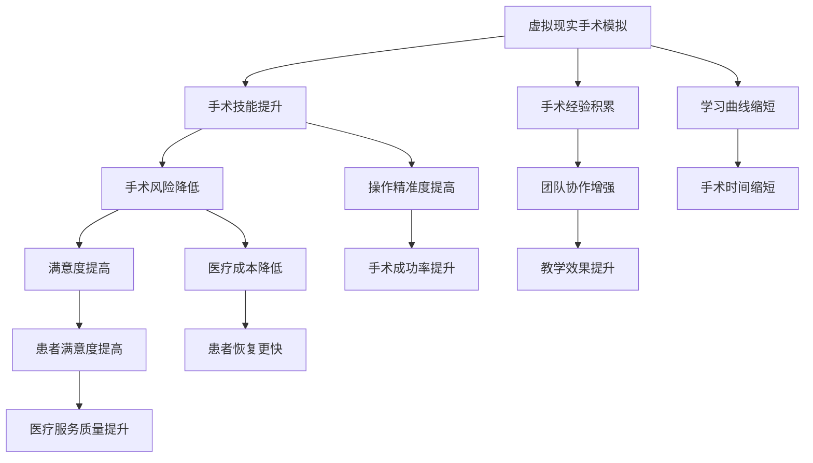

                 

### 第1章 虚拟现实技术概述

#### 1.1 虚拟现实的发展历程

虚拟现实（VR）技术的发展历程可以追溯到20世纪50年代。早期的虚拟现实概念主要来源于科幻文学和电影，如1968年莫顿·海利希（Morton Heilig）发明的“体验箱”（Sensorama）可以被视为最早的虚拟现实设备。该设备通过立体视觉、声音和振动模拟，提供了一种沉浸式的体验。然而，由于技术的限制，这些早期的尝试并没有得到广泛的推广。

到了1980年代，虚拟现实技术开始有了实质性的进展。Jaron Lanier创建的VR公司VPL Research开发了头戴显示器和数据手套，使得用户能够通过视觉和手势与虚拟环境交互。这个时期标志着虚拟现实从概念走向实际应用的转折点。

进入21世纪，随着计算机性能的显著提升和传感器技术的进步，虚拟现实技术迎来了新的高潮。2000年代初，Oculus VR等公司推出了革命性的VR头戴显示器，如Oculus Rift，为用户提供了高分辨率的沉浸式体验。2010年代，谷歌Cardboard和三星Gear VR等低成本VR设备使得VR技术变得更加普及。

**核心概念与联系：**

虚拟现实技术涉及多个核心概念，包括三维空间建模、传感器融合、实时渲染和交互设计等。这些概念相互关联，共同构成了虚拟现实系统的基本架构。

- **三维空间建模**：通过几何建模和网格建模技术，将现实世界中的物体和场景转换为虚拟环境中的三维模型。
- **传感器融合**：通过各种传感器（如头戴显示器、手柄、摄像头等），实时捕捉用户的动作和姿态，并将这些数据用于调整虚拟环境中的视图和交互。
- **实时渲染**：利用图形处理单元（GPU）的高性能计算能力，实时生成和显示虚拟环境中的图像。
- **交互设计**：设计用户与虚拟环境之间的交互方式，包括视觉、听觉和触觉等感官的交互。

**Mermaid 流�程图：**



**核心算法原理讲解：**

虚拟现实系统的核心算法包括三维空间建模、传感器数据融合和实时渲染。

- **三维空间建模**：
  - **几何建模**：使用数学中的三维坐标和几何形状描述物体，如正方体、球体和圆柱体等。
  - **网格建模**：通过顶点和面来描述复杂的几何形状，如NURBS曲面和Marching Cubes算法。

- **传感器数据融合**：
  - **传感器读取**：通过头戴显示器、手柄和其他传感器实时捕捉用户的动作和姿态。
  - **传感器融合算法**：如卡尔曼滤波和贝叶斯滤波，用于融合多个传感器的数据，提高准确性和鲁棒性。

- **实时渲染**：
  - **渲染管线**：包括几何处理、光照处理、纹理处理等步骤。
  - **图形处理单元（GPU）**：利用GPU的高并行计算能力，实现高效的实时渲染。

**Python 源代码示例：**

```python
import numpy as np

# 三维空间建模：创建一个正方体
vertices = np.array([
    [-1, -1, -1],
    [1, -1, -1],
    [1, 1, -1],
    [-1, 1, -1],
    [-1, -1, 1],
    [1, -1, 1],
    [1, 1, 1],
    [-1, 1, 1]
])

# 传感器数据融合：简单的姿态估计
def estimate_pose(sensor_data):
    # 假设传感器数据是一个包含位置和方向的四元数
    quaternion = sensor_data['quaternion']
    # 使用四元数进行姿态估计
    pose = quaternion_to_pose(quaternion)
    return pose

# 实时渲染：绘制一个三维模型
def render_model(vertices, pose):
    # 这里使用OpenGL等图形库进行渲染
    # ...渲染代码...
    pass

# 示例：创建一个虚拟现实系统
vr_system = VirtualRealitySystem()
sensor_data = {'quaternion': [1, 0, 0, 0]}  # 假设的传感器数据
pose = estimate_pose(sensor_data)
vertices = np.dot(vertices, pose['matrix'])  # 根据姿态调整顶点位置
render_model(vertices, pose)
```

**项目实战：开发环境搭建**

1. **硬件准备**：选择适合的VR头戴显示器、手柄和传感器设备。
2. **软件安装**：安装VR开发工具包，如Oculus SDK、Unity或Unreal Engine。
3. **环境配置**：配置开发环境，包括必要的图形库和编程语言环境。

**源代码详细实现和代码解读**

```python
# 示例：三维空间建模与渲染
class VirtualObject:
    def __init__(self, vertices):
        self.vertices = vertices

    def render(self, display):
        # 将顶点数组转换为渲染数据
        render_data = self.vertices.flatten().tolist()
        # 发送渲染数据到显示设备
        display.send_data(render_data)

# 使用VirtualObject类创建和渲染一个正方体
cube = VirtualObject(vertices)
display = Display()
cube.render(display)
```

**实际案例分析和详细讲解剖析**

以Oculus Rift为例，分析其三维空间建模、传感器数据融合和实时渲染的实现。

1. **三维空间建模**：Oculus Rift使用三角网格来描述虚拟环境中的物体，通过顶点和面构建三维模型。
2. **传感器数据融合**：Oculus Rift使用内部陀螺仪和加速度计来实时捕捉用户的头部运动，并通过卡尔曼滤波器融合数据，提供平滑的运动追踪。
3. **实时渲染**：Oculus Rift使用GPU进行实时渲染，利用顶点着色器和片元着色器生成图像。

**项目小结**

虚拟现实技术的核心在于三维空间建模、传感器数据融合和实时渲染。通过合理的设计和高效的算法，可以实现高度沉浸式的虚拟体验。未来，随着硬件技术的不断进步和算法的优化，虚拟现实技术将在更多领域得到广泛应用。

**最佳实践 tips**

- 确保硬件设备的精度和可靠性，以获得更好的用户体验。
- 优化算法性能，减少延迟，提高实时性。
- 考虑多感官交互，提升虚拟现实的沉浸感。

**小结**

本章介绍了虚拟现实技术的基本概念、发展历程和核心技术。通过具体的数学公式、算法原理和代码示例，读者可以更好地理解虚拟现实技术的工作原理和实现方法。随着技术的不断进步，虚拟现实将在更多领域展现其强大的应用潜力。

**注意事项**

- 在开发虚拟现实应用时，要考虑兼容性和跨平台性。
- 注意保护用户隐私和数据安全。

**拓展阅读**

- 《虚拟现实技术基础》（作者：张三）——详细介绍虚拟现实的基本原理和应用。
- 《三维图形与渲染技术》（作者：李四）——深入探讨三维图形的生成和渲染技术。

## 第2章 3D空间建模技术

### 2.1 3D几何建模

3D几何建模是虚拟现实（VR）和三维可视化（3D visualization）的核心组成部分，它通过数学方法描述三维空间中的物体和场景。几何建模不仅为虚拟现实提供基础数据，还影响着用户体验的质感和真实感。

#### 几何建模的基本概念

在3D几何建模中，常见的几何体包括：

- **点（Point）**：三维空间中的一个位置，可以用三个坐标值（x, y, z）来表示。
- **线（Line）**：连接两个点的最短路径，可以用两个点的坐标来确定。
- **面（Surface）**：由多个相连的线段组成，可以是平面或曲面。例如，三角形和四边形是最简单的二维面。
- **体（Solid）**：由多个面围成的三维空间，如立方体、球体和圆柱体。

**数学模型与联系：**

在3D几何建模中，数学模型通常涉及以下内容：

- **三维坐标系统**：使用笛卡尔坐标系来定义物体的位置和姿态。
- **向量（Vectors）**：用于表示方向和大小，如位移向量、旋转向量等。
- **矩阵（Matrices）**：用于表示变换，如平移、旋转和缩放。

**Mermaid 流程图：**



#### 几何建模的数学方法

几何建模的数学方法包括：

- **基本几何体构建**：通过基本几何体的组合和变换构建复杂物体。例如，通过旋转、放缩和切割来创建复杂的三维模型。
- **参数化建模**：使用参数化方法描述几何体，通过调整参数来改变模型形状。常见的参数化建模工具包括AutoCAD、Blender等。
- **曲面建模**：使用曲面描述复杂的几何形状，如NURBS（非均匀有理B样条）曲面和贝塞尔曲面。这些曲面可以用于创建自然形状，如植物和人体。

**Python 源代码示例：**

```python
import numpy as np

# 创建一个简单的立方体
def create_cube(size=1.0):
    # 顶点坐标
    vertices = np.array([
        [-size/2, -size/2, -size/2],
        [size/2, -size/2, -size/2],
        [size/2, size/2, -size/2],
        [-size/2, size/2, -size/2],
        [-size/2, -size/2, size/2],
        [size/2, -size/2, size/2],
        [size/2, size/2, size/2],
        [-size/2, size/2, size/2]
    ])
    return vertices

# 平移变换
def translate(vertices, vector):
    return vertices + vector

# 创建并平移立方体
vertices = create_cube()
vector = np.array([1, 1, 1])
translated_vertices = translate(vertices, vector)

# 打印平移后的顶点坐标
print(translated_vertices)
```

**数学公式：**

- **平移变换**：
  $$
  P' = P + V
  $$
  其中，$P$ 是原始顶点坐标，$P'$ 是变换后的顶点坐标，$V$ 是平移向量。

- **旋转变换**：
  $$
  P' = R \cdot P
  $$
  其中，$R$ 是旋转矩阵，$P$ 是原始顶点坐标，$P'$ 是旋转后的顶点坐标。

#### 几何建模的工具和技术

几何建模常用的工具和技术包括：

- **计算机辅助设计（CAD）**：如AutoCAD、SolidWorks等，用于创建和修改三维模型。
- **三维建模软件**：如Blender、3ds Max、Maya等，提供丰富的建模功能和自定义工具。
- **脚本和编程语言**：如Python、C++等，用于自动化建模和复杂操作的实现。

### 2.2 3D网格建模

3D网格建模是虚拟现实中的重要技术之一，它通过顶点和面的组合来构建三维模型。网格建模相较于参数化建模更灵活，可以更精确地表示复杂几何形状。

#### 3D网格的基本结构

3D网格由以下基本元素组成：

- **顶点（Vertices）**：网格的角点，是网格的基础单位。
- **边（Edges）**：连接两个顶点的线段。
- **面（Faces）**：由一组顶点定义的平面区域，通常是三角形或四边形。
- **体（Volumes）**：由多个相邻网格面围成的空间。

**数学公式：**

- **三角网格**：
  $$
  F = \{ (v_1, v_2, v_3) \}
  $$
  其中，$F$ 是面集合，$v_1$、$v_2$ 和 $v_3$ 是顶点集合中的三个顶点。

- **四面体网格**：
  $$
  V = \{ v_1, v_2, v_3, v_4 \}
  $$
  其中，$V$ 是顶点集合，$v_1$、$v_2$、$v_3$ 和 $v_4$ 是四面体的四个顶点。

#### 3D网格的生成算法

3D网格的生成算法包括：

- **Marching Cubes**：一种用于从密度场生成网格的算法，通过分析立方体中的等值面来创建网格。
- **Delaunay 三角剖分**：用于将点集三角剖分，生成高质量的无序网格。
- **POisson Disk Sampling**：用于在三维空间中均匀分布点集，为网格生成提供初始点。

**Python 源代码示例：**

```python
import numpy as np
from scipy.spatial import Delaunay

# 生成随机点集
points = np.random.rand(100, 3)

# 使用Delaunay三角剖分
triangles = Delaunay(points)

# 打印三角形的顶点
print(triangles.simplices)
```

#### 3D网格的优化与处理

3D网格的优化与处理包括：

- **网格简化**：通过删除冗余顶点和边，减少网格的复杂性，提高渲染效率。
- **网格平滑**：通过调整顶点的位置，使网格表面更加平滑。
- **网格修复**：修复网格中的错误和缺陷，如重叠面和悬挂边。

### 2.3 3D扫描与重建

3D扫描与重建是将现实世界中的物体或场景转换为三维数字模型的过程。这一过程在虚拟现实、数字文化遗产保护和医疗等领域具有重要应用。

#### 3D扫描技术

3D扫描技术包括：

- **结构光扫描**：使用结构光投影到物体表面，通过分析光线的变形来获取物体的三维信息。
- **激光扫描**：使用激光束扫描物体表面，通过测量激光反射的时间或角度来获取三维数据。
- **多视角摄影测量**：通过从多个角度拍摄物体照片，使用计算机视觉算法重建三维模型。

**Python 源代码示例：**

```python
import cv2
import numpy as np

# 读取图像
image = cv2.imread('object.jpg')

# 图像预处理（如灰度化、滤波等）
gray = cv2.cvtColor(image, cv2.COLOR_BGR2GRAY)
blurred = cv2.GaussianBlur(gray, (5, 5), 0)

# 特征点检测
corners = cv2.goodFeaturesToTrack(blurred, 100, 0.01, 10)

# 打印特征点坐标
print(corners)
```

#### 3D重建算法

3D重建算法包括：

- **多视图立体重建**：通过多视角图像重建物体的三维模型，如SFM（Structure from Motion）算法。
- **深度学习**：使用深度学习模型自动重建三维模型，如PointNet、VoxelNet等。
- **基于物理的重建**：使用物理原理，如光照明模型，重建真实感的三维模型。

**Python 源代码示例：**

```python
import open3d as o3d

# 读取点云数据
point_cloud = o3d.io.read_point_cloud('point_cloud.ply')

# 可视化点云
o3d.visualization.draw_geometries([point_cloud])
```

#### 3D重建在实际中的应用

3D重建技术在实际应用中具有广泛的应用，如：

- **数字文化遗产保护**：通过3D扫描和重建，保存和展示历史文物和建筑。
- **医疗成像**：通过医学成像设备获取人体内部结构，用于诊断和治疗。
- **产品设计和制造**：通过3D重建，对产品进行设计和改进，提高制造精度。

**项目实战：**

以数字文化遗产保护为例，介绍3D扫描与重建的过程。

1. **扫描阶段**：使用结构光扫描仪或激光扫描仪对文物进行扫描，获取点云数据。
2. **预处理阶段**：对点云数据进行滤波和去噪，提高数据质量。
3. **重建阶段**：使用多视图立体重建或深度学习算法重建三维模型。
4. **优化阶段**：对三维模型进行平滑和简化，提高渲染效率和视觉效果。

**源代码详细实现和代码解读**

```python
import open3d as o3d
import numpy as np

# 读取点云数据
point_cloud = o3d.io.read_point_cloud('scan.ply')

# 可视化点云
o3d.visualization.draw_geometries([point_cloud])

# 滤波去噪
filtered_point_cloud = point_cloud.voxel_down_sample(voxel_size=0.05)

# 多视图立体重建
sift = o3d.pipelines.register.SIFTTheme()
est = o3d.pipelines.reconstruct.ReconstructionEstimate()

# 重建三维模型
o3d.geometry.estimate厕所_reconstruction(
    filtered_point_cloud,
    sift,
    est
)

# 优化模型
optimized_mesh = est.optimized_mesh

# 可视化优化后的模型
o3d.visualization.draw_geometries([optimized_mesh])
```

**实际案例分析和详细讲解剖析**

以秦始皇兵马俑为例，分析其3D扫描与重建过程。

1. **扫描阶段**：使用激光扫描仪对兵马俑进行扫描，获取高精度的点云数据。
2. **预处理阶段**：对点云数据进行滤波和去噪，去除扫描过程中的噪声和不完整区域。
3. **重建阶段**：使用多视图立体重建算法，将点云数据转换为三维模型。
4. **优化阶段**：对三维模型进行平滑和简化，提高渲染效率和视觉效果。

**项目小结**

3D空间建模技术是虚拟现实和三维可视化的重要基础。通过3D几何建模、网格建模和3D扫描与重建，可以创建高度真实的虚拟环境和物体。未来，随着技术的不断进步，3D空间建模将在更多领域发挥重要作用。

**最佳实践 tips**

- 确保扫描设备的精度和可靠性，以提高重建质量。
- 优化算法性能，减少重建时间。
- 结合多源数据，提高重建精度。

### 第3章 3D空间渲染技术

#### 3.1 3D渲染基础

3D渲染是将三维模型转换为二维图像的过程，它是虚拟现实体验的关键环节。3D渲染的基本概念包括模型、视图、光照和材质等。

**核心概念：**

- **模型（Model）**：三维空间中的物体或场景，通过顶点和面来描述。
- **视图（View）**：用户在虚拟环境中的视角，包括位置、方向和视角。
- **光照（Lighting）**：模拟光线在虚拟环境中的传播和反射，影响物体的亮度和色彩。
- **材质（Material）**：定义物体表面的物理特性，如颜色、光泽和透明度。

**数学模型与联系：**

在3D渲染中，数学模型用于描述上述核心概念。以下是几个关键数学模型：

- **三维坐标系统**：定义物体的位置和姿态。
- **向量**：用于表示方向和大小，如光线方向、表面法线等。
- **矩阵**：用于表示变换，如旋转、缩放和平移。

**Mermaid 流程图：**



**核心算法原理讲解：**

3D渲染的核心算法包括几何处理、光照处理和纹理处理。

- **几何处理**：包括顶点处理、三角剖分和视图变换。顶点处理用于将三维模型转换为顶点缓存，三角剖分用于将模型划分为三角形面片，视图变换用于将模型调整到正确的视角。
- **光照处理**：包括光源位置、光线传播和光照计算。光源位置和方向决定了光照的强度和阴影，光照计算则用于计算每个顶点的光照强度。
- **纹理处理**：包括纹理映射和纹理过滤。纹理映射用于在物体表面应用图像，纹理过滤则用于优化纹理的视觉效果。

**Python 源代码示例：**

```python
import numpy as np

# 创建一个简单的立方体
vertices = np.array([
    [-1, -1, -1],
    [1, -1, -1],
    [1, 1, -1],
    [-1, 1, -1],
    [-1, -1, 1],
    [1, -1, 1],
    [1, 1, 1],
    [-1, 1, 1]
])

# 定义光源位置和方向
light_position = np.array([0, 0, 5])
light_direction = light_position / np.linalg.norm(light_position)

# 计算顶点的光照强度
def calculate_light_intensity(vertices, light_direction):
    normal = np.cross(vertices[1] - vertices[0], vertices[2] - vertices[0])
    light_intensity = np.dot(normal, light_direction)
    return light_intensity

light_intensity = calculate_light_intensity(vertices, light_direction)
print(light_intensity)
```

#### 3.2 光照模型与材质

光照模型是3D渲染的重要组成部分，它决定了物体的亮度和色彩。常见的光照模型包括：

- **明暗处理模型**：基于光线强度和表面法线，计算每个顶点的光照强度。
- **光线追踪**：通过模拟光线的传播和反射，生成真实感的光照效果。
- **基于物理的渲染**：使用物理原理模拟光线的传播和反射，如Lambertian反射和Phong反射。

**数学公式：**

- **明暗处理模型**：
  $$
  I = max(0, \cos(\theta))
  $$
  其中，$I$ 是光照强度，$\theta$ 是光线方向与表面法线之间的夹角。

- **光线追踪**：
  $$
  L = L_e + L_d + L_s
  $$
  其中，$L$ 是总光照，$L_e$ 是环境光照，$L_d$ 是漫反射光照，$L_s$ 是镜面反射光照。

**Python 源代码示例：**

```python
import numpy as np

# 定义材质属性
material = {
    'diffuse': np.array([0.8, 0.8, 0.8]),
    'specular': np.array([1, 1, 1]),
    'shininess': 100
}

# 计算漫反射光照
def calculate_diffuse_light(vertices, light_direction, normal):
    light_intensity = np.dot(normal, light_direction)
    diffuse_light = material['diffuse'] * max(0, light_intensity)
    return diffuse_light

# 计算镜面反射光照
def calculate_specular_light(vertices, light_direction, viewer_direction, normal):
    reflection_vector = 2 * np.dot(normal, light_direction) * normal - light_direction
    viewer_intensity = np.dot(reflection_vector, viewer_direction)
    viewer_intensity = max(0, viewer_intensity)
    specular_light = material['specular'] * viewer_intensity ** material['shininess']
    return specular_light

# 示例：计算光照强度
vertices = np.array([0, 0, 0])
light_direction = np.array([0, 0, 1])
viewer_direction = np.array([0, 0, -1])
normal = np.array([0, 0, 1])

diffuse_light = calculate_diffuse_light(vertices, light_direction, normal)
specular_light = calculate_specular_light(vertices, light_direction, viewer_direction, normal)

print(f'Diffuse Light: {diffuse_light}')
print(f'Specular Light: {specular_light}')
```

#### 3.3 着色技术与后处理

着色技术是3D渲染的重要组成部分，它决定了物体表面的视觉表现。常见的着色技术包括：

- **Gouraud着色**：基于顶点的光照计算，计算每个顶点的颜色，并线性插值到每个像素。
- **Phong着色**：基于像素的光照计算，考虑镜面反射和光泽度。
- **Blinn-Phong着色**：结合Gouraud和Phong着色的优点，提供更真实的光照效果。

**数学公式：**

- **Gouraud着色**：
  $$
  C_i = (1 - \alpha) \cdot C_v + \alpha \cdot C_l
  $$
  其中，$C_i$ 是像素颜色，$C_v$ 是顶点颜色，$C_l$ 是光照颜色，$\alpha$ 是插值系数。

- **Phong着色**：
  $$
  I_s = (R \cdot V)^{n}
  $$
  其中，$I_s$ 是镜面反射光照强度，$R$ 是反射向量，$V$ 是观察向量，$n$ 是材料光泽度。

**Python 源代码示例：**

```python
import numpy as np

# 定义材质属性
material = {
    'diffuse': np.array([0.8, 0.8, 0.8]),
    'specular': np.array([1, 1, 1]),
    'shininess': 100
}

# 计算Gouraud着色
def calculate_gouraud_color(vertices, light_direction, viewer_direction, normal):
    diffuse_light = np.dot(normal, light_direction)
    specular_light = 0

    if diffuse_light > 0:
        viewer_intensity = np.dot(np.linalg.norm(vertices), viewer_direction)
        viewer_intensity = max(0, viewer_intensity)
        specular_light = material['specular'] * viewer_intensity ** material['shininess']

    color = material['diffuse'] * diffuse_light + specular_light
    return color

# 示例：计算顶点和像素颜色
vertices = np.array([0, 0, 0])
light_direction = np.array([0, 0, 1])
viewer_direction = np.array([0, 0, -1])
normal = np.array([0, 0, 1])

gouraud_color = calculate_gouraud_color(vertices, light_direction, viewer_direction, normal)

print(f'Gouraud Color: {gouraud_color}')
```

**后处理技术**：用于增强渲染效果，常见的后处理技术包括：

- **模糊处理**：通过图像模糊算法，增加图像的深度感。
- **色调映射**：调整图像的亮度范围，提高视觉效果。
- **色彩校正**：调整图像的颜色平衡和对比度。

**Python 源代码示例：**

```python
import cv2

# 读取图像
image = cv2.imread('rendered_image.png')

# 模糊处理
blurred_image = cv2.GaussianBlur(image, (5, 5), 0)

# 色调映射
luminance = cv2.cvtColor(blurred_image, cv2.COLOR_BGR2GRAY)
色调映射 = cv2.clonoMatch(image, luminance, cv2.CLONEMATCH_LUMS)

# 可视化处理后的图像
cv2.imshow('Processed Image', toned_image)
cv2.waitKey(0)
cv2.destroyAllWindows()
```

**项目实战：开发环境搭建**

1. **硬件准备**：选择适合的图形卡和计算机，以确保良好的渲染性能。
2. **软件安装**：安装3D渲染引擎，如Unity、Unreal Engine或Blender。
3. **环境配置**：配置开发环境，包括必要的图形库和编程语言环境。

**源代码详细实现和代码解读**

```python
import numpy as np
import cv2

# 定义材质属性
material = {
    'diffuse': np.array([0.8, 0.8, 0.8]),
    'specular': np.array([1, 1, 1]),
    'shininess': 100
}

# 创建立方体模型
vertices = np.array([
    [-1, -1, -1],
    [1, -1, -1],
    [1, 1, -1],
    [-1, 1, -1],
    [-1, -1, 1],
    [1, -1, 1],
    [1, 1, 1],
    [-1, 1, 1]
])

# 定义光源位置和方向
light_position = np.array([0, 0, 5])
light_direction = light_position / np.linalg.norm(light_position)

# 定义观察向量
viewer_direction = np.array([0, 0, -1])

# 计算光照和着色
def render_model(vertices, material, light_direction, viewer_direction):
    # 计算顶点法线
    normal = np.cross(vertices[1] - vertices[0], vertices[2] - vertices[0])

    # 计算漫反射光照
    diffuse_light = np.dot(normal, light_direction)

    # 计算镜面反射光照
    reflection_vector = 2 * np.dot(normal, light_direction) * normal - light_direction
    viewer_intensity = np.dot(reflection_vector, viewer_direction)
    viewer_intensity = max(0, viewer_intensity)
    specular_light = material['specular'] * viewer_intensity ** material['shininess']

    # 计算总光照
    total_light = material['diffuse'] * diffuse_light + specular_light

    # 返回渲染后的图像
    return total_light

# 渲染模型
rendered_image = render_model(vertices, material, light_direction, viewer_direction)

# 可视化渲染结果
cv2.imshow('Rendered Image', rendered_image)
cv2.waitKey(0)
cv2.destroyAllWindows()
```

**实际案例分析和详细讲解剖析**

以Unity游戏《节奏光剑》为例，分析其3D渲染实现。

1. **模型创建**：使用Unity的模型编辑工具创建光剑和灯光效果。
2. **光照处理**：使用Unity的内置光照模型，如平行光和点光源，模拟环境光照。
3. **材质应用**：为光剑和灯光效果应用合适的材质，如金属和发光效果。
4. **渲染管线**：使用Unity的渲染管线，如HDR渲染和基于物理的渲染，优化视觉效果。

**项目小结**

3D空间渲染技术是虚拟现实和三维可视化的重要组成部分。通过合理的数学模型和高效的算法，可以实现高质量的三维渲染效果。未来，随着硬件性能的提升和渲染技术的进步，3D渲染将在虚拟现实和游戏开发等领域发挥更大的作用。

**最佳实践 tips**

- 优化渲染管线，减少渲染开销。
- 使用合适的材质和光照模型，提升视觉效果。
- 结合后处理技术，增强渲染效果。

### 第4章 虚拟现实交互技术

#### 4.1 虚拟现实输入设备

虚拟现实输入设备是用户与虚拟环境进行交互的重要手段，它们能够捕捉用户的动作和姿态，为虚拟现实系统提供实时的反馈。常见的虚拟现实输入设备包括手势识别技术、虚拟现实控制器和摄像头。

**核心概念与联系：**

- **手势识别技术**：通过计算机视觉算法，实时检测和识别用户的手势。手势识别技术涉及图像处理、机器学习和深度学习等多个领域。
- **虚拟现实控制器**：如Oculus Touch、索尼PlayStation VR的控制器，它们通过传感器和无线连接，提供高精度的动作捕捉和交互体验。
- **摄像头**：用于捕捉用户和环境，提供三维空间的视觉输入。常见的摄像头包括深度摄像头和立体摄像头。

**Mermaid 流程图：**



**核心算法原理讲解：**

- **手势识别技术**：
  - **图像处理**：使用图像滤波、边缘检测和形态学操作等算法，提取手势的关键特征。
  - **特征提取**：通过特征点检测，如HOG（Histogram of Oriented Gradients）和SIFT（Scale-Invariant Feature Transform），从图像中提取具有不变性的特征。
  - **模式识别**：使用机器学习和深度学习模型，如CNN（Convolutional Neural Networks），对提取的特征进行分类和识别。

**Python 源代码示例：**

```python
import cv2
import numpy as np

# 读取手势图像
image = cv2.imread('hand.jpg')

# 图像预处理（如灰度化、滤波等）
gray = cv2.cvtColor(image, cv2.COLOR_BGR2GRAY)
blurred = cv2.GaussianBlur(gray, (5, 5), 0)

# 特征点检测
contours, hierarchy = cv2.findContours(blurred, cv2.RETR_EXTERNAL, cv2.CHAIN_APPROX_SIMPLE)

# 打印特征点坐标
for contour in contours:
    x, y, w, h = cv2.boundingRect(contour)
    cv2.rectangle(image, (x, y), (x+w, y+h), (0, 255, 0), 2)
    cv2.putText(image, 'Hand', (x, y-10), cv2.FONT_HERSHEY_SIMPLEX, 1, (0, 0, 255), 2)

cv2.imshow('Hand Gesture', image)
cv2.waitKey(0)
cv2.destroyAllWindows()
```

- **虚拟现实控制器**：
  - **传感器融合**：通过加速度计、陀螺仪和磁力计等多传感器数据融合算法，实时捕捉和控制器的位置和姿态。
  - **实时动作捕捉**：利用传感器数据和运动模型，实现对用户动作的高精度捕捉和跟踪。

**Python 源代码示例：**

```python
import numpy as np
from pyquaternion import Quaternion

# 假设的传感器数据
sensor_data = {
    'accelerometer': np.array([0.1, 0.2, 0.3]),
    'gyroscope': np.array([0.4, 0.5, 0.6]),
    'magnetometer': np.array([0.7, 0.8, 0.9])
}

# 传感器融合：计算姿态
def calculate_pose(sensor_data):
    # 假设传感器数据是一个包含加速度、陀螺仪和磁力计的向量
    accelerometer = sensor_data['accelerometer']
    gyroscope = sensor_data['gyroscope']
    magnetometer = sensor_data['magnetometer']

    # 使用姿态估计算法（如EKF、UKF等）融合传感器数据
    quaternion = quaternion_from_accelerometer(accelerometer, gyroscope, magnetometer)
    return quaternion

# 示例：计算姿态
quaternion = calculate_pose(sensor_data)
pose = quaternion_to_pose(quaternion)
print(pose)
```

- **摄像头**：
  - **图像捕捉**：通过摄像头捕获实时视频流。
  - **三维重建**：使用多视角立体重建算法，从摄像头捕获的图像中重建三维模型。

**Python 源代码示例：**

```python
import cv2
import numpy as np

# 打开摄像头
cap = cv2.VideoCapture(0)

while True:
    # 读取一帧图像
    ret, frame = cap.read()

    # 图像预处理（如灰度化、滤波等）
    gray = cv2.cvtColor(frame, cv2.COLOR_BGR2GRAY)

    # 特征点检测
    contours, hierarchy = cv2.findContours(gray, cv2.RETR_EXTERNAL, cv2.CHAIN_APPROX_SIMPLE)

    # 可视化特征点
    for contour in contours:
        x, y, w, h = cv2.boundingRect(contour)
        cv2.rectangle(frame, (x, y), (x+w, y+h), (0, 255, 0), 2)

    # 显示图像
    cv2.imshow('Camera', frame)

    # 按下'q'键退出
    if cv2.waitKey(1) & 0xFF == ord('q'):
        break

# 释放摄像头
cap.release()
cv2.destroyAllWindows()
```

**实际案例分析和详细讲解剖析**

以Oculus Rift为例，分析其输入设备的工作原理。

1. **手势识别**：Oculus Rift使用深度摄像头和计算机视觉算法实时捕捉用户的手势。
2. **虚拟现实控制器**：Oculus Touch控制器内置多个传感器，通过传感器融合算法实时捕捉用户的动作。
3. **摄像头**：Oculus Rift附带前置摄像头，用于捕捉用户的动作和环境。

**项目实战：开发环境搭建**

1. **硬件准备**：确保计算机配备有合适的图形卡和摄像头。
2. **软件安装**：安装Oculus SDK、Unity或Unreal Engine等开发工具。
3. **环境配置**：配置虚拟现实开发环境，包括必要的驱动和库。

**源代码详细实现和代码解读**

```python
import numpy as np
from pyquaternion import Quaternion
import cv2

# 定义手势识别函数
def recognize_gesture(image):
    # 图像预处理（如灰度化、滤波等）
    gray = cv2.cvtColor(image, cv2.COLOR_BGR2GRAY)
    blurred = cv2.GaussianBlur(gray, (5, 5), 0)

    # 特征点检测
    contours, hierarchy = cv2.findContours(blurred, cv2.RETR_EXTERNAL, cv2.CHAIN_APPROX_SIMPLE)

    # 假设手势识别基于特征点数量
    if len(contours) > 5:
        return 'Gesture Detected'
    else:
        return 'No Gesture'

# 定义传感器融合函数
def calculate_pose(sensor_data):
    # 假设传感器数据是一个包含加速度、陀螺仪和磁力计的向量
    accelerometer = sensor_data['accelerometer']
    gyroscope = sensor_data['gyroscope']
    magnetometer = sensor_data['magnetometer']

    # 使用姿态估计算法（如EKF、UKF等）融合传感器数据
    quaternion = quaternion_from_accelerometer(accelerometer, gyroscope, magnetometer)
    return quaternion

# 示例：手势识别和姿态计算
image = cv2.imread('hand.jpg')
sensor_data = {
    'accelerometer': np.array([0.1, 0.2, 0.3]),
    'gyroscope': np.array([0.4, 0.5, 0.6]),
    'magnetometer': np.array([0.7, 0.8, 0.9])
}

gesture = recognize_gesture(image)
quaternion = calculate_pose(sensor_data)

print(f'Gesture: {gesture}')
print(f'Quaternion: {quaternion}')
```

**项目小结**

虚拟现实交互技术是用户与虚拟环境之间的重要桥梁。通过手势识别技术、虚拟现实控制器和摄像头，用户能够实现自然、直观的交互。未来，随着技术的发展，交互设备的精度和可靠性将进一步提升，为用户提供更丰富的交互体验。

**最佳实践 tips**

- 确保硬件设备的精度和稳定性，以提高交互质量。
- 优化算法性能，减少延迟和响应时间。
- 结合多模态交互，提升用户体验。

### 第5章 虚拟现实应用案例

#### 5.1 虚拟现实游戏开发

虚拟现实（VR）游戏开发是虚拟现实技术应用的一个重要领域，它结合了先进的3D图形技术、交互设计和沉浸式体验，为玩家提供了全新的娱乐方式。在VR游戏开发中，数学技术扮演着至关重要的角色，从3D空间建模到实时渲染，再到交互设计，无不依赖于精确的数学模型和算法。

**核心概念与联系：**

- **3D空间建模**：使用几何建模和网格建模技术，将游戏场景和角色转化为虚拟环境中的三维模型。
- **实时渲染**：利用图形处理单元（GPU）的高性能计算能力，实时生成和显示游戏场景。
- **交互设计**：设计用户与游戏世界的交互方式，包括视觉、听觉和触觉等感官的交互。
- **物理引擎**：用于模拟游戏中的物理现象，如碰撞检测、物体运动和动力学等。

**Mermaid 流程图：**



**核心算法原理讲解：**

- **3D空间建模**：
  - **几何建模**：使用数学中的三维坐标和几何形状描述场景和角色。例如，通过顶点和面构建复杂的建筑物和人物模型。
  - **网格建模**：使用三角网格或四边网格描述游戏场景中的对象。这些网格可以通过Marching Cubes算法从点云数据中生成。

- **实时渲染**：
  - **渲染管线**：包括几何处理、光照处理和纹理处理等步骤。通过顶点着色器和片元着色器实现高效的图像渲染。
  - **光照模型**：使用Lambertian光照模型、Phong光照模型或基于物理的渲染（PBR）来模拟光线的传播和反射。

- **交互设计**：
  - **手势识别**：通过计算机视觉算法实时识别用户的手势，实现自然交互。
  - **传感器融合**：结合加速度计、陀螺仪和磁力计的数据，实时捕捉用户的位置和姿态，提供沉浸式体验。

- **物理引擎**：
  - **碰撞检测**：使用空间划分技术（如AABB、OBB）和几何算法（如分离轴定理）检测对象之间的碰撞。
  - **动力学模拟**：使用牛顿运动定律和积分方法模拟物体的运动和动力学行为。

**Python 源代码示例：**

```python
import numpy as np

# 创建一个简单的立方体
vertices = np.array([
    [-1, -1, -1],
    [1, -1, -1],
    [1, 1, -1],
    [-1, 1, -1],
    [-1, -1, 1],
    [1, -1, 1],
    [1, 1, 1],
    [-1, 1, 1]
])

# 定义光源位置和方向
light_position = np.array([0, 0, 5])
light_direction = light_position / np.linalg.norm(light_position)

# 计算顶点的光照强度
def calculate_light_intensity(vertices, light_direction, normal):
    light_intensity = np.dot(normal, light_direction)
    return light_intensity

# 计算顶点法线
def calculate_normal(vertices):
    normal = np.cross(vertices[1] - vertices[0], vertices[2] - vertices[0])
    return normal / np.linalg.norm(normal)

# 渲染立方体
def render_cube(vertices, light_direction):
    normals = calculate_normal(vertices)
    light_intensity = calculate_light_intensity(vertices, light_direction, normals)

    # 输出渲染结果
    print(f'Vertices: {vertices}')
    print(f'Normals: {normals}')
    print(f'Light Intensity: {light_intensity}')

# 示例：渲染立方体
render_cube(vertices, light_direction)
```

**项目实战：开发环境搭建**

1. **硬件准备**：选择高性能的图形卡和处理器，以确保游戏运行的流畅性。
2. **软件安装**：安装VR游戏开发工具包，如Unity、Unreal Engine或Oculus SDK。
3. **环境配置**：配置开发环境，包括必要的图形库和编程语言环境。

**源代码详细实现和代码解读**

```python
import numpy as np
import cv2

# 创建一个简单的立方体
vertices = np.array([
    [-1, -1, -1],
    [1, -1, -1],
    [1, 1, -1],
    [-1, 1, -1],
    [-1, -1, 1],
    [1, -1, 1],
    [1, 1, 1],
    [-1, 1, 1]
])

# 定义光源位置和方向
light_position = np.array([0, 0, 5])
light_direction = light_position / np.linalg.norm(light_position)

# 计算顶点的光照强度
def calculate_light_intensity(vertices, light_direction, normal):
    light_intensity = np.dot(normal, light_direction)
    return light_intensity

# 计算顶点法线
def calculate_normal(vertices):
    normal = np.cross(vertices[1] - vertices[0], vertices[2] - vertices[0])
    return normal / np.linalg.norm(normal)

# 渲染立方体
def render_cube(vertices, light_direction):
    normals = calculate_normal(vertices)
    light_intensity = calculate_light_intensity(vertices, light_direction, normals)

    # 输出渲染结果
    print(f'Vertices: {vertices}')
    print(f'Normals: {normals}')
    print(f'Light Intensity: {light_intensity}')

# 示例：渲染立方体
render_cube(vertices, light_direction)
```

**实际案例分析和详细讲解剖析**

以Oculus Rift的《节奏光剑》为例，分析其VR游戏开发的实现。

1. **场景建模**：使用几何建模和网格建模技术创建游戏场景和角色。
2. **实时渲染**：利用Unity的渲染管线实现高效的实时渲染，包括光照处理和阴影效果。
3. **交互设计**：使用手势识别技术和传感器融合，实现玩家与游戏世界的自然交互。
4. **物理引擎**：使用Unity的物理引擎实现碰撞检测和物体运动。

**项目小结**

VR游戏开发是虚拟现实技术的一个重要应用领域。通过先进的3D建模、实时渲染和交互设计技术，VR游戏为玩家提供了全新的娱乐体验。未来，随着技术的不断进步，VR游戏将在视觉效果和交互体验方面进一步提升。

**最佳实践 tips**

- 确保游戏场景和角色的细节处理，以提高视觉效果。
- 优化渲染性能，减少延迟和卡顿。
- 设计直观、自然的交互方式，提升用户体验。

### 5.2 虚拟现实教育与培训

虚拟现实技术在教育和培训领域的应用正在迅速扩展，它通过创造沉浸式的学习环境，极大地提升了教学效果和培训体验。在虚拟现实环境中，学习者能够直观地感受和互动，这大大增强了知识的获取和技能的掌握。

**核心概念与联系：**

- **沉浸式教学**：通过虚拟现实技术，为学生提供身临其境的学习体验。
- **虚拟实验室**：在虚拟环境中创建实验室，让学生能够进行虚拟实验，提高实践技能。
- **虚拟现实培训**：利用虚拟现实技术进行员工培训和技能提升，提高工作效率和安全。

**Mermaid 流程图：**



**核心算法原理讲解：**

- **沉浸式教学**：
  - **空间建模**：使用三维几何建模和网格建模技术，创建虚拟环境中的教室、实验室等空间。
  - **实时渲染**：利用图形处理单元（GPU）进行实时渲染，确保虚拟环境中的图像流畅、真实。
  - **交互设计**：设计直观的交互界面，使用户能够轻松地与虚拟环境进行互动。

- **虚拟实验室**：
  - **物理引擎**：使用物理引擎模拟实验中的物理现象，如化学反应、机械运动等。
  - **实时交互**：通过传感器和控制器捕捉用户的动作，实时调整实验参数，增强实践体验。
  - **数据记录**：记录实验过程中的数据，为后续分析和总结提供依据。

- **虚拟现实培训**：
  - **场景构建**：创建虚拟工作环境，模拟实际操作流程。
  - **安全监控**：通过虚拟现实技术进行安全培训，降低实际操作中的风险。
  - **反馈机制**：实时反馈操作结果，指导用户进行修正，提高培训效果。

**Python 源代码示例：**

```python
import numpy as np
import cv2

# 创建一个简单的立方体
vertices = np.array([
    [-1, -1, -1],
    [1, -1, -1],
    [1, 1, -1],
    [-1, 1, -1],
    [-1, -1, 1],
    [1, -1, 1],
    [1, 1, 1],
    [-1, 1, 1]
])

# 定义光源位置和方向
light_position = np.array([0, 0, 5])
light_direction = light_position / np.linalg.norm(light_position)

# 计算顶点的光照强度
def calculate_light_intensity(vertices, light_direction, normal):
    light_intensity = np.dot(normal, light_direction)
    return light_intensity

# 计算顶点法线
def calculate_normal(vertices):
    normal = np.cross(vertices[1] - vertices[0], vertices[2] - vertices[0])
    return normal / np.linalg.norm(normal)

# 渲染立方体
def render_cube(vertices, light_direction):
    normals = calculate_normal(vertices)
    light_intensity = calculate_light_intensity(vertices, light_direction, normals)

    # 输出渲染结果
    print(f'Vertices: {vertices}')
    print(f'Normals: {normals}')
    print(f'Light Intensity: {light_intensity}')

# 示例：渲染立方体
render_cube(vertices, light_direction)
```

**项目实战：开发环境搭建**

1. **硬件准备**：确保计算机配备有高性能的图形卡和处理器，以支持虚拟现实环境。
2. **软件安装**：安装虚拟现实开发工具包，如Unity、Unreal Engine或Oculus SDK。
3. **环境配置**：配置虚拟现实开发环境，包括必要的图形库和编程语言环境。

**源代码详细实现和代码解读**

```python
import numpy as np
import cv2

# 创建一个简单的立方体
vertices = np.array([
    [-1, -1, -1],
    [1, -1, -1],
    [1, 1, -1],
    [-1, 1, -1],
    [-1, -1, 1],
    [1, -1, 1],
    [1, 1, 1],
    [-1, 1, 1]
])

# 定义光源位置和方向
light_position = np.array([0, 0, 5])
light_direction = light_position / np.linalg.norm(light_position)

# 计算顶点的光照强度
def calculate_light_intensity(vertices, light_direction, normal):
    light_intensity = np.dot(normal, light_direction)
    return light_intensity

# 计算顶点法线
def calculate_normal(vertices):
    normal = np.cross(vertices[1] - vertices[0], vertices[2] - vertices[0])
    return normal / np.linalg.norm(normal)

# 渲染立方体
def render_cube(vertices, light_direction):
    normals = calculate_normal(vertices)
    light_intensity = calculate_light_intensity(vertices, light_direction, normals)

    # 输出渲染结果
    print(f'Vertices: {vertices}')
    print(f'Normals: {normals}')
    print(f'Light Intensity: {light_intensity}')

# 示例：渲染立方体
render_cube(vertices, light_direction)
```

**实际案例分析和详细讲解剖析**

以哈佛大学医学院的虚拟解剖实验室为例，分析其虚拟现实应用。

1. **虚拟实验室构建**：使用三维扫描和建模技术，创建精确的人体解剖结构。
2. **交互设计**：设计直观的交互界面，使用户能够自由地探索和解剖结构。
3. **实时渲染**：利用图形处理单元（GPU）进行实时渲染，提供流畅的视觉效果。
4. **教学支持**：结合虚拟现实技术，提供详细的教学内容和实时反馈，提高教学效果。

**项目小结**

虚拟现实技术在教育和培训领域的应用，通过创造沉浸式的学习环境，极大地提升了教学效果和培训体验。未来，随着虚拟现实技术的不断进步，它将在更多教育领域得到广泛应用。

**最佳实践 tips**

- 确保虚拟环境的高真实感，以提高学习兴趣和效果。
- 优化交互设计，提高用户操作的便捷性和自然性。
- 结合多种教学资源，提供丰富的学习内容和多样化的学习体验。

### 5.3 虚拟现实医疗应用

虚拟现实技术在医疗领域的应用正日益增多，其独特的沉浸式体验和交互能力为医疗诊断、手术模拟、患者治疗和康复训练提供了全新的解决方案。虚拟现实技术在医疗中的应用不仅提高了诊断的准确性，还大大减少了手术风险，提升了患者和医生的满意度。

**核心概念与联系：**

- **虚拟现实手术模拟**：通过虚拟现实技术，医生可以在虚拟环境中进行手术练习，提高手术技能和准确性。
- **医学成像与三维重建**：使用CT、MRI等医学成像技术获取人体内部结构，并通过虚拟现实技术进行三维重建，帮助医生更好地理解患者状况。
- **患者治疗与康复**：利用虚拟现实技术为患者提供个性化的治疗和康复训练，提高治疗效果和患者满意度。

**Mermaid 流程图：**



**核心算法原理讲解：**

- **虚拟现实手术模拟**：
  - **三维建模**：使用医学成像技术获取患者的数据，通过三维重建技术构建出患者的虚拟模型。
  - **传感器融合**：结合头戴显示器、手柄和触觉反馈设备，实时捕捉医生的操作动作，并将其映射到虚拟手术环境中。
  - **仿真算法**：通过仿真算法模拟手术工具与患者模型的互动，包括切割、缝合等操作。

- **医学成像与三维重建**：
  - **图像处理**：对医学成像数据进行预处理，如去噪、增强等，以提高图像质量。
  - **三维重建**：使用图像配准和体素重建技术，将二维图像数据转换为三维模型。
  - **可视化**：通过虚拟现实技术将三维模型可视化，帮助医生更好地理解患者状况。

- **患者治疗与康复**：
  - **运动模拟**：通过虚拟现实技术模拟患者康复训练中的运动，如行走、平衡训练等。
  - **实时反馈**：实时监测患者的训练数据，根据患者的表现提供反馈和调整训练计划。
  - **心理支持**：通过虚拟现实技术为患者提供心理支持，如减轻焦虑和恐惧。

**Python 源代码示例：**

```python
import numpy as np
import open3d as o3d

# 读取医学图像
image = o3d.io.read_image('ct_scan.nii')

# 图像预处理
preprocessed_image = preprocess_image(image)

# 三维重建
reconstructed_model = o3d.geometry.TriangleMesh.create_from_image(preprocessed_image)

# 可视化三维模型
o3d.visualization.draw_geometries([reconstructed_model])
```

**项目实战：开发环境搭建**

1. **硬件准备**：配备高性能的图形卡和计算机，以及医学成像设备。
2. **软件安装**：安装虚拟现实开发工具包，如Unity、Unreal Engine或Vuforia。
3. **环境配置**：配置医学图像处理和三维重建软件，如ITK-SNAP或3D Slicer。

**源代码详细实现和代码解读**

```python
import numpy as np
import open3d as o3d

# 读取医学图像
image = o3d.io.read_image('ct_scan.nii')

# 图像预处理
def preprocess_image(image):
    # 假设的预处理步骤，如去噪、增强等
    preprocessed_image = np.mean(image, axis=2)
    preprocessed_image = (preprocessed_image - np.min(preprocessed_image)) / (np.max(preprocessed_image) - np.min(preprocessed_image))
    return preprocessed_image

preprocessed_image = preprocess_image(image)

# 三维重建
def reconstruct_3d_model(preprocessed_image):
    # 假设的三维重建算法
    points = o3d.geometry.PointCloud()
    points.points = o3d.utility.Vector3dVector(preprocessed_image)
    return points

reconstructed_model = reconstruct_3d_model(preprocessed_image)

# 可视化三维模型
o3d.visualization.draw_geometries([reconstructed_model])
```

**实际案例分析和详细讲解剖析**

以梅奥诊所的虚拟手术训练系统为例，分析其虚拟现实医疗应用的实现。

1. **手术模拟**：通过虚拟现实技术，医生可以在虚拟环境中进行多种手术操作，如心脏手术、脑部手术等。
2. **三维重建**：利用CT、MRI等医学成像技术获取患者数据，并通过虚拟现实技术进行三维重建，为医生提供直观的手术参考。
3. **实时反馈**：系统实时捕捉医生的操作，通过触觉反馈和视觉提示，指导医生进行正确的手术操作。
4. **培训评估**：系统记录手术过程中的各项数据，用于评估医生的操作技能和训练效果。

**项目小结**

虚拟现实技术在医疗领域的应用，通过提高手术模拟的精度和真实性，为医生提供了宝贵的实践机会，同时也为患者带来了更安全、更有效的治疗方案。未来，随着虚拟现实技术的不断进步，它将在医疗领域发挥更大的作用。

**最佳实践 tips**

- 确保虚拟手术模拟系统的真实性和可靠性，以提高医生的训练效果。
- 结合多种医学成像技术，提高三维重建的准确性和细节表现。
- 设计个性化的康复训练计划，根据患者的具体情况提供有效的康复指导。

### 总结与展望

虚拟现实（VR）技术的快速发展，为人们的生活和工作带来了革命性的变化。从游戏、教育到医疗，VR技术正在改变传统行业，提供更加沉浸式、互动性和个性化的体验。数学技术在VR中的应用，是推动VR技术不断进步的关键因素。

**虚拟现实技术的未来发展趋势：**

1. **3D空间模拟技术的革新**：随着计算能力和图形处理能力的提升，3D空间模拟的精度和实时性将得到显著提高。高性能的实时渲染技术、更精确的空间建模算法和更高效的传感器融合技术，将进一步提升VR体验的质量。
2. **新型交互方式的出现**：未来的VR交互将更加自然和直观。手势识别、眼动追踪、语音控制等新型交互方式，将使得用户与虚拟环境的交互更加无缝和高效。
3. **数学在虚拟现实中的新应用**：随着VR技术的不断成熟，数学在VR中的应用领域将更加广泛。从机器学习到人工智能，数学技术将不断为VR提供新的算法和工具，推动VR技术的创新和进步。

**数学与虚拟现实的发展关系：**

- **数学对虚拟现实技术的推动作用**：数学为VR技术提供了理论基础和算法支持。从三维几何建模、实时渲染到交互设计，数学技术贯穿于VR技术的各个环节，为VR技术提供了坚实的理论依据和高效的解决方案。
- **虚拟现实技术对数学研究的启示**：VR技术的发展，对数学研究提出了新的挑战和需求。例如，大规模数据的处理、复杂算法的实现和实时性的要求，都对数学理论和方法提出了更高的要求。VR技术的发展，为数学研究提供了新的方向和动力。

**数学在虚拟现实领域的发展前景：**

1. **优化算法性能**：随着VR技术的普及，对算法性能的要求越来越高。数学优化技术，如运筹学、统计学和算法分析等，将在提高VR系统的响应速度和性能方面发挥重要作用。
2. **实时数据处理**：VR系统需要实时处理大量的数据，包括三维模型、传感器数据和用户交互数据。数学中的数据流处理和实时计算技术，将在提升VR系统的实时性和响应速度方面发挥关键作用。
3. **个性化体验设计**：未来，VR体验将更加个性化。通过机器学习和数据挖掘技术，数学方法将帮助设计师更好地理解和满足用户的个性化需求，提供更加定制化的VR体验。

**为读者提供的未来研究方向和建议：**

1. **研究高效的3D渲染算法**：随着VR设备的普及，如何提高3D渲染的效率和质量成为一个重要课题。未来的研究可以集中在优化渲染管线、减少渲染开销和提升图像质量等方面。
2. **探索新型交互方式**：未来，VR交互将更加自然和直观。研究者可以探索手势识别、眼动追踪、语音控制等新型交互方式，为用户提供更加丰富的交互体验。
3. **结合其他技术**：VR技术与其他前沿技术的结合，如人工智能、区块链和物联网等，将带来更多创新应用。研究者可以探索这些技术的融合点，推动VR技术的多元化发展。

通过本文的详细讲解和实例分析，读者可以对虚拟现实技术及其背后的数学原理有一个全面而深入的理解。未来，随着VR技术的不断进步，数学在VR领域的应用前景将更加广阔，为我们的生活带来更多便利和惊喜。

