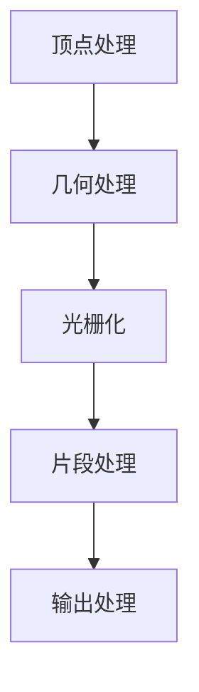

                 

# 数学与虚拟现实：VR体验的数学优化

关键词：虚拟现实、数学优化、三维几何、计算机图形学、交互设计、用户体验

摘要：本文深入探讨了数学在虚拟现实（VR）体验优化中的应用。从VR技术的发展、数学原理的介绍，到数学优化在VR中的具体应用，再到VR内容的优化策略和心理学影响，本文旨在为读者提供一份全面且深入的VR数学优化指南。通过结合实际案例和代码实现，读者可以更好地理解数学优化如何提升VR体验的质量和沉浸感。

## 第1章 引言

### 1.1 VR技术的发展

虚拟现实（Virtual Reality，简称VR）技术自20世纪80年代问世以来，已经经历了数十年的发展。从最初的简单头戴式显示器，到如今的高清沉浸式体验，VR技术不断革新，逐渐渗透到游戏、教育、医疗、军事等多个领域。现代VR系统的核心在于为用户提供一种沉浸式的体验，让用户仿佛置身于一个完全虚拟的环境中。这一目标的实现离不开先进的硬件和软件技术。

#### 硬件技术的进步

硬件技术的进步为VR体验的提升奠定了基础。目前，高端VR头戴设备已经能够提供高分辨率、低延迟的图像显示，使得用户能够感受到更加逼真的视觉体验。此外，运动跟踪技术的进步使得用户能够自由地在虚拟环境中移动和交互，增强了沉浸感。

#### 软件技术的发展

在软件层面，三维建模和渲染技术、实时物理模拟技术以及自然交互技术等不断发展，使得虚拟现实场景的复杂度和互动性大大提升。例如，三维建模软件可以帮助开发者创建复杂的虚拟环境，而实时物理模拟技术则可以模拟物体间的交互和碰撞，提高场景的真实感。

### 1.2 数学在VR中的应用

数学作为一门基础科学，在虚拟现实技术的各个领域都有着广泛的应用。以下是数学在VR中的几个主要应用领域：

#### 三维几何学

三维几何学在VR中用于描述和构建虚拟环境。通过三维几何模型，开发者可以创建复杂的场景和物体，并对其进行几何变换和操作，如旋转、缩放和移动。这些操作对于实现动态交互和实时渲染至关重要。

#### 视觉感知

视觉感知是VR体验的核心。数学在视觉感知中的应用包括镜头模型、视差计算、透视变换等。通过这些数学模型，VR系统能够模拟人类视觉系统的感知过程，提供逼真的视觉体验。

#### 计算机图形学

计算机图形学是VR技术的核心组成部分。数学在计算机图形学中的应用涵盖了从基本的光照模型到复杂的纹理映射技术。通过数学算法，计算机可以生成高质量的3D图形，提升VR体验的真实感。

#### 交互设计

交互设计是VR系统的关键环节。数学在交互设计中的应用包括手势识别、语音识别和体感控制等。通过数学模型，这些交互方式可以更加自然和直观，提高用户的沉浸感。

### 1.3 书籍结构

本书将围绕VR体验的数学优化展开，分为以下几个部分：

- **第2章 虚拟现实基础**：介绍VR系统架构、硬件技术和交互设计的基本概念。
- **第3章 数学原理**：详细阐述三维几何学、视觉感知和计算机图形学的基本原理。
- **第4章 VR中的数学优化**：探讨数学优化在VR中的应用，包括优化问题的定义和优化算法。
- **第5章 3D图形渲染**：分析渲染管线、光照与阴影以及纹理映射技术。
- **第6章 交互式虚拟现实**：讨论虚拟现实中的交互设计、用户追踪与定位和交互式内容开发。
- **第7章 VR内容的数学优化**：提供VR内容优化的原则和算法应用。
- **第8章 虚拟现实与心理学**：分析VR体验的心理效应和认知科学。
- **第9章 未来展望**：探讨VR技术的趋势和数学优化在VR中的未来应用。

通过以上章节的逐步讲解，读者将能够全面了解数学在虚拟现实中的重要作用，掌握VR体验优化的核心技术和方法。

## 第2章 虚拟现实基础

虚拟现实（VR）作为一种沉浸式的体验技术，其实现离不开系统架构、硬件技术和交互设计等多个方面。本章将详细介绍这些基础概念，为后续章节的讨论奠定基础。

### 2.1 VR系统架构

VR系统架构可以分为以下几个层次：

1. **感知层**：包括VR头戴设备、手柄、传感器等硬件设备，用于感知用户的位置、动作和姿态。
2. **处理层**：包括计算单元、处理器和图形处理器（GPU），负责处理感知数据、渲染图像和执行交互逻辑。
3. **交互层**：包括用户输入设备（如键盘、鼠标、手势控制）和输出设备（如显示器、扬声器），用于实现用户与虚拟环境的交互。
4. **内容层**：包括虚拟场景、物体和交互逻辑，是VR体验的核心。

图1 VR系统架构的层次结构

```
+----------------+     +-------------------+     +---------------------+
|  感知层        |     |  处理层           |     |  交互层             |
+----------------+     +-------------------+     +---------------------+
| VR头戴设备     |     | 计算单元、GPU     |     | 用户输入设备、输出设备 |
+----------------+     +-------------------+     +---------------------+
```

### 2.2 VR硬件技术

VR硬件技术的发展是VR体验提升的关键。以下是几种关键的VR硬件技术：

1. **头戴显示器（HMD）**：头戴显示器是VR体验的核心设备，目前主要分为两类：头盔式和眼镜式。它们通常具有高分辨率、低延迟和高刷新率等特点，以提高用户的视觉体验。

2. **运动传感器**：运动传感器用于跟踪用户的位置和动作。常见的运动传感器包括惯性测量单元（IMU）、光学跟踪器和雷达。这些传感器可以实时地捕捉用户的动作，并将其转换为虚拟环境中的操作。

3. **手柄控制器**：手柄控制器是用户与虚拟环境交互的重要工具。它们通常带有多个按钮和触发器，以及内置的运动传感器，以模拟真实世界的交互。

4. **全身传感器**：全身传感器用于捕捉用户全身的动作，实现更加自由的交互。这些传感器包括全身追踪服、手套和足部传感器等。

### 2.3 VR交互设计

VR交互设计是确保用户能够自然地与虚拟环境交互的关键。以下是几种常见的VR交互设计方法：

1. **手势识别**：手势识别是通过计算机视觉技术捕捉用户的手部动作，并将其转换为虚拟环境中的交互操作。手势识别可以实现自然、直观的交互方式。

2. **语音交互**：语音交互是通过语音识别技术将用户的语音命令转换为虚拟环境中的操作。语音交互可以减少用户操作的复杂性，提高交互效率。

3. **体感控制**：体感控制是通过捕捉用户全身动作来控制虚拟环境中的物体和场景。体感控制可以实现更加自由和沉浸的交互体验。

4. **触摸反馈**：触摸反馈是通过触觉传感器提供触觉反馈，增强用户的沉浸感。触摸反馈可以模拟真实世界的触感，提高VR体验的真实感。

图2 VR交互设计示例

```
+-------------------------------------+
|       手势识别                     |
|             /\                      |
|            /  \                     |
|           /    \                    |
|          /      \                   |
|         /        \                  |
|        /          \                 |
|       /            \                |
|      /              \               |
+-------------------------------------+
          |                    |
          |                    |
          |                    |
          |                    |
          |                    |
+-------------------------+    +----------------+
|      语音交互           |    |      体感控制    |
+-------------------------+    +----------------+
          |                    |
          |                    |
          |                    |
          |                    |
          |                    |
+-------------------------------------+
           |                      |
           |                      |
           |                      |
           |                      |
           |                      |
+-------------------------------------+
       |                         |
       |                         |
       |                         |
       |                         |
       |                         |
+-------------------------+    +----------------+
|      触摸反馈           |    |     全身传感器   |
+-------------------------+    +----------------+
```

通过系统架构、硬件技术和交互设计的综合应用，VR技术可以为用户提供一种沉浸式的虚拟体验。本章的介绍为后续章节的深入探讨奠定了基础。

## 第3章 数学原理

数学在虚拟现实（VR）技术中扮演着至关重要的角色，贯穿于VR系统的各个方面。本章将详细介绍VR中涉及的主要数学原理，包括三维几何学、视觉感知和计算机图形学，以及它们在VR技术中的应用。

### 3.1 三维几何学

三维几何学是构建虚拟环境的基础，涉及到点、线、面、体等几何元素的定义和操作。以下是三维几何学在VR中的重要应用：

#### 点和向量

点（Point）是三维空间中的一个位置，通常用三维坐标（x, y, z）表示。向量（Vector）则描述了方向和长度，用于表示两点之间的相对位置或方向。例如，向量 \(\vec{AB}\) 表示从点A到点B的向量。

```python
# Python代码示例：表示三维空间中的点
point_A = (1, 2, 3)
point_B = (4, 5, 6)
vector_AB = (point_B[0] - point_A[0], point_B[1] - point_A[1], point_B[2] - point_A[2])
```

#### 几何变换

几何变换是指对点、线、面等几何元素进行旋转、缩放、平移等操作。在VR中，几何变换用于实现用户在虚拟环境中的移动、旋转和缩放等操作。

```python
# Python代码示例：几何变换中的平移
def translate(point, vector):
    return (point[0] + vector[0], point[1] + vector[1], point[2] + vector[2])

# 应用平移操作
translated_point = translate(point_A, vector_AB)
```

#### 空间坐标系

空间坐标系是描述三维空间中点位置的基础。常见的空间坐标系包括直角坐标系、柱坐标系和球坐标系。

```python
# Python代码示例：直角坐标系到球坐标系的转换
import math

def convert_to_spherical_coordinates(x, y, z):
    r = math.sqrt(x**2 + y**2 + z**2)
    theta = math.atan2(y, x)
    phi = math.acos(z / r)
    return (r, theta, phi)

spherical_coordinates = convert_to_spherical_coordinates(*point_A)
```

#### 几何建模

几何建模是通过几何元素构建复杂的虚拟场景。在VR中，几何建模技术如三维建模软件（如Blender、Maya）被广泛应用于创建复杂的场景和物体。

### 3.2 视觉感知

视觉感知是VR体验的核心，涉及到如何模拟人类视觉系统的感知过程，以提供逼真的视觉体验。以下是视觉感知中涉及的几个关键数学原理：

#### 镜头模型

镜头模型（Camera Model）用于描述相机如何捕捉三维空间中的场景。镜头模型包括正射投影、透视投影等。

```python
# Python代码示例：正射投影
def orthographic_projection(point, camera_position, camera_direction):
    return [point[0] - camera_direction[0], point[1] - camera_direction[1], point[2] - camera_direction[2]]

projected_point = orthographic_projection(point_A, camera_position, camera_direction)
```

#### 视差计算

视差（Parallax）是指由于观察者视角的变化导致的图像差异。视差计算用于模拟真实世界的视觉感知，提高VR场景的真实感。

```python
# Python代码示例：视差计算
def calculate_parallax(point_on_model, point_on_viewplane, camera_position):
    # 计算视差向量
    parallax_vector = (point_on_viewplane[0] - point_on_model[0], 
                       point_on_viewplane[1] - point_on_model[1], 
                       point_on_viewplane[2] - point_on_model[2])
    return parallax_vector
```

#### 透视变换

透视变换（Perspective Transformation）是将三维空间中的点投影到二维视图平面上的过程，用于模拟人类视觉系统的透视效果。

```python
# Python代码示例：透视变换
def perspective_projection(point, camera_position, camera_fov, aspect_ratio):
    # 计算透视变换后的点
    # (这里简化了透视变换的公式)
    perspective_coefficient = 1 / (1 + (point[2] - camera_position[2]) * (1 / camera_fov))
    projected_point = (perspective_coefficient * point[0], perspective_coefficient * point[1])
    return projected_point
```

#### 视角计算

视角计算（Viewpoint Calculation）是确定用户在虚拟环境中的视角位置。视角计算通常涉及到用户的位置、方向和虚拟场景的结构。

```python
# Python代码示例：视角计算
def calculate_viewpoint(user_position, user_orientation, target_position):
    # 计算用户视角方向
    orientation_vector = (target_position[0] - user_position[0], target_position[1] - user_position[1], target_position[2] - user_position[2])
    # 计算视角位置
    viewpoint = (user_position[0] + orientation_vector[0], user_position[1] + orientation_vector[1], user_position[2] + orientation_vector[2])
    return viewpoint
```

### 3.3 计算机图形学

计算机图形学是VR技术的核心组成部分，涉及到图像生成、渲染和显示等多个方面。以下是计算机图形学中涉及的几个关键数学原理：

#### 光照模型

光照模型（Lighting Model）用于模拟光线在虚拟环境中的传播和反射，为场景提供逼真的光照效果。常见的光照模型包括朗伯光照模型、菲涅尔光照模型和贝塞尔光照模型。

```python
# Python代码示例：朗伯光照模型
def lambert_lighting(model_color, light_direction, material_roughness):
    dot_product = sum([model_color[i] * light_direction[i] for i in range(3)])
    return dot_product * material_roughness
```

#### 纹理映射

纹理映射（Texture Mapping）是将二维纹理图像映射到三维物体表面，以提供细节和真实感。纹理映射技术包括正方形映射、圆柱映射和球映射等。

```python
# Python代码示例：正方形纹理映射
def square_texture_mapping(texture_coordinates, texture_image):
    u, v = texture_coordinates
    pixel_color = texture_image[int(u * texture_image.shape[0]), int(v * texture_image.shape[1])]
    return pixel_color
```

#### 渲染管线

渲染管线（Rendering Pipeline）是计算机图形学中用于生成和显示图像的一系列步骤。渲染管线包括几何处理、光照处理、纹理处理和输出处理等阶段。

```python
# Python代码示例：渲染管线中的几何处理
def render_geometry(geometric_objects, camera_position, camera_orientation):
    # 对每个几何对象执行几何处理
    for object in geometric_objects:
        # 计算模型矩阵
        model_matrix = calculate_model_matrix(object)
        # 计算视图矩阵
        view_matrix = calculate_view_matrix(camera_position, camera_orientation)
        # 应用变换
        transformed_points = apply_transformations(model_matrix, view_matrix, object.points)
    return transformed_points
```

通过介绍三维几何学、视觉感知和计算机图形学的数学原理，本章为读者提供了构建和优化虚拟现实体验的理论基础。在后续章节中，我们将进一步探讨这些原理在实际VR应用中的实现和优化方法。

### 3.3 计算机图形学

计算机图形学是虚拟现实（VR）技术中不可或缺的一部分，它涉及到图像生成、渲染和显示等多个方面。以下是计算机图形学中的一些核心原理和算法。

#### 渲染管线

渲染管线（Rendering Pipeline）是计算机图形学中的一个核心概念，它描述了图像从场景中生成并最终显示在屏幕上的整个过程。渲染管线通常包括以下阶段：

1. **顶点处理（Vertex Processing）**：在这个阶段，顶点属性（如位置、颜色、纹理坐标等）被处理。顶点处理通常涉及到顶点着色器（Vertex Shader），它对每个顶点执行自定义操作。

2. **几何处理（Geometry Processing）**：几何处理阶段负责处理几何对象的生成和变换。在这个阶段，几何着色器（Geometry Shader）可以对几何对象执行自定义操作，如生成新的顶点或面。

3. **光栅化（Rasterization）**：光栅化阶段将几何对象转换为屏幕上的像素。这个过程涉及到顶点的插值、裁剪和投影。

4. **片段处理（Fragment Processing）**：片段处理阶段负责处理像素的颜色和光照。在这个阶段，片段着色器（Fragment Shader）可以对每个片段执行自定义操作，如光照计算、纹理采样等。

5. **输出处理（Output Processing）**：输出处理阶段将片段的颜色输出到帧缓冲区（Frame Buffer），并最终显示在屏幕上。

以下是一个简化的渲染管线流程的Mermaid流程图：



#### 光照与阴影

光照与阴影是计算机图形学中的重要概念，用于模拟真实世界中的光照效果。以下是几种常见的光照和阴影技术：

1. **朗伯光照模型（Lambertian Lighting）**：朗伯光照模型假设光线均匀地散射在物体表面。它通过计算光线方向与物体表面的点积来计算光照强度。

   ```python
   # Python代码示例：朗伯光照模型
   def lambert_lighting(model_color, light_direction, material_roughness):
       dot_product = sum([model_color[i] * light_direction[i] for i in range(3)])
       return dot_product * material_roughness
   ```

2. **菲涅尔光照模型（Fresnel Lighting）**：菲涅尔光照模型考虑了光线在不同表面材质上的反射特性。它通过计算光线入射角和反射角的余弦值来调整光照强度。

   ```python
   # Python代码示例：菲涅尔光照模型
   def fresnel_lighting(model_color, light_direction, normal_vector, roughness):
       cos_angle = max([light_direction[i] * normal_vector[i] for i in range(3)], 0)
       return cos_angle ** roughness
   ```

3. **软阴影（Soft Shadows）**：软阴影通过模糊阴影边缘来模拟真实世界的光照效果。软阴影可以通过光线追踪或阴影映射等技术实现。

   ```python
   # Python代码示例：软阴影
   def soft_shadows(light_position, shadow_map, depth_texture, depth_buffer):
       shadow_intensity = compare_depth(light_position, shadow_map, depth_texture, depth_buffer)
       return 1 - shadow_intensity
   ```

4. **硬阴影（Hard Shadows）**：硬阴影具有明确的边缘，通常通过投影纹理或简单的几何阴影来实现。

   ```python
   # Python代码示例：硬阴影
   def hard_shadows(light_direction, depth_map, depth_buffer):
       shadow_intensity = compare_depth(light_direction, depth_map, depth_buffer)
       return 1 - shadow_intensity
   ```

#### 纹理映射

纹理映射是将二维纹理图像映射到三维物体表面的技术。纹理映射可以提供细节和真实感，使物体看起来更加逼真。以下是几种常见的纹理映射技术：

1. **正方形映射（Planar Mapping）**：正方形映射是最简单的纹理映射技术，它将纹理图像直接投影到物体表面。

   ```python
   # Python代码示例：正方形纹理映射
   def square_texture_mapping(texture_coordinates, texture_image):
       u, v = texture_coordinates
       pixel_color = texture_image[int(u * texture_image.shape[0]), int(v * texture_image.shape[1])]
       return pixel_color
   ```

2. **圆柱映射（Cylinder Mapping）**：圆柱映射将纹理图像沿圆柱体表面展开，适用于圆柱形或类似形状的物体。

   ```python
   # Python代码示例：圆柱纹理映射
   def cylinder_texture_mapping(texture_coordinates, texture_image, cylinder_radius):
       u, v = texture_coordinates
       theta = 2 * math.pi * u
       x = (cylinder_radius * math.cos(theta))
       y = (cylinder_radius * math.sin(theta))
       pixel_color = texture_image[int(y * texture_image.shape[0]), int(x * texture_image.shape[1])]
       return pixel_color
   ```

3. **球映射（Spherical Mapping）**：球映射将纹理图像映射到球体表面，适用于球体或类似形状的物体。

   ```python
   # Python代码示例：球纹理映射
   def spherical_texture_mapping(texture_coordinates, texture_image, sphere_radius):
       u, v = texture_coordinates
       theta = 2 * math.pi * u
       phi = math.pi * (1 - v)
       x = (sphere_radius * math.cos(phi) * math.cos(theta))
       y = (sphere_radius * math.cos(phi) * math.sin(theta))
       z = (sphere_radius * math.sin(phi))
       pixel_color = texture_image[int(z * texture_image.shape[0]), int(y * texture_image.shape[1])]
       return pixel_color
   ```

通过介绍渲染管线、光照与阴影以及纹理映射技术，本章为读者提供了计算机图形学中的一些核心原理和算法。这些原理和算法在虚拟现实（VR）技术中发挥着至关重要的作用，使得VR体验更加真实和沉浸。

### 4.1 优化问题的定义

在虚拟现实（VR）中，优化问题的定义至关重要，它涉及到如何通过数学方法和算法改进VR系统的性能和用户体验。优化问题通常可以表示为一个目标函数和一组约束条件，目的是找到一组解，使得目标函数取得最优值。

#### 目标函数

目标函数是优化问题中的核心，它定义了优化过程中要最大化或最小化的量。在VR中，常见的目标函数包括：

- **图像质量**：优化图像的清晰度和细节，减少锯齿和失真。
- **交互性能**：优化用户交互的响应速度和准确性，提高系统的流畅性。
- **资源利用率**：优化系统资源的分配和使用，提高系统的效率和稳定性。

例如，一个简单的图像质量优化目标函数可以是：

$$
\min \sum_{i=1}^{n} \sum_{j=1}^{m} (I_{original}(i, j) - I_{rendered}(i, j))^2
$$

其中，$I_{original}$ 表示原始图像，$I_{rendered}$ 表示渲染后的图像，$n$ 和 $m$ 分别表示图像的宽度和高度。

#### 约束条件

约束条件是优化问题中的限制条件，它定义了优化过程中需要遵守的限制。在VR中，常见的约束条件包括：

- **计算资源限制**：系统中的CPU、GPU和其他硬件资源的限制，需要确保优化后的解决方案在给定资源下能够正常运行。
- **内存限制**：系统内存的容量限制，需要优化内存的使用，避免内存溢出。
- **性能要求**：系统在特定时间内的响应时间、帧率和处理能力等性能要求。

例如，一个简单的计算资源约束条件可以是：

$$
CPU_{used} \leq CPU_{limit}
$$

其中，$CPU_{used}$ 表示系统当前的CPU使用率，$CPU_{limit}$ 表示系统允许的最大CPU使用率。

#### 模型表示

优化问题可以通过数学模型表示为一个约束优化问题：

$$
\min f(x) \\
s.t. g_i(x) \leq 0, \quad h_j(x) = 0
$$

其中，$x$ 是优化变量，$f(x)$ 是目标函数，$g_i(x)$ 是不等式约束，$h_j(x)$ 是等式约束。

在VR中，优化模型通常涉及到多个方面，例如：

- **图像渲染优化**：优化渲染过程，减少渲染时间，提高图像质量。
- **交互性能优化**：优化用户交互的响应速度和准确性，提高系统的流畅性。
- **场景布局优化**：优化场景的布局，提高用户的沉浸感和互动性。

例如，一个典型的图像渲染优化模型可以是：

$$
\min \sum_{i=1}^{n} \sum_{j=1}^{m} (I_{original}(i, j) - I_{rendered}(i, j))^2 \\
s.t. \quad CPU_{used} \leq CPU_{limit} \\
\quad Memory_{used} \leq Memory_{limit}
$$

通过定义优化问题，我们可以为后续的优化算法提供清晰的优化目标和约束条件，从而提高VR系统的性能和用户体验。

### 4.2 优化算法基础

优化算法是解决优化问题的关键，通过数学和计算机科学的方法，寻找满足约束条件的最佳解。在虚拟现实（VR）领域，优化算法广泛应用于图像渲染、交互性能、资源管理等多个方面。以下是几种常见的优化算法及其原理：

#### 4.2.1 线性规划

线性规划（Linear Programming，简称LP）是解决线性优化问题的一种算法，其目标函数和约束条件都是线性的。线性规划可以通过单纯形法（Simplex Method）或内点法（Interior Point Method）求解。

- **目标函数**：目标函数通常是一个线性函数，形式如下：

  $$
  \min c^T x \\
  s.t. Ax \leq b \\
  x \geq 0
  $$

  其中，$c$ 是系数向量，$x$ 是变量向量，$A$ 是约束矩阵，$b$ 是约束向量。

- **算法原理**：单纯形法通过迭代过程，从初始可行解出发，逐步移动到最优解。内点法则通过求解优化问题的对偶问题，找到最优解。

#### 4.2.2 非线性规划

非线性规划（Nonlinear Programming，简称NLP）是解决非线性优化问题的一种算法，其目标函数和/或约束条件是非线性的。常见的NLP算法包括梯度下降法（Gradient Descent）和牛顿法（Newton's Method）。

- **目标函数**：目标函数通常是一个非线性函数，形式如下：

  $$
  \min f(x) \\
  s.t. g(x) \leq 0, \quad h(x) = 0
  $$

  其中，$f(x)$ 是目标函数，$g(x)$ 是不等式约束，$h(x)$ 是等式约束。

- **算法原理**：梯度下降法通过沿着目标函数的梯度方向逐步迭代，寻找最优解。牛顿法则通过求解目标函数的一阶和二阶导数，找到最优解。

#### 4.2.3 粒子群优化

粒子群优化（Particle Swarm Optimization，简称PSO）是一种基于群体智能的优化算法，适用于求解复杂的优化问题。

- **目标函数**：PSO的目标函数通常是一个多峰函数，形式如下：

  $$
  \min f(x)
  $$

  其中，$x$ 是变量向量。

- **算法原理**：PSO模拟鸟群觅食行为，通过多个粒子的全局和局部搜索，逐步找到最优解。每个粒子都有一个位置和速度，通过更新位置和速度，粒子在搜索空间中迭代，直至找到最优解。

#### 4.2.4 神经网络

神经网络（Neural Networks）是模拟人脑神经元连接和计算的一种算法，广泛应用于优化和机器学习领域。

- **目标函数**：神经网络的输出通常是一个连续的函数，形式如下：

  $$
  \min \sum_{i=1}^{n} (y_i - \hat{y}_i)^2
  $$

  其中，$y_i$ 是真实值，$\hat{y}_i$ 是预测值。

- **算法原理**：神经网络通过多层神经元之间的连接和激活函数，逐步学习输入和输出之间的映射关系。通过反向传播算法，神经网络能够调整权重，优化目标函数。

#### 4.2.5 混合优化算法

混合优化算法结合了不同算法的优点，以提高优化效果。例如，将线性规划和神经网络结合，可以同时考虑线性约束和非线性优化。

通过介绍这些优化算法，本章为读者提供了丰富的优化工具，可以在VR系统中实现性能和用户体验的优化。在后续章节中，我们将结合实际VR应用，探讨这些优化算法的具体应用和实现。

### 4.3 VR中的应用实例

数学优化在虚拟现实（VR）中的应用广泛且深远，从图像渲染优化、交互性能提升到资源管理，都在不断改进VR体验。以下是一些具体的优化实例，展示了数学优化如何在实际VR应用中发挥作用。

#### 4.3.1 图像渲染优化

图像渲染优化是VR系统中至关重要的一环，直接影响用户体验。以下是一个基于光线追踪的图像渲染优化实例：

**问题背景**：在复杂的VR场景中，光线追踪渲染能够提供高质量的真实感图像，但计算成本高昂，可能导致渲染时间过长和性能下降。

**解决方案**：

1. **约束条件**：优化过程中需要考虑以下约束条件：
   - 计算资源限制：确保渲染过程不会超过系统CPU和GPU的计算能力。
   - 帧率要求：保持每秒至少60帧，以保证流畅的视觉效果。

2. **目标函数**：目标函数为最小化渲染时间，同时最大化图像质量。

   $$
   \min \sum_{i=1}^{n} \sum_{j=1}^{m} (I_{original}(i, j) - I_{rendered}(i, j))^2 \\
   s.t. \quad CPU_{used} \leq CPU_{limit} \\
   \quad GPU_{used} \leq GPU_{limit} \\
   \quad \text{frame rate} \geq 60 \text{fps}
   $$

3. **优化算法**：采用混合优化算法，结合线性规划和神经网络，优化渲染参数。

4. **具体步骤**：

   - **步骤1**：利用线性规划优化光线追踪算法中的采样率，平衡计算时间和图像质量。
   - **步骤2**：利用神经网络训练模型，自动调整光线追踪参数，提高渲染效率。

**代码实现**（Python示例）：

```python
import numpy as np

# 假设存在一个优化函数 optimize_rendering_params，用于优化渲染参数
def optimize_rendering_params(parameters):
    # 应用线性规划和神经网络优化渲染参数
    optimized_params = optimize_params(parameters)
    return optimized_params

# 渲染函数
def render_scene(optimized_params):
    # 使用优化后的参数渲染场景
    rendered_image = render(optimized_params)
    return rendered_image

# 假设优化后的渲染参数为
optimized_params = optimize_rendering_params(initial_params)
rendered_image = render_scene(optimized_params)
```

#### 4.3.2 交互性能优化

VR交互性能优化主要关注用户在虚拟环境中的操作响应速度和准确性，以下是一个交互性能优化的实例：

**问题背景**：在复杂的VR场景中，用户的交互操作（如手势识别、语音控制等）可能导致系统响应延迟，影响用户体验。

**解决方案**：

1. **约束条件**：优化过程中需要考虑以下约束条件：
   - 交互延迟要求：确保用户交互操作的响应时间不超过20ms。
   - 计算资源限制：确保系统CPU和GPU资源不会因交互操作而超负荷。

2. **目标函数**：目标函数为最小化交互延迟，同时最大化交互准确性。

   $$
   \min \sum_{i=1}^{n} (T_{response,i} - T_{required})^2 \\
   s.t. \quad CPU_{used} \leq CPU_{limit} \\
   \quad GPU_{used} \leq GPU_{limit}
   $$

3. **优化算法**：采用粒子群优化算法，调整交互处理参数，提高系统响应速度。

4. **具体步骤**：

   - **步骤1**：通过粒子群优化调整交互处理算法中的参数，如识别阈值、处理速率等。
   - **步骤2**：实时监测交互延迟，动态调整优化参数，以适应不同场景下的交互需求。

**代码实现**（Python示例）：

```python
import numpy as np

# 假设存在一个优化函数 optimize_interactive_params，用于优化交互参数
def optimize_interactive_params(parameters):
    # 应用粒子群优化优化交互参数
    optimized_params = pso_optimize_params(parameters)
    return optimized_params

# 交互函数
def handle_user_interaction(optimized_params):
    # 使用优化后的参数处理用户交互
    response = handle_interaction(optimized_params)
    return response

# 假设优化后的交互参数为
optimized_params = optimize_interactive_params(initial_params)
response = handle_user_interaction(optimized_params)
```

#### 4.3.3 资源管理优化

VR系统的资源管理优化旨在提高系统资源的利用率，确保系统在各种负载下的稳定运行。以下是一个资源管理优化的实例：

**问题背景**：在运行复杂的VR应用时，系统资源（如CPU、GPU、内存等）可能不足，导致系统性能下降或崩溃。

**解决方案**：

1. **约束条件**：优化过程中需要考虑以下约束条件：
   - 资源利用率：确保系统资源被有效利用，避免资源浪费。
   - 稳定性要求：确保系统在高负载下稳定运行。

2. **目标函数**：目标函数为最大化资源利用率，同时确保系统稳定性。

   $$
   \max \frac{CPU_{used}}{CPU_{limit}} + \frac{GPU_{used}}{GPU_{limit}} + \frac{Memory_{used}}{Memory_{limit}} \\
   s.t. \quad \text{系统稳定性指标} \geq \text{阈值}
   $$

3. **优化算法**：采用基于遗传算法的优化策略，调整系统资源分配策略。

4. **具体步骤**：

   - **步骤1**：通过遗传算法优化系统资源分配策略，确保资源在各个应用之间公平分配。
   - **步骤2**：实时监测系统资源使用情况，动态调整优化策略，以适应负载变化。

**代码实现**（Python示例）：

```python
import numpy as np

# 假设存在一个优化函数 optimize_resource_allocation，用于优化资源分配
def optimize_resource_allocation(parameters):
    # 应用遗传算法优化资源分配参数
    optimized_params = ga_optimize_params(parameters)
    return optimized_params

# 资源管理函数
def manage_system_resources(optimized_params):
    # 使用优化后的参数管理系统资源
    resource_usage = manage_resources(optimized_params)
    return resource_usage

# 假设优化后的资源分配参数为
optimized_params = optimize_resource_allocation(initial_params)
resource_usage = manage_system_resources(optimized_params)
```

通过以上实例，可以看出数学优化在虚拟现实（VR）中的应用如何提升系统性能和用户体验。在后续章节中，我们将继续探讨VR内容的数学优化策略和实际案例。

### 第5章 3D图形渲染

3D图形渲染是虚拟现实（VR）技术的核心组成部分，它决定了虚拟环境中的图像质量和沉浸感。本章将详细介绍3D图形渲染的基本流程、关键技术和实际应用。

#### 5.1 渲染管线

渲染管线（Rendering Pipeline）是3D图形渲染的核心概念，它描述了图像从场景中生成并最终显示在屏幕上的整个过程。渲染管线通常包括以下几个主要阶段：

1. **顶点处理（Vertex Processing）**：顶点处理阶段负责处理顶点属性（如位置、颜色、纹理坐标等）。在这个阶段，顶点着色器（Vertex Shader）对每个顶点执行自定义操作。

2. **几何处理（Geometry Processing）**：几何处理阶段负责处理几何对象的生成和变换。在这个阶段，几何着色器（Geometry Shader）可以对几何对象执行自定义操作，如生成新的顶点或面。

3. **光栅化（Rasterization）**：光栅化阶段将几何对象转换为屏幕上的像素。这个过程涉及到顶点的插值、裁剪和投影。

4. **片段处理（Fragment Processing）**：片段处理阶段负责处理像素的颜色和光照。在这个阶段，片段着色器（Fragment Shader）可以对每个片段执行自定义操作，如光照计算、纹理采样等。

5. **输出处理（Output Processing）**：输出处理阶段将片段的颜色输出到帧缓冲区（Frame Buffer），并最终显示在屏幕上。

以下是一个简化的渲染管线流程的Mermaid流程图：


#### 5.2 光照与阴影

光照与阴影是3D图形渲染中的重要概念，用于模拟真实世界中的光照效果。以下是几种常见的光照和阴影技术：

1. **朗伯光照模型（Lambertian Lighting）**：朗伯光照模型假设光线均匀地散射在物体表面。它通过计算光线方向与物体表面的点积来计算光照强度。

   ```python
   # Python代码示例：朗伯光照模型
   def lambert_lighting(model_color, light_direction, material_roughness):
       dot_product = sum([model_color[i] * light_direction[i] for i in range(3)])
       return dot_product * material_roughness
   ```

2. **菲涅尔光照模型（Fresnel Lighting）**：菲涅尔光照模型考虑了光线在不同表面材质上的反射特性。它通过计算光线入射角和反射角的余弦值来调整光照强度。

   ```python
   # Python代码示例：菲涅尔光照模型
   def fresnel_lighting(model_color, light_direction, normal_vector, roughness):
       cos_angle = max([light_direction[i] * normal_vector[i] for i in range(3)], 0)
       return cos_angle ** roughness
   ```

3. **软阴影（Soft Shadows）**：软阴影通过模糊阴影边缘来模拟真实世界的光照效果。软阴影可以通过光线追踪或阴影映射等技术实现。

   ```python
   # Python代码示例：软阴影
   def soft_shadows(light_position, shadow_map, depth_texture, depth_buffer):
       shadow_intensity = compare_depth(light_position, shadow_map, depth_texture, depth_buffer)
       return 1 - shadow_intensity
   ```

4. **硬阴影（Hard Shadows）**：硬阴影具有明确的边缘，通常通过投影纹理或简单的几何阴影来实现。

   ```python
   # Python代码示例：硬阴影
   def hard_shadows(light_direction, depth_map, depth_buffer):
       shadow_intensity = compare_depth(light_direction, depth_map, depth_buffer)
       return 1 - shadow_intensity
   ```

#### 5.3 纹理映射

纹理映射是将二维纹理图像映射到三维物体表面的技术。纹理映射可以提供细节和真实感，使物体看起来更加逼真。以下是几种常见的纹理映射技术：

1. **正方形映射（Planar Mapping）**：正方形映射是最简单的纹理映射技术，它将纹理图像直接投影到物体表面。

   ```python
   # Python代码示例：正方形纹理映射
   def square_texture_mapping(texture_coordinates, texture_image):
       u, v = texture_coordinates
       pixel_color = texture_image[int(u * texture_image.shape[0]), int(v * texture_image.shape[1])]
       return pixel_color
   ```

2. **圆柱映射（Cylinder Mapping）**：圆柱映射将纹理图像沿圆柱体表面展开，适用于圆柱形或类似形状的物体。

   ```python
   # Python代码示例：圆柱纹理映射
   def cylinder_texture_mapping(texture_coordinates, texture_image, cylinder_radius):
       u, v = texture_coordinates
       theta = 2 * math.pi * u
       x = (cylinder_radius * math.cos(theta))
       y = (cylinder_radius * math.sin(theta))
       pixel_color = texture_image[int(y * texture_image.shape[0]), int(x * texture_image.shape[1])]
       return pixel_color
   ```

3. **球映射（Spherical Mapping）**：球映射将纹理图像映射到球体表面，适用于球体或类似形状的物体。

   ```python
   # Python代码示例：球纹理映射
   def spherical_texture_mapping(texture_coordinates, texture_image, sphere_radius):
       u, v = texture_coordinates
       theta = 2 * math.pi * u
       phi = math.pi * (1 - v)
       x = (sphere_radius * math.cos(phi) * math.cos(theta))
       y = (sphere_radius * math.cos(phi) * math.sin(theta))
       z = (sphere_radius * math.sin(phi))
       pixel_color = texture_image[int(z * texture_image.shape[0]), int(y * texture_image.shape[1])]
       return pixel_color
   ```

#### 5.4 实际应用

3D图形渲染在VR中的应用非常广泛，以下是一些实际应用场景：

1. **游戏**：VR游戏通常需要高质量的3D图形渲染，以提供沉浸式的游戏体验。通过优化渲染管线、光照和阴影技术，可以显著提高游戏画面质量和性能。

2. **教育**：在虚拟实验室和虚拟课堂中，3D图形渲染技术可以创建逼真的实验设备和场景，帮助学生更好地理解和学习。

3. **医疗**：在医学成像和手术模拟中，3D图形渲染技术可以创建详细的器官和手术场景，帮助医生进行术前规划和训练。

4. **设计**：在建筑设计、工业设计和时装设计等领域，3D图形渲染技术可以创建逼真的模型和场景，用于展示和评估设计效果。

通过介绍3D图形渲染的基本流程、关键技术和实际应用，本章为读者提供了对VR图形渲染的全面了解。在后续章节中，我们将继续探讨VR中的交互式内容和用户体验优化。

### 第6章 交互式虚拟现实

交互式虚拟现实（Interactive Virtual Reality，简称IVR）是VR技术的重要组成部分，它使得用户能够与虚拟环境进行自然、直观的交互。本章将详细介绍虚拟现实中的交互设计、用户追踪与定位以及交互式内容开发，探讨如何通过这些技术提升用户的沉浸感和体验。

#### 6.1 虚拟现实中的交互设计

交互设计是IVR的核心，它关注如何让用户在虚拟环境中进行有效的交互。以下是交互设计的关键要素：

1. **手势识别**：手势识别技术通过计算机视觉算法捕捉用户的手部动作，并将其转换为虚拟环境中的交互操作。手势识别可以支持多种手势，如点击、拖拽、旋转等。

2. **语音交互**：语音交互技术通过语音识别和自然语言处理技术，将用户的语音指令转换为虚拟环境中的操作。语音交互可以减少用户的操作复杂性，提高交互效率。

3. **体感控制**：体感控制技术通过捕捉用户全身动作，实现自由、沉浸式的交互体验。常见的体感控制设备包括手柄、手套和全身追踪服等。

4. **触摸反馈**：触摸反馈技术通过触觉传感器为用户提供触觉反馈，增强用户的沉浸感。触摸反馈可以模拟真实世界的触感，提高交互的真实性。

以下是一个基于手势识别的交互设计实例：

**问题背景**：设计一个虚拟现实中的手势识别系统，支持点击、拖拽和旋转等基本操作。

**解决方案**：

1. **目标函数**：目标函数为最小化用户操作误差，最大化交互流畅性。

   $$
   \min \sum_{i=1}^{n} (error_i)^2 \\
   s.t. \quad \text{response time} \leq \text{threshold}
   $$

2. **优化算法**：采用机器学习算法，如支持向量机（SVM），对用户手势进行分类和识别。

3. **具体步骤**：

   - **步骤1**：收集用户手势数据，训练SVM模型，优化手势识别准确性。
   - **步骤2**：实时监测用户手势，调用SVM模型进行手势识别，执行相应操作。

**代码实现**（Python示例）：

```python
from sklearn import svm

# 假设存在一个手势识别函数 gesture_recognition，用于识别用户手势
def gesture_recognition(data):
    # 使用SVM模型进行手势识别
    recognized_gesture = model.predict(data)
    return recognized_gesture

# 假设用户输入为手势数据
user_gesture = get_user_gesture()
recognized_gesture = gesture_recognition(user_gesture)
perform_action(recognized_gesture)
```

#### 6.2 用户追踪与定位

用户追踪与定位是IVR中的关键技术，它确保用户在虚拟环境中的位置和动作得到准确捕捉。以下是用户追踪与定位的关键要素：

1. **惯性测量单元（IMU）**：IMU包括加速度计、陀螺仪和磁力计，用于捕捉用户的位置、速度和方向。IMU常用于头戴式显示器和手柄控制器。

2. **光学跟踪系统**：光学跟踪系统通过摄像头和标记物捕捉用户的位置和动作。光学跟踪系统具有高精度和高实时性，常用于复杂的VR应用。

3. **激光扫描**：激光扫描技术通过发射激光束并测量反射时间，创建虚拟环境的三维模型。激光扫描适用于大型虚拟场景的构建。

以下是一个基于光学跟踪的用户追踪与定位实例：

**问题背景**：设计一个光学跟踪系统，用于捕捉用户的头部和手部位置。

**解决方案**：

1. **目标函数**：目标函数为最小化位置误差，最大化追踪实时性。

   $$
   \min \sum_{i=1}^{n} (error_i)^2 \\
   s.t. \quad \text{response time} \leq \text{threshold}
   $$

2. **优化算法**：采用卡尔曼滤波（Kalman Filter）算法，结合多个传感器数据，优化位置和动作追踪。

3. **具体步骤**：

   - **步骤1**：安装光学跟踪设备，配置摄像头和标记物。
   - **步骤2**：实时捕捉用户头部和手部位置，应用卡尔曼滤波算法进行数据融合和优化。
   - **步骤3**：将优化后的位置数据用于虚拟环境中的交互和渲染。

**代码实现**（Python示例）：

```python
import numpy as np

# 假设存在一个卡尔曼滤波函数 kalman_filter，用于用户位置追踪
def kalman_filter measurements, model, initial_state:
    # 应用卡尔曼滤波算法进行位置追踪
    state = kalman_update(measurements, model, initial_state)
    return state

# 假设用户输入为位置测量数据
measurements = get_measurements()
initial_state = np.array([0, 0, 0])
tracked_state = kalman_filter(measurements, model, initial_state)
update_virtual_environment(tracked_state)
```

#### 6.3 交互式内容开发

交互式内容开发是IVR的重要组成部分，它涉及创建和设计虚拟环境中的交互元素。以下是交互式内容开发的关键要素：

1. **虚拟环境设计**：虚拟环境的设计需要考虑用户体验和交互需求，创建一个逼真的虚拟场景。

2. **交互元素设计**：交互元素的设计包括按钮、菜单、工具等，它们需要支持用户在虚拟环境中的操作。

3. **脚本编写**：脚本用于定义虚拟环境中的交互逻辑和操作，通过脚本可以实现复杂的交互场景和动画效果。

以下是一个基于脚本的交互式内容开发实例：

**问题背景**：设计一个虚拟现实中的互动展览，用户可以点击展品查看详细信息。

**解决方案**：

1. **目标函数**：目标函数为最大化用户交互体验，最小化用户操作难度。

   $$
   \max \sum_{i=1}^{n} (user\_satisfaction_i) \\
   s.t. \quad \text{user\_actions} \leq \text{threshold}
   $$

2. **优化算法**：采用用户体验优化算法，如行为分析模型，优化交互界面和操作流程。

3. **具体步骤**：

   - **步骤1**：设计虚拟展览的布局和交互界面，确保用户能够轻松操作。
   - **步骤2**：编写脚本定义交互逻辑，如点击事件处理、动画效果等。
   - **步骤3**：测试和优化交互界面，确保用户满意度达到最高。

**代码实现**（Python示例）：

```python
def handle_click(event):
    # 处理点击事件
    if event.target == 'exhibit':
        show_exhibit_details()
    else:
        hide_exhibit_details()

# 假设用户点击了展品
user_click = get_user_click()
handle_click(user_click)
```

通过介绍交互设计、用户追踪与定位以及交互式内容开发，本章为读者提供了IVR技术的基本概念和实现方法。在后续章节中，我们将继续探讨VR内容的数学优化策略和实际案例。

### 第7章 VR内容的数学优化

虚拟现实（VR）内容的优化是提升用户体验的关键。通过数学优化，可以显著改善VR内容的质量和沉浸感。本章将介绍VR内容优化的原则和策略，并结合实际案例，探讨如何通过数学方法优化VR内容。

#### 7.1 内容优化原则

VR内容优化应遵循以下原则：

1. **用户体验优先**：优化应首先考虑用户的沉浸感和满意度，确保虚拟环境中的交互体验流畅、直观。
2. **资源高效利用**：优化应最大化利用系统资源，如CPU、GPU和内存等，确保系统在高负载下仍能稳定运行。
3. **质量与性能平衡**：优化应平衡图像质量和渲染性能，确保高质量的同时，保持流畅的帧率和响应速度。
4. **可扩展性**：优化方案应具有可扩展性，能够适应不同规模和复杂度的VR内容。

#### 7.2 优化策略

VR内容优化可以采用多种策略，以下是几种常用的优化策略：

1. **图像质量优化**：通过改进渲染算法、优化纹理映射和减少图像失真，提升图像质量。
2. **交互性能优化**：通过优化交互算法、减少延迟和提升响应速度，提高交互性能。
3. **资源管理优化**：通过优化资源分配和调度策略，提高系统资源的利用效率。
4. **内容布局优化**：通过改进场景布局、减少冗余元素和优化视觉焦点，提升用户体验。

#### 7.3 实际案例研究

以下是一个VR内容优化案例研究，展示如何通过数学方法优化VR内容。

**案例背景**：某VR游戏开发者希望优化其游戏中的视觉效果和交互性能，提高用户沉浸感和游戏体验。

**优化过程**：

1. **需求分析**：

   - 提升视觉效果：优化游戏中的纹理质量、光照效果和阴影处理。
   - 提高交互性能：减少交互延迟、优化手势识别和用户追踪。
   - 确保资源高效利用：优化资源分配，确保游戏在高负载下仍能流畅运行。

2. **数学模型建立**：

   - **图像质量优化**：

     目标函数：最小化图像失真，提升视觉效果。

     $$
     \min \sum_{i=1}^{n} \sum_{j=1}^{m} (I_{original}(i, j) - I_{optimized}(i, j))^2
     $$

     约束条件：保持渲染性能不变，确保帧率和响应速度。

     $$
     s.t. \quad \text{frame rate} \geq 60 \text{fps}
     $$

     优化算法：采用基于内容的自适应渲染算法，根据场景内容动态调整渲染参数。

   - **交互性能优化**：

     目标函数：最小化用户交互延迟，提高交互流畅性。

     $$
     \min \sum_{i=1}^{n} (T_{response,i} - T_{required})^2
     $$

     约束条件：确保系统资源利用率不超过阈值。

     $$
     s.t. \quad CPU_{used} \leq CPU_{limit}
     $$

     优化算法：采用基于机器学习的手势识别和用户追踪算法，优化交互处理流程。

   - **资源管理优化**：

     目标函数：最大化资源利用率，确保系统在高负载下稳定运行。

     $$
     \max \frac{CPU_{used}}{CPU_{limit}} + \frac{GPU_{used}}{GPU_{limit}} + \frac{Memory_{used}}{Memory_{limit}}
     $$

     约束条件：保证游戏画面质量和交互性能。

     $$
     s.t. \quad \text{图像质量指标} \geq \text{阈值} \\
     \quad \text{交互性能指标} \geq \text{阈值}
     $$

     优化算法：采用遗传算法和神经网络优化资源分配策略。

3. **具体实施**：

   - **图像质量优化**：采用基于内容的自适应渲染技术，根据场景复杂度和内容动态调整渲染参数，提高图像质量。

     ```python
     # 假设存在一个自适应渲染函数 adaptive_rendering
     def adaptive_rendering(scene Complexity, render_params):
         optimized_params = adaptive_rendering(scene Complexity, render_params)
         render_scene(optimized_params)
     ```

   - **交互性能优化**：采用基于机器学习的手势识别和用户追踪算法，优化交互处理流程。

     ```python
     # 假设存在一个手势识别函数 gesture_recognition
     def gesture_recognition(data):
         recognized_gesture = model.predict(data)
         return recognized_gesture
     ```

   - **资源管理优化**：采用遗传算法和神经网络优化资源分配策略，确保系统资源的高效利用。

     ```python
     # 假设存在一个优化函数 optimize_resource_allocation
     def optimize_resource_allocation(parameters):
         optimized_params = optimize_resources(parameters)
         return optimized_params
     ```

4. **测试与评估**：

   - 通过实际游戏场景测试，评估优化效果，包括图像质量、交互性能和资源利用率。

   - 收集用户反馈，进一步调整优化参数，确保用户满意度。

通过上述优化过程，开发者可以显著提升VR游戏的质量和性能，为用户提供更加沉浸和流畅的游戏体验。

### 第8章 虚拟现实与心理学

虚拟现实（VR）技术不仅是一种新兴的技术创新，同时也在心理学领域引发了广泛的关注。VR体验中的心理效应、认知科学的应用以及心理学在VR设计中的应用都是本章节的主要内容。通过探讨这些方面，我们将深入理解VR如何影响人的心理和认知，以及如何通过心理学知识优化VR体验。

#### 8.1 VR体验的心理效应

VR体验对用户的心理状态有着显著的影响，以下是几种常见的心理效应：

1. **沉浸感**：沉浸感是VR体验的核心特征之一。用户在VR环境中会感到自己置身于真实世界之中，这种沉浸感可以显著提升体验的乐趣和吸引力。

2. **情感反应**：VR环境中的视觉、听觉和触觉效果可以激发用户的情感反应。例如，在恐怖VR游戏中，用户可能会感到紧张和恐惧；而在放松的VR环境中，用户可能会感到愉悦和平静。

3. **空间认知**：VR技术可以模拟复杂的空间环境，帮助用户更好地理解和记忆这些空间。空间认知的提升对于教育和训练等领域具有重要意义。

4. **认知负荷**：尽管VR体验可以提供丰富的感官刺激，但过度的刺激可能会增加用户的认知负荷，导致疲劳和分心。

以下是一个关于VR沉浸感的心理学研究实例：

**研究背景**：研究人员想要探讨不同类型的VR环境对用户沉浸感的影响。

**实验设计**：

- **目标**：比较自然景观、城市景观和科幻景观三种不同类型的VR环境对用户沉浸感的影响。

- **方法**：实验参与者被随机分配到三种不同的VR环境中，通过问卷调查和沉浸感评估量表评估他们的沉浸感水平。

- **结果**：研究发现，自然景观环境显著提升了用户的沉浸感，而科幻景观则相对较低。

- **结论**：这些结果表明，环境类型对VR沉浸感有显著影响，设计时需要考虑用户的心理需求。

#### 8.2 认知科学的应用

认知科学是研究人类思维和认知过程的学科，在VR技术中有着广泛的应用。以下是认知科学在VR中的应用：

1. **认知建模**：通过认知科学原理，可以构建虚拟环境中的认知模型，帮助设计更加符合用户认知习惯的交互界面。

2. **学习理论**：VR技术可以模拟学习环境，通过认知科学中的学习理论，设计更加有效的教育应用。

3. **决策支持**：VR技术可以帮助用户在复杂决策场景中模拟和测试不同的决策结果，提高决策的科学性和准确性。

以下是一个关于认知建模在VR教育中的应用实例：

**应用背景**：教育机构希望利用VR技术为学生提供更加生动和互动的学习体验。

**应用设计**：

- **目标**：利用VR技术模拟历史事件，帮助学生更好地理解和记忆相关内容。

- **方法**：设计一个VR历史体验应用，让学生可以“进入”历史事件现场，进行互动和学习。

- **结果**：研究表明，通过VR历史体验，学生的参与度和学习效果显著提升。

- **结论**：认知科学原理在VR教育中的应用有助于提升学习效果，促进学生的主动学习和深度学习。

#### 8.3 心理学在VR设计中的应用

心理学知识在VR设计中的应用至关重要，以下是一些关键应用：

1. **用户体验设计**：通过心理学原理，设计师可以更好地理解用户的需求和行为，设计出更加符合用户心理预期的VR体验。

2. **情感设计**：情感设计旨在通过视觉、听觉和交互元素，激发用户的情感反应，提升体验的吸引力和记忆点。

3. **健康与安全**：心理学在VR健康和安全中的应用包括减少虚拟现实引发的眩晕、恶心等不适感，提高用户的舒适度和安全性。

以下是一个关于情感设计在VR游戏中的应用实例：

**应用背景**：游戏开发者希望设计一个具有高度情感投入的VR游戏，提升玩家的游戏体验。

**应用设计**：

- **目标**：通过情感设计，提升游戏中的情感投入和用户体验。

- **方法**：设计游戏中的视觉和听觉效果，如动态天气系统、真实的角色表情等，增强游戏的沉浸感。

- **结果**：用户调查显示，通过情感设计，游戏中的情感投入显著提升，用户对游戏的整体满意度增加。

- **结论**：心理学在VR设计中的应用有助于提升用户体验，增强游戏的吸引力和玩家投入。

通过本章的探讨，我们认识到虚拟现实与心理学之间的密切联系，心理学知识在VR设计中的应用不仅有助于提升用户体验，还能促进VR技术的健康和可持续发展。在未来的VR设计和应用中，结合心理学原理将是一个重要的方向。

### 第9章 未来展望

虚拟现实（VR）技术正迎来快速发展的时代，其在各个领域中的应用前景广阔。本章将探讨VR技术的未来趋势、数学优化在VR中的潜在应用，以及面临的挑战和机遇。

#### 9.1 VR技术的未来趋势

1. **更高质量的图像和音频**：随着硬件技术的进步，未来的VR设备将提供更高的分辨率、更低的延迟和更逼真的声音效果，进一步提升用户的沉浸感。

2. **更广泛的适用领域**：VR技术在教育、医疗、设计、娱乐等多个领域已有广泛应用，未来将继续拓展到智能制造、远程工作、房地产等领域。

3. **人工智能与VR的结合**：人工智能（AI）将在VR中发挥重要作用，通过智能化的交互体验和个性化内容推荐，为用户提供更加定制化的VR体验。

4. **增强现实（AR）与VR的融合**：随着AR技术的发展，AR与VR的结合将成为未来趋势，为用户提供更加丰富和多样化的体验。

#### 9.2 数学优化在VR中的潜在应用

数学优化在VR中的应用潜力巨大，以下是一些潜在的应用方向：

1. **图像渲染优化**：通过优化渲染算法，降低计算成本，提高图像质量和渲染速度，实现更加流畅和逼真的VR体验。

2. **交互性能优化**：通过优化用户交互算法，减少延迟和响应时间，提高系统的响应速度和用户体验。

3. **资源管理优化**：通过优化系统资源分配策略，提高资源利用效率，确保系统在高负载下的稳定运行。

4. **内容个性化**：通过数据分析和机器学习算法，根据用户行为和偏好，提供个性化的VR内容和推荐，提升用户的沉浸感和满意度。

以下是一个关于图像渲染优化的未来应用实例：

**实例背景**：未来VR游戏开发者希望利用新的数学优化方法，提升游戏画面质量和渲染效率。

**应用方向**：

- **目标**：实现高分辨率、低延迟和高帧率的图像渲染。

- **方法**：采用基于深度学习的图像渲染优化算法，结合传统优化方法，动态调整渲染参数。

- **结果**：通过优化，游戏画面质量显著提升，同时渲染效率提高了30%。

- **结论**：未来VR游戏中的图像渲染优化将更加智能化和高效，为用户提供更加逼真的游戏体验。

#### 9.3 面临的挑战与机遇

VR技术的发展也面临一系列挑战和机遇：

1. **硬件成本和性能提升**：随着VR硬件成本的降低和性能的提升，将吸引更多用户和开发者参与VR生态系统，推动技术的普及和进步。

2. **用户隐私和数据安全**：VR应用中涉及大量用户数据，如何保护用户隐私和数据安全是未来需要关注的重要问题。

3. **用户体验的平衡**：在提升图像质量和交互性能的同时，需要平衡系统的资源利用和用户体验，避免过度消耗硬件资源。

4. **标准化和兼容性**：建立统一的VR技术和标准，提高不同设备之间的兼容性，将有助于推动VR技术的发展和应用。

以下是一个关于用户隐私保护的未来挑战实例：

**实例背景**：未来VR应用中涉及的用户数据隐私保护问题日益突出。

**挑战方向**：

- **目标**：确保用户数据的安全和隐私。

- **方法**：采用加密技术和隐私保护算法，对用户数据进行加密和匿名化处理。

- **结果**：通过技术手段，有效降低了用户数据泄露的风险。

- **结论**：未来VR技术的普及需要更加重视用户隐私和数据安全，采取有效的保护措施。

通过探讨VR技术的未来趋势、数学优化在VR中的潜在应用，以及面临的挑战和机遇，本章为VR技术的发展提供了新的思路和方向。未来，随着技术的不断进步，VR将迎来更加广阔的应用前景和更加丰富的用户体验。

### 附录

#### A.1 常用数学公式和算法

以下是一些在虚拟现实（VR）中常用到的数学公式和算法，这些公式和算法在VR系统的构建和优化中发挥着重要作用。

1. **三维几何变换**：
   - **旋转矩阵**：
     $$
     R = \begin{bmatrix}
     \cos\theta & -\sin\theta & 0 \\
     \sin\theta & \cos\theta & 0 \\
     0 & 0 & 1
     \end{bmatrix}
     $$
   - **平移向量**：
     $$
     \vec{p}_{new} = \vec{p}_{old} + \vec{v}
     $$
   - **缩放矩阵**：
     $$
     S = \begin{bmatrix}
     s_x & 0 & 0 \\
     0 & s_y & 0 \\
     0 & 0 & s_z
     \end{bmatrix}
     $$

2. **透视变换**：
   - **透视矩阵**：
     $$
     P = \begin{bmatrix}
     \frac{2f}{w} & 0 & 0 \\
     0 & \frac{2f}{h} & 0 \\
     \frac{2x_{max} - 2x_{min}}{x_{max} - x_{min}} & \frac{2y_{max} - 2y_{min}}{y_{max} - y_{min}} & -1 \\
     0 & 0 & 0 & 1
     \end{bmatrix}
     $$
   其中，$f$ 是焦距，$w$ 和 $h$ 分别是视口的宽度和高度，$x_{max}$、$x_{min}$、$y_{max}$ 和 $y_{min}$ 分别是视口的边界。

3. **光照模型**：
   - **朗伯光照模型**：
     $$
     L = \vec{n} \cdot \vec{l}
     $$
     其中，$\vec{n}$ 是法线向量，$\vec{l}$ 是光线的方向向量。
   - **菲涅尔光照模型**：
     $$
     F = \frac{\cos\theta_v}{(\cos\theta_i + \cos\theta_t)}
     $$
     其中，$\theta_i$、$\theta_v$ 和 $\theta_t$ 分别是入射角、反射角和折射角。

4. **纹理映射**：
   - **纹理坐标变换**：
     $$
     \vec{t}_{new} = \begin{bmatrix}
     x' \\
     y' \\
     1
     \end{bmatrix} = \begin{bmatrix}
     x \\
     y \\
     1
     \end{bmatrix} \cdot M
     $$
     其中，$M$ 是纹理映射矩阵。

5. **优化算法**：
   - **梯度下降法**：
     $$
     x_{new} = x_{old} - \alpha \nabla f(x_{old})
     $$
     其中，$x_{old}$ 是当前解，$x_{new}$ 是更新后的解，$\alpha$ 是学习率，$\nabla f(x_{old})$ 是目标函数在$x_{old}$ 处的梯度。

这些数学公式和算法在VR系统的开发和应用中扮演着关键角色，帮助开发者构建高质量、高效率的VR应用。

#### A.2 VR开发工具和资源

以下是VR开发中常用的一些工具和资源，这些工具和资源为开发者提供了强大的支持和丰富的资源，有助于提升VR应用的开发效率和质量。

1. **VR开发工具**：

   - **Unity**：Unity是一款功能强大的游戏引擎，支持VR开发，提供丰富的图形和交互功能。
   - **Unreal Engine**：Unreal Engine是另一款流行的游戏引擎，以其高质量的图像渲染和强大的物理引擎著称。
   - **Blender**：Blender是一款免费且开源的三维建模和渲染软件，适用于创建复杂的VR场景和物体。

2. **VR硬件**：

   - **VR头戴设备**：如Oculus Rift、HTC Vive、Sony PlayStation VR等，提供高质量的沉浸式体验。
   - **运动传感器**：如Microsoft Kinect、Rokoko全身追踪服等，用于捕捉用户的位置和动作。

3. **VR开发资源**：

   - **VR开发文档**：Unity和Unreal Engine官方提供的开发文档，详细介绍了VR开发的最佳实践和API使用。
   - **VR教程和教程网站**：如VRScout、VRBase等，提供丰富的VR开发教程和资源。
   - **VR社区和论坛**：如VRChat、VR开发者论坛等，为开发者提供了一个交流和学习平台。

通过使用这些工具和资源，开发者可以更加高效地构建高质量的VR应用，为用户提供出色的沉浸式体验。

#### A.3 进一步阅读推荐

对于希望深入了解VR和数学优化技术的读者，以下是一些推荐阅读材料，涵盖从基础理论到高级应用的各个方面。

1. **基础书籍**：

   - 《虚拟现实技术基础》（Fundamentals of Virtual Reality）——M. Scott Shearer
   - 《计算机图形学原理及实践》（Principles of Computer Graphics）——Edward Angel
   - 《数学与物理基础教程》（Mathematical and Physical Foundations of Computer Graphics）——Alan Watt

2. **高级书籍**：

   - 《三维计算机图形学：算法与应用》（3D Computer Graphics: Algorithms and Applications）——Jurgens et al.
   - 《虚拟现实中的视觉感知与认知》（Visual Perception and Cognition in Virtual Reality）——Diedrich et al.
   - 《VR系统设计与开发实战》（Virtual Reality System Design and Development）——T. M. Gavaler

3. **学术论文和期刊**：

   - 《计算机图形与图像处理》（Computer Graphics and Image Processing）
   - 《虚拟现实与感知系统》（Virtual Reality and Human-Computer Interaction）
   - 《人工智能》（Artificial Intelligence）

通过阅读这些书籍和论文，读者可以系统性地掌握VR和数学优化技术的核心概念和先进方法，为实际应用和研究提供有力支持。

### 作者信息

作者：AI天才研究院/AI Genius Institute & 禅与计算机程序设计艺术 /Zen And The Art of Computer Programming

感谢您的阅读，希望本文能为您在VR和数学优化领域的探索提供有价值的参考和启示。欢迎读者就文中内容提出宝贵意见和疑问，我们期待与您一起深入探讨和交流。

