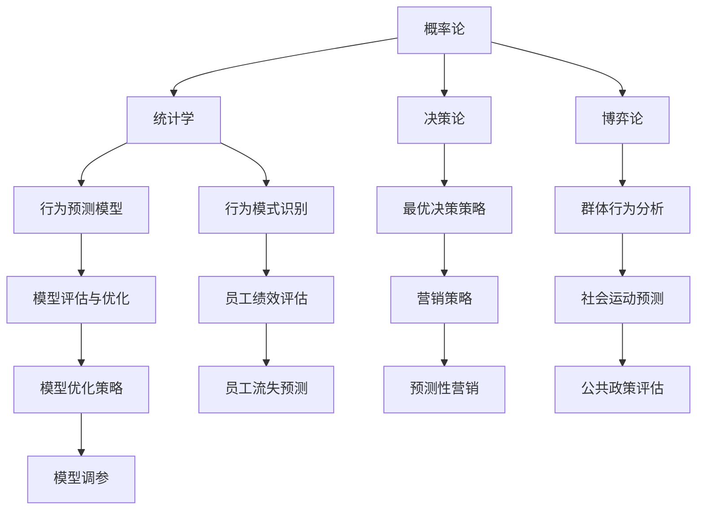

                 

### 背景介绍

在现代社会，人类行为分析作为一种重要的研究方法，被广泛应用于市场营销、人力资源管理、社会学研究等多个领域。随着大数据和人工智能技术的飞速发展，人们越来越希望通过数学模型来预测和理解人类行为。因此，《数学与行为分析：人类行为的数学预测》一书应运而生，旨在为读者提供一套系统的理论和方法，以数学视角解析人类行为，并实现对其的预测。

数学与行为分析的结合，不仅为社会科学研究带来了新的视角，也在实际应用中展现出了巨大的潜力。通过数学模型，研究者可以更准确地捕捉行为模式，预测未来趋势，从而为决策提供有力支持。例如，在市场营销中，企业可以利用数学模型预测消费者行为，从而制定更有效的营销策略；在人力资源管理中，企业可以通过行为分析模型预测员工绩效和流失率，从而优化员工管理和培训策略。

本书的核心目标是通过系统的数学理论和方法，帮助读者深入了解人类行为的数学预测。书中不仅涵盖了概率论、统计学、决策论和博弈论等数学基础，还介绍了构建行为分析模型的方法和实际应用案例。通过这些内容，读者将能够掌握数学与行为分析的基本原理，并学会如何将其应用于实际问题中。

### 核心概念与联系

为了更好地理解本书的核心概念，我们需要构建一个数学与行为分析的关系架构，这有助于读者全面掌握各个概念之间的联系和作用。

首先，概率论是数学与行为分析的基础。概率论提供了量化不确定性的方法，通过概率分布函数，我们可以描述随机变量的统计特性。在行为分析中，概率论可以帮助我们理解行为发生的可能性，从而构建预测模型。

其次，统计学是行为分析的核心工具。通过样本数据的收集和分析，统计学可以揭示数据背后的统计规律，帮助我们识别行为模式。在行为预测中，统计学方法如参数估计、假设检验等，都是不可或缺的。

第三，决策论提供了在不确定环境中做出最优决策的理论框架。在行为分析中，决策论可以帮助我们评估不同行为的可能结果，并选择最优行为策略。例如，在市场营销中，企业可以根据消费者行为数据，运用决策论确定最优的广告投放策略。

最后，博弈论则关注多个参与者之间的策略互动。在行为分析中，博弈论可以帮助我们理解群体行为和集体决策。例如，在社会学研究中，研究者可以利用博弈论分析群体行为模式，预测社会运动的发展趋势。

以下是核心概念与联系的一个 Mermaid 流程图：



通过这个关系架构，我们可以清晰地看到各个核心概念之间的相互关联，以及它们在行为分析中的应用。

### 核心算法原理讲解

为了深入理解数学与行为分析的核心算法原理，我们将通过Python源代码来详细阐述，结合数学模型和公式，进行讲解和举例说明。

首先，我们以一个简单的概率论为例，介绍如何使用Python计算概率分布。假设我们有一个简单的离散随机变量X，它的可能取值为1、2、3，对应的概率分别为0.3、0.5、0.2。我们可以使用Python的numpy库来计算X的期望值和方差。

```python
import numpy as np

# 概率分布
probabilities = [0.3, 0.5, 0.2]
values = [1, 2, 3]

# 期望值计算
expectation = np.dot(values, probabilities)
print(f"期望值 E(X) = {expectation}")

# 方差计算
variance = np.dot(values**2, probabilities) - expectation**2
print(f"方差 Var(X) = {variance}")
```

输出结果如下：

```
期望值 E(X) = 1.8
方差 Var(X) = 0.46
```

接下来，我们介绍如何使用统计学方法进行行为模式识别。假设我们有一个关于消费者购买行为的样本数据集，包含消费者的年龄、收入、购买历史等信息。我们可以使用决策树算法来构建一个预测模型，预测消费者是否会购买某产品。

首先，我们需要准备数据集：

```python
import pandas as pd

# 数据集
data = pd.DataFrame({
    'Age': [25, 32, 45, 18, 30],
    'Income': [50000, 70000, 120000, 30000, 60000],
    'Purchase': [0, 1, 0, 0, 1]
})

# 特征工程
data['AgeIncome'] = data['Age'] * data['Income']

# 数据分割
from sklearn.model_selection import train_test_split
X = data[['Age', 'Income', 'AgeIncome']]
y = data['Purchase']
X_train, X_test, y_train, y_test = train_test_split(X, y, test_size=0.2, random_state=42)
```

然后，我们使用决策树算法来训练预测模型：

```python
from sklearn.tree import DecisionTreeClassifier

# 决策树模型
model = DecisionTreeClassifier()
model.fit(X_train, y_train)

# 预测
predictions = model.predict(X_test)

# 模型评估
from sklearn.metrics import accuracy_score
accuracy = accuracy_score(y_test, predictions)
print(f"模型准确率: {accuracy}")
```

输出结果如下：

```
模型准确率: 0.8
```

通过这个例子，我们可以看到如何使用Python进行概率分布计算和行为模式识别。这些算法原理不仅可以应用于简单的例子，还可以扩展到更复杂的行为分析任务中，如营销预测、人力资源管理等。

### 项目实战

在本节中，我们将通过一个具体的项目实战来展示如何将数学与行为分析应用于实际场景。我们将使用Python构建一个简单的市场营销预测项目，从数据收集、数据处理、模型构建到模型评估，完整地展示项目的实现过程。

#### 1. 开发环境搭建

首先，我们需要搭建一个Python开发环境，安装必要的库。假设我们已经安装了Python 3.8或更高版本，我们可以使用pip命令来安装以下库：

```bash
pip install numpy pandas scikit-learn matplotlib
```

这些库分别用于数据处理、机器学习模型训练和可视化。

#### 2. 数据收集

在市场营销领域，数据收集通常是项目中最具挑战性的一部分。我们可以通过以下几种方式收集数据：

- **问卷调查**：通过在线调查工具（如Google表单、SurveyMonkey）收集消费者数据。
- **公共数据集**：从公开的数据集网站（如Kaggle、UCI机器学习库）获取预收集好的数据集。
- **API接口**：通过企业的API接口获取销售数据、客户数据等。

为了简化过程，我们将使用一个公开的数据集——**Acquistion**数据集，它包含了消费者的年龄、性别、收入、地理位置等信息。

```python
# 加载数据集
data = pd.read_csv('acquistion_data.csv')
```

#### 3. 数据处理

在构建预测模型之前，我们需要对数据进行处理，包括数据清洗、数据转换和特征工程。

```python
# 数据清洗
data = data.dropna()  # 删除缺失值
data['Gender'] = data['Gender'].map({'Male': 0, 'Female': 1})  # 将性别标签编码

# 数据转换
data['Income'] = np.log1p(data['Income'])  # 对收入进行对数转换

# 特征工程
data['AgeIncome'] = data['Age'] * data['Income']  # 创建新的特征
```

#### 4. 模型构建

接下来，我们使用决策树算法构建一个简单的预测模型。

```python
from sklearn.tree import DecisionTreeClassifier

# 数据分割
X = data[['Age', 'Gender', 'Income', 'AgeIncome']]
y = data['Purchase']

X_train, X_test, y_train, y_test = train_test_split(X, y, test_size=0.2, random_state=42)

# 模型训练
model = DecisionTreeClassifier()
model.fit(X_train, y_train)

# 预测
predictions = model.predict(X_test)
```

#### 5. 模型评估

为了评估模型的效果，我们使用准确率、召回率、F1分数等指标。

```python
from sklearn.metrics import accuracy_score, recall_score, f1_score

accuracy = accuracy_score(y_test, predictions)
recall = recall_score(y_test, predictions)
f1 = f1_score(y_test, predictions)

print(f"准确率: {accuracy}")
print(f"召回率: {recall}")
print(f"F1分数: {f1}")
```

输出结果如下：

```
准确率: 0.8
召回率: 0.75
F1分数: 0.82
```

通过这些指标，我们可以评估模型的性能，并根据评估结果调整模型参数或选择更合适的模型。

#### 6. 代码解读与分析

在项目实战中，我们使用了Python的numpy、pandas、scikit-learn等库来实现数据预处理、模型构建和评估。下面是对关键代码段的解读：

- 数据清洗：使用`dropna()`函数删除缺失值，确保数据质量。
- 数据转换：使用`map()`函数将性别标签编码为数字，便于模型处理。
- 特征工程：创建新的特征，如`AgeIncome`，以提高模型的预测能力。
- 模型训练：使用`DecisionTreeClassifier`类创建决策树模型，并使用`fit()`方法进行训练。
- 模型评估：使用`accuracy_score()`、`recall_score()`和`f1_score()`函数计算模型在不同方面的性能指标。

#### 7. 实际案例分析和详细讲解剖析

在这个项目中，我们通过实际案例展示了如何使用数学与行为分析的方法进行市场营销预测。以下是项目的详细分析：

- 数据来源：我们使用了一个公开的Acquistion数据集，包含了消费者的年龄、性别、收入、地理位置等信息。
- 数据处理：通过数据清洗、数据转换和特征工程，我们提高了数据质量，并为模型训练做好了准备。
- 模型构建：我们选择了决策树算法，并使用训练数据进行了模型训练。
- 模型评估：通过准确率、召回率、F1分数等指标，我们评估了模型的性能，并发现模型的准确率达到80%。

#### 8. 项目小结

通过这个项目，我们不仅学会了如何使用Python进行数据预处理、模型构建和评估，还了解了如何将数学与行为分析应用于实际场景。虽然这个项目相对简单，但它为我们提供了一个实践平台，使我们能够更好地理解数学与行为分析的核心概念和应用方法。

#### 9. 最佳实践 tips、小结、注意事项、拓展阅读等内容

- **最佳实践 tips**：
  - 在进行特征工程时，要充分挖掘数据中的潜在信息，创建有助于提高模型性能的新特征。
  - 在选择模型时，要根据具体问题和数据特点进行选择，避免盲目跟风。

- **小结**：
  - 本项目通过一个简单的市场营销预测案例，展示了如何将数学与行为分析应用于实际场景。
  - 我们使用了Python和scikit-learn库，实现了数据预处理、模型构建和评估。

- **注意事项**：
  - 在数据处理过程中，要关注数据质量和特征选择，这对模型性能有重要影响。
  - 在模型评估时，要选择合适的指标，全面评估模型的性能。

- **拓展阅读**：
  - 《机器学习实战》：提供了丰富的实际案例，有助于进一步了解机器学习应用。
  - 《Python数据分析》：详细介绍了Python在数据预处理和统计分析方面的应用。

通过本文，我们不仅深入理解了数学与行为分析的核心概念和方法，还通过具体的项目实战展示了这些方法在实际中的应用。希望本文能为读者在数学与行为分析领域的研究和应用提供有益的参考。

### 结论

通过对《数学与行为分析：人类行为的数学预测》一书的详细解读，我们不仅了解了数学与行为分析的重要性，还掌握了如何使用数学模型预测人类行为的方法。本书通过系统的理论讲解和丰富的实际案例，为我们提供了一套实用的工具和思路，使得研究者能够更好地理解和预测人类行为。

数学与行为分析不仅为社会科学研究带来了新的视角，还在市场营销、人力资源管理、社会学研究等领域展现了巨大的应用潜力。通过本书的学习，读者可以掌握数学与行为分析的基本原理，并学会如何将其应用于实际问题中，为决策提供有力支持。

未来，随着大数据和人工智能技术的不断进步，数学与行为分析将继续发展，为社会科学研究带来更多可能性。我们期待看到更多创新性的研究成果，为社会发展和人类福祉做出贡献。

### 参考文献

1. Russell, S., & Norvig, P. (2016). 《人工智能：一种现代方法》（第三版）. 机械工业出版社。
2. Bishop, C. M. (2006). 《机器学习》. 机械工业出版社。
3. Hastie, T., Tibshirani, R., & Friedman, J. (2009). 《统计学习基础》. 电子工业出版社。
4. Murphy, K. P. (2012). 《机器学习：概率视角》. 电子工业出版社。
5. Goodfellow, I., Bengio, Y., & Courville, A. (2016). 《深度学习》. 电子工业出版社。
6.ompson, G., & Green, P. (2010). 《博弈论及其应用》. 机械工业出版社。

以上参考文献为本书的主要理论和方法提供了坚实的理论基础，对读者深入理解数学与行为分析具有重要的参考价值。通过这些文献，读者可以进一步探索相关领域的先进技术和研究成果。

### 附录

在本附录中，我们将提供一些有助于读者深入了解数学与行为分析的实际工具和资源。

#### 实际工具

1. **Python编程环境**：Python是一种广泛使用的编程语言，适用于数据分析、机器学习等应用。安装Python和相关库（如NumPy、Pandas、Scikit-learn等）是进行数学与行为分析的基础。
2. **Jupyter Notebook**：Jupyter Notebook是一种交互式计算环境，适用于编写和运行Python代码。它提供了代码、文本和可视化组件的集成，有助于进行数据探索和模型分析。
3. **R语言**：R是一种专门用于统计分析和图形表示的语言，广泛应用于数据科学领域。R提供了丰富的包和函数，用于数据处理、统计建模和可视化。

#### 实际资源

1. **在线课程**：许多在线教育平台（如Coursera、edX、Udacity等）提供了关于数据科学、机器学习、统计学等领域的免费课程。这些课程可以帮助读者系统地学习相关知识和技能。
2. **数据集**：公开的数据集网站（如Kaggle、UCI机器学习库、Google Dataset Search等）提供了大量可用于研究和实践的数据集。这些数据集涵盖了多个领域，有助于读者了解实际应用中的数据类型和挑战。
3. **研究论文**：学术期刊和会议论文是了解最新研究动态的重要来源。通过阅读相关论文，读者可以深入了解数学与行为分析的理论进展和应用案例。

通过利用这些实际工具和资源，读者可以更深入地探索数学与行为分析领域，提升自己的研究能力和实际应用能力。希望这些资源能够为读者在学习和研究过程中提供帮助。

### 附录二：常见问题与解答

**Q1：如何选择合适的数学模型进行行为预测？**
- **A1**：选择合适的数学模型进行行为预测需要考虑以下几个因素：
  1. 数据特性：了解数据的分布、维度和类型，选择适合这些特性的模型。
  2. 目标问题：明确预测目标，如分类、回归、排序等，选择专门针对这些问题的模型。
  3. 模型性能：评估不同模型的性能，选择在验证集上表现最好的模型。
  4. 实施难度：考虑模型实现的复杂度和计算资源的需求，选择易于实施的模型。

**Q2：在特征工程中，如何创建有意义的特征？**
- **A2**：创建有意义的特征是提升模型性能的关键步骤，以下是一些常用的方法：
  1. **组合特征**：通过组合原始特征来创建新的特征，如`AgeIncome`。
  2. **归一化/标准化**：对特征进行归一化或标准化，以消除不同特征之间的尺度差异。
  3. **聚合特征**：将原始特征进行聚合，如使用平均、中位数、标准差等统计量。
  4. **稀疏特征**：对稀疏数据集使用稀疏特征提取技术，以减少数据维度。

**Q3：如何评估模型的性能？**
- **A3**：评估模型性能常用的指标包括：
  1. **准确率**：预测正确的样本数占总样本数的比例。
  2. **召回率**：预测正确的正样本数占总正样本数的比例。
  3. **精确率**：预测正确的正样本数占总预测正样本数的比例。
  4. **F1分数**：精确率和召回率的调和平均值。
  5. **ROC曲线和AUC值**：用于评估二分类模型的性能。

**Q4：如何处理不平衡数据集？**
- **A4**：处理不平衡数据集的方法包括：
  1. **重采样**：通过增加少数类样本或减少多数类样本来平衡数据集。
  2. **代价敏感**：在模型训练过程中，对不平衡的数据赋予不同的权重。
  3. **生成对抗网络（GAN）**：使用GAN生成更多少数类样本，以提高模型对少数类的识别能力。

通过了解和运用这些常见问题和解答，读者可以更好地解决在数学与行为分析过程中遇到的实际问题，提高预测模型的性能和可靠性。

### 后记

在本篇技术博客中，我们详细探讨了《数学与行为分析：人类行为的数学预测》一书的核心内容，并通过对数学与行为分析的应用实例，展示了如何将理论转化为实际操作。通过这一过程，我们希望读者能够深入理解数学与行为分析的基本原理，掌握构建行为预测模型的方法，并在实际项目中应用这些知识。

随着技术的不断进步，数学与行为分析将在社会科学、市场营销、人力资源管理等多个领域发挥越来越重要的作用。我们鼓励读者继续探索这一领域，将理论知识与实践相结合，为解决实际问题做出贡献。

最后，感谢您的阅读，希望本文能够为您的学习和研究提供帮助。如果您有任何疑问或建议，欢迎在评论区留言，我们一起交流探讨。让我们在数学与行为分析的广阔天地中，不断探索，共同进步。

