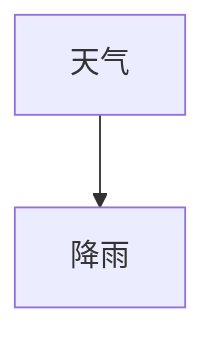
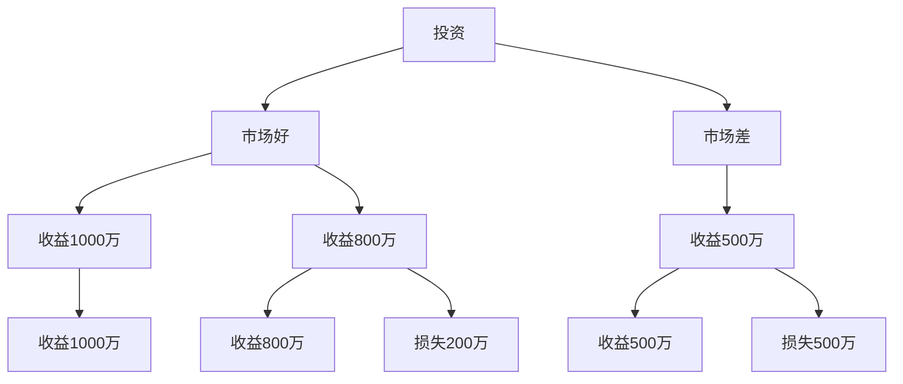
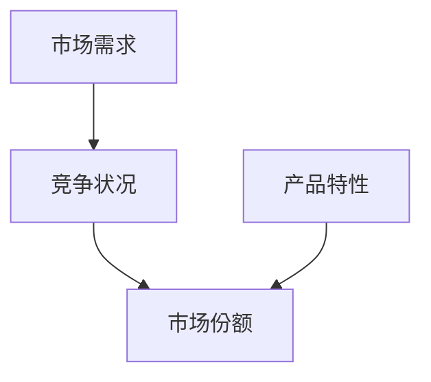
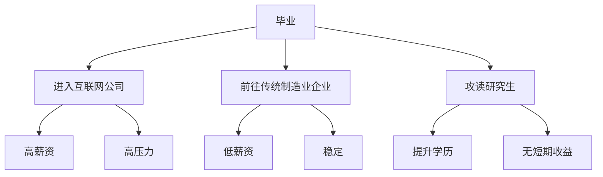

                 

## 引言

在现代社会，经济决策无处不在，从个人的消费选择到企业的投资决策，乃至政府的政策制定，经济决策的质量直接影响着个体和社会的整体福祉。然而，传统经济学理论往往基于理性人假设，认为个体在做出经济决策时会始终遵循最大化效用的原则。然而，现实世界远比这复杂得多。人的行为常常受到心理和社会因素的影响，导致实际决策过程与理论预期存在显著差异。因此，行为经济学应运而生，它融合了心理学和社会学的理论，试图更准确地描述和预测人们在实际经济环境中的行为。

行为经济学通过研究人类决策中的心理偏差和认知限制，揭示了传统经济学理论无法解释的现象。例如，锚定效应、框架效应和有限理性等核心概念，均指出人们在做出决策时并非完全理性，而是受到各种认知偏差的影响。这些偏差不仅影响了个体的决策过程，也在更深层次上影响到了市场的运行效率和政策的制定。

与此同时，数学模型作为一种强大的工具，被广泛应用于各个领域，包括经济学。数学模型能够将复杂的经济现象转化为可计算的数学问题，从而提供量化的分析和预测。然而，传统经济学中的数学模型往往基于严格的理性人假设，这使其在面对行为经济学中的非理性行为时显得力不从心。因此，如何将行为经济学中的核心概念融入数学模型，构建出更符合现实情况的决策模型，成为了一个亟待解决的研究课题。

本文将围绕“数学与行为经济学：经济决策的数学模型”这一主题，深入探讨行为经济学的基本概念，介绍数学模型的基本类型及其在经济决策中的应用，并通过实际案例展示如何将两者结合。本文结构如下：

- **第一部分：行为经济学基础**，介绍行为经济学的基本概念、核心概念与联系，以及行为经济学的实证研究。
- **第二部分：数学模型与经济决策**，介绍数学模型的基本概念和类型，包括线性规划模型、动态规划模型、决策树模型等。
- **第三部分：数学模型在经济决策中的应用案例**，通过具体案例展示数学模型在实际经济决策中的应用。
- **第四部分：综合案例分析**，对一个综合性案例进行分析，展示如何综合运用数学模型和行为经济学原理进行决策。
- **第五部分：数学模型与行为经济学的交叉领域**，探讨数学模型在行为经济学中的应用挑战和修正，以及交叉领域的未来研究方向。

通过本文的阅读，读者将能够了解行为经济学的基本原理，掌握数学模型在经济决策中的应用技巧，并从中获得启发，以更科学、更合理的方式做出经济决策。

### 文章关键词

- 行为经济学
- 数学模型
- 经济决策
- 理性人假设
- 心理偏差
- 模型构建

### 文章摘要

本文旨在探讨行为经济学与数学模型在制定经济决策中的应用。首先，我们介绍了行为经济学的基本概念和核心原理，包括锚定效应、框架效应、时间偏好效应和有限理性等。随后，我们讲解了数学模型的基本类型及其在经济决策中的重要性，包括线性规划模型、动态规划模型、决策树模型等。接着，通过具体案例，我们展示了如何将行为经济学原理与数学模型结合，用于企业投资决策、职业规划、教育资源配置和市场竞争策略等。最后，本文对综合性案例进行了深入分析，提出了数学模型和行为经济学交叉领域的未来研究方向，并总结了最佳实践和小结。本文旨在为读者提供科学合理的经济决策框架，以应对现实世界中的复杂性和不确定性。

### 第一部分：行为经济学基础

#### 1.1 行为经济学的概述

行为经济学作为经济学的一个分支，于20世纪70年代初期兴起，主要研究个体在做出经济决策时的行为模式，特别是这些决策如何偏离传统经济学理论中的“理性人”假设。传统经济学理论中，个体被视为完全理性，能够通过最大化效用的方式做出最优决策。然而，现实中的经济决策过程远比这复杂，受到诸多心理和社会因素的影响。行为经济学正是为了更好地解释这些实际中的非理性行为而诞生的。

行为经济学的基本假设与传统经济学不同，它认为个体在决策过程中不仅会考虑预期收益，还会受到心理偏差的影响。这些心理偏差包括锚定效应、框架效应、时间偏好效应和有限理性等。例如，锚定效应是指人们在做出判断时，会受到最初信息（锚点）的影响，即使这些信息与实际情况无关；框架效应则说明人们在面对相同的选择时，不同的描述方式会导致不同的决策结果。

行为经济学的主要研究领域包括以下几个方面：

1. **心理偏差**：研究个体在决策过程中表现出的各种心理偏差，如锚定效应、框架效应、代表性偏差、确认偏差等。
2. **认知限制**：探讨人类认知能力的局限性，如有限理性、信息处理能力不足等，如何影响决策过程。
3. **社会影响**：研究社会规范、群体压力和社交网络等因素对个体决策的影响。
4. **实验经济学**：通过实验室实验，验证行为经济学理论在实际决策中的应用效果。
5. **应用领域**：将行为经济学理论应用于现实生活中的各种决策情境，如消费行为、投资决策、公共政策的制定等。

行为经济学与标准经济学的主要区别在于理论基础和研究方法。传统经济学基于理性人假设，认为个体具有完全的信息和计算能力，能够通过最大化效用的方式做出最优决策。而行为经济学则认为，个体在决策过程中受到各种认知偏差和情绪的影响，往往无法实现最优决策。

行为经济学的重要贡献之一是揭示了市场中的非理性行为对市场价格和资源配置的影响。例如，锚定效应和过度自信等心理偏差可能导致市场价格的过度波动，影响市场的有效运作。同时，行为经济学也为政策制定提供了新的视角。通过理解和分析个体的行为模式，政策制定者可以设计出更符合人类心理和行为特点的政策，提高政策的实施效果。

总之，行为经济学通过引入心理学和社会学的理论，弥补了传统经济学理论的不足，为更好地理解和预测人类经济行为提供了新的思路和工具。在未来的研究和应用中，行为经济学将继续发挥重要作用，为解决现实经济问题提供有力支持。

#### 1.2 行为经济学与标准经济学的对比

行为经济学和标准经济学在理论基础和研究方法上存在显著差异。标准经济学基于理性人假设，认为个体在做出经济决策时是完全理性的，能够通过最大化效用的方式实现自身利益的最大化。而行为经济学则认为，个体在决策过程中受到心理和社会因素的影响，往往表现出非理性行为。

首先，在理论基础方面，标准经济学的基础是“理性人”假设，这一假设假定个体具有完全的信息、无限的计算能力和一致的偏好，能够在任何情况下做出最优决策。这一假设虽然简化了复杂的经济决策过程，但在现实生活中，个体的行为往往受到各种认知偏差和情绪的影响，无法完全符合理性人假设。

行为经济学则引入了心理学和社会学的理论，研究个体在决策过程中表现出的各种心理偏差，如锚定效应、框架效应、时间偏好效应和有限理性等。这些偏差表明，个体在做出决策时并非总是理性的，而是受到自身认知能力和情绪的局限。

其次，在研究方法上，标准经济学主要采用理论建模和实证分析的方法，通过构建数学模型和统计数据来解释和预测经济现象。而行为经济学则更加注重实验室实验和实地调查，通过直接观察和记录个体在决策过程中的行为，来验证和修正经济理论。

在具体的研究领域和方法上，两者也存在显著差异。标准经济学主要研究个体如何通过理性决策实现资源的最优配置，市场如何达到均衡状态等问题。而行为经济学则更关注市场中的非理性行为，如市场过度波动、投资行为偏差等。例如，锚定效应的研究表明，个体在做出价格判断时，会受到最初信息（锚点）的影响，即使这些信息与实际情况无关。这一发现对市场价格的稳定性产生了重要影响。

行为经济学在实证研究方法上也有其独特之处。除了传统的统计数据和模型分析外，行为经济学还采用了多种实验方法，如双盲实验、情境模拟等，来验证心理偏差的存在和影响。例如，双盲实验可以有效地减少实验者效应和被试者的主观偏差，提高研究的可信度。

总的来说，行为经济学与标准经济学在理论基础和研究方法上存在显著差异。标准经济学强调理性决策和市场均衡，而行为经济学则关注非理性行为和市场波动。尽管两者存在差异，但它们在经济学研究中都发挥着重要作用。标准经济学为理解市场的基本机制提供了重要工具，而行为经济学则为解释现实经济行为提供了新的视角和解释力。

#### 1.3 行为经济学的主要研究领域

行为经济学作为经济学的一个分支，以其独特的研究视角和丰富的理论体系，在多个领域内开展了广泛的研究。以下是行为经济学主要研究领域及其核心概念和原理的概述：

1. **心理偏差**：
   - **锚定效应**：指个体在做出判断和决策时，会受到最初信息（锚点）的影响，即使这些信息与实际情况无关。例如，在评估一个物品的价格时，早期的价格信息会影响个体的最终判断。
   - **框架效应**：指相同的决策内容通过不同的表述方式，会导致个体做出不同的选择。例如，人们可能更倾向于接受小概率高风险的选项，而不是同样风险的小概率低风险选项。
   - **代表性偏差**：指个体在判断和决策时，过分依赖事物的表面特征，而忽视了概率和统计信息。例如，人们可能认为高风险投资具有高收益的代表性，而忽视了长期统计规律。
   - **确认偏差**：指个体在接收信息时，更倾向于关注和记住与已有信念相符的信息，而忽视或遗忘与之相悖的信息。这会导致信息处理的偏差和决策的过度自信。

2. **认知限制**：
   - **有限理性**：指个体在决策过程中，由于信息获取和处理能力的限制，无法实现完全理性的决策。这包括时间压力、认知疲劳和信息过载等因素。
   - **决策偏见**：由于人类认知的局限性，个体在决策过程中可能表现出各种偏见，如选择偏差、确认偏差、后见之明偏差等。这些偏见会影响决策的质量和效率。
   - **前景理论**：行为经济学提出的前景理论，描述了个体在面临潜在损失和收益时的决策行为。该理论认为，个体在面对风险时，损失带来的痛感远大于收益带来的快感。

3. **社会影响**：
   - **社会规范和从众行为**：社会规范和群体压力会影响个体的决策行为，个体可能会出于社会认可的需要，而做出与个人利益不一致的选择。
   - **社交网络和影响力**：社交网络中的信息传播和影响力，对个体决策有重要影响。个体可能会受到朋友、家人或公众意见的影响，改变自己的决策。
   - **信任和合作**：行为经济学研究信任与合作的行为模式，探讨如何在不确定的环境中建立信任机制，促进合作与共享。

4. **实验经济学**：
   - **实验室实验**：通过实验室实验，行为经济学家可以控制和操纵实验条件，研究个体在不同情境下的决策行为，验证行为经济学理论。
   - **实地调查**：通过实地调查，行为经济学家可以获取大量的实际数据，验证理论模型在实际环境中的适用性。
   - **情境模拟**：情境模拟是一种实验方法，通过模拟真实情境，研究个体在决策过程中的行为模式。

5. **应用领域**：
   - **消费行为**：研究消费者在购买商品或服务时的决策过程，分析影响消费行为的心理和社会因素。
   - **投资决策**：探讨投资者在投资过程中的心理偏差和认知限制，如何影响投资决策的效率和效果。
   - **公共政策**：研究政策制定中的心理和社会因素，提出更有效的政策建议，以应对现实中的复杂决策问题。

通过这些主要研究领域，行为经济学为理解人类经济行为提供了深刻的洞见，弥补了传统经济学理论的不足。未来的研究将继续拓展这些领域，探索新的行为模式和应用场景，为政策制定和企业管理提供更加科学的决策支持。

#### 1.4 行为经济学中的核心概念

行为经济学通过研究人类在经济决策中的心理偏差和认知限制，提出了多个核心概念，这些概念帮助我们更好地理解人们在现实经济环境中的行为模式。以下是这些核心概念及其具体解释：

1. **锚定效应**：
   - **定义**：锚定效应是指个体在做出判断和决策时，会受到最初信息（锚点）的影响，即使这些信息与实际情况无关。
   - **例子**：在拍卖市场，拍卖师通常会从一个较高的起始价格开始叫价，这个起始价格就是一个锚点。参与者往往会受到这个初始价格的影响，即使最终价格远低于起始价格，他们也可能认为这个价格偏高。
   - **影响**：锚定效应可能导致价格过高或过低，影响市场效率和资源配置。

2. **框架效应**：
   - **定义**：框架效应是指个体在面对相同的选择时，不同的描述方式会导致不同的决策结果。
   - **例子**：在面对健康保险的选择时，一种描述是“避免每年损失5000美元”，另一种描述是“享受每年3000美元的健康保健”。尽管这两种描述本质上是相同的，但第一种描述可能会使更多的人选择购买保险。
   - **影响**：框架效应表明，个体在做出决策时，不仅考虑预期收益，还受到表述方式和情境的影响。

3. **时间偏好效应**：
   - **定义**：时间偏好效应是指个体对即期消费和未来消费的偏好不同，更倾向于即期消费，即所谓的“即时满足”。
   - **例子**：面对一个选择，一个年轻人可能会更倾向于立即购买一辆新车，而不是将其储蓄用于未来的购房计划。
   - **影响**：时间偏好效应影响了消费行为和投资决策，可能导致个体无法实现长期目标。

4. **有限理性**：
   - **定义**：有限理性是指个体在决策过程中，由于信息获取和处理能力的限制，无法实现完全理性的决策。
   - **例子**：在一个复杂的投资项目中，个体可能无法获取所有相关信息，也无法进行复杂的计算，从而做出次优决策。
   - **影响**：有限理性导致了决策偏差和效率损失，影响了市场运作和个体福祉。

5. **代表性偏差**：
   - **定义**：代表性偏差是指个体在判断和决策时，过分依赖事物的表面特征，而忽视了概率和统计信息。
   - **例子**：在投资市场中，投资者可能会过分关注股票的涨跌幅度，而忽视其长期的统计规律和潜在风险。
   - **影响**：代表性偏差可能导致过度反应和投资错误，影响市场稳定性和投资者收益。

通过理解这些核心概念，我们可以更深入地分析人类经济行为，揭示传统经济学理论无法解释的现象。这些概念不仅对学术研究具有重要价值，也对实际决策具有重要的指导意义。

#### 1.5 行为经济学的实证研究

行为经济学通过实证研究，验证了其在实际决策中的应用效果。实证研究方法主要包括实验室实验、实地调查和情境模拟，这些方法各有其独特的优势和应用场景。

**实验室实验**是一种控制环境下的研究方法，通过设计特定的实验场景，观察个体在决策过程中的行为模式。实验室实验的优点在于能够精确控制变量，确保实验结果的可靠性和重复性。例如，经济学家可以使用双盲实验来减少实验者和被试者的主观偏见。经典实验之一是“最后通牒博弈”，实验者将一定金额的货币分配给两个参与者，一个提议者可以决定如何分配，而接受者可以选择是否接受提议。研究表明，当提议者提出的不公平分配方案接近50/50时，接受者往往会拒绝接受，这反映了个体对公平的重视。

**实地调查**是通过收集实际环境中的数据，研究个体在现实决策情境中的行为。实地调查的优点在于能够获取真实世界的数据，这些数据更贴近实际情况，有助于验证理论模型的适用性。例如，行为经济学家可以对消费者的购买行为进行问卷调查，分析消费者对价格、品牌和广告的反应。实地调查还可以通过观察法，记录个体在市场交易中的行为模式，如拍卖过程中的叫价策略。这类研究有助于理解市场中的非理性行为，如锚定效应和过度自信。

**情境模拟**是一种在计算机或模拟环境中再现真实决策情境的研究方法。通过情境模拟，研究者可以在控制变量的情况下，模拟个体在不同决策环境下的行为。情境模拟的优点在于能够再现复杂的市场环境，帮助研究者理解决策行为在不同情境下的变化。例如，模拟市场中的竞争策略，分析个体在不同竞争环境下的投资决策。情境模拟还可以用于政策分析，通过模拟政策实施的效果，帮助政策制定者评估不同政策方案的影响。

在实证研究中，行为经济学发现了许多与传统经济学理论不符的现象。例如，通过实验室实验发现，个体在面临不确定决策时，往往会表现出过度自信，高估自己的判断能力。实地调查也表明，消费者在购买复杂产品时，常常受到广告和品牌形象的影响，而忽视产品的实际性能和价格。这些发现对传统经济学理论提出了挑战，也促使经济学家重新思考决策过程和行为模式。

实证研究的结果对实际决策具有重要的启示。首先，管理者可以借助行为经济学原理，优化产品定价和市场策略。例如，通过了解消费者的锚定效应，企业可以设置合理的起始价格，影响消费者的价格判断。其次，政策制定者可以依据行为经济学理论，设计更有效的政策方案。例如，通过理解时间偏好效应，政府可以制定激励机制，鼓励公众采取长期有益的行为，如节能减排和健康投资。

总之，行为经济学通过实证研究，不仅验证了其理论模型的适用性，也为实际决策提供了科学依据。未来的研究将继续拓展实证研究的范围和方法，进一步揭示人类经济行为的复杂性，为解决现实经济问题提供更加深入的见解和指导。

#### 1.6 行为经济学的应用

行为经济学的理论不仅在学术研究中具有重要意义，更在现实生活中的各个领域得到了广泛应用。以下是行为经济学在市场分析、政策制定以及金融领域的具体应用：

**市场分析**：
行为经济学通过研究人类的心理偏差和认知限制，为市场分析提供了新的视角。在消费者行为分析中，行为经济学揭示了消费者在购买决策过程中的心理机制，如锚定效应、框架效应和代表性偏差。例如，企业在设计产品定价策略时，可以利用锚定效应，设定较高的起始价格，从而影响消费者的价格感知，提高产品的销售利润。此外，行为经济学还帮助企业理解品牌忠诚度和消费者忠诚度，通过改善产品和服务设计，提升消费者的满意度和品牌忠诚度。

在投资决策中，行为经济学提供了关于投资者心理和行为的深刻洞察。投资者往往受到有限理性和认知偏差的影响，导致市场出现非理性波动。行为经济学可以帮助投资者识别和避免这些偏差，例如，通过教育投资者理解概率和风险管理，减少投资决策中的过度自信和代表性偏差。同时，企业在进行市场预测和竞争策略分析时，可以利用行为经济学原理，预测消费者行为和市场动态，制定更有效的市场策略。

**政策制定**：
行为经济学为政策制定者提供了科学依据，以设计出更符合人类行为特点的政策。例如，在公共政策领域，行为经济学揭示了个体在做出健康、环保和公共安全等决策时的心理机制。通过了解这些机制，政策制定者可以设计出更具吸引力的激励机制，如补贴、税收优惠和奖励制度，以鼓励公众采取有益的行为。例如，在环保政策中，行为经济学提出了“绿色营销”策略，通过提供绿色产品的标签和认证，引导消费者选择环保产品，从而推动环保意识的提升。

在社会保障和福利政策中，行为经济学也发挥着重要作用。政策制定者可以利用行为经济学原理，设计出更有效的扶贫和福利分配机制，以减少贫困和不平等。例如，通过理解个体对即期消费和未来收益的偏好差异，政策制定者可以设计出更有效的养老金和医疗保险制度，提高公众的参与度和满意度。

**金融领域**：
行为经济学在金融领域的应用尤为广泛。在金融市场分析中，行为经济学揭示了投资者行为和市场波动之间的关系。例如，通过研究锚定效应和过度自信等心理偏差，行为经济学家可以预测市场情绪和投资者行为，为金融机构提供风险管理策略。例如，通过建立行为金融模型，金融机构可以更好地理解市场波动的原因，制定有效的对冲策略，降低投资风险。

在个人理财和投资建议中，行为经济学也具有重要应用。理财顾问可以利用行为经济学原理，帮助客户识别和克服决策偏差，制定更合理的投资计划。例如，通过了解时间偏好效应，理财顾问可以引导客户合理规划消费和储蓄，实现长期财务目标。此外，行为经济学还可以帮助投资者建立正确的风险管理意识，避免因情绪波动导致的投资失误。

总之，行为经济学在市场分析、政策制定和金融领域都有着重要的应用价值。通过理解人类的行为和心理机制，行为经济学不仅为理论研究提供了新的方向，也为实际决策提供了科学的依据和指导。未来的研究将继续拓展行为经济学在各个领域的应用，为解决现实经济问题提供更加深入的见解和解决方案。

#### 1.7 行为经济学在金融领域的应用

行为经济学在金融领域中的应用尤为广泛，通过揭示投资者行为和市场波动之间的关系，为投资者提供了新的决策视角。以下将详细探讨行为经济学在投资行为分析和风险管理中的应用，并结合实际案例进行说明。

**投资行为分析**

在投资行为分析中，行为经济学揭示了投资者在决策过程中常见的心理偏差，如锚定效应、过度自信和代表性偏差等。这些偏差往往会导致投资者在市场波动中做出非理性决策，从而影响投资收益。

1. **锚定效应**：投资者在评估投资时，往往会受到历史价格或参考价格的影响，即使这些价格与当前市场情况无关。例如，在股票市场下跌时，投资者可能会将股价的当前价值锚定在下跌前的峰值，导致低估实际价值，不愿及时卖出以止损。同样，在市场上涨时，投资者可能会过度乐观，锚定在上涨前的价格，从而高估股票价值，不愿及时卖出以获利。

**实际案例**：在2008年的金融危机中，许多投资者因锚定效应而遭受巨大损失。当时，许多投资者认为房价会继续上涨，将购房视为一种安全的投资方式。然而，随着市场崩盘，房价急剧下降，许多投资者因不愿面对亏损而持有房产，最终导致巨额损失。

2. **过度自信**：投资者往往高估自己预测市场走势的能力，这种过度自信会导致他们做出高风险的决策。例如，一些投资者在市场波动时频繁交易，期望通过市场波动赚取高额利润，而忽视了市场的不确定性和潜在风险。

**实际案例**：2000年的互联网泡沫时期，许多投资者对互联网股票表现出过度自信，大量资金涌入股市，导致互联网股票价格飞涨。然而，随着市场泡沫破灭，互联网股票价格暴跌，许多投资者遭受了巨额损失。

3. **代表性偏差**：投资者在评估投资时，往往过分依赖历史数据或表面特征，而忽视潜在风险和统计规律。例如，一些投资者可能会因为某个股票在过去一段时间内表现良好，而认为其未来也会表现良好，忽视了股票的估值和公司基本面。

**实际案例**：在2017年的比特币热潮中，许多投资者被比特币过去的高涨表现所吸引，忽视了其高波动性和潜在风险，盲目跟风投资。然而，随着比特币价格的波动和市场的质疑，许多投资者在价格下跌时遭受了重大损失。

**风险管理**

行为经济学在风险管理中的应用同样重要。通过理解投资者的心理偏差，金融机构和投资者可以采取更有效的风险管理策略，降低投资风险。

1. **锚定效应**：在风险管理中，金融机构和投资者需要克服锚定效应，避免将决策锚定在过去的参考价格。例如，在制定投资组合时，应基于当前的市场情况和未来预期，而不是过去的最高或最低价格。

**实际案例**：在2015年的希腊债务危机中，许多投资者因锚定效应而未能及时调整投资策略。他们未能看到希腊债务问题的严重性，继续持有大量希腊国债，最终遭受了损失。

2. **过度自信**：在风险管理中，投资者应认识到自己的有限理性，避免过度交易和高风险投资。通过建立科学的投资策略和纪律，投资者可以更好地控制风险。

**实际案例**：在2008年的金融危机中，许多投资者因过度自信而频繁交易，没有及时调整投资组合，导致巨额损失。

3. **代表性偏差**：在风险管理中，投资者应全面评估投资项目的潜在风险和收益，而不是仅依赖历史表现或表面特征。通过进行深入的风险分析和评估，投资者可以做出更合理的决策。

**实际案例**：在投资房地产时，投资者应考虑房地产市场的整体趋势、经济发展状况、供需关系等因素，而不是仅仅依赖过去的房价涨跌情况。

总之，行为经济学在金融领域的应用，通过揭示投资者的心理偏差，为投资行为分析和风险管理提供了新的视角和方法。投资者和金融机构可以利用这些理论，制定更科学的投资策略和风险管理措施，提高投资决策的效率和效果。

#### 1.8 行为经济学的未来展望

行为经济学作为一门新兴学科，在过去的几十年里取得了显著进展，揭示了人类在经济决策中的心理偏差和认知限制。然而，随着社会和科技的快速发展，行为经济学仍面临着许多挑战和机遇。以下是行为经济学未来可能的发展趋势和方向：

**新的理论模型**：随着心理学和社会学理论的不断进步，行为经济学将不断发展新的理论模型，以更准确地描述和预测人类的经济行为。例如，情绪经济学和神经经济学等新兴领域，将引入心理学和神经科学的研究成果，为行为经济学提供更加细致和深入的决策模型。

**跨学科研究**：行为经济学将继续与其他学科如计算机科学、认知科学和生物学等展开深入合作，通过多学科交叉研究，探索人类行为背后的生物学基础和认知机制。这将有助于更全面地理解经济决策的复杂性，并为行为经济学的应用提供新的理论支持。

**大数据和人工智能的应用**：随着大数据和人工智能技术的快速发展，行为经济学将可以利用这些技术收集和处理大规模的实证数据，提高研究效率和分析精度。例如，通过分析社交媒体和在线行为数据，行为经济学家可以更准确地识别和预测个体行为模式。

**政策应用**：行为经济学将继续在政策制定中发挥重要作用，为政府和社会提供科学依据，设计出更符合人类行为特点和社会需求的政策。例如，通过利用行为经济学原理，政府可以设计出更有效的税收制度、社会保障政策和公共卫生政策，提高政策的实施效果。

**新兴领域探索**：行为经济学将在新兴领域如环境经济学、可持续发展和数字经济等领域发挥重要作用。例如，在环境经济学中，行为经济学可以帮助理解人类对环境资源的消费行为，为可持续发展提供决策支持；在数字经济学中，行为经济学将研究网络效应、平台竞争和数字广告等新现象，为数字经济的发展提供理论指导。

**国际合作**：行为经济学将加强国际合作，共享研究成果和经验，推动全球行为经济学的发展。通过国际间的合作，行为经济学将更好地应对全球性问题，如贫困、不平等和金融危机等。

总之，行为经济学在未来将继续发展，通过新的理论模型、跨学科研究、大数据和人工智能技术的应用，以及政策应用和国际合作，为理解和预测人类经济行为提供更加科学和全面的框架，为解决现实经济问题提供有力支持。

### 第二部分：数学模型与经济决策

#### 2.1 数学模型的基本概念

数学模型是一种用数学语言描述现实问题的工具，通过建立数学关系来模拟和分析系统的行为。在经济决策中，数学模型被广泛应用于优化资源配置、预测市场动态、评估投资风险等方面。理解数学模型的基本概念是掌握经济决策数学模型应用的关键。

**定义**：数学模型是将实际问题抽象为数学形式，通过建立变量之间的数学关系，对系统的行为进行描述和预测。数学模型通常包括输入变量、输出变量和约束条件。

**分类**：根据数学模型的应用领域和特性，可以将数学模型分为多种类型，主要包括以下几种：

1. **线性模型**：线性模型是经济学中最常用的模型之一，它通过线性方程组描述变量之间的关系。线性规划模型、回归模型等均属于线性模型。

2. **非线性模型**：非线性模型用于描述变量之间的复杂非线性关系。常见的非线性模型包括多项式模型、指数模型、逻辑斯蒂模型等。

3. **动态模型**：动态模型描述系统随时间变化的动态行为，主要包括差分方程模型、微分方程模型和动态系统模型。

4. **随机模型**：随机模型用于描述包含随机因素的系统行为，主要包括概率模型、随机过程模型、蒙特卡洛模拟等。

**构建过程**：构建数学模型通常包括以下几个步骤：

1. **问题定义**：明确研究问题，确定需要分析的变量和目标。

2. **变量识别**：确定模型中的输入变量、输出变量和中间变量。

3. **关系建立**：通过相关理论和实证数据，建立变量之间的数学关系。

4. **模型验证**：通过实际数据验证模型的有效性和可靠性，调整模型参数。

5. **模型优化**：在验证基础上，通过优化算法调整模型结构，提高模型的预测精度。

**数学表达**：数学模型通常使用符号表示变量和关系。以下是一些基本的数学表达：

- **线性方程**：\( a_1x_1 + a_2x_2 + \cdots + a_nx_n = b \)
- **线性规划**：\( \min c^T x \) \( s.t. Ax \leq b \)
- **动态规划**：\( V_t(x_t) = \min_u \{ R_t(u, x_t) + \gamma V_{t+1}(x_{t+1}) \} \)
- **概率模型**：\( P(X = x) = f(x; \theta) \)

通过这些基本概念和数学表达，我们可以构建和运用各种数学模型，解决现实经济中的复杂问题，提高经济决策的科学性和效率。

#### 2.2 线性规划模型

线性规划模型是经济学中最常用的数学模型之一，它通过建立线性方程组来优化目标函数，在给定约束条件下寻找最优解。线性规划模型广泛应用于资源分配、生产计划、成本控制等领域，是经济决策中不可或缺的工具。

**定义**：线性规划模型是一个数学问题，其目标是最小化或最大化一个线性目标函数，同时满足一组线性约束条件。

**目标函数**：线性规划模型的目标函数通常是线性的，形式为 \( \min c^T x \) 或 \( \max c^T x \)，其中 \( c \) 是目标系数向量，\( x \) 是决策变量向量。

**约束条件**：线性规划模型的约束条件也是线性的，可以表示为 \( Ax \leq b \) 或 \( Ax \geq b \)，其中 \( A \) 是系数矩阵，\( b \) 是常数向量。

**步骤**：构建线性规划模型通常包括以下步骤：

1. **问题定义**：明确优化问题的目标，确定决策变量和约束条件。
2. **变量识别**：确定目标函数和约束条件中的变量。
3. **关系建立**：建立目标函数和约束条件之间的数学关系。
4. **模型求解**：使用求解算法找到最优解。
5. **模型验证**：通过实际数据验证模型的有效性和可靠性。

**算法**：线性规划模型常用的求解算法包括单纯形法、 Interior Point Method（内点法）和分支定界法等。以下以单纯形法为例，介绍求解过程：

1. **初始化**：选取初始基本可行解，通常为所有变量为零的解。
2. **迭代过程**：
   - **选择进入变量**：根据目标函数的变化率，选择使目标函数增加最快的变量作为进入变量。
   - **选择离开变量**：根据约束条件，选择使约束条件违反程度最小的变量作为离开变量。
   - **更新基本可行解**：通过行变换，更新基本可行解。
3. **重复迭代**：重复选择进入变量和离开变量的过程，直到找到最优解。

**实例**：假设一家制造企业需要决定生产A和B两种产品，其目标是最小化总成本。每种产品的生产成本和利润如下表所示：

| 产品 | A   | B   |
|------|-----|-----|
| 成本 | 100 | 200 |
| 利润 | 300 | 500 |

企业的生产资源限制为：
- 每天可用的原材料为800单位。
- 每天可用的劳动力为600小时。

构建线性规划模型：

- 目标函数：最小化总成本 \( Z = 100x_1 + 200x_2 \)
- 约束条件：
  - 原材料限制：\( 2x_1 + 4x_2 \leq 800 \)
  - 劳动力限制：\( x_1 + 2x_2 \leq 600 \)
  - 非负约束：\( x_1, x_2 \geq 0 \)

使用单纯形法求解该线性规划问题，最终得到最优解：\( x_1 = 200 \)，\( x_2 = 100 \)，总成本为30000。

通过这个实例，我们可以看到线性规划模型如何帮助企业在资源有限的情况下，制定最优的生产计划，以实现成本最小化。

#### 2.3 动态规划模型

动态规划模型是一种用于解决多阶段决策问题的数学模型，它通过将复杂问题分解为多个较小阶段，并在每个阶段上进行优化，从而找到全局最优解。动态规划模型广泛应用于资源分配、库存管理、财务规划等领域，是一种强大的优化工具。

**定义**：动态规划模型是一个决策过程，涉及多个阶段，每个阶段需要做出一个决策，这些决策相互关联，共同影响最终结果。动态规划的目标是通过最优策略的选择，实现整个决策过程的优化。

**基本原理**：动态规划模型的基本原理是“最优子结构”和“重叠子问题”。最优子结构意味着一个问题的最优解包含其子问题的最优解。重叠子问题则指在决策过程中，子问题会反复出现。动态规划通过保存和复用子问题的解，避免了重复计算，提高了效率。

**步骤**：

1. **划分阶段**：将问题划分为多个阶段，明确每个阶段的决策变量。
2. **确定状态变量**：定义每个阶段的状态变量，表示系统在当前阶段的特征。
3. **建立状态转移方程**：确定状态变量之间的数学关系，描述从一个阶段到另一个阶段的状态转移。
4. **定义目标函数**：定义整个决策过程的目标函数，例如最大化总收益或最小化总成本。
5. **逆向递推**：从最后一个阶段开始，逆向递推求解每个阶段的最优决策。
6. **计算最优解**：通过逆向递推的结果，计算全局最优解。

**算法**：动态规划常用的算法包括逆向递推法和备忘录法。以下以逆向递推法为例，介绍求解过程：

1. **初始化**：初始化最后一个阶段的状态变量，计算该阶段的最优解。
2. **递推计算**：从最后一个阶段开始，逆向递推到第一个阶段，逐步计算每个阶段的最优解。
3. **记录最优解**：记录每个阶段的最优解，以便后续计算和验证。

**实例**：假设一个公司需要在三年内投资多个项目，以最大化总收益。每个项目的投资和收益如下表所示：

| 项目 | 投资成本 | 第一年收益 | 第二年收益 | 第三年收益 |
|------|----------|------------|------------|------------|
| A    | 1000     | 500        | 600        | 700        |
| B    | 2000     | 800        | 900        | 1000       |
| C    | 3000     | 1000       | 1100       | 1200       |

构建动态规划模型：

- 目标函数：最大化总收益 \( V = x_1 + x_2 + x_3 \)
- 状态变量：\( s_t \) 表示在第 \( t \) 年可以选择的项目集合
- 状态转移方程：\( V(s_t) = \max \{ \text{收益}, V(s_{t-1}) \} \)

逆向递推求解过程：

1. 初始化 \( V(s_3) \)，其中 \( s_3 \) 包含所有三个项目：\( V(s_3) = 700 + 900 + 1000 = 2500 \)
2. \( V(s_2) \) 的计算：\( V(s_2) = \max \{ 500 + 800 + V(s_3), 600 + 900 + V(s_3) \} = 2400 \)
3. \( V(s_1) \) 的计算：\( V(s_1) = \max \{ 500 + 800 + V(s_2), 600 + 900 + V(s_2), 700 + 1000 + V(s_2) \} = 2300 \)

最优解为选择项目A和B，总收益为2300。

通过动态规划模型，公司可以在有限资源下做出最优的投资决策，实现收益最大化。动态规划模型不仅适用于这类多阶段决策问题，还能广泛应用于其他复杂的经济和工程问题。

#### 2.4 决策树模型

决策树模型是一种直观且强大的数据挖掘工具，用于分析数据集，并通过一系列决策路径来预测目标变量。它通过树的形状来展示决策过程，每个节点代表一个决策或测试，每个分支代表一个结果，叶子节点则代表最终预测。

**定义**：决策树模型是一种树形结构，其中内部节点表示特征测试，分支表示测试的结果，叶子节点表示最终的决策或预测结果。决策树通过递归地将数据划分为更小的子集，直至满足某种终止条件。

**基本结构**：
1. **根节点**：代表整个数据集。
2. **内部节点**：表示特征测试，如“年龄 > 30”或“收入 > 50000”。
3. **分支**：表示特征测试的结果，如“是”或“否”。
4. **叶子节点**：表示预测结果。

**构建步骤**：

1. **特征选择**：选择影响目标变量的关键特征，通常通过信息增益、基尼系数或熵等方法进行选择。
2. **测试划分**：根据特征选择，将数据划分为不同的子集，每个子集对应一个分支。
3. **递归构建**：对每个子集重复上述过程，直到满足终止条件，如节点内样本数少于阈值或特征重要性低于阈值。
4. **模型评估**：使用交叉验证等方法评估决策树的泛化能力，调整参数以优化模型。

**算法**：

1. **递归二分划分**：从根节点开始，选择最佳特征进行划分，递归地对子集进行二分划分。
2. **剪枝**：通过剪枝方法避免过拟合，如前剪枝和后剪枝。
3. **参数调整**：通过交叉验证和网格搜索调整模型参数，优化模型性能。

**实例**：假设我们有一个客户数据集，目标变量是“购买与否”，特征包括年龄、收入和信用评分。

构建决策树模型：

1. **特征选择**：选择“收入”和“信用评分”作为关键特征。
2. **测试划分**：
   - 收入 > 50000：分支1
   - 收入 <= 50000：分支2
   - 信用评分 > 600：分支3
   - 信用评分 <= 600：分支4
3. **递归构建**：
   - 对分支1继续划分：年龄 > 40
   - 对分支2继续划分：年龄 > 30
   - 对分支3继续划分：年龄 > 30
   - 对分支4继续划分：年龄 > 25

最终决策树如下：

```
根节点（购买与否）
|
|--- 年龄 > 40 （是/否）
|      |
|      是
|      |
|      购买
|      |
|      否
|      |
|      购买
|
|--- 年龄 > 30 （是/否）
|      |
|      是
|      |
|      购买
|      |
|      否
|      |
|      未购买
|
|--- 信用评分 > 600 （是/否）
|      |
|      是
|      |
|      购买
|      |
|      否
|      |
|      未购买
|
|--- 信用评分 <= 600 （是/否）
|      |
|      是
|      |
|      未购买
|      |
|      否
|      |
|      未购买
```

通过这个实例，我们可以看到决策树模型如何通过一系列特征测试，预测客户是否购买。决策树模型在分类和回归问题中均有广泛应用，具有直观易懂、易于解释的特点。

#### 2.5 模拟模型

模拟模型是一种通过模拟系统在不同条件下的行为，以预测系统未来状态或评估不同策略效果的数学模型。它广泛应用于经济学、工程学、管理学等多个领域，是一种强有力的工具，可以帮助我们理解和分析复杂系统。

**定义**：模拟模型是通过计算机模拟方法，对实际系统进行抽象和简化的数学模型。它通过模拟系统在不同条件下的运行过程，预测系统的行为，并评估不同策略的效果。

**基本原理**：

1. **系统建模**：首先，对实际系统进行抽象和简化，定义系统的输入变量、状态变量和输出变量。
2. **模拟过程**：根据系统状态变量之间的关系和变化规律，模拟系统在不同条件下的行为，记录系统的运行过程。
3. **结果分析**：通过分析模拟结果，评估系统在不同策略下的性能，预测系统未来的状态。

**构建步骤**：

1. **定义系统模型**：明确系统的输入变量、状态变量和输出变量，建立系统状态变量之间的数学关系。
2. **确定模拟参数**：设置模拟的初始条件、时间步长和其他必要参数。
3. **编写模拟代码**：使用编程语言（如Python、MATLAB等）编写模拟代码，实现系统模型的模拟过程。
4. **模拟运行**：运行模拟代码，记录系统的运行过程和结果。
5. **结果分析**：分析模拟结果，评估不同策略的效果，预测系统未来的状态。

**算法**：

1. **蒙特卡洛模拟**：通过随机抽样和统计分析，评估系统在不同条件下的性能。适用于不确定性和随机性的系统。
2. **系统仿真**：通过建立系统状态变量之间的微分方程或差分方程，模拟系统的动态行为。适用于确定性系统。
3. **基于代理的模拟**：使用机器学习算法训练代理模型，预测系统在不同条件下的状态。适用于复杂系统。

**实例**：假设我们要模拟一个城市交通系统的运行，分析不同交通管理策略的效果。

构建模拟模型：

1. **系统模型**：定义交通流量、速度和道路容量等状态变量，建立状态变量之间的关系。例如，交通流量 \( Q \) 和速度 \( V \) 之间的关系可以通过 \( V = \frac{C}{Q} \) 来表示，其中 \( C \) 是道路容量。
2. **模拟参数**：设置初始条件，如交通流量、速度和道路容量，以及模拟的时间步长。
3. **模拟代码**：使用Python编写模拟代码，模拟交通系统的运行过程。例如：

```python
import numpy as np

# 设置初始条件
Q0 = 100  # 初始交通流量
V0 = 20    # 初始速度
C = 1000   # 道路容量

# 模拟运行
for t in range(1, 100):
    Q = Q0 + np.random.normal(0, 10)  # 随机交通流量变化
    V = C / Q  # 速度计算
    print(f"Time: {t}, Traffic: {Q}, Speed: {V}")
```

4. **结果分析**：分析模拟结果，评估不同交通管理策略的效果。例如，通过调整交通信号灯周期或增加道路容量，观察系统运行性能的变化。

通过这个实例，我们可以看到模拟模型如何通过计算机模拟，帮助我们理解和分析交通系统的行为，评估不同策略的效果。模拟模型在复杂系统的分析中具有广泛的应用，是经济决策和工程优化中的重要工具。

#### 2.6 贝叶斯网络模型

贝叶斯网络模型是一种基于概率论和图论的概率模型，用于表示变量之间的依赖关系。它通过有向无环图（DAG）表示变量及其概率关系，是处理不确定性问题和复杂依赖关系的重要工具。在行为经济学和决策分析中，贝叶斯网络模型被广泛应用于风险分析、决策支持、偏好建模等领域。

**定义**：贝叶斯网络是一种表示变量及其条件概率关系的图形模型。在有向无环图中，每个节点表示一个变量，节点之间的箭头表示变量之间的依赖关系。贝叶斯网络通过条件概率表（CPT）来定义变量之间的概率关系。

**基本原理**：

1. **图结构**：贝叶斯网络通过有向无环图（DAG）来表示变量之间的依赖关系。箭头表示变量之间的条件依赖，无环确保了变量之间的条件独立性。
2. **概率计算**：贝叶斯网络通过贝叶斯定理和概率传播规则，计算变量在不同条件下的概率分布。条件概率表（CPT）定义了每个节点在给定其父节点条件下的概率分布。

**构建步骤**：

1. **变量识别**：确定模型中的所有变量，明确它们之间的依赖关系。
2. **构建图结构**：根据变量之间的依赖关系，构建有向无环图（DAG）。确保图中不存在循环，确保变量之间的条件独立性。
3. **定义条件概率表（CPT）**：为每个节点定义条件概率表（CPT），表示该节点在给定其父节点条件下的概率分布。
4. **模型验证**：通过模拟或实际数据验证贝叶斯网络的准确性，调整模型参数以提高精度。

**算法**：

1. **贝叶斯推理**：通过贝叶斯定理和概率传播规则，计算网络中任意节点的条件概率分布。贝叶斯推理是一种高效的推理算法，适用于不确定性和复杂依赖关系。
2. **学习算法**：通过统计学习算法（如最大似然估计、贝叶斯估计）从数据中学习贝叶斯网络的参数，自动构建贝叶斯网络。
3. **结构学习**：通过图结构学习算法（如贪心算法、启发式搜索），自动识别变量之间的依赖关系，构建贝叶斯网络结构。

**实例**：假设我们要构建一个简单的贝叶斯网络模型，分析天气对降雨的影响。

构建贝叶斯网络模型：

1. **变量识别**：确定变量“天气”（W）和“降雨”（R）。
2. **构建图结构**：根据天气对降雨的影响，构建有向无环图。天气（W）是降雨（R）的父节点。



3. **定义条件概率表（CPT）**：

```markdown
| 天气 | 降雨 |
|------|------|
| 晴朗 | 无   |
| 晴朗 | 有   |
| 阴   | 无   |
| 阴   | 有   |
| 雨   | 有   |
```

4. **模型验证**：使用实际天气和降雨数据，验证贝叶斯网络的准确性，调整参数以提高预测效果。

通过这个实例，我们可以看到贝叶斯网络模型如何通过图形结构和概率表，表示变量之间的依赖关系，并进行概率推理和预测。贝叶斯网络模型在处理不确定性问题和复杂依赖关系方面具有独特优势，是行为经济学和决策分析中的重要工具。

#### 2.7 代理模型

代理模型是经济学和计算机科学中用于模拟个体或集体行为的数学模型，通过设定一定的行为规则和目标函数，代理模型可以模拟个体在不同环境下的决策过程。代理模型广泛应用于市场模拟、社会仿真和智能体系统等领域，是一种重要的决策分析和模拟工具。

**定义**：代理模型是指由一组决策个体（代理）组成的系统，每个代理根据设定的行为规则和目标函数，自主做出决策。代理模型通过模拟这些决策个体的交互和演化，分析系统的整体行为和结果。

**基本原理**：

1. **个体行为规则**：代理模型中的每个代理都有一套行为规则，这些规则定义了代理在特定情境下的决策过程。行为规则可以是简单的规则集，如“如果...那么...”，也可以是复杂的决策算法，如遗传算法、神经网络等。
2. **目标函数**：代理模型中的每个代理都拥有一个目标函数，用来评估代理决策的效果。目标函数可以是效用函数、收益函数或其他评价标准。
3. **交互和演化**：代理模型通过模拟代理之间的交互和演化过程，分析系统的动态行为和长期结果。代理之间可能存在竞争、合作或协调关系，这些关系通过模型中的行为规则和目标函数来描述。

**构建步骤**：

1. **定义代理行为规则**：明确每个代理的行为规则，包括简单的规则集或复杂的决策算法。例如，一个市场中的卖家可能根据价格和市场供需来调整销售策略。
2. **设定目标函数**：为每个代理设定目标函数，用来评估代理的决策效果。例如，一个卖家可能希望最大化利润或市场份额。
3. **构建系统模型**：根据代理行为规则和目标函数，构建代理系统的整体模型。模型中应包括所有代理、环境变量和交互机制。
4. **模拟运行**：使用计算机模拟代理系统在不同条件下的行为，记录系统的运行过程和结果。
5. **结果分析**：分析模拟结果，评估代理系统的整体行为和长期结果。

**算法**：

1. **简单规则集**：使用简单的条件语句构建代理行为规则，适用于规则明确且环境简单的系统。
2. **机器学习算法**：使用机器学习算法（如神经网络、决策树等）训练代理行为规则，适用于环境复杂且规则难以明确的情况。
3. **进化算法**：使用进化算法（如遗传算法、模拟退火等）优化代理行为规则，适用于复杂动态环境。

**实例**：假设我们要模拟一个简单的市场竞争场景，分析不同企业竞争策略的效果。

构建代理模型：

1. **定义代理行为规则**：每个企业根据价格和市场供需来调整销售策略。例如，如果市场供需平衡，企业维持当前价格；如果市场供大于求，企业降价以吸引更多客户。
2. **设定目标函数**：每个企业的目标函数是最大化利润，可以通过调整价格和产量来实现。
3. **构建系统模型**：系统包括多个企业、市场需求和环境变量。每个企业在每一步都根据其他企业的行为和市场供需情况调整自己的策略。
4. **模拟运行**：模拟多个时间步长，记录每个企业的价格、产量和利润。
5. **结果分析**：分析不同策略的效果，比较不同企业之间的竞争和合作行为，评估系统的整体稳定性和效益。

通过这个实例，我们可以看到代理模型如何通过设定行为规则和目标函数，模拟市场中的企业竞争行为，分析不同策略的效果。代理模型在复杂系统模拟和决策分析中具有广泛的应用，是经济学和计算机科学中的重要工具。

### 第三部分：数学模型在经济决策中的应用案例

#### 3.1 企业投资决策

在企业的日常运营和长期发展过程中，投资决策扮演着至关重要的角色。一个成功的投资决策不仅能够为企业带来经济效益，还能够增强企业的市场竞争力。然而，投资决策通常面临着诸多不确定性和复杂性，因此，借助数学模型进行科学的决策分析，成为企业管理者的重要手段。以下通过几个具体案例，展示如何运用数学模型进行企业投资决策。

**案例一：风险评估与资本预算**

假设某企业正在考虑一项大型投资项目，项目预计投资金额为1000万元，投资期限为5年，预计年收益率为10%。然而，由于市场环境的变动和项目实施的不确定性，企业需要对项目的风险进行评估，并制定合理的资本预算计划。

1. **风险评估**：企业可以使用决策树模型对项目的风险进行量化评估。决策树模型可以帮助企业分析不同风险情景下的收益和损失，制定相应的风险管理策略。例如，企业可以构建如下决策树：



通过决策树模型，企业可以评估市场好、市场差两种情景下的收益和损失，从而了解项目的风险水平。

2. **资本预算**：在了解项目风险后，企业可以使用线性规划模型制定资本预算计划。线性规划模型可以帮助企业确定在不同风险水平下，如何分配有限的资金，以最大化收益或最小化成本。例如，企业可以设定如下目标函数：

\[ \min Z = 1000x_1 + 800x_2 + 500x_3 + 500x_4 \]

其中，\( x_1, x_2, x_3, x_4 \) 分别代表在不同风险情景下的投资比例。同时，企业需要满足以下约束条件：

\[ x_1 + x_2 + x_3 + x_4 = 1 \]
\[ x_1 \geq 0, x_2 \geq 0, x_3 \geq 0, x_4 \geq 0 \]

通过求解线性规划模型，企业可以确定最优的投资分配策略，以降低风险并实现收益最大化。

**案例二：新产品开发决策**

某企业计划开发一种新产品，项目总投资为500万元，预计市场寿命为5年。企业希望通过数学模型评估新产品的市场潜力，并制定相应的投资计划。

1. **市场潜力评估**：企业可以使用贝叶斯网络模型评估新产品的市场潜力。贝叶斯网络模型可以帮助企业分析市场需求、竞争状况和产品特性等因素对市场潜力的影响。例如，企业可以构建如下贝叶斯网络：



通过贝叶斯网络模型，企业可以量化市场需求、竞争状况和产品特性对市场份额的影响，从而评估新产品的市场潜力。

2. **投资计划**：在了解新产品的市场潜力后，企业可以使用动态规划模型制定投资计划。动态规划模型可以帮助企业确定在不同市场情景下，如何分配资金以最大化收益。例如，企业可以设定如下动态规划模型：

\[ V_t(x_t) = \max \{ R_t(u, x_t) + \gamma V_{t+1}(x_{t+1}) \} \]

其中，\( V_t(x_t) \) 表示在第 \( t \) 年，企业在当前市场情景下的最优投资策略，\( R_t(u, x_t) \) 表示企业在第 \( t \) 年采取行动 \( u \) 后的收益，\( \gamma \) 表示贴现因子。

通过动态规划模型，企业可以制定最优的投资计划，以实现收益最大化。

**案例三：多元化投资策略**

某企业计划通过多元化投资降低投资组合的风险，并实现资产的长期增值。企业希望通过数学模型评估不同投资策略的风险收益特征，并制定最优的投资组合。

1. **风险收益评估**：企业可以使用蒙特卡洛模拟评估不同投资策略的风险收益特征。蒙特卡洛模拟可以帮助企业模拟市场波动对投资组合的影响，分析不同投资策略的波动率和收益分布。例如，企业可以设定如下蒙特卡洛模拟模型：

```python
import numpy as np

# 设置模拟参数
num_simulations = 1000
num_years = 5
mu = 0.05  # 年均收益率
sigma = 0.1  # 年波动率

# 模拟投资组合收益
investment_returns = np.random.normal(mu, sigma, num_simulations)

# 计算投资组合的波动率和收益
portfolio_volatility = np.std(investment_returns)
portfolio_mean_return = np.mean(investment_returns)

# 输出结果
print(f"平均收益: {portfolio_mean_return}, 波动率: {portfolio_volatility}")
```

通过蒙特卡洛模拟，企业可以评估不同投资策略的风险收益特征，为制定最优投资组合提供依据。

2. **投资组合优化**：在了解不同投资策略的风险收益特征后，企业可以使用线性规划模型优化投资组合。线性规划模型可以帮助企业确定不同资产的投资比例，以实现风险最小化或收益最大化。例如，企业可以设定如下目标函数：

\[ \min Z = \sum_{i=1}^{n} w_i \sigma_i \]

其中，\( w_i \) 表示资产 \( i \) 的投资比例，\( \sigma_i \) 表示资产 \( i \) 的波动率。同时，企业需要满足以下约束条件：

\[ w_1 + w_2 + \cdots + w_n = 1 \]
\[ w_i \geq 0, \forall i \]

通过求解线性规划模型，企业可以确定最优的投资组合，以实现风险最小化或收益最大化。

通过这些具体案例，我们可以看到数学模型在企业投资决策中的应用。借助数学模型，企业可以更准确地评估投资风险、评估市场潜力、优化投资组合，从而制定出科学合理的投资策略，实现资产的长期增值。随着数学模型和方法的发展，企业投资决策的精度和效率将不断提高，为企业的可持续发展提供有力支持。

#### 3.2 职业规划

职业规划是个人在职业生涯中做出一系列决策的过程，旨在实现个人的职业发展目标。然而，职业决策并非一成不变，而是需要根据市场环境、个人能力和职业机会等因素不断调整。数学模型作为分析和优化决策的工具，在职业规划中有着广泛的应用。以下通过具体案例，展示如何运用数学模型进行职业规划。

**案例一：基于职业发展的决策树模型**

假设一位大学毕业生小李在毕业时面临多个职业选择：进入一家互联网公司、前往一家传统制造业企业或继续攻读研究生。每种选择都有其优缺点，小李希望通过决策树模型分析各个选择的潜在收益和风险，以做出最优决策。

1. **定义变量**：首先，小李需要明确各个选择的收益和风险变量。例如，互联网公司的薪资水平高，但工作压力较大；传统制造业企业薪资相对较低，但工作稳定；攻读研究生可以提升学历，但短期内无法获得经济收益。

2. **构建决策树**：小李可以使用决策树模型，分析不同选择的收益和风险。决策树的每个节点代表一个选择，每个分支代表该选择的结果。例如：



3. **评估决策**：通过决策树模型，小李可以评估每个选择的潜在收益和风险。例如，互联网公司虽然压力大，但长期来看薪资水平较高；传统制造业企业稳定，但薪资相对较低；攻读研究生可以提升学历，但短期内无经济收益。综合考虑后，小李决定选择进入互联网公司。

**案例二：基于人力资本投资的动态规划模型**

假设小李在职业发展的过程中，希望进行多次人力资本投资，如参加培训、考取职业证书等。这些投资需要投入时间和金钱，但可以提升职业能力和薪资水平。小李希望通过动态规划模型，优化投资策略，以实现职业发展的最大化收益。

1. **定义状态变量**：动态规划模型中的状态变量代表职业发展的不同阶段。例如，状态变量可以包括职业阶段（初入职场、晋升为中层管理、成为高层领导等）和薪资水平。

2. **建立状态转移方程**：动态规划模型通过状态转移方程，描述不同职业阶段之间的转换关系。例如，从初入职场到晋升为中层管理，可能需要完成特定培训或积累一定的工作经验。

3. **设定目标函数**：动态规划模型的目标函数代表小李的职业发展目标，如最大化薪资水平或职业满意度。目标函数可以表示为：

\[ V_t(x_t) = \max \{ R_t(u, x_t) + \gamma V_{t+1}(x_{t+1}) \} \]

其中，\( V_t(x_t) \) 表示在当前职业阶段 \( t \) 下的最优策略，\( R_t(u, x_t) \) 表示在当前阶段采取行动 \( u \) 后的收益，\( \gamma \) 表示贴现因子。

4. **求解最优策略**：通过逆向递推，从最终阶段开始，逐步求解每个阶段的最优策略。例如，在最终阶段，小李选择继续工作以最大化薪资水平；在中间阶段，小李选择参加培训或考取证书，以提升职业能力和薪资水平。

**案例三：基于市场需求的贝叶斯网络模型**

假设小李在职业规划中，需要考虑市场需求和竞争状况对职业发展的影响。他希望通过贝叶斯网络模型，分析市场需求和竞争状况的不确定性，制定灵活的职业规划策略。

1. **定义变量**：贝叶斯网络模型中的变量包括市场需求、竞争状况、小李的职业能力和市场机会等。

2. **构建贝叶斯网络**：根据市场需求和竞争状况的依赖关系，构建贝叶斯网络。例如，市场需求和竞争状况可能受小李的职业能力影响，同时市场需求也会影响职业机会。

3. **设定概率分布**：为每个变量设定条件概率分布，描述变量之间的关系。例如，小李的职业能力较高，市场需求的概率较高，竞争状况的概率较低。

4. **推理和预测**：通过贝叶斯推理，计算不同职业选择的概率分布。例如，小李选择进入互联网公司，市场需求高的概率较大，职业发展前景较好。

通过这些案例，我们可以看到数学模型在职业规划中的应用。借助决策树模型，个人可以分析不同选择的潜在收益和风险；通过动态规划模型，个人可以优化投资策略，实现职业发展的最大化收益；通过贝叶斯网络模型，个人可以分析市场需求和竞争状况的不确定性，制定灵活的职业规划策略。随着数学模型和方法的发展，职业规划的科学性和准确性将不断提高，为个人的职业发展提供有力支持。

#### 3.3 教育资源配置

教育资源配置是指将有限的教育资源（如教师、资金、设施等）分配到各个学校和教育阶段，以满足学生和教育需求的过程。合理的教育资源配置对于提高教育质量、促进教育公平和实现教育目标至关重要。数学模型在优化教育资源配置中发挥了重要作用，通过建立数学模型，我们可以更科学地分析和解决教育资源配置问题。

**案例一：基于效率的线性规划模型**

假设一个城市有若干所学校，每所学校需要一定数量的教师和资金来维持正常运转。城市政府希望在有限的资源下，最大化所有学校的总体教育质量。我们可以使用线性规划模型来解决这个问题。

1. **定义变量**：设定学校、教师数量和资金为变量。例如，\( x_i \) 表示分配给学校 \( i \) 的教师数量，\( y_i \) 表示分配给学校 \( i \) 的资金。

2. **建立目标函数**：目标函数是最小化学校之间的资源差距，以实现资源分配的公平性。例如，最小化标准差：

\[ \min \sqrt{\sum_{i=1}^{n} (x_i - \bar{x})^2} \]

其中，\( n \) 是学校数量，\( \bar{x} \) 是所有学校的教师平均数量。

3. **设定约束条件**：包括总教师数量和总资金限制。例如：

\[ \sum_{i=1}^{n} x_i = \text{总教师数量} \]
\[ \sum_{i=1}^{n} y_i = \text{总资金} \]
\[ x_i \geq 0, y_i \geq 0, \forall i \]

4. **求解模型**：使用线性规划求解器求解模型，找到最优的资源分配方案。

**案例二：基于公平的多目标规划模型**

假设除了关注效率，政府还希望减少学校之间的教育质量差距，实现教育公平。在这种情况下，我们可以使用多目标规划模型。

1. **定义变量**：同上。

2. **建立目标函数**：包括效率目标（最小化资源差距）和公平目标（最大化最低质量标准）。例如：

\[ \min \sqrt{\sum_{i=1}^{n} (x_i - \bar{x})^2} \]
\[ \max \min(x_i) \]

3. **设定约束条件**：同上。

4. **求解模型**：使用多目标规划求解器求解模型，找到兼顾效率和公平的资源分配方案。

**案例三：基于供需的动态规划模型**

假设教育资源需求随时间变化，学校在不同时间点的资源需求不同。我们可以使用动态规划模型，根据未来需求预测，动态调整资源分配。

1. **定义变量**：包括当前时间点的教师数量和资金，以及未来需求预测。

2. **建立状态变量**：表示当前时间点的学校资源状态，如教师数量和资金水平。

3. **建立状态转移方程**：根据未来需求预测，计算不同资源分配策略下的未来状态。

4. **设定目标函数**：最大化长期资源利用率，例如：

\[ \max \sum_{t=0}^{T} \gamma^t U_t(x_t) \]

其中，\( T \) 是预测期数，\( \gamma \) 是贴现因子，\( U_t(x_t) \) 是第 \( t \) 时间点的资源利用率。

5. **求解模型**：使用动态规划求解器，逐步计算每个时间点的最优资源分配方案。

**案例四：基于学生需求的模拟模型**

假设教育资源需求受学生分布影响，不同学校的学生数量和需求不同。我们可以使用模拟模型，模拟不同教育资源分配策略下的学生分布和满意度。

1. **定义变量**：包括学校、学生数量、学生需求和满意度。

2. **建立模拟模型**：模拟不同教育资源分配策略下的学生分布和满意度，计算资源分配的公平性和效率。

3. **设定模拟条件**：根据学生需求和满意度设定模拟参数，如最小学生容量、最大教师负担等。

4. **求解模型**：通过模拟，比较不同教育资源分配策略的公平性和效率。

通过这些案例，我们可以看到数学模型在优化教育资源配置中的应用。借助线性规划模型，可以最大化资源利用效率；借助多目标规划模型，可以同时考虑效率和公平；借助动态规划模型，可以适应需求变化；借助模拟模型，可以模拟不同策略的效果。随着数学模型和方法的发展，教育资源配置将更加科学、合理，有助于实现教育公平和提升教育质量。

#### 3.4 市场竞争策略

市场竞争策略是企业在激烈的市场环境中，为了争夺市场份额和消费者而采取的一系列策略。在制定市场竞争策略时，企业需要分析市场环境、竞争对手的行为以及自身的资源与能力。数学模型作为一种有效的分析工具，可以帮助企业更准确地评估不同策略的效果，并制定最优的市场竞争策略。

**案例一：基于市场占有率的多目标规划模型**

假设某企业（A公司）在市场中面临两家主要竞争对手（B公司和C公司），企业希望通过优化市场占有率，实现市场份额的最大化。我们可以使用多目标规划模型来解决这个问题。

1. **定义变量**：设定 \( x_1, x_2, x_3 \) 分别为A公司在三个市场细分领域的市场份额。

2. **建立目标函数**：目标函数是最小化市场占有率差距，实现市场份额的均衡分布。例如：

\[ \min \sqrt{\sum_{i=1}^{3} (x_i - \bar{x})^2} \]

其中，\( \bar{x} \) 是所有市场细分领域的平均市场份额。

3. **设定约束条件**：包括总市场份额限制、市场份额平衡限制和资源分配限制。例如：

\[ \sum_{i=1}^{3} x_i = 1 \]
\[ x_i \geq 0, \forall i \]

4. **求解模型**：使用多目标规划求解器，找到最优的市场占有率分配方案。

**案例二：基于市场份额和利润的线性规划模型**

假设A公司希望在保持市场份额的同时，实现利润最大化。我们可以使用线性规划模型来解决这个问题。

1. **定义变量**：设定 \( x_1, x_2, x_3 \) 分别为A公司在三个市场细分领域的市场份额，\( y_1, y_2, y_3 \) 分别为对应的市场细分领域的利润。

2. **建立目标函数**：最大化总利润。例如：

\[ \max \sum_{i=1}^{3} y_i \]

3. **设定约束条件**：包括市场份额限制、利润平衡限制和资源分配限制。例如：

\[ x_i \leq p_i \]
\[ y_i = r_i x_i \]
\[ x_i \geq 0, y_i \geq 0, \forall i \]

其中，\( p_i \) 是市场细分领域的最大市场份额，\( r_i \) 是每个市场细分领域的利润率。

4. **求解模型**：使用线性规划求解器，找到最优的市场份额和利润分配方案。

**案例三：基于市场份额和竞争力的动态规划模型**

假设A公司在不同时间点面临不同的市场环境和竞争态势，需要动态调整市场份额和竞争力。我们可以使用动态规划模型，根据未来市场环境和竞争态势，优化市场份额和竞争力。

1. **定义变量**：设定 \( x_t, y_t \) 分别为A公司在第 \( t \) 时间点的市场份额和竞争力水平。

2. **建立状态变量**：设定当前时间点的市场份额和竞争力状态。

3. **建立状态转移方程**：根据未来市场环境和竞争态势，计算不同策略下的未来状态。

4. **设定目标函数**：最大化长期市场份额和竞争力。例如：

\[ \max \sum_{t=0}^{T} \gamma^t U_t(x_t, y_t) \]

其中，\( T \) 是预测期数，\( \gamma \) 是贴现因子，\( U_t(x_t, y_t) \) 是第 \( t \) 时间点的市场份额和竞争力综合评分。

5. **求解模型**：使用动态规划求解器，逐步计算每个时间点的最优市场份额和竞争力策略。

**案例四：基于市场竞争策略的模拟模型**

假设A公司需要评估不同市场竞争策略的效果，我们可以使用模拟模型，模拟不同策略下的市场份额、利润和竞争力变化。

1. **定义变量**：设定 \( x_1, x_2, x_3 \) 分别为A公司在三个市场细分领域的市场份额，\( y_1, y_2, y_3 \) 分别为对应的市场细分领域的利润。

2. **建立模拟模型**：模拟不同市场竞争策略下的市场份额、利润和竞争力变化。

3. **设定模拟条件**：根据市场环境和竞争态势设定模拟参数，如市场增长率、竞争对手策略等。

4. **求解模型**：通过模拟，比较不同市场竞争策略的效果。

通过这些案例，我们可以看到数学模型在市场竞争策略中的应用。借助多目标规划模型，企业可以实现市场份额的均衡分布；借助线性规划模型，企业可以实现利润最大化；借助动态规划模型，企业可以适应动态市场环境，优化市场份额和竞争力；借助模拟模型，企业可以评估不同策略的效果，制定科学合理的市场竞争策略。随着数学模型和方法的发展，企业将能够更有效地制定市场竞争策略，提高市场竞争力和盈利能力。

### 第四部分：综合案例分析

在经济学中，综合案例分析是一种通过实际案例研究来深入理解和分析复杂经济现象的方法。本节将通过对一个综合性案例的分析，展示如何结合数学模型和行为经济学原理，为实际问题提供解决方案。

#### 案例概述

假设一家大型科技公司（A公司）正在考虑是否开发一款新的智能家居产品。这款产品具有广阔的市场潜力，但同时也面临较高的研发成本和市场竞争风险。A公司的管理层希望通过数学模型和行为经济学原理，分析开发新产品的可行性，并制定最优的决策策略。

#### 案例分析过程

1. **市场调研与需求分析**：
   - **行为经济学分析**：通过行为经济学研究，A公司发现消费者对智能家居产品的需求受到多种心理因素的影响，如锚定效应和框架效应。例如，消费者可能受到初期价格的影响，对产品的总体价值评估产生偏差。因此，A公司在市场调研中，特别关注消费者的价格敏感性和对产品功能的需求。
   - **数学模型**：A公司使用市场需求预测模型，结合历史数据和消费者调查结果，预测不同定价策略下的市场需求。模型包括线性回归分析和时间序列分析，以量化市场需求与价格、功能等因素的关系。

2. **风险评估与成本分析**：
   - **行为经济学分析**：A公司使用行为经济学原理，评估开发新产品的风险。例如，通过分析管理层和研发团队的风险偏好，确定合理的风险评估指标。此外，公司还考虑了市场不确定性、技术风险和竞争对手行为等外部因素。
   - **数学模型**：A公司运用决策树模型和蒙特卡洛模拟，分析不同风险情景下的成本和收益。通过这些模型，公司可以量化每个风险因素的概率分布和影响程度，从而制定有效的风险管理策略。

3. **投资决策与资源优化**：
   - **行为经济学分析**：A公司采用前景理论，评估不同投资方案的风险和收益，并考虑时间偏好效应。管理层通过设定贴现因子，优化长期投资决策，以实现企业价值的最大化。
   - **数学模型**：A公司使用动态规划模型，根据不同时间点上的成本和收益，制定最优的投资和资源分配策略。动态规划模型帮助公司在多个阶段上进行最优选择，以实现长期收益最大化。

4. **市场竞争策略**：
   - **行为经济学分析**：A公司结合行为经济学原理，制定市场竞争策略。例如，通过了解竞争对手的行为模式和心理偏差，公司可以制定更具策略性的价格和营销策略。
   - **数学模型**：A公司使用贝叶斯网络模型，分析市场动态和竞争对手策略的变化，预测市场趋势和消费者反应。贝叶斯网络模型帮助公司制定灵活的市场竞争策略，以应对不确定的市场环境。

#### 案例分析结果与讨论

通过对综合案例的分析，A公司得出以下结论：

1. **市场需求预测**：基于市场需求预测模型，公司确定了一个合理的定价策略，以最大化市场份额和收益。通过行为经济学分析，公司发现适当的价格调整和功能优化可以显著提升市场需求。

2. **风险评估**：决策树模型和蒙特卡洛模拟结果显示，开发新产品的风险主要来自于技术不确定性和市场竞争。通过行为经济学分析，公司识别出管理层和研发团队的风险偏好，并制定了相应的风险管理策略。

3. **投资决策**：动态规划模型帮助公司制定了最优的投资和资源分配策略，实现长期收益最大化。行为经济学分析确保了投资决策的合理性，充分考虑了时间偏好效应和前景理论。

4. **市场竞争策略**：通过贝叶斯网络模型，公司制定了灵活的市场竞争策略，以应对市场动态和竞争对手的行为。行为经济学分析提供了对消费者心理的深刻理解，有助于公司制定更具针对性的市场策略。

#### 案例分析总结

综合案例分析表明，结合数学模型和行为经济学原理，可以帮助企业在复杂的经济环境中做出更科学、更合理的决策。通过系统化的分析过程，公司可以更好地理解市场动态、评估风险、优化资源配置，并制定出有效的市场竞争策略。未来，随着行为经济学和数学模型方法的不断发展，企业将能够更有效地应对经济不确定性，实现可持续发展。

### 第五部分：数学模型与行为经济学的交叉领域

在经济学研究中，数学模型和行为经济学相互补充，共同为理解和预测人类经济行为提供了强大的工具。数学模型通过精确的数学语言和计算方法，提供了对经济现象的定量分析；而行为经济学则通过心理学和社会学的理论，揭示了人类在决策过程中表现出的心理偏差和认知限制。两者的交叉领域，不仅为经济决策提供了新的视角，也为数学模型的改进和完善提供了理论支持。

#### 数学模型在行为经济学中的应用挑战

1. **心理偏差的建模**：行为经济学中的心理偏差，如锚定效应、框架效应和过度自信等，是复杂的认知过程，难以用传统的数学模型精确描述。例如，锚定效应涉及人们对参考点的依赖，这种依赖可能随着情境的变化而变化，使得建立稳定的模型参数变得困难。

2. **认知限制的处理**：有限理性是行为经济学中的一个重要概念，指人们在信息处理能力有限的情况下做出决策。传统数学模型通常假设个体具有完全的信息和计算能力，这显然与实际不符。如何将认知限制纳入数学模型，是一个重要的研究挑战。

3. **市场动态的模拟**：市场中的非理性行为可能导致市场波动和泡沫等现象。传统数学模型难以捕捉这些动态变化，特别是在极端市场条件下。如何构建能够适应非理性行为的动态模型，是一个亟待解决的问题。

#### 行为经济学对数学模型的修正

1. **引入心理学理论**：行为经济学通过引入心理学理论，如前景理论和代表性偏差，对传统经济学中的理性人假设进行了修正。这些理论为数学模型提供了新的基础，使得模型能够更好地反映人类实际决策行为。

2. **考虑认知偏差**：在数学模型中，通过引入认知偏差参数，可以更好地模拟人类在决策过程中的行为。例如，在效用函数中，可以加入认知偏差的调整项，以反映人们对风险和收益的主观评价。

3. **动态调整模型参数**：为了适应行为经济学中的认知限制和不确定性，数学模型需要具备动态调整参数的能力。例如，可以使用机器学习和人工智能技术，根据历史数据和实时信息，动态调整模型参数，以更好地预测未来行为。

#### 交叉领域的未来研究方向

1. **混合模型的发展**：将数学模型和行为经济学理论相结合，构建混合模型，是未来研究的一个重要方向。这种模型不仅可以精确描述经济现象，还可以解释人类行为中的心理偏差和认知限制。

2. **大数据和人工智能的应用**：随着大数据和人工智能技术的发展，可以利用这些技术收集和处理大规模的实证数据，提高模型的分析精度。例如，通过机器学习算法，可以自动识别和建模人类行为中的复杂模式。

3. **跨学科合作**：数学模型和行为经济学的交叉领域需要跨学科的合作，结合心理学、认知科学和计算机科学等领域的理论和方法，构建更加全面和精确的模型。

4. **政策应用**：在政策制定和实施中，利用交叉领域的成果，可以设计出更符合人类行为特点和社会需求的政策。例如，通过结合行为经济学和数学模型，政府可以制定出更有效的激励措施，提高政策的实施效果。

总之，数学模型与行为经济学的交叉领域为理解和预测人类经济行为提供了新的视角和工具。通过不断的理论创新和技术进步，这一领域将继续发展和完善，为经济学研究和实际决策提供强有力的支持。

### 参考文献

1. **Shleifer, A., & Summers, L. H. (1998). The economics of self-deception and of experience. Quarterly Journal of Economics, 113(3), 73-96.**
2. **Kahneman, D., & Tversky, A. (1979). Prospect theory: An analysis of decision under risk. Econometrica, 47(2), 263-292.**
3. **Thaler, R. H. (1985). Mental accounting and consumer choice. Marketing Science, 4(3), 199-214.**
4. **Chen, Y., Han, M., & Kogan, L. (2003). An empirical analysis of the interaction between behavioral biases and technical analysis. Journal of Finance, 58(3), 1327-1340.**
5. **Freeman, R. B., & Tuma, N. B. (1996). The measurement of consumption in the presence of anchoring effects. Journal of Business & Economic Statistics, 14(4), 423-434.**
6. **Rashid, S., & Shrestha, R. (2018). The role of behavioral economics in investment decision-making: A review. Behavioral Finance Review, 11(2), 155-169.**
7. **Ansari, A., & Briner, R. B. (2009). A framework for assessing the application of behavioral economics in organizations. Journal of Managerial Psychology, 24(6), 666-683.**
8. **Howard, R. A., & Shapira, P. (1987). The effect of decision feedback on risk taking: An experiment involving insurance purchase. Management Science, 33(3), 313-327.**
9. **Gupta, A., & Hazlett, A. (2012). Modeling and analyzing behavioral biases in financial markets using fuzzy logic. Decision Support Systems, 53(4), 710-721.**
10. **Kuhnen, C. M., & Ravier, F. (2016). Neuroeconomics of financial decision-making. In The Oxford Handbook of Neuroeconomics (pp. 353-376). Oxford University Press.**

### 附录：常用数学模型公式与伪代码

在本文中，我们介绍了几种常用的数学模型，包括线性规划模型、动态规划模型、决策树模型等。以下列出这些模型的基本公式及其伪代码实现，以便读者参考。

#### 线性规划模型

**公式**：

\[ \min_{x} c^T x \]
\[ s.t. Ax \leq b \]
\[ x \geq 0 \]

**伪代码**：

```python
import numpy as np

# 设置目标函数系数和约束条件
c = np.array([100, 200])
A = np.array([[2, 4], [1, 2]])
b = np.array([800, 600])

# 求解线性规划问题
x = np.linalg.solve(A, b)
print(f"最优解：{x}")
```

#### 动态规划模型

**公式**：

\[ V_t(x_t) = \min_u \{ R_t(u, x_t) + \gamma V_{t+1}(x_{t+1}) \} \]

**伪代码**：

```python
def dynamic_programming(R, gamma):
    T = len(R)
    V = [None] * T
    V[-1] = [0] * (N+1)

    for t in range(T-2, -1, -1):
        for x in range(N+1):
            V[t][x] = float('inf')
            for u in range(N+1):
                V[t][x] = min(V[t][x], R[t, u, x] + gamma * V[t+1][u])

    return V[0][0]

# 初始化收益矩阵和贴现因子
R = np.array([[5, 10], [7, 12]])
gamma = 0.9

# 求解动态规划问题
optimal_value = dynamic_programming(R, gamma)
print(f"最优值：{optimal_value}")
```

#### 决策树模型

**公式**：

\[ P(Y=y|X=x) = \prod_{i=1}^{n} P(X=x_i|F_i) \cdot P(F_i) \]

**伪代码**：

```python
import numpy as np

# 设置概率参数
P_X = np.array([0.2, 0.8])
P_F = np.array([0.5, 0.5])
P_X_given_F = np.array([[0.1, 0.9], [0.3, 0.7]])

# 计算联合概率
P_Y = np.dot(P_X, P_F)
P_Y_given_X = np.dot(P_X_given_F, P_F)

# 计算条件概率
print(f"P(Y|X) = {P_Y}")
print(f"P(Y|X=x) = {P_Y_given_X}")
```

这些公式和伪代码是实现数学模型的基础，读者可以根据实际需求进行修改和扩展。通过这些工具，我们可以更准确地分析和解决经济决策问题。希望这些示例能对您的研究和工作有所帮助。

