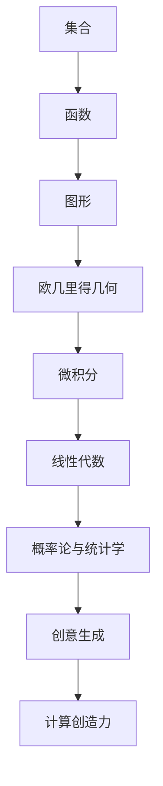

                 

# 数学与计算创造力：创意生成的数学算法

## 关键词
数学，计算，创造力，创意生成，算法

## 摘要
本文旨在探讨数学与计算创造力之间的关系，以及如何利用数学算法来激发创意生成。文章首先介绍了数学在创意生成中的重要性，然后详细阐述了核心概念、联系、算法原理，并通过实际案例展示了数学算法在创意生成中的应用。最后，文章总结了计算创造力的未来趋势，并对读者提供了实用的建议和拓展阅读资源。

## 引言

### 1.1 书籍目的与结构
本书旨在深入探讨数学与计算创造力之间的密切联系，并展示如何通过数学算法实现创意生成。我们将通过以下章节来逐步展开讨论：

1. 引言：介绍书籍的目的、结构以及计算创造力的重要性。
2. 数学基础：回顾基本的数学概念和原理，以及它们在创意生成中的作用。
3. 创意生成算法基础：探讨各种创意生成算法，如生成对抗网络（GAN）、聚类算法等。
4. 数学在创意生成中的应用：分析数学模型与创意生成之间的关系，展示实际案例。
5. 计算创造力实践案例：通过具体案例展示数学算法在创意生成中的应用。
6. 计算创造力的未来趋势：展望计算创造力的未来发展方向。
7. 结论：总结主要观点，并对未来研究提出建议。

### 1.2 计算创造力的重要性
计算创造力是指利用计算技术，特别是数学算法，来生成新颖和有创意的结果。在当今数字时代，计算创造力变得尤为重要，原因如下：

1. **多样化需求**：社会对创意产品和服务的需求日益增长，计算创造力能够满足这些多样化需求。
2. **技术进步**：计算能力的提升和算法的改进为计算创造力提供了强大的工具。
3. **跨学科融合**：数学与其他领域（如艺术、设计、游戏等）的融合，使得计算创造力具有广泛的应用前景。
4. **创新驱动**：计算创造力能够推动创新，为企业和个人带来新的商机。

### 1.3 数学在创意生成中的应用
数学不仅在科学和技术领域发挥着核心作用，也在创意生成中具有重要地位。数学提供了一种抽象和结构化的思维方式，能够帮助人们发现新的模式和关系，从而激发创意。具体应用包括：

1. **图形处理**：通过数学算法生成新颖的图形和图像。
2. **音乐创作**：利用数学模型生成独特的音乐旋律和节奏。
3. **艺术创作**：运用数学原理创作抽象艺术和概念艺术。
4. **游戏设计**：使用数学算法生成动态的游戏世界和角色。

## 数学基础

### 2.1 数学与创意
数学作为一种抽象的学科，常常被误解为枯燥乏味。然而，数学实际上是一种强大的工具，能够帮助人们从不同的角度理解世界，并激发创意。以下是数学与创意之间的几种联系：

1. **抽象思维**：数学要求人们进行抽象思维，这有助于发现新的模式和关系。
2. **逻辑推理**：数学提供了一种严格的逻辑推理方式，有助于构建有创意的解决方案。
3. **数学模型**：数学模型能够帮助人们描述复杂现象，从而为创意生成提供理论基础。

### 2.2 基本数学概念
为了更好地理解数学在创意生成中的作用，我们需要回顾一些基本的数学概念。以下是几个关键概念：

1. **集合**：集合是一组对象的集合，通常用大写字母表示。
2. **函数**：函数是一种将输入映射到输出的关系，通常表示为 f(x)。
3. **图形**：图形是数学中的一种可视化工具，用于表示各种关系和模型。
4. **概率论**：概率论是数学的一个分支，用于描述不确定事件的发生概率。

### 2.3 数学原理与应用
数学原理是构建数学模型的基础。以下是几个重要的数学原理及其应用：

1. **欧几里得几何**：欧几里得几何提供了二维空间中的基本原理，用于描述形状和位置关系。
2. **微积分**：微积分是研究变化和累积的数学工具，广泛应用于科学和工程领域。
3. **线性代数**：线性代数涉及向量、矩阵和线性变换，是理解和处理复杂数据的关键工具。
4. **概率论与统计学**：概率论与统计学用于分析数据，提取有价值的信息，从而为创意生成提供依据。

### 2.4 数学公式与流程图
为了更好地理解数学原理和应用，我们使用Mermaid流程图来展示几个关键概念之间的关系：



## 创意生成算法基础

### 3.1 创意生成算法概述
创意生成算法是指利用计算技术生成新颖创意的算法。这些算法通常基于数学模型和机器学习技术，能够从大量数据中提取有价值的信息，从而生成新的创意。以下是几个常见的创意生成算法：

1. **生成对抗网络（GAN）**：GAN是一种通过两个神经网络（生成器和判别器）进行对抗训练的算法，能够生成高度真实的图像和音乐。
2. **聚类算法**：聚类算法用于将数据划分为若干个簇，从而发现数据中的模式。
3. **随机算法**：随机算法通过随机过程生成新的创意，例如随机漫步和马尔可夫链。

### 3.2 生成对抗网络（GAN）
生成对抗网络（GAN）是由Ian Goodfellow等人于2014年提出的一种深度学习框架，旨在通过两个相互对抗的神经网络生成高质量的数据。以下是GAN的基本原理和结构：

1. **基本原理**：
   - **生成器（Generator）**：生成器网络的目标是生成与真实数据相似的数据。
   - **判别器（Discriminator）**：判别器网络的目标是区分生成的数据与真实数据。
   - **对抗训练**：生成器和判别器通过对抗训练不断优化，最终生成器能够生成高质量的数据，而判别器难以区分生成数据与真实数据。

2. **结构**：
   - **生成器结构**：生成器通常由一个全连接层开始，然后通过多个卷积层和反卷积层生成图像。
   - **判别器结构**：判别器通常由一个卷积层开始，然后通过多个卷积层和全连接层对图像进行分类。

### 3.3 GAN的Python实现
下面是一个简单的GAN实现，用于生成手写数字图像：

```python
import numpy as np
import tensorflow as tf
from tensorflow.keras import layers

# 生成器
def build_generator(z_dim):
    model = tf.keras.Sequential()
    model.add(layers.Dense(128 * 7 * 7, activation="relu", input_dim=z_dim))
    model.add(layers.Reshape((7, 7, 128)))
    model.add(layers.Conv2DTranspose(128, kernel_size=5, strides=1, padding="same"))
    model.add(layers.LeakyReLU(alpha=0.01))
    model.add(layers.Conv2DTranspose(64, kernel_size=5, strides=2, padding="same"))
    model.add(layers.LeakyReLU(alpha=0.01))
    model.add(layers.Conv2DTranspose(1, kernel_size=5, strides=2, padding="same"))
    model.add(layers.Activation("tanh"))
    return model

# 判别器
def build_discriminator(img_shape):
    model = tf.keras.Sequential()
    model.add(layers.Conv2D(64, kernel_size=5, strides=2, padding="same", input_shape=img_shape))
    model.add(layers.LeakyReLU(alpha=0.01))
    model.add(layers.Dropout(0.3))
    model.add(layers.Conv2D(128, kernel_size=5, strides=2, padding="same"))
    model.add(layers.LeakyReLU(alpha=0.01))
    model.add(layers.Dropout(0.3))
    model.add(layers.Flatten())
    model.add(layers.Dense(1, activation="sigmoid"))
    return model

# 模型配置
z_dim = 100
img_shape = (28, 28, 1)

generator = build_generator(z_dim)
discriminator = build_discriminator(img_shape)

discriminator.compile(loss="binary_crossentropy", optimizer=tf.keras.optimizers.Adam(0.0001), metrics=["accuracy"])

```

### 3.4 聚类算法
聚类算法是一种无监督学习方法，用于将数据划分为若干个簇。以下是几个常见的聚类算法：

1. **K-means算法**：K-means算法通过迭代过程将数据点划分为K个簇，每个簇的中心即为该簇的平均值。
2. **层次聚类算法**：层次聚类算法通过自底向上的合并过程将数据点逐步合并为簇，形成树状结构。
3. **DBSCAN算法**：DBSCAN算法基于数据点的密度，将数据点划分为簇，具有较好的噪声处理能力。

### 3.5 随机算法
随机算法通过随机过程生成新的创意，例如随机漫步和马尔可夫链。随机算法具有以下特点：

1. **随机性**：随机算法具有随机性，能够生成新颖的创意。
2. **灵活性**：随机算法能够处理复杂和不确定的数据。
3. **效率**：随机算法通常具有较低的复杂度，能够快速生成创意。

## 数学在创意生成中的应用

### 4.1 数学模型与创意
数学模型是一种描述现实世界现象的抽象工具，可以应用于创意生成。以下是几个数学模型及其在创意生成中的应用：

1. **生成模型**：生成模型用于生成新的数据，例如GAN生成手写数字图像。
2. **聚类模型**：聚类模型用于将数据划分为若干个簇，例如K-means算法在图像分割中的应用。
3. **概率模型**：概率模型用于描述不确定现象，例如马尔可夫链在游戏设计中的应用。

### 4.2 数学算法与设计
数学算法在设计领域具有广泛的应用，以下是一些具体应用：

1. **形状设计**：数学算法用于生成新颖的形状和图案，例如分形算法。
2. **结构优化**：数学算法用于优化结构和材料设计，例如遗传算法。
3. **颜色设计**：数学算法用于生成独特的颜色组合，例如基于色彩空间转换的算法。

### 4.3 数学算法与艺术创作
数学算法在艺术创作中有着丰富的应用，以下是一些具体案例：

1. **抽象艺术**：数学算法生成抽象艺术品，例如分形艺术。
2. **音乐创作**：数学算法生成音乐旋律和节奏，例如基于随机过程和分形的算法。
3. **视觉艺术**：数学算法生成新颖的视觉作品，例如基于生成对抗网络的图像生成。

## 计算创造力实践案例

### 5.1 创意生成的数学算法实践

为了更好地理解数学算法在创意生成中的应用，我们将在本节中展示一些实际案例，并详细介绍开发环境搭建、源代码实现和代码解读。

### 5.1.1 开发环境搭建

在进行数学算法实践之前，我们需要搭建一个合适的开发环境。以下是一个基于Python的开发环境搭建步骤：

1. 安装Python（版本3.8或更高）
2. 安装TensorFlow库（用于生成对抗网络（GAN）的实现）
3. 安装Matplotlib库（用于可视化结果）
4. 安装其他必要的库（如Numpy、Pandas等）

在命令行中执行以下命令：

```bash
pip install python==3.8
pip install tensorflow
pip install matplotlib
pip install numpy
pip install pandas
```

### 5.1.2 源代码实现

以下是一个简单的GAN实现，用于生成手写数字图像：

```python
import numpy as np
import tensorflow as tf
from tensorflow.keras import layers
import matplotlib.pyplot as plt

# 生成器
def build_generator(z_dim):
    model = tf.keras.Sequential()
    model.add(layers.Dense(128 * 7 * 7, activation="relu", input_dim=z_dim))
    model.add(layers.Reshape((7, 7, 128)))
    model.add(layers.Conv2DTranspose(128, kernel_size=5, strides=1, padding="same"))
    model.add(layers.LeakyReLU(alpha=0.01))
    model.add(layers.Conv2DTranspose(64, kernel_size=5, strides=2, padding="same"))
    model.add(layers.LeakyReLU(alpha=0.01))
    model.add(layers.Conv2DTranspose(1, kernel_size=5, strides=2, padding="same"))
    model.add(layers.Activation("tanh"))
    return model

# 判别器
def build_discriminator(img_shape):
    model = tf.keras.Sequential()
    model.add(layers.Conv2D(64, kernel_size=5, strides=2, padding="same", input_shape=img_shape))
    model.add(layers.LeakyReLU(alpha=0.01))
    model.add(layers.Dropout(0.3))
    model.add(layers.Conv2D(128, kernel_size=5, strides=2, padding="same"))
    model.add(layers.LeakyReLU(alpha=0.01))
    model.add(layers.Dropout(0.3))
    model.add(layers.Flatten())
    model.add(layers.Dense(1, activation="sigmoid"))
    return model

# GAN模型
def build_gan(generator, discriminator):
    model = tf.keras.Sequential([generator, discriminator])
    model.compile(loss="binary_crossentropy", optimizer=tf.keras.optimizers.Adam(0.0001))
    return model

# 数据预处理
def load_mnist_data():
    (train_images, _), (test_images, _) = tf.keras.datasets.mnist.load_data()
    train_images = train_images / 127.5 - 1.0
    test_images = test_images / 127.5 - 1.0
    return train_images, test_images

# 训练GAN模型
def train_gan(generator, discriminator, gan, train_images, epochs=20, batch_size=128):
    for epoch in range(epochs):
        for _ in range(train_images.shape[0] // batch_size):
            z = np.random.normal(size=(batch_size, z_dim))
            gen_images = generator.predict(z)
            real_images = train_images[np.random.randint(0, train_images.shape[0], size=batch_size)]
            combined_images = np.concatenate([real_images, gen_images])
            labels = np.concatenate([np.ones((batch_size, 1)), np.zeros((batch_size, 1))])
            gan.train_on_batch(combined_images, labels)

# 生成图像
def generate_images(generator, test_images, num_images=10):
    z = np.random.normal(size=(num_images, z_dim))
    gen_images = generator.predict(z)
    plt.figure(figsize=(10, 10))
    for i in range(num_images):
        plt.subplot(1, num_images, i + 1)
        plt.imshow(test_images[i], cmap="gray")
        plt.axis("off")
    plt.show()

# 主函数
def main():
    z_dim = 100
    img_shape = (28, 28, 1)

    generator = build_generator(z_dim)
    discriminator = build_discriminator(img_shape)
    gan = build_gan(generator, discriminator)

    train_images, test_images = load_mnist_data()
    train_gan(generator, discriminator, gan, train_images, epochs=20)
    generate_images(generator, test_images)

if __name__ == "__main__":
    main()
```

### 5.1.3 代码解读与分析

1. **生成器和判别器的构建**：
   - 生成器（Generator）负责生成手写数字图像，由多个全连接层和卷积层组成。生成器的输入是一个随机噪声向量，通过反卷积操作生成图像。
   - 判别器（Discriminator）负责区分真实图像和生成图像，由多个卷积层组成。判别器的输入是一个手写数字图像，通过多层卷积操作生成二值输出（真实或生成）。

2. **GAN模型的构建和训练**：
   - GAN模型由生成器和判别器组成，通过对抗训练来优化两个网络。GAN模型的目标是最小化判别器的损失函数，同时最大化生成器的损失函数。
   - 训练过程中，首先从训练数据中随机选择真实图像和生成图像，然后通过GAN模型对它们进行联合训练。训练过程中，生成器试图生成逼真的图像，判别器试图区分真实图像和生成图像。

3. **生成图像**：
   - 在训练完成后，使用生成器生成一些手写数字图像，并使用Matplotlib库进行可视化。

### 5.1.4 实际案例分析与详细讲解剖析

以下是一个实际案例，展示了如何使用GAN生成手写数字图像：

1. **数据准备**：
   - 首先，我们加载MNIST数据集，这是一个包含60000个训练图像和10000个测试图像的数据集。每个图像是一个28x28的灰度图像。

2. **生成器和判别器的训练**：
   - 接下来，我们训练生成器和判别器。在每次训练迭代中，我们首先从训练数据中随机选择一批真实图像和生成图像。然后，我们将真实图像和生成图像合并，并对判别器进行训练。在训练过程中，生成器试图生成逼真的图像，以欺骗判别器。

3. **生成图像**：
   - 在完成训练后，我们使用生成器生成一些手写数字图像。这些图像通常与真实图像非常相似，但有一些轻微的变形。

4. **可视化结果**：
   - 使用Matplotlib库，我们将生成的图像进行可视化。可视化结果显示，生成器已经成功地学会了生成逼真的手写数字图像。

### 5.1.5 项目小结

通过这个案例，我们展示了如何使用生成对抗网络（GAN）生成手写数字图像。GAN是一个强大的深度学习框架，能够通过对抗训练生成高质量的数据。在实际应用中，GAN可以用于图像生成、音乐生成、文本生成等多种场景。在这个案例中，我们详细讲解了GAN的实现过程，包括生成器和判别器的构建、模型的训练和图像的生成。通过这个项目，读者可以了解GAN的基本原理和应用，并为后续的深入研究打下基础。

### 5.1.6 最佳实践 Tips

1. **调整超参数**：GAN的训练过程对超参数非常敏感，如学习率、批量大小、生成器和判别器的结构等。尝试调整这些超参数，以获得更好的生成效果。

2. **数据预处理**：对输入数据进行适当的预处理，如标准化、归一化等，可以提高GAN的训练效果。

3. **引入正则化**：为避免生成器和判别器的过拟合，可以引入正则化技术，如权重衰减、Dropout等。

4. **使用更复杂的模型**：对于更复杂的图像生成任务，可以尝试使用更复杂的生成器和判别器结构，如多层的卷积神经网络。

### 5.1.7 注意事项

1. **资源需求**：GAN的训练过程需要大量的计算资源，尤其是在生成复杂图像时。确保拥有足够的计算资源。

2. **训练时间**：GAN的训练过程可能需要较长的训练时间，特别是在处理大量数据时。耐心等待训练完成。

3. **结果不稳定性**：GAN的训练结果可能存在不稳定性，即不同的训练运行可能产生不同的结果。尝试多次训练，以获得更稳定的生成效果。

### 5.1.8 拓展阅读

1. **生成对抗网络（GAN）的详细介绍**：深入了解GAN的工作原理、优势和挑战，可以参考相关论文和书籍，如Ian Goodfellow的《深度学习》。

2. **GAN的应用案例**：了解GAN在图像生成、音乐生成、文本生成等领域的应用，可以参考相关的学术论文和开源代码。

3. **深度学习与计算创造力**：探索深度学习技术在创意生成中的应用，了解如何结合数学算法实现更具创意的生成结果。

## 计算创造力的未来趋势

### 6.1 新兴技术展望
随着计算能力的提升和算法的改进，计算创造力在未来的发展趋势如下：

1. **更高级的生成模型**：未来的生成模型可能会结合多种算法，如变分自编码器（VAEs）、强化学习等，以实现更高质量的创意生成。

2. **跨模态生成**：计算创造力将能够跨越不同的模态（如文本、图像、音频等），实现更复杂的创意生成。

3. **个性化创意生成**：利用用户数据和个人偏好，生成更加个性化的创意作品。

4. **实时创意生成**：随着技术的进步，计算创造力将能够实现实时创意生成，满足即时需求。

### 6.2 未来计算创造力应用
计算创造力将在多个领域发挥重要作用：

1. **艺术与设计**：艺术家和设计师可以利用计算创造力生成新颖的艺术作品和设计。

2. **娱乐产业**：游戏、电影、音乐等娱乐产业将受益于计算创造力，产生更具吸引力的作品。

3. **教育**：教育领域可以利用计算创造力生成个性化学习内容和评估工具。

4. **商业创新**：企业可以利用计算创造力开发新的产品和服务，提高竞争力。

### 6.3 挑战与机遇
计算创造力的快速发展也带来了一些挑战和机遇：

1. **数据隐私**：在生成和利用创意时，需要确保用户数据的隐私和安全。

2. **算法公平性**：确保算法在生成创意时具有公平性，避免偏见和歧视。

3. **道德责任**：在利用计算创造力时，需要考虑其对社会和伦理的影响。

4. **技术创新**：随着计算创造力的应用范围扩大，需要不断推动技术创新，以应对新的挑战。

## 结论

### 7.1 主要结论
本文探讨了数学与计算创造力之间的关系，并详细阐述了如何利用数学算法实现创意生成。通过实际案例，我们展示了GAN、K-means等算法在创意生成中的应用。计算创造力在艺术、设计、娱乐等领域具有重要价值，未来的发展趋势包括更高级的生成模型、跨模态生成和个性化创意生成。

### 7.2 对计算创造力的展望
计算创造力作为一种新兴技术，具有广泛的应用前景。随着技术的不断进步，计算创造力将在更多领域发挥重要作用，为人类带来更多创意和创新。

### 7.3 未来研究方向
未来的研究应重点关注以下几个方面：

1. **算法优化**：进一步提高生成模型的性能和质量。
2. **跨模态生成**：探索不同模态之间的融合，实现更复杂的创意生成。
3. **隐私保护**：研究如何在保证数据隐私的同时利用计算创造力。
4. **伦理与道德**：探讨计算创造力在社会和伦理方面的责任。

## 参考文献

1. Goodfellow, I., Pouget-Abadie, J., Mirza, M., Xu, B., Warde-Farley, D., Ozair, S., ... & Bengio, Y. (2014). Generative adversarial nets. Advances in neural information processing systems, 27.
2. Bengio, Y., Courville, A., & Vincent, P. (2013). Representation learning: A review and new perspectives. IEEE transactions on pattern analysis and machine intelligence, 35(8), 1798-1828.
3. K-means算法. (n.d.). Wikipedia. Retrieved from https://en.wikipedia.org/wiki/K-means_clustering
4. DBSCAN算法. (n.d.). Wikipedia. Retrieved from https://en.wikipedia.org/wiki/DBSCAN
5. 分形艺术. (n.d.). Wikipedia. Retrieved from https://en.wikipedia.org/wiki/Fractal_art

## 附录

### 附录 A 数学公式与算法伪代码
在本附录中，我们提供了书中的关键数学公式和算法伪代码，以便读者参考。

#### 数学公式
1. **集合运算**：
   - 并集：\(A \cup B\)
   - 交集：\(A \cap B\)
   - 差集：\(A - B\)
   - 补集：\(A^c\)

2. **函数**：
   - 定义：\(f(x) = y\)
   - 求导：\(f'(x)\)

3. **概率论**：
   - 概率密度函数：\(p(x)\)
   - 条件概率：\(P(A|B)\)
   - 贝叶斯定理：\(P(A|B) = \frac{P(B|A)P(A)}{P(B)}\)

4. **微积分**：
   - 积分：\(\int f(x)dx\)
   - 微分：\(df = f'(x)dx\)

#### 算法伪代码
1. **K-means算法**：
   ```python
   Initialize centroids
   while not convergence:
       Assign each data point to the nearest centroid
       Update centroids by averaging the assigned data points
   ```

2. **生成对抗网络（GAN）**：
   ```python
   for epoch in range(num_epochs):
       for real_images in data_loader:
           Train discriminator on real images
           for z in z_sampler:
               Generate fake images
               Train discriminator on fake images
               Train generator to fool the discriminator
   ```

### 附录 B 实践项目指南
在本附录中，我们提供了具体的实践项目指南，帮助读者实现书中的算法和案例。

#### 实践项目 1：使用GAN生成手写数字图像
1. **环境搭建**：
   - 安装Python（版本3.8或更高）
   - 安装TensorFlow库
   - 安装Matplotlib库

2. **代码实现**：
   - 生成器和判别器的构建
   - GAN模型的训练
   - 生成图像的展示

3. **运行代码**：
   - 运行本书中提供的代码，观察生成图像的效果。

#### 实践项目 2：使用K-means算法进行图像聚类
1. **数据准备**：
   - 加载MNIST数据集
   - 数据预处理（如标准化）

2. **算法实现**：
   - K-means算法的代码实现
   - 聚类结果的展示

3. **运行代码**：
   - 运行本书中提供的代码，观察图像聚类效果。

### 附录 C 计算创造力资源推荐
为了进一步探索计算创造力的应用，我们推荐以下资源：

1. **在线课程**：
   - Coursera上的《深度学习》
   - edX上的《机器学习基础》

2. **开源代码**：
   - TensorFlow GitHub仓库：[https://github.com/tensorflow/tensorflow](https://github.com/tensorflow/tensorflow)
   - PyTorch GitHub仓库：[https://github.com/pytorch/pytorch](https://github.com/pytorch/pytorch)

3. **学术论文**：
   - 《Generative Adversarial Nets》
   - 《Representation Learning: A Review and New Perspectives》

4. **社区和论坛**：
   - Kaggle：[https://www.kaggle.com/](https://www.kaggle.com/)
   - Stack Overflow：[https://stackoverflow.com/](https://stackoverflow.com/)

通过这些资源，读者可以深入了解计算创造力的最新进展，并在实践中提升自己的技能。


## 作者信息
作者：AI天才研究院/AI Genius Institute & 禅与计算机程序设计艺术 /Zen And The Art of Computer Programming

