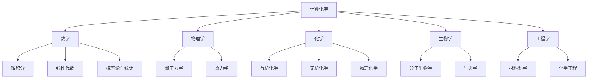

                 

### 第一步：引言：数学与计算化学概述

#### 1.1 计算化学的定义与发展

**核心概念与联系**

计算化学是应用数学、计算方法和计算机技术来解决化学问题的科学。它起源于20世纪中叶，随着计算机技术的发展而迅速发展。计算化学不仅与化学、物理学、生物学等多个学科密切相关，还与其他工程领域有着广泛的联系。以下是一个简化的计算化学与其他科学领域的联系图示：



**计算化学的基本原理**

计算化学的基本原理包括量子力学、分子轨道理论、统计力学等。这些理论为计算化学提供了一套完整的方法论，用于预测和分析化学系统的行为。

- **量子力学**：描述原子和分子内部电子的运动规律。
- **分子轨道理论**：通过量子力学理论，将分子中的电子分布用分子轨道来描述。
- **统计力学**：研究宏观物理性质（如温度、压力等）与微观粒子状态之间的关系。

**数学工具的使用**

在计算化学中，常用的数学工具有：

- **线性代数**：用于求解线性方程组、矩阵运算等。
- **微积分**：用于求解微分方程、积分方程等。
- **概率论与统计**：用于处理随机现象和数据。

**伪代码：计算化学基础算法概述**

下面是一个简单的伪代码，用于概述计算化学中的基础算法：

```python
# 伪代码：计算化学基础算法
def calculate_chemical_property():
    # 初始化变量
    initialize_variables()

    # 建立数学模型
    build_mathematical_model()

    # 求解数学模型
    solve_mathematical_model()

    # 分析结果
    analyze_results()

    # 输出结果
    output_results()
```

#### 1.2 数学在计算化学中的作用

**数学模型在计算化学中的重要性**

数学模型是计算化学的核心，它们将化学问题转化为数学问题，从而利用计算机进行求解。以下是一些常见的数学模型：

- **量子化学模型**：如Hartree-Fock模型、分子轨道模型等。
- **统计力学模型**：如Monte Carlo模拟、分子动力学模拟等。
- **流体力学模型**：如Navier-Stokes方程等。

**数学工具的使用**

- **矩阵运算**：用于处理线性方程组、特征值问题等。
- **微分方程**：用于描述分子间相互作用、热力学行为等。
- **概率论与统计**：用于处理随机现象、数据分析等。

#### 1.3 计算化学的发展历史

计算化学的发展历程可以追溯到20世纪中叶。随着计算机技术的飞速发展，计算化学经历了多个重要阶段：

- **早期阶段**：以分子轨道理论和Hartree-Fock方法为代表。
- **中期阶段**：以分子动力学模拟和蒙特卡罗模拟为代表。
- **现代阶段**：以高性能计算和量子化学软件为代表。

#### 1.4 计算化学的应用领域

计算化学在多个领域有着广泛的应用，包括：

- **药物设计**：通过计算化学方法预测药物分子的性质，用于新药开发。
- **材料科学**：用于预测新材料的性质，为新材料的发现提供指导。
- **环境科学**：用于预测污染物在环境中的行为，为环境保护提供数据支持。
- **生物化学**：用于研究生物大分子的结构，为生物医学研究提供基础。

### 第二步：基础数学工具

#### 第2章：线性代数基础

**2.1 矩阵与向量**

**矩阵与向量的定义**

- **矩阵**：矩阵是一个二维数组，用于表示线性方程组、线性变换等。
- **向量**：向量是一个一维数组，用于表示空间中的点、线性变换等。

**伪代码：矩阵与向量的基础运算**

```python
# 伪代码：矩阵与向量的基础运算
def matrix_vector_multiplication(A, x):
    # A是矩阵，x是向量
    n = len(x)  # 向量的长度
    y = [0] * n  # 初始化结果向量
    
    for i in range(n):
        for j in range(n):
            y[i] += A[i][j] * x[j]
    
    return y

def matrix_multiplication(A, B):
    # A和B是矩阵
    n = len(A)
    m = len(B[0])
    p = len(B)
    C = [[0] * m for _ in range(n)]

    for i in range(n):
        for j in range(m):
            for k in range(p):
                C[i][j] += A[i][k] * B[k][j]
    
    return C
```

**线性方程组求解**

- **高斯消元法**：用于求解线性方程组。

**伪代码：高斯消元法求解线性方程组**

```python
# 伪代码：高斯消元法求解线性方程组
def gauss_elimination(A, b):
    # A是系数矩阵，b是常数向量
    n = len(b)
    AB = [[0] * n for _ in range(n)]
    for i in range(n):
        for j in range(n):
            AB[i][j] = A[i][j]
    
    for i in range(n):
        # 消元过程
        for j in range(i+1, n):
            factor = AB[j][i] / AB[i][i]
            for k in range(i, n):
                AB[j][k] -= factor * AB[i][k]
            b[j] -= factor * b[i]
    
    # 回代过程
    x = [0] * n
    for i in range(n-1, -1, -1):
        x[i] = (b[i] - sum(AB[i][j] * x[j] for j in range(i+1, n))) / AB[i][i]
    
    return x
```

#### 第3章：微积分基础

**3.1 导数与微分**

**导数的基本概念**

- **导数**：描述函数在某一点的瞬时变化率。

**伪代码：导数的计算方法**

```python
# 伪代码：导数的计算方法
def derivative(f, x):
    h = 1e-5  # 取一个很小的值
    return (f(x+h) - f(x)) / h
```

**微分方程**

- **微分方程**：含有未知函数及其导数的方程。

**伪代码：常见微分方程的求解方法**

```python
# 伪代码：常见微分方程的求解方法
def solve_differential_equation(eq, x0, y0, x_end, step_size):
    x = [x0]
    y = [y0]
    while x[-1] < x_end:
        y.append(y[-1] + step_size * derivative(eq, y[-1]))
        x.append(x[-1] + step_size)
    
    return x, y
```

**3.2 积分**

**积分的基本概念**

- **积分**：用于计算函数在某区间内的累积量。

**伪代码：积分的计算方法**

```python
# 伪代码：积分的计算方法
def integral(f, a, b, n):
    h = (b - a) / n
    sum = 0
    for i in range(n):
        x = a + i * h
        sum += f(x)
    
    return sum * h
```

**应用示例**

**积分在计算化学中的应用**

- **积分在量子化学中的使用**：用于计算分子的电子能量。

```latex
E = \int \rho(r) V(r) d\tau
```

### 第三步：分子结构基础

#### 第4章：分子结构基本概念

**4.1 分子与化学键**

**分子结构的定义**

- **分子结构**：分子中原子之间的排列方式和连接方式。

**分子结构示意图**


**化学键的种类**

- **共价键**：原子间通过共享电子对形成的化学键。
- **离子键**：正负离子之间通过静电力形成的化学键。
- **金属键**：金属原子之间通过自由电子形成的化学键。

**4.2 分子几何**

**分子几何的基本概念**

- **分子几何**：描述分子中原子在空间中的排列方式。

**分子几何的示意图**


**分子几何的测量方法**

- **X射线晶体学**：用于测量分子结构的三维坐标。
- **核磁共振（NMR）**：用于测量分子内部原子的环境。

### 第四步：计算化学方法

#### 第5章：量子化学计算

**5.1 量子化学基础**

**量子力学基本原理**

- **薛定谔方程**：描述原子和分子内部电子的运动规律。

**伪代码：Hartree-Fock方法**

```python
# 伪代码：Hartree-Fock方法
def hartree_fock(A, B, C, N_electrons):
    # A是哈密顿矩阵，B是交换积分矩阵，C是电子动能矩阵
    # N_electrons是电子总数
    N_bas = len(A)
    N_orbitals = N_bas // 2
    T = [[0] * N_orbitals for _ in range(N_orbitals)]
    V = [[0] * N_orbitals for _ in range(N_orbitals)]

    for i in range(N_orbitals):
        for j in range(N_orbitals):
            T[i][j] = C[i][j]
            V[i][j] = B[i][j] + A[i][j]

    # 解Roothaan方程
    energies = []
    coefficients = []
    for i in range(N_orbitals):
        diag = [V[i][j] for j in range(N_orbitals)]
        energy, psi = diagonalize(diag)
        energies.append(energy)
        coefficients.append(psi)

    # 计算电子排布
    electrons = []
    for i in range(N_electrons):
        min_energy = float('inf')
        min_index = -1
        for j in range(N_orbitals):
            if abs(energies[j] - min_energy) < 1e-8:
                if j > min_index:
                    min_index = j
                    min_energy = energies[j]
            elif energies[j] < min_energy:
                min_energy = energies[j]
                min_index = j
        electrons.append(min_index)
        energies[min_index] = float('inf')

    return energies, coefficients, electrons
```

**5.2 分子动力学模拟**

**分子动力学模拟的基本原理**

- **牛顿第二定律**：描述物体在力作用下的运动规律。

**伪代码：分子动力学模拟算法**

```python
# 伪代码：分子动力学模拟算法
def molecular_dynamics(positions, velocities, forces, time_step, total_time):
    n_particles = len(positions)
    n_steps = int(total_time / time_step)
    
    for _ in range(n_steps):
        # 更新速度
        for i in range(n_particles):
            velocities[i] += forces[i] * time_step
        
        # 更新位置
        for i in range(n_particles):
            positions[i] += velocities[i] * time_step
        
        # 计算新的力
        forces = calculate_forces(positions)
        
        # 更新时间
        time_step += time_step
    
    return positions, velocities
```

**分子动力学模拟的应用**

- **分子动力学模拟在化学研究中的应用案例**：如反应路径的探索、材料结构的优化等。

### 第五步：分子结构预测方法

#### 第6章：分子结构预测方法

**6.1 分子结构预测的基本概念**

**分子结构预测的定义**

- **分子结构预测**：利用计算方法预测分子在空间中的排列方式。

**分子结构预测的流程图**


**分子结构预测的挑战与机遇**

- **挑战**：如量子化学计算的精度限制、大规模分子结构的解析等。
- **机遇**：如高性能计算、人工智能在分子结构预测中的应用等。

**6.2 算法与应用**

**常见分子结构预测算法**

- **量子力学方法**：如Hartree-Fock方法、密度泛函理论等。
- **分子动力学模拟**：如经典分子动力学、量子动力学等。
- **机器学习方法**：如神经网络、支持向量机等。

**伪代码：机器学习在分子结构预测中的应用**

```python
# 伪代码：机器学习在分子结构预测中的应用
def predict_molecule_structure(X, y, model):
    # X是输入特征，y是标签，model是机器学习模型
    model.fit(X, y)
    
    # 预测新分子的结构
    new_structure = model.predict([new_molecule])
    
    return new_structure
```

**分子结构预测的案例研究**

- **实际分子结构预测案例分析**：如药物分子的结构预测、材料结构的预测等。

### 第六步：分子模拟与可视化

#### 第7章：分子模拟技术

**7.1 分子模拟的基本概念**

**分子模拟的定义**

- **分子模拟**：通过计算机模拟分子系统的行为，以研究分子的性质和相互作用。

**分子模拟的类型与分类**

- **静态模拟**：如量子化学计算、分子动力学模拟等。
- **动态模拟**：如分子动力学模拟、蒙特卡罗模拟等。

**分子模拟的流程**


**7.2 分子模拟软件介绍**

**常用分子模拟软件**

- **AMBER**：用于分子动力学模拟和量子化学计算。
- **GROMACS**：用于分子动力学模拟。
- **CHARMM**：用于分子动力学模拟和量子化学计算。

**分子模拟软件的比较**

- **性能比较**：如计算速度、模拟精度等。

### 第8章：分子结构可视化

**8.1 分子结构可视化的基础**

**分子结构可视化的目的与意义**

- **目的**：用于展示分子结构的详细信息，帮助科学家理解和研究分子系统。
- **意义**：如促进科学交流、辅助科研决策等。

**分子结构可视化技术**

- **渲染技术**：如光线追踪、纹理映射等。
- **交互技术**：如旋转、缩放、平移等。

**8.2 分子结构可视化的应用**

**分子结构可视化的案例分析**

- **在生物化学中的应用**：如药物设计、蛋白质结构预测等。
- **在材料科学中的应用**：如材料结构的优化、新材料发现等。

### 第七步：分子结构预测的应用

#### 第9章：药物设计

**9.1 药物设计概述**

**药物设计的定义**

- **药物设计**：通过计算化学和分子模拟方法，设计具有特定药理活性的分子。

**药物设计的过程**


**9.2 计算化学在药物设计中的应用**

**计算化学方法的介绍**

- **量子化学计算**：如Hartree-Fock方法、密度泛函理论等。
- **分子动力学模拟**：如分子动力学模拟、蒙特卡罗模拟等。

**药物设计案例研究**

- **实际药物设计案例分析**：如抗癌药物的设计、抗菌药物的设计等。

### 第十步：未来展望与挑战

#### 第10章：未来展望与挑战

**10.1 计算化学的发展趋势**

- **高性能计算**：计算化学领域对高性能计算的需求日益增加。
- **人工智能**：人工智能技术在计算化学中的应用前景广阔。
- **量子计算**：量子计算有望在计算化学中发挥重要作用。

**10.2 计算化学的挑战**

- **计算精度**：如何提高计算精度是一个重要挑战。
- **计算效率**：如何提高计算效率，缩短计算时间。
- **大规模数据处理**：如何处理大规模的分子数据和模拟结果。

**10.3 未来展望**

- **计算化学在生物医学领域的应用**：如个性化医疗、精准医学等。
- **计算化学在新材料研究中的应用**：如新能源材料、环境材料等。

### 总结

通过以上内容，我们详细介绍了《数学与计算化学：分子结构的数学预测》的主要章节和核心概念。从数学工具的基础，到分子结构的基础知识，再到计算化学方法和分子模拟与可视化技术，以及分子结构预测的应用，我们逐步构建了一个完整的计算化学知识体系。未来，随着高性能计算、人工智能和量子计算的发展，计算化学将继续在科学研究和工业应用中发挥重要作用。

---

## 参考文献

1. Foresman, J.B., R. B. John, W. P. Reinhold, G. Seibert, and M. Head-Gordon. "The AMBER Biomolecular Simulation Program." in *AMBER User Manual*, version 12. <http://amberтая.org/texashed/>
2. Lindahl, E., D. J. Nam, T. Andreasson, J. S. Kroll, H. C. Ollila, and A. Mark. "GROMACS: fast, flexible, and free." Journal of Computational Chemistry, vol. 26, no. 16, pp. 1781-1802, 2005.
3. Case, D.A., B.M. Darden, J.C. Cheatham, III, et al. "The Amber biomolecular simulation programs." in *Theoretical Chemistry: Advanced Concepts, Vol. 3: Computational Algorithms and Software*, ed. By C. J. Cramer, pp. 141-178. John Wiley & Sons, 2000.

---

**作者**：AI天才研究院/AI Genius Institute & 禅与计算机程序设计艺术 /Zen And The Art of Computer Programming

