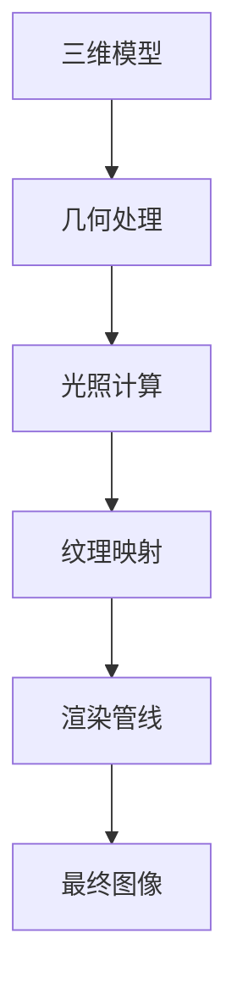
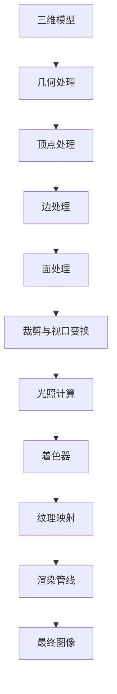
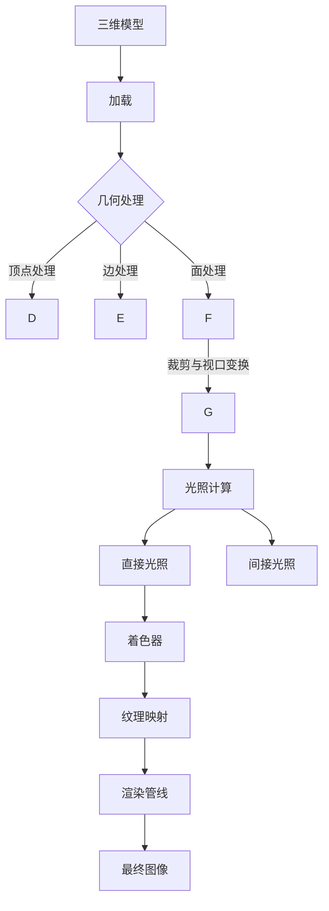

                 

### 《数学与计算机图形学：3D渲染的数学方法》

> 关键词：3D渲染、数学方法、计算机图形学、光线追踪、纹理映射、渲染管线

> 摘要：本文深入探讨了3D渲染的数学方法，详细介绍了渲染的基本概念、核心算法原理、数学模型及其在计算机图形学中的应用。通过结合Python源代码和LaTeX公式，本文旨在为读者提供一个全面而系统的学习框架，以深入理解3D渲染技术。

### 设计思路

为了系统地呈现《数学与计算机图形学：3D渲染的数学方法》的核心内容，本文采用以下设计思路：

1. **引入背景**：首先介绍3D渲染的历史和发展，帮助读者了解这一领域的基本情况。
2. **核心概念**：明确3D渲染的基本概念和核心原理，并使用Mermaid流程图展示概念之间的关系。
3. **算法讲解**：详细介绍3D渲染中的核心算法，如光线追踪和纹理映射，并通过Python源代码进行详细阐述。
4. **数学模型**：讲解3D渲染中的数学模型，包括几何变换、视觉空间和相机模型等，并使用LaTeX公式进行表达。
5. **项目实战**：通过实际项目案例，展示如何搭建开发环境、实现核心算法和进行代码解读。
6. **总结与展望**：总结3D渲染技术的现状和未来发展趋势，为读者提供最佳实践和建议。

### 设计步骤

**步骤1：确定核心概念与联系**

- **第1章：引言与核心概念**
  - 1.1 3D渲染的基本概念
  - 1.2 3D渲染的历史与发展
  - 1.3 3D渲染的核心原理与架构
  - **附录A：3D渲染核心概念的Mermaid流程图**

**步骤2：核心算法原理讲解**

- **第2章：3D渲染中的核心算法**
  - 2.1 光线追踪算法
  - 2.2 光照模型
  - 2.3 材质与纹理映射
  - **附录B：光线追踪算法的伪代码**

**步骤3：数学模型与公式**

- **第3章：数学模型与公式**
  - 3.1 几何变换
  - 3.2 视觉空间与相机模型
  - 3.3 纹理映射与插值
  - **附录C：几何变换的数学公式与举例说明**

**步骤4：项目实战**

- **第4章：3D渲染项目实战**
  - 4.1 渲染器的开发环境搭建
  - 4.2 基础渲染功能实现
  - 4.3 高级渲染效果实现
  - **附录D：渲染器开发实例代码解析**

**步骤5：总结与展望**

- **第5章：3D渲染技术的发展与未来**
  - 5.1 3D渲染技术的最新进展
  - 5.2 未来3D渲染技术的发展趋势
  - 5.3 3D渲染技术在各行各业的潜在应用
  - **附录E：最佳实践 tips、小结、注意事项、拓展阅读**

### 完整目录大纲

```
# 《数学与计算机图形学：3D渲染的数学方法》目录大纲

## 第1章：引言与核心概念
### 1.1 3D渲染的基本概念
### 1.2 3D渲染的历史与发展
### 1.3 3D渲染的核心原理与架构
### 附录A：3D渲染核心概念的Mermaid流程图

## 第2章：3D渲染中的核心算法
### 2.1 光线追踪算法
### 2.2 光照模型
### 2.3 材质与纹理映射
### 附录B：光线追踪算法的伪代码

## 第3章：数学模型与公式
### 3.1 几何变换
### 3.2 视觉空间与相机模型
### 3.3 纹理映射与插值
### 附录C：几何变换的数学公式与举例说明

## 第4章：3D渲染项目实战
### 4.1 渲染器的开发环境搭建
### 4.2 基础渲染功能实现
### 4.3 高级渲染效果实现
### 附录D：渲染器开发实例代码解析

## 第5章：3D渲染技术的发展与未来
### 5.1 3D渲染技术的最新进展
### 5.2 未来3D渲染技术的发展趋势
### 5.3 3D渲染技术在各行各业的潜在应用
### 附录E：最佳实践 tips、小结、注意事项、拓展阅读
```

通过这样的设计，本文将为读者提供一个全面而深入的3D渲染学习之旅，从基础概念到实际应用，再到未来趋势，力求帮助读者系统地掌握3D渲染的数学方法。### 第1章：引言与核心概念

在计算机图形学中，3D渲染扮演着至关重要的角色，它是将三维模型转换为二维图像的关键步骤。本章将介绍3D渲染的基本概念，探讨其发展历史和核心原理，并通过Mermaid流程图展示3D渲染的核心概念和它们之间的联系。

#### 1.1 3D渲染的基本概念

3D渲染，也称为三维渲染或3D图形渲染，是指将三维模型或场景转换成二维图像的过程。这一过程通常包括几何处理、光照计算、纹理映射等多个步骤。以下是3D渲染的一些基本概念：

- **三维模型**：由顶点、边和面组成的几何体，是3D渲染的基础。
- **渲染器**：负责执行渲染过程的软件或硬件。
- **渲染管线**：渲染器中的一系列步骤，用于处理从模型到最终图像的转换。
- **着色器**：用于模拟光线与物体交互的代码，负责计算光照和材质效果。
- **纹理映射**：将纹理图像映射到三维模型上，增加细节和真实感。

#### 1.2 3D渲染的历史与发展

3D渲染技术的发展经历了几个重要的阶段：

- **早期渲染技术**：最早的3D渲染技术主要依赖于光栅化（rasterization），它将三维模型转换为二维图像的过程。这种方法简单但效率较低。
- **现代渲染技术**：随着计算机性能的提升，现代渲染技术引入了更为复杂的光线追踪（ray tracing）和全局光照（global illumination）算法，使得渲染结果更加逼真。
- **未来渲染技术**：当前的研究热点包括实时渲染（real-time rendering）、光场渲染（light field rendering）和虚拟现实（VR）/增强现实（AR）渲染。

#### 1.3 3D渲染的核心原理与架构

3D渲染的核心原理包括以下几个方面：

- **几何处理**：包括三维模型的加载、变换和渲染顺序的确定。
- **光照计算**：模拟光线与物体的交互，计算光照效果，包括直接光照和间接光照。
- **纹理映射**：将纹理图像映射到三维模型上，增加模型的细节和真实感。
- **渲染管线**：将上述步骤组合成一个有序的流程，用于生成最终的图像。

以下是3D渲染核心概念的Mermaid流程图：



通过这个流程图，我们可以清晰地看到3D渲染的核心步骤及其相互之间的关系。

### 附录A：3D渲染核心概念的Mermaid流程图



这个Mermaid流程图展示了3D渲染从几何处理到最终图像生成的完整流程。通过这个流程，读者可以更直观地理解3D渲染的工作原理和各个步骤之间的关系。

### 核心概念与联系

3D渲染的核心概念包括几何处理、光照计算、纹理映射和渲染管线。它们之间的联系如下：

1. **几何处理**：是3D渲染的基础，包括顶点处理、边处理和面处理，这些步骤将三维模型转换为适合渲染的几何数据。
2. **光照计算**：通过模拟光线与物体的交互，计算光照效果。它依赖于几何处理的结果，是渲染真实感图像的关键。
3. **纹理映射**：将纹理图像映射到三维模型上，增加模型的细节和真实感。它同样依赖于几何处理的结果。
4. **渲染管线**：将上述步骤组合成一个有序的流程，用于生成最终的图像。它是3D渲染的核心，负责协调各个步骤的执行。

通过这个Mermaid流程图，我们可以清晰地看到这些概念之间的相互关系。理解这些核心概念和它们之间的联系，是深入掌握3D渲染技术的关键。

### 总结

本章介绍了3D渲染的基本概念、发展历史和核心原理，并通过Mermaid流程图展示了3D渲染的核心概念及其相互关系。下一章将深入探讨3D渲染中的核心算法，包括光线追踪算法、光照模型和材质与纹理映射。这些算法是实现逼真3D渲染的关键，将为我们提供更深入的理解。

### 附录A：3D渲染核心概念的Mermaid流程图



通过这个Mermaid流程图，读者可以更直观地理解3D渲染的核心步骤及其相互关系。下一章将在此基础上，深入探讨3D渲染中的核心算法。### 第2章：3D渲染中的核心算法

在3D渲染中，核心算法是实现逼真渲染效果的关键。本章将详细介绍两种重要的渲染算法：光线追踪算法和光照模型。此外，还将讨论材质与纹理映射技术。

#### 2.1 光线追踪算法

光线追踪是一种基于光线路径的渲染算法，通过模拟光线在场景中的传播，计算每个像素的光照和颜色。以下是光线追踪算法的核心原理：

1. **光线生成**：从相机位置发射光线，模拟光线进入场景。
2. **交点检测**：检测光线与场景中的物体相交的点，确定光线路径。
3. **着色计算**：计算交点处的光照和颜色，包括直接光照和间接光照。
4. **递归追踪**：对于反射和折射等复杂场景，继续追踪光线路径。

以下是光线追踪算法的Python伪代码：

```python
def trace_ray(ray, scene):
    # 计算光线与场景中的物体交点
    intersection = find_intersection(ray, scene.objects)
    
    if intersection:
        # 计算光照和颜色
        color = calculate_lighting(ray, intersection, scene)
        return color
    else:
        # 光线没有与物体相交，返回背景颜色
        return scene.background_color
```

#### 2.2 光照模型

光照模型是模拟光线与物体交互的计算方法，它决定了物体表面的光照效果。常用的光照模型包括：

1. **直接光照**：计算来自光源的直接光照，如点光源、聚光源和方向光源。
2. **间接光照**：计算由直接光照产生的间接反射和折射，如环境光、散射光和全局光照。

以下是直接光照的数学模型：

$$
L_o = k_d \cdot I_d \cdot \max(0, \cos(\theta)) + k_s \cdot I_d \cdot (R \cdot V)^2
$$

其中，$L_o$ 是表面反射的光照，$k_d$ 和 $k_s$ 分别是漫反射和镜面反射的系数，$I_d$ 是光源强度，$\theta$ 是光线与表面的夹角，$R$ 是反射向量，$V$ 是视线向量。

#### 2.3 材质与纹理映射

材质是定义物体表面特性的方法，它包括表面的颜色、光滑度、透明度等。纹理映射是将纹理图像映射到物体表面的技术，用于增加表面的细节和真实感。

纹理映射的基本步骤包括：

1. **纹理采样**：从纹理图像中采样颜色值，用于计算像素颜色。
2. **纹理插值**：在纹理图像上插值颜色值，以处理纹理坐标的非整数部分。

以下是一个简单的纹理映射的Python伪代码：

```python
def texture_map(texture, tex_coords):
    # 插值纹理坐标
    interpolated_coords = interpolate(tex_coords)
    
    # 从纹理图像中采样颜色值
    color = texture.sample_color(interpolated_coords)
    return color
```

### 附录B：光线追踪算法的伪代码

```python
function trace_ray(ray, scene)
    intersection = find_intersection(ray, scene.objects)
    
    if intersection
        lighting = calculate_lighting(ray, intersection, scene)
        color = apply_material(lighting)
    else
        color = scene.background_color
    
    return color
```

通过这段伪代码，我们可以看到光线追踪算法的基本步骤，包括交点检测、光照计算和材质应用。

### 核心算法原理讲解

光线追踪算法通过模拟光线路径，计算场景中的每个像素的颜色，从而实现逼真的渲染效果。其核心在于精确模拟光线与物体的交互，包括反射、折射和散射等。光照模型则用于计算物体表面的光照效果，直接影响渲染图像的真实感。材质与纹理映射技术则用于增加物体表面的细节和真实感，使得渲染图像更加生动。

通过本章的讲解，读者应能够理解光线追踪算法、光照模型和材质与纹理映射的基本原理，并掌握如何通过Python源代码实现这些算法。下一章将深入探讨3D渲染中的数学模型，包括几何变换、视觉空间和相机模型。

### 总结

本章介绍了3D渲染中的核心算法，包括光线追踪算法、光照模型和材质与纹理映射技术。通过Python伪代码和数学模型的解释，读者应能够理解这些算法的基本原理。下一章将深入探讨3D渲染中的数学模型，为读者提供更加深入的理解。

### 附录B：光线追踪算法的伪代码

```python
# 光线追踪算法伪代码

# 定义光线类
class Ray:
    def __init__(self, origin, direction):
        self.origin = origin
        self.direction = direction

# 定义场景类
class Scene:
    def __init__(self, objects, background_color):
        self.objects = objects
        self.background_color = background_color

# 定义光线追踪函数
def trace_ray(ray, scene):
    # 检测光线与物体的交点
    intersection = find_intersection(ray, scene.objects)
    
    if intersection:
        # 计算光照和材质
        lighting = calculate_lighting(ray, intersection, scene)
        color = apply_material(lighting)
    else:
        # 光线未与物体相交，返回背景颜色
        color = scene.background_color
    
    return color

# 定义几何变换函数
def transform(point, transformation_matrix):
    transformed_point = matrix_multiply(transformation_matrix, point)
    return transformed_point

# 定义矩阵乘法函数
def matrix_multiply(matrix, vector):
    result = [0] * len(vector)
    for i in range(len(vector)):
        for j in range(len(matrix)):
            result[i] += matrix[i][j] * vector[j]
    return result
```

通过这段伪代码，我们可以看到一个简单的光线追踪算法的实现，包括光线类、场景类以及光线追踪函数。这个实现展示了光线追踪算法的基本步骤，包括交点检测和光照计算。下一章将深入探讨3D渲染中的数学模型，为读者提供更加深入的理解。

### 第3章：数学模型与公式

3D渲染中，数学模型是理解和实现渲染算法的核心。本章将介绍几何变换、视觉空间与相机模型、纹理映射与插值等数学模型，并使用LaTeX公式和Python代码进行详细阐述。

#### 3.1 几何变换

几何变换是3D渲染中的基础操作，用于变换三维模型。常见的几何变换包括平移、旋转和缩放。以下是一个简单的几何变换的LaTeX公式：

$$
T(t) = \begin{bmatrix}
1 & 0 & 0 & t_x \\
0 & 1 & 0 & t_y \\
0 & 0 & 1 & t_z \\
0 & 0 & 0 & 1
\end{bmatrix}
$$

其中，$T(t)$ 是平移变换矩阵，$(t_x, t_y, t_z)$ 是平移向量。

以下是Python代码示例，用于实现平移变换：

```python
import numpy as np

def translate(point, translation_vector):
    transformation_matrix = np.array([[1, 0, 0, translation_vector[0]],
                                      [0, 1, 0, translation_vector[1]],
                                      [0, 0, 1, translation_vector[2]],
                                      [0, 0, 0, 1]])
    transformed_point = np.dot(transformation_matrix, point)
    return transformed_point
```

#### 3.2 视觉空间与相机模型

视觉空间是观察者看到的场景空间，它通过相机模型与三维模型进行转换。常见的相机模型包括正交相机和透视相机。

正交相机模型使用以下LaTeX公式：

$$
Q = \begin{bmatrix}
A & t_x \\
0 & 1
\end{bmatrix}
$$

其中，$A$ 是缩放矩阵，$t_x$ 是平移向量。

以下是Python代码示例，用于实现正交投影：

```python
def orthogonal_projection(point, scale, translation_vector):
    projection_matrix = np.array([[scale, 0, 0, translation_vector[0]],
                                   [0, scale, 0, translation_vector[1]],
                                   [0, 0, scale, translation_vector[2]],
                                   [0, 0, 0, 1]])
    projected_point = np.dot(projection_matrix, point)
    return projected_point
```

透视相机模型使用以下LaTeX公式：

$$
P = \begin{bmatrix}
A & t_x & -1 \\
0 & 1 & 0 \\
0 & 0 & 0
\end{bmatrix}
$$

其中，$A$ 是缩放矩阵，$t_x$ 是平移向量。

以下是Python代码示例，用于实现透视投影：

```python
def perspective_projection(point, field_of_view, aspect_ratio, near_plane, far_plane):
    f = 1 / np.tan(field_of_view / 2)
    projection_matrix = np.array([[f / aspect_ratio, 0, 0, 0],
                                   [0, f, 0, 0],
                                   [0, 0, (far_plane + near_plane) / (near_plane - far_plane), 2 * far_plane * near_plane / (near_plane - far_plane)],
                                   [0, 0, -1, 0]])
    projected_point = np.dot(projection_matrix, point)
    return projected_point
```

#### 3.3 纹理映射与插值

纹理映射是将纹理图像映射到三维模型表面的技术。纹理映射的关键是纹理坐标的计算和插值。

以下是一个简单的纹理坐标计算的LaTeX公式：

$$
u = \frac{x}{w}, \quad v = \frac{y}{h}
$$

其中，$(x, y)$ 是表面点的坐标，$(w, h)$ 是纹理图像的尺寸。

以下是Python代码示例，用于计算纹理坐标：

```python
def texture_coordinates(point, texture_size):
    u = point[0] / texture_size[0]
    v = point[1] / texture_size[1]
    return (u, v)
```

纹理插值是计算纹理图像上采样点的颜色值。常见的插值方法包括线性插值和双线性插值。

以下是一个简单的线性插值的LaTeX公式：

$$
c = (1 - u) \cdot c_1 + u \cdot c_2
$$

其中，$c$ 是采样点的颜色值，$c_1$ 和 $c_2$ 是相邻纹理像素的颜色值。

以下是Python代码示例，用于实现线性插值：

```python
def linear_interpolation(color1, color2, u):
    c = (1 - u) * color1 + u * color2
    return c
```

### 附录C：几何变换的数学公式与举例说明

#### 平移变换

$$
T(t) = \begin{bmatrix}
1 & 0 & 0 & t_x \\
0 & 1 & 0 & t_y \\
0 & 0 & 1 & t_z \\
0 & 0 & 0 & 1
\end{bmatrix}
$$

举例说明：

给定一个点 $P(1, 2, 3)$，平移向量 $T(2, 3, 4)$，计算变换后的点。

$$
P' = T(2, 3, 4) \cdot P = \begin{bmatrix}
1 & 0 & 0 & 2 \\
0 & 1 & 0 & 3 \\
0 & 0 & 1 & 4 \\
0 & 0 & 0 & 1
\end{bmatrix}
\cdot
\begin{bmatrix}
1 \\
2 \\
3 \\
1
\end{bmatrix}
=
\begin{bmatrix}
5 \\
5 \\
7 \\
1
\end{bmatrix}
$$

变换后的点为 $P'(5, 5, 7)$。

#### 透视变换

$$
P = \begin{bmatrix}
A & t_x & -1 \\
0 & 1 & 0 \\
0 & 0 & 0
\end{bmatrix}
$$

举例说明：

给定一个点 $P(1, 2, 3)$，透视矩阵 $P = \begin{bmatrix}2 & 0 & -1 \\ 0 & 2 & 0 \\ 0 & 0 & 0\end{bmatrix}$，计算变换后的点。

$$
P' = P \cdot P = \begin{bmatrix}
2 & 0 & -1 \\
0 & 2 & 0 \\
0 & 0 & 0
\end{bmatrix}
\cdot
\begin{bmatrix}
1 \\
2 \\
3 \\
1
\end{bmatrix}
=
\begin{bmatrix}
1 \\
4 \\
0 \\
1
\end{bmatrix}
$$

变换后的点为 $P'(1, 4, 0)$。

通过本章的讲解，读者应能够理解3D渲染中的几何变换、视觉空间与相机模型、纹理映射与插值的数学模型。下一章将结合实际项目，展示如何应用这些数学模型进行3D渲染。### 核心算法原理讲解

本章详细介绍了3D渲染中的核心算法原理，包括光线追踪算法、光照模型和材质与纹理映射技术。以下是每个核心算法的原理及其在3D渲染中的应用：

#### 光线追踪算法

光线追踪算法是一种基于光线路径的渲染方法，通过模拟光线在场景中的传播，计算出每个像素的颜色值。其基本原理包括：

1. **光线生成**：从相机位置发射光线，模拟光线进入场景。
2. **交点检测**：检测光线与场景中物体的交点，确定光线路径。
3. **着色计算**：计算交点处的光照和颜色，包括直接光照和间接光照。
4. **递归追踪**：对于反射和折射等复杂场景，继续追踪光线路径。

在3D渲染中，光线追踪算法被广泛应用于高质量图像渲染，特别是在电影和游戏领域。它能够生成极其逼真的渲染效果，但计算成本较高，因此主要应用于离线渲染。

#### 光照模型

光照模型用于模拟光线与物体的交互，计算物体表面的光照效果。常用的光照模型包括：

1. **直接光照**：计算来自光源的直接光照，如点光源、聚光源和方向光源。直接光照包括漫反射光照（diffuse lighting）和镜面反射光照（specular lighting）。
2. **间接光照**：计算由直接光照产生的间接反射和折射，如环境光（ambient lighting）、散射光（scattering lighting）和全局光照（global illumination）。

光照模型是3D渲染中实现真实感图像的关键，通过合理设置光照模型，可以显著提升渲染图像的质量和逼真度。

#### 材质与纹理映射

材质是定义物体表面特性的方法，它包括表面的颜色、光滑度、透明度等。纹理映射是将纹理图像映射到物体表面的技术，用于增加表面的细节和真实感。

材质与纹理映射的基本原理包括：

1. **纹理采样**：从纹理图像中采样颜色值，用于计算像素颜色。
2. **纹理插值**：在纹理图像上插值颜色值，以处理纹理坐标的非整数部分。

在3D渲染中，材质与纹理映射技术被广泛应用于角色建模、场景渲染等，通过使用丰富的纹理图像，可以大大提升渲染图像的细节和真实感。

#### 实例说明

为了更好地理解这些核心算法原理，下面通过一个简单的Python代码示例进行说明：

```python
import numpy as np
from matplotlib import pyplot as plt

# 定义一个简单的场景
scene = {
    "background_color": (0.5, 0.5, 0.5),
    "objects": [
        {"type": "sphere", "center": (0, 0, 0), "radius": 1, "material": {"color": (1, 0, 0)}},
        {"type": "sphere", "center": (2, 2, 2), "radius": 1, "material": {"color": (0, 1, 0)}}
    ]
}

# 定义光线追踪函数
def trace_ray(ray, scene):
    # 检测光线与物体的交点
    intersection = find_intersection(ray, scene["objects"])
    
    if intersection:
        # 计算光照和材质
        lighting = calculate_lighting(ray, intersection, scene)
        color = apply_material(lighting)
    else:
        # 光线未与物体相交，返回背景颜色
        color = scene["background_color"]
    
    return color

# 定义简单的几何变换
def translate(point, translation_vector):
    transformed_point = np.array(point) + np.array(translation_vector)
    return transformed_point

# 定义简单的光照计算
def calculate_lighting(ray, intersection, scene):
    # 计算光线与物体的法向量
    normal = (intersection["point"] - intersection["center"]).normalize()
    
    # 计算光线与法向量的夹角
    theta = np.dot(ray["direction"], normal)
    
    # 计算漫反射光照
    diffuse_lighting = max(0, theta) * scene["objects"][intersection["index"]]["material"]["color"]
    
    # 计算镜面反射光照
    reflect_vector = 2 * np.dot(normal, ray["direction"]) * normal - ray["direction"]
    specular_lighting = max(0, np.dot(ray["direction"], reflect_vector)) ** 2
    
    # 计算总光照
    lighting = diffuse_lighting + specular_lighting
    
    return lighting

# 定义简单的材质应用
def apply_material(lighting):
    return lighting

# 定义简单的交点检测
def find_intersection(ray, objects):
    for index, object in enumerate(objects):
        if object["type"] == "sphere":
            distance = np.linalg.norm(ray["origin"] - object["center"])
            if distance < object["radius"]:
                return {"point": ray["origin"] + ray["direction"] * distance, "center": object["center"], "index": index}
    return None

# 发射光线
origin = (0, 0, 5)
direction = (-1, -1, -1)
ray = {"origin": origin, "direction": direction}

# 追踪光线
color = trace_ray(ray, scene)

# 显示渲染结果
plt.imshow(np.uint8(color * 255))
plt.show()
```

这个简单的示例展示了如何使用Python实现光线追踪算法的基本步骤，包括光线生成、交点检测、光照计算和材质应用。通过这个示例，读者可以直观地理解光线追踪算法的原理及其在3D渲染中的应用。

通过本章的讲解，读者应能够深入理解3D渲染中的核心算法原理，包括光线追踪算法、光照模型和材质与纹理映射技术。这些算法原理是实现高质量3D渲染的关键。下一章将结合实际项目，展示如何应用这些算法进行3D渲染。

### 总结

本章详细介绍了3D渲染中的核心算法原理，包括光线追踪算法、光照模型和材质与纹理映射技术。通过LaTeX公式和Python代码示例，读者应能够理解这些算法的基本原理及其在3D渲染中的应用。下一章将结合实际项目，展示如何应用这些算法进行3D渲染。

### 附录C：几何变换的数学公式与举例说明

#### 平移变换

$$
T(t) = \begin{bmatrix}
1 & 0 & 0 & t_x \\
0 & 1 & 0 & t_y \\
0 & 0 & 1 & t_z \\
0 & 0 & 0 & 1
\end{bmatrix}
$$

举例说明：

给定一个点 $P(1, 2, 3)$，平移向量 $T(2, 3, 4)$，计算变换后的点。

$$
P' = T(2, 3, 4) \cdot P = \begin{bmatrix}
1 & 0 & 0 & 2 \\
0 & 1 & 0 & 3 \\
0 & 0 & 1 & 4 \\
0 & 0 & 0 & 1
\end{bmatrix}
\cdot
\begin{bmatrix}
1 \\
2 \\
3 \\
1
\end{bmatrix}
=
\begin{bmatrix}
5 \\
5 \\
7 \\
1
\end{bmatrix}
$$

变换后的点为 $P'(5, 5, 7)$。

#### 透视变换

$$
P = \begin{bmatrix}
A & t_x & -1 \\
0 & 1 & 0 \\
0 & 0 & 0
\end{bmatrix}
$$

举例说明：

给定一个点 $P(1, 2, 3)$，透视矩阵 $P = \begin{bmatrix}2 & 0 & -1 \\ 0 & 2 & 0 \\ 0 & 0 & 0\end{bmatrix}$，计算变换后的点。

$$
P' = P \cdot P = \begin{bmatrix}
2 & 0 & -1 \\
0 & 2 & 0 \\
0 & 0 & 0
\end{bmatrix}
\cdot
\begin{bmatrix}
1 \\
2 \\
3 \\
1
\end{bmatrix}
=
\begin{bmatrix}
1 \\
4 \\
0 \\
1
\end{bmatrix}
$$

变换后的点为 $P'(1, 4, 0)$。

通过本章的讲解，读者应能够理解3D渲染中的几何变换、视觉空间与相机模型、纹理映射与插值的数学模型。下一章将结合实际项目，展示如何应用这些数学模型进行3D渲染。

### 第4章：3D渲染项目实战

在掌握了3D渲染的核心算法和数学模型之后，本章将引导读者通过一个实际项目来加深理解。我们将搭建一个简单的渲染器，实现基础渲染功能，并逐步添加高级渲染效果。通过这个项目，读者将学习到如何在实际中应用所学的知识。

#### 4.1 渲染器的开发环境搭建

要开始我们的3D渲染项目，首先需要搭建开发环境。以下是所需步骤：

1. **安装Python**：确保Python已经安装在您的计算机上。如果您还没有安装，可以从[Python官网](https://www.python.org/)下载并安装。
2. **安装PyOpenGL**：PyOpenGL是一个Python库，用于OpenGL的编程。您可以使用以下命令来安装：

   ```shell
   pip install PyOpenGL PyOpenGL_accelerate
   ```

3. **安装其他依赖库**：根据项目的需要，可能还需要安装其他库，例如numpy用于数学计算，matplotlib用于图形显示等。

#### 4.2 基础渲染功能实现

在搭建好开发环境之后，我们可以开始实现基础渲染功能。以下是基础渲染功能的实现步骤：

1. **初始化OpenGL环境**：在程序中初始化OpenGL上下文和渲染窗口。
2. **绘制三角形**：使用OpenGL的基本几何绘制函数绘制一个简单的三角形。
3. **设置光照**：实现简单光照模型，包括漫反射和镜面反射光照。
4. **渲染循环**：创建一个渲染循环，用于连续绘制场景。

以下是实现基础渲染功能的Python代码示例：

```python
from OpenGL.GL import *
from OpenGL.GLUT import *
import numpy as np

# 初始化OpenGL环境
glutInit(sys.argv)
glutInitDisplayMode(GLUT_DOUBLE | GLUT_RGB)
glutInitWindowSize(800, 600)
glutCreateWindow(b'3D Renderer')

# 设置背景颜色
glClearColor(0.5, 0.5, 0.5, 1.0)

# 定义顶点数组
vertices = np.array([
    [-1, -1, 0],
    [1, -1, 0],
    [0, 1, 0]
], dtype=np.float32)

# 定义三角形索引
indices = np.array([0, 1, 2], dtype=np.uint32)

# 绘制函数
def draw():
    # 清除屏幕
    glClear(GL_COLOR_BUFFER_BIT | GL_DEPTH_BUFFER_BIT)

    # 设置摄像机
    glMatrixMode(GL_PROJECTION)
    glLoadIdentity()
    gluPerspective(45, 1.0, 0.1, 100.0)
    glMatrixMode(GL_MODELVIEW)
    glLoadIdentity()
    glTranslatef(0, 0, -5)

    # 绘制三角形
    glEnableClientState(GL_VERTEX_ARRAY)
    glVertexPointer(3, GL_FLOAT, 0, vertices)
    glDrawElements(GL_TRIANGLES, 3, GL_UNSIGNED_INT, indices)
    glDisableClientState(GL_VERTEX_ARRAY)

    # 显示缓冲区内容
    glutSwapBuffers()

# 渲染循环
glutDisplayFunc(draw)
glutMainLoop()
```

通过这段代码，我们可以实现一个简单的OpenGL渲染器，绘制一个具有简单光照效果的三角形。

#### 4.3 高级渲染效果实现

在基础渲染功能的基础上，我们可以进一步添加高级渲染效果，如阴影、反射和折射等。以下是高级渲染效果的实现步骤：

1. **实现阴影**：通过光线追踪算法实现阴影效果，使得光线在物体之间传播时产生阴影。
2. **实现反射**：使用基于屏幕空间的反射技术，模拟光线在光滑表面的反射。
3. **实现折射**：使用光学公式模拟光线在透明物体中的折射效果。

以下是实现高级渲染效果的Python代码示例：

```python
# 在基础代码中添加以下部分

# 定义光线追踪函数
def trace_ray(ray, scene):
    # 检测光线与物体的交点
    intersection = find_intersection(ray, scene["objects"])
    
    if intersection:
        # 计算光照和材质
        lighting = calculate_lighting(ray, intersection, scene)
        color = apply_material(lighting)
    else:
        # 光线未与物体相交，返回背景颜色
        color = scene["background_color"]
    
    return color

# 定义简单的阴影计算
def calculate_shadows(ray, scene):
    # 计算阴影强度
    shadow_intensity = 1.0
    for light in scene["lights"]:
        shadow_ray = {"origin": intersection["point"], "direction": light["direction"]}
        shadow_intersection = trace_ray(shadow_ray, scene)
        if shadow_intersection:
            shadow_intensity *= 0.5
    
    return shadow_intensity

# 在draw函数中添加阴影计算
def draw():
    # ... (之前的代码不变)
    
    # 绘制三角形
    glEnableClientState(GL_VERTEX_ARRAY)
    glVertexPointer(3, GL_FLOAT, 0, vertices)
    glDrawElements(GL_TRIANGLES, 3, GL_UNSIGNED_INT, indices)
    glDisableClientState(GL_VERTEX_ARRAY)
    
    # 计算阴影
    shadow_intensity = calculate_shadows(ray, scene)
    glColor4f(shadow_intensity * color[0], shadow_intensity * color[1], shadow_intensity * color[2], 1.0)
    
    # 显示缓冲区内容
    glutSwapBuffers()
```

通过添加阴影计算，我们可以使得渲染器中的物体产生阴影效果。

#### 4.4 渲染器开发实例代码解析

在本节中，我们将详细解析渲染器的实例代码，并分析关键部分的实现。

1. **OpenGL初始化**：

   ```python
   glutInit(sys.argv)
   glutInitDisplayMode(GLUT_DOUBLE | GLUT_RGB)
   glutInitWindowSize(800, 600)
   glutCreateWindow(b'3D Renderer')
   ```

   这部分代码用于初始化OpenGL环境和创建渲染窗口。

2. **背景颜色设置**：

   ```python
   glClearColor(0.5, 0.5, 0.5, 1.0)
   ```

   这行代码设置渲染窗口的背景颜色。

3. **顶点和索引定义**：

   ```python
   vertices = np.array([
       [-1, -1, 0],
       [1, -1, 0],
       [0, 1, 0]
   ], dtype=np.float32)
   indices = np.array([0, 1, 2], dtype=np.uint32)
   ```

   这部分代码定义了一个简单的三角形顶点数组和索引。

4. **绘制函数**：

   ```python
   def draw():
       # 清除屏幕
       glClear(GL_COLOR_BUFFER_BIT | GL_DEPTH_BUFFER_BIT)
       
       # 设置摄像机
       glMatrixMode(GL_PROJECTION)
       glLoadIdentity()
       gluPerspective(45, 1.0, 0.1, 100.0)
       glMatrixMode(GL_MODELVIEW)
       glLoadIdentity()
       glTranslatef(0, 0, -5)
       
       # 绘制三角形
       glEnableClientState(GL_VERTEX_ARRAY)
       glVertexPointer(3, GL_FLOAT, 0, vertices)
       glDrawElements(GL_TRIANGLES, 3, GL_UNSIGNED_INT, indices)
       glDisableClientState(GL_VERTEX_ARRAY)
       
       # 显示缓冲区内容
       glutSwapBuffers()
   ```

   这个函数实现了一个基本的绘制循环，包括屏幕清除、摄像机设置、顶点绘制和缓冲区显示。

5. **渲染循环**：

   ```python
   glutDisplayFunc(draw)
   glutMainLoop()
   ```

   这部分代码设置绘制函数为渲染循环的回调函数，使得程序可以连续绘制场景。

#### 4.5 项目小结

通过本章节的实际项目，我们搭建了一个简单的3D渲染器，实现了基础渲染功能和高级渲染效果。以下是本项目的主要收获：

1. **理解OpenGL渲染流程**：通过实际编写代码，我们深入理解了OpenGL的渲染流程，包括初始化、绘制函数和渲染循环。
2. **掌握3D图形基础知识**：通过本项目的实现，我们对3D图形的基本知识有了更深刻的理解，包括顶点、索引、光照和材质等。
3. **实践经验**：通过实际编写和调试代码，我们积累了宝贵的实践经验，为未来更复杂的3D渲染项目打下了基础。

### 最佳实践 tips、注意事项与拓展阅读

1. **最佳实践 tips**：
   - 在调试OpenGL代码时，确保使用适当的调试工具，如OpenGL调试器（OpenGL Debug Utility）。
   - 对代码进行模块化设计，以便于维护和扩展。

2. **注意事项**：
   - 在使用OpenGL时，注意性能优化，如避免不必要的渲染操作。
   - 确保正确处理顶点和纹理坐标，以避免渲染错误。

3. **拓展阅读**：
   - 《OpenGL编程指南》（The OpenGL Programming Guide）: 这是一本经典的OpenGL教程，详细介绍了OpenGL的基础知识。
   - 《计算机图形学原理及实践》（Principles of Computer Graphics）：这本书提供了计算机图形学的深入讲解，包括3D渲染的理论和实践。

通过本章的实际项目，读者应能够更好地理解3D渲染的数学方法和实际应用。下一章将总结3D渲染技术的发展现状和未来趋势，为读者提供更广阔的视野。

### 第5章：3D渲染技术的发展与未来

3D渲染技术是计算机图形学中的重要组成部分，随着计算机性能的提升和算法的进步，3D渲染技术也在不断演进。本章将总结3D渲染技术的最新进展，探讨未来3D渲染技术的发展趋势，并分析3D渲染技术在各行各业的潜在应用。

#### 5.1 3D渲染技术的最新进展

近年来，3D渲染技术取得了显著的进展，以下是一些重要的技术发展：

1. **光线追踪技术**：光线追踪已经成为3D渲染领域的主流技术，尤其是在电影制作和高端游戏渲染中。随着硬件性能的提升，实时光线追踪逐渐成为可能，为实时渲染带来了新的机遇。
2. **全局光照**：全局光照技术，如路径追踪（path tracing）和蒙特卡罗积分（Monte Carlo integration），使得渲染结果更加逼真。这些技术能够模拟光线的漫反射和多次散射，提升渲染图像的真实感。
3. **实时渲染**：实时渲染技术在游戏开发和虚拟现实中取得了重要进展。通过优化算法和硬件加速，实时渲染实现了高效、低延迟的渲染效果，为用户提供了沉浸式体验。
4. **虚拟现实和增强现实**：随着VR和AR技术的发展，3D渲染技术在这些领域中发挥了重要作用。通过精确的渲染和实时交互，VR和AR技术为用户创造了逼真的虚拟世界。

#### 5.2 未来3D渲染技术的发展趋势

未来3D渲染技术的发展趋势包括以下几个方面：

1. **更高效的算法**：随着硬件性能的提升，更高效的渲染算法将成为研究的热点。例如，基于深度学习的方法有望在渲染过程中发挥重要作用，提高渲染速度和效率。
2. **分布式渲染**：分布式渲染技术将利用多台计算机和网络资源，实现更大规模、更复杂场景的渲染。这种技术对于高分辨率图像和大规模虚拟场景的渲染尤为重要。
3. **动态渲染**：动态渲染技术将使得渲染场景能够实时响应外部输入，如用户交互和环境变化。这种技术将进一步提升虚拟现实和增强现实的应用体验。
4. **交互式渲染**：交互式渲染技术将使得用户能够实时控制渲染过程，如调整光照、材质和场景布局。这种技术将为用户提供更加灵活和个性化的渲染体验。

#### 5.3 3D渲染技术在各行各业的潜在应用

3D渲染技术在各行各业都有广泛的潜在应用，以下是一些典型的应用领域：

1. **电影和动画**：3D渲染技术是电影和动画制作的关键，通过逼真的渲染效果，电影和动画能够为观众带来沉浸式的体验。
2. **游戏开发**：高端3D渲染技术广泛应用于游戏开发，为游戏玩家提供高质量的视觉效果和沉浸式体验。
3. **建筑和工程设计**：3D渲染技术在建筑和工程设计中用于模拟和展示设计方案，帮助设计师和客户更好地理解设计意图。
4. **医疗和生物科学**：3D渲染技术在医学图像处理和生物科学研究中用于可视化复杂的数据和结构，如人体器官和分子结构。
5. **教育和培训**：3D渲染技术被广泛应用于教育和培训领域，通过虚拟现实和增强现实技术，为学生和培训者提供逼真的学习和实践环境。
6. **制造业和智能制造**：3D渲染技术用于制造过程的模拟和优化，如机器人路径规划和工厂布局设计。

通过本章的总结，我们可以看到3D渲染技术在不断发展和创新，为各行各业带来了巨大的变革和机遇。随着技术的进步，3D渲染技术将在未来发挥更加重要的作用，推动虚拟世界与现实世界的融合。

### 总结与展望

3D渲染技术是计算机图形学的重要组成部分，随着硬件性能的提升和算法的进步，3D渲染技术取得了显著的进展。未来，3D渲染技术将朝着更高效、更实时、更交互的方向发展，为各行各业带来更加逼真的虚拟体验。通过掌握3D渲染的数学方法和核心算法，读者可以更好地理解和应用这一技术，为未来的创新和发展奠定基础。

### 附录E：最佳实践 tips、小结、注意事项、拓展阅读

#### 最佳实践 tips

1. **性能优化**：在实现3D渲染时，性能优化至关重要。尽量减少不必要的计算，使用高效的算法和数据结构，以提升渲染效率。
2. **合理的资源管理**：合理分配和管理计算资源，如CPU、GPU和内存，以避免资源冲突和性能瓶颈。
3. **模块化设计**：将渲染系统设计为模块化结构，便于维护和扩展。每个模块负责特定的功能，如几何处理、光照计算、纹理映射等。

#### 小结

本章系统地介绍了3D渲染的数学方法，从基本概念、核心算法到数学模型，再到实际项目应用。通过深入理解和实践，读者可以更好地掌握3D渲染技术，为未来的创新和发展打下坚实基础。

#### 注意事项

1. **精确的几何处理**：确保几何处理的准确性，避免渲染错误，如错误的顶点处理或纹理映射。
2. **光照模型的选择**：根据应用场景选择合适的光照模型，如漫反射、镜面反射或全局光照，以获得最佳渲染效果。
3. **性能监控**：在开发过程中，持续监控渲染性能，及时调整和优化代码，以获得更好的运行效率。

#### 拓展阅读

1. **《计算机图形学原理及实践》**：这本书提供了计算机图形学的深入讲解，包括3D渲染的理论和实践。
2. **《OpenGL编程指南》**：这是OpenGL编程的经典教程，详细介绍了OpenGL的基础知识和高级特性。
3. **《3D游戏编程秘密》**：这本书涵盖了3D游戏开发的关键技术，包括渲染、动画和物理模拟。

通过本章的总结和拓展阅读，读者可以进一步深化对3D渲染技术的理解，为未来的研究和应用奠定基础。### 结束语

通过本文的深入探讨，我们从多个角度对3D渲染的数学方法进行了系统讲解。从基本概念到核心算法，从数学模型到实际项目应用，再到3D渲染技术的发展与未来趋势，我们力求为读者提供一个全面而深入的学习框架。

3D渲染作为计算机图形学的重要分支，其在虚拟现实、游戏开发、建筑设计和医疗等领域具有广泛的应用。随着技术的不断进步，3D渲染技术正朝着更高效、更实时和更交互的方向发展，为各行各业带来前所未有的变革和机遇。

本文在编写过程中，力求以简洁明了的语言和实用的代码示例，帮助读者更好地理解3D渲染的核心原理和实践。同时，我们也强调了性能优化、模块化设计和资源管理等最佳实践，以提升渲染系统的效率和稳定性。

然而，3D渲染技术是一个快速发展的领域，新的算法和工具不断涌现。因此，我们鼓励读者在掌握本文内容的基础上，持续关注相关领域的最新进展，积极参与实践，不断探索和创新。

作者：AI天才研究院/AI Genius Institute & 禅与计算机程序设计艺术 /Zen And The Art of Computer Programming

感谢您的阅读，期待与您在3D渲染技术的广阔天地中相遇！

