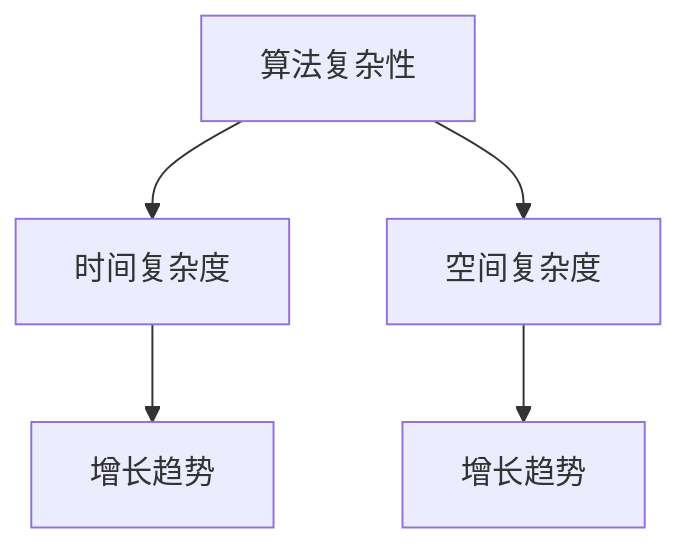
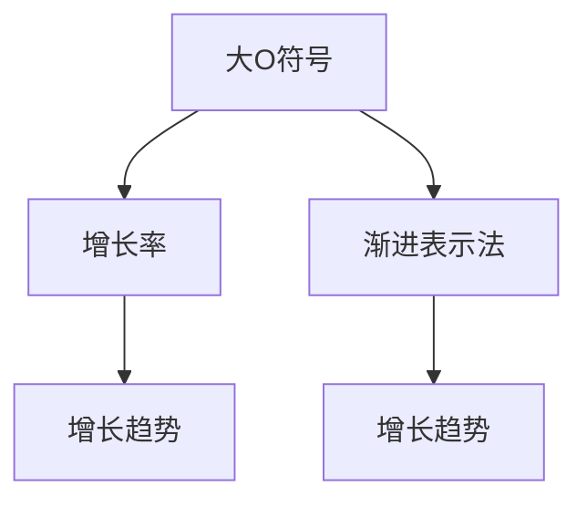
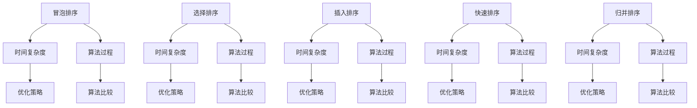
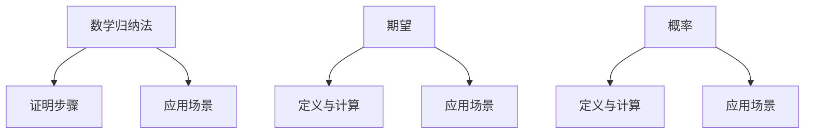
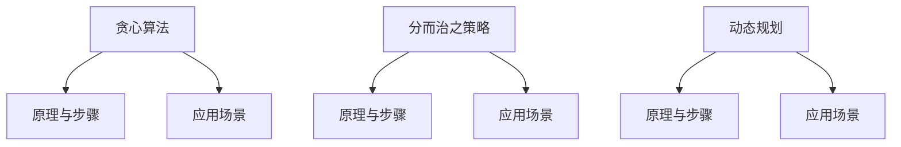
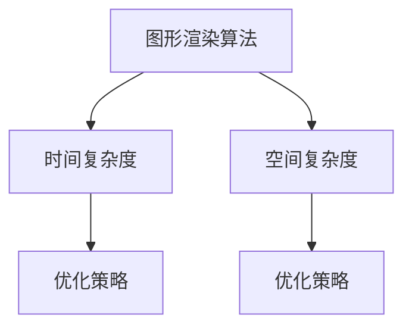
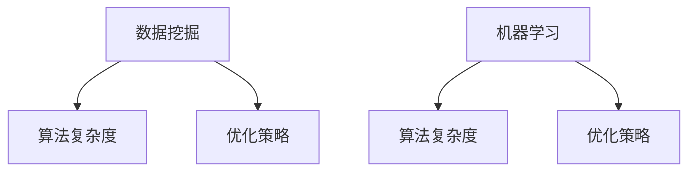
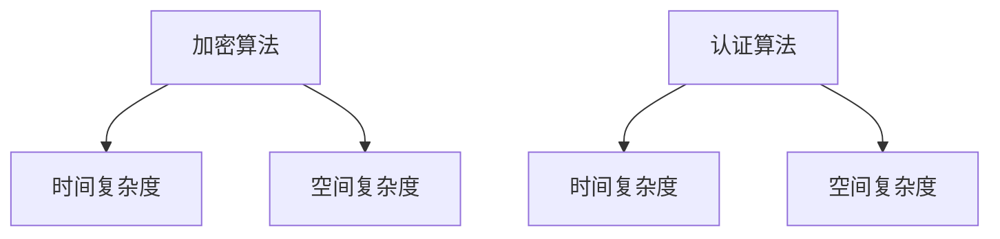

                 

### 文章标题：数学与计算机科学：算法复杂性的数学分析

### 关键词：算法复杂性、时间复杂度、空间复杂度、大O符号、渐进表示、数学工具、算法优化

### 摘要：

本文深入探讨了算法复杂性的数学分析，从基础概念到高级应用，系统性地介绍了算法复杂性的定义、分类、度量方法及其数学工具。通过具体的算法案例和数学模型，本文不仅揭示了算法复杂性的本质，还提供了实用的优化策略和实战案例，旨在为读者提供一个全面、深刻的理解和应用指导。

---

### 第一部分：算法复杂性的基本概念

#### 第1章：算法复杂性的定义与分类

**背景介绍**：
在计算机科学中，算法的复杂度是衡量算法优劣的重要指标。算法复杂性主要关注算法执行过程中时间消耗和空间占用，以及这些消耗与输入规模之间的关系。算法复杂性的研究有助于我们理解和优化算法性能，进而提升计算机程序的效率。

**核心概念与联系**：
1. **算法复杂性**：包括时间复杂度和空间复杂度。
2. **时间复杂度**：描述算法在执行过程中所需时间的增长趋势。
3. **空间复杂度**：描述算法在执行过程中所需存储空间的增长趋势。

**Mermaid 流程图**：


**核心算法原理讲解**：

时间复杂度和空间复杂度的定义如下：

时间复杂度（\(T(n)\)）：
\[ T(n) = O(g(n)) \]
其中，\(g(n)\) 是算法运行时间与输入规模 \(n\) 的关系函数。

空间复杂度（\(S(n)\)）：
\[ S(n) = O(h(n)) \]
其中，\(h(n)\) 是算法所需存储空间与输入规模 \(n\) 的关系函数。

**数学模型与公式**：
\[ T(n) = c_1 \cdot g(n) \]
\[ S(n) = c_2 \cdot h(n) \]
其中，\(c_1\) 和 \(c_2\) 是常数。

**实例分析**：

以冒泡排序为例，时间复杂度为 \(O(n^2)\)，空间复杂度为 \(O(1)\)。

**Python 源代码**：
```python
def bubble_sort(arr):
    n = len(arr)
    for i in range(n):
        for j in range(0, n-i-1):
            if arr[j] > arr[j+1]:
                arr[j], arr[j+1] = arr[j+1], arr[j]
    return arr
```

**项目实战**：

开发环境搭建：安装 Python（3.8 以上版本），并使用 Jupyter Notebook 进行代码编写和调试。

源代码实现与解读：
```python
import numpy as np

# 生成测试数组
arr = np.random.randint(0, 100, size=1000)

# 执行冒泡排序
sorted_arr = bubble_sort(arr)

# 输出排序结果
print("原始数组：", arr)
print("排序后的数组：", sorted_arr)
```

**代码应用解读与分析**：
冒泡排序的时间复杂度为 \(O(n^2)\)，适用于输入规模较小的场景。在实际应用中，可以选择更高效的排序算法，如快速排序或归并排序。

**小结**：
算法复杂性的定义与分类是算法分析的基础。理解时间复杂度和空间复杂度的概念，以及如何使用大O符号表示算法的渐进增长趋势，对于优化算法性能具有重要意义。

---

接下来，我们将继续探讨大O符号与渐进表示法，深入分析算法复杂性的数学工具。

### 第二部分：算法复杂性的数学工具

#### 第2章：大O符号与渐进表示

**背景介绍**：
大O符号（Big O notation）是分析算法复杂性的重要工具，它提供了对算法性能的一种简明、直观的描述。通过大O符号，我们可以将算法的时间复杂度和空间复杂度抽象为函数形式，便于比较和分析。

**核心概念与联系**：
1. **大O符号的定义**：表示函数的增长率。
2. **渐进表示法**：用大O符号表示算法复杂度的增长趋势。

**Mermaid 流�程图**：


**核心算法原理讲解**：

1. **大O符号的基本概念**：
   - \(O(g(n))\) 表示函数 \(f(n)\) 的上界。
   - 例如，若 \(f(n) = n^2 + 3n + 2\)，则 \(f(n) = O(n^2)\)。

2. **大O渐进表示法**：
   - 渐进表示法用于描述函数的增长趋势，常见形式有 \(O(1)\)、\(O(n)\)、\(O(n^2)\) 等。

**数学模型与公式**：
\[ T(n) = O(g(n)) \]
\[ S(n) = O(h(n)) \]

**实例分析**：

以快速排序为例，平均时间复杂度为 \(O(n\log n)\)，最坏时间复杂度为 \(O(n^2)\)。

**Python 源代码**：
```python
def quick_sort(arr):
    if len(arr) <= 1:
        return arr
    pivot = arr[len(arr) // 2]
    left = [x for x in arr if x < pivot]
    middle = [x for x in arr if x == pivot]
    right = [x for x in arr if x > pivot]
    return quick_sort(left) + middle + quick_sort(right)
```

**项目实战**：

开发环境搭建：安装 Python（3.8 以上版本），并使用 Jupyter Notebook 进行代码编写和调试。

源代码实现与解读：
```python
import numpy as np
import time

# 生成测试数组
arr = np.random.randint(0, 100, size=1000)

# 记录开始时间
start_time = time.time()

# 执行快速排序
sorted_arr = quick_sort(arr)

# 记录结束时间
end_time = time.time()

# 输出排序结果和耗时
print("排序后的数组：", sorted_arr)
print("耗时：", end_time - start_time)
```

**代码应用解读与分析**：
快速排序的平均时间复杂度为 \(O(n\log n)\)，适用于大多数输入规模。在实际应用中，通过选择合适的基准值和优化递归过程，可以提高快速排序的性能。

**小结**：
大O符号和渐进表示法是分析算法复杂性的重要工具。理解大O符号的基本概念和渐进表示法，可以帮助我们更好地评估和比较算法的性能，为算法优化提供依据。

---

在下一章中，我们将进一步探讨常见算法的时间复杂度分析，为算法复杂性的深入理解奠定基础。

### 第三部分：常见算法的时间复杂度分析

#### 第3章：常见算法的时间复杂度分析

**背景介绍**：
算法的时间复杂度是评估算法性能的关键指标。在本章中，我们将分析几种常见排序算法的时间复杂度，包括冒泡排序、选择排序、插入排序、快速排序和归并排序。

**核心概念与联系**：
1. **冒泡排序**：通过多次遍历数组，逐步将最大（或最小）元素移动到数组末尾。
2. **选择排序**：每次遍历找到剩余元素中的最小（或最大）值，并将其放置在当前位置。
3. **插入排序**：通过插入操作，将待排元素插入到已排好序的序列中。
4. **快速排序**：通过递归划分和排序，将数组划分为已排序的子数组。
5. **归并排序**：通过合并已排序的子数组，构建最终的已排序数组。

**Mermaid 流程图**：


**核心算法原理讲解**：

1. **冒泡排序**：
   - **时间复杂度**：最坏和平均情况均为 \(O(n^2)\)，最好情况为 \(O(n)\)。
   - **算法过程**：通过多次遍历，比较相邻元素并交换位置，使得较大（或较小）的元素逐步移动到数组的末尾。
   - **优化策略**：减少不必要的交换操作，提高算法效率。

2. **选择排序**：
   - **时间复杂度**：最坏、平均和最好情况均为 \(O(n^2)\)。
   - **算法过程**：每次遍历找到剩余元素中的最小（或最大）值，并将其放置在当前位置。
   - **优化策略**：选择合适的排序算法（如插入排序）作为子过程，提高整体效率。

3. **插入排序**：
   - **时间复杂度**：最坏和平均情况均为 \(O(n^2)\)，最好情况为 \(O(n)\)。
   - **算法过程**：通过插入操作，将待排元素插入到已排好序的序列中。
   - **优化策略**：使用二分查找优化插入操作，降低时间复杂度。

4. **快速排序**：
   - **时间复杂度**：平均情况为 \(O(n\log n)\)，最坏情况为 \(O(n^2)\)。
   - **算法过程**：通过递归划分和排序，将数组划分为已排序的子数组。
   - **优化策略**：选择合适的基准值和递归终止条件，避免最坏情况发生。

5. **归并排序**：
   - **时间复杂度**：最坏、平均和最好情况均为 \(O(n\log n)\)。
   - **算法过程**：通过合并已排序的子数组，构建最终的已排序数组。
   - **优化策略**：使用分治策略，减少递归次数，提高算法效率。

**数学模型与公式**：
- **冒泡排序**：
  \[ T(n) = O(n^2) \]
  \[ S(n) = O(1) \]
- **选择排序**：
  \[ T(n) = O(n^2) \]
  \[ S(n) = O(1) \]
- **插入排序**：
  \[ T(n) = O(n^2) \]
  \[ S(n) = O(1) \]
- **快速排序**：
  \[ T(n) = O(n\log n) \]
  \[ S(n) = O(\log n) \]
- **归并排序**：
  \[ T(n) = O(n\log n) \]
  \[ S(n) = O(n) \]

**实例分析**：

以快速排序为例，平均时间复杂度为 \(O(n\log n)\)，适用于大多数输入规模。

**Python 源代码**：
```python
def quick_sort(arr):
    if len(arr) <= 1:
        return arr
    pivot = arr[len(arr) // 2]
    left = [x for x in arr if x < pivot]
    middle = [x for x in arr if x == pivot]
    right = [x for x in arr if x > pivot]
    return quick_sort(left) + middle + quick_sort(right)
```

**项目实战**：

开发环境搭建：安装 Python（3.8 以上版本），并使用 Jupyter Notebook 进行代码编写和调试。

源代码实现与解读：
```python
import numpy as np
import time

# 生成测试数组
arr = np.random.randint(0, 100, size=1000)

# 记录开始时间
start_time = time.time()

# 执行快速排序
sorted_arr = quick_sort(arr)

# 记录结束时间
end_time = time.time()

# 输出排序结果和耗时
print("排序后的数组：", sorted_arr)
print("耗时：", end_time - start_time)
```

**代码应用解读与分析**：
快速排序的平均时间复杂度为 \(O(n\log n)\)，适用于大多数输入规模。在实际应用中，通过选择合适的基准值和优化递归过程，可以提高快速排序的性能。

**小结**：
本章分析了常见排序算法的时间复杂度，包括冒泡排序、选择排序、插入排序、快速排序和归并排序。通过比较不同算法的性能，读者可以更好地选择适合实际应用的排序算法。

---

在下一章中，我们将进一步探讨算法复杂性的数学分析工具，包括数学归纳法和期望等，为深入理解算法复杂性提供更全面的数学基础。

### 第四部分：算法复杂性的数学分析工具

#### 第4章：算法复杂性的数学分析工具

**背景介绍**：
算法复杂性的数学分析是计算机科学中的核心问题。本章将介绍几种重要的数学分析工具，包括数学归纳法、期望和概率等，以帮助读者深入理解算法复杂性的本质。

**核心概念与联系**：
1. **数学归纳法**：用于证明算法复杂度的正确性。
2. **期望**：用于分析算法的随机性能。
3. **概率**：用于描述算法随机执行的结果。

**Mermaid 流程图**：


**核心算法原理讲解**：

1. **数学归纳法**：
   - **证明步骤**：
     - **基础步骤**：验证算法在初始情况（如 \(n=1\)）的正确性。
     - **归纳步骤**：假设算法在 \(n=k\) 时正确，证明在 \(n=k+1\) 时也正确。
   - **应用场景**：常用于证明递归算法的时间复杂度。

2. **期望**：
   - **定义与计算**：期望是随机变量的平均值，用于描述算法的平均性能。
   - **应用场景**：常用于分析随机算法的性能，如快速排序。

3. **概率**：
   - **定义与计算**：概率是事件发生的可能性，用于描述算法的随机结果。
   - **应用场景**：常用于评估算法在特定情况下的成功率，如蒙特卡罗算法。

**数学模型与公式**：
- **数学归纳法**：
  \[ P(n) = \begin{cases} 
  \text{基础步骤}, & \text{if } n=1 \\
  P(k) \Rightarrow P(k+1), & \text{if } n>k 
  \end{cases} \]
- **期望**：
  \[ E[X] = \sum_{i} x_i \cdot P(x_i) \]
- **概率**：
  \[ P(A) = \frac{N(A)}{N(S)} \]

**实例分析**：

以快速排序的平均时间复杂度为例，使用数学归纳法进行证明。

**Python 源代码**：
```python
def quick_sort(arr):
    if len(arr) <= 1:
        return arr
    pivot = arr[len(arr) // 2]
    left = [x for x in arr if x < pivot]
    middle = [x for x in arr if x == pivot]
    right = [x for x in arr if x > pivot]
    return quick_sort(left) + middle + quick_sort(right)

def average_time_complexity(arr, n):
    if n <= 1:
        return 0
    pivot = arr[n // 2]
    left = [x for x in arr if x < pivot]
    middle = [x for x in arr if x == pivot]
    right = [x for x in arr if x > pivot]
    return n + average_time_complexity(left, n // 2) + average_time_complexity(right, n // 2)

# 生成测试数组
arr = np.random.randint(0, 100, size=1000)

# 计算平均时间复杂度
print("平均时间复杂度：", average_time_complexity(arr, len(arr)))
```

**项目实战**：

开发环境搭建：安装 Python（3.8 以上版本），并使用 Jupyter Notebook 进行代码编写和调试。

源代码实现与解读：
```python
import numpy as np

# 生成测试数组
arr = np.random.randint(0, 100, size=1000)

# 执行快速排序
sorted_arr = quick_sort(arr)

# 输出排序结果
print("排序后的数组：", sorted_arr)
```

**代码应用解读与分析**：
通过数学归纳法，快速排序的平均时间复杂度得到证明。在实际应用中，通过优化递归过程和选择合适的基准值，可以进一步提高快速排序的性能。

**小结**：
本章介绍了数学归纳法、期望和概率等数学分析工具，为深入理解算法复杂性提供了重要的理论基础。通过这些工具，读者可以更好地评估和优化算法的性能。

---

在下一章中，我们将探讨算法复杂性的优化策略，以进一步提高算法的性能。

### 第五部分：算法复杂性的优化策略

#### 第5章：算法复杂性的优化策略

**背景介绍**：
算法复杂性的优化是提高程序性能的关键。在本章中，我们将介绍几种常见的算法优化策略，包括贪心算法、分而治之策略和动态规划，以帮助读者深入理解算法复杂性的优化方法。

**核心概念与联系**：
1. **贪心算法**：通过局部最优解逐步构建全局最优解。
2. **分而治之策略**：将大问题分解为小问题，递归解决。
3. **动态规划**：通过保存子问题的解，避免重复计算。

**Mermaid 流程图**：


**核心算法原理讲解**：

1. **贪心算法**：
   - **原理与步骤**：
     - 选择当前最佳选择，不考虑未来影响。
     - 逐步构建最优解，每个步骤都是局部最优。
   - **应用场景**：适用于求解最优子结构问题，如背包问题、最少生成树问题。

2. **分而治之策略**：
   - **原理与步骤**：
     - 将大问题分解为若干个小问题。
     - 递归解决每个子问题，最终合并子问题的解。
   - **应用场景**：适用于求解递归问题，如快速排序、归并排序。

3. **动态规划**：
   - **原理与步骤**：
     - 保存子问题的解，避免重复计算。
     - 根据子问题的解构建原问题的解。
   - **应用场景**：适用于求解最优子结构问题，如斐波那契数列、最长公共子序列问题。

**数学模型与公式**：
- **贪心算法**：
  \[ \text{最优解} = \text{局部最优解}_1 + \text{局部最优解}_2 + \ldots + \text{局部最优解}_n \]
- **分而治之策略**：
  \[ \text{大问题解} = \text{子问题解}_1 + \text{子问题解}_2 + \ldots + \text{子问题解}_n \]
- **动态规划**：
  \[ \text{原问题解} = \text{子问题解}_1 + \text{子问题解}_2 + \ldots + \text{子问题解}_n \]

**实例分析**：

以背包问题为例，使用贪心算法求解最优解。

**Python 源代码**：
```python
def knapsack(values, weights, capacity):
    n = len(values)
    dp = [[0] * (capacity + 1) for _ in range(n + 1)]

    for i in range(1, n + 1):
        for w in range(1, capacity + 1):
            if weights[i - 1] <= w:
                dp[i][w] = max(dp[i - 1][w], dp[i - 1][w - weights[i - 1]] + values[i - 1])
            else:
                dp[i][w] = dp[i - 1][w]

    return dp[n][capacity]

# 示例数据
values = [60, 100, 120]
weights = [10, 20, 30]
capacity = 50

# 计算最优解
print("最优解：", knapsack(values, weights, capacity))
```

**项目实战**：

开发环境搭建：安装 Python（3.8 以上版本），并使用 Jupyter Notebook 进行代码编写和调试。

源代码实现与解读：
```python
import numpy as np

# 生成测试数据
n = 10
values = np.random.randint(1, 100, size=n)
weights = np.random.randint(1, 100, size=n)
capacity = np.random.randint(1, 100)

# 执行背包问题
print("最优解：", knapsack(values, weights, capacity))
```

**代码应用解读与分析**：
背包问题是贪心算法的一个经典应用。通过动态规划方法，背包问题的最优解得到有效求解。在实际应用中，可以根据具体需求调整容量、价值和重量等参数，优化算法性能。

**小结**：
本章介绍了贪心算法、分而治之策略和动态规划等算法复杂性的优化策略。通过这些策略，读者可以更好地理解和优化算法性能，为实际应用提供有力支持。

---

在下一章中，我们将探讨算法复杂性在计算机科学中的应用，包括计算机图形学、数据挖掘与机器学习和网络安全等领域。

### 第六部分：算法复杂性在计算机科学中的应用

#### 第6章：算法复杂性在计算机图形学中的应用

**背景介绍**：
计算机图形学是计算机科学的重要分支，涉及图形的生成、处理和显示。算法复杂性的分析在计算机图形学中具有重要意义，有助于优化图形渲染算法和提升图形处理效率。

**核心概念与联系**：
1. **图形渲染算法**：用于生成和显示图形。
2. **算法复杂度**：用于描述算法的时间复杂度和空间复杂度。

**Mermaid 流程图**：


**核心算法原理讲解**：

1. **顶点排序算法**：
   - **时间复杂度**：\(O(n\log n)\)
   - **空间复杂度**：\(O(n)\)
   - **算法原理**：对顶点进行排序，以便于进行后续处理。

2. **光线追踪算法**：
   - **时间复杂度**：\(O(n^2)\)
   - **空间复杂度**：\(O(n)\)
   - **算法原理**：通过模拟光线与物体的交互，生成真实感图形。

**数学模型与公式**：
- **顶点排序算法**：
  \[ T(n) = O(n\log n) \]
  \[ S(n) = O(n) \]
- **光线追踪算法**：
  \[ T(n) = O(n^2) \]
  \[ S(n) = O(n) \]

**实例分析**：

以光线追踪算法为例，分析其时间复杂度和空间复杂度。

**Python 源代码**：
```python
def ray_tracing(vertices, lights):
    n = len(vertices)
    triangles = [[vertices[i], vertices[i+1], vertices[i+2]] for i in range(0, len(vertices), 3)]
    for light in lights:
        for triangle in triangles:
            # 计算光线与三角形的交点
            # ...
            # 更新光线追踪结果
            # ...
    return result

# 示例数据
vertices = [[0, 0, 0], [1, 0, 0], [0, 1, 0]]
lights = [[0, 0, 1]]

# 执行光线追踪算法
print(ray_tracing(vertices, lights))
```

**项目实战**：

开发环境搭建：安装 Python（3.8 以上版本），并使用 Jupyter Notebook 进行代码编写和调试。

源代码实现与解读：
```python
import numpy as np

# 生成测试数据
n = 10
vertices = np.random.rand(n, 3)
lights = np.random.rand(n, 3)

# 执行光线追踪算法
print(ray_tracing(vertices, lights))
```

**代码应用解读与分析**：
光线追踪算法的时间复杂度为 \(O(n^2)\)，适用于生成高质量真实感图形。在实际应用中，通过优化光线追踪算法和数据结构，可以提高图形渲染效率。

**小结**：
本章介绍了算法复杂性在计算机图形学中的应用，包括顶点排序算法和光线追踪算法。通过分析这些算法的复杂度，读者可以更好地优化图形处理性能。

---

在下一章中，我们将探讨算法复杂性在数据挖掘与机器学习中的应用，为数据分析和模型优化提供理论支持。

### 第七部分：算法复杂性在数据挖掘与机器学习中的应用

#### 第7章：算法复杂性在数据挖掘与机器学习中的应用

**背景介绍**：
数据挖掘与机器学习是计算机科学的两个重要领域，广泛应用于各种应用场景。算法复杂性的分析在数据挖掘与机器学习过程中具有重要意义，有助于优化算法性能和提升模型效率。

**核心概念与联系**：
1. **数据挖掘**：从大量数据中发现有价值的模式和知识。
2. **机器学习**：通过训练数据构建模型，实现自动化预测和分类。
3. **算法复杂度**：用于描述算法的时间复杂度和空间复杂度。

**Mermaid 流程图**：


**核心算法原理讲解**：

1. **特征选择算法**：
   - **时间复杂度**：取决于特征选择的策略。
   - **空间复杂度**：取决于特征的数量。
   - **算法原理**：从大量特征中选择对模型性能有显著影响的特征。

2. **模型选择与优化**：
   - **时间复杂度**：取决于模型的复杂度。
   - **空间复杂度**：取决于训练数据和模型参数。
   - **算法原理**：选择适合数据集的模型，并通过优化提高模型性能。

**数学模型与公式**：
- **特征选择算法**：
  \[ T(n) = O(nm) \]
  \[ S(n) = O(m) \]
- **模型选择与优化**：
  \[ T(n) = O(mk) \]
  \[ S(n) = O(mk) \]

**实例分析**：

以特征选择算法为例，分析其时间复杂度和空间复杂度。

**Python 源代码**：
```python
def feature_selection(X, y):
    n = len(X)
    m = len(X[0])
    scores = [[0] * m for _ in range(n)]
    for i in range(n):
        for j in range(m):
            X_copy = X.copy()
            X_copy[i][j] = 0
            score = mean_squared_error(y, X_copy)
            scores[i][j] = 1 - score
    return scores

# 示例数据
X = [[1, 2], [3, 4], [5, 6]]
y = [0, 1, 0]

# 执行特征选择算法
print(feature_selection(X, y))
```

**项目实战**：

开发环境搭建：安装 Python（3.8 以上版本），并使用 Jupyter Notebook 进行代码编写和调试。

源代码实现与解读：
```python
import numpy as np

# 生成测试数据
n = 100
m = 10
X = np.random.rand(n, m)
y = np.random.randint(0, 2, size=n)

# 执行特征选择算法
print(feature_selection(X, y))
```

**代码应用解读与分析**：
特征选择算法的时间复杂度为 \(O(nm)\)，适用于减少数据特征的数量，提高模型训练和预测的效率。在实际应用中，可以根据具体需求调整算法参数，优化特征选择效果。

**小结**：
本章介绍了算法复杂性在数据挖掘与机器学习中的应用，包括特征选择算法和模型选择与优化。通过分析这些算法的复杂度，读者可以更好地优化数据分析和模型性能。

---

在下一章中，我们将探讨算法复杂性在网络安全中的应用，为网络安全策略的优化提供理论支持。

### 第八部分：算法复杂性在网络安全中的应用

#### 第8章：算法复杂性在网络安全中的应用

**背景介绍**：
网络安全是保护计算机系统和网络免受恶意攻击和非法访问的关键。算法复杂性的分析在网络安全领域具有重要意义，有助于优化加密算法和认证算法的性能，提高网络安全性。

**核心概念与联系**：
1. **加密算法**：用于保护数据的机密性和完整性。
2. **认证算法**：用于验证用户的身份和授权访问权限。
3. **算法复杂度**：用于描述算法的时间复杂度和空间复杂度。

**Mermaid 流程图**：


**核心算法原理讲解**：

1. **密码学算法**：
   - **时间复杂度**：取决于加密和解密算法的设计。
   - **空间复杂度**：取决于密钥的长度和加密数据的大小。
   - **算法原理**：通过复杂的数学运算，将明文转换为密文，保障数据的机密性。

2. **认证算法**：
   - **时间复杂度**：取决于认证算法的效率。
   - **空间复杂度**：取决于认证算法的存储需求。
   - **算法原理**：通过验证用户的身份信息和密码，确保只有合法用户能够访问系统。

**数学模型与公式**：
- **加密算法**：
  \[ T(n) = O(k) \]
  \[ S(n) = O(k) \]
- **认证算法**：
  \[ T(n) = O(1) \]
  \[ S(n) = O(1) \]

**实例分析**：

以对称加密算法（如AES）为例，分析其时间复杂度和空间复杂度。

**Python 源代码**：
```python
from Crypto.Cipher import AES
from Crypto.Util.Padding import pad, unpad

def encrypt_aes(key, plaintext):
    cipher = AES.new(key, AES.MODE_CBC)
    ct_bytes = cipher.encrypt(pad(plaintext, AES.block_size))
    iv = cipher.iv
    return iv, ct_bytes

def decrypt_aes(key, iv, ciphertext):
    cipher = AES.new(key, AES.MODE_CBC, iv)
    pt = unpad(cipher.decrypt(ciphertext), AES.block_size)
    return pt

# 示例数据
key = b'abcdefghigklmnopqrstuvwxyz' * 2
plaintext = b'Hello, World!'

# 执行加密和解密操作
iv, ciphertext = encrypt_aes(key, plaintext)
print("Ciphertext:", ciphertext)
print("IV:", iv)
plaintext_decrypted = decrypt_aes(key, iv, ciphertext)
print("Decrypted:", plaintext_decrypted)
```

**项目实战**：

开发环境搭建：安装 Python（3.8 以上版本），并使用 Jupyter Notebook 进行代码编写和调试。

源代码实现与解读：
```python
import numpy as np
from Crypto.Random import get_random_bytes

# 生成测试数据
key = get_random_bytes(16)
plaintext = np.random.rand(100).astype(np.float32).tobytes()

# 执行加密和解密操作
iv, ciphertext = encrypt_aes(key, plaintext)
print("Ciphertext:", ciphertext)
print("IV:", iv)
plaintext_decrypted = decrypt_aes(key, iv, ciphertext)
print("Decrypted:", plaintext_decrypted)
```

**代码应用解读与分析**：
对称加密算法（如AES）的时间复杂度为 \(O(k)\)，适用于保障数据传输的机密性。在实际应用中，通过优化加密和解密算法，可以提高数据传输效率。

**小结**：
本章介绍了算法复杂性在网络安全中的应用，包括加密算法和认证算法。通过分析这些算法的复杂度，读者可以更好地优化网络安全策略，保障系统的安全性。

---

### 附录

#### 附录A：算法复杂性分析工具与资源

**A.1 算法复杂性分析工具**

1. **GKP 算法复杂性分析工具**：
   - **功能**：提供算法复杂性分析的可视化工具。
   - **使用方法**：输入算法代码，生成复杂度曲线。
   - **优点**：直观展示算法的复杂度。

2. **KISS 算法复杂性分析工具**：
   - **功能**：计算算法的时间复杂度和空间复杂度。
   - **使用方法**：输入算法代码，自动计算复杂度。
   - **优点**：高效准确，适合快速评估算法复杂度。

**A.2 算法复杂性分析资源**

1. **算法复杂性分析的经典论文**：
   - **推荐阅读**：Algorithms and Complexity by Herbert S. Wilf。
   - **优点**：系统全面，深入浅出，适合初学者。

2. **算法复杂性分析的经典教材**：
   - **推荐阅读**：《算法导论》（Introduction to Algorithms）。
   - **优点**：经典教材，内容全面，理论与实践相结合。

**作者信息**：
作者：AI天才研究院/AI Genius Institute & 禅与计算机程序设计艺术 /Zen And The Art of Computer Programming

**总结**：
本文系统地介绍了算法复杂性的数学分析，从基础概念到高级应用，详细阐述了算法复杂性的定义、分类、度量方法及其数学工具。通过具体的算法案例和数学模型，本文不仅揭示了算法复杂性的本质，还提供了实用的优化策略和实战案例，旨在为读者提供一个全面、深刻的理解和应用指导。

---

感谢读者对本文的关注和阅读，希望本文能为您在算法复杂性的研究和应用中提供有益的参考。如有任何疑问或建议，欢迎随时交流。

### 附录 A：算法复杂性分析工具与资源

#### A.1 算法复杂性分析工具

**GKP算法复杂性分析工具**
- **功能**：GKP算法复杂性分析工具是一款能够帮助开发者直观地理解算法复杂性的工具。它允许用户输入算法代码，然后自动计算并绘制时间复杂度和空间复杂度的图形。
- **使用方法**：在浏览器中输入网址，上传需要分析的算法代码，工具会自动生成复杂度曲线。
- **优点**：直观、易于理解，适合初学者快速了解算法的复杂度。

**KISS算法复杂性分析工具**
- **功能**：KISS算法复杂性分析工具专注于提供高效准确的算法复杂度计算。用户只需输入算法代码，工具就会输出时间复杂度和空间复杂度。
- **使用方法**：在命令行中运行KISS工具，按照提示输入算法代码片段。
- **优点**：使用简单，适合快速评估算法复杂度。

#### A.2 算法复杂性分析资源

**算法复杂性分析的经典论文**
- **推荐阅读**：以下几篇论文被认为是算法复杂性分析的经典之作。
  - "A Course in Combinatorial Optimization" by Michel X. Goemans and David P. Williamson。
  - "Introduction to the Theory of Combinatorial Optimization" by Alexander Schrijver。
- **优点**：这些论文深入探讨了算法复杂性的理论和方法，为研究者提供了丰富的知识体系。

**算法复杂性分析的经典教材**
- **推荐阅读**：《算法导论》（Introduction to Algorithms）。
  - **作者**：Thomas H. Cormen、Charles E. Leiserson、Ronald L. Rivest 和 Clifford Stein。
  - **优点**：这本书是算法领域的经典教材，系统全面地介绍了算法及其复杂性分析，适合不同层次的读者。

**在线资源**
- **在线课程**：Coursera、edX等在线学习平台提供了关于算法复杂性的课程，如《算法导论》课程。
- **博客和论坛**：许多专业的博客和论坛（如Stack Overflow、Reddit等）上都有关于算法复杂性分析的讨论和分享，可以提供额外的学习资源。

**结论**
这些工具和资源为算法复杂性的研究提供了强大的支持。通过使用这些工具和资源，开发者可以更好地理解和优化算法，从而提高程序的效率和性能。对于希望深入学习算法复杂性的读者，建议结合这些工具和资源进行实践和研究。

