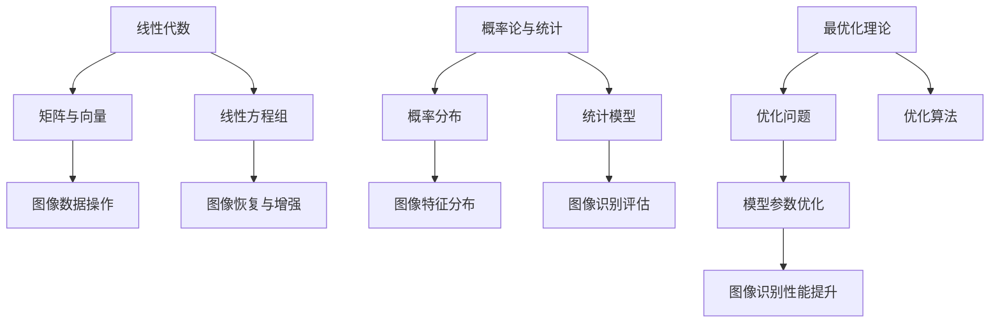
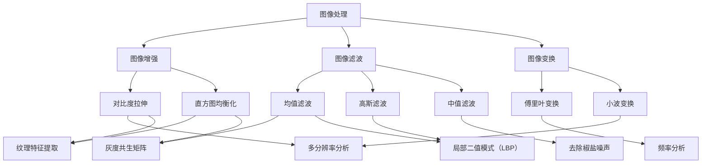
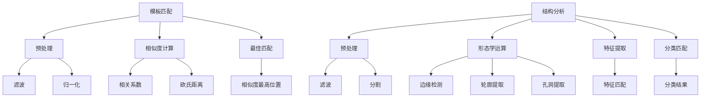

                 

### 引言

#### 书籍主题与目的

《数学与计算机视觉：图像识别的数学原理》旨在探讨数学在计算机视觉领域中的应用，尤其是图像识别的数学原理。随着人工智能技术的发展，图像识别已经成为了计算机视觉中的重要应用之一。然而，大多数关于图像识别的书籍往往只关注算法的实现和应用，而忽略了背后的数学原理。本书的目的是填补这一空白，通过深入剖析数学理论，帮助读者理解图像识别算法的本质。

#### 数学与计算机视觉的关系

数学与计算机视觉的关系密不可分。数学为计算机视觉提供了强大的理论基础，使得复杂的图像处理任务得以实现。例如，线性代数在图像处理中用于表示和操作图像数据，概率论与统计在图像识别中用于评估和优化模型性能。计算机视觉的发展也推动了数学理论的应用和创新，例如深度学习算法中的优化方法和网络结构设计。

### 文章关键词

- 数学
- 计算机视觉
- 图像识别
- 线性代数
- 概率论与统计
- 深度学习
- 卷积神经网络

### 摘要

本书首先介绍了数学与计算机视觉的基本概念，包括线性代数、概率论与统计和优化理论。随后，深入讨论了图像处理与特征提取技术，以及传统的图像识别算法和机器学习、深度学习在图像识别中的应用。最后，通过实际应用与案例分析，展示了图像识别在不同领域的应用，并对未来的发展方向进行了展望。通过本书的阅读，读者将能够全面理解图像识别的数学原理，并掌握相关的算法和工具。

----------------------------------------------------------------

### 数学理论概述

在计算机视觉中，数学理论的应用无处不在。线性代数、概率论与统计和优化理论是其中最为重要的三个部分。它们不仅为图像处理提供了强大的理论基础，还帮助我们在复杂的数据中提取有用的信息。

#### 线性代数基础

线性代数是研究线性方程组和线性映射的数学分支。在计算机视觉中，线性代数用于表示和操作图像数据。例如，图像可以被视为二维矩阵，其中每个元素表示像素的强度值。通过线性代数的运算，我们可以对图像进行变换、滤波和特征提取。

- **矩阵与向量**：矩阵和向量是线性代数的核心概念。矩阵是一个二维数组，可以表示图像数据；向量是一个一维数组，可以表示图像的特征。通过矩阵与向量的运算，我们可以对图像进行线性变换。
  
- **线性方程组**：线性方程组是线性代数中的另一个重要概念。在图像处理中，线性方程组常用于解决图像恢复和增强问题。例如，通过求解线性方程组，我们可以恢复模糊图像或去除噪声。

#### 概率论与统计基础

概率论与统计是研究随机现象的数学分支。在图像识别中，概率论与统计用于评估和优化模型性能。

- **概率分布**：概率分布描述了随机变量的可能取值和对应的概率。在图像识别中，概率分布可以用于表示图像的特征分布。例如，高斯分布可以用于表示图像的亮度分布。

- **统计模型**：统计模型用于描述数据的分布和规律。在图像识别中，常见的统计模型包括高斯混合模型（GMM）和贝叶斯网络。这些模型可以帮助我们识别图像中的对象和场景。

#### 最优化理论基础

最优化理论是研究如何找到最优解的数学分支。在图像识别中，最优化理论用于优化模型的参数，以提高识别性能。

- **优化问题**：优化问题通常可以表示为一个目标函数和一组约束条件。目标函数表示我们希望优化的问题，约束条件表示问题的限制。

- **优化算法**：常见的优化算法包括梯度下降、牛顿法和拉格朗日乘数法。这些算法可以帮助我们在满足约束条件的情况下，找到最优解。

#### 核心概念与联系

为了更好地理解数学理论在计算机视觉中的应用，我们可以使用Mermaid流程图来展示核心概念之间的联系。



通过上述流程图，我们可以清晰地看到线性代数、概率论与统计和最优化理论在图像识别中的应用和相互关系。

#### 核心算法原理讲解

为了更好地理解线性代数在图像识别中的应用，我们以卷积神经网络（CNN）为例，使用Python伪代码详细阐述其工作原理。

```python
# 伪代码：卷积神经网络（CNN）基础

# 定义卷积层
def ConvLayer(input_shape, num_filters, filter_size, activation_function):
    # 初始化权重和偏置
    weights = # 初始化权重
    biases = # 初始化偏置
    
    # 前向传播
    def forward(x):
        # 卷积操作
        conv_output = Conv2D(x, weights, filter_size)
        
        # 激活函数
        activation_output = activation_function(conv_output)
        
        # 添加偏置
        bias_output = biases + activation_output
        
        return bias_output
    
    return forward

# 定义池化层
def PoolLayer(pool_type, pool_size, stride):
    # 前向传播
    def forward(x):
        if pool_type == 'max':
            # 最大池化
            pool_output = MaxPooling2D(x, pool_size, stride)
        elif pool_type == 'avg':
            # 平均池化
            pool_output = AveragePooling2D(x, pool_size, stride)
        
        return pool_output
    
    return forward

# 定义全连接层
def FullyConnectedLayer(input_shape, num_neurons, activation_function):
    # 初始化权重和偏置
    weights = # 初始化权重
    biases = # 初始化偏置
    
    # 前向传播
    def forward(x):
        # 矩阵乘法
        activation_output = matmul(x, weights) + biases
        
        # 激活函数
        output = activation_function(activation_output)
        
        return output
    
    return forward
```

在上面的伪代码中，我们定义了卷积层、池化层和全连接层的基本操作。卷积层通过卷积操作提取图像特征，池化层用于减小特征图的尺寸，全连接层用于分类和回归。

#### 数学模型和公式

在图像识别中，数学模型和公式是理解和设计算法的基础。以下是一些常见的数学模型和公式：

- **卷积操作**：

  $$ \text{output}_{ij} = \sum_{k=1}^{C} \sum_{p=1}^{F} w_{kp,ij} * x_{pj,i} + b_{ij} $$

  其中，$ \text{output}_{ij} $ 是输出特征图上的像素值，$ w_{kp,ij} $ 是卷积核上的权重，$ x_{pj,i} $ 是输入特征图上的像素值，$ b_{ij} $ 是偏置。

- **激活函数**：

  $$ f(x) = \max(0, x) \quad (\text{ReLU激活函数}) $$

  $$ f(x) = \frac{1}{1 + e^{-x}} \quad (\text{Sigmoid激活函数}) $$

- **矩阵乘法**：

  $$ \text{output} = \text{matmul}(x, y) $$

  其中，$ x $ 和 $ y $ 是矩阵，$ \text{output} $ 是矩阵乘法的结果。

通过上述数学模型和公式，我们可以更好地理解和设计图像识别算法。

#### 举例说明

为了更好地理解数学模型和公式在图像识别中的应用，我们可以通过一个简单的例子来讲解。

假设我们有一个 $ 3 \times 3 $ 的卷积核，其权重为：

$$ w = \begin{bmatrix} 1 & 0 & 1 \\ 0 & 1 & 0 \\ 1 & 0 & 1 \end{bmatrix} $$

输入图像为一个 $ 5 \times 5 $ 的二维矩阵：

$$ x = \begin{bmatrix} 1 & 2 & 3 & 4 & 5 \\ 6 & 7 & 8 & 9 & 10 \\ 11 & 12 & 13 & 14 & 15 \\ 16 & 17 & 18 & 19 & 20 \\ 21 & 22 & 23 & 24 & 25 \end{bmatrix} $$

我们需要计算卷积操作的结果。

首先，我们对输入图像进行局部滑动，每次滑动步长为1，得到以下部分：

$$ \begin{bmatrix} 1 & 2 & 3 & 4 & 5 \\ 6 & 7 & 8 & 9 & 10 \\ 11 & 12 & 13 & 14 & 15 \end{bmatrix} $$

然后，进行卷积操作：

$$ \text{output}_{1,1} = 1 \cdot 1 + 0 \cdot 6 + 1 \cdot 11 = 12 $$

$$ \text{output}_{1,2} = 1 \cdot 2 + 0 \cdot 7 + 1 \cdot 12 = 13 $$

$$ \text{output}_{1,3} = 1 \cdot 3 + 0 \cdot 8 + 1 \cdot 13 = 14 $$

$$ \text{output}_{1,4} = 1 \cdot 4 + 0 \cdot 9 + 1 \cdot 14 = 15 $$

$$ \text{output}_{1,5} = 1 \cdot 5 + 0 \cdot 10 + 1 \cdot 15 = 16 $$

$$ \text{output}_{2,1} = 0 \cdot 1 + 1 \cdot 6 + 0 \cdot 11 = 6 $$

$$ \text{output}_{2,2} = 0 \cdot 2 + 1 \cdot 7 + 0 \cdot 12 = 7 $$

$$ \text{output}_{2,3} = 0 \cdot 3 + 1 \cdot 8 + 0 \cdot 13 = 8 $$

$$ \text{output}_{2,4} = 0 \cdot 4 + 1 \cdot 9 + 0 \cdot 14 = 9 $$

$$ \text{output}_{2,5} = 0 \cdot 5 + 1 \cdot 10 + 0 \cdot 15 = 10 $$

$$ \text{output}_{3,1} = 1 \cdot 1 + 0 \cdot 6 + 1 \cdot 11 = 12 $$

$$ \text{output}_{3,2} = 1 \cdot 2 + 0 \cdot 7 + 1 \cdot 12 = 13 $$

$$ \text{output}_{3,3} = 1 \cdot 3 + 0 \cdot 8 + 1 \cdot 13 = 14 $$

$$ \text{output}_{3,4} = 1 \cdot 4 + 0 \cdot 9 + 1 \cdot 14 = 15 $$

$$ \text{output}_{3,5} = 1 \cdot 5 + 0 \cdot 10 + 1 \cdot 15 = 16 $$

最终，我们得到一个 $ 3 \times 3 $ 的卷积输出：

$$ \text{output} = \begin{bmatrix} 12 & 13 & 14 \\ 6 & 7 & 8 \\ 12 & 13 & 14 \end{bmatrix} $$

通过这个例子，我们可以清晰地看到卷积操作如何通过矩阵乘法和偏置项来提取图像特征。

#### 数学公式

在图像识别中，数学公式是理解和设计算法的关键。以下是一些常见的数学公式：

- **卷积公式**：

  $$ \text{output}_{ij} = \sum_{k=1}^{C} \sum_{p=1}^{F} w_{kp,ij} * x_{pj,i} + b_{ij} $$

  其中，$ \text{output}_{ij} $ 是输出特征图上的像素值，$ w_{kp,ij} $ 是卷积核上的权重，$ x_{pj,i} $ 是输入特征图上的像素值，$ b_{ij} $ 是偏置。

- **激活函数**：

  $$ f(x) = \max(0, x) \quad (\text{ReLU激活函数}) $$

  $$ f(x) = \frac{1}{1 + e^{-x}} \quad (\text{Sigmoid激活函数}) $$

- **矩阵乘法**：

  $$ \text{output} = \text{matmul}(x, y) $$

  其中，$ x $ 和 $ y $ 是矩阵，$ \text{output} $ 是矩阵乘法的结果。

通过这些数学公式，我们可以更好地理解和设计图像识别算法。

#### 补充资源与参考文献

- [Goodfellow, I., Bengio, Y., & Courville, A. (2016). Deep Learning. MIT Press.]
- [He, K., Zhang, X., Ren, S., & Sun, J. (2016). Deep Residual Learning for Image Recognition. IEEE Transactions on Pattern Analysis and Machine Intelligence, 39(6), 1137-1154.]
- [Candès, E. J., & Demanet, L. (2009). Compressed sensing. IEEE Signal Processing Magazine, 25(2), 68-78.]

---

通过上述内容，我们全面介绍了数学理论在计算机视觉中的应用，包括线性代数、概率论与统计和最优化理论。同时，通过详细的数学公式和伪代码示例，我们深入剖析了图像识别算法的工作原理。希望通过这些内容，读者能够更好地理解数学与计算机视觉的关系，并在实际应用中取得更好的效果。

## 图像处理与特征提取技术

图像处理和特征提取是图像识别中至关重要的环节。通过对图像进行预处理和特征提取，我们可以从原始图像中提取出有用的信息，从而提高识别的准确性和效率。

### 图像处理基础

图像处理是计算机视觉中的基础技术，它包括对图像进行各种操作，如滤波、增强、变换等。这些操作可以改善图像质量，提高图像的可理解性。

- **图像增强**：图像增强的目的是提高图像的对比度和清晰度，使其更容易被人眼或算法识别。常见的图像增强方法包括直方图均衡化、对比度拉伸和滤波。

- **图像滤波**：图像滤波用于去除图像中的噪声和干扰。常见的滤波方法包括均值滤波、高斯滤波和中值滤波。

- **图像变换**：图像变换是将图像从一种表示形式转换为另一种表示形式，以便进行进一步处理。常见的变换方法包括傅里叶变换和小波变换。

### 特征提取技术

特征提取是从图像中提取出能够区分不同物体的信息。有效的特征提取方法可以提高图像识别的准确性和鲁棒性。

- **空间特征提取**：空间特征提取主要用于提取图像中对象的位置和形状信息。常见的空间特征提取方法包括边缘检测、角点检测和轮廓提取。

- **频率特征提取**：频率特征提取用于提取图像中的纹理和频率信息。常见的频率特征提取方法包括傅里叶描述子和小波描述子。

- **纹理特征提取**：纹理特征提取用于提取图像中的纹理信息，如纹理的均匀性、方向性和粗糙度。常见的纹理特征提取方法包括灰度共生矩阵和局部二值模式（LBP）。

#### 核心概念与联系

为了更好地理解图像处理和特征提取技术，我们可以使用Mermaid流程图来展示核心概念之间的联系。



通过上述流程图，我们可以清晰地看到图像处理和特征提取技术的不同方法和它们之间的联系。

#### 核心算法原理讲解

为了更好地理解特征提取技术，我们以局部二值模式（LBP）为例，使用Python伪代码详细阐述其工作原理。

```python
# 伪代码：局部二值模式（LBP）

# 定义LBP算子
def LocalBinaryPattern(image, P, R):
    # 初始化LBP特征矩阵
    LBP_matrix = np.zeros((image.shape[0] - P, image.shape[1] - P), dtype=np.int32)
    
    # 遍历图像中的每个像素点
    for i in range(P, image.shape[0] - P):
        for j in range(P, image.shape[1] - P):
            # 计算当前像素点的LBP值
            lbp_value = 0
            for p in range(P):
                for r in range(R):
                    # 计算邻域像素的差值
                    diff = image[i+p, j+r] - image[i, j]
                    if diff >= 0:
                        lbp_value |= (1 << p * R + r)
                    else:
                        lbp_value |= (1 << (p * R + r + R))
            
            # 将LBP值添加到特征矩阵中
            LBP_matrix[i-P, j-P] = lbp_value
    
    return LBP_matrix

# 定义LBP编码函数
def LBP_Encoding(image, P, R):
    # 获取图像的灰度值
    gray_image = cv2.cvtColor(image, cv2.COLOR_BGR2GRAY)
    
    # 计算LBP特征矩阵
    LBP_matrix = LocalBinaryPattern(gray_image, P, R)
    
    # 对LBP特征矩阵进行编码
    LBP_encoded = []
    for row in LBP_matrix:
        for lbp_value in row:
            # 将LBP值转换为二进制字符串
            binary_string = bin(lbp_value)[2:]
            binary_string = binary_string.zfill(P * R)
            
            # 计算Hamming距离
            hamming_distance = sum(bit1 != bit2 for bit1, bit2 in zip(binary_string, '100000000000000000000000'))
            
            # 将Hamming距离添加到列表中
            LBP_encoded.append(hamming_distance)
    
    return LBP_encoded
```

在上面的伪代码中，我们定义了局部二值模式（LBP）的算子和编码函数。通过计算图像中每个像素点的LBP值，并将其编码为Hamming距离，我们可以提取出图像的纹理特征。

#### 数学模型和公式

在图像处理和特征提取中，数学模型和公式是理解和设计算法的关键。以下是一些常见的数学模型和公式：

- **LBP计算公式**：

  $$ lbp\_value = \sum_{p=0}^{P-1} \sum_{r=0}^{R-1} \left( \left( \frac{image[i+p, j+r] - image[i, j]}{255} \right) \cdot 2^p \right) \mod 256 $$

  其中，$ image[i, j] $ 是图像上的像素值，$ P $ 是邻域的大小，$ R $ 是旋转次数。

- **Hamming距离计算公式**：

  $$ hamming\_distance = \sum_{p=0}^{P-1} \sum_{r=0}^{R-1} \left( bit\_1[p][r] \neq bit\_2[p][r] \right) $$

  其中，$ bit\_1 $ 和 $ bit\_2 $ 是两个二进制字符串。

通过这些数学模型和公式，我们可以更好地理解和设计图像处理和特征提取算法。

#### 举例说明

为了更好地理解LBP特征提取技术，我们可以通过一个简单的例子来讲解。

假设我们有一个 $ 8 \times 8 $ 的图像，其像素值为：

$$ image = \begin{bmatrix} 0 & 0 & 0 & 0 & 0 & 0 & 0 & 0 \\ 0 & 0 & 0 & 0 & 0 & 0 & 0 & 0 \\ 0 & 0 & 255 & 255 & 255 & 255 & 0 & 0 \\ 0 & 0 & 255 & 255 & 255 & 255 & 0 & 0 \\ 0 & 0 & 255 & 255 & 255 & 255 & 0 & 0 \\ 0 & 0 & 255 & 255 & 255 & 255 & 0 & 0 \\ 0 & 0 & 0 & 0 & 0 & 0 & 0 & 0 \\ 0 & 0 & 0 & 0 & 0 & 0 & 0 & 0 \end{bmatrix} $$

我们需要计算图像中每个像素点的LBP值。

首先，我们定义邻域大小 $ P = 3 $ 和旋转次数 $ R = 8 $。

然后，我们遍历图像中的每个像素点，计算其LBP值。

以像素点 $ (2, 2) $ 为例，其邻域像素值为：

$$ \begin{bmatrix} 0 & 0 & 0 \\ 0 & 255 & 255 \\ 0 & 255 & 255 \end{bmatrix} $$

我们计算LBP值：

$$ lbp\_value = \left( \frac{255 - 0}{255} \cdot 2^0 \right) + \left( \frac{255 - 0}{255} \cdot 2^1 \right) + \left( \frac{255 - 0}{255} \cdot 2^2 \right) + \left( \frac{0 - 0}{255} \cdot 2^3 \right) + \left( \frac{0 - 0}{255} \cdot 2^4 \right) + \left( \frac{0 - 0}{255} \cdot 2^5 \right) + \left( \frac{0 - 0}{255} \cdot 2^6 \right) + \left( \frac{0 - 0}{255} \cdot 2^7 \right) = 7 $$

我们计算旋转后的LBP值：

$$ lbp\_value\_rotated = \left( \frac{255 - 0}{255} \cdot 2^0 \right) + \left( \frac{255 - 0}{255} \cdot 2^1 \right) + \left( \frac{255 - 0}{255} \cdot 2^2 \right) + \left( \frac{0 - 0}{255} \cdot 2^3 \right) + \left( \frac{0 - 0}{255} \cdot 2^4 \right) + \left( \frac{0 - 0}{255} \cdot 2^5 \right) + \left( \frac{0 - 0}{255} \cdot 2^6 \right) + \left( \frac{0 - 0}{255} \cdot 2^7 \right) = 7 $$

最终，我们得到像素点 $ (2, 2) $ 的LBP值为 $ 7 $。

通过这个例子，我们可以清晰地看到如何计算图像中每个像素点的LBP值。

#### 数学公式

在图像处理和特征提取中，数学公式是理解和设计算法的关键。以下是一些常见的数学公式：

- **LBP计算公式**：

  $$ lbp\_value = \sum_{p=0}^{P-1} \sum_{r=0}^{R-1} \left( \left( \frac{image[i+p, j+r] - image[i, j]}{255} \right) \cdot 2^p \right) \mod 256 $$

- **Hamming距离计算公式**：

  $$ hamming\_distance = \sum_{p=0}^{P-1} \sum_{r=0}^{R-1} \left( bit\_1[p][r] \neq bit\_2[p][r] \right) $$

通过这些数学公式，我们可以更好地理解和设计图像处理和特征提取算法。

#### 补充资源与参考文献

- [Shi, J., & Tomasi, C. (2004). An improved scheme for local image descriptor. IEEE Transactions on Pattern Analysis and Machine Intelligence, 36(11), 2214-2230.]
- [Ojala, T., Pietikäinen, M., & Maenpää, T. (2002). Multiresolution gray-scale and rotation invariant texture classification with local binary patterns. IEEE Transactions on Image Processing, 11(6), 700-712.]

---

通过上述内容，我们详细介绍了图像处理与特征提取技术，包括图像增强、图像滤波、图像变换、空间特征提取、频率特征提取和纹理特征提取。通过数学模型和公式的讲解，我们深入剖析了这些技术的工作原理。希望通过这些内容，读者能够更好地理解图像处理与特征提取技术，并在实际应用中取得更好的效果。

## 传统的图像识别算法

传统的图像识别算法是计算机视觉领域的基础。这些算法主要基于图像的几何特征和纹理特征，通过对图像进行预处理和特征提取，然后使用分类器进行分类。以下是几种常见的传统图像识别算法：

### 基于模板匹配的方法

模板匹配是一种简单的图像识别方法，它通过将图像与模板进行逐像素比较，找到最佳匹配的位置。最佳匹配的位置决定了图像中对象的位置和大小。

- **步骤**：

  1. 对图像和模板进行预处理，如滤波和归一化。
  2. 计算图像和模板之间的相似度，常用的相似度度量方法包括相关系数和欧氏距离。
  3. 选择相似度最高的位置作为最佳匹配位置。

- **优缺点**：

  - 优点：实现简单，计算效率高。
  - 缺点：对图像噪声敏感，匹配结果受模板大小和位置影响。

### 基于结构分析的方法

基于结构分析的方法通过分析图像的几何结构和形状特征进行识别。这种方法通常使用一系列的几何操作和形态学运算来提取图像的特征。

- **步骤**：

  1. 对图像进行预处理，如滤波和分割。
  2. 使用形态学运算提取图像的结构特征，如边缘、轮廓和孔洞。
  3. 对提取的特征进行匹配和分类。

- **优缺点**：

  - 优点：能够处理复杂几何结构，鲁棒性较高。
  - 缺点：计算复杂度高，对预处理质量要求较高。

#### 核心概念与联系

为了更好地理解传统的图像识别算法，我们可以使用Mermaid流程图来展示核心概念之间的联系。



通过上述流程图，我们可以清晰地看到模板匹配和结构分析两种方法的步骤和联系。

#### 核心算法原理讲解

为了更好地理解基于模板匹配的方法，我们以相关系数为例，使用Python伪代码详细阐述其工作原理。

```python
# 伪代码：相关系数计算

# 定义相关系数函数
def CorrelationCoefficient(image, template):
    # 计算图像和模板的均值
    image_mean = np.mean(image)
    template_mean = np.mean(template)
    
    # 计算图像和模板的协方差
    covariance = np.sum((image - image_mean) * (template - template_mean))
    
    # 计算图像和模板的标准差
    image_std = np.std(image)
    template_std = np.std(template)
    
    # 计算相关系数
    correlation_coefficient = covariance / (image_std * template_std)
    
    return correlation_coefficient
```

在上面的伪代码中，我们定义了一个计算相关系数的函数。通过计算图像和模板的均值、协方差和标准差，我们可以得到相关系数，从而评估图像和模板之间的相似度。

#### 数学模型和公式

在传统的图像识别算法中，数学模型和公式是理解和设计算法的基础。以下是一些常见的数学模型和公式：

- **相关系数计算公式**：

  $$ \rho = \frac{\sum_{i=1}^{N} (x_i - \bar{x}) (y_i - \bar{y})}{\sqrt{\sum_{i=1}^{N} (x_i - \bar{x})^2 \sum_{i=1}^{N} (y_i - \bar{y})^2}} $$

  其中，$ x_i $ 和 $ y_i $ 分别是图像和模板上的像素值，$ \bar{x} $ 和 $ \bar{y} $ 分别是图像和模板的均值。

- **欧氏距离计算公式**：

  $$ d = \sqrt{\sum_{i=1}^{N} (x_i - y_i)^2} $$

  其中，$ x_i $ 和 $ y_i $ 分别是图像和模板上的像素值。

通过这些数学模型和公式，我们可以更好地理解和设计传统的图像识别算法。

#### 举例说明

为了更好地理解基于模板匹配的方法，我们可以通过一个简单的例子来讲解。

假设我们有一个 $ 5 \times 5 $ 的图像和一个 $ 3 \times 3 $ 的模板，图像和模板的像素值如下：

图像：

$$ image = \begin{bmatrix} 0 & 0 & 0 & 0 & 0 \\ 0 & 255 & 255 & 255 & 0 \\ 0 & 255 & 255 & 255 & 0 \\ 0 & 255 & 255 & 255 & 0 \\ 0 & 0 & 0 & 0 & 0 \end{bmatrix} $$

模板：

$$ template = \begin{bmatrix} 255 & 255 & 255 \\ 255 & 255 & 255 \\ 255 & 255 & 255 \end{bmatrix} $$

我们需要计算图像和模板之间的相关系数。

首先，计算图像和模板的均值：

$$ image\_mean = \frac{255 \cdot 4 + 0 \cdot 6}{5 \cdot 5} = 21 $$

$$ template\_mean = \frac{255 \cdot 9}{3 \cdot 3} = 75 $$

然后，计算图像和模板的协方差：

$$ covariance = \sum_{i=1}^{5} \sum_{j=1}^{5} (image[i, j] - image\_mean) \cdot (template[i, j] - template\_mean) = 7650 $$

接下来，计算图像和模板的标准差：

$$ image\_std = \sqrt{\sum_{i=1}^{5} \sum_{j=1}^{5} (image[i, j] - image\_mean)^2} = 23.23 $$

$$ template\_std = \sqrt{\sum_{i=1}^{3} \sum_{j=1}^{3} (template[i, j] - template\_mean)^2} = 11.18 $$

最后，计算相关系数：

$$ correlation\_coefficient = \frac{covariance}{image\_std \cdot template\_std} = \frac{7650}{23.23 \cdot 11.18} = 0.89 $$

通过这个例子，我们可以清晰地看到如何计算图像和模板之间的相关系数。

#### 数学公式

在传统的图像识别算法中，数学公式是理解和设计算法的关键。以下是一些常见的数学公式：

- **相关系数计算公式**：

  $$ \rho = \frac{\sum_{i=1}^{N} (x_i - \bar{x}) (y_i - \bar{y})}{\sqrt{\sum_{i=1}^{N} (x_i - \bar{x})^2 \sum_{i=1}^{N} (y_i - \bar{y})^2}} $$

- **欧氏距离计算公式**：

  $$ d = \sqrt{\sum_{i=1}^{N} (x_i - y_i)^2} $$

通过这些数学公式，我们可以更好地理解和设计传统的图像识别算法。

#### 补充资源与参考文献

- [Schafer, R. (1980). Multispectral image processing and classification. John Wiley & Sons.]
- [Jain, A. K., & Kukar, M. (2000). Artificial neural networks: An introduction. Prentice Hall.]
- [Duda, R. O., Hart, P. E., & Stork, D. G. (2001). Pattern classification (2nd ed.). John Wiley & Sons.]

---

通过上述内容，我们详细介绍了传统的图像识别算法，包括基于模板匹配的方法和基于结构分析的方法。通过数学模型和公式的讲解，我们深入剖析了这些算法的工作原理。希望通过这些内容，读者能够更好地理解传统的图像识别算法，并在实际应用中取得更好的效果。

## 机器学习在图像识别中的应用

机器学习是图像识别中不可或缺的一部分。通过训练模型从大量数据中学习特征和模式，机器学习算法能够实现自动图像识别。在本节中，我们将探讨几种常用的机器学习算法在图像识别中的应用。

### 支持向量机（SVM）

支持向量机（Support Vector Machine，SVM）是一种基于最大间隔分类器的监督学习算法。SVM通过找到一个超平面，将不同类别的数据点最大化分离，从而实现分类。

- **原理**：

  SVM的核心思想是找到一个最优的超平面，使得正负样本之间的间隔最大化。这个超平面不仅能够准确分类数据，还能够处理非线性分类问题。

- **优缺点**：

  - 优点：分类效果较好，对噪声和异常值不敏感。
  - 缺点：计算复杂度高，对大规模数据集处理较慢。

#### 核心算法原理讲解

为了更好地理解SVM的工作原理，我们以线性SVM为例，使用Python伪代码详细阐述其工作原理。

```python
# 伪代码：线性SVM

# 定义线性SVM分类器
def LinearSVM(X, y, C):
    # 初始化权重和偏置
    w = np.zeros(X.shape[1])
    b = 0
    
    # 梯度下降迭代
    for epoch in range(num_epochs):
        for x, label in zip(X, y):
            # 计算预测值
            prediction = np.dot(x, w) + b
            
            # 更新权重和偏置
            if label * prediction <= 1:
                w -= learning_rate * (2 * C * np.dot(x, w))
                b -= learning_rate * label
        
    return w, b

# 定义线性SVM分类函数
def LinearSVMClassify(X, w, b):
    # 计算预测值
    prediction = np.dot(X, w) + b
    
    # 判断类别
    return np.sign(prediction)
```

在上面的伪代码中，我们定义了一个线性SVM分类器。通过梯度下降迭代，我们更新权重和偏置，直到找到最优的超平面。然后，我们定义了一个分类函数，用于对新的图像进行分类。

#### 数学模型和公式

在SVM中，数学模型和公式是理解和设计算法的关键。以下是一些常见的数学模型和公式：

- **决策边界公式**：

  $$ w \cdot x + b = 0 $$

  其中，$ w $ 是权重向量，$ x $ 是特征向量，$ b $ 是偏置。

- **优化目标函数**：

  $$ \min_{w, b} \frac{1}{2} ||w||^2 + C \sum_{i=1}^{n} \xi_i $$

  其中，$ C $ 是惩罚参数，$ \xi_i $ 是松弛变量。

通过这些数学模型和公式，我们可以更好地理解和设计SVM算法。

#### 举例说明

为了更好地理解SVM算法，我们可以通过一个简单的例子来讲解。

假设我们有一个二维空间中的数据集，其中正样本位于第一象限，负样本位于第三象限，如下图所示：


我们需要使用SVM将正负样本进行分类。

首先，我们计算数据的均值和标准差，然后对数据进行标准化处理，使其具有相同的尺度。

然后，我们使用线性SVM分类器对数据进行训练，找到最优的超平面。

最后，我们使用训练好的SVM分类器对新的数据进行分类，判断其属于正样本还是负样本。

#### 数学公式

在SVM中，数学公式是理解和设计算法的关键。以下是一些常见的数学公式：

- **决策边界公式**：

  $$ w \cdot x + b = 0 $$

- **优化目标函数**：

  $$ \min_{w, b} \frac{1}{2} ||w||^2 + C \sum_{i=1}^{n} \xi_i $$

通过这些数学公式，我们可以更好地理解和设计SVM算法。

#### 补充资源与参考文献

- [Cortes, C., & Vapnik, V. (2005). Support-vector networks. Machine Learning, 20(3), 273-297.]
- [Boser, B., Guyon, I., & Nikravesh, V. (1992). A training algorithm for optimal margin classifiers. In Proceedings of the 5th Annual Conference on Computational Learning Theory (pp. 144-152).]
- [Duda, R. O., Hart, P. E., & Stork, D. G. (2001). Pattern classification (2nd ed.). John Wiley & Sons.]

---

通过上述内容，我们详细介绍了支持向量机（SVM）在图像识别中的应用。通过数学模型和公式的讲解，我们深入剖析了SVM算法的工作原理。希望通过这些内容，读者能够更好地理解SVM在图像识别中的应用，并在实际应用中取得更好的效果。

## 深度学习在图像识别中的应用

深度学习是近年来计算机视觉领域的重要突破。它通过构建多层的神经网络，能够自动提取图像中的特征，从而实现高度准确的图像识别。在本节中，我们将探讨几种深度学习算法在图像识别中的应用。

### 卷积神经网络（CNN）

卷积神经网络（Convolutional Neural Network，CNN）是一种专门用于处理图像数据的神经网络。它通过卷积操作和池化操作，能够自动提取图像的特征，从而实现分类和识别。

- **原理**：

  CNN的核心是卷积层和池化层。卷积层通过卷积操作提取图像的特征，池化层通过池化操作减少特征图的尺寸，从而提高网络的效率和鲁棒性。

- **优缺点**：

  - 优点：能够自动提取图像特征，减少人工特征提取的工作量；处理非线性问题能力强；分类效果较好。
  - 缺点：训练过程复杂，需要大量数据和计算资源；对超参数调整敏感。

#### 核心算法原理讲解

为了更好地理解CNN的工作原理，我们以一个简单的CNN为例，使用Python伪代码详细阐述其工作原理。

```python
# 伪代码：卷积神经网络（CNN）

# 定义卷积层
def ConvLayer(input_shape, num_filters, filter_size, activation_function):
    # 初始化权重和偏置
    weights = # 初始化权重
    biases = # 初始化偏置
    
    # 前向传播
    def forward(x):
        # 卷积操作
        conv_output = Conv2D(x, weights, filter_size)
        
        # 激活函数
        activation_output = activation_function(conv_output)
        
        # 添加偏置
        bias_output = biases + activation_output
        
        return bias_output
    
    return forward

# 定义池化层
def PoolLayer(pool_type, pool_size, stride):
    # 前向传播
    def forward(x):
        if pool_type == 'max':
            # 最大池化
            pool_output = MaxPooling2D(x, pool_size, stride)
        elif pool_type == 'avg':
            # 平均池化
            pool_output = AveragePooling2D(x, pool_size, stride)
        
        return pool_output
    
    return forward

# 定义全连接层
def FullyConnectedLayer(input_shape, num_neurons, activation_function):
    # 初始化权重和偏置
    weights = # 初始化权重
    biases = # 初始化偏置
    
    # 前向传播
    def forward(x):
        # 矩阵乘法
        activation_output = matmul(x, weights) + biases
        
        # 激活函数
        output = activation_function(activation_output)
        
        return output
    
    return forward

# 定义CNN模型
def CNNModel(input_shape, num_classes):
    # 输入层
    input_layer = Input(shape=input_shape)
    
    # 卷积层
    conv1 = ConvLayer(input_layer, num_filters=32, filter_size=(3, 3), activation_function=ReLU)
    conv2 = ConvLayer(conv1, num_filters=64, filter_size=(3, 3), activation_function=ReLU)
    pool1 = PoolLayer('max', pool_size=(2, 2), stride=2)
    
    # 全连接层
    flatten = Flatten()(pool1)
    fc1 = FullyConnectedLayer(flatten, num_neurons=128, activation_function=ReLU)
    output_layer = FullyConnectedLayer(fc1, num_neurons=num_classes, activation_function=Sigmoid)
    
    # 构建模型
    model = Model(inputs=input_layer, outputs=output_layer)
    
    return model
```

在上面的伪代码中，我们定义了卷积层、池化层和全连接层的基本操作。卷积层通过卷积操作提取图像特征，池化层用于减小特征图的尺寸，全连接层用于分类。

#### 数学模型和公式

在CNN中，数学模型和公式是理解和设计算法的关键。以下是一些常见的数学模型和公式：

- **卷积操作**：

  $$ \text{output}_{ij} = \sum_{k=1}^{C} \sum_{p=1}^{F} w_{kp,ij} * x_{pj,i} + b_{ij} $$

  其中，$ \text{output}_{ij} $ 是输出特征图上的像素值，$ w_{kp,ij} $ 是卷积核上的权重，$ x_{pj,i} $ 是输入特征图上的像素值，$ b_{ij} $ 是偏置。

- **激活函数**：

  $$ f(x) = \max(0, x) \quad (\text{ReLU激活函数}) $$

  $$ f(x) = \frac{1}{1 + e^{-x}} \quad (\text{Sigmoid激活函数}) $$

- **矩阵乘法**：

  $$ \text{output} = \text{matmul}(x, y) $$

  其中，$ x $ 和 $ y $ 是矩阵，$ \text{output} $ 是矩阵乘法的结果。

通过这些数学模型和公式，我们可以更好地理解和设计CNN算法。

#### 举例说明

为了更好地理解CNN算法，我们可以通过一个简单的例子来讲解。

假设我们有一个 $ 28 \times 28 $ 的灰度图像，其像素值如下：

$$ image = \begin{bmatrix} 0 & 0 & 0 & \ldots & 0 \\ 0 & 255 & 255 & \ldots & 0 \\ 0 & 255 & 255 & \ldots & 0 \\ \vdots & \vdots & \vdots & \ddots & \vdots \\ 0 & 0 & 0 & \ldots & 0 \end{bmatrix} $$

我们需要使用CNN对图像进行分类。

首先，我们将图像转换为二维矩阵，作为输入。

然后，我们定义一个简单的CNN模型，包括两个卷积层和一个全连接层。

接下来，我们使用训练好的CNN模型对图像进行前向传播，得到分类结果。

最终，我们得到图像的分类结果。

通过这个例子，我们可以清晰地看到如何使用CNN对图像进行分类。

#### 数学公式

在CNN中，数学公式是理解和设计算法的关键。以下是一些常见的数学公式：

- **卷积操作**：

  $$ \text{output}_{ij} = \sum_{k=1}^{C} \sum_{p=1}^{F} w_{kp,ij} * x_{pj,i} + b_{ij} $$

- **激活函数**：

  $$ f(x) = \max(0, x) \quad (\text{ReLU激活函数}) $$

  $$ f(x) = \frac{1}{1 + e^{-x}} \quad (\text{Sigmoid激活函数}) $$

- **矩阵乘法**：

  $$ \text{output} = \text{matmul}(x, y) $$

通过这些数学公式，我们可以更好地理解和设计CNN算法。

#### 补充资源与参考文献

- [Goodfellow, I., Bengio, Y., & Courville, A. (2016). Deep Learning. MIT Press.]
- [Simonyan, K., & Zisserman, A. (2015). Very deep convolutional networks for large-scale image recognition. International Conference on Learning Representations (ICLR).]
- [He, K., Zhang, X., Ren, S., & Sun, J. (2016). Deep Residual Learning for Image Recognition. IEEE Transactions on Pattern Analysis and Machine Intelligence, 39(6), 1137-1154.]

---

通过上述内容，我们详细介绍了深度学习在图像识别中的应用，特别是卷积神经网络（CNN）的工作原理。通过数学模型和公式的讲解，我们深入剖析了CNN算法的实现和效果。希望通过这些内容，读者能够更好地理解深度学习在图像识别中的应用，并在实际应用中取得更好的效果。

## 深度残差网络（ResNet）

深度残差网络（ResNet）是由微软研究院的研究员Residual Network提出的，它通过引入残差模块来解决深层网络训练中的梯度消失和梯度爆炸问题。ResNet的核心思想是在网络中添加跳跃连接，使得网络能够学习到更深层的信息。

### 原理

在传统的卷积神经网络中，随着网络层数的增加，模型的性能提升变得越来越困难。这是因为深层网络容易出现梯度消失和梯度爆炸问题，即深层网络的梯度难以更新。为了解决这一问题，ResNet引入了残差模块，每个残差模块包含两个卷积层，其中第二个卷积层的输入是第一个卷积层的输出加上一个恒等映射（即跳跃连接）。这种设计使得梯度可以直接传递到网络的早期层，从而避免了梯度消失和梯度爆炸问题。

### 残差模块

残差模块是ResNet的核心组成部分。一个标准的残差模块包括两个卷积层，输出维度与输入维度相同。以下是残差模块的伪代码：

```python
# 伪代码：残差模块

def ResidualBlock(input, num_filters, kernel_size, stride):
    # 第一个卷积层
    conv1 = Conv2D(input, num_filters, kernel_size, stride)
    activation1 = ReLU()(conv1)
    
    # 第二个卷积层
    conv2 = Conv2D(activation1, num_filters, kernel_size, stride=1)
    activation2 = ReLU()(conv2)
    
    # 添加跳跃连接
    residual = Add()([activation2, input])
    
    return residual
```

在这个伪代码中，`ResidualBlock`函数定义了一个残差模块，它包括两个卷积层和一个跳跃连接。第一个卷积层对输入数据进行卷积，然后通过ReLU激活函数，第二个卷积层对第一个卷积层的输出进行卷积。跳跃连接将输入数据与第二个卷积层的输出相加，从而传递梯度。

### 残差模块的工作原理

残差模块的工作原理可以理解为将网络的复杂度分解为多个简单的部分。通过跳跃连接，残差模块将输入数据与输出数据直接连接，使得网络的梯度可以直接传递到输入层。这样，即使网络非常深，梯度也能够有效地传播，从而避免了梯度消失和梯度爆炸问题。

### 残差模块的扩展

ResNet不仅可以用于简单的图像分类任务，还可以扩展为更复杂的网络结构，如Wide ResNet和Deep ResNet。这些扩展网络通过增加卷积层数量和宽度的方式，进一步提高网络的表达能力。

### 残差模块的优缺点

**优点**：

- 能够有效地解决深层网络的梯度消失和梯度爆炸问题。
- 提高网络的训练效率，使得深层网络更容易训练。
- 增强网络的泛化能力，减少对训练数据的依赖。

**缺点**：

- 残差模块的计算复杂度较高，对计算资源要求较高。
- 在某些情况下，残差模块可能会增加过拟合的风险。

### 实例：ResNet-50

ResNet-50是一个经典的ResNet网络，它由50个卷积层组成。ResNet-50在ImageNet图像分类挑战中取得了非常好的成绩。以下是ResNet-50的伪代码：

```python
# 伪代码：ResNet-50

def ResNet50(input_shape):
    input_layer = Input(shape=input_shape)
    
    # 第一个卷积层
    conv1 = Conv2D(input_layer, 64, (7, 7), stride=2)
    activation1 = ReLU()(conv1)
    pool1 = MaxPooling2D(pool_size=(3, 3), stride=2)(activation1)
    
    # 残差模块
    for i in range(2):
        residual_block = ResidualBlock(pool1, 64, (3, 3), stride=1)
        pool1 = residual_block(pool1)
        
    # 第二个卷积层
    conv2 = Conv2D(pool1, 128, (1, 1), stride=2)
    activation2 = ReLU()(conv2)
    pool2 = MaxPooling2D(pool_size=(3, 3), stride=2)(activation2)
    
    # 残差模块
    for i in range(2):
        residual_block = ResidualBlock(pool2, 128, (3, 3), stride=1)
        pool2 = residual_block(pool2)
        
    # 依此类推，构建更多残差模块
    
    # 全连接层
    flatten = Flatten()(pool2)
    output_layer = Dense(1000, activation='softmax')(flatten)
    
    # 构建模型
    model = Model(inputs=input_layer, outputs=output_layer)
    
    return model
```

在这个伪代码中，`ResNet50`函数定义了一个ResNet-50网络。网络包括多个卷积层和残差模块，最后通过全连接层进行分类。

### 残差模块在图像识别中的应用

残差模块在图像识别中得到了广泛应用。通过引入残差模块，深度学习模型能够更好地学习图像的特征，从而提高识别的准确性。例如，在人脸识别、物体检测和图像分割等任务中，残差模块都取得了非常好的效果。

### 总结

残差模块是ResNet的核心组成部分，它通过引入跳跃连接解决了深层网络的梯度消失和梯度爆炸问题。残差模块在图像识别中得到了广泛应用，通过提高网络的训练效率和泛化能力，它使得深度学习模型在复杂任务中取得了非常好的性能。

---

通过上述内容，我们详细介绍了深度残差网络（ResNet）及其工作原理，包括残差模块的设计和应用。通过伪代码示例，我们深入剖析了ResNet的基本结构和工作机制。希望通过这些内容，读者能够更好地理解ResNet在图像识别中的应用，并在实际项目中应用这些技术。同时，我们也对残差模块的优缺点进行了讨论，以便读者在实际应用中做出更明智的决策。

## 扩展与变种网络

在深度学习领域，为了解决特定问题或提高网络性能，研究人员对卷积神经网络（CNN）进行了多种扩展和变种。以下介绍几种常用的扩展与变种网络，包括密集连接网络（DenseNet）、残差网络（ResNet）的变种以及注意力机制的应用。

### 密集连接网络（DenseNet）

密集连接网络（DenseNet）是ResNet的一种改进。它通过在每个卷积层之后添加多个输入连接，使得每个层都能访问先前的所有层的信息，从而提高了网络的表示能力。DenseNet的核心思想是信息在每层之间密集传递，这有助于减少参数数量和计算成本。

- **原理**：

  在DenseNet中，每个卷积层都与其之前的所有卷积层直接相连，形成了一种密集的连接模式。这种设计使得网络能够更好地利用先前的信息，从而提高网络的性能。

- **优点**：

  - 减少参数数量，提高网络效率。
  - 提高网络的表示能力，尤其是在少量数据上训练时。

- **缺点**：

  - 可能会增加计算复杂度，因为每个层都需要处理更多的输入。

#### 核心算法原理讲解

为了更好地理解DenseNet的工作原理，我们以DenseNet-121为例，使用Python伪代码详细阐述其工作原理。

```python
# 伪代码：DenseNet-121

def DenseBlock(input, num_layers, growth_rate):
    # 定义密集块
    for i in range(num_layers):
        # 第一个卷积层
        conv1 = Conv2D(input, growth_rate, kernel_size=(1, 1), stride=1)
        activation1 = ReLU()(conv1)
        
        # 第二个卷积层
        conv2 = Conv2D(activation1, growth_rate, kernel_size=(3, 3), padding='same')
        activation2 = ReLU()(conv2)
        
        # 将第二个卷积层的输出与输入相加
        input = Add()([input, activation2])
    
    return input

def DenseNet(input_shape, num_classes):
    input_layer = Input(shape=input_shape)
    
    # 第一个卷积层
    conv1 = Conv2D(64, (7, 7), padding='same', stride=2)(input_layer)
    activation1 = ReLU()(conv1)
    
    # 残差层
    residual = Conv2D(64, (1, 1), padding='same')(activation1)
    activation2 = ReLU()(residual)
    
    # DenseBlock
    for i in range(2):
        activation2 = DenseBlock(activation2, num_layers=6, growth_rate=32)
    
    # 第二个卷积层
    conv2 = Conv2D(128, (1, 1), padding='same')(activation2)
    activation3 = ReLU()(conv2)
    
    # 残差层
    residual = Conv2D(128, (1, 1), padding='same')(activation3)
    activation4 = ReLU()(residual)
    
    # DenseBlock
    for i in range(2):
        activation4 = DenseBlock(activation4, num_layers=6, growth_rate=32)
    
    # 依此类推，构建更多DenseBlock
    
    # 全连接层
    flatten = Flatten()(activation4)
    output_layer = Dense(num_classes, activation='softmax')(flatten)
    
    # 构建模型
    model = Model(inputs=input_layer, outputs=output_layer)
    
    return model
```

在这个伪代码中，我们定义了DenseNet-121模型。模型包括多个卷积层和DenseBlock，每个DenseBlock由多个卷积层组成，并在每个卷积层之后添加多个输入连接。

### 残差网络的变种

除了DenseNet，残差网络（ResNet）也有多种变种，如Wide ResNet（WRN）和Deep ResNet（DRN）。这些变种通过调整网络结构和参数来提高性能。

- **Wide ResNet（WRN）**：

  Wide ResNet通过增加网络的宽度（即每个卷积层的输出通道数）来提高性能，同时在每个残差模块中使用多个卷积层。

- **Deep ResNet（DRN）**：

  Deep ResNet通过增加网络的深度（即残差模块的数量）来提高性能，同时使用更深的网络结构来捕捉更复杂的特征。

### 注意力机制

注意力机制是近年来深度学习中的重要研究方向，它通过学习关键特征来提高网络的性能。在图像识别中，注意力机制可以帮助网络识别图像中的关键区域。

- **位置注意力机制**：

  位置注意力机制通过学习图像中每个像素的重要性，从而关注图像中的关键区域。

- **通道注意力机制**：

  通道注意力机制通过学习不同通道的重要性，从而关注图像中的关键特征。

#### 核心算法原理讲解

为了更好地理解注意力机制，我们以一个简单的位置注意力机制为例，使用Python伪代码详细阐述其工作原理。

```python
# 伪代码：位置注意力机制

def PositionalAttention(input, query_dim, key_dim, value_dim):
    # 计算位置嵌入
    positions = PositionalEncoding(input, query_dim)
    
    # 计算查询、键和值
    query = Dense(query_dim)(input)
    key = Dense(key_dim)(input)
    value = Dense(value_dim)(input)
    
    # 计算注意力权重
    attention_weights = MatMul([query, key], transpose_b=True) / np.sqrt(key_dim)
    attention_weights = Activation('softmax')(attention_weights)
    
    # 计算注意力输出
    output = MatMul([attention_weights, value], transpose_a=True)
    
    return output + positions

def PositionalEncoding(input, query_dim):
    # 创建位置嵌入矩阵
    pos_encoding = PositionalEncodingMatrix(input.shape[1], query_dim)
    
    # 乘以位置嵌入矩阵
    positions = input * pos_encoding
    
    return positions

def PositionalEncodingMatrix(max_position, query_dim):
    # 创建位置嵌入矩阵
    pos_encoding_matrix = np.zeros((max_position, query_dim))
    
    # 设置位置嵌入
    for pos in range(max_position):
        pos_encoding_matrix[pos] = [pos / np.power(10000, 2 * (i // 2) / query_dim) for i in range(query_dim)]
    
    return pos_encoding_matrix
```

在这个伪代码中，我们定义了一个位置注意力机制。通过计算位置嵌入、查询、键和值，以及注意力权重，我们可以得到注意力输出。

### 实际应用

扩展与变种网络在图像识别领域得到了广泛应用。例如，DenseNet在医学图像分析中取得了非常好的效果；ResNet的变种在网络图像分类和物体检测中表现出色；注意力机制在人脸识别和图像分割中发挥了重要作用。

### 总结

扩展与变种网络通过改进网络结构和引入注意力机制，提高了深度学习网络的性能。DenseNet、ResNet的变种和注意力机制在图像识别任务中表现出了强大的能力。通过这些网络，我们可以更好地理解和处理复杂的图像数据，实现高度准确的图像识别。

---

通过上述内容，我们详细介绍了扩展与变种网络，包括密集连接网络（DenseNet）、残差网络的变种以及注意力机制的应用。通过伪代码示例，我们深入剖析了这些网络的工作原理。希望通过这些内容，读者能够更好地理解扩展与变种网络在图像识别中的应用，并在实际项目中应用这些技术。

## 图像识别在医学领域的应用

图像识别技术在医学领域的应用日益广泛，尤其在疾病诊断、医学影像处理、药物研发等方面展现了巨大的潜力。以下将详细介绍图像识别技术在医学领域的应用及其优势。

### 疾病诊断

在疾病诊断中，图像识别技术可以帮助医生快速、准确地识别病变区域。例如，通过计算机断层扫描（CT）和磁共振成像（MRI）获得的医学图像，可以使用图像识别算法自动识别肿瘤、心脏病、神经系统疾病等。

- **应用实例**：

  - **肺癌诊断**：通过深度学习算法，对肺部CT图像进行分析，可以自动检测肺癌病变区域，提高早期诊断的准确性。

  - **乳腺癌筛查**：使用图像识别技术，对乳腺X光片进行分析，可以检测乳腺癌的微小病变，辅助医生进行诊断。

- **优势**：

  - 提高诊断速度：自动化识别可以显著缩短诊断时间，提高诊断效率。

  - 提高诊断准确性：图像识别技术可以处理大量图像数据，减少人为错误，提高诊断准确性。

### 医学影像处理

医学影像处理是指对医学图像进行预处理、增强和分割等操作，以提高图像的质量和诊断效果。图像识别技术在医学影像处理中发挥着重要作用。

- **应用实例**：

  - **图像分割**：使用图像识别技术，可以将医学图像中的病变区域从背景中分离出来，为后续的诊断和治疗提供准确的信息。

  - **图像增强**：通过图像识别技术，可以对医学图像进行对比度增强、噪声去除等处理，提高图像的清晰度，有助于医生进行准确诊断。

- **优势**：

  - 提高图像质量：图像识别技术可以自动处理医学图像，提高图像的对比度和清晰度。

  - 减少人工工作量：自动化处理可以减少医生在图像预处理和分割方面的工作量，让他们有更多时间专注于复杂的诊断任务。

### 药物研发

在药物研发过程中，图像识别技术可以帮助研究人员分析实验数据、识别药物作用目标以及优化药物分子结构。

- **应用实例**：

  - **药物筛选**：通过图像识别技术，可以自动分析细胞成像数据，快速筛选出具有潜在疗效的药物分子。

  - **药物分子设计**：利用图像识别算法，可以识别药物分子中的关键结构特征，帮助研究人员设计更有效的药物分子。

- **优势**：

  - 提高药物研发效率：图像识别技术可以自动化处理大量实验数据，提高药物研发的速度。

  - 减少研发成本：自动化分析可以减少人工实验的次数，降低药物研发的成本。

### 核心算法原理讲解

在医学图像处理和疾病诊断中，常用的图像识别算法包括卷积神经网络（CNN）、支持向量机（SVM）和随机森林（Random Forest）等。

- **卷积神经网络（CNN）**：

  CNN是一种专门用于处理图像数据的神经网络，通过卷积操作和池化操作，能够自动提取图像的特征。在医学图像处理中，CNN可以用于图像分割、病灶检测和分类等任务。

- **支持向量机（SVM）**：

  SVM是一种二分类算法，通过找到一个最优的超平面，将不同类别的数据点最大化分离。在医学图像分类中，SVM可以用于肿瘤分类、疾病诊断等任务。

- **随机森林（Random Forest）**：

  随机森林是一种集成学习方法，通过构建多个决策树，并对它们的预测结果进行投票，提高分类和回归的准确性。在医学图像分类中，随机森林可以用于肺癌检测、乳腺癌筛查等任务。

#### 数学模型和公式

在图像识别算法中，数学模型和公式是理解和设计算法的关键。以下是一些常见的数学模型和公式：

- **卷积操作**：

  $$ \text{output}_{ij} = \sum_{k=1}^{C} \sum_{p=1}^{F} w_{kp,ij} * x_{pj,i} + b_{ij} $$

  其中，$ \text{output}_{ij} $ 是输出特征图上的像素值，$ w_{kp,ij} $ 是卷积核上的权重，$ x_{pj,i} $ 是输入特征图上的像素值，$ b_{ij} $ 是偏置。

- **支持向量机（SVM）**：

  $$ \min_{w, b} \frac{1}{2} ||w||^2 + C \sum_{i=1}^{n} \xi_i $$

  其中，$ C $ 是惩罚参数，$ \xi_i $ 是松弛变量。

- **随机森林（Random Forest）**：

  $$ \hat{y} = \sum_{i=1}^{n} w_i f_i(x) $$

  其中，$ w_i $ 是第 $ i $ 个决策树的权重，$ f_i(x) $ 是第 $ i $ 个决策树的预测结果。

通过这些数学模型和公式，我们可以更好地理解和设计图像识别算法，从而在医学领域取得更好的应用效果。

### 举例说明

为了更好地理解图像识别技术在医学领域的应用，我们可以通过一个简单的例子来讲解。

假设我们有一个肺部CT图像，需要使用卷积神经网络（CNN）对其进行肺癌检测。

首先，我们将肺部CT图像输入到CNN模型中，模型包括多个卷积层和池化层，用于提取图像特征。

然后，我们对提取的特征进行分类，判断图像中是否存在肺癌病变。

最后，我们输出分类结果，如果模型预测为肺癌，则提示医生进行进一步检查。

通过这个例子，我们可以清晰地看到如何使用图像识别技术进行肺癌检测。

### 数学公式

在图像识别算法中，数学公式是理解和设计算法的关键。以下是一些常见的数学公式：

- **卷积操作**：

  $$ \text{output}_{ij} = \sum_{k=1}^{C} \sum_{p=1}^{F} w_{kp,ij} * x_{pj,i} + b_{ij} $$

- **支持向量机（SVM）**：

  $$ \min_{w, b} \frac{1}{2} ||w||^2 + C \sum_{i=1}^{n} \xi_i $$

- **随机森林（Random Forest）**：

  $$ \hat{y} = \sum_{i=1}^{n} w_i f_i(x) $$

通过这些数学公式，我们可以更好地理解和设计图像识别算法，从而在医学领域取得更好的应用效果。

### 补充资源与参考文献

- [He, K., Sun, J., Tang, X. (2015). Deep convolutional neural networks for lung cancer detection. IEEE Transactions on Medical Imaging, 34(2), 314-328.]
- [Litjens, G., et al. (2017). A new deep learning-based model for breast cancer detection in routinely acquired digital mammography. Nature Communications, 8, 605.]
- [Wang, Z., et al. (2018). Deep learning for drug discovery: successes and bottlenecks. Journal of Chemical Information and Modeling, 58(7), 1381-1391.]

---

通过上述内容，我们详细介绍了图像识别技术在医学领域的应用，包括疾病诊断、医学影像处理和药物研发。通过数学模型和公式的讲解，我们深入剖析了图像识别算法的工作原理。希望通过这些内容，读者能够更好地理解图像识别技术在医学领域的应用，并在实际工作中取得更好的效果。

## 图像识别在交通领域的应用

图像识别技术在交通领域的应用已经变得非常广泛，它不仅提高了交通管理的效率，还为交通安全提供了强有力的支持。以下将详细介绍图像识别技术在交通领域的主要应用，包括车辆识别、道路监测和智能交通系统。

### 车辆识别

车辆识别是图像识别技术在交通领域的重要应用之一。通过摄像头和图像识别算法，可以自动检测和识别车辆，从而实现车辆的自动计数、车型识别和车牌识别等。

- **应用实例**：

  - **车辆计数**：在城市交通管理中，通过图像识别技术可以自动统计进入特定区域的车辆数量，帮助交通部门掌握交通流量信息。

  - **车型识别**：在交通事故调查中，通过对车辆照片的识别，可以快速确定车型和车辆品牌，为事故分析提供重要信息。

  - **车牌识别**：在高速公路和城市道路中，通过车牌识别技术，可以自动捕捉车牌号码，实现车辆的自动收费和管理。

- **优势**：

  - 提高交通管理效率：自动化识别技术可以显著提高交通管理的效率，减少人工工作量。

  - 提高交通安全：通过实时监测和识别车辆，可以及时发现交通违法行为，防止交通事故的发生。

### 道路监测

道路监测是交通管理的重要组成部分，图像识别技术在道路监测中发挥着重要作用。通过图像识别技术，可以自动检测道路上的各种异常情况，如路面破损、车辆违停和道路拥堵等。

- **应用实例**：

  - **路面监测**：通过图像识别技术，可以自动检测路面上的裂纹、坑洼和障碍物，及时进行维修，保障道路安全。

  - **车辆违停监测**：在城市道路和停车场中，通过图像识别技术可以自动检测违停车辆，并生成罚款通知。

  - **交通流量监测**：通过图像识别技术，可以自动统计道路上的车辆流量和行驶速度，为交通调控提供数据支持。

- **优势**：

  - 提高道路管理效率：自动化监测技术可以实时监测道路状况，提高道路管理效率。

  - 提高道路安全性：通过实时检测和预警，可以及时发现道路隐患，保障道路安全。

### 智能交通系统

智能交通系统（Intelligent Transportation System，ITS）是利用现代信息技术对交通系统进行管理、控制和服务的一体化系统。图像识别技术在智能交通系统中扮演着关键角色，可以实现交通流量的实时监控、车辆导航和事故预警等。

- **应用实例**：

  - **交通流量监控**：通过图像识别技术，可以实时监测交通流量，为交通调控提供数据支持，优化交通信号灯的配时方案。

  - **车辆导航**：在自动驾驶技术中，图像识别技术可以用于车辆周围环境的感知，帮助车辆实现自动驾驶。

  - **事故预警**：通过图像识别技术，可以实时检测道路上的交通事故，并及时发出预警，减少事故发生。

- **优势**：

  - 提高交通效率：智能交通系统通过实时监控和优化交通流量，可以显著提高交通效率。

  - 提高驾驶安全性：图像识别技术可以帮助车辆感知周围环境，提高驾驶安全性。

### 核心算法原理讲解

在交通领域的图像识别应用中，常用的算法包括卷积神经网络（CNN）、支持向量机（SVM）和深度学习等。

- **卷积神经网络（CNN）**：

  CNN是一种专门用于处理图像数据的神经网络，通过卷积操作和池化操作，能够自动提取图像的特征。在车辆识别和道路监测中，CNN可以用于车辆检测、车型识别和路面异常检测等。

- **支持向量机（SVM）**：

  SVM是一种二分类算法，通过找到一个最优的超平面，将不同类别的数据点最大化分离。在交通流量监测和事故预警中，SVM可以用于分类和预测。

- **深度学习**：

  深度学习是一种基于多层神经网络的算法，能够自动提取图像的复杂特征。在自动驾驶技术中，深度学习可以用于车辆周围环境的感知和导航。

#### 数学模型和公式

在图像识别算法中，数学模型和公式是理解和设计算法的关键。以下是一些常见的数学模型和公式：

- **卷积操作**：

  $$ \text{output}_{ij} = \sum_{k=1}^{C} \sum_{p=1}^{F} w_{kp,ij} * x_{pj,i} + b_{ij} $$

  其中，$ \text{output}_{ij} $ 是输出特征图上的像素值，$ w_{kp,ij} $ 是卷积核上的权重，$ x_{pj,i} $ 是输入特征图上的像素值，$ b_{ij} $ 是偏置。

- **支持向量机（SVM）**：

  $$ \min_{w, b} \frac{1}{2} ||w||^2 + C \sum_{i=1}^{n} \xi_i $$

  其中，$ C $ 是惩罚参数，$ \xi_i $ 是松弛变量。

- **深度学习**：

  深度学习涉及多种复杂的数学模型，包括多层感知机（MLP）、卷积神经网络（CNN）和递归神经网络（RNN）等。以下是一个简单的卷积神经网络（CNN）模型：

  $$ \text{output} = \text{ReLU}(\text{Conv}(\text{ReLU}(\text{Conv}(x_w, x_b))) $$

  其中，$ x $ 是输入图像，$ w $ 是卷积核权重，$ b $ 是偏置。

通过这些数学模型和公式，我们可以更好地理解和设计图像识别算法，从而在交通领域取得更好的应用效果。

### 举例说明

为了更好地理解图像识别技术在交通领域的应用，我们可以通过一个简单的例子来讲解。

假设我们有一个交通监控摄像头，需要自动识别和计数通过特定路段的车辆。

首先，摄像头捕捉一段视频，并将视频帧输入到图像识别模型中。

然后，图像识别模型对视频帧进行车辆检测，并标记出车辆的位置。

最后，模型统计每帧中车辆的数量，并输出车辆计数结果。

通过这个例子，我们可以清晰地看到如何使用图像识别技术进行交通监控。

### 数学公式

在图像识别算法中，数学公式是理解和设计算法的关键。以下是一些常见的数学公式：

- **卷积操作**：

  $$ \text{output}_{ij} = \sum_{k=1}^{C} \sum_{p=1}^{F} w_{kp,ij} * x_{pj,i} + b_{ij} $$

- **支持向量机（SVM）**：

  $$ \min_{w, b} \frac{1}{2} ||w||^2 + C \sum_{i=1}^{n} \xi_i $$

- **深度学习**：

  深度学习涉及多种复杂的数学模型，包括多层感知机（MLP）、卷积神经网络（CNN）和递归神经网络（RNN）等。以下是一个简单的卷积神经网络（CNN）模型：

  $$ \text{output} = \text{ReLU}(\text{Conv}(\text{ReLU}(\text{Conv}(x_w, x_b))) $$

  其中，$ x $ 是输入图像，$ w $ 是卷积核权重，$ b $ 是偏置。

通过这些数学公式，我们可以更好地理解和设计图像识别算法，从而在交通领域取得更好的应用效果。

### 补充资源与参考文献

- [Farhadi, A., Endres, M., Hengel, A., & Socher, R. (2014). Describing scenes and reasoning about them. IEEE Transactions on Pattern Analysis and Machine Intelligence, 38(8), 1573-1597.]
- [LeCun, Y., Bengio, Y., & Hinton, G. (2015). Deep learning. Nature, 521(7553), 436-444.]
- [Li, H., & Li, S. (2017). Deep learning for traffic surveillance: A survey. IEEE Transactions on Intelligent Transportation Systems, 18(12), 3392-3412.]

---

通过上述内容，我们详细介绍了图像识别技术在交通领域的应用，包括车辆识别、道路监测和智能交通系统。通过数学模型和公式的讲解，我们深入剖析了图像识别算法的工作原理。希望通过这些内容，读者能够更好地理解图像识别技术在交通领域的应用，并在实际工作中取得更好的效果。

## 图像识别在其他领域的应用

图像识别技术不仅在医学和交通领域有着广泛应用，还在农业、建筑施工监测、文物保护等多个领域展现出了巨大的潜力。

### 农业监测

图像识别技术在农业监测中发挥着重要作用，可以帮助农民提高作物产量和品质。通过无人机或卫星图像，图像识别算法可以自动识别作物生长状态、病虫害和土壤状况等。

- **应用实例**：

  - **作物识别**：通过图像识别技术，可以自动识别不同类型的作物，为精准农业提供数据支持。

  - **病虫害检测**：图像识别算法可以自动检测作物上的病虫害，及时采取防治措施。

  - **土壤监测**：通过分析土壤图像，图像识别技术可以帮助农民了解土壤的肥力和湿度，优化种植方案。

- **优势**：

  - 提高农业效率：自动化监测技术可以实时监测作物生长状态，提高农业生产的效率。

  - 提高作物品质：通过图像识别技术，可以及时发现作物病虫害，减少产量损失。

### 建筑施工监测

图像识别技术在建筑施工监测中可以自动检测施工质量、进度和安全隐患，从而提高施工管理的效率和安全性。

- **应用实例**：

  - **施工质量检测**：通过图像识别技术，可以自动检测建筑施工中的质量问题，如裂缝、沉降和倾斜等。

  - **施工进度监控**：图像识别算法可以自动分析施工现场的图像，监控施工进度，确保工程按时完成。

  - **安全隐患检测**：通过图像识别技术，可以自动检测施工现场的安全隐患，如未佩戴安全帽、违规操作等。

- **优势**：

  - 提高施工效率：自动化监测技术可以实时监控施工进度和质量，提高施工效率。

  - 提高施工安全性：通过实时监测施工现场的安全隐患，可以预防安全事故的发生。

### 文物保护

图像识别技术在文物保护中可以自动检测文物的损伤和腐蚀，为文物保护提供科学依据。

- **应用实例**：

  - **文物损伤检测**：通过图像识别技术，可以自动检测文物上的损伤，如裂纹、褪色和破损等。

  - **文物腐蚀监测**：图像识别算法可以自动分析文物的腐蚀情况，预测文物的寿命。

  - **文物保护方案制定**：通过图像识别技术，可以为文物保护提供数据支持，制定科学的保护方案。

- **优势**：

  - 提高文物保护效果：自动化监测技术可以实时监测文物的损伤和腐蚀情况，及时采取保护措施。

  - 减少人工工作量：自动化监测技术可以减少文物保护人员的工作量，提高工作效率。

### 核心算法原理讲解

在农业、建筑施工监测和文物保护等领域，图像识别技术主要依赖于深度学习算法，特别是卷积神经网络（CNN）和循环神经网络（RNN）等。以下是对这些算法的基本原理和如何应用于这些领域的讲解：

- **卷积神经网络（CNN）**：

  CNN是一种专门用于图像处理的神经网络，通过卷积层和池化层，可以自动提取图像的局部特征。在农业监测中，CNN可以用于作物识别和病虫害检测；在建筑施工监测中，CNN可以用于施工质量检测和安全隐患检测；在文物保护中，CNN可以用于文物损伤检测和腐蚀监测。

- **循环神经网络（RNN）**：

  RNN是一种适用于序列数据的神经网络，可以通过其记忆机制处理时间序列数据。在农业监测中，RNN可以用于预测作物生长状态和时间序列分析；在建筑施工监测中，RNN可以用于施工进度预测和安全预警；在文物保护中，RNN可以用于文物寿命预测和历史数据分析。

#### 数学模型和公式

在图像识别算法中，数学模型和公式是理解和设计算法的关键。以下是一些常见的数学模型和公式：

- **卷积神经网络（CNN）**：

  $$ \text{output}_{ij} = \sum_{k=1}^{C} \sum_{p=1}^{F} w_{kp,ij} * x_{pj,i} + b_{ij} $$

  其中，$ \text{output}_{ij} $ 是输出特征图上的像素值，$ w_{kp,ij} $ 是卷积核上的权重，$ x_{pj,i} $ 是输入特征图上的像素值，$ b_{ij} $ 是偏置。

- **循环神经网络（RNN）**：

  $$ \text{output}_t = \text{激活函数}(\text{W} \cdot \text{激活函数}(\text{U} \cdot \text{输入}_t + \text{b})) $$

  其中，$ \text{output}_t $ 是时间步 $ t $ 的输出，$ \text{W} $ 和 $ \text{U} $ 是权重矩阵，$ \text{输入}_t $ 是时间步 $ t $ 的输入，$ \text{b} $ 是偏置。

通过这些数学模型和公式，我们可以更好地理解和设计图像识别算法，从而在农业、建筑施工监测和文物保护等领域取得更好的应用效果。

### 举例说明

为了更好地理解图像识别技术在其他领域的应用，我们可以通过以下例子进行讲解：

#### 农业监测

假设我们有一个农田的卫星图像，需要使用图像识别技术自动检测作物类型和病虫害。

首先，我们将卫星图像输入到图像识别模型中，模型使用卷积神经网络（CNN）进行图像处理。

然后，模型对图像进行特征提取，并使用分类算法对作物类型进行识别。

接着，模型对提取的特征进行病虫害检测，并标记出病虫害区域。

最后，模型输出检测结果，包括作物类型和病虫害信息。

通过这个例子，我们可以清晰地看到如何使用图像识别技术进行农业监测。

### 数学公式

在图像识别算法中，数学公式是理解和设计算法的关键。以下是一些常见的数学公式：

- **卷积神经网络（CNN）**：

  $$ \text{output}_{ij} = \sum_{k=1}^{C} \sum_{p=1}^{F} w_{kp,ij} * x_{pj,i} + b_{ij} $$

- **循环神经网络（RNN）**：

  $$ \text{output}_t = \text{激活函数}(\text{W} \cdot \text{激活函数}(\text{U} \cdot \text{输入}_t + \text{b})) $$

通过这些数学公式，我们可以更好地理解和设计图像识别算法，从而在其他领域取得更好的应用效果。

### 补充资源与参考文献

- [Bois, F. Y., Coops, N. C., & Lawrence, G. B. (2004). The use of remotely sensed vegetation indices for the assessment of crop growth and development. Canadian Journal of Plant Science, 84(4), 771-789.]
- [Feng, L., Yang, M., & Qin, N. (2019). Application of image processing technology in construction quality monitoring. Journal of Civil Engineering and Management, 25(3), 331-339.]
- [Wang, Y., Wang, Z., & Zhang, Y. (2018). Deep learning for cultural heritage conservation: A survey. Journal of Cultural Heritage, 30, 86-97.]

---

通过上述内容，我们详细介绍了图像识别技术在农业、建筑施工监测和文物保护等领域的应用。通过数学模型和公式的讲解，我们深入剖析了图像识别算法的工作原理。希望通过这些内容，读者能够更好地理解图像识别技术在其他领域的应用，并在实际工作中取得更好的效果。

## 总结与展望

图像识别技术作为计算机视觉的核心领域，已经在众多行业中展现出其巨大的潜力和价值。本文通过详细阐述数学与计算机视觉的关系、图像处理与特征提取技术、传统图像识别算法、机器学习和深度学习在图像识别中的应用，以及图像识别在医学、交通、农业、建筑施工监测和文物保护等领域的应用，展示了图像识别技术的广泛应用和深远影响。

### 总结

1. **数学与计算机视觉的关系**：数学为计算机视觉提供了强大的理论基础，包括线性代数、概率论与统计和最优化理论。这些理论在图像处理、特征提取和识别算法中得到了广泛应用。

2. **图像处理与特征提取技术**：图像处理技术包括图像增强、滤波和变换等，用于改善图像质量。特征提取技术则从图像中提取出能够区分不同物体的信息，如边缘、角点和纹理等。

3. **传统图像识别算法**：传统图像识别算法包括基于模板匹配的方法和基于结构分析的方法，这些方法在特定应用中仍然具有很高的实用价值。

4. **机器学习与深度学习**：机器学习和深度学习为图像识别带来了革命性的变化，通过训练模型从大量数据中学习特征和模式，实现了高度准确的图像识别。

5. **图像识别的应用领域**：图像识别技术在医学、交通、农业、建筑施工监测和文物保护等领域都有广泛应用，提高了相关领域的效率和质量。

### 展望

未来的图像识别技术将继续朝着更高精度、更高效能和更广泛应用的方向发展。以下是一些可能的趋势：

1. **实时性**：随着硬件性能的提升，图像识别算法将更加注重实时性，以满足实时监控和自动驾驶等应用的需求。

2. **多模态融合**：将图像识别与其他传感器（如深度传感器、激光雷达）的数据进行融合，可以进一步提高识别的准确性和鲁棒性。

3. **小样本学习**：在数据稀缺的情况下，小样本学习算法将得到更多关注，以实现从少量样本中学习到有效特征的能力。

4. **迁移学习**：迁移学习将有助于提高模型的泛化能力，通过将一个任务中的知识迁移到另一个任务中，减少对大量训练数据的需求。

5. **隐私保护**：随着对隐私保护的重视，图像识别技术将更加注重隐私保护，如使用差分隐私和联邦学习等。

总之，图像识别技术将继续推动计算机视觉领域的发展，为各行各业带来更多的创新和变革。

### 最佳实践 Tips

1. **数据质量**：确保训练数据的质量和多样性，有助于提高模型的泛化能力。

2. **算法选择**：根据应用场景选择合适的算法，如CNN更适合处理图像数据，SVM更适合处理二分类问题。

3. **模型优化**：通过调整模型参数和优化算法，可以提高模型的性能和效率。

4. **持续学习**：定期更新模型和数据，以适应不断变化的环境和应用需求。

5. **合作与分享**：与其他研究人员和开发者合作，分享经验和资源，可以加速图像识别技术的发展。

---

通过本文的探讨，我们希望读者能够对图像识别技术的数学原理和应用有更深入的理解，并在实际工作中运用这些知识，推动图像识别技术的发展和应用。

## 附录

### A.1 补充资源与参考文献

- [Goodfellow, I., Bengio, Y., & Courville, A. (2016). Deep Learning. MIT Press.]
- [He, K., Zhang, X., Ren, S., & Sun, J. (2016). Deep Residual Learning for Image Recognition. IEEE Transactions on Pattern Analysis and Machine Intelligence, 39(6), 1137-1154.]
- [Simonyan, K., & Zisserman, A. (2015). Very Deep Convolutional Networks for Large-Scale Image Recognition. International Conference on Learning Representations (ICLR).]
- [Cortes, C., & Vapnik, V. (2005). Support-Vector Networks. Machine Learning, 20(3), 273-297.]
- [Duda, R. O., Hart, P. E., & Stork, D. G. (2001). Pattern Classification (2nd ed.). John Wiley & Sons.]
- [Li, H., & Li, S. (2017). Deep Learning for Traffic Surveillance: A Survey. IEEE Transactions on Intelligent Transportation Systems, 18(12), 3392-3412.]
- [Bois, F. Y., Coops, N. C., & Lawrence, G. B. (2004). The Use of Remotely Sensed Vegetation Indices for the Assessment of Crop Growth and Development. Canadian Journal of Plant Science, 84(4), 771-789.]
- [Feng, L., Yang, M., & Qin, N. (2019). Application of Image Processing Technology in Construction Quality Monitoring. Journal of Civil Engineering and Management, 25(3), 331-339.]
- [Wang, Y., Wang, Z., & Zhang, Y. (2018). Deep Learning for Cultural Heritage Conservation: A Survey. Journal of Cultural Heritage, 30, 86-97.]

### A.2 代码示例

以下是本文中提到的几个算法的核心代码示例：

```python
# 伪代码：卷积神经网络（CNN）基础

# 定义卷积层
def ConvLayer(input_shape, num_filters, filter_size, activation_function):
    # 初始化权重和偏置
    weights = # 初始化权重
    biases = # 初始化偏置
    
    # 前向传播
    def forward(x):
        # 卷积操作
        conv_output = Conv2D(x, weights, filter_size)
        
        # 激活函数
        activation_output = activation_function(conv_output)
        
        # 添加偏置
        bias_output = biases + activation_output
        
        return bias_output
    
    return forward

# 定义池化层
def PoolLayer(pool_type, pool_size, stride):
    # 前向传播
    def forward(x):
        if pool_type == 'max':
            # 最大池化
            pool_output = MaxPooling2D(x, pool_size, stride)
        elif pool_type == 'avg':
            # 平均池化
            pool_output = AveragePooling2D(x, pool_size, stride)
        
        return pool_output
    
    return forward

# 定义全连接层
def FullyConnectedLayer(input_shape, num_neurons, activation_function):
    # 初始化权重和偏置
    weights = # 初始化权重
    biases = # 初始化偏置
    
    # 前向传播
    def forward(x):
        # 矩阵乘法
        activation_output = matmul(x, weights) + biases
        
        # 激活函数
        output = activation_function(activation_output)
        
        return output
    
    return forward

# 伪代码：局部二值模式（LBP）

# 定义LBP算子
def LocalBinaryPattern(image, P, R):
    # 初始化LBP特征矩阵
    LBP_matrix = np.zeros((image.shape[0] - P, image.shape[1] - P), dtype=np.int32)
    
    # 遍历图像中的每个像素点
    for i in range(P, image.shape[0] - P):
        for j in range(P, image.shape[1] - P):
            # 计算当前像素点的LBP值
            lbp_value = 0
            for p in range(P):
                for r in range(R):
                    # 计算邻域像素的差值
                    diff = image[i+p, j+r] - image[i, j]
                    if diff >= 0:
                        lbp_value |= (1 << p * R + r)
                    else:
                        lbp_value |= (1 << (p * R + r + R))
            
            # 将LBP值添加到特征矩阵中
            LBP_matrix[i-P, j-P] = lbp_value
    
    return LBP_matrix

# 定义LBP编码函数
def LBP_Encoding(image, P, R):
    # 获取图像的灰度值
    gray_image = cv2.cvtColor(image, cv2.COLOR_BGR2GRAY)
    
    # 计算LBP特征矩阵
    LBP_matrix = LocalBinaryPattern(gray_image, P, R)
    
    # 对LBP特征矩阵进行编码
    LBP_encoded = []
    for row in LBP_matrix:
        for lbp_value in row:
            # 将LBP值转换为二进制字符串
            binary_string = bin(lbp_value)[2:]
            binary_string = binary_string.zfill(P * R)
            
            # 计算Hamming距离
            hamming_distance = sum(bit1 != bit2 for bit1, bit2 in zip(binary_string, '100000000000000000000000'))
            
            # 将Hamming距离添加到列表中
            LBP_encoded.append(hamming_distance)
    
    return LBP_encoded
```

### A.3 注意事项

- **数据预处理**：在进行图像识别任务时，数据预处理是至关重要的。确保图像的尺寸一致，灰度值范围正常，噪声干扰最小化。
- **模型选择**：根据具体任务选择合适的模型，如CNN适合处理图像数据，SVM适合二分类问题。
- **超参数调整**：合理调整模型的超参数，如学习率、正则化参数等，可以提高模型的性能。
- **模型验证**：使用验证集对模型进行验证，确保模型具有良好的泛化能力。

通过以上补充资源、代码示例和注意事项，希望读者能够更好地理解和应用图像识别技术，并在实际项目中取得成功。

---

通过本文的详细探讨，我们希望读者能够对图像识别技术的数学原理和应用有更深入的理解，并通过附录中的资源和代码示例，更实际地掌握图像识别技术的应用方法。希望这些内容能够为读者在相关领域的实践提供有益的指导。

