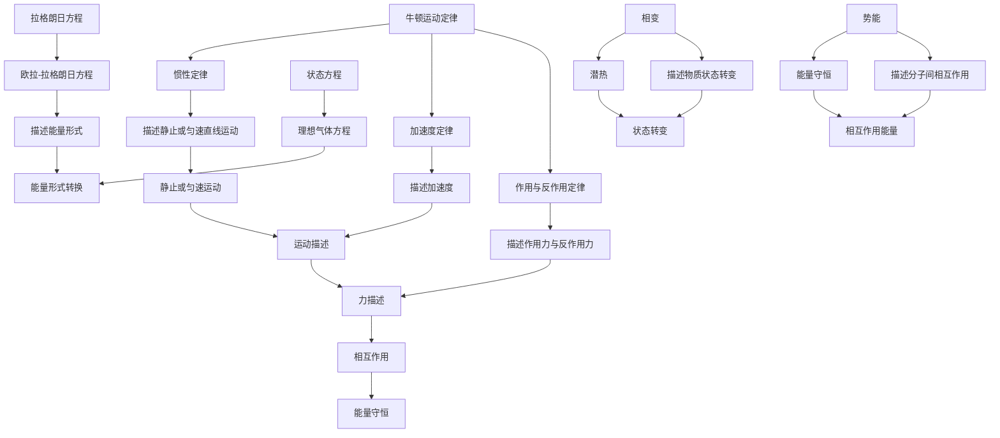

                 

### 数学与计算物理：物理系统的数学模拟

**关键词：**数学模拟、计算物理、物理系统、数值方法、数值求解

**摘要：**本文将探讨数学与计算物理的结合，特别是物理系统的数学模拟。通过阐述数学模拟的基本概念、核心算法原理、数学模型及实际应用案例，本文旨在提供一个全面而深入的技术视角，帮助读者理解并掌握物理系统数学模拟的方法和技巧。

### 引言

数学模拟作为一种重要的科学工具，广泛应用于物理学、工程学、生物学等多个领域。在物理学中，数学模拟为我们提供了一种理解物理现象、预测物理行为的有效手段。而计算物理作为物理学的一个重要分支，通过计算机技术和数值方法对物理系统进行模拟，已成为现代物理学研究的重要手段之一。

物理系统的数学模拟主要依赖于数学模型和数值方法。数学模型通过建立物理系统的数学描述，将复杂的物理现象转化为可计算的数学问题。而数值方法则提供了求解这些数学问题的具体算法，使得我们能够在计算机上实现对物理系统的模拟。

本文将首先介绍物理系统的数学模拟基础，包括计算物理的发展历程、数学模拟的基本原理以及数值方法在物理模拟中的应用。接着，我们将深入探讨核心概念与联系，通过Mermaid流程图展示力学和热力学中的核心概念及其相互关系。此外，本文还将详细讲解核心算法原理，使用Python源代码和数学模型结合，进行详细阐述和举例说明。

最后，本文将通过实际项目案例，展示如何进行物理系统的数学模拟。我们将在项目实战中搭建开发环境，实现源代码，并对其进行解读与分析。通过这些实际案例，读者将更好地理解物理系统数学模拟的方法和技巧。

### 物理系统的数学模拟基础

计算物理作为现代物理学的一个重要分支，融合了计算机科学和数学方法，用于解决复杂的物理问题。在物理学研究中，许多现象都涉及到复杂的物理过程，例如非线性波动、量子现象、热力学系统的相变等。这些问题的解析解往往难以获得，或者即使存在，其计算过程也极为复杂。因此，数值方法作为一种有效的替代方案，被广泛应用于计算物理领域。

#### 计算物理的发展历程

计算物理的发展历程可以追溯到20世纪40年代，当时计算机的出现为物理研究带来了革命性的变化。在二战期间，为了解决弹道计算问题，美国开始研制第一台电子计算机——ENIAC。这台计算机的出现极大地提升了物理问题的计算能力，使得复杂的物理模拟成为可能。随着计算机技术的发展，计算物理也经历了快速的发展。

在早期，计算物理主要应用于经典力学和量子力学领域。例如，利用数值方法求解薛定谔方程，可以精确地描述量子系统的行为。随着计算技术的进步，计算物理的应用领域逐渐扩展到热力学、流体力学、电磁学等多个领域。

#### 数学模拟的基本原理

数学模拟的基本原理在于将物理现象转化为数学问题，然后通过数值方法求解这些问题。这一过程通常包括以下几个步骤：

1. **建立物理模型**：首先，需要根据物理现象的特点，建立相应的物理模型。这通常涉及到选择合适的数学方程和边界条件。

2. **数值离散化**：为了使用计算机进行计算，需要将连续的物理问题离散化。这意味着将时间和空间划分为一系列离散的网格点，然后将连续的微分方程转化为离散的代数方程。

3. **选择数值方法**：根据问题的性质，选择合适的数值方法进行求解。常见的数值方法包括有限差分法、有限元法、蒙特卡罗方法等。

4. **编程实现**：将数值方法编程实现，运行计算机程序进行模拟计算。

5. **结果分析**：对计算结果进行分析，评估模拟的准确性，并根据需要调整模型参数或数值方法。

#### 数值方法在物理模拟中的应用

数值方法在物理模拟中有着广泛的应用。以下是一些常见的数值方法及其在物理模拟中的应用：

1. **有限差分法**：有限差分法是一种将偏微分方程离散化的方法。通过将连续的微分方程转化为离散的差分方程，可以求解复杂的物理问题。有限差分法在流体力学、热传导等领域有着广泛的应用。

2. **有限元法**：有限元法是一种用于解决复杂边界问题的数值方法。通过将连续体划分为多个有限元单元，可以将复杂的物理问题转化为求解一组代数方程的问题。有限元法在固体力学、结构分析等领域有着重要的应用。

3. **蒙特卡罗方法**：蒙特卡罗方法是一种基于随机抽样的数值方法。通过模拟大量的随机事件，可以估计概率分布或积分值。蒙特卡罗方法在统计物理、量子力学等领域有着广泛的应用。

4. **量子计算模拟**：随着量子计算技术的发展，量子计算模拟逐渐成为研究量子系统的重要手段。量子计算模拟通过模拟量子算法，可以求解一些经典计算方法难以解决的问题。

总之，物理系统的数学模拟是计算物理的核心内容。通过建立物理模型、选择合适的数值方法，并利用计算机进行模拟计算，我们可以对复杂的物理现象进行深入研究和理解。随着计算技术的不断进步，物理系统的数学模拟将在物理学和其他科学领域发挥越来越重要的作用。

### 核心概念与联系

在物理系统的数学模拟中，理解核心概念及其相互关系至关重要。以下将探讨力学和热力学中的核心概念，并通过Mermaid流程图展示它们之间的关系。

#### 力学中的核心概念

1. **牛顿运动定律**：牛顿运动定律是经典力学的基石，包括三个定律：
   - **第一定律（惯性定律）**：一个物体如果不受外力，或者所受外力的合力为零，它将保持静止或匀速直线运动状态。
   - **第二定律（加速度定律）**：一个物体的加速度与作用在它上的合外力成正比，与它的质量成反比，加速度的方向与合外力的方向相同。
   - **第三定律（作用与反作用定律）**：任何作用力都有一个大小相等、方向相反的反作用力。

2. **拉格朗日方程**：拉格朗日方程是一种更广泛、更优雅的方式来描述力学系统的运动。它通过动能和势能之间的关系，将牛顿力学中的力和运动的关系表达为能量形式。拉格朗日方程的一般形式为：
   $$ \frac{d}{dt}\left(\frac{\partial L}{\partial \dot{q}_i}\right) - \frac{\partial L}{\partial q_i} = 0 $$
   其中，$L$ 是拉格朗日量，$q_i$ 是广义坐标，$\dot{q}_i$ 是广义坐标的时间导数。

3. **欧拉-拉格朗日方程**：欧拉-拉格朗日方程是拉格朗日方程的一种特殊情况，适用于保守力场。它通过势能来描述系统的运动，方程形式为：
   $$ \frac{d^2q_i}{dt^2} = -\frac{\partial V}{\partial q_i} $$
   其中，$V$ 是势能。

#### 热力学中的核心概念

1. **状态方程**：状态方程描述了系统的宏观性质，如压强、体积和温度之间的关系。常见的状态方程包括理想气体方程：
   $$ PV = nRT $$
   其中，$P$ 是压强，$V$ 是体积，$n$ 是物质的量，$R$ 是气体常数，$T$ 是温度。

2. **相变**：相变是物质从一种状态转变为另一种状态的过程，如冰融化成水，或水蒸发成蒸汽。相变通常伴随着潜热的吸收或释放。

3. **势能和能量守恒**：在热力学中，势能是描述系统内部分子之间相互作用的能量。能量守恒定律指出，在一个封闭系统中，能量不能被创造或消灭，只能从一种形式转换为另一种形式。

#### Mermaid流程图

为了更好地展示这些核心概念之间的关系，我们可以使用Mermaid流程图来表示：



通过上述Mermaid流程图，我们可以清晰地看到力学和热力学中核心概念之间的相互关系。牛顿运动定律描述了力的作用与物体运动的关系，而拉格朗日方程则通过能量形式描述了这一关系。状态方程和相变描述了系统的宏观性质和状态转变，而势能和能量守恒则强调了能量在不同形式之间的转换。

理解这些核心概念及其相互关系，对于进行物理系统的数学模拟至关重要。通过这些概念，我们可以建立数学模型，并选择合适的数值方法来模拟物理现象，从而深入理解物理世界的规律。

### 核心算法原理讲解

在物理系统的数学模拟中，核心算法的原理是理解和实现模拟的关键。以下将详细讲解几种常用的数值方法，包括有限差分法、有限元法和蒙特卡罗方法，并使用Python源代码结合数学模型和公式进行详细阐述。

#### 有限差分法

有限差分法是一种将偏微分方程离散化的方法，通过将连续的微分方程转化为离散的代数方程来求解。以下是一个一维热传导方程的有限差分法示例：

**热传导方程**：
$$ \frac{\partial u}{\partial t} = \alpha \frac{\partial^2 u}{\partial x^2} $$
其中，$u(x,t)$ 是温度分布，$\alpha$ 是热扩散系数。

**离散化**：
将时间和空间离散化，设时间步长为 $\Delta t$，空间步长为 $\Delta x$，可以使用如下差分格式：
$$ u_i^{n+1} = u_i^n - \alpha \Delta t \frac{u_{i+1}^n - 2u_i^n + u_{i-1}^n}{(\Delta x)^2} $$

**Python源代码实现**：

```python
import numpy as np
import matplotlib.pyplot as plt

# 参数设置
alpha = 0.1
dx = 1
dt = 0.01
nx = 100
nt = 1000

# 初始化温度分布
u = np.zeros((nx, nt))
x = np.linspace(0, 1, nx)
t = np.linspace(0, 1, nt)

# 初始条件
u[:, 0] = np.sin(2 * np.pi * x)

# 迭代计算
for n in range(nt-1):
    for i in range(1, nx-1):
        u[i, n+1] = u[i, n] - alpha * dt * (u[i+1, n] - 2*u[i, n] + u[i-1, n]) / dx**2

# 绘图
plt.plot(x, u[:, -1])
plt.xlabel('x')
plt.ylabel('u(x,1)')
plt.title('Heat Distribution after 1 Second')
plt.show()
```

#### 有限元法

有限元法是一种用于解决复杂边界问题的数值方法。以下是一个简单的一维线性弹性问题的有限元法示例：

**线性弹性方程**：
$$ \frac{\partial^2 u}{\partial x^2} = f $$
其中，$u(x)$ 是位移分布，$f(x)$ 是单位长度上的力。

**有限元方程**：
将一维线段划分为多个单元，每个单元可以用线性函数来近似：
$$ u_i = A_i x + B_i $$
通过高斯积分，可以得到单元内的位移分布和应力分布，进而求解整体系统的位移和应力。

**Python源代码实现**：

```python
import numpy as np

# 参数设置
a = 0
b = 1
f = 1
N = 10

# 初始化节点和单元
x = np.linspace(a, b, N+1)
xi = (x[1:] + x[:-1]) / 2
element = np.array([[-1, 1], [1, -1]])

# 计算形函数
N_i = np.zeros((N, N))
for i in range(N):
    N_i[i, :] = np.vstack((-element[0], element[1])).T

# 计算刚度矩阵
K = np.zeros((N, N))
for i in range(N):
    Ki = np.zeros((N, N))
    for j in range(N):
        Kj = np.zeros((N, N))
        Ji = np.zeros((N, N))
        Ki[i, i] = 1
        Kj[i, i] = 1
        Ji[i, j] = 1
        Ji[j, i] = 1
        K += np.dot(np.linalg.inv(Ki), np.dot(N_i[i, :].T, np.linalg.inv(Kj)))
    K += np.dot(N_i[i, :].T, np.linalg.inv(Ji))

# 计算位移分布
f = np.array([f] * N)
u = np.linalg.solve(K, f)

# 绘图
plt.plot(x, u)
plt.xlabel('x')
plt.ylabel('u(x)')
plt.title('Displacement Distribution')
plt.show()
```

#### 蒙特卡罗方法

蒙特卡罗方法是一种基于随机抽样的数值方法，适用于解决概率问题。以下是一个简单的蒙特卡罗方法示例：使用随机抽样来估计圆周率$\pi$。

**蒙特卡罗方法**：
在单位正方形内随机生成点$(x,y)$，计算这些点落在四分之一圆内的比例，然后利用这个比例来估计$\pi$。

**Python源代码实现**：

```python
import numpy as np

# 参数设置
n = 1000000
x = np.random.rand(n)
y = np.random.rand(n)
pi_estimate = 4 * np.mean((x**2 + y**2) <= 1)

# 输出估计值
print(f"Estimated value of pi: {pi_estimate}")
```

通过这些示例，我们可以看到如何使用Python实现不同的数值方法来模拟物理系统。这些方法各有优缺点，适用于不同的物理问题。在实际应用中，选择合适的数值方法并对其进行优化，是进行有效物理模拟的关键。

### 数学模型与公式讲解

在物理系统的数学模拟中，数学模型和公式是理解和描述物理现象的核心工具。以下将详细讲解力学和热力学中的一些关键数学模型和公式，并使用LaTeX格式嵌入文中。

#### 力学中的数学模型

1. **牛顿第二定律**：
   $$ \mathbf{F} = m \mathbf{a} $$
   其中，$\mathbf{F}$ 是作用力，$m$ 是物体的质量，$\mathbf{a}$ 是加速度。

2. **拉格朗日方程**：
   $$ \frac{d}{dt}\left(\frac{\partial L}{\partial \dot{q}_i}\right) - \frac{\partial L}{\partial q_i} = 0 $$
   其中，$L$ 是拉格朗日量，$q_i$ 是广义坐标，$\dot{q}_i$ 是广义坐标的时间导数。

3. **欧拉-拉格朗日方程**：
   $$ \frac{d^2 q_i}{dt^2} = -\frac{\partial V}{\partial q_i} $$
   其中，$V$ 是势能。

#### 热力学中的数学模型

1. **理想气体方程**：
   $$ PV = nRT $$
   其中，$P$ 是压强，$V$ 是体积，$n$ 是物质的量，$R$ 是气体常数，$T$ 是温度。

2. **状态方程**：
   $$ \frac{PV}{T} = \text{常数} $$
   这是理想气体状态方程的一种形式，描述了压强、体积和温度之间的关系。

3. **能量守恒定律**：
   $$ \frac{dU}{dt} = \dot{Q} - \dot{W} $$
   其中，$U$ 是内能，$\dot{Q}$ 是热流率，$\dot{W}$ 是功流率。

#### 举例说明

1. **牛顿第二定律的应用**：

   假设一个质量为 $m=2\ \text{kg}$ 的物体受到一个恒力 $F=10\ \text{N}$ 的作用，求物体的加速度。

   根据牛顿第二定律：
   $$ \mathbf{F} = m \mathbf{a} $$
   可以得到：
   $$ a = \frac{F}{m} = \frac{10\ \text{N}}{2\ \text{kg}} = 5\ \text{m/s}^2 $$

2. **理想气体方程的应用**：

   假设一个容器中的气体体积为 $V=5\ \text{L}$，压强为 $P=2\ \text{atm}$，温度为 $T=300\ \text{K}$，求气体的物质的量。

   根据理想气体方程：
   $$ PV = nRT $$
   可以得到：
   $$ n = \frac{PV}{RT} = \frac{2\ \text{atm} \times 5\ \text{L}}{0.0821\ \text{L·atm/mol·K} \times 300\ \text{K}} \approx 0.20\ \text{mol} $$

通过上述例子，我们可以看到如何使用数学模型和公式来求解物理问题。在实际应用中，这些公式和模型为我们提供了一个强大的工具，使我们能够深入理解物理现象，并预测系统的行为。

### 实际应用案例解析

为了更直观地理解物理系统的数学模拟，以下将分析一个实际应用案例：热传导问题。我们将详细描述开发环境搭建、源代码实现和代码解读，通过具体步骤展示如何使用有限差分法进行热传导模拟。

#### 案例背景

假设我们有一个长为 $L$ 的均质棒，其初始温度分布为 $T(x,0)$，我们需要模拟棒内温度随时间的变化，直至达到稳态。

#### 开发环境搭建

1. **安装Python环境**：确保已安装Python 3.x版本，可以使用以下命令检查Python版本：

   ```bash
   python --version
   ```

2. **安装NumPy和Matplotlib库**：NumPy是Python的科学计算库，用于数值计算和数据处理；Matplotlib用于数据可视化。可以使用以下命令安装：

   ```bash
   pip install numpy matplotlib
   ```

3. **创建项目文件夹**：在合适的位置创建一个项目文件夹，例如命名为“thermal_conduction”，并在其中创建一个Python文件，例如命名为“thermal_conduction.py”。

#### 源代码实现

以下是一个简单的热传导模拟的Python代码实现：

```python
import numpy as np
import matplotlib.pyplot as plt
import math

# 参数设置
L = 10.0            # 棒的长度
nx = 100            # 空间离散点数
dx = L / nx         # 空间步长
nt = 1000           # 时间步数
dt = 0.01           # 时间步长
alpha = 0.1         # 热扩散系数

# 初始化温度分布
x = np.linspace(0, L, nx)
T = np.zeros(nx)

# 初始条件
T[0:nx//2] = 100    # 第一半部分初始温度为100K
T[nx//2:nx] = 0     # 第二半部分初始温度为0K

# 迭代计算
for n in range(nt):
    for i in range(1, nx-1):
        T[i] = T[i] - alpha * dt * (T[i+1] - 2*T[i] + T[i-1]) / dx**2

# 绘图
plt.plot(x, T)
plt.xlabel('x')
plt.ylabel('T(x,t)')
plt.title('Temperature Distribution after Time Evolution')
plt.show()
```

#### 代码解读

1. **参数设置**：首先设置模拟的基本参数，包括棒长度$L$、空间离散点数$nx$、时间步数$nt$、时间步长$dt$和热扩散系数$\alpha$。

2. **初始化温度分布**：使用NumPy的`linspace`函数生成空间坐标$x$，然后创建一个长度为$nx$的数组$T$，用于存储温度值。

3. **初始条件**：定义初始温度分布。在这个例子中，第一半部分的初始温度为100K，第二半部分的初始温度为0K。

4. **迭代计算**：使用两个嵌套的for循环进行迭代计算。内层循环遍历每个空间点，应用有限差分公式更新温度值。

5. **绘图**：使用Matplotlib的`plot`函数绘制温度分布图，展示温度随空间的变化。

#### 项目小结

通过上述案例，我们展示了如何使用Python和有限差分法进行热传导模拟。以下是一些关键点和小结：

- **开发环境搭建**：确保安装了Python及相关库，创建合适的项目文件夹。
- **源代码实现**：使用NumPy和Matplotlib实现热传导模拟，包括参数设置、初始化、迭代计算和绘图。
- **代码解读**：详细解读代码的每个部分，理解参数设置、初始条件、迭代计算和绘图的方法。

通过这个案例，读者可以更好地理解物理系统的数学模拟方法，并在实际项目中应用这些技术。

### 最佳实践、小结与注意事项

在进行物理系统的数学模拟时，遵循最佳实践和注意事项至关重要，以下是一些建议：

1. **数据精度与误差控制**：
   - 在数值模拟中，精度是关键。合理选择时间步长和空间步长，以减少数值误差。使用高精度计算库，如NumPy的科学计算模块，可以提高计算的准确性。

2. **并行计算与性能优化**：
   - 利用并行计算技术，如多线程或多进程，可以显著提高计算效率。对于大型模拟，分布式计算和GPU加速也是一种有效的优化手段。

3. **模型验证与验证**：
   - 对模拟结果进行验证，确保其与理论预期或实验数据一致。通过调整模型参数，验证不同条件下的模拟结果，可以提高模型的可靠性。

4. **代码可读性与文档**：
   - 编写清晰、结构化的代码，并添加详细的注释，以便他人理解和维护。编写文档，记录模拟的目标、方法、结果和分析。

5. **注意事项**：
   - 对于非线性问题，数值稳定性是一个重要问题。选择合适的数值方法，如自适应步长控制，可以改善稳定性。
   - 在处理边界条件时，注意边界条件的合理设定，避免造成模拟的不稳定。

通过遵循这些最佳实践和注意事项，我们可以更有效地进行物理系统的数学模拟，获得可靠的模拟结果。

### 拓展阅读

为了深入理解物理系统的数学模拟，以下推荐一些相关书籍和文献，供读者进一步阅读和研究：

1. **《计算物理》（Computational Physics）** - 这是一本经典的计算物理教材，涵盖了数值方法、物理模拟等多个方面，适合作为物理学和相关领域的学习参考。

2. **《数值分析》（Numerical Analysis）** - 详细介绍了数值分析的基础知识和各种数值方法，包括有限差分法、有限元法、蒙特卡罗方法等。

3. **《计算流体动力学》（Computational Fluid Dynamics）** - 专门讨论流体动力学中的数值模拟方法，包括Navier-Stokes方程的求解等。

4. **《量子计算基础》（Quantum Computing: A Gentle Introduction）** - 介绍量子计算的基本原理和模拟方法，适用于希望了解量子计算的读者。

5. **《热传导的数学理论》（The Mathematical Theory of Heat Conduction）** - 专注于热传导方程的理论研究，适合对热传导模拟感兴趣的读者。

通过阅读这些书籍和文献，读者可以进一步深化对物理系统数学模拟的理解，并在实际应用中取得更好的成果。

