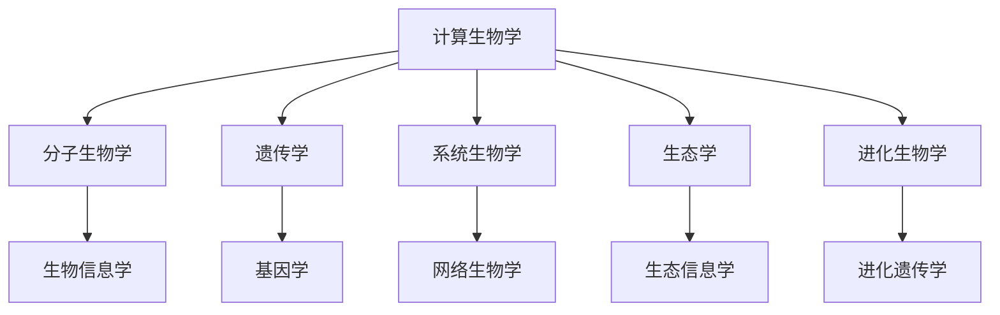

                 

# 数学与计算生物学：生物系统的数学建模

## 关键词
计算生物学、数学建模、生物系统、基因调控网络、生态系统、Python代码

## 摘要
本文深入探讨了数学与计算生物学在生物系统建模中的应用，包括基因调控网络、生物分子交互和细胞信号传递等领域的数学建模方法。通过详细的Python代码示例和实际案例分析，本文不仅展示了如何使用数学模型来解析复杂的生物过程，还为读者提供了实用工具和技巧，以支持他们在计算生物学领域的进一步研究。

## 引言

### 计算生物学基础

计算生物学是一门跨学科领域，它结合了计算机科学、数学和生物学，以定量和计算的方式研究生命现象。计算生物学涉及的主要领域包括分子生物学、遗传学、系统生物学、生态学、进化生物学等。这些领域相互关联，共同构成了计算生物学的知识体系。

在计算生物学中，数学建模是核心方法之一。通过数学模型，我们可以将复杂的生物系统简化为数学表达式，从而便于分析和理解。主要的数学工具包括微积分、概率论与数理统计、线性代数以及复杂数学模型（如微分方程、图论等）。

#### 核心概念与联系

为了更好地理解计算生物学涉及的领域和交叉学科，我们可以使用Mermaid流程图来表示：



### 数学建模在生物系统中的应用

数学建模在生物系统中有着广泛的应用。例如，我们可以使用数学模型来研究基因调控网络、生物分子交互、细胞信号传递以及生态系统等。

- **基因调控网络**：通过数学模型，我们可以研究基因之间的相互作用，理解基因如何响应外界刺激，并调节生物体的生理状态。
- **生物分子交互**：数学模型可以帮助我们理解生物分子之间的相互作用，如蛋白质与DNA、RNA之间的相互作用。
- **细胞信号传递**：细胞信号传递是细胞间通讯的重要方式，数学模型可以用来模拟细胞信号传递的过程，揭示信号如何从细胞表面传递到细胞内部。
- **生态系统**：数学模型可以用来研究生态系统中物种间的相互作用，预测生态系统的稳定性和动态变化。

### 计算生物学中的数学工具

在计算生物学中，我们使用多种数学工具来构建和解析模型。以下是几个主要的数学工具及其在计算生物学中的应用：

- **微积分**：用于描述生物系统中的连续变化，如细胞内物质的动态变化。
- **概率论与数理统计**：用于分析生物数据，如基因组序列和蛋白质结构。
- **线性代数**：用于解决线性方程组，如描述基因调控网络中的关系。
- **复杂数学模型**：如微分方程、图论等，用于模拟生物系统中的复杂过程。

### 计算生物学中的数学建模方法

数学建模在计算生物学中有两种主要方法：数据驱动建模和理论驱动建模。

- **数据驱动建模**：基于实验数据和统计方法，通过机器学习等技术建立模型。这种方法适合于没有明确理论支持的情况。
- **理论驱动建模**：基于生物学理论和物理定律，通过数学方程描述生物系统的行为。这种方法需要深厚的生物学知识和数学功底。

### 计算生物学中的模拟与仿真

模拟与仿真是在计算生物学中验证和测试数学模型的重要手段。通过模拟，我们可以模拟生物系统的行为，预测未来的变化，并验证模型的准确性。

常用的计算生物学仿真软件和工具包括MATLAB、Python、C++等。这些工具提供了丰富的库和函数，可以方便地实现各种数学模型。

#### 模拟的基本概念

模拟（Simulation）是一种通过计算机程序模拟现实世界过程的方法。在计算生物学中，模拟主要用于验证和测试数学模型的准确性。

模拟可以分为两种类型：确定性模拟和随机模拟。确定性模拟基于确定的数学方程，每次运行结果相同。随机模拟则引入随机性，每次运行结果可能不同。

#### 仿真软件与工具

常用的计算生物学仿真软件和工具包括：

- **MATLAB**：适用于复杂的数学建模和仿真，提供了丰富的生物建模工具箱。
- **Python**：适用于快速开发和测试，有多个生物建模库，如BioPython、SciPy等。
- **C++**：适用于高性能计算，适用于大规模生物系统建模。

### 模拟与仿真案例分析

为了更好地理解模拟与仿真的应用，我们可以通过一个具体案例来展示如何使用Python进行生物系统建模和仿真。

#### 案例一：基因调控网络的仿真

在这个案例中，我们将使用Python和BioPython库来建立一个简单的基因调控网络，并对其进行仿真。

```python
import bionetgen as bng

# 建立基因调控网络
model = bng.Model()
model.add_gene("A")
model.add_gene("B")
model.add_repression("A", "B")

# 添加仿真时间
model.set_simulation_time(100)

# 运行仿真
simulation = bng.Simulation(model)
results = simulation.run()

# 分析结果
print(results.gene_counts("A"))
print(results.gene_counts("B"))
```

在这个案例中，我们建立了两个基因A和B，并设定A基因抑制B基因。通过仿真，我们可以观察到A和B基因的表达水平随时间的变化。

### 数学与计算生物学的未来

随着技术的进步，数学与计算生物学在生物系统建模中的应用将越来越广泛。未来的研究将更加关注复杂生物系统的建模与仿真，以及如何将多尺度、多层次的模型整合起来，以更好地理解生命现象。

此外，人工智能和机器学习技术的应用也将为计算生物学带来新的机遇。通过大数据分析和深度学习，我们可以更好地预测生物系统的行为，发现新的生物学规律。

总之，数学与计算生物学在生物系统建模中的应用前景广阔，将对生命科学产生深远的影响。在接下来的章节中，我们将深入探讨基因调控网络、生物分子交互和细胞信号传递等领域的数学建模方法，并分享实际案例和分析。

---

在本章中，我们介绍了计算生物学的基础知识，包括其涉及的主要领域、数学建模方法以及模拟与仿真的基本概念。通过Mermaid流程图和Python代码示例，我们展示了如何将复杂的生物系统转化为数学模型，并通过仿真来验证和测试模型的准确性。

在接下来的章节中，我们将继续深入探讨计算生物学中的具体领域，包括基因调控网络、生物分子交互和细胞信号传递等，以帮助读者更好地理解数学建模在生物系统中的应用。敬请期待。

