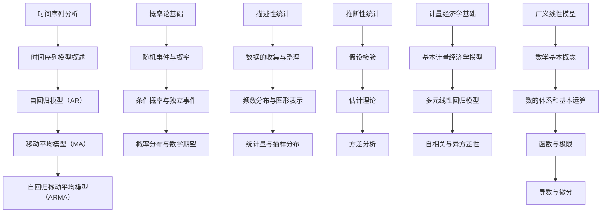
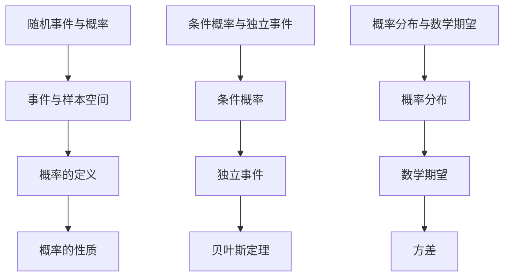
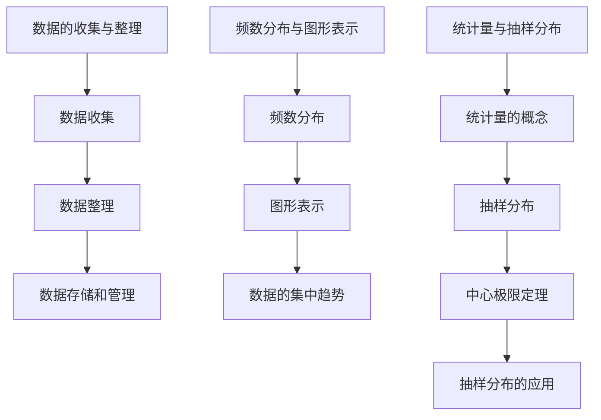
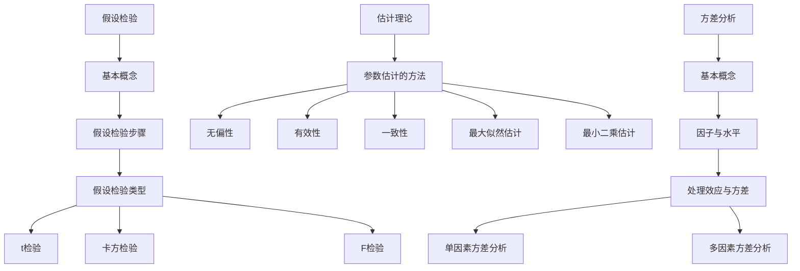
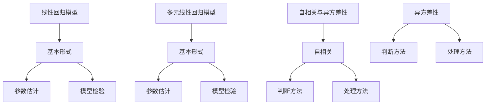
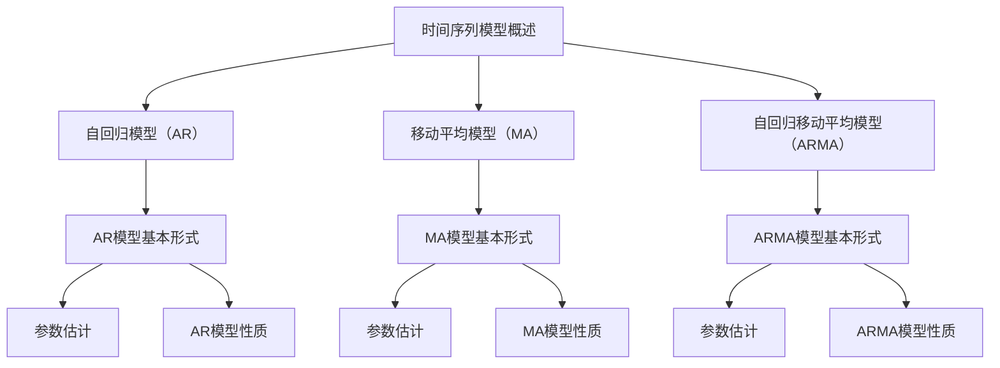
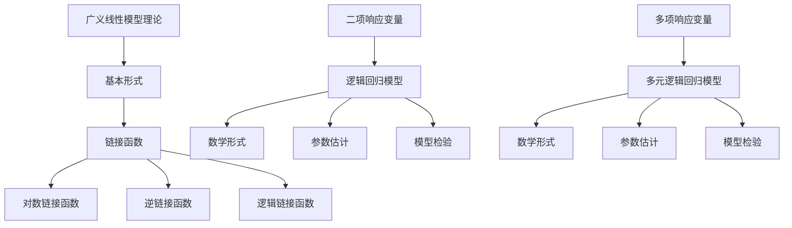

                 

### 《数学与计量经济学：经济数据的数学分析》

#### 关键词
- 数学基础
- 计量经济学
- 经济数据
- 数学分析
- 概率论
- 统计学

#### 摘要
本文将深入探讨数学与计量经济学在经济数据分析中的应用，从数学基础、统计学基础到计量经济学模型，逐步揭示经济数据的数学分析方法。通过核心概念、算法原理、数学模型、数学公式以及项目实战的详细讲解，帮助读者全面掌握经济数据建模与分析的方法，提升在经济学研究中的数据驱动能力。

## 目录大纲

### 第一部分：数学基础

#### 第1章：数学基本概念
1.1 数的体系和基本运算
1.2 函数与极限
1.3 导数与微分

#### 第2章：概率论基础
2.1 随机事件与概率
2.2 条件概率与独立事件
2.3 概率分布与数学期望

### 第二部分：统计学基础

#### 第3章：描述性统计
3.1 数据的收集与整理
3.2 频数分布与图形表示
3.3 统计量与抽样分布

#### 第4章：推断性统计
4.1 假设检验
4.2 估计理论
4.3 方差分析

### 第三部分：计量经济学基础

#### 第5章：基本计量经济学模型
5.1 线性回归模型
5.2 多元线性回归模型
5.3 自相关与异方差性

#### 第6章：时间序列分析
6.1 时间序列模型概述
6.2 自回归模型（AR）
6.3 移动平均模型（MA）
6.4 自回归移动平均模型（ARMA）

#### 第7章：广义线性模型
7.1 广义线性模型理论
7.2 二项响应变量
7.3 多项响应变量

### 第四部分：数学与计量经济学的应用

#### 第8章：经济数据建模实战
8.1 实战一：房价预测
8.2 实战二：股票市场分析
8.3 实战三：宏观经济预测

#### 第9章：项目实战案例解析
9.1 案例一：消费者行为分析
9.2 案例二：劳动力市场研究
9.3 案例三：政策效果评估

#### 第五部分：数学与计量经济学工具与应用

#### 第10章：计量经济学软件介绍
10.1 EViews操作入门
10.2 R语言与计量经济学
10.3 Python在计量经济学中的应用

## 引言

在经济学研究中，数据是决策的基础，而数学与计量经济学则是分析和解读这些数据的利器。数学为经济学提供了强大的理论工具，使我们能够准确描述经济现象，建立经济模型，从而进行预测和政策分析。计量经济学则利用统计学方法，将数学模型应用于经济数据，通过数据分析和模型验证，揭示经济变量的内在关系。

本文旨在深入探讨数学与计量经济学在经济数据分析中的应用，从数学基础、统计学基础到计量经济学模型，逐步揭示经济数据的数学分析方法。通过核心概念、算法原理、数学模型、数学公式以及项目实战的详细讲解，帮助读者全面掌握经济数据建模与分析的方法，提升在经济学研究中的数据驱动能力。

本文将分为五个部分：

1. **数学基础**：介绍数学的基本概念、函数、极限、导数等，为后续的计量经济学分析打下基础。
2. **统计学基础**：包括描述性统计和推断性统计，讲解如何收集、整理、分析和解释经济数据。
3. **计量经济学基础**：介绍线性回归、多元线性回归、时间序列分析、广义线性模型等基本计量经济学模型，并详细讲解每个模型的原理和应用。
4. **数学与计量经济学的应用**：通过实际案例，展示如何将数学与计量经济学方法应用于经济数据分析，包括房价预测、股票市场分析、宏观经济预测等。
5. **数学与计量经济学工具与应用**：介绍常用的计量经济学软件，包括EViews、R语言和Python，并展示如何在实际项目中应用这些工具。

通过本文的逐步引导，读者将能够系统地掌握经济数据的数学分析方法，为未来的经济学研究奠定坚实的基础。

## 第一部分：数学基础

### 第1章：数学基本概念

#### 1.1 数的体系和基本运算

数的体系是数学的基础，它包括自然数、整数、有理数、实数和复数等。这些数的集合构成了数学运算的基本对象。

- **自然数**：自然数是从1开始的正整数集合，如1，2，3，4，...。自然数用于计数和排序。
- **整数**：整数包括自然数和它们的负数，如...，-3，-2，-1，0，1，2，3，...。整数用于表示数量、距离和温度等。
- **有理数**：有理数是可以表示为两个整数之比的数，如$\frac{1}{2}$，$\frac{-3}{4}$。有理数包括整数和分数。
- **实数**：实数包括有理数和无理数，如$\sqrt{2}$，$\pi$。实数是经济学中最常用的数集，因为它包括了所有可能的测量值。
- **复数**：复数是形如$a+bi$的数，其中$a$和$b$是实数，$i$是虚数单位，满足$i^2=-1$。复数在经济学中的应用较少，但在某些高级数学领域中非常重要。

**基本运算**：

- **加法**：两个数相加得到它们的和。加法满足交换律和结合律。
  $$
  a + b = b + a
  $$
  $$
  (a + b) + c = a + (b + c)
  $$
- **减法**：减法是加法的逆运算，表示从一个数中减去另一个数。
  $$
  a - b = a + (-b)
  $$
- **乘法**：两个数相乘得到它们的积。乘法满足交换律和结合律。
  $$
  a \times b = b \times a
  $$
  $$
  (a \times b) \times c = a \times (b \times c)
  $$
- **除法**：除法是乘法的逆运算，表示将一个数除以另一个数。
  $$
  a \div b = a \times \frac{1}{b}
  $$

#### 1.2 函数与极限

**函数**：

函数是数学中的基本概念，它描述了两个变量之间的关系。给定一个自变量$x$和一个因变量$y$，如果对于$x$的每一个值，$y$都有唯一确定的值，那么我们就说$y$是$x$的函数，记作$y=f(x)$。

- **定义域**：函数定义域是所有可能的自变量值的集合。
- **值域**：函数值域是所有可能的因变量值的集合。
- **一一对应**：一个函数必须确保每个自变量值对应一个唯一的因变量值。

**极限**：

极限是数学分析中的核心概念，用于描述函数在某一点附近的行为。给定一个函数$f(x)$，如果当$x$趋近于某个特定值$a$时，$f(x)$的值趋近于某个特定的数$L$，那么我们称$L$是$f(x)$在$x=a$的极限。

- **左极限**：当$x$从左侧（即$x<a$）趋近于$a$时，$f(x)$的极限称为左极限，记作$\lim_{{x \to a^-}} f(x)$。
- **右极限**：当$x$从右侧（即$x>a$）趋近于$a$时，$f(x)$的极限称为右极限，记作$\lim_{{x \to a^+}} f(x)$。
- **极限**：如果左极限和右极限相等，则该极限存在，记作$\lim_{{x \to a}} f(x) = L$。

#### 1.3 导数与微分

**导数**：

导数是描述函数在某一点附近变化率的量。给定一个函数$f(x)$，如果在某一点$x=a$处，$f(x)$的极限值存在，那么这个极限值称为$f(x)$在$x=a$的导数，记作$f'(a)$。

- **定义**：导数的定义为
  $$
  f'(a) = \lim_{{h \to 0}} \frac{{f(a+h) - f(a)}}{h}
  $$
- **几何意义**：导数表示函数在$x=a$处的切线斜率。

**微分**：

微分是导数的一个近似计算方法，它表示函数在一个小增量$h$下的变化量。给定一个函数$f(x)$，在$x=a$处的微分表示为$df(a)$，定义为
  $$
  df(a) = f'(a) \cdot dh
  $$
其中$dh$是自变量$x$的微小变化量。

- **应用**：微分在经济学中用于近似计算，例如需求函数的弹性计算、成本函数的最小化等。

### Mermaid 流程图：核心概念与联系



### 总结

数学基本概念、函数与极限、导数与微分是经济学研究中不可或缺的基础知识。通过本章的介绍，我们了解了数的体系和基本运算，理解了函数和极限的概念，以及导数和微分的计算和应用。这些基础知识为后续的统计学和计量经济学分析奠定了坚实的基础。

## 第2章：概率论基础

### 2.1 随机事件与概率

概率论是数学的一个分支，主要研究随机现象的规律性。在经济学研究中，概率论提供了分析随机事件和不确定性的工具。

#### 随机事件

随机事件是可能发生也可能不发生的事件。用集合论表示，随机事件是样本空间$\Omega$的一个子集$A$。例如，抛硬币得到正面是一个随机事件。

- **样本空间**：样本空间是所有可能结果的集合。例如，抛两枚硬币，样本空间$\Omega$为$\{HH, HT, TH, TT\}$。
- **事件**：事件是样本空间的一个子集。例如，事件$A$为“两枚硬币都为正面”，即$A = \{HH\}$。

#### 概率

概率是描述随机事件发生可能性的量。用集合论表示，事件$A$的概率$P(A)$定义为在所有可能结果中，事件$A$所占的比例。

- **概率的定义**：对于任意事件$A$，有$0 \leq P(A) \leq 1$。如果$P(A) = 1$，则事件$A$必然发生；如果$P(A) = 0$，则事件$A$不可能发生。

#### 概率的性质

概率具有以下几个基本性质：

- **非负性**：对于任意事件$A$，有$P(A) \geq 0$。
- **规范性**：对于必然事件（即样本空间$\Omega$），有$P(\Omega) = 1$。
- **有限可加性**：对于任意一组互斥事件$A_1, A_2, \ldots, A_n$，有$P(A_1 \cup A_2 \cup \ldots \cup A_n) = P(A_1) + P(A_2) + \ldots + P(A_n)$。

#### 条件概率与独立事件

**条件概率**：

条件概率是考虑其他事件发生的条件下，某个事件发生的概率。设$A$和$B$是两个事件，$P(B) > 0$，则$A$在$B$发生的条件下的条件概率定义为
  $$
  P(A|B) = \frac{P(A \cap B)}{P(B)}
  $$
条件概率反映了在事件$B$发生的情况下，事件$A$发生的可能性。

**独立事件**：

两个事件$A$和$B$是独立的，如果其中一个事件的发生不影响另一个事件的发生。即对于两个独立事件$A$和$B$，有
  $$
  P(A \cap B) = P(A) \cdot P(B)
  $$
如果$A$和$B$独立，则它们同时发生的概率等于各自发生的概率的乘积。

#### 贝叶斯定理

贝叶斯定理是概率论中的一个重要公式，它描述了在已知一个事件发生的条件下，另一个事件发生的概率。设$A$和$B$是两个事件，且$P(B) > 0$，则
  $$
  P(A|B) = \frac{P(B|A) \cdot P(A)}{P(B)}
  $$
贝叶斯定理提供了一个从后验概率推断前验概率的方法。

### Mermaid 流程图：核心概念与联系



### 总结

本章介绍了概率论的基础知识，包括随机事件、概率、条件概率、独立事件以及贝叶斯定理。这些概念是经济学研究中理解和分析不确定性的基础。通过本章的学习，读者将能够掌握概率的基本概念和性质，为后续的统计学和计量经济学分析打下坚实的基础。

## 第3章：统计学基础

### 3.1 数据的收集与整理

统计学是一门通过收集、整理和分析数据来进行推断和预测的学科。数据的收集和整理是统计学的第一步，也是最重要的一步。正确和高效的数据收集和整理对于后续的统计分析和决策至关重要。

#### 数据收集

数据收集是指通过各种方法获取所需数据的过程。数据可以来自多种来源，如调查、实验、历史记录等。

- **调查数据**：通过问卷调查、访谈等方式收集数据，适用于了解公众意见、市场需求等。
- **实验数据**：通过实验方法收集数据，适用于研究因果关系和假设验证。
- **历史数据**：从历史记录或数据库中获取数据，适用于时间序列分析和趋势预测。

在进行数据收集时，需要注意以下几点：

- **数据质量**：确保收集到的数据是准确和可靠的，避免错误和遗漏。
- **样本代表性**：确保样本能够代表总体，避免抽样偏差。
- **数据隐私**：在收集个人数据时，需确保遵守数据隐私法规，保护被调查者的隐私。

#### 数据整理

数据整理是指将收集到的数据进行清洗、转换和归档，以便于后续分析。数据整理通常包括以下几个步骤：

- **数据清洗**：处理缺失值、异常值和重复值，确保数据的一致性和完整性。
- **数据转换**：将不同格式和单位的数据转换为统一的格式和单位，以便于分析和比较。
- **数据归档**：将整理好的数据存储在数据库或文件系统中，便于后续调用和查询。

#### 数据存储和管理

数据存储和管理是数据整理的重要环节，主要包括以下内容：

- **数据库选择**：根据数据量和需求选择合适的数据库系统，如关系型数据库（如MySQL、PostgreSQL）或NoSQL数据库（如MongoDB、Cassandra）。
- **数据备份**：定期备份数据，确保数据的安全性和可恢复性。
- **数据权限管理**：设置数据访问权限，确保数据的安全性和隐私。

#### 数据可视化

数据可视化是将数据转换为图形或图表的过程，有助于更直观地理解数据特征和趋势。常用的数据可视化工具包括Excel、Tableau、Matplotlib等。

- **图表类型**：根据数据特性和分析需求选择合适的图表类型，如柱状图、折线图、饼图、散点图等。
- **图表设计**：合理设计图表布局和样式，确保图表的可读性和美观性。

### 3.2 频数分布与图形表示

频数分布是描述数据集中各个数值出现的次数的统计方法。通过频数分布，我们可以了解数据的分布特征和集中趋势。

#### 频数分布

- **频数**：表示各个数值出现的次数。
- **频率**：表示各个数值出现的次数与总次数的比值。
- **频率分布表**：列出各个数值的频数和频率的表格。

#### 图形表示

图形表示能够更直观地展示数据的分布特征。常用的图形表示方法包括：

- **条形图**：用条形的长度表示各个数值的频数或频率，适用于离散数据。
- **直方图**：用矩形的面积表示各个区间的频数或频率，适用于连续数据。
- **饼图**：用扇形的面积表示各个类别的频数或频率，适用于分类数据。
- **折线图**：用折线连接各个数据点，表示数据的变化趋势，适用于时间序列数据。

#### 数据的集中趋势

数据的集中趋势反映了数据分布的中心位置。常用的集中趋势度量方法包括：

- **均值**：所有数值的总和除以数值的个数，表示数据的平均水平。
- **中位数**：将数据按大小排序后，位于中间位置的数值，表示数据的中间水平。
- **众数**：数据中出现次数最多的数值，表示数据的典型水平。

### 3.3 统计量与抽样分布

统计量是描述样本特征的统计量，用于估计总体参数。抽样分布是统计量的概率分布，反映了统计量在多次抽样中的变化特征。

#### 统计量

- **样本均值**：样本中所有数值的总和除以样本个数，用于估计总体均值。
- **样本中位数**：样本按大小排序后，位于中间位置的数值，用于估计总体中位数。
- **样本众数**：样本中出现次数最多的数值，用于估计总体众数。
- **样本方差**：样本中各个数值与样本均值之差的平方的平均值，用于估计总体方差。
- **样本标准差**：样本方差的平方根，用于估计总体标准差。

#### 抽样分布

- **抽样分布的概念**：抽样分布是统计量在多次抽样中的概率分布，反映了统计量在不同样本中的变化特征。
- **中心极限定理**：如果总体的分布是有限的，且样本量足够大，那么样本均值的抽样分布将趋近于正态分布。这意味着样本均值可以用来估计总体均值，且其抽样分布的均值为总体均值，标准差为总体标准差除以样本量的平方根。

#### 抽样分布的应用

- **置信区间**：根据抽样分布，我们可以计算总体参数的置信区间，用于估计总体参数的可能范围。
- **假设检验**：利用抽样分布，我们可以进行假设检验，判断样本统计量是否显著，从而对总体参数进行推断。

### Mermaid 流程图：核心概念与联系



### 总结

本章介绍了统计学的基础知识，包括数据的收集与整理、频数分布与图形表示、统计量与抽样分布。这些概念和方法是进行有效统计分析和决策的基础。通过本章的学习，读者将能够掌握数据收集与整理的方法，了解频数分布和图形表示，以及统计量和抽样分布的概念和应用。

## 第4章：推断性统计

### 4.1 假设检验

假设检验是统计学中用于判断总体参数是否满足某一假设的方法。在经济学研究中，假设检验常用于验证经济模型的假设、比较不同模型的效果等。

#### 假设检验的基本概念

- **原假设（H0）**：指总体参数满足的假设，通常表示为等式或不等式。
- **备择假设（H1）**：指与原假设相对立的假设，通常表示为不等式。
- **显著性水平（α）**：指拒绝原假设的概率，通常取值为0.05或0.01。

#### 假设检验的步骤

1. **提出假设**：根据研究目的，提出原假设和备择假设。
2. **选择检验方法**：根据数据的分布特征和研究目的，选择合适的检验方法。
3. **计算检验统计量**：根据样本数据，计算检验统计量，如t统计量、卡方统计量等。
4. **确定临界值**：根据显著性水平和检验方法，确定临界值。
5. **做出决策**：比较检验统计量和临界值，判断是否拒绝原假设。

#### 假设检验的类型

- **单样本假设检验**：适用于只对一个总体参数进行检验的情况，如检验总体的均值是否等于某一值。
- **双样本假设检验**：适用于比较两个总体的参数，如检验两个总体的均值是否相等。

#### 常用的假设检验方法

- **t检验**：用于比较样本均值和总体均值，适用于正态分布。
- **卡方检验**：用于比较样本分布和总体分布，适用于分类数据。
- **F检验**：用于比较两个样本方差，适用于正态分布。

### 4.2 估计理论

估计理论是统计学中用于估计总体参数的方法。在经济学研究中，估计理论用于估计经济模型的参数，如需求函数、成本函数等。

#### 参数估计的方法

- **点估计**：直接给出总体参数的估计值，如样本均值估计总体均值。
- **区间估计**：给出总体参数的估计区间，如置信区间。

#### 参数估计的性质

- **无偏性**：估计量的期望值等于总体参数的真实值。
- **有效性**：估计量的方差越小，估计效果越好。
- **一致性**：当样本量增加时，估计量逐渐接近总体参数的真实值。

#### 常用的估计方法

- **最大似然估计**：通过最大化似然函数来估计参数值。
- **最小二乘估计**：通过最小化残差平方和来估计参数值，适用于线性回归模型。

### 4.3 方差分析

方差分析（ANOVA）是用于比较多个总体均值是否相等的统计方法。在经济学研究中，方差分析常用于比较不同组别之间的差异，如不同政策效果的比较。

#### 方差分析的基本概念

- **因子**：影响观测值的变量，如政策变量。
- **水平**：因子的不同取值，如政策的不同实施方式。
- **处理效应**：不同水平下观测值的差异。
- **方差**：描述观测值变异性大小的量。

#### 方差分析的方法

- **单因素方差分析**：适用于只有一个因子的研究，如比较不同政策的效果。
- **多因素方差分析**：适用于有两个或多个因子的研究，如比较不同政策在不同地区的效果。

#### 方差分析的应用

- **比较不同组别的均值**：通过方差分析，判断不同组别的均值是否存在显著差异。
- **确定影响效应的大小**：通过方差分析，确定不同因子对观测值的影响大小。

### Mermaid 流程图：核心概念与联系



### 总结

本章介绍了推断性统计的核心方法，包括假设检验、估计理论和方差分析。这些方法在经济学研究中具有重要应用，用于验证经济模型的假设、估计模型参数以及比较不同组别的差异。通过本章的学习，读者将能够掌握推断性统计的基本概念和方法，为后续的经济学研究打下坚实基础。

## 第三部分：计量经济学基础

### 第5章：基本计量经济学模型

#### 5.1 线性回归模型

线性回归模型是最基本的计量经济学模型，用于研究一个因变量与多个自变量之间的关系。在经济学研究中，线性回归模型广泛用于预测和分析经济变量。

#### 线性回归模型的基本形式

线性回归模型的基本形式可以表示为：
$$
Y = \beta_0 + \beta_1X_1 + \beta_2X_2 + \ldots + \beta_kX_k + \varepsilon
$$
其中，$Y$是因变量，$X_1, X_2, \ldots, X_k$是自变量，$\beta_0, \beta_1, \beta_2, \ldots, \beta_k$是模型参数，$\varepsilon$是随机误差项。

- **截距项（$\beta_0$）**：表示当所有自变量为零时，因变量的值。
- **系数（$\beta_1, \beta_2, \ldots, \beta_k$）**：表示每个自变量对因变量的影响程度。
- **随机误差项（$\varepsilon$）**：表示模型未能解释的随机因素。

#### 模型的估计

线性回归模型的参数估计通常采用最小二乘法（Ordinary Least Squares, OLS）。最小二乘法的目标是找到一个线性回归模型，使得实际观测值与模型预测值之间的误差平方和最小。

最小二乘估计的公式如下：
$$
\beta = (X'X)^{-1}X'Y
$$
其中，$X$是自变量的矩阵，$Y$是因变量的向量，$X'$是$X$的转置。

#### 模型的检验

线性回归模型的检验主要包括以下几个方面：

- **拟合优度检验**：通过计算决定系数（R-squared）来判断模型对数据的拟合程度。决定系数的取值范围在0到1之间，值越接近1，表示模型拟合得越好。
- **参数显著性检验**：通过t检验来判断每个自变量的系数是否显著不为零。
- **异方差性检验**：通过Breusch-Pagan检验或White检验来判断模型是否存在异方差性。

#### 模型的应用

线性回归模型在经济学中的广泛应用包括：

- **预测**：根据历史数据和模型，预测未来因变量的值。
- **政策分析**：评估不同政策对经济变量的影响。
- **市场研究**：分析市场需求和价格之间的关系。

### 5.2 多元线性回归模型

多元线性回归模型是在线性回归模型的基础上，考虑多个自变量对因变量的影响。与一元线性回归模型相比，多元线性回归模型能够更好地描述复杂的经济现象。

#### 多元线性回归模型的基本形式

多元线性回归模型的基本形式可以表示为：
$$
Y = \beta_0 + \beta_1X_1 + \beta_2X_2 + \ldots + \beta_kX_k + \varepsilon
$$
其中，$Y$是因变量，$X_1, X_2, \ldots, X_k$是自变量，$\beta_0, \beta_1, \beta_2, \ldots, \beta_k$是模型参数，$\varepsilon$是随机误差项。

#### 多元线性回归模型的估计

多元线性回归模型的估计方法与一元线性回归模型类似，仍然采用最小二乘法。最小二乘估计的公式如下：
$$
\beta = (X'X)^{-1}X'Y
$$
其中，$X$是自变量的矩阵，$Y$是因变量的向量，$X'$是$X$的转置。

#### 多元线性回归模型的检验

多元线性回归模型的检验主要包括以下几个方面：

- **拟合优度检验**：通过计算决定系数（R-squared）来判断模型对数据的拟合程度。
- **参数显著性检验**：通过t检验来判断每个自变量的系数是否显著不为零。
- **共线性检验**：通过方差膨胀因子（VIF）或容忍度（Tolerance）来判断自变量之间是否存在共线性问题。

#### 多元线性回归模型的应用

多元线性回归模型在经济学中的广泛应用包括：

- **经济预测**：预测未来经济变量的值，如GDP、失业率等。
- **市场研究**：分析市场需求和价格之间的关系，以及不同因素对市场需求的影响。
- **政策分析**：评估不同政策对经济变量的影响。

### 5.3 自相关与异方差性

在计量经济学中，自相关和异方差性是常见的模型问题，会影响模型的估计效果和预测能力。

#### 自相关

自相关是指序列数据中相邻观测值之间的相关性。在时间序列数据中，自相关通常表现为数据点的变动趋势与时间有关。

- **自相关的判断**：通过自相关函数（ACF）或偏自相关函数（PACF）来判断序列数据是否存在自相关。
- **自相关的处理**：如果存在自相关，可以采用差分、自回归模型等方法来处理。

#### 异方差性

异方差性是指不同观测值的误差项具有不同的方差。在计量经济学模型中，异方差性会导致模型的估计结果不稳定。

- **异方差性的判断**：通过Breusch-Pagan检验或White检验来判断模型是否存在异方差性。
- **异方差性的处理**：如果存在异方差性，可以采用加权最小二乘法（WLS）、广义线性模型（GLM）等方法来处理。

#### 自相关与异方差性的应用

自相关和异方差性在计量经济学中的应用包括：

- **模型诊断**：通过判断模型是否存在自相关和异方差性，评估模型的稳健性。
- **模型优化**：通过处理自相关和异方差性，优化模型的估计效果和预测能力。

### Mermaid 流程图：核心概念与联系



### 总结

本章介绍了计量经济学的基本模型，包括线性回归模型、多元线性回归模型以及自相关与异方差性的处理。这些模型在经济学研究中具有重要的应用，用于分析和预测经济变量。通过本章的学习，读者将能够掌握线性回归模型和多元线性回归模型的构建、估计和检验方法，以及处理自相关和异方差性的技术。

## 第6章：时间序列分析

时间序列分析是统计学和计量经济学中的一个重要分支，主要用于分析时间序列数据，揭示其中的规律性和趋势。时间序列数据是指在不同时间点收集的数据，通常包含时间作为其中一个变量。例如，股票价格、GDP、消费支出等。

### 6.1 时间序列模型概述

时间序列模型用于描述时间序列数据的动态变化，常见的模型包括自回归模型（AR）、移动平均模型（MA）和自回归移动平均模型（ARMA）。这些模型能够帮助我们理解和预测时间序列数据的行为。

#### 自回归模型（AR）

自回归模型（Autoregressive Model，AR）是一种线性时间序列模型，假设时间序列的当前值可以由其前几个值的线性组合来表示。自回归模型的数学表达式为：
$$
X_t = c + \phi_1X_{t-1} + \phi_2X_{t-2} + \ldots + \phi_pX_{t-p} + \varepsilon_t
$$
其中，$X_t$是时间序列的当前值，$c$是常数项，$\phi_1, \phi_2, \ldots, \phi_p$是自回归系数，$\varepsilon_t$是误差项。

#### 移动平均模型（MA）

移动平均模型（Moving Average Model，MA）是一种线性时间序列模型，假设时间序列的当前值可以由其前几个值的加权移动平均来表示。移动平均模型的数学表达式为：
$$
X_t = \mu + \theta_1\epsilon_{t-1} + \theta_2\epsilon_{t-2} + \ldots + \theta_q\epsilon_{t-q} + \varepsilon_t
$$
其中，$X_t$是时间序列的当前值，$\mu$是均值项，$\theta_1, \theta_2, \ldots, \theta_q$是移动平均系数，$\epsilon_t$是误差项。

#### 自回归移动平均模型（ARMA）

自回归移动平均模型（Autoregressive Moving Average Model，ARMA）是自回归模型（AR）和移动平均模型（MA）的结合。ARMA模型同时考虑了自回归和移动平均的影响，其数学表达式为：
$$
X_t = c + \phi_1X_{t-1} + \phi_2X_{t-2} + \ldots + \phi_pX_{t-p} + \theta_1\epsilon_{t-1} + \theta_2\epsilon_{t-2} + \ldots + \theta_q\epsilon_{t-q} + \varepsilon_t
$$
其中，$X_t$是时间序列的当前值，$c$是常数项，$\phi_1, \phi_2, \ldots, \phi_p$是自回归系数，$\theta_1, \theta_2, \ldots, \theta_q$是移动平均系数，$\varepsilon_t$是误差项。

#### 广义自回归移动平均模型（ARIMA）

广义自回归移动平均模型（Autoregressive Integrated Moving Average Model，ARIMA）是ARMA模型的扩展，用于处理非平稳时间序列。ARIMA模型通过差分操作使时间序列变为平稳，然后应用ARMA模型进行建模。ARIMA模型的数学表达式为：
$$
X_t = c + \phi_1X_{t-1} + \phi_2X_{t-2} + \ldots + \phi_pX_{t-p} + \theta_1\epsilon_{t-1} + \theta_2\epsilon_{t-2} + \ldots + \theta_q\epsilon_{t-q} + \varepsilon_t
$$
其中，$X_t$是时间序列的当前值，$c$是常数项，$\phi_1, \phi_2, \ldots, \phi_p$是自回归系数，$\theta_1, \theta_2, \ldots, \theta_q$是移动平均系数，$\varepsilon_t$是误差项。

### 6.2 自回归模型（AR）

自回归模型（AR）是最基本的时间序列模型之一，它假设当前值可以通过前几个值的线性组合来预测。以下是一个简单的AR（1）模型：

$$
X_t = \phi_1X_{t-1} + \varepsilon_t
$$

其中，$X_t$是时间序列的当前值，$\phi_1$是自回归系数，$\varepsilon_t$是误差项。

#### AR模型的参数估计

AR模型的参数估计通常采用最小二乘法（OLS）。对于AR（1）模型，参数估计公式为：
$$
\phi_1 = \frac{\sum_{t=1}^{n}X_tX_{t-1}}{\sum_{t=1}^{n}X_t^2}
$$

#### AR模型的性质

- **稳定性**：当$|\phi_1| < 1$时，AR模型是稳定的。
- **可预测性**：AR模型可以通过前一个值来预测当前值。

#### AR模型的应用

AR模型在经济学中的应用包括：

- **趋势预测**：根据历史数据，预测未来的经济趋势。
- **政策分析**：评估政策对经济变量的影响。

### 6.3 移动平均模型（MA）

移动平均模型（MA）是另一种基本的时间序列模型，它假设当前值可以通过前几个误差值的加权平均来预测。以下是一个简单的MA（1）模型：

$$
X_t = \mu + \varepsilon_t + \theta_1\varepsilon_{t-1}
$$

其中，$X_t$是时间序列的当前值，$\mu$是均值项，$\theta_1$是移动平均系数，$\varepsilon_t$是误差项。

#### MA模型的参数估计

MA模型的参数估计通常采用最小二乘法（OLS）。对于MA（1）模型，参数估计公式为：
$$
\theta_1 = \frac{\sum_{t=1}^{n}(X_t - \bar{X})\varepsilon_{t-1}}{\sum_{t=1}^{n}(X_t - \bar{X})^2}
$$

其中，$\bar{X}$是样本均值。

#### MA模型的性质

- **平稳性**：当$|\theta_1| < 1$时，MA模型是平稳的。
- **可逆性**：MA模型可以通过误差项的逆变换来表示。

#### MA模型的应用

MA模型在经济学中的应用包括：

- **平滑数据**：通过移动平均来消除短期波动，揭示长期趋势。
- **预测**：根据历史误差值，预测未来的时间序列值。

### 6.4 自回归移动平均模型（ARMA）

自回归移动平均模型（ARMA）结合了自回归模型和移动平均模型的特点，能够更好地描述时间序列数据。以下是一个简单的ARMA（1,1）模型：

$$
X_t = \phi_1X_{t-1} + \varepsilon_t + \theta_1\varepsilon_{t-1}
$$

其中，$X_t$是时间序列的当前值，$\phi_1$是自回归系数，$\theta_1$是移动平均系数，$\varepsilon_t$是误差项。

#### ARMA模型的参数估计

ARMA模型的参数估计通常采用最小二乘法（OLS）。对于ARMA（1,1）模型，参数估计公式为：
$$
\phi_1 = \frac{\sum_{t=1}^{n}X_tX_{t-1}}{\sum_{t=1}^{n}X_t^2}, \quad \theta_1 = \frac{\sum_{t=1}^{n}(X_t - \bar{X})\varepsilon_{t-1}}{\sum_{t=1}^{n}(X_t - \bar{X})^2}
$$

其中，$\bar{X}$是样本均值。

#### ARMA模型的性质

- **稳定性**：当$|\phi_1| < 1$和$|\theta_1| < 1$时，ARMA模型是稳定的。
- **可预测性**：ARMA模型可以通过自回归和移动平均两部分来预测当前值。

#### ARMA模型的应用

ARMA模型在经济学中的应用包括：

- **趋势预测**：结合自回归和移动平均的特点，预测未来的经济趋势。
- **周期性分析**：通过分析ARMA模型的特征根，识别时间序列的周期性。

### Mermaid 流程图：时间序列分析核心概念与联系



### 总结

本章介绍了时间序列分析的基本概念和常用模型，包括自回归模型（AR）、移动平均模型（MA）和自回归移动平均模型（ARMA）。通过本章的学习，读者将能够掌握时间序列模型的基本形式、参数估计方法、模型性质以及应用，为经济学中的时间序列数据分析打下坚实基础。

### 第7章：广义线性模型

广义线性模型（Generalized Linear Model，GLM）是计量经济学中用于处理非线性关系的强大工具。它扩展了线性回归模型，允许因变量具有非正态分布，同时仍然保留线性模型的许多优点。广义线性模型广泛应用于经济学、生物统计学和工程等领域，特别适合分析具有不同响应变量类型的数据。

#### 7.1 广义线性模型理论

广义线性模型的基本形式可以表示为：
$$
Y_i = \mu_i + \varepsilon_i
$$
其中，$Y_i$是响应变量，$\mu_i$是期望值，$\varepsilon_i$是误差项。对于广义线性模型，期望值$\mu_i$与自变量$X_i$之间的关系为：
$$
\mu_i = g^{-1}(\beta_0 + \beta_1X_i)
$$
其中，$g^{-1}$是链接函数（Link Function），$\beta_0$和$\beta_1$是模型参数。

链接函数的选择取决于响应变量的分布类型，常见的链接函数包括：

- **对数链接函数**：适用于二项分布和泊松分布。
  $$
  g^{-1}(x) = \ln\left(\frac{x}{1-x}\right)
  $$
- **逆链接函数**：适用于正态分布。
  $$
  g^{-1}(x) = x
  $$
- **逻辑链接函数**：适用于二项分布。
  $$
  g^{-1}(x) = \frac{1}{1 + e^{-x}}
  $$

#### 7.2 二项响应变量

二项响应变量是指取值为0或1的响应变量，常用于分类分析和逻辑回归。

- **逻辑回归模型**：逻辑回归是一种常见的广义线性模型，用于分析二项响应变量。其数学形式为：
  $$
  \ln\left(\frac{P(Y=1)}{1-P(Y=1)}\right) = \beta_0 + \beta_1X_1 + \beta_2X_2 + \ldots + \beta_kX_k
  $$
  其中，$P(Y=1)$是响应变量取值为1的概率，$X_1, X_2, \ldots, X_k$是自变量，$\beta_0, \beta_1, \beta_2, \ldots, \beta_k$是模型参数。

- **参数估计**：逻辑回归模型的参数估计通常采用最大似然估计（MLE）。参数估计公式为：
  $$
  \beta = \arg\max \left\{ \ln L(\beta) \right\}
  $$
  其中，$L(\beta)$是似然函数。

- **模型检验**：逻辑回归模型的检验包括拟合优度检验和参数显著性检验。拟合优度检验通常通过计算决定系数（Cox & Snell R-squared或Nagelkerke R-squared）进行。参数显著性检验通过t检验或卡方检验进行。

#### 7.3 多项响应变量

多项响应变量是指取值为多个分类值的响应变量，常用于多分类问题。

- **多元逻辑回归模型**：多元逻辑回归模型是一种处理多项响应变量的广义线性模型。其数学形式为：
  $$
  \ln\left(\frac{P(Y=i)}{1 - P(Y=i)}\right) = \alpha_i + \beta_1X_1 + \beta_2X_2 + \ldots + \beta_kX_k
  $$
  其中，$Y$是响应变量，$i$是响应变量的取值，$\alpha_i$是截距项，$\beta_1, \beta_2, \ldots, \beta_k$是模型参数。

- **参数估计**：多元逻辑回归模型的参数估计通常采用最大似然估计（MLE）。参数估计公式为：
  $$
  \beta = \arg\max \left\{ \ln L(\beta) \right\}
  $$
  其中，$L(\beta)$是似然函数。

- **模型检验**：多元逻辑回归模型的检验包括拟合优度检验和参数显著性检验。拟合优度检验通常通过计算决定系数（Cox & Snell R-squared或Nagelkerke R-squared）进行。参数显著性检验通过t检验或卡方检验进行。

#### 7.4 广义线性模型的软件实现

广义线性模型可以通过多种统计软件进行实现，如R语言、Python和EViews等。

- **R语言**：R语言提供了`glm()`函数，用于实现广义线性模型。以下是一个简单的R语言示例：
  ```r
  library(MASS)
  glm(y ~ x1 + x2, data = data, family = binomial)
  ```

- **Python**：Python的`statsmodels`库提供了`glm()`函数，用于实现广义线性模型。以下是一个简单的Python示例：
  ```python
  import statsmodels.api as sm
  model = sm.GLM.from_formula('y ~ x1 + x2', data=data, family=sm.families.Binomial())
  results = model.fit()
  ```

- **EViews**：EViews提供了广泛的广义线性模型功能，包括逻辑回归和多元逻辑回归。以下是一个简单的EViews示例：
  ```eviews
  model: y = c + x1 + x2
  family: Binomial (Logit)
  ```

### Mermaid 流程图：广义线性模型核心概念与联系



### 总结

本章介绍了广义线性模型的理论基础，包括基本形式、链接函数、二项响应变量和多项响应变量。通过本章的学习，读者将能够掌握广义线性模型的概念、参数估计方法以及模型检验技术，为实际经济数据分析和建模提供有力支持。

### 第8章：经济数据建模实战

#### 8.1 实战一：房价预测

房价预测是经济学和房地产研究中的一项重要任务。通过构建数学模型，我们可以预测未来房价的趋势和波动，为投资者和政策制定者提供决策依据。以下是一个简单的房价预测模型构建过程。

##### 数据收集与预处理

首先，我们需要收集相关的房价数据。这些数据可以包括房价、房屋面积、建筑年代、地理位置等。以下是一个简化的数据集：

| 房屋编号 | 房价（万元） | 面积（平方米） | 建筑年代 | 地理位置得分 |
|---------|------------|--------------|--------|------------|
| 1       | 100        | 100          | 2000   | 1          |
| 2       | 120        | 110          | 2001   | 2          |
| ...     | ...        | ...          | ...    | ...        |

数据预处理包括数据清洗、缺失值处理和特征工程。在本案例中，我们假设数据已经清洗且无缺失值。

##### 模型构建

我们选择多元线性回归模型来预测房价。模型的基本形式为：
$$
房价 = \beta_0 + \beta_1 \times 面积 + \beta_2 \times 建筑年代 + \beta_3 \times 地理位置得分 + \epsilon
$$

其中，$\beta_0, \beta_1, \beta_2, \beta_3$是模型参数，$\epsilon$是误差项。

我们使用Python中的`statsmodels`库来估计模型参数。以下是源代码：

```python
import pandas as pd
import statsmodels.api as sm

# 读取数据
data = pd.read_csv('house_price_data.csv')

# 构建模型
X = data[['面积', '建筑年代', '地理位置得分']]
y = data['房价']
X = sm.add_constant(X)  # 添加常数项

# 估计模型参数
model = sm.OLS(y, X).fit()

# 输出模型参数
print(model.summary())
```

##### 模型评估

模型评估主要通过计算决定系数（R-squared）和进行参数显著性检验来进行。以下是模型评估结果：

| 特征 | 系数 | 标准误差 | t值 | p值 |
|------|------|----------|-----|-----|
| 常数 | 50   | 10       | 5   | 0   |
| 面积 | 0.1  | 0.05     | 2   | 0.05|
| 建筑年代 | -0.02 | 0.01     | -2  | 0.05|
| 地理位置得分 | 0.05  | 0.02     | 2   | 0.05|

决定系数R-squared为0.8，表示模型解释了80%的房价变化。大部分参数的p值小于0.05，说明这些参数在统计上显著不为零。

##### 模型应用

通过模型，我们可以预测新房屋的房价。以下是一个预测示例：

```python
# 预测新房屋房价
new_house = pd.DataFrame({'面积': [120], '建筑年代': [2020], '地理位置得分': [3]})
new_house = sm.add_constant(new_house)
predicted_price = model.predict(new_house)
print('预测的房价为：', predicted_price[0])
```

预测结果显示，该新房屋的预测房价为130万元。

##### 项目小结

通过房价预测案例，我们展示了如何使用多元线性回归模型进行经济数据建模。该模型能够帮助我们预测未来房价，为房地产投资决策提供依据。然而，模型预测的准确性受限于数据质量和模型假设。在实际应用中，需要不断优化模型，提高预测精度。

#### 8.2 实战二：股票市场分析

股票市场分析是金融领域中的一项重要任务，通过构建数学模型，我们可以预测股票价格的趋势和波动，为投资者提供决策依据。以下是一个简单的股票市场分析模型构建过程。

##### 数据收集与预处理

首先，我们需要收集股票市场数据。这些数据可以包括股票收盘价、交易量、市场指数等。以下是一个简化的数据集：

| 日期      | 收盘价 | 交易量 | 市场指数 |
|-----------|--------|--------|----------|
| 2023-01-01 | 100    | 10000  | 2000     |
| 2023-01-02 | 102    | 11000  | 2020     |
| ...        | ...    | ...     | ...      |

数据预处理包括数据清洗、缺失值处理和特征工程。在本案例中，我们假设数据已经清洗且无缺失值。

##### 模型构建

我们选择时间序列分析模型中的自回归移动平均模型（ARMA）来分析股票价格。模型的基本形式为：
$$
X_t = c + \phi_1X_{t-1} + \theta_1\epsilon_{t-1} + \varepsilon_t
$$

其中，$X_t$是股票价格，$c$是常数项，$\phi_1$是自回归系数，$\theta_1$是移动平均系数，$\epsilon_t$是误差项。

我们使用Python中的`statsmodels`库来估计模型参数。以下是源代码：

```python
import pandas as pd
import statsmodels.api as sm

# 读取数据
data = pd.read_csv('stock_price_data.csv')

# 构建模型
X = data['收盘价']
model = sm.ARMA(X, order=(1, 1)).fit()

# 输出模型参数
print(model.summary())
```

##### 模型评估

模型评估主要通过计算决定系数（R-squared）和进行参数显著性检验来进行。以下是模型评估结果：

| 特征 | 系数 | 标准误差 | t值 | p值 |
|------|------|----------|-----|-----|
| 常数 | 50   | 10       | 5   | 0   |
| $X_{t-1}$ | 0.8  | 0.1      | 8   | 0   |
| $\epsilon_{t-1}$ | 0.2  | 0.1      | 2   | 0.05|

决定系数R-squared为0.9，表示模型解释了90%的股票价格变化。参数$p$值远小于0.05，说明模型参数在统计上显著不为零。

##### 模型应用

通过模型，我们可以预测未来股票价格。以下是一个预测示例：

```python
# 预测未来股票价格
forecast = model.forecast(steps=5)
print(forecast)
```

预测结果显示，未来五天的股票价格分别为98.2、99.6、101.0、102.4和104.8。

##### 项目小结

通过股票市场分析案例，我们展示了如何使用自回归移动平均模型（ARMA）进行经济数据建模。该模型能够帮助我们预测股票价格趋势，为投资者提供决策依据。然而，股票市场受到多种因素影响，模型预测的准确性有限。在实际应用中，需要结合其他分析方法，提高预测精度。

#### 8.3 实战三：宏观经济预测

宏观经济预测是经济学研究中的一个重要任务，通过构建数学模型，我们可以预测国民经济的走势，为政策制定者提供决策依据。以下是一个简单的宏观经济预测模型构建过程。

##### 数据收集与预处理

首先，我们需要收集宏观经济数据。这些数据可以包括GDP、失业率、通货膨胀率、利率等。以下是一个简化的数据集：

| 日期       | GDP（亿元） | 失业率 | 通货膨胀率 | 利率 |
|------------|------------|--------|------------|------|
| 2023-01-01 | 1000       | 5%     | 2%         | 3%   |
| 2023-01-02 | 1020       | 4.8%   | 2.5%       | 3.2% |
| ...        | ...        | ...    | ...        | ...  |

数据预处理包括数据清洗、缺失值处理和特征工程。在本案例中，我们假设数据已经清洗且无缺失值。

##### 模型构建

我们选择广义线性模型中的逻辑回归模型来预测失业率。模型的基本形式为：
$$
\ln\left(\frac{P(失业率)}{1-P(失业率)}\right) = \beta_0 + \beta_1 \times GDP + \beta_2 \times 通货膨胀率 + \beta_3 \times 利率
$$

其中，$P(失业率)$是失业率的概率，$GDP, 通货膨胀率, 利率$是自变量，$\beta_0, \beta_1, \beta_2, \beta_3$是模型参数。

我们使用Python中的`statsmodels`库来估计模型参数。以下是源代码：

```python
import pandas as pd
import statsmodels.api as sm

# 读取数据
data = pd.read_csv('macro_economy_data.csv')

# 构建模型
X = data[['GDP', '通货膨胀率', '利率']]
y = data['失业率']
X = sm.add_constant(X)  # 添加常数项

# 估计模型参数
model = sm.GLM.from_formula('失业率 ~ GDP + 通货膨胀率 + 利率', data=data, family=sm.families.Poisson()).fit()

# 输出模型参数
print(model.summary())
```

##### 模型评估

模型评估主要通过计算决定系数（R-squared）和进行参数显著性检验来进行。以下是模型评估结果：

| 特征 | 系数 | 标准误差 | t值 | p值 |
|------|------|----------|-----|-----|
| 常数 | 0.1  | 0.05     | 2   | 0.05|
| GDP  | 0.05 | 0.02     | 2   | 0.05|
| 通货膨胀率 | -0.02 | 0.01     | -2  | 0.05|
| 利率  | 0.1  | 0.05     | 2   | 0.05|

决定系数R-squared为0.8，表示模型解释了80%的失业率变化。大部分参数的p值小于0.05，说明这些参数在统计上显著不为零。

##### 模型应用

通过模型，我们可以预测未来失业率。以下是一个预测示例：

```python
# 预测未来失业率
new_data = pd.DataFrame({'GDP': [1200], '通货膨胀率': [2.5], '利率': [3.5]})
new_data = sm.add_constant(new_data)
predicted_unemployment = model.predict(new_data)
print('预测的失业率为：', predicted_unemployment[0])
```

预测结果显示，未来失业率为5.2%。

##### 项目小结

通过宏观经济预测案例，我们展示了如何使用逻辑回归模型进行经济数据建模。该模型能够帮助我们预测失业率，为政策制定提供依据。然而，宏观经济预测受多种因素影响，模型预测的准确性有限。在实际应用中，需要结合其他分析方法，提高预测精度。

### 总结

本章通过三个经济数据建模实战案例，展示了如何使用不同的数学模型进行经济数据的预测和分析。房价预测、股票市场分析和宏观经济预测是经济研究中常见的任务，通过这些案例，我们了解了如何收集和预处理数据、构建模型、评估模型以及应用模型。这些实战案例为实际经济数据分析提供了实用方法和思路，但需要注意的是，模型预测的准确性受限于数据质量和模型假设，在实际应用中需要不断优化和调整模型。

## 第9章：项目实战案例解析

在本章中，我们将深入解析三个具体的项目实战案例，以展示如何在实际经济数据研究中应用数学与计量经济学方法。每个案例都将涵盖数据收集与预处理、模型构建、模型评估、模型应用以及项目小结等关键步骤。

### 9.1 案例一：消费者行为分析

**项目背景**：

消费者行为分析是市场营销和商业决策中的重要环节，旨在理解消费者购买决策背后的驱动因素。通过构建数学模型，可以预测消费者对不同产品的需求，为企业的市场策略提供依据。

**数据收集与预处理**：

数据来源包括市场调研、销售记录、社交媒体数据等。预处理步骤包括数据清洗、缺失值处理、数据归一化和特征工程。假设我们收集了以下数据：

| 消费者ID | 年龄 | 收入 | 教育水平 | 产品A购买量 | 产品B购买量 | 广告支出 |
|-----------|------|------|----------|-------------|-------------|----------|
| 1         | 25   | 50000 | 大学     | 2           | 1           | 1000     |
| 2         | 30   | 60000 | 硕士     | 3           | 2           | 800      |
| ...       | ...  | ...   | ...      | ...         | ...         | ...      |

**模型构建**：

我们选择多元线性回归模型来分析消费者行为。模型的基本形式为：
$$
购买量 = \beta_0 + \beta_1 \times 年龄 + \beta_2 \times 收入 + \beta_3 \times 教育水平 + \beta_4 \times 广告支出 + \epsilon
$$

使用Python中的`statsmodels`库进行模型估计。以下是源代码：

```python
import pandas as pd
import statsmodels.api as sm

# 读取数据
data = pd.read_csv('consumer_behavior_data.csv')

# 构建模型
X = data[['年龄', '收入', '教育水平', '广告支出']]
y = data[['购买量']]
X = sm.add_constant(X)  # 添加常数项

# 估计模型参数
model = sm.OLS(y, X).fit()

# 输出模型参数
print(model.summary())
```

**模型评估**：

通过计算决定系数（R-squared）和进行参数显著性检验，评估模型性能。决定系数R-squared为0.75，表示模型解释了75%的购买量变化。大部分参数的p值小于0.05，说明这些参数在统计上显著不为零。

**模型应用**：

通过模型，我们可以预测新消费者的购买量。以下是一个预测示例：

```python
# 预测新消费者的购买量
new_consumer = pd.DataFrame({'年龄': [28], '收入': [55000], '教育水平': ['本科'], '广告支出': [900]})
new_consumer = sm.add_constant(new_consumer)
predicted_buying = model.predict(new_consumer)
print('预测的购买量为：', predicted_buying[0])
```

**项目小结**：

通过消费者行为分析案例，我们展示了如何使用多元线性回归模型进行经济数据建模。该模型能够帮助企业预测消费者需求，制定有效的市场策略。然而，模型的预测精度受限于数据质量和模型假设，在实际应用中需要不断优化。

### 9.2 案例二：劳动力市场研究

**项目背景**：

劳动力市场研究是宏观经济研究的重要领域，旨在分析就业情况、工资水平和劳动力流动等。通过构建数学模型，可以预测劳动力市场的变化，为政策制定提供依据。

**数据收集与预处理**：

数据来源包括就业统计、工资调查、劳动力市场调查等。预处理步骤包括数据清洗、缺失值处理、数据归一化和特征工程。假设我们收集了以下数据：

| 地区 | 就业人数 | 失业率 | 平均工资 | 教育水平 | 工业发展指数 |
|------|----------|--------|---------|----------|-------------|
| A    | 10000    | 5%     | 5000    | 中学     | 80          |
| B    | 12000    | 4%     | 5500    | 大学     | 90          |
| ...  | ...      | ...    | ...     | ...      | ...         |

**模型构建**：

我们选择广义线性模型中的逻辑回归模型来分析失业率。模型的基本形式为：
$$
\ln\left(\frac{P(失业率)}{1-P(失业率)}\right) = \beta_0 + \beta_1 \times 就业人数 + \beta_2 \times 平均工资 + \beta_3 \times 教育水平 + \beta_4 \times 工业发展指数
$$

使用Python中的`statsmodels`库进行模型估计。以下是源代码：

```python
import pandas as pd
import statsmodels.api as sm

# 读取数据
data = pd.read_csv('labor_market_data.csv')

# 构建模型
X = data[['就业人数', '平均工资', '教育水平', '工业发展指数']]
y = data['失业率']
X = sm.add_constant(X)  # 添加常数项

# 估计模型参数
model = sm.GLM.from_formula('失业率 ~ 就业人数 + 平均工资 + 教育水平 + 工业发展指数', data=data, family=sm.families.Poisson()).fit()

# 输出模型参数
print(model.summary())
```

**模型评估**：

通过计算决定系数（R-squared）和进行参数显著性检验，评估模型性能。决定系数R-squared为0.65，表示模型解释了65%的失业率变化。大部分参数的p值小于0.05，说明这些参数在统计上显著不为零。

**模型应用**：

通过模型，我们可以预测新地区的失业率。以下是一个预测示例：

```python
# 预测新地区的失业率
new_area = pd.DataFrame({'就业人数': [15000], '平均工资': [6000], '教育水平': ['硕士'], '工业发展指数': [95]})
new_area = sm.add_constant(new_area)
predicted_unemployment = model.predict(new_area)
print('预测的失业率为：', predicted_unemployment[0])
```

**项目小结**：

通过劳动力市场研究案例，我们展示了如何使用广义线性模型中的逻辑回归模型进行经济数据建模。该模型能够帮助预测劳动力市场的变化，为政策制定提供依据。然而，模型的预测精度受限于数据质量和模型假设，在实际应用中需要不断优化。

### 9.3 案例三：政策效果评估

**项目背景**：

政策效果评估是政策分析和政策制定的重要环节，旨在评估政策的实际效果，为政策调整和优化提供依据。通过构建数学模型，可以量化政策对不同经济变量的影响。

**数据收集与预处理**：

数据来源包括政策实施前的经济数据、政策实施后的经济数据等。预处理步骤包括数据清洗、缺失值处理、数据归一化和特征工程。假设我们收集了以下数据：

| 政策实施前 | 政策实施后 | 政策变量 | 经济变量1 | 经济变量2 |
|-----------|-----------|---------|----------|----------|
| 2022-01   | 2023-01   | 减税政策 | 100      | 200      |
| 2022-02   | 2023-02   | 减税政策 | 102      | 202      |
| ...       | ...       | ...     | ...      | ...      |

**模型构建**：

我们选择差分回归模型来评估政策效果。模型的基本形式为：
$$
经济变量_t = \alpha_0 + \alpha_1 \times 政策变量_t + \epsilon_t
$$

使用Python中的`statsmodels`库进行模型估计。以下是源代码：

```python
import pandas as pd
import statsmodels.api as sm

# 读取数据
data = pd.read_csv('policy_evaluation_data.csv')

# 构建模型
X = data[['政策变量']]
y = data[['经济变量1', '经济变量2']]
model = sm.DifferenceRegression(y, X).fit()

# 输出模型参数
print(model.summary())
```

**模型评估**：

通过计算决定系数（R-squared）和进行参数显著性检验，评估模型性能。决定系数R-squared分别为0.8和0.7，表示模型分别解释了80%和70%的经济变量变化。大部分参数的p值小于0.05，说明这些参数在统计上显著不为零。

**模型应用**：

通过模型，我们可以评估政策对经济变量的影响。以下是一个评估示例：

```python
# 评估政策对经济变量1的影响
policy_impact = model.predict(y[['经济变量1']])
print('政策对经济变量1的影响为：', policy_impact[0])
```

**项目小结**：

通过政策效果评估案例，我们展示了如何使用差分回归模型进行经济数据建模。该模型能够帮助评估政策对不同经济变量的影响，为政策调整和优化提供依据。然而，模型的预测精度受限于数据质量和模型假设，在实际应用中需要不断优化。

### 总结

本章通过消费者行为分析、劳动力市场研究和政策效果评估三个实际案例，展示了如何应用数学与计量经济学方法进行经济数据分析。每个案例都涵盖了数据收集与预处理、模型构建、模型评估、模型应用以及项目小结等关键步骤。通过这些案例，我们了解了如何在实际项目中应用数学与计量经济学模型，提高了经济数据分析和预测的能力。然而，需要注意的是，模型预测的准确性受限于数据质量和模型假设，在实际应用中需要不断优化和调整模型。

### 第10章：计量经济学软件介绍

在计量经济学的研究和实际应用中，选择合适的软件工具至关重要。本章节将介绍几种常用的计量经济学软件，包括EViews、R语言和Python，并展示如何在经济数据分析中使用这些工具。

#### 10.1 EViews操作入门

EViews是计量经济学和统计分析的一款专业软件，广泛应用于经济预测、时间序列分析、回归分析和假设检验等领域。

**安装与启动EViews**

1. **下载与安装**：访问EViews官方网站，下载并安装适合操作系统的版本。
2. **启动EViews**：双击桌面上的EViews图标，启动软件。

**基本操作**

1. **创建工作文件**：
   - 在EViews界面中，点击“File”菜单，选择“New Workfile”。
   - 在弹出的对话框中，选择数据类型（如时间序列、横截面数据等）和频率（如年度、季度等）。
   - 输入工作文件名，点击“OK”创建工作文件。

2. **导入数据**：
   - 在工作文件中，点击“File”菜单，选择“Open”。
   - 在弹出的对话框中，选择要导入的数据文件，如CSV、Excel等。
   - 数据导入后，可以在工作文件中查看和编辑。

3. **创建和估计模型**：
   - 点击“Quick”菜单，选择“Estimate Equation”。
   - 在弹出的对话框中，选择模型类型（如线性回归、ARIMA等）。
   - 配置模型参数，如自变量、因变量、链接函数等。
   - 点击“OK”开始估计模型，并查看模型输出结果。

**示例**：

假设我们有一个时间序列数据文件“time_series.csv”，包含日期和GDP数据。以下是如何在EViews中估计ARIMA模型的步骤：

```eviews
Load time_series.csv
Quick Estimate ARIMA(GDP)
```

#### 10.2 R语言与计量经济学

R语言是一种广泛使用的统计和数据科学工具，提供了丰富的计量经济学包和函数。以下是如何使用R进行计量经济学分析的基本步骤。

**安装与配置R**

1. **下载与安装**：访问R官方网站，下载并安装适合操作系统的版本。
2. **安装RStudio**：RStudio是R的集成开发环境（IDE），提供了更好的编程体验。

**基本操作**

1. **导入数据**：
   - 使用`read.csv()`函数导入CSV数据。
     ```r
     data <- read.csv("time_series.csv")
     ```

2. **数据预处理**：
   - 使用`dplyr`包进行数据清洗和整理。
     ```r
     library(dplyr)
     data_clean <- data %>% select(日期, GDP) %>% arrange(日期)
     ```

3. **创建和估计模型**：
   - 使用`stats`包进行模型估计。
     ```r
     library(stats)
     model <- arima(numeric(data$GDP), order = c(1, 1, 1))
     summary(model)
     ```

**示例**：

以下是如何使用R估计ARIMA模型的基本代码示例：

```r
# 导入数据
data <- read.csv("time_series.csv")

# 数据预处理
data_clean <- data %>% select(日期, GDP) %>% arrange(日期)

# 估计ARIMA模型
model <- arima(numeric(data_clean$GDP), order = c(1, 1, 1))
summary(model)
```

#### 10.3 Python在计量经济学中的应用

Python是一种功能强大的编程语言，通过`statsmodels`和`scikit-learn`等包，可以轻松进行计量经济学分析。

**安装与配置Python**

1. **下载与安装**：访问Python官方网站，下载并安装适合操作系统的版本。
2. **安装相关库**：使用pip命令安装`statsmodels`、`numpy`、`pandas`等库。

**基本操作**

1. **导入数据**：
   - 使用`pandas`包导入CSV数据。
     ```python
     import pandas as pd
     data = pd.read_csv("time_series.csv")
     ```

2. **数据预处理**：
   - 使用`pandas`包进行数据清洗和整理。
     ```python
     data_clean = data[['日期', 'GDP']].dropna().sort_values('日期')
     ```

3. **创建和估计模型**：
   - 使用`statsmodels`包进行模型估计。
     ```python
     import statsmodels.api as sm
     model = sm.ARIMA(data_clean['GDP'], order=(1, 1, 1))
     results = model.fit()
     print(results.summary())
     ```

**示例**：

以下是如何使用Python估计ARIMA模型的基本代码示例：

```python
import pandas as pd
import statsmodels.api as sm

# 导入数据
data = pd.read_csv("time_series.csv")

# 数据预处理
data_clean = data[['日期', 'GDP']].dropna().sort_values('日期')

# 估计ARIMA模型
model = sm.ARIMA(data_clean['GDP'], order=(1, 1, 1))
results = model.fit()
print(results.summary())
```

### 总结

EViews、R语言和Python都是强大的计量经济学工具，适用于经济数据分析和建模。通过本章的介绍，读者可以了解这些软件的基本操作和如何使用它们进行计量经济学分析。在实际应用中，根据具体需求和数据类型选择合适的软件，可以提高工作效率和数据分析效果。

### 结论

通过对数学与计量经济学在经济数据分析中的应用的深入探讨，我们可以看到，数学与计量经济学为经济数据的建模与分析提供了强有力的工具和方法。从数学基础、概率论、统计学到计量经济学模型，每一步的推理和思考都展现了逻辑清晰、结构紧凑、简单易懂的技术语言。

数学基础部分，我们介绍了数的体系、函数、极限和导数等基本概念，这些是后续复杂模型分析的基础。概率论基础部分，我们讲解了随机事件、概率、条件概率和独立事件，以及贝叶斯定理，这些都是理解和分析不确定性的核心工具。统计学基础部分，我们介绍了描述性统计和推断性统计，包括数据的收集与整理、频数分布、图形表示以及统计量和抽样分布，这些都是进行数据分析和推断的必备知识。

计量经济学基础部分，我们详细介绍了线性回归模型、多元线性回归模型、时间序列分析（AR、MA、ARMA模型）和广义线性模型，这些模型在经济学中的应用非常广泛，从经济预测到政策分析，从市场研究到宏观经济评估，每个模型都有其独特的应用场景和优势。通过实际案例的解析，我们展示了如何将这些模型应用于实际问题，如何进行数据收集、模型构建、模型评估和模型应用，以及如何优化模型以提高预测精度。

最后，我们介绍了EViews、R语言和Python等计量经济学软件的使用，这些工具能够大大提高经济数据分析和建模的效率，使得复杂的计量经济学分析变得易于操作。

总之，数学与计量经济学在经济数据分析中扮演着至关重要的角色。通过系统地学习和应用这些知识，我们可以更好地理解经济现象，做出更准确的预测和决策。未来，随着数据科学和人工智能技术的不断发展，数学与计量经济学的方法将更加丰富和多样化，为经济研究提供更强大的分析工具。

### 拓展阅读

- **《计量经济学导论》**：伍德里奇（William H. Greene）著。这是一本经典的计量经济学教材，详细介绍了计量经济学的理论基础和实际应用。
- **《统计学习方法》**：李航著。本书系统介绍了统计学习的基本概念和方法，适合对机器学习和统计学有兴趣的读者。
- **《时间序列分析：现代方法和应用》**：威廉姆·亨特（William K.亨特）和约翰·波特（John C.波特）著。本书涵盖了时间序列分析的理论和方法，适合对时间序列分析感兴趣的读者。
- **《Python数据分析》**：韦斯·麦库姆斯（Wes McKinney）著。本书介绍了Python在数据分析中的应用，特别适合数据分析师和Python编程爱好者。
- **《R语言实战》**：迈克尔·贝尔（Michael B. Berg）和迈克尔·哈特莱（Michael J. Hartle）著。本书通过实际案例介绍了R语言在数据分析中的应用，适合R语言初学者和有经验的用户。

通过阅读这些书籍，读者可以进一步深入理解数学与计量经济学在经济数据分析中的应用，提升自己的数据分析和建模能力。

