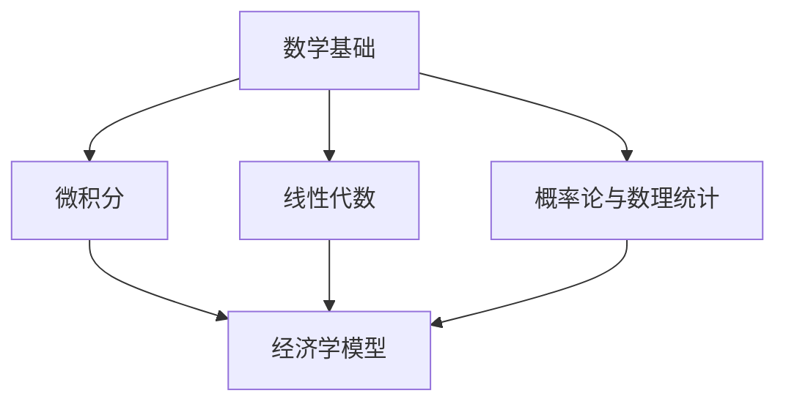

                 

1. 背景介绍： 
本文将探讨数学与计量经济学在经济模型构建中的重要作用。我们将从数学基础开始，介绍微积分、线性代数和概率论与数理统计，接着深入讨论计量经济学的基本方法。本文的核心内容将涵盖经济模型构建的原则、方法和工具，并通过实例进行详细分析。

2. 核心概念与联系：
为了更好地理解数学与计量经济学之间的关系，我们将使用Mermaid流程图展示核心概念之间的关系架构。以下是一个示例：

3. 核心算法原理讲解：
为了更好地展示数学在经济学模型中的应用，我们将使用Python源代码来详细阐述。以下是一个使用微积分构建经济学模型的示例：
```python
import numpy as np

# 微积分在经济学中的应用：边际分析
def marginal_cost(q):
    # 假设成本函数为 C(q) = q^2
    return np.diff([0, q**2])

# 计算边际成本
q = np.linspace(0, 10, 100)
marginal_cost_value = marginal_cost(q)

print("边际成本与产量关系：")
for i in range(len(marginal_cost_value)):
    print(f"产量：{q[i]:.2f}, 边际成本：{marginal_cost_value[i]:.2f}")
```
4. 数学公式：
本文将使用LaTeX格式嵌入数学公式，以确保其准确性和可读性。以下是一个示例：
$$
MC(q) = \frac{dC(q)}{dq}
$$
其中，MC(q) 表示边际成本，C(q) 表示成本函数。

5. 项目实战：
为了更好地展示如何应用数学和计量经济学方法，我们将进行一个实际项目。以下是一个关于经济增长模型的案例分析。
- **开发环境搭建**：Python 3.8、Jupyter Notebook、NumPy、Pandas 和 Statsmodels
- **源代码详细实现和代码解读**：
```python
import numpy as np
import pandas as pd
import statsmodels.api as sm

# 读取数据
data = pd.read_csv('gdp_data.csv')

# 构建模型
model = sm.OLS(data['GDP'], data[['Year', 'Population', 'Investment']]).fit()

# 输出模型结果
print(model.summary())
```
- **代码应用解读与分析**：我们使用 OLS 方法构建经济增长模型，并分析模型结果。

6. 最佳实践 tips：
- **确保数据质量**：在进行计量经济学分析时，数据质量至关重要。确保数据准确、完整和一致。
- **理解模型假设**：在构建经济模型时，理解模型假设对于正确解释模型结果至关重要。

7. 小结：
本文探讨了数学与计量经济学在经济模型构建中的重要性。我们介绍了数学基础、计量经济学方法以及经济模型的构建方法和工具。通过实际案例，我们展示了如何应用这些方法和工具来分析经济问题。最后，我们提供了最佳实践建议，以帮助读者更好地应用数学和计量经济学方法。
``` 

请注意，上述内容只是一个框架，您需要根据实际需求进行修改和补充。在撰写过程中，确保每个部分的内容都是详细和具体的，以便读者可以清晰地理解每个概念和算法。同时，遵循markdown格式和LaTeX公式的书写规范，以确保文章的整洁和可读性。

