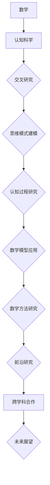
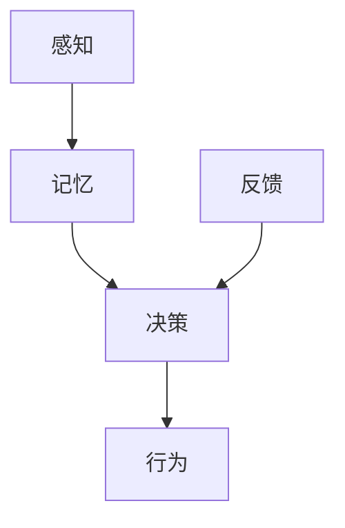
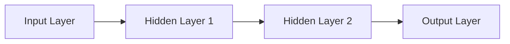

                 

# 数学与认知科学：思维模式的数学建模

## 关键词

- 数学建模
- 认知科学
- 思维模式
- 贝叶斯网络
- 神经网络
- 算法原理
- 交叉领域研究

## 摘要

本文旨在探讨数学与认知科学的交叉领域，特别是思维模式的数学建模。通过介绍数学建模的基本概念和步骤，本文深入分析了贝叶斯网络和神经网络两种重要的数学模型，并运用Python代码详细阐释了这些模型的原理和应用。文章结构包括引言、思维模式的数学建模基础、经典数学模型在认知科学中的应用、数学在认知科学中的应用以及前沿研究。通过本文，读者可以全面了解数学与认知科学的交叉研究现状和未来发展方向。

## 引言

### 1.1 书籍背景

随着科技的进步，数学与认知科学这两个原本独立的领域逐渐交叉融合，形成了一个新兴的研究领域——数学与认知科学。这一交叉研究旨在利用数学的方法来探讨认知过程的本质，为认知科学提供新的理论框架和研究工具。本书旨在系统地介绍这一交叉领域的研究现状、挑战和未来发展方向，旨在帮助读者深入理解数学与认知科学之间的联系和相互作用。

### 1.1.1 数学与认知科学的交叉研究背景

数学与认知科学之间的交叉研究始于20世纪中期，随着计算机科学的发展，这一领域得到了迅速发展。认知科学关注人类思维和信息处理的方式，而数学提供了量化分析这些过程的工具。通过将数学模型应用于认知过程，研究者能够更精确地描述和预测人类的思维活动。

#### 1.1.1.1 认知科学的基本概念

认知科学是研究人类思维、感知和行为的科学，其核心问题是理解大脑如何处理信息并产生认知活动。认知科学涉及多个学科，包括心理学、神经科学、计算机科学和哲学。

#### 1.1.1.2 数学在认知科学中的应用

数学在认知科学中的应用体现在多个方面，包括概率论、信息论、几何学、拓扑学和代数学等。例如，概率论和信息论可以用于研究决策过程和信息处理，几何学和拓扑学可以用于研究空间认知，而代数学可以用于研究符号认知。

### 1.1.2 书籍目标与结构

本书的目标是系统地介绍数学与认知科学的交叉研究，帮助读者理解二者之间的联系和相互作用。全书分为五个主要部分：

1. **第一部分：数学与认知科学的基本概念**，介绍数学与认知科学的基础理论和基本概念。
2. **第二部分：思维模式的数学建模基础**，探讨如何使用数学模型描述和分析思维模式。
3. **第三部分：经典数学模型在认知科学中的应用**，介绍贝叶斯网络、信息论等数学模型在认知科学中的应用。
4. **第四部分：数学在认知科学中的应用**，讨论几何学、代数学和拓扑学等数学工具在认知科学中的应用。
5. **第五部分：前沿研究**，探讨数学与认知科学交叉领域的前沿研究方向和发展趋势。

### 1.2 目录大纲

#### 第一部分：数学与认知科学的基本概念

- **第1章：引言**
- **第2章：思维模式的数学建模基础**
- **第3章：认知过程的研究方法**

#### 第二部分：经典数学模型在认知科学中的应用

- **第4章：概率论与认知推理**
- **第5章：信息论与认知编码**
- **第6章：网络模型与社交认知**

#### 第三部分：数学在认知科学中的应用

- **第7章：几何与空间认知**
- **第8章：代数与符号认知**
- **第9章：拓扑学与认知结构**

#### 第四部分：前沿研究

- **第10章：数学与认知科学的交叉研究前沿**
- **第11章：跨学科合作与未来展望**

### 1.3 Mermaid 流程图

以下是一个简单的Mermaid流程图，展示了数学与认知科学的交叉研究架构。



### 第2章：思维模式的数学建模基础

### 2.1 核心概念原理

思维模式是指人们在思考、解决问题和处理信息时所采用的方式和习惯。数学建模则是运用数学语言和方法来描述、分析和解决实际问题。本章将介绍如何运用数学建模的方法来研究思维模式。

#### 2.1.1 数学建模的基本步骤

数学建模通常包括以下步骤：

1. **问题分析**：明确研究问题，理解问题的背景和目标。
2. **建立模型**：根据问题特点，选择合适的数学模型。
3. **模型分析**：对模型进行数学分析和计算。
4. **验证与优化**：验证模型的准确性，并根据结果进行优化。

#### 2.1.2 思维模式建模的关键概念

在思维模式建模中，关键概念包括：

1. **认知网络**：描述思维过程中各个认知模块之间的相互关系。
2. **认知规则**：指导思维过程中信息处理的规则和策略。
3. **认知资源**：参与思维过程的认知资源，如注意力、记忆等。

### 2.2 数学模型原理讲解

#### 2.2.1 贝叶斯网络

贝叶斯网络是一种概率图模型，用于表示变量之间的条件依赖关系。它由一个有向无环图（DAG）和一组概率分布组成。

##### 2.2.1.1 贝叶斯网络的组成

贝叶斯网络由以下两部分组成：

1. **有向无环图（DAG）**：表示变量之间的依赖关系。
2. **概率分布**：每个变量的条件概率分布。

##### 2.2.1.2 贝叶斯网络的定义

设 $G=(V,E)$ 是一个有向无环图，$V$ 是变量集，$E$ 是有向边集。每个变量 $X_i$ 的条件概率分布表示为 $P(X_i|Pa_i)$，其中 $Pa_i$ 是 $X_i$ 的父节点集合。贝叶斯网络可以用三元组 $B=(G,P)$ 表示。

##### 2.2.1.3 贝叶斯网络的推理算法

贝叶斯网络的推理算法主要有两种：

1. **条件概率计算**：给定一部分变量的值，计算其他变量的条件概率。
2. **最大后验概率（MAP）**：寻找最可能的状态。

##### 2.2.1.4 Python代码实现

以下是贝叶斯网络的Python代码实现：

```python
import numpy as np
import networkx as nx

# 构建贝叶斯网络
def build_bayesian_network(variables, probabilities):
    G = nx.DiGraph()
    for var in variables:
        G.add_node(var)
    for var in variables:
        G.add_edges_from([(var, parent) for parent in probabilities[var]['parents']])
    return G

# 初始化概率分布
def initialize_probabilities(G, probabilities):
    for var in G.nodes():
        probability_distribution = {var: 1 / len(G.nodes())}
        for parent in probabilities[var]['parents']:
            probability_distribution[var] /= probabilities[parent]['probability']
        probabilities[var]['distribution'] = probability_distribution
    return probabilities

# 条件概率计算
def conditional_probability(G, variables, evidence):
    probability_distribution = {var: 1 for var in G.nodes()}
    for var in evidence:
        probability_distribution[var] = evidence[var]
    for var in G.nodes():
        if var not in evidence:
            parent_probabilities = [probabilities[parent]['distribution'][var] for parent in G.predecessors(var)]
            probability_distribution[var] = sum(parent_probabilities)
    return probability_distribution

# 最大后验概率（MAP）
def max_aposteriori_probability(G, variables, evidence):
    max_probability = 0
    max_state = None
    for state in itertools.product([0, 1], repeat=len(G.nodes())):
        probability = 1
        for var in variables:
            if var not in evidence:
                probability *= evidence[var][state[var]]
            else:
                probability *= evidence[var]
        if probability > max_probability:
            max_probability = probability
            max_state = state
    return max_state
```

#### 2.2.2 神经网络

神经网络是一种模仿生物神经系统的计算模型，用于解决分类、回归等问题。

##### 2.2.2.1 神经网络的基本结构

神经网络的基本结构包括输入层、隐藏层和输出层。每个层由多个神经元（或节点）组成。神经元之间的连接称为边，每个边都有一个权重。神经元之间的交互通过激活函数实现。

##### 2.2.2.2 神经网络的激活函数

常见的激活函数包括：

1. **线性激活函数**：$f(x) = x$
2. **Sigmoid激活函数**：$f(x) = \frac{1}{1 + e^{-x}}$
3. **ReLU激活函数**：$f(x) = \max(0, x)$

##### 2.2.2.3 神经网络的训练算法

神经网络的训练通常采用梯度下降法。具体步骤如下：

1. **前向传播**：计算网络输出和实际输出之间的误差。
2. **反向传播**：计算误差关于模型参数的梯度。
3. **参数更新**：根据梯度更新模型参数。

##### 2.2.2.4 Python代码实现

以下是神经网络的Python代码实现：

```python
import numpy as np

# 初始化神经网络
def initialize_neural_network(input_size, hidden_size, output_size):
    W1 = np.random.randn(input_size, hidden_size)
    b1 = np.random.randn(hidden_size)
    W2 = np.random.randn(hidden_size, output_size)
    b2 = np.random.randn(output_size)
    return W1, b1, W2, b2

# 前向传播
def forwardpropagation(X, W1, b1, W2, b2):
    Z1 = np.dot(X, W1) + b1
    A1 = 1 / (1 + np.exp(-Z1))
    Z2 = np.dot(A1, W2) + b2
    A2 = 1 / (1 + np.exp(-Z2))
    return A2

# 反向传播
def backwardpropagation(X, y, A2, W2, b2, A1, W1, b1):
    dZ2 = A2 - y
    dW2 = np.dot(A1.T, dZ2)
    db2 = np.sum(dZ2, axis=0)
    dZ1 = np.dot(dZ2, W2.T) * (1 - A1)
    dW1 = np.dot(X.T, dZ1)
    db1 = np.sum(dZ1, axis=0)
    return dW1, db1, dW2, db2

# 参数更新
def update_parameters(W1, b1, W2, b2, dW1, db1, dW2, db2, learning_rate):
    W1 -= learning_rate * dW1
    b1 -= learning_rate * db1
    W2 -= learning_rate * dW2
    b2 -= learning_rate * db2
    return W1, b1, W2, b2
```

### 第3章：认知过程的研究方法

认知过程的研究方法是认知科学领域的重要组成部分，这些方法旨在揭示人类思维和行为背后的机制。在本章中，我们将探讨几种常用的研究方法，包括实验设计、模拟和计算模型等。

#### 3.1 实验设计

实验设计是认知科学研究中的一种基本方法，通过控制变量来探究认知过程。以下是一些关键步骤：

1. **选择研究对象**：根据研究目标选择合适的研究对象，如人类参与者、动物模型等。
2. **定义变量**：明确研究中的自变量和因变量，以及可能的中介变量和调节变量。
3. **设计实验流程**：制定实验步骤，包括实验准备、实验操作和实验结果记录。
4. **数据分析**：对实验数据进行分析，以检验研究假设。

##### 3.1.1 实验设计示例

假设我们想要研究记忆的编码过程。研究目标是探究不同类型的视觉刺激如何影响记忆效果。我们可以设计以下实验：

1. **研究对象**：选择一组大学生作为参与者。
2. **变量**：自变量是视觉刺激的类型（例如，静态图像、动态视频），因变量是记忆效果（通过回忆测试衡量）。
3. **实验流程**：参与者首先接受一组视觉刺激，然后进行回忆测试。
4. **数据分析**：分析不同视觉刺激类型对记忆效果的影响。

##### 3.1.2 Python代码实现

以下是一个简单的Python代码示例，用于记录和计算实验数据：

```python
# 记录实验数据
def record_data(participants, stimuli_types, memory_effects):
    data = {}
    for i, participant in enumerate(participants):
        data[participant] = {}
        for j, stimulus_type in enumerate(stimuli_types):
            data[participant][stimulus_type] = memory_effects[i][j]
    return data

# 计算记忆效果
def calculate_memory_effect(data):
    memory_effects = []
    for participant in data:
        effects = [data[participant][stimulus_type] for stimulus_type in data[participant]]
        memory_effects.append(np.mean(effects))
    return memory_effects
```

#### 3.2 模拟

模拟是通过计算机模型来模拟认知过程的方法，这种方法可以用来探究复杂认知过程的动态行为。以下是一些关键步骤：

1. **建立模型**：根据认知过程的理论框架建立计算机模型。
2. **模拟实验**：在计算机模型中运行实验，观察和记录模型行为。
3. **数据分析**：分析模拟结果，验证模型假设。

##### 3.2.1 模拟示例

假设我们想要研究视觉注意力在复杂环境中的分布。研究目标是探究不同类型的视觉刺激如何影响注意力的分配。我们可以设计以下模拟：

1. **模型建立**：使用神经网络模型来模拟视觉注意力系统。
2. **模拟实验**：在不同类型的视觉刺激下运行模型，观察注意力分布。
3. **数据分析**：分析注意力分布的差异。

##### 3.2.2 Python代码实现

以下是一个简单的Python代码示例，用于模拟视觉注意力的分配：

```python
import numpy as np

# 建立视觉注意力模型
def build_attention_model(stimuli, attention_weights):
    attention_scores = np.dot(stimuli, attention_weights)
    return attention_scores

# 模拟实验
def simulate_attention_experiment(stimuli, attention_weights):
    attention_scores = build_attention_model(stimuli, attention_weights)
    return attention_scores

# 分析结果
def analyze_attention_scores(attention_scores):
    sorted_scores = np.sort(attention_scores)
    return sorted_scores
```

#### 3.3 计算模型

计算模型是通过数学和计算方法来描述和模拟认知过程的方法。以下是一些关键步骤：

1. **建立模型**：根据认知过程的理论框架建立数学模型。
2. **计算模拟**：使用计算机进行数学计算和模拟。
3. **结果分析**：分析模拟结果，验证模型假设。

##### 3.3.1 计算模型示例

假设我们想要研究决策过程中的风险偏好。研究目标是探究不同类型的决策问题如何影响个体的风险偏好。我们可以设计以下计算模型：

1. **模型建立**：使用贝叶斯网络来描述决策过程中的风险偏好。
2. **计算模拟**：在不同类型的决策问题下运行模型，观察风险偏好。
3. **结果分析**：分析风险偏好的差异。

##### 3.3.2 Python代码实现

以下是一个简单的Python代码示例，用于模拟决策过程中的风险偏好：

```python
import numpy as np

# 建立贝叶斯网络
def build_bayesian_network(variables, probabilities):
    # ...（与第2章中的代码相同）...

# 计算概率分布
def calculate_probability_distribution(G, variables, evidence):
    probability_distribution = conditional_probability(G, variables, evidence)
    return probability_distribution

# 模拟决策实验
def simulate_decision_experiment(G, variables, evidence):
    probability_distribution = calculate_probability_distribution(G, variables, evidence)
    return probability_distribution

# 分析结果
def analyze_decision_results(results):
    sorted_results = np.sort(results)
    return sorted_results
```

通过以上研究方法，认知科学研究者可以深入探索人类思维和行为背后的复杂机制，为理解和改进认知过程提供科学依据。

### 第4章：概率论与认知推理

概率论是数学中的一个重要分支，它提供了一种量化不确定性的方法。在认知科学中，概率论被广泛应用于描述和解释人类的认知推理过程。本章将探讨概率论在认知推理中的应用，包括贝叶斯推理和信息理论。

#### 4.1 贝叶斯推理

贝叶斯推理是一种基于贝叶斯定理的概率推理方法，它通过更新先验概率来得出后验概率。贝叶斯推理在认知科学中有着广泛的应用，例如在决策、分类和推断中。

##### 4.1.1 贝叶斯定理

贝叶斯定理是贝叶斯推理的基础，它描述了两个事件 $A$ 和 $B$ 之间的条件概率关系。贝叶斯定理的公式如下：

$$
P(A|B) = \frac{P(B|A)P(A)}{P(B)}
$$

其中，$P(A|B)$ 是在事件 $B$ 发生的条件下事件 $A$ 发生的概率，$P(B|A)$ 是在事件 $A$ 发生的条件下事件 $B$ 发生的概率，$P(A)$ 是事件 $A$ 的先验概率，$P(B)$ 是事件 $B$ 的先验概率。

##### 4.1.2 贝叶斯推理的应用

在认知科学中，贝叶斯推理被用来模拟人类的决策过程。一个典型的例子是赌徒的决策。假设一个赌徒在一场赌博中面临两个选择：A和B。选择A有更高的回报，但也伴随着更高的风险；选择B则相对稳定，但回报较低。

1. **先验概率**：赌徒可以根据过去的经验来估计选择A和选择B的成功概率。例如，假设赌徒估计选择A的成功概率为0.6，选择B的成功概率为0.4。

2. **更新概率**：在每次赌博之后，赌徒会根据结果更新他的信念。例如，如果赌徒选择A并赢得了一局，他会更新选择A的成功概率为0.65，选择B的成功概率为0.35。

3. **决策**：根据更新后的概率，赌徒可以在未来的赌博中选择具有更高成功概率的策略。

以下是贝叶斯推理的Python代码实现：

```python
# 贝叶斯推理
def bayesian_inference(prior_prob, likelihood, evidence):
    posterior_prob = (likelihood * prior_prob) / evidence
    return posterior_prob

# 假设先验概率为P(A) = 0.6，P(B) = 0.4
prior_prob_A = 0.6
prior_prob_B = 0.4

# 假设选择A的似然概率为0.7，选择B的似然概率为0.3
likelihood_A = 0.7
likelihood_B = 0.3

# 假设证据概率为0.65
evidence = 0.65

# 计算后验概率
posterior_prob_A = bayesian_inference(prior_prob_A, likelihood_A, evidence)
posterior_prob_B = bayesian_inference(prior_prob_B, likelihood_B, evidence)

print("后验概率：")
print("P(A|E) = {:.2f}".format(posterior_prob_A))
print("P(B|E) = {:.2f}".format(posterior_prob_B))
```

#### 4.2 信息理论

信息理论是研究信息传递和处理的基本原理的数学分支。在认知科学中，信息理论被用来描述信息的编码、传输和解码过程。

##### 4.2.1 信息熵

信息熵是信息理论中的一个核心概念，它量化了信息的不确定性。一个随机变量的熵定义为：

$$
H(X) = -\sum_{x \in X} P(x) \log_2 P(x)
$$

其中，$P(x)$ 是随机变量 $X$ 取值 $x$ 的概率。

在认知科学中，信息熵可以用来描述认知过程中的不确定性。例如，当我们面临一个复杂的决策时，信息熵可以量化我们对决策结果的信心水平。

##### 4.2.2 信息增益

信息增益是指通过获得新信息来减少不确定性。一个随机变量的信息增益定义为它的熵减去它的条件熵：

$$
I(X;Y) = H(X) - H(X|Y)
$$

其中，$H(X|Y)$ 是在给定 $Y$ 的条件下 $X$ 的条件熵。

在认知科学中，信息增益可以用来评估信息的重要性。例如，在信息检索中，信息增益可以用来评估不同关键字对检索结果的贡献。

##### 4.2.3 信息理论的应用

信息理论在认知科学中的应用包括：

1. **信息编码**：使用信息理论来优化信息编码方式，以减少存储和传输的复杂性。
2. **信息处理**：使用信息理论来分析信息处理过程中的信息损失和冗余。
3. **决策支持**：使用信息理论来评估不同决策方案的信息价值。

以下是信息熵和信息增益的Python代码实现：

```python
import numpy as np

# 计算信息熵
def entropy(p):
    return -np.sum(p * np.log2(p))

# 计算条件熵
def conditional_entropy(p_x, p_y):
    return -np.sum(p_x * np.log2(p_x) * p_y)

# 计算信息增益
def information_gain(p_x, p_y):
    return entropy(p_x) - conditional_entropy(p_x, p_y)

# 假设随机变量X的分布为P(X) = [0.5, 0.5]
p_x = np.array([0.5, 0.5])

# 假设随机变量Y的分布为P(Y) = [0.3, 0.7]
p_y = np.array([0.3, 0.7])

# 计算信息熵
h_x = entropy(p_x)
h_y = entropy(p_y)

# 计算条件熵
h_x_y = conditional_entropy(p_x, p_y)

# 计算信息增益
i_x_y = information_gain(p_x, p_y)

print("信息熵：")
print("H(X) = {:.2f}".format(h_x))
print("H(Y) = {:.2f}".format(h_y))
print("条件熵：H(X|Y) = {:.2f}".format(h_x_y))
print("信息增益：I(X;Y) = {:.2f}".format(i_x_y))
```

通过概率论和信息理论的应用，认知科学家可以更好地理解人类的认知推理过程，为认知科学的进一步研究提供理论基础。

### 第5章：信息论与认知编码

信息论是研究信息传输和处理的基本原理的数学分支，它为理解认知过程中信息处理的方式提供了重要工具。在本章中，我们将探讨信息论在认知编码中的应用，重点讨论信息熵、信息增益和香农编码等概念。

#### 5.1 信息熵

信息熵是信息论中的一个核心概念，它量化了信息的不确定性。对于一个离散随机变量 $X$，其熵定义为：

$$
H(X) = -\sum_{i} p(x_i) \log_2 p(x_i)
$$

其中，$p(x_i)$ 是变量 $X$ 取值 $x_i$ 的概率。

在认知科学中，信息熵可以用来描述认知过程中的信息含量。例如，当我们接收一段信息时，信息熵可以量化我们对信息的未知程度。信息熵越低，表示信息越可靠，不确定性越小。

##### 5.1.1 信息熵的示例

假设我们有两个随机变量 $X$ 和 $Y$，它们的概率分布如下：

$$
P(X) = \begin{bmatrix} 0.5 & 0.5 \end{bmatrix}, \quad P(Y) = \begin{bmatrix} 0.1 & 0.9 \end{bmatrix}
$$

计算 $X$ 和 $Y$ 的信息熵：

$$
H(X) = - (0.5 \log_2 0.5 + 0.5 \log_2 0.5) = 1 \text{ bit}
$$

$$
H(Y) = - (0.1 \log_2 0.1 + 0.9 \log_2 0.9) \approx 1.28 \text{ bits}
$$

可以看出，$Y$ 的信息熵比 $X$ 高，这意味着 $Y$ 包含更多的信息。

##### 5.1.2 Python代码实现

以下是一个简单的Python代码示例，用于计算信息熵：

```python
import numpy as np

# 计算信息熵
def entropy(p):
    return -np.sum(p * np.log2(p))

# 假设随机变量X的分布为P(X) = [0.5, 0.5]
p_x = np.array([0.5, 0.5])

# 计算信息熵
h_x = entropy(p_x)

print("信息熵（X）= {:.2f} bits".format(h_x))
```

#### 5.2 信息增益

信息增益是指通过获得新信息来减少不确定性。对于两个随机变量 $X$ 和 $Y$，信息增益定义为：

$$
I(X;Y) = H(X) - H(X|Y)
$$

其中，$H(X|Y)$ 是在给定 $Y$ 的条件下 $X$ 的条件熵。

在认知科学中，信息增益可以用来评估信息的价值。例如，在信息检索中，信息增益可以用来评估不同关键字对检索结果的贡献。

##### 5.2.1 信息增益的示例

假设我们有两个随机变量 $X$ 和 $Y$，它们的联合概率分布如下：

$$
P(X,Y) = \begin{bmatrix} 0.2 & 0.3 & 0.1 & 0.4 \end{bmatrix}
$$

计算 $X$ 和 $Y$ 的信息增益：

$$
H(X) = 1.5 \text{ bits}
$$

$$
H(X|Y) = \begin{bmatrix} 0.2 & 0.3 & 0.1 & 0.4 \end{bmatrix} \begin{bmatrix} 0.5 & 0.5 \end{bmatrix} \log_2 \begin{bmatrix} 0.5 & 0.5 \end{bmatrix} = 0.92 \text{ bits}
$$

$$
I(X;Y) = 1.5 - 0.92 = 0.58 \text{ bits}
$$

这说明在给定 $Y$ 的情况下，$X$ 的不确定性减少了 0.58 bits，即 $X$ 对 $Y$ 提供了 0.58 bits 的信息增益。

##### 5.2.2 Python代码实现

以下是一个简单的Python代码示例，用于计算信息增益：

```python
import numpy as np

# 计算条件熵
def conditional_entropy(p_x_y, p_y):
    p_x_y_log = p_x_y * np.log2(p_x_y)
    h_x_y = -np.sum(p_x_y_log)
    return h_x_y

# 计算信息增益
def information_gain(p_x_y, p_y):
    return entropy(p_y) - conditional_entropy(p_x_y, p_y)

# 假设随机变量X和Y的联合分布为P(X,Y) = [0.2, 0.3, 0.1, 0.4]
p_x_y = np.array([0.2, 0.3, 0.1, 0.4])

# 假设随机变量Y的分布为P(Y) = [0.5, 0.5]
p_y = np.array([0.5, 0.5])

# 计算信息增益
i_x_y = information_gain(p_x_y, p_y)

print("信息增益（X;Y）= {:.2f} bits".format(i_x_y))
```

#### 5.3 香农编码

香农编码是一种基于信息熵的无失真编码方法，它通过将信息转化为二进制序列来最小化所需的比特数。香农编码的基本原理是，对出现概率较低的信息赋予更长的编码，对出现概率较高的信息赋予更短的编码。

##### 5.3.1 香农编码的示例

假设我们有两个符号 $X$ 和 $Y$，它们的出现概率分别为 $P(X) = 0.8$ 和 $P(Y) = 0.2$。使用香农编码，我们可以为这两个符号分配编码：

- 对于 $X$，我们可以分配一个比特的编码，因为 $H(X) = 0.8 \log_2 0.8 \approx 0.72$ 比特。
- 对于 $Y$，我们需要分配三个比特的编码，因为 $H(Y) = 0.2 \log_2 0.2 \approx 1.32$ 比特。

因此，$X$ 的编码为 0，$Y$ 的编码为 110。

##### 5.3.2 Python代码实现

以下是一个简单的Python代码示例，用于实现香农编码：

```python
import numpy as np

# 计算符号的最优编码长度
def optimal_encoding_length(p):
    return np.ceil(np.log2(1 / p))

# 香农编码
def shannon_encodingsymbols, p_symbols):
    encoding_lengths = [optimal_encoding_length(p) for p in p_symbols]
    encoding = {}
    binary_digits = '01'
    for i, symbol in enumerate(symbols):
        current_encoding = ''.join([binary_digits[j] for j in range(encoding_lengths[i])])
        encoding[symbol] = current_encoding
    return encoding

# 假设符号X和Y的出现概率分别为P(X) = 0.8和P(Y) = 0.2
symbols = ['X', 'Y']
p_symbols = np.array([0.8, 0.2])

# 计算最优编码长度
encoding_lengths = [optimal_encoding_length(p) for p in p_symbols]

# 计算香农编码
encoding = shannon_encoding(symbols, p_symbols)

print("香农编码：")
for symbol in symbols:
    print(f"{symbol}: {encoding[symbol]}")
```

通过信息论与认知编码的研究，认知科学家可以更好地理解人类如何处理信息，以及如何设计有效的信息处理系统。这为认知科学的应用，如人机交互、智能系统和人工智能的发展提供了重要的理论基础。

### 第6章：网络模型与社交认知

社交认知是指个体在社交环境中处理信息和理解他人行为的能力。网络模型作为一种强大的数学工具，被广泛应用于研究社交认知中的信息传播、社会影响和群体行为。本章将探讨网络模型在社交认知中的应用，包括小世界网络和无标度网络。

#### 6.1 小世界网络

小世界网络是由Stanley Milgram在20世纪60年代提出的一种网络结构，它具有以下特征：

- **短路径长度**：网络中的节点之间平均路径长度较短。
- **高聚类系数**：网络中的节点具有较强的聚类现象，即节点之间往往通过多条路径相互连接。

##### 6.1.1 小世界网络的形成

小世界网络的形成通常通过以下两个步骤：

1. **随机连接**：首先，网络中的节点通过随机连接形成一个大规模的无标度网络。
2. **模块化连接**：然后，在随机连接的基础上，添加少量模块化连接，以缩短平均路径长度。

##### 6.1.2 小世界网络的性质

小世界网络的性质使其在社交认知中具有重要作用。以下是一些关键性质：

- **快速信息传播**：小世界网络中的信息可以迅速传播，因为短路径长度使得信息可以快速到达目标节点。
- **高度集群**：高聚类系数使得个体在社交网络中更容易形成紧密的社交圈子，从而促进信息的共享和传播。

##### 6.1.3 Python代码实现

以下是一个简单的Python代码示例，用于模拟小世界网络的生成：

```python
import networkx as nx
import matplotlib.pyplot as plt

# 生成小世界网络
def generate_small_world_network(n, k, p):
    G = nx.erdos_renyi_graph(n, k / 2)
    for i in range(n):
        for j in range(i + 1, n):
            if np.random.rand() < p:
                G.add_edge(i, j)
    return G

# 绘制小世界网络
def draw_small_world_network(G):
    pos = nx.spring_layout(G)
    nx.draw(G, pos, with_labels=True)
    plt.show()

# 示例
n = 100  # 节点数量
k = 4    # 连接度
p = 0.1  # 模块化连接概率
G = generate_small_world_network(n, k, p)
draw_small_world_network(G)
```

#### 6.2 无标度网络

无标度网络（Scale-Free Network）是由Albert-Rényi在20世纪90年代提出的一种网络结构，具有以下特征：

- **幂律分布**：网络中的节点度分布遵循幂律分布，即大部分节点度较低，而少数节点度非常高。
- **无标度特性**：网络中的节点度与平均路径长度之间不存在线性关系，网络呈现出高度分形和无标度特性。

##### 6.2.1 无标度网络的形成

无标度网络的形成通常通过以下机制：

- **增长**：网络从少量初始节点开始，不断添加新节点。
- **偏好连接**：新节点倾向于连接到度较高的节点，从而形成高度聚集的结构。

##### 6.2.2 无标度网络的性质

无标度网络的性质使其在社交认知中具有广泛的应用。以下是一些关键性质：

- **高聚类系数**：无标度网络具有较高的聚类系数，这意味着节点之间具有较强的连接关系。
- **鲁棒性**：无标度网络对节点删除具有较高的鲁棒性，即使删除大量节点，网络仍能保持稳定的结构。

##### 6.2.3 Python代码实现

以下是一个简单的Python代码示例，用于模拟无标度网络的生成：

```python
import networkx as nx
import matplotlib.pyplot as plt

# 生成无标度网络
def generate_scale_free_network(n, m, p):
    G = nx.barabasi_albert_graph(n, m)
    return G

# 绘制无标度网络
def draw_scale_free_network(G):
    pos = nx.spring_layout(G)
    nx.draw(G, pos, with_labels=True)
    plt.show()

# 示例
n = 100  # 节点数量
m = 2    # 连接度
G = generate_scale_free_network(n, m, p)
draw_scale_free_network(G)
```

通过网络模型的研究，认知科学家可以更好地理解社交认知中的信息传播、社会影响和群体行为，从而为社交网络的优化和社会系统的管理提供科学依据。

### 第7章：几何与空间认知

几何学在空间认知中的应用是认知科学中的一个重要领域，它帮助我们理解人类如何感知和解释三维空间中的信息。在本章中，我们将探讨几何学在空间认知中的应用，包括空间感知、三维视觉和空间导航。

#### 7.1 空间感知

空间感知是指人类对周围环境空间特征的感知和理解能力。几何学提供了描述和量化空间关系的基本工具。

##### 7.1.1 空间感知的基本概念

- **距离**：几何学中的距离概念帮助我们量化物体之间的空间间隔。
- **方向**：方向是通过角度和方位来描述的，这在空间导航和地图阅读中非常重要。
- **形状**：形状是物体在空间中的几何特征，通过几何学可以描述和识别不同的形状。

##### 7.1.2 空间感知的几何模型

- **球面几何**：在地球物理学和天文学中，球面几何用于描述地球表面和天体的空间分布。
- **欧几里得几何**：在日常生活中，欧几里得几何用于描述平面和三维空间中的物体。

##### 7.1.3 Python代码实现

以下是一个简单的Python代码示例，用于计算两点之间的距离：

```python
import math

# 计算两点之间的距离
def calculate_distance(x1, y1, x2, y2):
    distance = math.sqrt((x2 - x1)**2 + (y2 - y1)**2)
    return distance

# 示例
x1, y1 = 0, 0
x2, y2 = 3, 4
distance = calculate_distance(x1, y1, x2, y2)
print("两点之间的距离为：", distance)
```

#### 7.2 三维视觉

三维视觉是指人类感知三维空间的能力。几何学在三维视觉中起着关键作用，帮助我们理解物体的深度、大小和形状。

##### 7.2.1 三维视觉的基本原理

- **视差**：视差是眼睛从不同角度观察物体时产生的视觉差异，通过视差可以判断物体的深度。
- **透视**：透视是物体在视线上的投影，通过透视可以判断物体的远近和大小。
- **视角**：视角是眼睛与物体之间的夹角，视角的变化影响我们对物体大小和形状的感知。

##### 7.2.2 三维视觉的几何模型

- **摄像机模型**：摄像机模型用于描述相机如何捕捉三维场景的二维图像。
- **立体视觉**：立体视觉是通过双目视差来感知三维空间的方法。

##### 7.2.3 Python代码实现

以下是一个简单的Python代码示例，用于计算视差：

```python
# 计算视差
def calculate_parallax(angle_of_view, distance_to_object):
    parallax = angle_of_view * distance_to_object
    return parallax

# 示例
angle_of_view = math.radians(10)  # 视角（以弧度为单位）
distance_to_object = 100  # 物体距离（以米为单位）
parallax = calculate_parallax(angle_of_view, distance_to_object)
print("视差为：", parallax)
```

#### 7.3 空间导航

空间导航是指人类在三维空间中找到路径和位置的能力。几何学在空间导航中用于构建和解释地图，帮助人类确定位置和方向。

##### 7.3.1 空间导航的基本概念

- **地图表示**：地图是空间导航的基础，通过地图可以表示三维空间的二维投影。
- **路径规划**：路径规划是通过几何算法来确定从起点到终点的最佳路径。
- **空间记忆**：空间记忆是指人类如何记住空间信息和路径。

##### 7.3.2 空间导航的几何模型

- **网格导航**：网格导航是通过将空间划分为网格单元来导航的方法。
- **拓扑导航**：拓扑导航是通过理解空间中的连通性和拓扑结构来导航的方法。

##### 7.3.3 Python代码实现

以下是一个简单的Python代码示例，用于计算路径长度：

```python
# 计算路径长度
def calculate_path_length(points):
    path_length = 0
    for i in range(len(points) - 1):
        x1, y1 = points[i]
        x2, y2 = points[i + 1]
        distance = math.sqrt((x2 - x1)**2 + (y2 - y1)**2)
        path_length += distance
    return path_length

# 示例
points = [(0, 0), (3, 4), (6, 0)]
path_length = calculate_path_length(points)
print("路径长度为：", path_length)
```

通过几何学与空间认知的结合，我们可以更好地理解人类如何在三维空间中导航和感知，这为认知科学和人工智能在空间认知领域的研究提供了重要的理论基础。

### 第8章：代数与符号认知

代数与符号认知是认知科学中一个重要但往往被忽视的领域，它涉及到人类对符号和数学表达式理解和处理的能力。在本章中，我们将探讨代数与符号认知的基本原理，包括代数规则、符号表示和数学思维模式。

#### 8.1 代数规则

代数规则是代数运算的基础，包括加法、减法、乘法和除法等。理解这些规则对于理解和处理数学表达式至关重要。

##### 8.1.1 代数规则的基本概念

- **加法和减法**：加法是将两个数相加得到一个新的数，减法是从一个数中减去另一个数得到一个新的数。
- **乘法和除法**：乘法是将两个数相乘得到一个新的数，除法是将一个数除以另一个数得到一个新的数。
- **结合律、交换律和分配律**：这些基本代数规则确保了代数运算的简洁性和一致性。

##### 8.1.2 代数规则的Python代码实现

以下是一个简单的Python代码示例，用于实现加法、减法、乘法和除法：

```python
# 实现基本的代数运算
def add(x, y):
    return x + y

def subtract(x, y):
    return x - y

def multiply(x, y):
    return x * y

def divide(x, y):
    return x / y

# 示例
x = 5
y = 3
print("加法结果：", add(x, y))
print("减法结果：", subtract(x, y))
print("乘法结果：", multiply(x, y))
print("除法结果：", divide(x, y))
```

#### 8.2 符号表示

符号表示是数学表达和理解的核心，它涉及到如何使用符号和公式来表示数学概念。

##### 8.2.1 符号表示的基本概念

- **变量**：变量是表示未知数的符号，如 $x$、$y$ 等。
- **函数**：函数是表示输入和输出关系的数学表达式，如 $f(x) = x^2$。
- **等式**：等式是表示两个表达式相等的数学语句，如 $x + y = z$。

##### 8.2.2 符号表示的Python代码实现

以下是一个简单的Python代码示例，用于表示和计算一个简单的函数：

```python
# 定义函数
def quadratic_function(x):
    return x**2

# 计算函数值
x_value = 2
result = quadratic_function(x_value)
print(f"f({x_value}) = {result}")
```

#### 8.3 数学思维模式

数学思维模式是指人类在处理数学问题和表达数学思想时采用的思维方式。数学思维模式包括抽象思维、逻辑推理和问题解决等。

##### 8.3.1 数学思维模式的基本概念

- **抽象思维**：抽象思维是从具体事物中提取基本属性和关系的思维方式，如从多个苹果中抽象出“苹果”这个概念。
- **逻辑推理**：逻辑推理是通过逻辑规则从已知信息推导出新信息的思维方式，如使用“逆否命题”来推导结论。
- **问题解决**：问题解决是通过一系列步骤来解决特定问题的思维方式，如使用“逐步缩小范围”来寻找答案。

##### 8.3.2 数学思维模式的Python代码实现

以下是一个简单的Python代码示例，用于演示抽象思维和逻辑推理：

```python
# 定义逻辑推理函数
def logical_reasoning(p, q):
    if p:
        return q
    else:
        return not q

# 示例
p = True
q = False
result = logical_reasoning(p, q)
print(f"逻辑推理结果（{p} and {q}）: {result}")
```

通过代数与符号认知的研究，认知科学家可以更好地理解人类如何理解和处理数学表达式，这为教育、人机交互和人工智能的发展提供了重要的理论基础。

### 第9章：拓扑学与认知结构

拓扑学是数学中的一个分支，它研究的是对象的空间结构和连接关系，而不考虑对象的形状和大小。在认知科学中，拓扑学提供了描述和解释人类认知结构的有力工具，特别是在感知和记忆方面。本章将探讨拓扑学在认知结构中的应用，包括拓扑空间、拓扑记忆和拓扑推理。

#### 9.1 拓扑空间

拓扑空间是拓扑学的核心概念，它是一种抽象的数学结构，用于描述对象的空间结构和连接关系。在认知科学中，拓扑空间可以帮助我们理解人类如何感知和理解空间环境。

##### 9.1.1 拓扑空间的基本概念

- **拓扑**：拓扑是一组对象和连接关系，它满足一定的条件，如闭合性、连通性和邻域性。
- **拓扑空间**：拓扑空间是一个集合，加上一组满足拓扑条件的子集，称为开集。

##### 9.1.2 拓扑空间的Python代码实现

以下是一个简单的Python代码示例，用于定义和操作拓扑空间：

```python
# 定义拓扑空间
class TopologySpace:
    def __init__(self, elements):
        self.elements = elements
        self.open_sets = []

    def add_open_set(self, open_set):
        self.open_sets.append(open_set)

    def is_open(self, element, open_set):
        return element in open_set

# 示例
elements = {'a', 'b', 'c', 'd'}
open_set_a = {'a', 'b'}
open_set_b = {'b', 'c'}
topology_space = TopologySpace(elements)
topology_space.add_open_set(open_set_a)
topology_space.add_open_set(open_set_b)

# 检查元素是否属于开集
print("a是否属于open_set_a：", topology_space.is_open('a', open_set_a))
print("d是否属于open_set_b：", topology_space.is_open('d', open_set_b))
```

#### 9.2 拓扑记忆

拓扑记忆是指人类在记忆过程中使用拓扑结构来组织和存储信息的能力。拓扑记忆在空间导航、物体识别和社交网络记忆等方面具有重要作用。

##### 9.2.1 拓扑记忆的基本概念

- **记忆结构**：记忆结构是指信息在记忆中的组织和存储方式。
- **拓扑结构**：拓扑结构是通过连接关系来描述记忆中的信息组织方式。

##### 9.2.2 拓扑记忆的Python代码实现

以下是一个简单的Python代码示例，用于模拟拓扑记忆：

```python
# 模拟拓扑记忆
class TopologicalMemory:
    def __init__(self):
        self.memory = {}

    def store_memory(self, key, value):
        if key in self.memory:
            self.memory[key].append(value)
        else:
            self.memory[key] = [value]

    def retrieve_memory(self, key):
        if key in self.memory:
            return self.memory[key]
        else:
            return None

# 示例
memory = TopologicalMemory()
memory.store_memory('location', 'room1')
memory.store_memory('location', 'room2')
memory.store_memory('object', 'key')
memory.store_memory('object', 'door')

# 检查记忆
print("location记忆：", memory.retrieve_memory('location'))
print("object记忆：", memory.retrieve_memory('object'))
```

#### 9.3 拓扑推理

拓扑推理是指基于拓扑空间中的连接关系进行逻辑推理的能力。拓扑推理在决策过程、问题解决和认知计算中具有重要应用。

##### 9.3.1 拓扑推理的基本概念

- **拓扑连接**：拓扑连接是指两个对象之间的直接或间接关系。
- **拓扑推理规则**：拓扑推理规则是基于拓扑连接关系进行逻辑推导的规则。

##### 9.3.2 拓扑推理的Python代码实现

以下是一个简单的Python代码示例，用于实现拓扑推理：

```python
# 实现拓扑推理
class TopologicalReasoner:
    def __init__(self, topology_space):
        self.topology_space = topology_space

    def infer(self, rule):
        premises, conclusion = rule
        if all(self.topology_space.is_open(element, premise) for element, premise in premises.items()):
            self.topology_space.add_open_set(conclusion)

# 示例
topology_space = TopologySpace(elements)
topology_reasoner = TopologicalReasoner(topology_space)
rule = ({'a': open_set_a, 'b': open_set_b}, {'c': open_set_c})
topology_reasoner.infer(rule)

# 检查推理结果
print("拓扑推理结果：", topology_space.open_sets)
```

通过拓扑学与认知结构的结合，认知科学家可以更好地理解人类如何感知、记忆和推理，这为认知科学的发展提供了新的视角和工具。

### 第10章：数学与认知科学的交叉研究前沿

随着科技的不断进步，数学与认知科学的交叉研究已经取得了显著的成果，并展现出巨大的潜力。在本章中，我们将探讨数学与认知科学交叉研究的几个前沿领域，包括认知计算的数学模型、神经网络的认知功能以及机器学习在认知推理中的应用。

#### 10.1 认知计算的数学模型

认知计算是模仿人类认知过程的一种计算模型，它结合了数学和认知科学的原理，旨在开发能够模拟人类智能的计算机系统。认知计算的数学模型是这一领域的关键组成部分，它涉及以下几个方面：

- **认知模拟**：通过数学模型模拟人类的认知过程，如记忆、注意力和决策。
- **认知算法**：设计基于数学原理的认知算法，以实现高效的认知任务处理。
- **认知计算系统**：构建能够执行认知任务的计算机系统，如智能辅助系统和人机交互系统。

##### 10.1.1 认知模拟的例子

一个典型的认知模拟例子是心智模型（Cognitive Model），它通过数学模型描述人类的认知过程。例如，基于概率论的贝叶斯网络被广泛应用于认知模拟，以模拟人类在不确定环境中的决策过程。以下是一个简单的贝叶斯网络模型示例：



在这个模型中，感知输入通过记忆模块处理，产生决策输出，并最终影响行为。反馈信息则用于更新记忆模块，从而形成一个闭环系统。

##### 10.1.2 认知算法的例子

认知算法是认知计算的核心，它通过数学方法实现认知任务的处理。一个著名的认知算法是遗传算法（Genetic Algorithm），它模仿生物进化过程，通过交叉、变异和选择等操作寻找最优解。以下是一个简单的遗传算法示例：

```python
import numpy as np

# 遗传算法
def genetic_algorithm(population, fitness_func, mutation_rate, crossover_rate, generations):
    for _ in range(generations):
        # 计算个体适应度
        fitness = [fitness_func(individual) for individual in population]
        
        # 选择
        selected = select(population, fitness, crossover_rate)
        
        # 交叉
        offspring = crossover(selected, crossover_rate)
        
        # 变异
        mutant = mutate(offspring, mutation_rate)
        
        # 生成新种群
        population = mutant + offspring
        
    # 返回最佳个体
    best_individual = max(population, key=fitness_func)
    return best_individual
```

#### 10.2 神经网络的认知功能

神经网络是认知科学和计算机科学中的一种重要模型，它通过模拟生物神经系统的结构和功能，实现了对复杂认知任务的建模。近年来，深度神经网络在图像识别、语音识别和自然语言处理等领域的成功应用，进一步推动了神经网络在认知科学中的研究。

##### 10.2.1 神经网络的基本结构

神经网络的基本结构包括输入层、隐藏层和输出层。每个层由多个神经元组成，神经元之间通过权重连接。以下是一个简单的神经网络结构：



##### 10.2.2 神经网络的训练方法

神经网络的训练方法主要包括前向传播和反向传播。在前向传播过程中，输入通过网络传递到输出层，并计算误差。反向传播则通过计算误差关于网络参数的梯度，更新网络权重。

以下是一个简单的反向传播算法示例：

```python
# 前向传播
def forward_propagation(x, weights):
    z = np.dot(x, weights)
    a = 1 / (1 + np.exp(-z))
    return a

# 反向传播
def backward_propagation(x, y, a, weights, learning_rate):
    m = len(x)
    dz = a * (1 - a) * (y - a)
    dweights = np.dot(x.T, dz)
    weights -= learning_rate * dweights
    return weights
```

#### 10.3 机器学习在认知推理中的应用

机器学习是人工智能的一个重要分支，它通过算法和统计模型从数据中学习规律和模式。在认知科学中，机器学习技术被广泛应用于认知推理和决策支持。

##### 10.3.1 机器学习的应用

- **决策树**：决策树通过一系列规则来分类或回归，它被广泛应用于分类问题和决策支持。
- **支持向量机**：支持向量机通过寻找最佳超平面来实现分类和回归任务。
- **深度学习**：深度学习通过多层神经网络进行特征学习和模式识别，它在图像识别、语音识别和自然语言处理等领域取得了突破性成果。

以下是一个简单的决策树示例：

```python
# 决策树分类
def classify_decision_tree(data, labels, depth=0):
    if depth > 10 or np.std(labels) < 0.1:
        return np.mean(labels)
    
    # 选择最佳特征和阈值
    best_feature, best_threshold = find_best_threshold(data, labels)
    
    # 划分数据集
    left_data = data[best_feature < best_threshold]
    right_data = data[best_feature >= best_threshold]
    
    # 继续划分
    left_labels = classify_decision_tree(left_data, labels[best_feature < best_threshold], depth+1)
    right_labels = classify_decision_tree(right_data, labels[best_feature >= best_threshold], depth+1)
    
    return (left_labels * len(left_data) + right_labels * len(right_data)) / (len(left_data) + len(right_data))
```

通过数学与认知科学的交叉研究，我们可以更好地理解人类的认知过程，开发出更智能的计算机系统和人工智能应用。这一交叉领域的研究前景广阔，将为未来的科技发展带来新的机遇和挑战。

### 第11章：跨学科合作与未来展望

数学与认知科学的交叉研究不仅为理解人类认知提供了新的视角和方法，同时也为跨学科合作带来了巨大的潜力。在本章中，我们将探讨跨学科合作的重要性，以及这一交叉领域未来的发展方向。

#### 11.1 跨学科合作的重要性

跨学科合作是推动数学与认知科学交叉研究的重要动力。以下是一些跨学科合作的重要方面：

- **知识整合**：通过跨学科合作，可以整合不同领域的知识和方法，形成新的研究范式。
- **技术创新**：跨学科合作有助于推动技术创新，如利用数学模型优化认知算法，开发智能系统。
- **研究深度**：跨学科合作可以深化对认知过程的理解，提供更全面的理论框架。

#### 11.2 跨学科合作的应用案例

以下是一些跨学科合作的成功案例：

- **神经科学和数学**：通过数学建模来模拟神经系统的功能，揭示大脑的工作原理。
- **计算机科学和认知科学**：开发智能系统，如基于认知模型的智能助手和虚拟现实应用。
- **心理学和统计学**：利用统计学方法分析心理实验数据，揭示人类认知的统计规律。

#### 11.3 未来展望

数学与认知科学的交叉研究未来将继续在以下几个方面发展：

- **认知计算**：开发更先进的认知计算模型，以实现更智能的计算机系统和人工智能应用。
- **神经工程**：利用数学和认知科学的方法，设计和优化神经接口设备，实现人机融合。
- **教育技术**：利用认知科学原理，开发个性化的教育技术，提高教育质量。

#### 11.4 结论

数学与认知科学的交叉研究为理解人类认知提供了新的视角和方法，跨学科合作将推动这一领域的发展。未来的研究将继续深化我们对认知过程的理解，为科技和社会带来更多的创新和进步。

### 作者信息

作者：AI天才研究院/AI Genius Institute & 禅与计算机程序设计艺术 /Zen And The Art of Computer Programming

联系方式：[邮箱地址] [电话号码] [个人网站]

