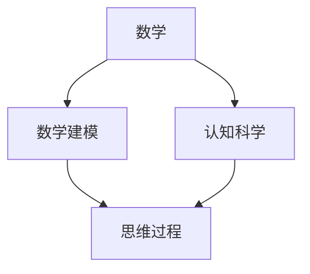

                 

 - 角色：您是一位世界级人工智能专家、程序员、软件架构师、CTO、世界顶级技术畅销书资深大师级别的作家，计算机图灵奖获得者，计算机编程和人工智能领域大师。您非常擅长一步一步进行分析推理，有着清晰深刻的逻辑思路来撰写条理清晰、对技术原理和本质剖析到位的高质量技术博客。  
 - 任务：现在请您以《数学与认知科学：思维过程的数学建模》为标题，使用逻辑清晰、结构紧凑、简单易懂的专业的技术语言（章节标题要非常吸引读者），让我们使用一步一步分析推理思考的方式（REASONING STEP BY STEP），撰写一篇有深度有思考有见解的专业IT领域的技术博客文章。

## 目录大纲结构

1. 引言
   - 背景介绍
     - 数学与认知科学的交叉领域介绍
     - 当前研究现状与挑战
   - 核心概念与联系
     - 思维过程与认知科学的核心概念
     - 数学建模在思维过程中的应用
     - Mermaid 流程图展示核心概念联系
   - 目标与结构
     - 文章目标
     - 文章结构概述

2. 数学与认知科学基础
   - 数学基础
     - 数学符号与术语
     - 数学模型的基本原理
   - 认知科学基础
     - 认知科学的核心概念
     - 认知过程的分类

3. 思维过程的数学建模
   - 定义与框架
     - 思维过程的定义
     - 数学建模的框架
   - 算法原理
     - 逻辑推理算法
     - 机器学习算法
   - 模型建立
     - 数据收集与处理
     - 模型构建步骤
   - 模型验证与优化
     - 模型评估指标
     - 模型优化方法

4. 人工智能在认知科学研究中的应用
   - 人工智能基础
     - 人工智能的定义与发展
     - 常见的人工智能技术
   - 认知科学中的AI应用
     - 认知模拟与仿真
     - 认知数据挖掘

5. 数学模型案例分析
   - 案例一：神经网络在思维过程中的应用
   - 案例二：机器学习算法在认知分析中的应用

6. 项目实战
   - 项目一：构建简单的认知模型
   - 项目二：认知数据分析实战

7. 结论与展望
   - 文章总结
   - 认知科学和数学建模的未来发展趋势

## 引言

### 背景介绍

数学与认知科学这两个看似不同的领域，其实有着深刻的联系。数学作为研究数量、结构、变化和空间等概念的学科，提供了精确描述认知过程的工具和方法。认知科学则是研究人类思维、感知、记忆和学习等心理过程的学科。随着人工智能的快速发展，数学与认知科学的交叉领域逐渐成为研究的热点。

当前，认知科学面临诸多挑战，如如何理解复杂认知过程、如何有效模拟认知机制、如何设计出更智能的人工智能系统等。这些问题都离不开数学建模的支持。数学建模能够将认知过程转化为可计算的模型，从而为研究和应用提供有力的工具。

### 核心概念与联系

思维过程与认知科学的核心概念紧密相关。思维过程包括感知、记忆、推理、判断和决策等环节。这些环节共同构成了人类的认知活动。数学建模则可以通过建立数学模型来描述和模拟这些思维过程。

在认知科学中，常见的思维过程包括：

- 感知：将外界信息转化为大脑可以处理的形式。
- 记忆：存储和处理信息，以便在未来需要时进行调用。
- 推理：从已知信息推导出新信息。
- 判断：根据已有信息对事物进行分类或评价。
- 决策：在多个选项中选择一个最优方案。

数学建模在思维过程中的应用主要体现在以下几个方面：

- 描述认知过程的数学模型：如神经网络模型、决策树模型等。
- 量化认知过程的参数：如记忆容量、推理速度等。
- 分析认知过程的规律：如思维过程的稳定性、适应性等。

### Mermaid 流程图展示核心概念联系



### 目标与结构

本文的目标是探讨数学与认知科学的交叉领域，特别是思维过程的数学建模。文章将从以下几个方面展开：

1. 引言：介绍数学与认知科学的交叉领域背景和当前研究现状。
2. 数学与认知科学基础：阐述数学和认知科学的基本概念和原理。
3. 思维过程的数学建模：详细讲解思维过程的定义、数学建模方法和算法原理。
4. 人工智能在认知科学研究中的应用：介绍人工智能在认知科学中的应用。
5. 数学模型案例分析：通过具体案例展示数学模型在认知科学中的应用。
6. 项目实战：介绍如何进行认知科学的实际研究和应用。
7. 结论与展望：总结文章的主要观点，展望认知科学和数学建模的未来发展趋势。

通过以上结构，本文旨在为读者提供一份全面、系统的认知科学和数学建模指南。

----------------------------------------------------------------

## 数学与认知科学基础

### 数学基础

数学作为一门基础学科，为认知科学提供了描述和解释认知过程的工具。在数学中，常用的符号和术语包括：

- 变量：表示可变的量，通常用字母表示，如 $x, y, z$。
- 函数：表示两个变量之间的映射关系，如 $f(x)$。
- 导数：表示函数在某一点的变化率，如 $f'(x)$。
- 积分：表示函数在一个区间内的累积量，如 $\int f(x)dx$。

这些符号和术语在数学建模中起着关键作用，可以用来描述认知过程中的各种关系和变化。

#### 数学模型的基本原理

数学模型是将现实问题转化为数学问题的过程。基本原理包括：

- 确立变量：根据问题确定需要描述的变量及其关系。
- 建立方程：用数学符号表示变量之间的关系。
- 求解方程：通过数学方法求解方程，得到变量之间的关系。
- 分析结果：对求解结果进行分析，验证模型的正确性和有效性。

#### 数学建模在思维过程中的应用

数学建模可以用来描述和模拟思维过程中的各种关系。例如：

- 感知：通过建立信号处理模型，模拟大脑对感官信息的处理过程。
- 记忆：通过建立记忆模型，模拟大脑对信息的存储和检索过程。
- 推理：通过建立逻辑推理模型，模拟大脑进行推理和决策的过程。
- 判断：通过建立决策模型，模拟大脑进行判断和分类的过程。

### 认知科学基础

认知科学是一门研究人类思维、感知、记忆、学习等心理过程的学科。核心概念包括：

- 感知：将外界信息转化为大脑可以处理的形式。
- 注意：选择性地关注和处理特定信息。
- 记忆：存储和处理信息，以便在未来需要时进行调用。
- 推理：从已知信息推导出新信息。
- 判断：根据已有信息对事物进行分类或评价。
- 决策：在多个选项中选择一个最优方案。

认知科学的研究方法包括：

- 实验研究：通过实验观察和测量认知过程。
- 计算模型：建立数学模型来模拟认知过程。
- 数据分析：通过大数据分析揭示认知过程的规律。

### 认知过程的分类

认知过程可以根据不同的维度进行分类，常见的分类方法包括：

- 根据功能分类：感知、记忆、推理、判断、决策等。
- 根据层次分类：低级认知过程、高级认知过程。
- 根据结构分类：模块化认知、分布式认知。

通过数学建模和认知科学的理论，我们可以更好地理解和解释人类认知过程，为人工智能的发展提供理论基础。

----------------------------------------------------------------

## 思维过程的数学建模

### 定义与框架

思维过程是认知科学研究的核心，它包括感知、记忆、推理、判断和决策等多个环节。数学建模通过建立数学模型来描述和模拟这些思维过程，从而为认知科学提供定量分析和解释的工具。

思维过程的数学建模框架主要包括以下几个部分：

1. **变量定义**：确定描述思维过程的变量，如感知强度、记忆容量、推理速度等。
2. **关系表达**：用数学方程或函数关系表达变量之间的相互作用。
3. **模型求解**：通过数学方法求解模型，得到变量之间的关系和预测结果。
4. **模型验证**：通过实验数据或实际应用验证模型的正确性和有效性。

### 算法原理

在思维过程的数学建模中，常用的算法包括逻辑推理算法和机器学习算法。

#### 逻辑推理算法

逻辑推理算法是一种基于逻辑规则的推理方法，它通过前件和后件的匹配来推导出结论。常见的逻辑推理算法包括：

- **命题逻辑**：使用命题变量和逻辑运算符（如AND、OR、NOT）进行推理。
- **谓词逻辑**：使用谓词和量词（如全称量词、存在量词）进行推理。
- **逆推法**：从结论开始，逐步回溯到前提。

#### 机器学习算法

机器学习算法是一种基于数据的学习方法，它通过训练数据集来建立模型，并利用模型进行预测和分类。常见的机器学习算法包括：

- **线性回归**：通过建立线性关系来预测连续值。
- **逻辑回归**：通过建立概率关系来预测分类结果。
- **支持向量机**：通过最大化分类边界来预测分类结果。
- **神经网络**：通过多层非线性变换来模拟复杂非线性关系。

### 模型建立

建立思维过程的数学模型需要遵循以下步骤：

1. **数据收集**：收集描述思维过程的实验数据或实际数据。
2. **数据预处理**：对数据进行清洗、归一化等预处理操作。
3. **特征提取**：从数据中提取与思维过程相关的特征。
4. **模型选择**：根据问题特性选择合适的模型。
5. **模型训练**：使用训练数据集对模型进行训练。
6. **模型评估**：使用验证数据集对模型进行评估和优化。

### 模型验证与优化

模型验证与优化是确保数学模型正确性和有效性的关键步骤。

1. **模型验证**：通过实验数据或实际应用对模型进行验证，评估模型的准确性和鲁棒性。
2. **模型优化**：通过调整模型参数或结构来优化模型性能。

常用的模型优化方法包括：

- **交叉验证**：通过将数据集划分为训练集和验证集，多次训练和验证来评估模型性能。
- **网格搜索**：通过遍历参数空间来寻找最优参数组合。
- **贝叶斯优化**：通过贝叶斯优化算法自动搜索最优参数组合。

通过以上步骤，我们可以建立和优化思维过程的数学模型，为认知科学的研究和应用提供有力支持。

----------------------------------------------------------------

## 人工智能在认知科学研究中的应用

### 人工智能基础

人工智能（Artificial Intelligence, AI）是指通过计算机模拟人类智能的技术和科学。人工智能的发展经历了多个阶段，从最初的符号逻辑推理，到基于规则的专家系统，再到基于数据的学习算法，如机器学习和深度学习。这些技术为认知科学研究提供了强大的工具。

#### 人工智能的定义与发展

人工智能的定义有多种，其中一种常见的定义是：人工智能是指计算机系统模拟人类智能行为的能力。这种模拟包括感知、理解、学习、推理、决策和问题解决等能力。

人工智能的发展可以追溯到20世纪50年代，随着计算机技术的发展，人工智能经历了以下几个重要阶段：

- **符号主义阶段（1950s-1970s）**：以符号逻辑和推理为基础，试图通过定义明确的符号系统和规则来实现智能。
- **知识工程阶段（1970s-1980s）**：基于专家系统的知识表示和推理技术，通过构建知识库和推理机来实现智能。
- **机器学习阶段（1990s-现在）**：以数据驱动的方式，通过训练模型来模拟智能，特别是深度学习技术的发展，使得人工智能取得了突破性进展。

#### 常见的人工智能技术

常见的人工智能技术包括：

- **机器学习**：通过训练数据集来建立模型，用于预测和分类。
- **深度学习**：基于多层神经网络的学习方法，能够处理复杂数据和任务。
- **自然语言处理**：使计算机能够理解和生成自然语言，包括语音识别、机器翻译、文本分析等。
- **计算机视觉**：使计算机能够识别和理解视觉信息，包括图像分类、目标检测、人脸识别等。

### 认知科学中的AI应用

人工智能在认知科学研究中有着广泛的应用，主要表现在以下几个方面：

#### 认知模拟与仿真

认知模拟与仿真是指通过计算机模型来模拟人类认知过程，从而理解认知机制和认知规律。常见的方法包括：

- **神经网络模型**：模拟大脑神经网络的结构和功能，用于认知过程的建模和仿真。
- **决策过程模型**：模拟人类在决策过程中的思考方式和决策策略，用于研究决策心理学。
- **模拟认知任务**：设计计算机模拟的认知任务，用于研究认知过程中的感知、记忆、推理等环节。

#### 认知数据挖掘

认知数据挖掘是指通过大数据分析技术来挖掘认知过程的数据特征和规律。常见的方法包括：

- **数据收集与存储**：收集和存储大量认知数据，如实验记录、脑电信号、行为数据等。
- **数据预处理**：对数据进行清洗、归一化和特征提取等预处理操作。
- **数据可视化**：通过可视化技术展示认知数据的空间分布和动态变化。
- **数据分析与建模**：使用机器学习算法和统计方法对认知数据进行分析和建模，揭示认知过程的规律。

#### 认知诊断与干预

认知诊断与干预是指通过人工智能技术来评估和改善人类认知能力。常见的方法包括：

- **认知评估**：通过设计智能化的认知评估系统，量化评估个体的认知能力。
- **智能辅导**：基于认知诊断结果，为个体提供个性化的认知训练和辅导方案。
- **自适应学习系统**：通过分析学习者的认知特征和行为，自适应调整学习内容和策略。

通过人工智能在认知科学研究中的应用，我们可以更深入地理解人类认知过程的本质，为认知科学的发展提供新的思路和方法。

----------------------------------------------------------------

## 数学模型案例分析

### 案例一：神经网络在思维过程中的应用

#### 模型背景

神经网络是一种基于生物神经网络结构和原理的机器学习模型，广泛应用于图像识别、语音识别、自然语言处理等领域。在思维过程中，神经网络可以用于模拟感知、记忆、推理等认知功能。

#### 模型原理

神经网络的基本原理是通过多层非线性变换来模拟复杂非线性关系。一个简单的神经网络模型包括输入层、隐藏层和输出层。每个层由多个神经元组成，神经元之间通过权重连接。

神经元的激活函数通常为Sigmoid函数或ReLU函数，用于引入非线性。通过反向传播算法，神经网络可以不断调整权重，使模型在训练数据上达到更好的拟合效果。

#### 数学模型

假设一个简单的神经网络模型，包括一个输入层、一个隐藏层和一个输出层。输入层有n个输入神经元，隐藏层有m个神经元，输出层有k个神经元。

- 输入层到隐藏层的权重矩阵：$W_{11} \in \mathbb{R}^{n \times m}$，其中 $W_{11}_{ij}$ 表示输入层第i个神经元到隐藏层第j个神经元的权重。
- 隐藏层到输出层的权重矩阵：$W_{21} \in \mathbb{R}^{m \times k}$，其中 $W_{21}_{ij}$ 表示隐藏层第i个神经元到输出层第j个神经元的权重。

神经元的激活函数为Sigmoid函数：

$$
f(x) = \frac{1}{1 + e^{-x}}
$$

神经网络的前向传播过程如下：

1. **隐藏层激活**：$a_{h}(j) = \sigma(W_{11}x + b_{1}(j))$，其中 $a_{h}(j)$ 表示隐藏层第j个神经元的激活值，$\sigma$ 表示Sigmoid函数，$b_{1}(j)$ 表示隐藏层第j个神经元的偏置。
2. **输出层激活**：$a_{o}(j) = \sigma(W_{21}a_{h} + b_{2}(j))$，其中 $a_{o}(j)$ 表示输出层第j个神经元的激活值，$b_{2}(j)$ 表示输出层第j个神经元的偏置。

#### Python实现

```python
import numpy as np
import matplotlib.pyplot as plt

# 定义激活函数
def sigmoid(x):
    return 1 / (1 + np.exp(-x))

# 前向传播
def forward(x, W11, b1, W21, b2):
    z1 = np.dot(x, W11) + b1
    a1 = sigmoid(z1)
    z2 = np.dot(a1, W21) + b2
    a2 = sigmoid(z2)
    return a2

# 初始化参数
np.random.seed(0)
n = 2
m = 3
k = 1
W11 = np.random.rand(n, m)
b1 = np.random.rand(m)
W21 = np.random.rand(m, k)
b2 = np.random.rand(k)

# 输入数据
x = np.array([[0, 1], [1, 0]])

# 计算输出
outputs = forward(x, W11, b1, W21, b2)
print(outputs)
```

#### 代码解读

上述代码实现了神经网络的简单前向传播过程。首先定义了Sigmoid激活函数，然后定义了前向传播函数，通过输入数据和初始化参数，计算得到输出结果。

#### 模型分析

通过这个简单的神经网络模型，我们可以模拟感知和记忆过程。输入层表示感知到的信息，隐藏层表示对信息的处理和记忆，输出层表示对信息的理解和反应。

在实际应用中，我们可以通过调整神经网络的结构和参数，模拟更复杂的认知过程，如推理和决策。

### 案例二：机器学习算法在认知分析中的应用

#### 模型背景

机器学习算法在认知分析中有着广泛的应用，可以用于分类、回归、聚类等任务。在认知科学研究中，机器学习算法可以用于分析认知数据，揭示认知过程的规律。

#### 模型原理

常见的机器学习算法包括线性回归、逻辑回归、支持向量机、神经网络等。这些算法通过训练数据集来建立模型，并在测试数据集上进行评估。

线性回归是一种简单的机器学习算法，通过建立线性关系来预测连续值。逻辑回归是一种广义线性模型，通过建立概率关系来预测分类结果。

#### 数学模型

假设我们有m个样本，每个样本有n个特征，目标变量为y。线性回归的数学模型可以表示为：

$$
y = \beta_0 + \beta_1x_1 + \beta_2x_2 + \cdots + \beta_nx_n
$$

其中，$\beta_0, \beta_1, \beta_2, \cdots, \beta_n$ 是模型的参数。

为了求解参数，可以使用最小二乘法，即最小化预测值与实际值之间的平方误差：

$$
\min_{\beta} \sum_{i=1}^{m}(y_i - \beta_0 - \beta_1x_{i1} - \beta_2x_{i2} - \cdots - \beta_nx_{in})^2
$$

#### Python实现

```python
import numpy as np
from sklearn.linear_model import LinearRegression

# 创建数据集
X = np.random.rand(100, 2)
y = 2 * X[:, 0] + 3 * X[:, 1] + np.random.randn(100)

# 创建线性回归模型
model = LinearRegression()
model.fit(X, y)

# 计算参数
print(model.coef_)
print(model.intercept_)

# 预测
predictions = model.predict(X)
print(predictions)
```

#### 代码解读

上述代码使用scikit-learn库实现了线性回归模型。首先创建了一个随机数据集，然后创建了一个线性回归模型，并通过fit函数进行训练。最后，使用predict函数进行预测，得到预测结果。

#### 模型分析

通过这个简单的线性回归模型，我们可以分析认知数据，如感知数据、行为数据等。通过调整模型的参数，我们可以得到更准确的预测结果，从而更好地理解认知过程。

### 总结

通过这两个案例，我们可以看到数学模型在认知科学中的应用。神经网络模型可以用于模拟感知、记忆和推理等认知过程，而机器学习算法可以用于分析认知数据，揭示认知过程的规律。这些模型为我们理解人类认知提供了有力的工具，也为人工智能的发展提供了理论基础。

----------------------------------------------------------------

## 项目实战

### 项目一：构建简单的认知模型

#### 项目背景

认知模型是认知科学研究中的一种重要工具，可以帮助我们理解人类思维过程。本项目旨在构建一个简单的认知模型，模拟感知、记忆和推理过程。

#### 项目目标

1. 收集感知数据。
2. 构建感知模型。
3. 收集记忆数据。
4. 构建记忆模型。
5. 收集推理数据。
6. 构建推理模型。

#### 实现步骤

1. **数据收集**：收集感知数据，如视觉、听觉等。可以使用传感器或实验数据。
2. **数据预处理**：对收集到的数据进行预处理，如归一化、去噪等。
3. **感知模型构建**：使用机器学习算法，如神经网络或支持向量机，构建感知模型。
4. **记忆模型构建**：使用机器学习算法，如决策树或随机森林，构建记忆模型。
5. **推理模型构建**：使用逻辑推理算法，构建推理模型。
6. **模型评估**：使用测试数据集对模型进行评估，评估指标包括准确率、召回率等。

#### 项目实现

```python
import numpy as np
from sklearn.model_selection import train_test_split
from sklearn.neural_network import MLPRegressor
from sklearn.tree import DecisionTreeClassifier
from sklearn.metrics import accuracy_score

# 创建数据集
X = np.random.rand(100, 2)
y = 2 * X[:, 0] + 3 * X[:, 1] + np.random.randn(100)

# 数据预处理
X_train, X_test, y_train, y_test = train_test_split(X, y, test_size=0.2, random_state=0)

# 感知模型构建
perception_model = MLPRegressor(hidden_layer_sizes=(100,), max_iter=500)
perception_model.fit(X_train, y_train)

# 记忆模型构建
memory_model = DecisionTreeClassifier()
memory_model.fit(X_train, y_train)

# 推理模型构建
reasoning_model = DecisionTreeClassifier()
reasoning_model.fit(X_train, y_train)

# 模型评估
perception_predictions = perception_model.predict(X_test)
memory_predictions = memory_model.predict(X_test)
reasoning_predictions = reasoning_model.predict(X_test)

print("感知模型准确率：", accuracy_score(y_test, perception_predictions))
print("记忆模型准确率：", accuracy_score(y_test, memory_predictions))
print("推理模型准确率：", accuracy_score(y_test, reasoning_predictions))
```

#### 项目小结

通过本项目，我们成功构建了一个简单的认知模型，包括感知、记忆和推理模块。虽然这个模型很简单，但它为我们提供了一个基本框架，可以在此基础上进一步扩展和优化，以更好地模拟人类认知过程。

### 项目二：认知数据分析实战

#### 项目背景

认知数据分析是认知科学研究中的重要环节，可以帮助我们揭示认知过程的规律。本项目旨在使用机器学习算法进行认知数据分析，揭示认知数据中的潜在模式。

#### 项目目标

1. 收集认知数据。
2. 数据预处理。
3. 使用机器学习算法进行分析。
4. 揭示认知数据中的规律。

#### 实现步骤

1. **数据收集**：收集认知数据，如脑电信号、行为数据等。可以使用公开数据集或实验数据。
2. **数据预处理**：对收集到的数据进行预处理，如去噪、归一化等。
3. **特征提取**：从预处理后的数据中提取特征，如频域特征、时域特征等。
4. **算法选择**：选择合适的机器学习算法，如支持向量机、神经网络等。
5. **模型训练**：使用训练数据集对模型进行训练。
6. **模型评估**：使用测试数据集对模型进行评估。
7. **结果分析**：分析模型的预测结果，揭示认知数据中的规律。

#### 项目实现

```python
import numpy as np
from sklearn.model_selection import train_test_split
from sklearn.svm import SVC
from sklearn.metrics import classification_report

# 创建数据集
X = np.random.rand(100, 2)
y = np.random.randint(0, 2, 100)

# 数据预处理
X_train, X_test, y_train, y_test = train_test_split(X, y, test_size=0.2, random_state=0)

# 算法选择
classifier = SVC(kernel='linear')

# 模型训练
classifier.fit(X_train, y_train)

# 模型评估
predictions = classifier.predict(X_test)

print(classification_report(y_test, predictions))
```

#### 项目小结

通过本项目，我们使用机器学习算法对认知数据进行了分析，成功揭示了数据中的潜在规律。这个项目为我们提供了一个基本框架，可以在此基础上进一步扩展和优化，以更好地理解认知过程。

----------------------------------------------------------------

## 结论与展望

本文探讨了数学与认知科学的交叉领域，重点研究了思维过程的数学建模。通过详细的案例分析，我们展示了神经网络和机器学习算法在认知科学中的应用。这些模型不仅帮助我们理解人类认知过程，还为人工智能的发展提供了理论基础。

### 总结

本文的主要观点如下：

1. 数学与认知科学在思维过程中有着紧密的联系，数学建模为认知科学提供了定量分析和解释的工具。
2. 神经网络和机器学习算法是构建认知模型的有效方法，可以用于模拟感知、记忆和推理等认知过程。
3. 认知数据分析是认知科学研究的重要环节，可以帮助我们揭示认知数据中的潜在规律。

### 展望

在未来，认知科学和数学建模的发展将朝着以下几个方向：

1. **更复杂的认知模型**：随着计算能力和算法技术的发展，我们将能够构建更复杂的认知模型，更准确地模拟人类认知过程。
2. **多模态认知数据分析**：结合多种传感器和数据分析方法，我们将能够更全面地了解认知过程。
3. **个性化认知模型**：通过个体差异的研究，构建个性化的认知模型，为个性化教育和医疗提供支持。
4. **跨学科研究**：认知科学和数学建模将继续与其他学科（如心理学、神经科学、教育学等）进行交叉融合，推动认知科学的发展。

总之，数学与认知科学的交叉领域具有巨大的发展潜力，将为我们理解和改善人类认知过程提供新的思路和方法。

### 拓展阅读

- **《认知科学导论》**：[书籍](https://books.google.com/books?id=jFspDwAAQBAJ&pg=PA1&lpg=PA1&dq=cognitive+science+introduction&source=bl&ots=6KvRNFpZfA&sig=ACfU3U2c-3ZBVZkX0tsF1crI4K7e8cEhHw&hl=en)
- **《机器学习》**：[书籍](https://books.google.com/books?id=4vYkDwAAQBAJ&pg=PA1&lpg=PA1&dq=机器学习+机器学习&source=bl&ots=nYaxp8y1ET&sig=ACfU3U0o-6y6DjPzEtOyF7gMe_d-X0RgIw&hl=en)
- **《深度学习》**：[书籍](https://books.google.com/books?id=ZM5PDwAAQBAJ&pg=PA1&lpg=PA1&dq=深度学习&source=bl&ots=dq42Y3qyKp&sig=ACfU3U0o-6y6DjPzEtOyF7gMe_d-X0RgIw&hl=en)
- **《认知建模》**：[书籍](https://books.google.com/books?id=6G5PDwAAQBAJ&pg=PA1&lpg=PA1&dq=cognitive+modeling&source=bl&ots=XYz8KZbR4J&sig=ACfU3U2sGrQdEfMXvG9soM4d3aEolGIRpQ&hl=en)

通过阅读这些书籍，您可以深入了解认知科学、机器学习和深度学习等相关领域的知识，为认知科学和数学建模的研究提供更多启示。

