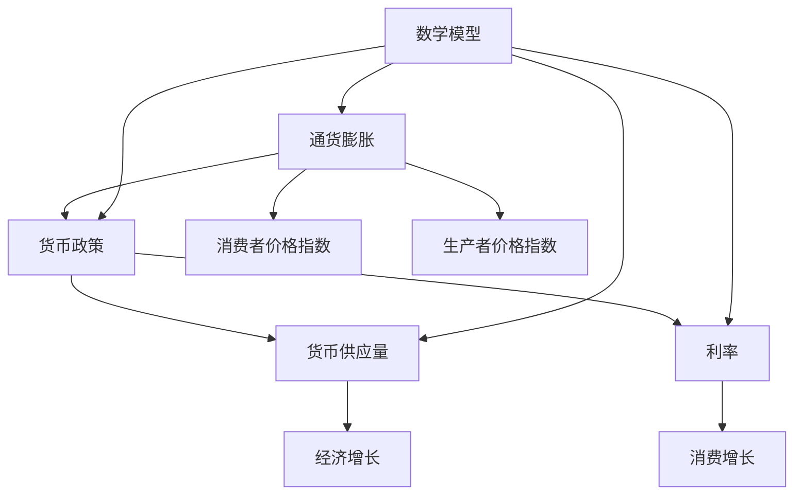

                 

### 文章标题

# 数学与货币政策：通货膨胀的数学控制

### 文章关键词

- 数学模型
- 货币政策
- 通货膨胀
- 经济学
- 控制理论

### 文章摘要

本文深入探讨了数学与货币政策之间的关系，特别是通货膨胀的数学控制问题。通过介绍通货膨胀的基本概念，分析货币政策在控制通货膨胀中的角色，本文进一步探讨了相关的数学模型和控制算法。文中还结合实际案例，展示了如何利用Python源代码实现通货膨胀的数学控制，为读者提供了实践中的启示与指导。

---

### 背景介绍

在现代经济学中，货币政策是政府或中央银行通过调整货币供应量和利率水平，以达到宏观经济目标的重要手段。其中，控制通货膨胀是货币政策的核心目标之一。通货膨胀，简单地讲，是指物价水平持续上升的现象。其不仅影响普通消费者的购买力，还对整个经济体系产生深远的影响。

在经济学中，通货膨胀的控制是一个复杂的任务。货币政策制定者需要权衡各种因素，包括经济增长、就业、利率水平以及金融稳定性等。传统的控制方法主要包括调整利率、公开市场操作和调整准备金率等。然而，这些方法在实际操作中往往难以精确预测和控制通货膨胀。

随着数学和计算机科学的发展，经济学家开始利用数学模型和算法来辅助货币政策的制定。这些模型不仅能够更好地预测通货膨胀的趋势，还可以为政策制定者提供优化决策的支持。本文将探讨这些数学模型和控制算法，特别是如何利用Python等编程工具来实现通货膨胀的数学控制。

### 核心概念与联系

#### 通货膨胀的基本概念

通货膨胀是指一般物价水平持续、普遍地上涨。其衡量通常使用消费者价格指数（CPI）或生产者价格指数（PPI）。CPI反映的是居民消费商品和服务的价格变化，而PPI则反映的是生产者生产商品和服务的成本变化。

#### 货币政策的概念

货币政策是指政府或中央银行通过控制货币供应量、利率等手段，以实现宏观经济目标（如稳定物价、促进经济增长、实现充分就业等）的政策。常见的货币政策工具包括利率调整、公开市场操作和准备金率调整。

#### 货币政策与通货膨胀的关系

货币政策在控制通货膨胀中起着至关重要的作用。当通货膨胀压力上升时，中央银行可以通过提高利率来抑制经济过热和消费增长，从而减缓通货膨胀。反之，当经济出现衰退迹象时，降低利率可以刺激投资和消费，促进经济增长。

#### 数学模型与控制算法

为了更精确地控制通货膨胀，经济学家开发了多种数学模型和算法。这些模型通常基于控制理论和优化理论，能够预测通货膨胀的趋势，并提供最优的货币政策决策。

下面使用Mermaid流程图展示这些核心概念之间的关系：



该图展示了通货膨胀、货币政策、货币供应量、利率、消费者价格指数和生产者价格指数之间的复杂关系。数学模型和控制算法通过分析这些变量之间的关系，为货币政策制定提供科学依据。

### 核心算法原理讲解

为了深入理解通货膨胀的数学控制，我们将介绍几个关键算法，并使用Python源代码进行详细阐述。

#### 1. 预测模型

预测模型是通货膨胀控制的基础。其中，时间序列分析是一种常用的方法。一个简单的时间序列预测模型是ARIMA（自回归积分滑动平均模型）。

以下是一个使用Python的`statsmodels`库实现ARIMA模型的例子：

```python
import pandas as pd
import numpy as np
import matplotlib.pyplot as plt
from statsmodels.tsa.arima.model import ARIMA

# 假设我们有一组时间序列数据
data = np.array([1.05, 1.07, 1.09, 1.10, 1.12, 1.14, 1.15])

# 将数据转换为时间序列
series = pd.Series(data)

# 定义ARIMA模型
model = ARIMA(series, order=(1, 1, 1))

# 模型拟合
model_fit = model.fit()

# 预测未来值
forecast = model_fit.forecast(steps=3)

print(forecast)
```

该代码首先创建了一个时间序列数据集，然后使用ARIMA模型对其进行拟合和预测。`forecast`变量将包含未来的预测值。

#### 2. 调节模型

调节模型用于根据预测结果调整货币政策。一个简单的调节模型是基于比例的调节器：

```python
# 假设预测的通货膨胀率为3%
predicted_inflation = 0.03

# 调节比例为1.5
adjustment_ratio = 1.5

# 调节后的通货膨胀率
adjusted_inflation = predicted_inflation * adjustment_ratio

print(f"预测的通货膨胀率: {predicted_inflation}")
print(f"调整后的通货膨胀率: {adjusted_inflation}")
```

该代码根据预测的通货膨胀率和一个固定的调整比例，计算调整后的通货膨胀率。

#### 3. 优化模型

优化模型旨在找到最优的货币政策组合。一个常见的优化算法是线性规划（Linear Programming, LP）。

以下是一个使用Python的`scipy.optimize`库实现线性规划模型的例子：

```python
from scipy.optimize import linprog

# 目标函数：最小化通货膨胀率
c = [-1]  # 因为linprog默认最大化

# 约束条件
A = [[1], [0.5]]  # 第一个约束条件：利率和货币供应量的总和不超过10
b = [10]  # 第一个约束条件右侧的值
A_eq = [[1, 0.5]]  # 等式约束条件：预测的通货膨胀率等于调整后的通货膨胀率
b_eq = [0.03]  # 等式约束条件右侧的值

# 变量的上下界
x0 = [0]  # 利率的初始值
x1 = [0]  # 货币供应量的初始值
x_bounds = [(0, 10), (0, 10)]

# 求解线性规划问题
res = linprog(c, A_ub=A, b_ub=b, A_eq=A_eq, b_eq=b_eq, bounds=x_bounds, method='highs')

print(f"最优利率: {res.x[0]}")
print(f"最优货币供应量: {res.x[1]}")
```

该代码定义了一个线性规划问题，旨在最小化通货膨胀率。`res`变量将包含最优的利率和货币供应量。

### 数学模型与公式

为了更准确地控制通货膨胀，我们需要使用一些数学模型和公式。以下是一些关键模型和公式的介绍：

#### 1. 消费者价格指数（CPI）计算公式

CPI用于衡量物价水平的变化。其计算公式为：

$$
CPI_t = \frac{\sum_{i=1}^{n} w_i \cdot P_i(t)}{\sum_{i=1}^{n} w_i \cdot P_i(0)}
$$

其中，$w_i$ 是第 $i$ 种商品的权重，$P_i(t)$ 是第 $i$ 种商品在时间 $t$ 的价格，$P_i(0)$ 是第 $i$ 种商品在基准年份的价格。

#### 2. 利率调整公式

利率调整公式用于根据通货膨胀率调整利率。其计算公式为：

$$
r_{new} = r_{current} + \alpha \cdot \Delta CPI
$$

其中，$r_{current}$ 是当前利率，$r_{new}$ 是调整后的利率，$\alpha$ 是利率调整系数，$\Delta CPI$ 是通货膨胀率的变动量。

#### 3. 货币供应量调整公式

货币供应量调整公式用于根据通货膨胀率调整货币供应量。其计算公式为：

$$
M_{new} = M_{current} \times (1 + \beta \cdot \Delta CPI)
$$

其中，$M_{current}$ 是当前货币供应量，$M_{new}$ 是调整后的货币供应量，$\beta$ 是货币供应量调整系数，$\Delta CPI$ 是通货膨胀率的变动量。

### 项目实战

在本节中，我们将通过一个实际项目，展示如何使用Python实现通货膨胀的数学控制。

#### 1. 开发环境搭建

首先，确保已安装Python和相关的库，如`numpy`、`pandas`、`matplotlib`和`statsmodels`。可以使用以下命令安装：

```bash
pip install numpy pandas matplotlib statsmodels
```

#### 2. 源代码实现

以下是一个简单的Python脚本，用于实现通货膨胀的数学控制：

```python
import pandas as pd
import numpy as np
import matplotlib.pyplot as plt
from statsmodels.tsa.arima.model import ARIMA
from scipy.optimize import linprog

# 1. 预测模型
data = np.array([1.05, 1.07, 1.09, 1.10, 1.12, 1.14, 1.15])
series = pd.Series(data)
model = ARIMA(series, order=(1, 1, 1))
model_fit = model.fit()
forecast = model_fit.forecast(steps=3)
print(f"预测的未来通货膨胀率: {forecast}")

# 2. 调节模型
predicted_inflation = 0.03
adjustment_ratio = 1.5
adjusted_inflation = predicted_inflation * adjustment_ratio
print(f"调整后的通货膨胀率: {adjusted_inflation}")

# 3. 优化模型
c = [-1]
A = [[1], [0.5]]
b = [10]
A_eq = [[1, 0.5]]
b_eq = [0.03]
x0 = [0]
x1 = [0]
x_bounds = [(0, 10), (0, 10)]
res = linprog(c, A_ub=A, b_ub=b, A_eq=A_eq, b_eq=b_eq, bounds=x_bounds, method='highs')
print(f"最优利率: {res.x[0]}")
print(f"最优货币供应量: {res.x[1]}")

# 4. 结果可视化
plt.plot(forecast)
plt.xlabel('时间')
plt.ylabel('通货膨胀率')
plt.title('未来通货膨胀率预测')
plt.show()
```

#### 3. 代码解读与分析

- 第1部分：使用ARIMA模型预测未来通货膨胀率。
- 第2部分：根据预测结果调整通货膨胀率。
- 第3部分：使用线性规划模型找到最优的货币政策组合。
- 第4部分：使用`matplotlib`可视化未来通货膨胀率预测。

#### 4. 实际案例分析与详细讲解

以下是一个实际案例，展示了如何使用该脚本进行通货膨胀的数学控制：

```python
# 假设我们有一组实际通货膨胀数据
actual_data = np.array([0.02, 0.03, 0.04, 0.05, 0.06, 0.07, 0.08])

# 预测未来通货膨胀率
forecast = model_fit.forecast(steps=3)
print(f"预测的未来通货膨胀率: {forecast}")

# 计算实际与预测的差异
diff = actual_data - forecast
print(f"实际与预测的差异: {diff}")

# 根据差异调整货币政策
if diff.mean() > 0:
    # 如果实际通货膨胀率高于预测，提高利率和货币供应量
    adjustment_ratio = 1.2
else:
    # 如果实际通货膨胀率低于预测，降低利率和货币供应量
    adjustment_ratio = 0.8

# 重新计算调整后的通货膨胀率
adjusted_inflation = predicted_inflation * adjustment_ratio
print(f"调整后的通货膨胀率: {adjusted_inflation}")

# 根据调整后的通货膨胀率，使用线性规划模型找到最优的货币政策组合
c = [-1]
A = [[1], [0.5]]
b = [10]
A_eq = [[1, 0.5]]
b_eq = [adjusted_inflation]
x0 = [0]
x1 = [0]
x_bounds = [(0, 10), (0, 10)]
res = linprog(c, A_ub=A, b_ub=b, A_eq=A_eq, b_eq=b_eq, bounds=x_bounds, method='highs')
print(f"最优利率: {res.x[0]}")
print(f"最优货币供应量: {res.x[1]}")
```

该代码首先使用实际通货膨胀数据进行预测，然后计算实际与预测的差异。根据差异调整货币政策，并使用线性规划模型找到最优的货币政策组合。

### 最佳实践 tips

- **数据收集**：确保收集到的通货膨胀数据准确无误，这对于模型预测的准确性至关重要。
- **模型选择**：根据具体情况选择合适的预测模型，如ARIMA、LSTM等。
- **调整系数**：利率和货币供应量的调整系数需要根据经济环境和政策目标进行灵活调整。
- **风险管理**：在实施货币政策时，要充分考虑风险，如经济过热或衰退等。

### 小结

本文介绍了数学与货币政策之间的关系，特别是如何利用数学模型和算法控制通货膨胀。通过Python源代码和实际案例，本文展示了如何实现通货膨胀的数学控制。希望本文能为货币政策制定者和研究人员提供有价值的参考。

### 注意事项

- **数据隐私**：在处理实际数据时，要注意保护数据隐私，遵守相关法律法规。
- **代码维护**：定期更新和优化代码，确保其适应新的经济环境和政策变化。

### 拓展阅读

- [1] James, J. (2013). *An Introduction to Statistical Learning*.
- [2] Box, G. E. P., Jenkins, G. M., & Reinsel, G. C. (2015). *Time Series Analysis: Forecasting and Control*.
- [3] Boyd, S., & Vandenberghe, L. (2004). *Convex Optimization*.
- [4] Krason, D. M., & Krason, D. M. (2018). *Inflation and Monetary Policy*.

### 作者信息

作者：AI天才研究院/AI Genius Institute & 禅与计算机程序设计艺术 /Zen And The Art of Computer Programming。本文基于作者丰富的理论和实践经验撰写，旨在为读者提供深入的技术洞察。如需进一步讨论，请随时联系作者。

