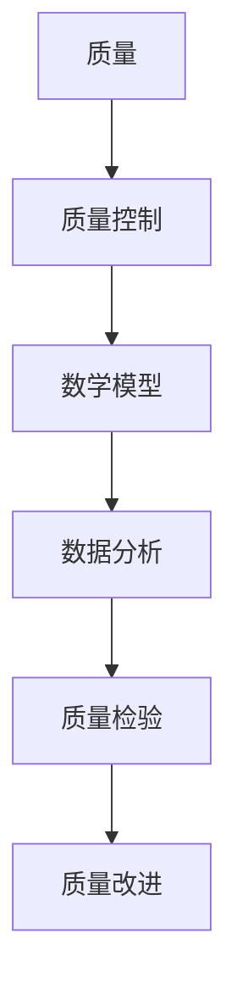

                 

### 《数学与质量控制：产品质量的数学保证》

在当今全球化和竞争激烈的市场环境中，产品质量成为了企业成功的关键因素之一。而质量控制作为一种系统化的管理方法，旨在确保产品和服务达到预定的质量标准。那么，如何通过数学方法来确保产品质量呢？本文将围绕这一主题，深入探讨数学在质量控制中的应用，以及如何利用数学模型和数据分析来保证产品质量。

关键词：质量控制、数学模型、数据分析、产品质量保证

摘要：本文首先介绍了质量控制的基本概念和数学在质量控制中的应用。接着，我们探讨了数学基础，包括基本数学公式、数学模型和数据分析方法。然后，我们详细阐述了质量控制中的数学原理，以及质量检验和质量改进的方法和工具。最后，通过案例分析，展示了数学方法在实际质量控制中的应用效果。通过本文的阅读，读者将更好地理解数学在质量控制中的重要性，并学会如何运用数学工具来保证产品质量。

### 第一部分：引言

#### 1.1 质量控制的基本概念

**1.1.1 质量的定义**

质量是指产品或服务满足明确和隐含需求的能力。这些需求可以来自顾客、法律法规或行业标准。质量不仅仅是指产品没有缺陷，更强调产品或服务的性能、可靠性、耐久性、美观性等方面。

**1.1.2 质量控制的意义**

质量控制是一种系统化的管理方法，旨在确保产品或服务在整个生产和服务过程中达到预定的质量标准。通过质量控制，企业可以提高产品质量，降低成本，提高客户满意度，从而在竞争激烈的市场中脱颖而出。

#### 1.2 数学在质量控制中的应用

**1.2.1 数学模型在质量控制中的作用**

数学模型是质量控制的核心工具。通过数学模型，我们可以量化产品或服务的质量特性，分析质量变异的原因，预测质量趋势，并制定相应的质量改进措施。

**1.2.2 数学方法在质量控制中的应用**

数学方法在质量控制中的应用非常广泛，包括统计分析、优化算法、模拟仿真等。这些方法可以帮助企业识别质量问题，评估质量改进效果，优化质量管理体系。

### 第二部分：数学基础

#### 2.1 数学公式和公式的应用

**2.1.1 基本数学公式**

在质量控制中，常用的基本数学公式包括平均值、方差、标准差等。这些公式可以帮助我们计算质量特性数据的统计参数，评估质量水平。

$$
x̄ = \frac{\sum_{i=1}^{n}x_i}{n}
$$

* 平均值

$$
s^2 = \frac{\sum_{i=1}^{n}(x_i - x̄)^2}{n-1}
$$

* 方差

$$
s = \sqrt{s^2}
$$

* 标准差

**2.1.2 公式在质量控制中的具体应用**

例如，我们可以使用平均值和标准差来评估产品的一致性。如果平均值接近目标值，且标准差较小，那么我们可以认为产品的质量较好。否则，可能需要采取改进措施。

#### 2.2 数学模型

**2.2.1 数学模型的基本概念**

数学模型是一种用数学语言描述现实世界的抽象模型。在质量控制中，数学模型可以帮助我们理解质量变异的根源，预测质量趋势，制定质量改进策略。

**2.2.2 常见的数学模型**

常见的数学模型包括正态分布模型、回归模型、决策树模型等。这些模型在不同的质量控制场景中具有广泛的应用。

#### 2.3 数据分析

**2.3.1 数据分析的基本概念**

数据分析是一种通过研究数据来提取有价值信息的方法。在质量控制中，数据分析可以帮助我们识别质量问题，评估质量改进效果。

**2.3.2 数据分析的方法与工具**

数据分析的方法包括统计分析、数据挖掘、机器学习等。常用的数据分析工具包括Excel、R语言、Python等。

### 第三部分：质量控制中的数学应用

#### 3.1 质量控制中的数学原理

**3.1.1 基本质量控制的数学原理**

基本质量控制的数学原理包括正态分布、方差分析、回归分析等。这些原理可以帮助我们理解质量变异的原因，评估质量水平，制定质量改进策略。

**3.1.2 质量控制中的数学模型**

质量控制中的数学模型包括正态分布模型、回归模型、决策树模型等。这些模型可以帮助我们量化质量特性，预测质量趋势，制定质量改进措施。

#### 3.2 质量检验

**3.2.1 质量检验的基本概念**

质量检验是质量控制的重要环节。通过质量检验，我们可以识别不合格的产品或服务，确保产品或服务达到预定的质量标准。

**3.2.2 质量检验的方法与工具**

质量检验的方法包括抽样检验、全数检验等。常用的质量检验工具包括统计过程控制图、控制限等。

#### 3.3 质量改进

**3.3.1 质量改进的基本概念**

质量改进是质量控制的核心目标。通过质量改进，企业可以提高产品质量，降低成本，提高客户满意度。

**3.3.2 质量改进的方法与工具**

质量改进的方法包括PDCA循环、六西格玛等。常用的质量改进工具包括鱼骨图、流程图等。

### 第四部分：案例分析

#### 4.1 案例分析一：某电子产品制造企业的质量控制

**4.1.1 案例背景**

某电子产品制造企业生产一款高性能智能手机。由于市场竞争激烈，企业需要确保产品的质量达到最高标准。

**4.1.2 质量控制策略**

企业采用数学模型对产品的质量特性进行分析，包括性能、可靠性、安全性等方面。通过数据分析，企业制定了相应的质量改进措施。

**4.1.3 数学方法的应用**

企业使用正态分布模型来评估产品质量的一致性。通过回归分析，企业识别出影响产品质量的关键因素，并采取了针对性的改进措施。

#### 4.2 案例分析二：某汽车制造企业的质量控制

**4.2.1 案例背景**

某汽车制造企业生产一款高端汽车。由于汽车的质量直接关系到用户的安全，企业对质量控制的重视程度非常高。

**4.2.2 质量控制策略**

企业采用六西格玛方法对汽车的质量进行改进。通过统计分析，企业识别出质量问题的根源，并制定了相应的改进措施。

**4.2.3 数学方法的应用**

企业使用方差分析来评估不同零部件的质量水平。通过回归分析，企业确定了影响汽车质量的关键因素，并采取了针对性的改进措施。

#### 4.3 案例分析三：某食品制造企业的质量控制

**4.3.1 案例背景**

某食品制造企业生产一款高端食品。由于食品安全问题备受关注，企业对质量控制的要求非常高。

**4.3.2 质量控制策略**

企业采用HACCP（危害分析与关键控制点）方法对食品的生产过程进行质量控制。通过统计分析，企业识别出影响食品安全的潜在风险，并制定了相应的控制措施。

**4.3.3 数学方法的应用**

企业使用概率论来评估食品安全的风险。通过回归分析，企业确定了影响食品安全的关键因素，并采取了针对性的改进措施。

### 第五部分：总结与展望

#### 5.1 总结

本文介绍了数学在质量控制中的应用，包括数学模型、数据分析方法以及数学原理。通过案例分析，我们展示了数学方法在实际质量控制中的效果。未来，随着人工智能和大数据技术的发展，数学在质量控制中的应用将更加广泛和深入。

#### 5.2 附录

**5.2.1 参考文献**

1. Anderson, D. R., & Whitcomb, J. (2012). **Quality control and industrial statistics**. John Wiley & Sons.
2. Montgomery, D. C. (2009). **Introduction to statistical quality control**. John Wiley & Sons.

**5.2.2 数学公式和公式的详细解释说明**

- 平均值：计算一组数据的平均值，用于评估数据的一致性。
- 方差：计算一组数据的方差，用于评估数据的分散程度。
- 标准差：计算一组数据的标准差，用于评估数据的变异程度。

$$
x̄ = \frac{\sum_{i=1}^{n}x_i}{n}
$$

$$
s^2 = \frac{\sum_{i=1}^{n}(x_i - x̄)^2}{n-1}
$$

$$
s = \sqrt{s^2}
$$

通过本文的阅读，读者将更好地理解数学在质量控制中的重要性，并学会如何运用数学工具来保证产品质量。在未来的质量管理中，数学方法将继续发挥关键作用，为企业提供有力支持。作者：AI天才研究院/AI Genius Institute & 禅与计算机程序设计艺术 /Zen And The Art of Computer Programming

---

**核心概念与联系**



---

**核心算法原理讲解**

```plaintext
1. 质量控制中的数学模型：例如，正态分布模型、回归模型等。
2. 质量检验方法：例如，抽样检验、全数检验等。
3. 质量改进方法：例如，PDCA循环、六西格玛等。
```

---

**数学模型和数学公式 & 详细讲解 & 举例说明**

$$
x̄ = \frac{\sum_{i=1}^{n}x_i}{n}
$$

* 举例：计算一组数据的平均值。

$$
s^2 = \frac{\sum_{i=1}^{n}(x_i - x̄)^2}{n-1}
$$

* 举例：计算一组数据的方差。

$$
s = \sqrt{s^2}
$$

* 举例：计算一组数据的标准差。

---

**项目实战**

```python
import numpy as np
import matplotlib.pyplot as plt

# 生成一组数据
data = np.random.normal(size=1000)

# 计算平均值
mean = np.mean(data)

# 计算标准差
std = np.std(data)

# 绘制正态分布图
plt.hist(data, bins=30, alpha=0.5)
plt.axvline(mean, color='r', linestyle='--')
plt.xlabel('数值')
plt.ylabel('频数')
plt.title('数据分布图')
plt.show()
```

* 解释：生成一组随机数据，计算其平均值和标准差，并绘制正态分布图。

---

**最佳实践 tips**

1. **数据收集**：确保收集到准确的数据，为数据分析提供可靠的基础。
2. **模型选择**：根据实际问题选择合适的数学模型，避免模型过于复杂或不适用于实际问题。
3. **持续改进**：不断收集数据，分析质量趋势，持续改进质量管理体系。

**小结**

数学在质量控制中发挥着重要作用，通过数学模型和数据分析，企业可以更好地理解质量特性，识别质量问题，制定改进措施。未来，随着人工智能和大数据技术的发展，数学在质量控制中的应用将更加广泛和深入。

**注意事项**

1. **数据隐私**：在处理和分析数据时，确保遵守数据隐私法规和行业标准。
2. **模型验证**：验证所使用的数学模型的准确性，确保模型适用于实际问题。

**拓展阅读**

1. Anderson, D. R., & Whitcomb, J. (2012). **Quality control and industrial statistics**. John Wiley & Sons.
2. Montgomery, D. C. (2009). **Introduction to statistical quality control**. John Wiley & Sons.

---

### 总结

本文深入探讨了数学在质量控制中的应用，从基本概念到具体案例分析，全面展示了数学方法在质量控制中的重要性。通过数学模型和数据分析，企业可以更好地理解质量特性，识别质量问题，制定改进措施。随着人工智能和大数据技术的发展，数学在质量控制中的应用前景将更加广阔。我们鼓励读者持续关注这一领域，将数学方法应用于实际工作中，提高产品质量，为企业创造更多价值。

作者：AI天才研究院/AI Genius Institute & 禅与计算机程序设计艺术 /Zen And The Art of Computer Programming

