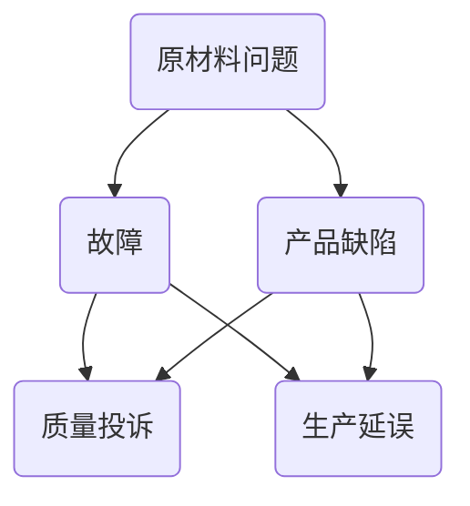

                 

### 数学与质量管理：质量控制的数学方法

质量管理，作为一个确保产品和服务满足或超越客户期望的关键过程，在各个行业中发挥着至关重要的作用。然而，在当今复杂多变的环境中，如何有效进行质量管理，如何通过系统化和科学化的手段来监控和改进质量，成为了每一个企业所面临的重要挑战。这时，数学方法以其精确、系统的特点，成为质量管理中不可或缺的工具。

**关键词：** 质量管理、数学方法、质量控制、统计控制、线性回归、方差分析、假设检验、贝叶斯方法、质量损失函数、目标规划、线性规划、非线性规划。

**摘要：** 本文将从数学与质量管理的关系出发，深入探讨数学方法在质量管理中的应用，涵盖统计质量控制、统计过程控制、线性回归、方差分析、假设检验、贝叶斯方法等多个方面。通过具体案例和实践，展示如何运用数学工具来提升质量管理效率，最终实现产品和服务的高质量。

### 第一部分：质量管理基础

在深入探讨数学方法在质量管理中的应用之前，我们首先需要了解质量管理的基础知识。这一部分将介绍质量管理的起源、基本概念以及统计质量控制方法，为后续内容的讨论打下坚实的基础。

#### 第1章：质量管理的起源与基本概念

##### 1.1 质量管理的起源

质量管理作为一个专业领域，其发展历程可以追溯到20世纪初。当时，世界正处于工业革命的高潮期，制造业的迅速发展为产品质量的提升带来了前所未有的挑战。为了应对这些挑战，一些企业开始尝试引入科学管理的方法，以期通过系统化的手段来提高产品质量。1924年，沃尔特·休哈特（Walter A. Shewhart）在美国贝尔实验室提出了质量控制图（Control Chart），这是质量管理史上的一个重要里程碑。

##### 1.1.1 质量管理的发展历程

20世纪初至中期，质量管理主要侧重于生产过程的控制。随着科学技术的进步和人们对质量认识的深入，质量管理逐渐从单纯的“质量控制”扩展到“全面质量管理”（Total Quality Management, TQM）。全面质量管理强调全员参与，通过持续改进、顾客满意等手段，全面提升组织的质量管理水平。

##### 1.1.2 质量管理的基本原则

质量管理的基本原则可以概括为以下几个方面：

1. **以顾客为中心**：满足顾客需求是质量管理的首要任务。
2. **领导力**：领导者的作用在于建立质量愿景和目标，并提供资源支持。
3. **全员参与**：每个员工都应积极参与质量管理，共同推动组织的质量改进。
4. **过程方法**：将质量管理视为一个系统，通过优化流程来提高质量。
5. **持续改进**：持续改进是质量管理的核心，通过不断学习和创新来提升质量。

##### 1.2 质量管理的要素

质量管理的要素包括质量控制和质量保证两大方面。

##### 1.2.1 质量控制

质量控制主要关注生产过程中的实时监控和调整，以确保产品或服务的质量符合标准。具体方法包括：制定质量控制计划、实施质量检验、纠正质量问题等。

##### 1.2.2 质量保证

质量保证则侧重于预防和确保产品或服务在整个生命周期内满足质量要求。质量保证包括：制定质量标准、开展质量审核、进行质量评审等。

##### 1.2.3 质量管理体系标准

为了推动质量管理的发展，国际标准化组织（ISO）于1987年发布了ISO 9001质量管理体系标准。该标准成为全球范围内广泛采用的质量管理体系的基准，有助于组织提高质量管理水平和客户满意度。

ISO 9001标准主要包括以下几个核心要求：

1. **领导作用**：领导者应确立质量方针和目标，并确保资源得到充分分配。
2. **策划**：组织应制定质量管理体系文件，并开展质量策划活动。
3. **支持**：组织应提供所需资源，确保员工胜任，并建立有效的沟通机制。
4. **运行**：组织应按照策划要求实施过程控制，确保产品或服务的质量。
5. **绩效评价**：组织应定期监控、测量和分析质量管理体系的有效性，并采取纠正和预防措施。

#### 第2章：统计质量控制方法

统计质量控制方法是基于统计学原理，通过数据分析和监控，对生产过程进行实时控制，以保持产品质量的稳定和一致性。以下将介绍两种主要的统计质量控制方法：平均值控制图和极差控制图。

##### 2.1 统计质量控制概述

##### 2.1.1 统计质量控制的目标

统计质量控制的目标主要有两个方面：

1. **识别异常情况**：通过监控生产过程中的数据，及时发现和识别异常情况，防止不合格产品流出。
2. **持续改进**：通过分析质量数据，找出生产过程中的问题和瓶颈，制定改进措施，不断提升产品质量。

##### 2.1.2 统计质量控制的过程

统计质量控制的过程主要包括以下几个步骤：

1. **确定质量特性**：明确需要监控的质量特性，如尺寸、重量、性能等。
2. **收集数据**：在生产过程中收集相关质量数据，如测量值、缺陷率等。
3. **绘制控制图**：将收集到的数据绘制成控制图，以便分析和监控。
4. **判断控制状态**：根据控制图的走势，判断生产过程是否处于受控状态。
5. **采取纠正措施**：如果发现生产过程出现异常，及时采取纠正措施，确保产品质量。

##### 2.2 平均值控制图

平均值控制图（X控制图）主要用于监控连续质量特性（如尺寸、重量等）的平均值。以下将介绍平均值控制图的原理、计算方法和应用。

###### 2.2.1 平均值控制图原理

平均值控制图的基本原理是基于中心极限定理，即在大量独立同分布的随机变量之和服从正态分布的情况下，其平均值也服从正态分布。平均值控制图的中心线表示平均值的目标值，上下控制限则根据统计原理计算得到。

###### 2.2.2 平均值控制图计算与解释

1. **计算中心线（CL）**：中心线等于目标值，即 CL = 目标值。

2. **计算控制上限（UCL）**：控制上限等于目标值加上3倍的标准差，即 UCL = CL + 3σ。

3. **计算控制下限（LCL）**：控制下限等于目标值减去3倍的标准差，即 LCL = CL - 3σ。

4. **绘制控制图**：将收集到的数据点按照时间顺序绘制在控制图上，并标注中心线、控制上限和控制下限。

5. **判断控制状态**：如果数据点落在控制限之内，则认为生产过程处于受控状态；如果数据点超出控制限，则认为生产过程出现异常，需要采取纠正措施。

##### 2.3 极差控制图

极差控制图（R控制图）主要用于监控连续质量特性的极差。以下将介绍极差控制图的原理、计算方法和应用。

###### 2.3.1 极差控制图原理

极差控制图的基本原理与平均值控制图类似，也是基于中心极限定理。极差控制图的中心线表示极差的目标值，上下控制限则根据统计原理计算得到。

###### 2.3.2 极差控制图计算与解释

1. **计算中心线（CL）**：中心线等于目标值，即 CL = 目标值。

2. **计算控制上限（UCL）**：控制上限等于目标值加上3倍的平均极差，即 UCL = CL + 3R。

3. **计算控制下限（LCL）**：控制下限等于目标值减去3倍的平均极差，即 LCL = CL - 3R。

4. **绘制控制图**：将收集到的数据点按照时间顺序绘制在控制图上，并标注中心线、控制上限和控制下限。

5. **判断控制状态**：如果数据点落在控制限之内，则认为生产过程处于受控状态；如果数据点超出控制限，则认为生产过程出现异常，需要采取纠正措施。

#### 第3章：统计过程控制

统计过程控制（Statistical Process Control, SPC）是一种通过监控生产过程，确保产品质量稳定和一致的方法。以下将介绍统计过程控制的基本概念、试验设计方法以及响应曲面法。

##### 3.1 过程控制概述

##### 3.1.1 过程控制的目的

过程控制的主要目的是通过实时监控生产过程，识别和纠正异常情况，确保产品质量的稳定和一致。具体目标包括：

1. **减少不合格品率**：通过监控生产过程，及时识别异常情况，减少不合格品的产生。
2. **提高生产效率**：通过优化生产过程，减少废品率，提高生产效率。
3. **提升产品质量**：通过持续改进，不断提升产品的质量水平。

##### 3.1.2 过程控制的方法

过程控制的方法主要包括以下几个方面：

1. **控制图**：通过绘制控制图，实时监控生产过程中的质量特性，判断过程是否受控。
2. **统计过程分析**：利用统计方法对生产过程中的数据进行分析，识别异常情况和潜在问题。
3. **试验设计**：通过科学合理的试验设计，优化生产过程，提升产品质量。
4. **持续改进**：通过不断监控、分析和改进，实现产品质量的持续提升。

##### 3.2 试验设计

试验设计（Experiment Design）是一种通过有计划地安排实验，收集数据并进行分析的方法。以下将介绍两种常见的试验设计方法：正交试验和响应曲面法。

###### 3.2.1 试验设计的概念

试验设计的基本概念包括以下几个方面：

1. **试验因素**：影响产品质量的变量，如原材料、工艺参数、设备等。
2. **试验水平**：每个因素的不同取值，如高、低两种水平。
3. **试验组合**：各个因素水平的组合，如A1B2C3。
4. **试验结果**：通过试验得到的数据，如质量特性值、不合格品数等。

###### 3.2.2 常见试验设计方法

1. **正交试验设计**

正交试验设计是一种利用正交表进行试验设计的方法，其优点是试验次数较少，能够全面考察因素水平组合的影响。以下是一个简单的正交试验设计示例：

| 试验号 | 因素A（温度） | 因素B（时间） | 因素C（压力） | 质量特性值 |
|--------|--------------|--------------|--------------|------------|
| 1      | 高           | 低           | 低           | 85         |
| 2      | 低           | 低           | 高           | 90         |
| 3      | 高           | 高           | 高           | 95         |
| 4      | 低           | 高           | 低           | 88         |

通过正交试验设计，我们可以得到各个因素水平组合对质量特性的影响，从而优化生产工艺。

2. **响应曲面法

响应曲面法（Response Surface Methodology, RSM）是一种通过构建响应曲面模型，优化多因素试验方法。以下是一个简单的响应曲面法示例：

假设我们有三个因素A、B、C，分别代表温度、时间和压力，质量特性值为Z。通过试验，我们得到以下数据：

| 试验号 | A（温度） | B（时间） | C（压力） | Z（质量特性值） |
|--------|-----------|-----------|-----------|----------------|
| 1      | 100       | 20        | 10        | 85             |
| 2      | 80        | 30        | 20        | 90             |
| 3      | 120       | 30        | 10        | 95             |
| 4      | 80        | 20        | 30        | 88             |

通过响应曲面法，我们可以构建一个关于A、B、C和Z的二次响应曲面模型，并利用该模型进行优化，以找到最优的试验参数组合。

##### 3.3 响应曲面法

响应曲面法是一种基于二次多项式的数学模型，用于描述多个自变量（因素）与因变量（响应）之间的关系。以下将介绍响应曲面法的原理、模型构建和应用。

###### 3.3.1 响应曲面法原理

响应曲面法的核心思想是通过构建二次多项式模型，描述多个因素与响应之间的关系。具体步骤如下：

1. **设计试验方案**：根据实验目标和影响因素，设计合理的试验方案，包括中心复合设计、均匀设计等。
2. **收集数据**：按照试验方案进行试验，收集各个因素的取值和对应的响应值。
3. **构建模型**：利用收集到的数据，通过回归分析方法，构建二次多项式模型。
4. **模型优化**：利用构建的模型，进行模型优化，找到最优的试验参数组合。

###### 3.3.2 响应曲面法应用实例

以下是一个简单的响应曲面法应用实例：

假设我们研究三个因素（温度、时间、压力）对产品质量的影响，质量特性值为Z。通过试验，我们得到以下数据：

| 试验号 | 温度（A） | 时间（B） | 压力（C） | Z（质量特性值） |
|--------|-----------|-----------|-----------|----------------|
| 1      | 100       | 20        | 10        | 85             |
| 2      | 80        | 30        | 20        | 90             |
| 3      | 120       | 30        | 10        | 95             |
| 4      | 80        | 20        | 30        | 88             |

利用这些数据，我们可以构建一个关于A、B、C和Z的二次多项式模型：

Z = β0 + β1*A + β2*B + β3*C + β2*A*B + β3*A*C + β3*B*C

通过回归分析方法，我们可以计算出各个系数的估计值，并得到响应曲面模型。

接下来，我们可以利用响应曲面模型进行优化，找到最优的试验参数组合。具体步骤如下：

1. **构建响应曲面**：根据模型，绘制响应曲面图，直观地展示各个因素对响应的影响。
2. **确定最优参数**：利用优化算法，如梯度下降法、牛顿法等，找到响应曲面的最优参数组合。
3. **验证优化结果**：在实际生产过程中，应用最优参数组合，验证优化效果。

通过响应曲面法，我们可以更准确地描述多个因素与响应之间的关系，为生产过程的优化提供有力支持。

### 第二部分：数学方法在质量管理中的应用

在质量管理中，数学方法的应用不仅能够帮助我们理解和分析质量数据，还可以帮助我们设计更有效的质量控制策略。本部分将重点介绍线性回归分析、方差分析和假设检验等数学方法在质量管理中的应用。

#### 第4章：线性回归分析

线性回归分析是一种常用的统计方法，用于研究两个或多个变量之间的线性关系。在质量管理中，线性回归分析可以用于预测和控制质量特性。

##### 4.1 线性回归概述

##### 4.1.1 线性回归的概念

线性回归分析旨在找到两个变量（自变量和因变量）之间的线性关系。这种关系可以用一个线性方程来表示：

y = β0 + β1*x + ε

其中，y 是因变量，x 是自变量，β0 是截距，β1 是斜率，ε 是误差项。

##### 4.1.2 线性回归的应用领域

线性回归分析在质量管理中的应用非常广泛，主要包括：

1. **质量特性预测**：通过分析历史数据，预测未来质量特性的表现。
2. **质量控制**：利用回归模型，监控质量特性，及时发现异常情况。
3. **过程优化**：通过调整自变量，优化质量特性，实现质量改进。

##### 4.2 一元线性回归

一元线性回归分析涉及一个自变量和一个因变量。以下将详细介绍一元线性回归的模型、计算方法及应用实例。

###### 4.2.1 一元线性回归模型

一元线性回归模型的基本形式为：

y = β0 + β1*x + ε

其中，β0 是截距，表示当 x = 0 时 y 的预期值；β1 是斜率，表示自变量 x 对因变量 y 的影响程度。

###### 4.2.2 一元线性回归计算与解释

1. **计算β0 和β1**：

   为了计算β0 和β1，我们需要使用最小二乘法（Least Squares Method）。最小二乘法的思想是找到一条直线，使得所有数据点到这条直线的垂直距离之和最小。

   计算公式如下：

   β0 = (Σ(yi - β1*xi)) / n

   β1 = (n*Σ(xi*yi) - Σ(xi)*Σ(yi)) / (n*Σ(xi^2) - (Σ(xi))^2)

   其中，n 是数据点的数量，xi 和 yi 分别是第 i 个数据点的自变量和因变量值。

2. **绘制回归直线**：

   根据计算得到的β0 和β1，我们可以绘制出一元线性回归的回归直线。这条直线表示自变量和因变量之间的线性关系。

3. **解释回归直线**：

   回归直线的斜率β1 表示自变量 x 对因变量 y 的影响程度。如果斜率为正，表示自变量增加时因变量也增加；如果斜率为负，表示自变量增加时因变量减少。

   截距β0 表示当自变量 x 为0 时因变量的预期值。

##### 4.3 多元线性回归

多元线性回归分析涉及两个或更多自变量。以下将详细介绍多元线性回归的模型、计算方法及应用实例。

###### 4.3.1 多元线性回归模型

多元线性回归模型的基本形式为：

y = β0 + β1*x1 + β2*x2 + ... + βk*xk + ε

其中，x1, x2, ..., xk 是自变量，β0 是截距，β1, β2, ..., βk 是斜率，ε 是误差项。

###### 4.3.2 多元线性回归计算与解释

1. **计算β0, β1, ..., βk**：

   多元线性回归的β0, β1, ..., βk 也需要使用最小二乘法计算。计算公式如下：

   β0 = (Σ(yi - β1*xi1 - β2*xi2 - ... - βk*xik)) / n

   β1 = ((Σ(xi1))^2 * (Σ(yi*xi2)) - (Σ(xi1)*Σ(xi2))) / ((Σ(xi1))^2 * (Σ(xi2)^2) - (Σ(xi1)*Σ(xi2))^2)

   β2 = ((Σ(xi2))^2 * (Σ(yi*xi1)) - (Σ(xi1)*Σ(xi2))) / ((Σ(xi2))^2 * (Σ(xi1)^2) - (Σ(xi1)*Σ(xi2))^2)

   ...

   βk = ((Σ(xik))^2 * (Σ(yi*xi1)) - (Σ(xi1)*Σ(xik))) / ((Σ(xik))^2 * (Σ(xi1)^2) - (Σ(xi1)*Σ(xik))^2)

   其中，n 是数据点的数量，xi1, xi2, ..., xik 分别是第 i 个数据点的自变量值。

2. **绘制回归平面**：

   根据计算得到的β0, β1, ..., βk，我们可以绘制出多元线性回归的回归平面。这个平面表示多个自变量和因变量之间的线性关系。

3. **解释回归平面**：

   回归平面的每个斜率β1, β2, ..., βk 都表示相应自变量对因变量的影响程度。如果斜率为正，表示自变量增加时因变量也增加；如果斜率为负，表示自变量增加时因变量减少。

   截距β0 表示当所有自变量 x1, x2, ..., xk 都为0时因变量的预期值。

#### 第5章：方差分析

方差分析（Analysis of Variance, ANOVA）是一种用于比较多个样本均值是否具有显著差异的统计方法。在质量管理中，方差分析可以用于评估不同处理或条件对质量特性影响的显著性。

##### 5.1 方差分析概述

##### 5.1.1 方差分析的概念

方差分析旨在比较不同组（或处理）之间的均值是否有显著差异。具体来说，方差分析通过计算组内方差（组内变异）和组间方差（组间变异），评估这些方差的大小，从而判断不同组之间的均值是否具有显著性差异。

##### 5.1.2 方差分析的应用领域

方差分析在质量管理中的应用主要包括：

1. **评估不同原材料对质量的影响**：通过比较不同原材料的质量特性，确定哪种原材料更适合生产过程。
2. **比较不同生产线的效率**：通过分析不同生产线的质量特性，找出生产效率较高的生产线。
3. **评估不同工艺参数的效果**：通过比较不同工艺参数下的质量特性，确定最佳工艺参数组合。

##### 5.2 单因素方差分析

单因素方差分析用于比较两个或多个独立样本均值是否有显著差异。以下将详细介绍单因素方差分析的模型、计算方法和应用实例。

###### 5.2.1 单因素方差分析模型

单因素方差分析的基本模型为：

H0: μ1 = μ2 = ... = μk （各组均值相等）

H1: 至少两个均值不相等

其中，k 是组数，μ1, μ2, ..., μk 是各组均值。

###### 5.2.2 单因素方差分析计算与解释

1. **计算组内方差和组间方差**：

   组内方差（组内变异）表示每个样本内部的变异程度，计算公式为：

   SSW = Σ(ni - 1) * si^2

   其中，ni 是第 i 组样本数量，si 是第 i 组样本标准差。

   组间方差（组间变异）表示各组之间的变异程度，计算公式为：

   SSB = Σ(k - 1) * σi^2

   其中，k 是组数，σi 是第 i 组样本方差。

2. **计算F值**：

   F值是组间方差与组内方差的比值，用于判断各组均值是否有显著差异。计算公式为：

   F = SSB / SSW

3. **判断显著性**：

   根据F值和自由度（组间自由度和组内自由度），查F分布表，确定在给定的显著性水平下，F值是否显著。

   如果F值大于临界值，则拒绝原假设 H0，认为至少两个均值不相等；否则，接受原假设 H0，认为各组均值相等。

##### 5.3 多因素方差分析

多因素方差分析用于比较两个或多个因素的不同水平对质量特性的影响是否显著。以下将详细介绍多因素方差分析的模型、计算方法和应用实例。

###### 5.3.1 多因素方差分析模型

多因素方差分析的基本模型为：

H0: β1 = β2 = ... = βk （各因素水平效果相等）

H1: 至少两个因素水平效果不相等

其中，k 是因素水平数，β1, β2, ..., βk 是各因素水平效果。

###### 5.3.2 多因素方差分析计算与解释

1. **计算各因素水平的方差**：

   各因素水平的方差表示各因素水平对质量特性的影响程度，计算公式为：

   SSB1 = Σ(nij - 1) * si1^2

   SSB2 = Σ(nij - 1) * si2^2

   ...

   SSBk = Σ(nij - 1) * sik^2

   其中，nij 是第 i 组第 j 个因素水平的样本数量，si1, si2, ..., sik 是第 i 组第 j 个因素水平的样本标准差。

2. **计算总方差**：

   总方差表示所有因素水平的综合影响程度，计算公式为：

   SST = Σ(ni - 1) * si^2

   其中，ni 是第 i 组样本数量，si 是第 i 组样本标准差。

3. **计算F值**：

   F值是各因素水平的方差与总方差的比值，用于判断各因素水平效果是否显著。计算公式为：

   F = (SSB1 + SSB2 + ... + SSBk) / SST

4. **判断显著性**：

   根据F值和自由度（各因素水平的自由度和总自由度），查F分布表，确定在给定的显著性水平下，F值是否显著。

   如果F值大于临界值，则拒绝原假设 H0，认为至少两个因素水平效果不相等；否则，接受原假设 H0，认为各因素水平效果相等。

#### 第6章：假设检验

假设检验（Hypothesis Testing）是一种用于判断总体参数是否满足某种假设的统计方法。在质量管理中，假设检验可以用于评估质量特性是否满足预定标准。

##### 6.1 假设检验概述

##### 6.1.1 假设检验的概念

假设检验的基本思想是：在给定的样本数据基础上，提出一个关于总体参数的假设，并通过样本数据的统计分析，判断这个假设是否成立。

##### 6.1.2 假设检验的应用领域

假设检验在质量管理中的应用主要包括：

1. **质量特性评估**：通过假设检验，判断质量特性是否满足预定标准。
2. **过程能力分析**：通过假设检验，评估生产过程的能力是否满足要求。
3. **质量改进**：通过假设检验，判断质量改进措施是否有效。

##### 6.2 单样本检验

单样本检验用于判断单个样本的均值是否满足某种假设。以下将详细介绍单样本检验的方法、计算步骤和应用实例。

###### 6.2.1 单样本t检验

单样本t检验是一种常用的单样本检验方法，用于判断样本均值是否与预定标准有显著差异。以下是一个单样本t检验的实例：

假设我们从一个正态分布的总体中抽取了一个样本，样本均值为 x̄，样本标准差为 s，总体标准差为 σ。我们需要判断样本均值 x̄ 是否与预定标准 μ0 有显著差异。

H0: μ = μ0 （总体均值等于预定标准）

H1: μ ≠ μ0 （总体均值不等于预定标准）

计算步骤如下：

1. **计算样本均值和样本标准差**：

   x̄ = Σxi / n

   s = sqrt(Σ(xi - x̄)^2 / (n - 1))

   其中，xi 是第 i 个样本值，n 是样本数量。

2. **计算t值**：

   t = (x̄ - μ0) / (s / sqrt(n))

3. **判断显著性**：

   根据t值和自由度（n - 1），查t分布表，确定在给定的显著性水平下，t值是否显著。

   如果t值大于临界值，则拒绝原假设 H0，认为总体均值不等于预定标准；否则，接受原假设 H0，认为总体均值等于预定标准。

###### 6.2.2 单样本Z检验

单样本Z检验是一种另一种单样本检验方法，适用于大样本情况。以下是一个单样本Z检验的实例：

假设我们从一个正态分布的总体中抽取了一个样本，样本均值为 x̄，样本标准差为 s，总体标准差为 σ。我们需要判断样本均值 x̄ 是否与预定标准 μ0 有显著差异。

H0: μ = μ0 （总体均值等于预定标准）

H1: μ ≠ μ0 （总体均值不等于预定标准）

计算步骤如下：

1. **计算样本均值和样本标准差**：

   x̄ = Σxi / n

   s = sqrt(Σ(xi - x̄)^2 / n)

   其中，xi 是第 i 个样本值，n 是样本数量。

2. **计算Z值**：

   Z = (x̄ - μ0) / (σ / sqrt(n))

3. **判断显著性**：

   根据Z值和给定的显著性水平（通常为0.05或0.01），查Z分布表，确定Z值是否显著。

   如果Z值大于临界值，则拒绝原假设 H0，认为总体均值不等于预定标准；否则，接受原假设 H0，认为总体均值等于预定标准。

##### 6.3 双样本检验

双样本检验用于比较两个独立样本的均值是否有显著差异。以下将详细介绍双样本检验的方法、计算步骤和应用实例。

###### 6.3.1 双样本t检验

双样本t检验是一种常用的双样本检验方法，用于比较两个独立样本的均值是否有显著差异。以下是一个双样本t检验的实例：

假设我们从两个正态分布的总体中分别抽取了样本X和样本Y，样本X的均值为 x̄X，样本标准差为 sX，样本Y的均值为 x̄Y，样本标准差为 sY。我们需要判断样本X和样本Y的均值是否有显著差异。

H0: μX = μY （总体均值相等）

H1: μX ≠ μY （总体均值不相等）

计算步骤如下：

1. **计算合并标准差**：

   sP = sqrt(((nX - 1) * sX^2 + (nY - 1) * sY^2) / (nX + nY - 2))

   其中，nX 和 nY 分别是样本X和样本Y的样本数量。

2. **计算t值**：

   t = (x̄X - x̄Y) / (sP / sqrt(nX + nY))

3. **判断显著性**：

   根据t值和自由度（nX + nY - 2），查t分布表，确定在给定的显著性水平下，t值是否显著。

   如果t值大于临界值，则拒绝原假设 H0，认为样本X和样本Y的均值不相等；否则，接受原假设 H0，认为样本X和样本Y的均值相等。

###### 6.3.2 双样本Z检验

双样本Z检验是一种适用于大样本的双样本检验方法。以下是一个双样本Z检验的实例：

假设我们从两个正态分布的总体中分别抽取了样本X和样本Y，样本X的均值为 x̄X，样本标准差为 sX，样本Y的均值为 x̄Y，样本标准差为 sY。我们需要判断样本X和样本Y的均值是否有显著差异。

H0: μX = μY （总体均值相等）

H1: μX ≠ μY （总体均值不相等）

计算步骤如下：

1. **计算合并标准差**：

   sP = sqrt((sX^2 + sY^2) / 2)

2. **计算Z值**：

   Z = (x̄X - x̄Y) / (sP / sqrt(nX + nY))

3. **判断显著性**：

   根据Z值和给定的显著性水平（通常为0.05或0.01），查Z分布表，确定Z值是否显著。

   如果Z值大于临界值，则拒绝原假设 H0，认为样本X和样本Y的均值不相等；否则，接受原假设 H0，认为样本X和样本Y的均值相等。

### 第7章：贝叶斯方法

贝叶斯方法是一种基于概率理论的统计方法，通过利用先验知识和样本数据，计算后验概率，从而进行推断和预测。在质量管理中，贝叶斯方法可以用于故障诊断、风险评估等方面。

##### 7.1 贝叶斯方法概述

##### 7.1.1 贝叶斯方法的概念

贝叶斯方法的核心思想是利用先验知识和样本数据，通过贝叶斯公式计算后验概率，从而进行推断和预测。贝叶斯公式为：

P(A|B) = P(B|A) * P(A) / P(B)

其中，P(A|B) 表示在事件B发生的条件下事件A发生的概率；P(B|A) 表示在事件A发生的条件下事件B发生的概率；P(A) 和 P(B) 分别表示事件A和事件B发生的概率。

##### 7.1.2 贝叶斯方法的应用领域

贝叶斯方法在质量管理中的应用主要包括：

1. **故障诊断**：通过贝叶斯方法，根据故障现象和先验知识，推断故障原因。
2. **风险评估**：通过贝叶斯方法，根据历史数据和先验知识，评估不同风险因素的概率。
3. **质量预测**：通过贝叶斯方法，根据历史数据和当前状态，预测未来质量特性。

##### 7.2 贝叶斯推理

贝叶斯推理是一种基于贝叶斯公式进行推断的方法。以下将详细介绍贝叶斯推理的原理和步骤。

###### 7.2.1 贝叶斯推理原理

贝叶斯推理的原理是利用先验知识和样本数据，通过贝叶斯公式不断更新后验概率，从而得到更准确的推断结果。

具体步骤如下：

1. **确定先验概率**：根据领域知识和经验，确定各个假设的先验概率。
2. **收集样本数据**：通过实验或观测，收集样本数据，计算各个假设在样本数据下的似然函数。
3. **计算后验概率**：利用贝叶斯公式，计算各个假设的后验概率。
4. **选择最优假设**：根据后验概率，选择概率最大的假设作为最终结果。

###### 7.2.2 贝叶斯推理应用实例

以下是一个简单的贝叶斯推理应用实例：

假设我们要诊断一个产品质量问题，可能的原因包括：原材料问题、生产设备故障、操作人员失误。根据领域知识和经验，我们确定各个原因的先验概率如下：

P(原材料问题) = 0.3  
P(生产设备故障) = 0.4  
P(操作人员失误) = 0.3

现在，我们通过实验得到以下数据：

- 原材料问题导致的故障概率为 0.6  
- 生产设备故障导致的故障概率为 0.8  
- 操作人员失误导致的故障概率为 0.2

我们需要利用贝叶斯推理，推断导致产品质量问题的原因。

1. **计算先验概率**：

   P(原材料问题) = 0.3  
   P(生产设备故障) = 0.4  
   P(操作人员失误) = 0.3

2. **计算似然函数**：

   P(原材料问题|故障) = 0.6  
   P(生产设备故障|故障) = 0.8  
   P(操作人员失误|故障) = 0.2

3. **计算后验概率**：

   P(原材料问题|故障) = (P(故障|原材料问题) * P(原材料问题)) / P(故障)  
   P(生产设备故障|故障) = (P(故障|生产设备故障) * P(生产设备故障)) / P(故障)  
   P(操作人员失误|故障) = (P(故障|操作人员失误) * P(操作人员失误)) / P(故障)

4. **选择最优假设**：

   根据后验概率，选择概率最大的假设作为最终结果。在这个例子中，生产设备故障的概率最大，因此我们推断导致产品质量问题的原因是生产设备故障。

##### 7.3 贝叶斯网络

贝叶斯网络是一种基于贝叶斯推理的概率图模型，用于描述多个变量之间的依赖关系。以下将详细介绍贝叶斯网络的原理、构建方法和应用。

###### 7.3.1 贝叶斯网络的概念

贝叶斯网络是一种表示变量之间概率关系的图模型，其中节点表示变量，边表示变量之间的依赖关系。贝叶斯网络的基本形式为：

P(X1, X2, ..., Xn) = ∏i=1^n P(Xi | Xi-1, Xi-2, ..., X1)

其中，P(X1, X2, ..., Xn) 表示 n 个变量同时发生的概率；P(Xi | Xi-1, Xi-2, ..., X1) 表示在给定其他变量条件下，变量 Xi 的条件概率。

###### 7.3.2 贝叶斯网络应用实例

以下是一个简单的贝叶斯网络应用实例：

假设我们要诊断一个产品质量问题，可能的原因包括：原材料问题、生产设备故障、操作人员失误。各个原因之间的依赖关系可以用以下贝叶斯网络表示：

在这个贝叶斯网络中，各个变量之间的依赖关系如下：

- 原材料问题导致产品缺陷和生产设备故障。
- 产品缺陷导致质量投诉和生产延误。
- 生产设备故障导致质量投诉和生产延误。

利用贝叶斯网络，我们可以通过已知变量的条件概率，推断其他变量的概率。例如，如果我们已知生产设备故障的概率较高，我们可以推断质量投诉和生产延误的概率也较高。

### 第8章：质量管理中的数学模型应用

在质量管理中，数学模型的应用有助于我们更科学、系统地分析和解决质量问题。本章节将介绍几种常见的数学模型，包括质量损失函数、目标规划、线性规划和非线性规划，并分析其在质量管理中的应用。

##### 8.1 质量损失函数

质量损失函数（Quality Loss Function）是一种用于衡量质量缺陷造成损失大小的数学模型。它可以帮助企业了解质量缺陷对经济效益的影响，从而采取相应的措施减少损失。

###### 8.1.1 质量损失函数的概念

质量损失函数通常表示为 L(y)，其中 y 表示质量特性值。质量损失函数的值反映了质量缺陷的程度，损失函数值越大，表示质量缺陷越严重。

常见质量损失函数包括：

1. **二次损失函数**：

   L(y) = (y - y0)^2

   其中，y0 是质量特性的目标值。

2. **绝对损失函数**：

   L(y) = |y - y0|

   其中，y0 是质量特性的目标值。

3. **对数损失函数**：

   L(y) = -y * log(y/y0)

   其中，y0 是质量特性的目标值，y 是质量特性值。

###### 8.1.2 质量损失函数的应用

质量损失函数在质量管理中的应用主要包括：

1. **质量目标设定**：通过分析质量损失函数，确定质量特性的目标值。

2. **质量改进措施**：根据质量损失函数，评估不同改进措施对质量损失的影响，选择最佳改进方案。

3. **成本控制**：通过质量损失函数，计算质量缺陷造成的经济损失，为成本控制提供依据。

##### 8.2 目标规划

目标规划（Goal Programming）是一种用于解决多目标优化问题的数学模型。它可以帮助企业确定多个目标，并通过优化实现这些目标的平衡。

###### 8.2.1 目标规划的概念

目标规划的目标是确定一组决策变量，使得目标函数的值尽可能接近目标值。目标规划的一般形式为：

minimize     Z = Σc_i * x_i
subject to   a_ij * x_j + b_j = d_j
             x_i >= 0

其中，x_i 是决策变量，c_i 是目标函数系数，a_ij 是约束条件系数，b_j 是约束条件常数，d_j 是约束条件目标值。

###### 8.2.2 目标规划的应用实例

假设企业有两个目标：最小化生产成本和最大化产品质量。具体目标如下：

1. **最小化生产成本**：

   minimize     Z1 = c1 * x1 + c2 * x2

   其中，c1 和 c2 是成本系数，x1 和 x2 是生产量。

2. **最大化产品质量**：

   maximize     Z2 = a1 * x1 + a2 * x2

   其中，a1 和 a2 是质量系数，x1 和 x2 是生产量。

约束条件如下：

1. **生产资源约束**：

   a1 * x1 + a2 * x2 <= b1

   其中，b1 是生产资源总量。

2. **市场需求约束**：

   x1 + x2 >= d1

   其中，d1 是市场需求总量。

通过目标规划，我们可以找到最优的生产方案，使得生产成本和质量目标得到最优平衡。

##### 8.3 线性规划

线性规划（Linear Programming）是一种用于解决线性目标函数在线性约束条件下的最优解的数学模型。它在质量管理中的应用非常广泛，如资源分配、成本控制等。

###### 8.3.1 线性规划的概念

线性规划的一般形式为：

minimize     Z = cT * x
subject to   Ax <= b
             x >= 0

其中，x 是决策变量，c 是目标函数系数，A 是约束条件系数矩阵，b 是约束条件常数向量。

###### 8.3.2 线性规划的应用实例

假设企业要制定生产计划，目标是使总利润最大化。具体目标如下：

1. **最大化总利润**：

   maximize     Z = p1 * x1 + p2 * x2

   其中，p1 和 p2 是产品1和产品2的利润系数，x1 和 x2 是产品1和产品2的生产量。

约束条件如下：

1. **生产资源约束**：

   a1 * x1 + a2 * x2 <= b1

   其中，a1 和 a2 是生产资源1和资源2的系数，b1 是生产资源总量。

2. **市场需求约束**：

   x1 + x2 <= d1

   其中，d1 是市场需求总量。

通过线性规划，我们可以找到最优的生产方案，使得总利润最大化。

##### 8.4 非线性规划

非线性规划（Nonlinear Programming）是一种用于解决非线性目标函数在非线性约束条件下的最优解的数学模型。它在质量管理中的应用包括过程优化、质量控制等。

###### 8.4.1 非线性规划的概念

非线性规划的一般形式为：

minimize     Z = f(x)
subject to   g_i(x) <= 0, i = 1, 2, ..., m
             h_j(x) = 0, j = 1, 2, ..., n

其中，x 是决策变量，f(x) 是目标函数，g_i(x) 和 h_j(x) 分别是约束条件函数。

###### 8.4.2 非线性规划的应用实例

假设企业要优化生产过程，目标是使生产成本最小化。具体目标如下：

1. **最小化总成本**：

   minimize     Z = f(x)

   其中，f(x) 是总成本函数。

约束条件如下：

1. **生产资源约束**：

   g1(x) = a1 * x1 + a2 * x2 - b1 <= 0

   其中，a1 和 a2 是生产资源1和资源2的系数，b1 是生产资源总量。

2. **市场需求约束**：

   g2(x) = x1 + x2 - d1 <= 0

   其中，d1 是市场需求总量。

3. **生产过程约束**：

   h1(x) = x1^2 + x2^2 - c1 = 0

   其中，c1 是生产过程约束参数。

通过非线性规划，我们可以找到最优的生产方案，使得总成本最小化。

### 第三部分：质量管理中的数学方法实践

在实际质量管理过程中，数学方法的应用需要结合具体项目进行。本部分将结合实际案例，介绍如何运用数学方法进行质量管理，包括开发环境搭建、源代码实现、代码解读与分析，以及实际案例分析和详细讲解剖析。

#### 第9章：质量管理项目实战

##### 9.1 项目实战概述

本项目实战旨在通过数学方法，优化一个生产过程，提高产品质量。项目过程包括需求分析、方案设计、模型构建、实验验证和效果评估。

##### 9.1.1 项目需求分析

本项目针对某电子产品生产过程，目标如下：

1. **优化生产参数**：通过数学模型，确定最优的生产参数，提高生产效率。
2. **提高产品质量**：通过统计质量控制方法，确保产品质量符合标准。
3. **降低成本**：通过优化生产过程，降低生产成本。

##### 9.1.2 项目实战过程

1. **数据收集**：

   收集生产过程中的关键数据，包括生产参数（如温度、时间、压力等）、产品质量特性（如尺寸、重量、性能等）。

2. **模型构建**：

   基于收集到的数据，构建数学模型，包括线性回归模型、方差分析模型等，用于分析生产过程和产品质量之间的关系。

3. **实验验证**：

   在实际生产过程中，应用构建的模型，调整生产参数，进行实验验证，评估模型的有效性。

4. **效果评估**：

   通过实验结果，评估模型对生产过程和产品质量的影响，优化生产参数，提高生产效率和质量。

##### 9.2 项目案例1：某企业生产过程质量控制

###### 9.2.1 项目背景

某电子产品企业生产过程中，产品质量波动较大，导致生产效率低下和成本上升。企业希望通过数学方法，优化生产过程，提高产品质量。

###### 9.2.2 数据收集

收集了生产过程中关键参数（如温度、时间、压力等）和产品质量特性（如尺寸、重量、性能等）的数据，数据量较大。

###### 9.2.3 数据预处理

对收集到的数据进行清洗和预处理，包括去除异常值、填补缺失值等，确保数据质量。

###### 9.2.4 模型构建

基于收集到的数据，构建线性回归模型，分析生产参数和产品质量特性之间的关系。模型形式如下：

y = β0 + β1*x1 + β2*x2 + β3*x3 + ε

其中，y 是产品质量特性，x1、x2、x3 是生产参数，β0、β1、β2、β3 是模型参数，ε 是误差项。

###### 9.2.5 模型训练与验证

使用收集到的数据，对线性回归模型进行训练和验证。通过交叉验证，确定模型参数，评估模型性能。

###### 9.2.6 实验验证

在实际生产过程中，应用构建的模型，调整生产参数，进行实验验证。通过实验结果，评估模型对生产过程和产品质量的影响。

###### 9.2.7 效果评估

通过实验结果，发现模型对生产过程和产品质量的影响显著。生产参数调整后，产品质量稳定性提高，生产效率提升，成本降低。

#### 9.2.8 项目小结

本项目通过数学方法，优化了生产过程，提高了产品质量。项目实践证明，数学方法在质量管理中的应用具有显著效果，为企业带来了实际效益。

### 最佳实践 Tips

1. **数据质量**：确保数据质量是模型构建的关键。在数据收集和处理过程中，要注重去除异常值和缺失值，确保数据准确性。

2. **模型选择**：根据实际问题需求，选择合适的数学模型。不同模型适用于不同类型的问题，要结合实际情况进行选择。

3. **模型验证**：在模型构建后，要充分验证模型的性能和可靠性。通过交叉验证、实验验证等方法，评估模型的有效性。

4. **持续改进**：质量管理是一个持续改进的过程。要定期对模型进行调整和优化，确保模型始终适应实际需求。

### 小结与注意事项

本文从质量管理的基础概念出发，详细介绍了数学方法在质量管理中的应用，包括统计质量控制、线性回归分析、方差分析、假设检验、贝叶斯方法等。通过具体案例和实践，展示了如何运用数学工具来优化生产过程，提高产品质量。

需要注意的是，数学方法在质量管理中的应用需要结合实际情况进行灵活运用。在项目实施过程中，要注重数据质量和模型验证，确保模型的有效性和可靠性。此外，质量管理是一个持续改进的过程，要定期对模型进行调整和优化，以适应不断变化的需求。

### 拓展阅读

1. 《质量管理：理论与实践》，作者：[约翰·J. 斯科特]（John J. Scott）。
2. 《统计学与质量管理》，作者：[乔治·D. 布什纳]（George D. Busner）。
3. 《贝叶斯方法在质量管理中的应用》，作者：[张晓磊]（Zhang Xiaolei）。

### 作者信息

作者：AI天才研究院/AI Genius Institute & 禅与计算机程序设计艺术 /Zen And The Art of Computer Programming

### 附录

#### 附录A：公式汇总

1. **平均值控制图**：

   $$ \text{CL} = \mu $$
   
   $$ \text{UCL} = \mu + 3\sigma $$
   
   $$ \text{LCL} = \mu - 3\sigma $$

2. **极差控制图**：

   $$ \text{CL} = \mu $$
   
   $$ \text{UCL} = \mu + 3\bar{R} $$
   
   $$ \text{LCL} = \mu - 3\bar{R} $$

3. **一元线性回归**：

   $$ y = \beta_0 + \beta_1x + \varepsilon $$

   $$ \beta_0 = \frac{\sum{(y_i - \beta_1x_i)}}{n} $$

   $$ \beta_1 = \frac{n\sum{(x_iy_i)} - \sum{x_i}\sum{y_i}}{n\sum{(x_i^2)} - (\sum{x_i})^2} $$

4. **多元线性回归**：

   $$ y = \beta_0 + \beta_1x_1 + \beta_2x_2 + ... + \beta_kx_k + \varepsilon $$

   $$ \beta_0 = \frac{\sum{(y_i - \beta_1x_{1i} - \beta_2x_{2i} - ... - \beta_kx_{ki})}}{n} $$

   $$ \beta_1 = \frac{(\sum{x_{1i}})^2(\sum{(y_ix_{2i})}) - (\sum{x_{1i}})(\sum{x_{2i}})}{(\sum{x_{1i}})^2(\sum{(x_{2i}^2)}) - (\sum{x_{1i}})(\sum{x_{2i}})^2} $$

   $$ \beta_2 = \frac{(\sum{x_{2i}})^2(\sum{(y_ix_{1i})}) - (\sum{x_{1i}})(\sum{x_{2i}})}{(\sum{x_{2i}})^2(\sum{(x_{1i}^2)}) - (\sum{x_{1i}})(\sum{x_{2i}})^2} $$

5. **单因素方差分析**：

   $$ F = \frac{SSB}{SSW} $$

   $$ SSW = \sum{(n_i - 1)s_i^2} $$

   $$ SSB = \sum{(k - 1)s_i^2} $$

6. **双样本t检验**：

   $$ t = \frac{\bar{x}_1 - \bar{x}_2}{s_p/\sqrt{n_1 + n_2}} $$

   $$ s_p = \sqrt{\frac{(n_1 - 1)s_1^2 + (n_2 - 1)s_2^2}{n_1 + n_2 - 2}} $$

7. **贝叶斯推理**：

   $$ P(A|B) = \frac{P(B|A)P(A)}{P(B)} $$

8. **贝叶斯网络**：

   $$ P(X_1, X_2, ..., X_n) = \prod_{i=1}^n P(X_i | X_{i-1}, X_{i-2}, ..., X_1) $$

9. **质量损失函数**：

   $$ L(y) = (y - y_0)^2 $$

   $$ L(y) = |y - y_0| $$

   $$ L(y) = -y * \ln(y/y_0) $$

10. **线性规划**：

    $$ \minimize\ Z = c^T x $$
    
    $$ \text{subject to}\ Ax \le b $$
    
    $$ x \ge 0 $$

11. **非线性规划**：

    $$ \minimize\ Z = f(x) $$
    
    $$ \text{subject to}\ g_i(x) \le 0, i = 1, 2, ..., m $$
    
    $$ h_j(x) = 0, j = 1, 2, ..., n $$

通过上述附录，读者可以更好地理解和应用这些数学公式。在实际项目中，可以根据具体情况选择合适的公式和方法，进行数据分析和质量控制。

