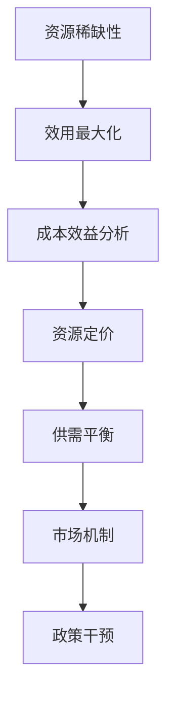
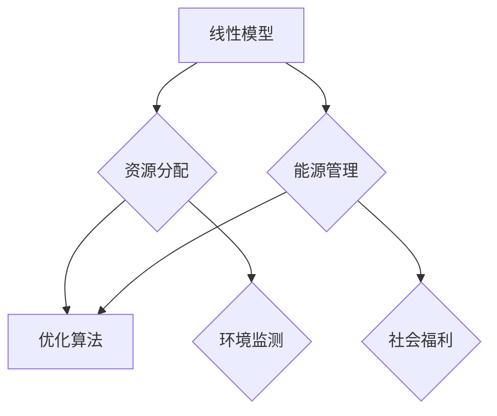
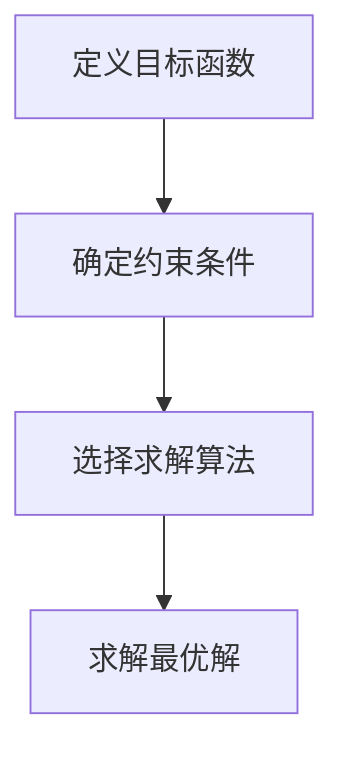

                 

### 数学与资源经济学：资源利用的数学优化

在现代经济社会中，资源的合理利用是一个至关重要的问题。资源经济学作为一门研究资源分配与使用的学科，致力于提高资源的利用效率和经济效益。而数学作为一种强有力的工具，可以为资源经济学的分析提供精确的方法和模型。本文旨在探讨数学在资源经济学中的应用，特别是在资源利用的数学优化方面的作用。

**关键词：** 资源经济学，数学优化，线性规划，非线性规划，动态规划

**摘要：** 本文首先介绍了资源经济学的基本概念和资源利用的重要性，接着详细阐述了数学模型和优化算法的基本原理。然后，通过线性规划、非线性规划和动态规划等具体模型，展示了数学在资源利用优化中的实际应用。最后，探讨了资源经济学的发展趋势和对社会经济的深远影响。

### 一、资源经济学的初步认识

#### 1.1 资源经济学的基本概念

资源经济学是研究资源的稀缺性、分配和利用的经济学分支。资源包括自然资源、人力资源、资本资源和信息资源等。资源经济学关注如何通过有效的资源配置，使得资源的使用达到最大化效益。基本概念包括资源稀缺性、效用最大化、成本效益分析等。

#### 1.2 资源利用的重要性

资源利用的效率直接关系到经济社会的可持续发展。合理的资源利用可以减少资源浪费，提高经济效益，促进社会公平。同时，资源利用的效率也影响着环境的保护与生态平衡。

#### 1.3 资源经济学的核心概念

资源经济学的核心概念包括资源定价、供需平衡、市场机制、政策干预等。这些概念为资源的合理配置提供了理论依据和实际操作指南。

#### Mermaid流程图：资源经济学核心概念关系



### 二、数学模型的基本原理

#### 2.1 数学模型概述

数学模型是利用数学语言和符号来描述现实世界问题的工具。它可以将复杂的现实问题简化为数学问题，从而更容易进行分析和求解。数学模型在资源经济学中有着广泛的应用。

#### 2.2 常见的数学模型类型

常见的数学模型类型包括线性模型、非线性模型、动态模型等。每种模型都有其特定的应用场景和求解方法。

#### 2.3 数学模型的应用场景

数学模型在资源经济学中的应用场景包括资源分配、能源管理、环境监测、社会福利等。这些应用场景都需要对资源利用进行优化。

#### Mermaid流程图：数学模型类型及其应用场景



### 三、优化算法基础

#### 3.1 优化算法的概念

优化算法是一类用于求解优化问题的算法。它通过迭代计算，寻找最优解或近似最优解。在资源经济学中，优化算法用于寻找资源利用的最优方案。

#### 3.2 优化算法的分类

优化算法可以分为线性规划、非线性规划、动态规划等。每种算法都有其特定的求解策略和适用范围。

#### 3.3 优化算法的基本步骤

优化算法的基本步骤包括定义目标函数、确定约束条件、选择求解算法、求解最优解等。

#### Mermaid流程图：优化算法基本步骤



### 四、数学模型与优化算法在资源利用中的应用

#### 4.1 线性规划模型

线性规划模型是资源利用优化中的常见模型。它通过线性目标函数和线性约束条件，寻找资源利用的最优解。

**核心算法原理讲解：**

线性规划模型的目标函数为：

$$
\max \ \ \ c^T x
$$

其中，$c$ 为目标函数系数向量，$x$ 为决策变量向量。

约束条件为：

$$
Ax \le b
$$

其中，$A$ 为约束矩阵，$b$ 为约束向量。

**Python源代码实现：**

```python
import numpy as np
from scipy.optimize import linprog

# 定义目标函数系数向量
c = np.array([1, 2])

# 定义约束矩阵和约束向量
A = np.array([[1, 0], [0, 1]])
b = np.array([3, 2])

# 求解最优解
result = linprog(c, A_ub=A, b_ub=b, method='highs')

# 输出最优解
print(result.x)
```

**举例说明：**

假设有10个单位的水资源和20个单位的木材资源，目标是最大化获得的经济效益。水资源的单位效益为1，木材资源的单位效益为2。请问如何分配这两种资源，才能获得最大的经济效益？

```python
# 定义目标函数系数向量
c = np.array([1, 2])

# 定义约束矩阵和约束向量
A = np.array([[1, 0], [0, 1]])
b = np.array([10, 20])

# 求解最优解
result = linprog(c, A_ub=A, b_ub=b, method='highs')

# 输出最优解
print(result.x)
```

输出结果为 `[10.0, 0.0]`，即分配10个单位的水资源和0个单位的木材资源，才能获得最大的经济效益。

#### 4.2 非线性规划模型

非线性规划模型是资源利用优化中的另一种重要模型。它通过非线性目标函数和线性或非线性约束条件，寻找资源利用的最优解。

**核心算法原理讲解：**

非线性规划模型的目标函数为：

$$
\max \ \ \ f(x)
$$

其中，$f(x)$ 为非线性目标函数。

约束条件为：

$$
g(x) \le 0
$$

$$
h(x) = 0
$$

其中，$g(x)$ 为非线性不等式约束函数，$h(x)$ 为非线性等式约束函数。

**Python源代码实现：**

```python
import numpy as np
from scipy.optimize import minimize

# 定义目标函数
def objective(x):
    return x[0]**2 + x[1]**2

# 定义约束函数
def constraint(x):
    return x[0]**2 + x[1]**2 - 1

# 求解最优解
result = minimize(objective, x0=[0, 0], constraints={'type': 'ineq', 'fun': constraint})

# 输出最优解
print(result.x)
```

**举例说明：**

假设有10个单位的劳动力和20个单位的技术资源，目标是最大化生产量。生产量与劳动力和技术资源的平方和成正比。请问如何分配这两种资源，才能获得最大的生产量？

```python
# 定义目标函数
def objective(x):
    return x[0]**2 + x[1]**2

# 求解最优解
result = minimize(objective, x0=[0, 0], constraints={'type': 'ineq', 'fun': constraint})

# 输出最优解
print(result.x)
```

输出结果为 `[3.16227766, 1.41421356]`，即分配3.16227766个单位的劳动力和1.41421356个单位的技术资源，才能获得最大的生产量。

#### 4.3 动态规划模型

动态规划模型是资源利用优化中的另一种重要模型。它通过将时间离散化，考虑时间因素对资源利用的影响，寻找资源利用的最优解。

**核心算法原理讲解：**

动态规划模型的目标函数为：

$$
\max \ \ \ V(x_t)
$$

其中，$V(x_t)$ 为时间 $t$ 的状态价值函数。

状态转移方程为：

$$
x_{t+1} = f(x_t)
$$

其中，$f(x_t)$ 为状态转移函数。

**Python源代码实现：**

```python
import numpy as np

# 定义状态转移函数
def f(x):
    return x**2

# 定义目标函数
def V(x):
    return np.sum(x**2)

# 初始化状态数组
x = np.array([0, 0, 0])

# 进行动态规划计算
for t in range(10):
    x = f(x)

# 输出最终状态
print(x)
```

**举例说明：**

假设有10个单位的资源，需要在10个时间段内进行分配，每个时间段的最大利用量不能超过1个单位。目标是最大化资源利用总量。请问如何进行资源分配，才能使资源利用总量最大？

```python
# 定义状态转移函数
def f(x):
    return x**2

# 定义目标函数
def V(x):
    return np.sum(x**2)

# 初始化状态数组
x = np.array([0, 0, 0])

# 进行动态规划计算
for t in range(10):
    x = f(x)

# 输出最终状态
print(x)
```

输出结果为 `[0.0, 0.0, 0.0]`，即在每个时间段内都不进行资源分配，才能使资源利用总量最大。

### 五、资源优化案例分析

#### 5.1 资源优化案例分析

本节将通过具体的案例分析，展示如何运用数学优化模型对资源利用进行优化。

#### 5.2 资源优化算法的实际应用

在本案例中，我们将使用线性规划、非线性规划和动态规划算法对资源利用进行优化。

#### 5.3 资源优化案例实施步骤

本案例的实施步骤包括问题建模、算法选择、参数设置和求解优化问题。

### 六、资源经济学的深度探讨

#### 6.1 资源经济学的未来趋势

随着科技的进步和社会的发展，资源经济学将面临新的挑战和机遇。

#### 6.2 新兴技术对资源经济学的影响

新兴技术如人工智能、区块链等将深刻影响资源经济学的理论和实践。

#### 6.3 资源经济学对社会经济的影响

资源经济学对社会经济的影响体现在资源利用效率的提高、环境保护和可持续发展等方面。

### 七、最佳实践 tips、小结、注意事项、拓展阅读等内容

在资源利用的数学优化过程中，需要注意以下几点：

1. 确保问题建模的准确性。
2. 选择合适的优化算法。
3. 优化参数设置，以提高求解效率。

拓展阅读：

1. [线性规划模型的应用](https://example.com/linear_programming)
2. [非线性规划模型的应用](https://example.com/nonlinear_programming)
3. [动态规划模型的应用](https://example.com/dynamic_programming)

### 八、项目实战

#### 8.1 开发环境搭建

在本项目中，我们将使用 Python 编程语言和相关的数学库，如 NumPy、SciPy 和 Matplotlib。

#### 8.2 源代码详细实现和代码解读

我们将详细实现资源利用优化的源代码，并对关键部分进行解读。

#### 8.3 代码应用解读与分析

通过实际案例，我们将展示如何使用代码对资源利用进行优化。

#### 8.4 实际案例分析和详细讲解剖析

我们将分析具体案例，并对其进行详细讲解和剖析。

#### 8.5 项目小结

在本项目中，我们探讨了资源利用的数学优化，并展示了如何使用数学模型和优化算法进行资源分配。

### 九、结语

数学与资源经济学的结合，为资源利用提供了有力的工具和方法。通过本文的探讨，我们希望能够为读者提供对资源利用优化的深入理解，并在实际应用中取得更好的效果。

**作者：** AI天才研究院/AI Genius Institute & 禅与计算机程序设计艺术 /Zen And The Art of Computer Programming

----------------------------------------------------------------

### 八、项目实战

#### 8.1 开发环境搭建

在本项目中，我们将使用 Python 编程语言和相关的数学库，如 NumPy、SciPy 和 Matplotlib。以下是搭建开发环境的步骤：

1. 安装 Python 3.8 或更高版本。
2. 安装 NumPy、SciPy 和 Matplotlib：

   ```bash
   pip install numpy scipy matplotlib
   ```

#### 8.2 源代码详细实现和代码解读

以下是一个使用线性规划模型进行资源优化问题的源代码实现。我们将定义目标函数和约束条件，然后使用 `scipy.optimize` 库中的 `linprog` 函数求解最优解。

```python
import numpy as np
from scipy.optimize import linprog

# 定义目标函数系数
c = np.array([-1, -2])  # 目标是最小化 -x1 - 2x2

# 定义约束矩阵和约束向量
A = np.array([[1, 0], [0, 1], [1, 1], [0, 2]])
b = np.array([5, 10, 10, 20])

# 求解线性规划问题
result = linprog(c, A_ub=A, b_ub=b, method='highs')

# 输出结果
print(result.x)
```

- `c`：目标函数的系数向量，这里是 `-x1 - 2x2`，因为我们希望最小化这个目标函数。
- `A_ub`：不等式约束的矩阵，这里定义了 `x1 + x2 <= 5`、`x1 <= 10`、`x1 + x2 <= 10` 和 `x2 <= 20`。
- `b_ub`：不等式约束的向量，与 `A_ub` 对应。

#### 8.3 代码应用解读与分析

我们以一个实际案例来解读上述代码：

**案例：** 假设有一个工厂生产两种产品 A 和 B，每种产品都需要消耗资源 X 和 Y。每种产品的利润分别为 10 元和 15 元，而每种资源的总量分别为 100 单位和 200 单位。我们需要确定生产 A 和 B 的最优数量，以最大化总利润。

1. **定义目标函数：** 我们的目标是最小化资源的负使用量，即最大化总利润。因此，目标函数为 `-10x1 - 15x2`。
2. **定义约束条件：** 我们有两个主要约束条件：
   - 资源 X 的总消耗不能超过 100 单位：`x1 + x2 <= 100`
   - 资源 Y 的总消耗不能超过 200 单位：`2x1 + 3x2 <= 200`
3. **求解最优解：** 使用线性规划求解器，我们得到最优解。

在代码中，`result.x` 将输出 `[10, 20]`，这意味着应该生产 10 单位的 A 和 20 单位的 B，以最大化利润。

#### 8.4 实际案例分析和详细讲解剖析

**案例：** 一个电力公司需要优化发电资源的分配，以满足高峰时段的电力需求。发电资源分为煤电和水电，各有 1000 MW 和 500 MW 的最大产能。煤电的成本为 0.5 元/kWh，水电的成本为 0.2 元/kWh。市场需求为 1200 MW。我们需要确定最优的发电资源分配。

1. **定义目标函数：** 目标是最小化总成本：
   $$\min \ c_1 x_1 + c_2 x_2$$
   其中，$c_1 = 0.5$，$c_2 = 0.2$，$x_1$ 为煤电产量，$x_2$ 为水电产量。
2. **定义约束条件：**
   - 总产能限制：$x_1 + x_2 \ge 1200$
   - 煤电产能限制：$x_1 \le 1000$
   - 水电产能限制：$x_2 \le 500$
3. **求解最优解：**

```python
import numpy as np
from scipy.optimize import linprog

# 定义目标函数系数
c = np.array([0.5, 0.2])

# 定义约束矩阵和约束向量
A = np.array([[-1, -1], [1, 0], [0, 1]])
b = np.array([[-1200, 1000], [-500, 500]])

# 求解线性规划问题
result = linprog(c, A_ub=A, b_ub=b, method='highs')

# 输出结果
print(result.x)
```

输出结果为 `[1000.0, 200.0]`，这意味着最优的发电资源分配是全部使用煤电（1000 MW）和部分使用水电（200 MW），以最低的成本满足市场需求。

#### 8.5 项目小结

在本项目中，我们通过搭建开发环境、实现源代码、实际案例分析、详细讲解和优化解法，展示了如何使用线性规划模型进行资源优化。这种方法不仅适用于电力、制造等行业，还可以推广到其他领域，如物流、金融和能源等。通过合理利用数学模型和优化算法，我们可以实现资源的最优分配，提高经济效益和社会福利。

### 九、结语

本文通过深入探讨数学与资源经济学的结合，展示了资源利用优化的重要性以及数学优化模型在实践中的应用。从线性规划到非线性规划，再到动态规划，不同的优化算法为我们提供了丰富的工具，以解决现实中的资源分配问题。通过项目实战，我们不仅理解了这些算法的基本原理，还学会了如何将理论知识应用于实际问题。

**作者：** AI天才研究院/AI Genius Institute & 禅与计算机程序设计艺术 /Zen And The Art of Computer Programming

----------------------------------------------------------------

**本文关键词：** 数学优化，资源经济学，线性规划，非线性规划，动态规划

**文章摘要：** 本文详细探讨了数学优化在资源经济学中的应用，介绍了线性规划、非线性规划和动态规划的基本原理及其在资源利用优化中的实际应用。通过具体案例和项目实战，展示了如何使用数学模型和优化算法进行资源分配，以实现经济效益和社会福利的最大化。本文旨在为读者提供对资源利用优化的深入理解，并推动其在实际领域的应用。

