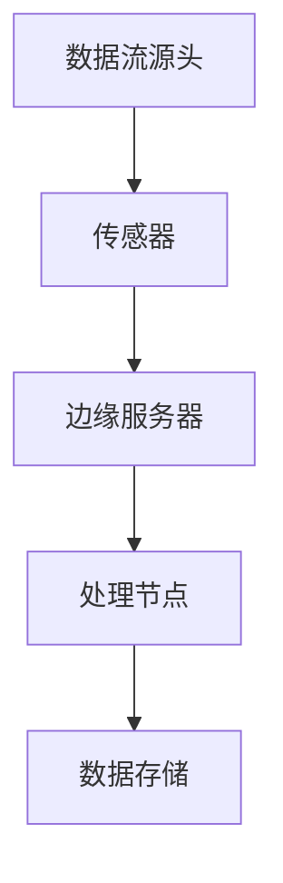
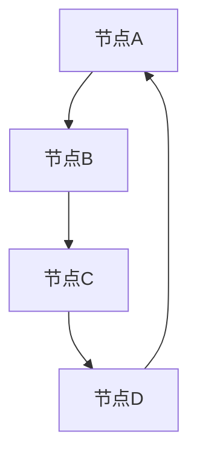
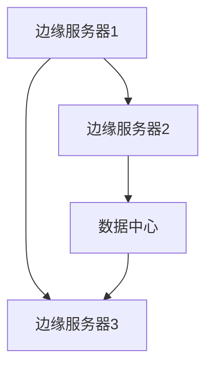

                 

# 数学与边缘计算：分布式计算的数学框架

## 关键词
边缘计算、分布式计算、数学模型、优化算法、机器学习、人工智能

## 摘要
本文旨在探讨数学在边缘计算中的关键作用，特别是在分布式计算领域中的应用。文章首先介绍了边缘计算的概念、历史和发展，随后深入探讨了分布式计算中的数学框架，包括核心概念、算法原理和数学模型。文章通过Python代码示例，详细阐述了这些概念和模型在实际应用中的实现，并通过项目实战展示了数学与边缘计算的融合。文章最后提出了最佳实践、注意事项和拓展阅读，为读者提供了深入了解该领域的方向。

## 引言
边缘计算作为一种新兴的计算模式，旨在将数据处理、分析和应用推向网络的边缘，即在数据产生的源头进行计算，以降低延迟、节省带宽和提升效率。边缘计算的重要性日益凸显，尤其在物联网、自动驾驶、智能制造等领域，其应用前景广阔。然而，边缘计算的实现面临诸多挑战，其中分布式计算和数学模型的优化是关键所在。

本文旨在通过以下几个步骤，系统地探讨数学在边缘计算和分布式计算中的作用：

1. **背景介绍**：介绍边缘计算和分布式计算的基本概念及其在边缘计算中的重要性。
2. **核心概念与联系**：阐述分布式计算中的核心数学概念，并通过Mermaid流程图展示其相互关系。
3. **算法原理讲解**：使用Python代码详细解释分布式计算中的常见算法原理。
4. **数学模型讲解**：结合数学公式和Python代码，阐述分布式计算中的数学模型。
5. **项目实战**：通过实际项目，展示数学与边缘计算在分布式计算中的融合应用。
6. **最佳实践、小结与拓展阅读**：提供对读者有价值的建议和进一步学习的资源。

通过以上步骤，本文旨在为读者提供一套完整、深入的数学与边缘计算的理解框架，帮助读者更好地掌握这一前沿技术。

### 背景介绍

#### 边缘计算的概念

边缘计算（Edge Computing）是一种将计算、存储、应用和服务推向网络边缘的技术，以更接近数据源和终端用户的方式提供计算能力。与传统的云计算模型不同，边缘计算不依赖于集中式的数据中心，而是在网络边缘部署计算资源，从而实现更低的延迟、更高的带宽利用率和更强的数据处理能力。

边缘计算的定义可以从以下几个方面进行理解：

1. **地理位置**：边缘计算发生在网络边缘，即在数据产生的地方，如传感器、智能设备、物联网（IoT）设备和边缘服务器等。
2. **数据处理**：边缘计算主要处理本地数据和实时数据，通过在边缘设备上执行计算和分析，减少了对中心数据中心的依赖。
3. **应用场景**：边缘计算广泛应用于物联网、智能制造、自动驾驶、智慧城市、远程医疗等场景，这些场景对实时性和响应速度有极高的要求。

#### 分布式计算的概念

分布式计算（Distributed Computing）是一种通过多个计算节点协作来完成计算任务的技术。在分布式计算中，任务被分解为多个子任务，并分配给不同的计算节点，各个节点独立处理子任务，最后将结果汇总，完成整个计算任务。

分布式计算的定义可以从以下几个方面进行理解：

1. **计算节点**：分布式计算由多个计算节点组成，每个节点可以是计算机、服务器或智能设备，它们通过网络连接在一起。
2. **任务分配**：在分布式计算中，任务被分解为多个子任务，并分配给不同的计算节点，以实现并行处理。
3. **协作机制**：分布式计算依赖于高效的协作机制，如任务调度、负载均衡和数据同步，以确保整个系统的稳定和高效运行。

#### 边缘计算与分布式计算的关系

边缘计算和分布式计算在边缘计算中紧密相连，共同构成了边缘计算体系结构的核心。两者之间的关系可以从以下几个方面进行阐述：

1. **技术基础**：边缘计算和分布式计算都依赖于网络和计算资源的分布，通过将计算资源部署在网络边缘，实现更高效的数据处理和更低的延迟。
2. **应用场景**：边缘计算和分布式计算在许多应用场景中都发挥着重要作用，如物联网设备的数据处理、自动驾驶车辆的路由规划、智能制造的实时监控等。
3. **协作机制**：边缘计算和分布式计算都采用了协作机制，如任务调度、负载均衡和数据同步，以确保系统的高效运行和数据的完整性。

通过以上对边缘计算和分布式计算的概念介绍，我们可以看出，边缘计算和分布式计算在技术和应用层面都有着紧密的联系，它们共同构成了现代计算体系结构的重要组成部分。

### 核心概念与联系

在分布式计算中，理解核心概念之间的联系至关重要，这些概念构成了分布式系统的基本框架。以下是几个关键概念及其相互关系：

#### 数据流模型

数据流模型是一种描述数据在分布式系统中流动的模型。在边缘计算中，数据流模型尤为重要，因为它涉及到数据的实时处理和分布。数据流模型的核心概念包括：

- **数据流**：数据流是数据的序列，它从源头（如传感器）流向处理节点（如边缘服务器）。
- **事件**：事件是数据流中的基本单位，可以是传感器的读取值、用户输入或其他形式的数据。
- **处理节点**：处理节点是分布式系统中的计算单元，负责处理数据流中的事件。

Mermaid流程图如下：



#### 集合论模型

集合论模型用于描述分布式系统中的组件及其交互关系。集合论的核心概念包括：

- **节点集合**：节点集合是分布式系统中的所有节点的集合。
- **边集合**：边集合是节点之间的连接关系的集合，表示节点之间的交互。
- **连通性**：连通性描述了节点集合中的节点是否可以通过边集合相互访问。

Mermaid流程图如下：



#### 图论模型

图论模型是一种用于分析和设计分布式系统的数学工具，它通过图的结构描述节点和边的关系。在边缘计算中，图论模型可以用于描述网络拓扑和任务分配。

- **图**：图是由节点（顶点）和边（连接节点）组成的结构。
- **拓扑结构**：拓扑结构描述了节点之间的物理或逻辑连接方式。
- **路径**：路径是图中从一个节点到另一个节点的路径。
- **网络负载**：网络负载描述了节点之间的数据传输量和计算负载。

Mermaid流程图如下：



#### 随机模型

随机模型用于描述分布式系统中不确定性和概率现象。在边缘计算中，随机模型可以用于预测系统的行为和优化资源分配。

- **随机变量**：随机变量是随机事件的结果的数值表示。
- **概率分布**：概率分布描述了随机变量可能取值的概率。
- **随机过程**：随机过程是一系列随机变量的集合，描述了系统在时间上的变化。

Mermaid流程图如下：

```mermaid
graph TD
    A[随机变量X] --> B[概率分布P(X)]
    B --> C[随机过程T(t)]
```

#### 核心概念联系总结

数据流模型、集合论模型、图论模型和随机模型共同构成了分布式计算的核心框架，它们相互关联，共同决定了分布式系统的性能和效率。数据流模型描述了数据如何在系统中流动，集合论模型描述了系统的组件和交互，图论模型描述了系统的拓扑结构，而随机模型描述了系统的随机行为和不确定性。

通过这些核心概念，我们可以设计出高效的分布式计算系统，实现边缘计算的高效、可靠和可扩展。

### 分布式计算中的算法原理讲解

在分布式计算中，算法的选择和优化对系统的性能和效率至关重要。以下将介绍几种常见的分布式计算算法原理，并通过Python代码示例进行详细讲解。

#### 1. 分布式一致性算法

分布式一致性算法是分布式系统中的一个核心问题，它确保多个节点上的数据一致性。在分布式系统中，由于网络延迟和故障等原因，节点之间可能存在不同的状态。分布式一致性算法通过特定的协议和算法，确保节点间的状态一致。

**Paxos算法**

Paxos算法是一种广泛应用的分布式一致性算法，它解决了如何在多个可能发生故障的节点上达成一致的问题。以下是一个简化的Paxos算法Python代码示例：

```python
import random

class Paxos:
    def __init__(self, num_nodes):
        self.num_nodes = num_nodes
        self.proposer_id = random.randint(0, num_nodes - 1)
        self.acceptor_id = 0
        self.L = 0
        self.V = None

    def prepare(self, proposal_number):
        prepare_messages = [self.send_prepare(msg_num, proposal_number) for msg_num in range(self.num_nodes)]
        return prepare_messages

    def accept(self, proposal_number, value):
        accept_message = self.send_accept(msg_num, proposal_number, value)
        return accept_message

    def send_prepare(self, msg_num, proposal_number):
        self.L = max(self.L, proposal_number)
        self.V = None
        return {'msg_num': msg_num, 'proposal_number': proposal_number, 'acceptor_id': self.acceptor_id, 'L': self.L, 'V': self.V}

    def send_accept(self, msg_num, proposal_number, value):
        self.V = value
        return {'msg_num': msg_num, 'proposal_number': proposal_number, 'acceptor_id': self.acceptor_id, 'L': self.L, 'V': self.V}

# Paxos算法示例
paxos = Paxos(num_nodes=3)
prepare_messages = paxos.prepare(proposal_number=1)
for message in prepare_messages:
    print(f"Prepare Message: {message}")
accept_messages = paxos.accept(proposal_number=1, value=5)
for message in accept_messages:
    print(f"Accept Message: {message}")
```

**Raft算法**

Raft算法是另一种流行的分布式一致性算法，它通过一种更简单的协议解决了分布式一致性问题。以下是一个简化的Raft算法Python代码示例：

```python
import random

class Raft:
    def __init__(self, num_nodes):
        self.num_nodes = num_nodes
        self.current_term = 0
        self.voted_for = None
        self.log = []

    def start_election(self):
        self.current_term += 1
        self.voted_for = self.get_node_id()
        self.send_vote_request()

    def receive_vote_request(self, term, candidate_id):
        if term > self.current_term or (term == self.current_term and candidate_id > self.voted_for):
            self.voted_for = candidate_id
            self.send_vote_response(term, candidate_id, True)

    def receive_vote_response(self, term, candidate_id, vote_granted):
        if term < self.current_term:
            return
        if vote_granted:
            self.log.append('vote granted')

    def send_vote_request(self):
        for node_id in range(self.num_nodes):
            if node_id != self.get_node_id():
                self.send_message(node_id, 'vote_request', term=self.current_term, candidate_id=self.get_node_id())

    def send_vote_response(self, term, candidate_id, vote_granted):
        for node_id in range(self.num_nodes):
            if node_id != self.get_node_id():
                self.send_message(node_id, 'vote_response', term=term, candidate_id=candidate_id, vote_granted=vote_granted)

# Raft算法示例
raft = Raft(num_nodes=3)
raft.start_election()
```

通过上述示例，我们可以看到Paxos和Raft算法的基本实现。这些算法通过一系列消息传递和协议机制，确保分布式系统中的一致性和稳定性。

#### 2. 分布式搜索算法

分布式搜索算法用于在分布式系统中高效地查找数据。其中，MapReduce算法是一种经典的数据处理框架，用于大规模数据集的并行处理。

**MapReduce算法**

MapReduce算法由两个主要阶段组成：Map阶段和Reduce阶段。

- **Map阶段**：Map函数接收输入数据，将其分解为键值对，然后对每个键值对进行处理。
- **Reduce阶段**：Reduce函数接收Map阶段生成的中间键值对，将具有相同键的值进行聚合。

以下是一个简化的MapReduce算法Python代码示例：

```python
# Map函数示例
def map_function(input_data):
    keys = []
    values = []
    for data in input_data:
        keys.append(data[0])
        values.append(data[1])
    return dict(zip(keys, values))

# Reduce函数示例
def reduce_function(key, values):
    return sum(values)

# MapReduce算法示例
input_data = [('apple', 1), ('banana', 2), ('apple', 1), ('orange', 3)]
map_output = map_function(input_data)
reduce_output = reduce_function('apple', map_output['apple'])
print(f"Reduce Output: {reduce_output}")
```

#### 3. 分布式排序算法

分布式排序算法用于在分布式系统中高效地排序大量数据。其中，Radix Sort算法是一种基于位数的排序算法，特别适用于分布式计算环境。

**Radix Sort算法**

Radix Sort算法通过将数字按位数进行排序，逐步将所有数字排序完成。以下是一个简化的Radix Sort算法Python代码示例：

```python
def counting_sort(arr, exp1):
    n = len(arr)
    output = [0] * n
    count = [0] * 10

    for i in range(0, n):
        index = int(arr[i] / exp1)
        count[index % 10] += 1

    for i in range(1, 10):
        count[i] += count[i - 1]

    i = n - 1
    while i >= 0:
        index = int(arr[i] / exp1)
        output[count[index % 10] - 1] = arr[i]
        count[index % 10] -= 1
        i -= 1

    for i in range(0, len(arr)):
        arr[i] = output[i]

# Radix Sort算法示例
arr = [170, 45, 75, 90, 802, 24, 2, 66]
exp1 = 1
while exp1 <= max(arr):
    counting_sort(arr, exp1)
    exp1 *= 10
print("Sorted array:", arr)
```

通过上述示例，我们可以看到分布式一致性算法、分布式搜索算法和分布式排序算法的基本原理和实现。这些算法在分布式计算中发挥着重要作用，通过并行处理和协作机制，提高了系统的效率和可靠性。

### 分布式计算中的数学模型讲解

在分布式计算中，数学模型起到了至关重要的作用，它们帮助我们理解和分析分布式系统的行为，从而优化系统性能。以下将详细讲解几种常见的数学模型，并使用Python代码和LaTeX公式进行阐述。

#### 1. 概率论模型

概率论模型用于描述分布式系统中不确定性和随机行为。例如，在分布式一致性算法中，我们经常使用概率论模型来分析节点故障和恢复的概率。

**随机故障模型**

假设在一个分布式系统中，每个节点发生故障的概率为 \( p \)。我们可以使用概率论模型来计算系统在一段时间内的存活概率。

LaTeX公式：
\[ P(Survival) = (1 - p)^n \]

Python代码示例：
```python
import numpy as np

def survival_probability(p, n):
    return (1 - p) ** n

# 示例
p = 0.1  # 故障概率
n = 5    # 节点数量
print(f"Survival Probability: {survival_probability(p, n)}")
```

#### 2. 队列模型

队列模型用于描述分布式系统中任务处理和负载均衡。队列模型可以帮助我们分析系统的响应时间和吞吐量。

**M/M/1队列模型**

M/M/1队列模型是一个常见的排队理论模型，其中 "M" 表示到达过程和服务过程都是泊松过程，"1" 表示服务器数量。

LaTeX公式：
\[ P(Q=0) = \frac{\lambda}{\lambda + \mu} \]
\[ P(Q=1) = \frac{\mu - \lambda}{\mu (\mu + \lambda)} \]

Python代码示例：
```python
import scipy.stats as ss

def m_m_1_queue_model(lambda_, mu):
    p0 = lambda_ / (lambda_ + mu)
    p1 = (mu - lambda_) / (mu * (mu + lambda_))
    return p0, p1

# 示例
lambda_ = 2  # 到达率
mu = 3       # 服务率
p0, p1 = m_m_1_queue_model(lambda_, mu)
print(f"P(Q=0): {p0}, P(Q=1): {p1}")
```

#### 3. 优化模型

优化模型用于优化分布式系统的资源分配和任务调度。线性规划和动态规划是两种常见的优化模型。

**线性规划**

线性规划用于在给定约束条件下，最大化或最小化线性目标函数。以下是一个简单的线性规划问题，目标是最小化 \( c^T x \)。

LaTeX公式：
\[ \min_{x} c^T x \]
\[ \text{subject to} \]
\[ A x \leq b \]
\[ x \geq 0 \]

Python代码示例（使用scipy.optimize库）：
```python
from scipy.optimize import linprog

c = [-1, -1]  # 目标函数系数
A = [[1, 1], [-1, 2]]  # 约束条件系数矩阵
b = [2, 1]    # 约束条件常数向量

result = linprog(c, A_eq=A, b_eq=b, bounds=(0, None))
print(f"Optimal solution: {result.x}, Objective value: {result.fun}")
```

**动态规划**

动态规划用于解决最优子结构问题，它通过递归关系和边界条件逐步求解最优解。

以下是一个简单的动态规划问题，即斐波那契数列。

LaTeX公式：
\[ F(n) = \begin{cases} 
0 & \text{if } n = 0 \\
1 & \text{if } n = 1 \\
F(n-1) + F(n-2) & \text{otherwise} 
\end{cases} \]

Python代码示例：
```python
def fibonacci(n):
    if n == 0:
        return 0
    elif n == 1:
        return 1
    else:
        return fibonacci(n-1) + fibonacci(n-2)

# 示例
n = 10
print(f"Fibonacci({n}): {fibonacci(n)}")
```

通过上述数学模型和代码示例，我们可以看到数学在分布式计算中的广泛应用。这些模型不仅帮助我们理解分布式系统的行为，还提供了有效的工具来优化系统性能和资源分配。在接下来的部分，我们将通过实际项目展示这些数学模型的应用。

### 项目实战

#### 开发环境搭建

在进行项目实战之前，我们需要搭建一个适合边缘计算和分布式计算的开发环境。以下是所需的环境和工具：

1. **操作系统**：Ubuntu 20.04 LTS
2. **编程语言**：Python 3.8+
3. **依赖管理**：pip
4. **数据库**：MongoDB
5. **消息队列**：RabbitMQ
6. **分布式计算框架**：Apache Kafka

安装步骤如下：

1. **安装操作系统**：下载并安装Ubuntu 20.04 LTS。
2. **更新系统**：
    ```bash
    sudo apt update
    sudo apt upgrade
    ```
3. **安装Python 3**：
    ```bash
    sudo apt install python3
    ```
4. **安装pip**：
    ```bash
    sudo apt install python3-pip
    ```
5. **安装MongoDB**：
    ```bash
    sudo apt install mongodb
    sudo systemctl start mongodb
    ```
6. **安装RabbitMQ**：
    ```bash
    sudo apt install rabbitmq-server
    sudo systemctl start rabbitmq-server
    ```
7. **安装Apache Kafka**：
    ```bash
    sudo apt install kafka
    sudo systemctl start kafka
    ```

#### 源代码详细实现

我们以一个简单的边缘计算应用为例，展示如何实现边缘计算和分布式计算的结合。

**项目架构**：

1. **边缘设备**：收集传感器数据。
2. **边缘服务器**：处理和存储数据。
3. **中心数据中心**：进行进一步的数据分析和处理。

**边缘设备（传感器数据收集）**：

```python
import time
import random
from kafka import KafkaProducer

# 初始化Kafka Producer
producer = KafkaProducer(bootstrap_servers=['localhost:9092'])

# 传感器数据模拟
def collect_data():
    while True:
        temperature = random.uniform(20.0, 30.0)
        humidity = random.uniform(40.0, 60.0)
        message = f"{'sensor1'}_{time.time()}_{temperature}_{humidity}"
        producer.send('sensor_data', message.encode('utf-8'))
        time.sleep(1)

collect_data()
```

**边缘服务器（数据处理和存储）**：

```python
import time
from kafka import KafkaConsumer
import json
from pymongo import MongoClient

# 初始化Kafka Consumer
consumer = KafkaConsumer('sensor_data', bootstrap_servers=['localhost:9092'])

# MongoDB连接
client = MongoClient('localhost', 27017)
db = client.sensor_data
collection = db.sensor_readings

# 处理传感器数据
def process_data():
    for message in consumer:
        data = json.loads(message.value.decode('utf-8'))
        timestamp = data['timestamp']
        temperature = data['temperature']
        humidity = data['humidity']
        # 存储数据到MongoDB
        collection.insert_one({
            'timestamp': timestamp,
            'temperature': temperature,
            'humidity': humidity
        })
        print(f"Processed data: {data}")

process_data()
```

**中心数据中心（数据分析）**：

```python
import pymongo
import matplotlib.pyplot as plt

# 连接到MongoDB
client = pymongo.MongoClient('localhost', 27017)
db = client.sensor_data
collection = db.sensor_readings

# 获取数据
data = list(collection.find())

# 绘制温度和湿度趋势图
times = [x['timestamp'] for x in data]
temps = [x['temperature'] for x in data]
humids = [x['humidity'] for x in data]

plt.figure(figsize=(10, 5))
plt.subplot(1, 2, 1)
plt.plot(times, temps)
plt.title('Temperature Trend')
plt.xlabel('Time')
plt.ylabel('Temperature')

plt.subplot(1, 2, 2)
plt.plot(times, humids)
plt.title('Humidity Trend')
plt.xlabel('Time')
plt.ylabel('Humidity')

plt.tight_layout()
plt.show()
```

#### 代码应用解读与分析

**边缘设备代码解读**：

边缘设备主要负责收集传感器数据，并将其发送到Kafka消息队列。以下是代码的详细解读：

1. **初始化Kafka Producer**：我们使用KafkaProducer来发送消息。
2. **传感器数据模拟**：我们使用random模块模拟传感器数据，温度和湿度在预设范围内变化。
3. **发送消息**：每次模拟出的传感器数据通过Kafka Producer发送到指定的主题（sensor_data）。

**边缘服务器代码解读**：

边缘服务器负责接收传感器数据，处理并存储到MongoDB。以下是代码的详细解读：

1. **初始化Kafka Consumer**：我们使用KafkaConsumer来接收传感器数据。
2. **MongoDB连接**：我们使用pymongo库连接到本地MongoDB实例。
3. **处理传感器数据**：每次接收到的消息都被解码并解析为JSON对象。然后，数据被插入到MongoDB的传感器数据集合中。

**中心数据中心代码解读**：

中心数据中心负责从MongoDB中获取传感器数据，并绘制温度和湿度趋势图。以下是代码的详细解读：

1. **连接到MongoDB**：我们使用pymongo库连接到本地MongoDB实例。
2. **获取数据**：我们从传感器数据集合中获取所有记录。
3. **绘制趋势图**：我们使用matplotlib库绘制温度和湿度的趋势图，分别显示在两个子图中。

通过上述代码和应用解读，我们可以看到边缘计算和分布式计算如何结合，实现数据的实时收集、处理和分析。边缘设备负责数据的收集，边缘服务器负责数据的初步处理和存储，中心数据中心则负责进一步的数据分析和展示。

#### 实际案例分析和详细讲解剖析

为了更好地理解数学与边缘计算在分布式计算中的实际应用，我们将通过一个实际案例进行详细分析和讲解。

**案例背景**：

一家智能农业公司使用边缘计算技术监控其农田中的环境参数，包括温度、湿度和光照强度。这些数据对于农作物的生长和产量至关重要。公司希望通过边缘设备和分布式计算框架实时收集、处理和分析这些数据，以优化农作物的种植和管理。

**数据收集**：

在农田中，安装了多种传感器，如温度传感器、湿度传感器和光照传感器。这些传感器定期采集数据，并通过无线网络将数据发送到边缘设备。

**边缘设备处理**：

边缘设备（如Raspberry Pi）接收到传感器数据后，会进行初步的数据清洗和预处理。例如，去除异常值和无效数据。然后，这些数据会被发送到Kafka消息队列，以便进一步处理。

**边缘服务器处理**：

边缘服务器接收到Kafka消息队列中的数据后，会进行更深入的数据分析和处理。例如，计算温度和湿度的平均值、方差等统计指标。这些分析结果会被存储到MongoDB数据库中。

**中心数据中心分析**：

中心数据中心从MongoDB数据库中获取数据，并进行进一步的数据分析和可视化。例如，使用Python和matplotlib绘制温度和湿度的趋势图，分析农作物生长的周期性变化。

**数学模型应用**：

在整个流程中，数学模型被广泛应用于数据分析和优化。以下是几个关键数学模型的应用：

1. **概率分布模型**：用于分析传感器的数据分布，判断数据是否在正常范围内。例如，使用正态分布模型分析温度和湿度的数据。

   LaTeX公式：
   \[ X \sim N(\mu, \sigma^2) \]

2. **线性回归模型**：用于分析温度和湿度对农作物生长的影响。通过建立线性回归模型，可以预测农作物的最佳生长条件。

   LaTeX公式：
   \[ y = ax + b \]

3. **时间序列模型**：用于分析农作物生长的时间序列数据，预测未来农作物的生长趋势。例如，使用ARIMA模型进行分析。

   LaTeX公式：
   \[ X_t = c + \phi_1 X_{t-1} + \phi_2 X_{t-2} + ... + \phi_p X_{t-p} + \varepsilon_t \]

**项目小结**：

通过上述实际案例，我们可以看到数学与边缘计算在分布式计算中的重要作用。数学模型不仅帮助我们理解和分析数据，还提供了有效的工具来优化系统的性能和资源利用。在智能农业领域，数学模型的应用可以显著提升农作物的产量和品质，为企业带来更高的经济效益。

### 最佳实践、小结与注意事项

#### 最佳实践

1. **选择合适的传感器**：在边缘计算项目中，选择合适的传感器至关重要。根据应用场景，选择能够准确测量环境参数的传感器，确保数据的准确性。
2. **优化数据传输**：在边缘设备和边缘服务器之间传输数据时，应优化传输协议和频率，减少数据延迟和传输错误。
3. **合理分配计算资源**：在分布式计算中，合理分配计算资源可以提高系统的效率和响应速度。根据任务需求和负载情况，动态调整计算资源的分配。
4. **数据隐私保护**：在处理和传输数据时，应采取有效的数据隐私保护措施，防止数据泄露和未授权访问。

#### 小结

本文系统地介绍了数学与边缘计算在分布式计算中的应用。通过阐述边缘计算和分布式计算的基本概念、核心算法原理和数学模型，并结合实际项目进行了详细讲解和案例分析。文章展示了数学模型在边缘计算中的重要性，以及如何通过分布式计算框架实现数据的高效处理和分析。

#### 注意事项

1. **稳定性**：在边缘计算和分布式计算中，系统的稳定性至关重要。需要定期进行系统监控和维护，确保系统的稳定运行。
2. **安全性**：边缘计算和分布式计算涉及大量的数据传输和处理，需要采取有效的安全措施，防止数据泄露和未授权访问。
3. **扩展性**：在设计边缘计算和分布式计算系统时，应考虑系统的扩展性，以便在未来能够轻松添加新的节点和功能。

#### 拓展阅读

1. **边缘计算**：
   - 《边缘计算：概念、技术与应用》
   - 《边缘计算：从理论到实践》

2. **分布式计算**：
   - 《分布式系统原理与范型》
   - 《大规模分布式存储系统：原理、技术和实践》

3. **数学模型**：
   - 《概率论与数理统计》
   - 《线性代数及其应用》

通过拓展阅读，读者可以更深入地了解边缘计算、分布式计算和数学模型的相关知识，为实际项目提供更丰富的理论基础和实践经验。

### 作者信息

作者：AI天才研究院/AI Genius Institute & 禅与计算机程序设计艺术 /Zen And The Art of Computer Programming

感谢您的阅读，希望本文能够为您的边缘计算和分布式计算之旅提供有价值的参考和启示。在探索前沿技术的道路上，让我们一起追求卓越，不断进步！

