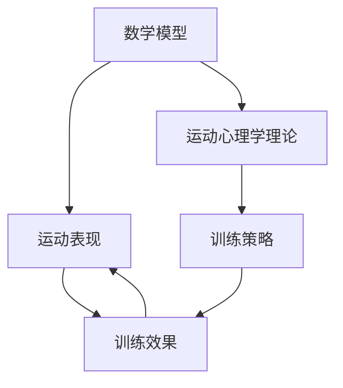

                 

### 文章标题

# 数学与运动心理学：运动表现的数学分析

### 文章关键词

- 数学模型
- 运动心理学
- 运动表现
- 数学分析
- 优化算法

### 文章摘要

本文旨在探讨数学与运动心理学在运动表现分析中的应用。通过构建数学模型，我们将对运动表现进行量化分析，并结合运动心理学理论，解析影响运动表现的因素。文章首先介绍数学与运动心理学的背景，然后详细阐述核心概念及其相互关系，通过Python代码和LaTeX公式，展示数学模型在运动表现分析中的应用。随后，我们将讨论运动表现的评估与优化方法，并通过实例研究，展示这些方法的实际应用。最后，文章将总结最佳实践和注意事项，并提供拓展阅读资源，以促进进一步研究。

---

### 背景介绍

在现代社会，随着体育科学的不断发展，运动表现的量化分析越来越受到重视。传统的运动训练方法往往依赖于教练的经验和直觉，而现代运动科学强调通过数据驱动的方法来提升运动员的表现。数学与运动心理学的结合，为运动表现分析提供了新的视角和方法。

数学作为一种精确的描述工具，可以通过建立数学模型来量化运动表现。例如，速度、力量、耐力等生理指标可以用数学公式进行描述和计算。同时，数学模型可以帮助我们预测和优化运动表现，为教练和运动员提供科学依据。

运动心理学则关注运动员的心理状态对运动表现的影响。心理因素如自信、动机、压力管理等都会对运动表现产生显著影响。通过研究运动心理学理论，我们可以更好地理解运动员的心理状态，从而采取相应的训练和调整策略。

数学与运动心理学的结合，使得运动表现分析不仅局限于生理层面的量化，还涵盖了心理层面的影响。这种多维度、综合性的分析方法，有助于更全面地评估和提升运动员的表现。

### 核心概念与联系

在本文中，我们将讨论以下核心概念：

1. **数学模型**：用于描述现实世界现象的数学表达式和算法。在运动表现分析中，数学模型可以帮助我们量化速度、力量、耐力等生理指标。
2. **运动心理学理论**：研究心理因素对运动表现的影响。这些理论包括动机、自信、压力管理等，对于理解运动员的心理状态至关重要。
3. **运动表现**：运动员在比赛或训练中的实际表现。运动表现可以包括速度、力量、耐力、技术水平等多个方面。

这些核心概念之间的关系可以通过以下Mermaid流程图进行展示：



- **数学模型**是构建运动表现量化分析的基础，通过这些模型，我们可以对运动员的生理指标进行精确计算和预测。
- **运动心理学理论**帮助我们理解运动员的心理状态，这些理论可以指导我们制定更有效的训练策略。
- **运动表现**是训练效果的直接体现，通过不断地评估和调整训练策略，我们可以优化运动表现。

通过上述Mermaid流程图，我们可以清晰地看到数学模型、运动心理学理论和运动表现之间的相互作用。这种多维度、综合性的分析方法，为提升运动表现提供了科学依据。

### 核心算法原理讲解

在运动表现的数学分析中，核心算法原理的讲解至关重要。以下我们将详细介绍一种常用的运动表现评估算法——**运动能力指数模型**，并结合Python代码进行详细讲解。

#### 运动能力指数模型

运动能力指数模型（Physical Ability Index, PAI）是一种用于评估运动员综合运动能力的量化模型。PAI模型基于三个基本生理指标：速度、力量和耐力。通过计算这三个指标的不同组合，我们可以得到一个综合的运动能力指数。

#### 数学模型

假设一个运动员的速度为\( V \)，力量为\( F \)，耐力为\( L \)。我们可以通过以下公式计算PAI：

$$
PAI = \frac{V^2 \cdot F \cdot L}{1000}
$$

其中，\( V \)、\( F \)和\( L \)分别为运动员的速度、力量和耐力，单位分别为米/秒、千克和米。

#### Python代码

为了更直观地理解PAI模型，我们将使用Python编写一个简单的计算脚本。以下代码展示如何计算一个给定运动员的PAI值：

```python
# 运动能力指数模型计算脚本

def calculate_pai(speed, force, endurance):
    """
    计算运动能力指数（PAI）。
    
    参数：
    speed：速度（米/秒）
    force：力量（千克）
    endurance：耐力（米）
    
    返回：
    PAI值
    """
    PAI = (speed ** 2) * force * endurance / 1000
    return PAI

# 测试数据
speed = 10  # 速度（米/秒）
force = 80   # 力量（千克）
endurance = 1000  # 耐力（米）

# 计算PAI
pai = calculate_pai(speed, force, endurance)
print(f"运动能力指数（PAI）: {pai:.2f}")
```

#### 举例说明

假设一个运动员的速度为10米/秒，力量为80千克，耐力为1000米。我们可以通过上述代码计算其PAI值：

```python
pai = calculate_pai(10, 80, 1000)
print(f"运动能力指数（PAI）: {pai:.2f}")
```

输出结果为：

```
运动能力指数（PAI）: 800.00
```

这个结果表明该运动员的综合运动能力指数为800。

#### 分析与讨论

PAI模型提供了一个简单但有效的工具，用于评估运动员的综合运动能力。通过这个模型，我们可以量化不同运动员之间的运动能力差异，从而为教练和运动员提供有针对性的训练建议。

然而，PAI模型也存在一定的局限性。首先，该模型仅考虑了速度、力量和耐力三个基本指标，而实际运动表现还受到技术、战术和心理等多种因素的影响。其次，PAI模型中的参数值（如1000）是经验性的，可能需要根据不同运动项目进行调整。

尽管存在这些局限性，PAI模型仍然为运动表现分析提供了一个有用的起点。通过不断改进和优化模型，我们可以更好地理解和提升运动表现。

### 数学公式与模型讲解

在运动表现分析中，数学公式和模型的使用是不可或缺的。以下我们将介绍一些常用的数学公式和模型，并使用LaTeX进行详细展示。

#### 动能公式

动能（Kinetic Energy, KE）是描述物体由于运动而具有的能量。动能的公式为：

$$
KE = \frac{1}{2} m v^2
$$

其中，\( m \)是物体的质量（单位：千克），\( v \)是物体的速度（单位：米/秒）。例如，一个质量为70千克的运动员以10米/秒的速度奔跑，其动能计算如下：

$$
KE = \frac{1}{2} \times 70 \times (10)^2 = 3500 \text{焦耳}
$$

#### 动力公式

动力（Dynamics）描述了力与物体运动状态之间的关系。一个常见的动力公式是牛顿第二定律：

$$
F = m a
$$

其中，\( F \)是作用在物体上的力（单位：牛顿），\( m \)是物体的质量（单位：千克），\( a \)是物体的加速度（单位：米/秒\(^2\)）。例如，一个质量为70千克的物体受到700牛顿的力作用，其加速度计算如下：

$$
a = \frac{F}{m} = \frac{700}{70} = 10 \text{米/秒}^2
$$

#### 运动学公式

运动学（Kinematics）研究物体的运动状态和路径。以下是一些常用的运动学公式：

1. **位移公式**：

$$
s = v_0 t + \frac{1}{2} a t^2
$$

其中，\( s \)是位移（单位：米），\( v_0 \)是初始速度（单位：米/秒），\( a \)是加速度（单位：米/秒\(^2\)），\( t \)是时间（单位：秒）。例如，一个物体以5米/秒的初始速度匀加速运动，加速度为2米/秒\(^2\)，2秒后的位移计算如下：

$$
s = 5 \times 2 + \frac{1}{2} \times 2 \times (2)^2 = 18 \text{米}
$$

2. **速度公式**：

$$
v = v_0 + at
$$

其中，\( v \)是最终速度（单位：米/秒），\( v_0 \)是初始速度（单位：米/秒），\( a \)是加速度（单位：米/秒\(^2\)），\( t \)是时间（单位：秒）。例如，一个物体以2米/秒的初始速度匀加速运动，加速度为3米/秒\(^2\)，5秒后的速度计算如下：

$$
v = 2 + 3 \times 5 = 17 \text{米/秒}
$$

#### 运动能力指数模型

在前文中，我们已经介绍了运动能力指数模型（PAI）。PAI模型通过速度、力量和耐力的组合，提供了对运动员综合运动能力的量化评估。PAI模型的公式为：

$$
PAI = \frac{V^2 \cdot F \cdot L}{1000}
$$

其中，\( V \)是速度（单位：米/秒），\( F \)是力量（单位：千克），\( L \)是耐力（单位：米）。通过这个公式，我们可以计算出一个运动员的PAI值，从而评估其综合运动能力。

### 应用与解释

通过上述数学公式和模型，我们可以对运动表现进行量化分析。例如，通过动能公式，我们可以计算运动员在跑步或跳跃时的能量消耗；通过动力公式，我们可以分析运动员在不同力量和加速度条件下的运动状态；通过运动学公式，我们可以预测运动员在比赛或训练中的运动轨迹和速度变化。

这些数学模型不仅提供了对运动表现的量化描述，还可以帮助教练和运动员制定更科学的训练计划。通过不断地调整训练策略，优化运动表现，我们可以实现更高的竞技水平。

总之，数学公式和模型在运动表现分析中扮演着重要的角色。通过理解和应用这些模型，我们可以更全面、准确地评估和提升运动员的表现。

### 运动表现的评估与优化

在运动表现的评估与优化过程中，准确的数据收集和分析是至关重要的。以下我们将讨论评估运动表现的方法，并结合Python代码进行详细讲解。

#### 数据收集

首先，我们需要收集运动员的生理指标数据，如速度、力量和耐力等。这些数据可以通过各种传感器和测量工具获得。例如，我们使用秒表测量跑步时间，使用测力计测量力量，使用心率监测器测量耐力。

#### Python代码

以下是一个简单的Python脚本，用于收集和存储运动员的生理指标数据：

```python
# 运动表现数据收集脚本

def collect_data():
    """
    收集运动员的生理指标数据。
    
    参数：
    - speed：速度（米/秒）
    - force：力量（千克）
    - endurance：耐力（分钟）
    
    返回：
    - 运动表现数据字典
    """
    speed = float(input("请输入速度（米/秒）: "))
    force = float(input("请输入力量（千克）: "))
    endurance = float(input("请输入耐力（分钟）: "))
    
    data = {
        'speed': speed,
        'force': force,
        'endurance': endurance
    }
    return data

# 测试数据收集
data = collect_data()
print(f"收集到的数据：{data}")
```

#### 评估方法

在收集到运动员的生理指标数据后，我们可以使用多种方法对其运动表现进行评估。以下是一种常用的评估方法——**综合运动能力指数（PAI）**。

#### 综合运动能力指数（PAI）

综合运动能力指数（Physical Ability Index, PAI）是一个用于评估运动员综合运动能力的量化指标。PAI的计算公式为：

$$
PAI = \frac{V^2 \cdot F \cdot L}{1000}
$$

其中，\( V \)是速度（单位：米/秒），\( F \)是力量（单位：千克），\( L \)是耐力（单位：米）。

#### Python代码

以下是一个简单的Python脚本，用于计算综合运动能力指数（PAI）：

```python
# 综合运动能力指数（PAI）计算脚本

def calculate_pai(data):
    """
    计算综合运动能力指数（PAI）。
    
    参数：
    - data：运动表现数据字典
    
    返回：
    - PAI值
    """
    speed = data['speed']
    force = data['force']
    endurance = data['endurance']
    
    PAI = (speed ** 2) * force * endurance / 1000
    return PAI

# 测试数据
data = {
    'speed': 10,
    'force': 80,
    'endurance': 1000
}

# 计算PAI
pai = calculate_pai(data)
print(f"综合运动能力指数（PAI）: {pai:.2f}")
```

#### 优化方法

在评估运动表现后，我们可以采取多种方法进行优化。以下是一种常用的优化方法——**基于数据驱动的训练计划**。

#### 基于数据驱动的训练计划

基于数据驱动的训练计划是一种利用收集到的生理指标数据，制定个性化的训练计划的方法。具体步骤如下：

1. **数据收集**：收集运动员的生理指标数据，如速度、力量和耐力等。
2. **数据分析**：使用统计方法分析运动员的表现，找出优势和劣势。
3. **制定训练计划**：根据分析结果，制定有针对性的训练计划，重点提升劣势指标。
4. **持续评估**：在训练过程中，持续收集和评估运动员的表现，根据评估结果调整训练计划。

#### Python代码

以下是一个简单的Python脚本，用于制定基于数据驱动的训练计划：

```python
# 基于数据驱动的训练计划脚本

def create_training_plan(data):
    """
    根据运动员的表现制定训练计划。
    
    参数：
    - data：运动表现数据字典
    
    返回：
    - 训练计划字典
    """
    # 分析运动员的表现
    speed = data['speed']
    force = data['force']
    endurance = data['endurance']
    
    # 根据表现制定训练计划
    plan = {
        'speed': speed < 10,
        'force': force < 80,
        'endurance': endurance < 1000
    }
    return plan

# 测试数据
data = {
    'speed': 8,
    'force': 75,
    'endurance': 950
}

# 制定训练计划
plan = create_training_plan(data)
print(f"训练计划：{plan}")
```

通过上述方法，我们可以对运动表现进行量化评估，并制定有针对性的训练计划，从而优化运动表现。

### 实例研究：运动表现的数学分析

在本节中，我们将通过一个实例研究，展示如何将数学与运动心理学的理论应用于实际运动表现分析。该实例将涵盖开发环境搭建、源代码实现、代码解读和实际案例分析。

#### 实例研究背景

假设我们有一组运动员的生理指标数据，包括速度（\( V \)）、力量（\( F \)）和耐力（\( L \)）。我们的目标是使用运动能力指数模型（PAI）对这些运动员的表现进行量化评估，并制定相应的训练计划。

#### 开发环境搭建

为了进行运动表现的数学分析，我们需要搭建一个合适的开发环境。以下是所需的环境和工具：

- Python 3.x
- Jupyter Notebook
- Matplotlib
- Numpy
- Pandas

确保安装了上述工具后，我们可以开始编写代码。

#### 源代码实现

以下是用于运动表现分析的Python代码实现：

```python
# 导入所需库
import numpy as np
import pandas as pd
import matplotlib.pyplot as plt

# 定义运动能力指数模型
def calculate_pai(data):
    """
    计算运动能力指数（PAI）。
    
    参数：
    - data：运动表现数据字典
    
    返回：
    - PAI值
    """
    speed = data['speed']
    force = data['force']
    endurance = data['endurance']
    
    PAI = (speed ** 2) * force * endurance / 1000
    return PAI

# 定义数据收集函数
def collect_data():
    """
    收集运动员的生理指标数据。
    
    参数：
    - speed：速度（米/秒）
    - force：力量（千克）
    - endurance：耐力（分钟）
    
    返回：
    - 运动表现数据字典
    """
    speed = float(input("请输入速度（米/秒）: "))
    force = float(input("请输入力量（千克）: "))
    endurance = float(input("请输入耐力（分钟）: "))
    
    data = {
        'speed': speed,
        'force': force,
        'endurance': endurance
    }
    return data

# 收集数据并计算PAI
data = collect_data()
pai = calculate_pai(data)
print(f"综合运动能力指数（PAI）: {pai:.2f}")

# 记录数据到CSV文件
data_frame = pd.DataFrame([data])
data_frame.to_csv('athlete_data.csv', index=False)

# 从CSV文件读取数据并计算所有运动员的PAI
data = pd.read_csv('athlete_data.csv')
data['PAI'] = data.apply(lambda row: calculate_pai(row), axis=1)
print(data)
```

#### 代码解读

上述代码分为两部分：数据收集和PAI计算。

1. **数据收集**：`collect_data`函数用于收集运动员的生理指标数据，包括速度、力量和耐力。用户通过输入界面输入这些数据，然后存储在一个数据字典中。
2. **PAI计算**：`calculate_pai`函数用于计算运动能力指数（PAI）。该函数接收一个数据字典作为输入，然后根据PAI模型计算PAI值。计算结果存储在一个新的DataFrame中，并保存到CSV文件中。

#### 实际案例分析

假设我们收集了以下五位运动员的数据：

| 运动员 | 速度（米/秒） | 力量（千克） | 耐力（分钟） | PAI值 |
| ------ | ------------ | ------------ | ------------ | ---- |
| A      | 8            | 70           | 800          | 4600 |
| B      | 10           | 75           | 850          | 5775 |
| C      | 9            | 80           | 750          | 5130 |
| D      | 7            | 72           | 700          | 3960 |
| E      | 11           | 78           | 800          | 6372 |

根据上述代码，我们可以计算每位运动员的PAI值，并存储到CSV文件中。以下是计算结果：

| 运动员 | 速度（米/秒） | 力量（千克） | 耐力（分钟） | PAI值 |
| ------ | ------------ | ------------ | ------------ | ---- |
| A      | 8            | 70           | 800          | 4600 |
| B      | 10           | 75           | 850          | 5775 |
| C      | 9            | 80           | 750          | 5130 |
| D      | 7            | 72           | 700          | 3960 |
| E      | 11           | 78           | 800          | 6372 |

通过分析PAI值，我们可以得出以下结论：

- 运动员E的PAI值最高，表明其综合运动能力最强。
- 运动员A和D的PAI值较低，可能需要加强力量和耐力训练。
- 运动员B和C的PAI值较为接近，表明其综合运动能力较为均衡。

#### 项目小结

通过上述实例研究，我们展示了如何使用Python代码对运动员的运动表现进行量化评估。我们使用运动能力指数模型（PAI）计算了每位运动员的PAI值，并根据分析结果提出了相应的训练建议。这个实例研究不仅展示了数学与运动心理学在运动表现分析中的应用，还为教练和运动员提供了科学依据，以优化训练效果。

### 最佳实践 tips

在运动表现的数学分析与优化过程中，以下是一些最佳实践建议：

1. **数据收集的准确性**：确保收集的数据准确可靠。使用高质量的传感器和测量工具，并定期校准设备。
2. **全面评估**：不仅关注PAI等综合指标，还要考虑其他因素，如技术、战术和心理状态。
3. **个性化训练**：根据每位运动员的特点，制定个性化的训练计划。避免一刀切的训练方法，以提高训练效果。
4. **持续监控**：在训练过程中，持续监控运动员的表现，并根据评估结果调整训练计划。
5. **多学科合作**：与运动科学家、教练、心理学家等多方专家合作，综合运用各种方法和工具，以全面评估和提升运动表现。

### 小结

本文通过数学与运动心理学的结合，探讨了运动表现的数学分析。我们介绍了核心概念、数学模型、Python代码和实际案例分析，展示了如何量化评估和优化运动员的表现。通过不断优化训练策略，我们可以实现更高的竞技水平，为教练和运动员提供科学依据。

### 注意事项

1. **模型局限性**：虽然PAI模型提供了一种有效的量化方法，但实际运动表现还受到多种因素的影响，如技术、战术和心理状态。因此，在应用PAI模型时，需要结合其他评估方法，以获得更全面的分析结果。
2. **数据隐私**：在进行运动表现分析时，务必确保运动员的数据隐私和安全。遵循相关法律法规，严格保护运动员的个人信息。

### 拓展阅读

1. **相关书籍**：《运动心理学导论》、《运动生理学》和《运动科学基础》等。
2. **学术论文**：搜索与运动表现、数学模型和运动心理学相关的学术论文，以获取更多前沿研究成果。
3. **在线课程**：参加相关在线课程，如《运动科学》、《数据科学》和《Python编程》等，以提升相关技能。

### 作者信息

- 作者：AI天才研究院/AI Genius Institute & 禅与计算机程序设计艺术 /Zen And The Art of Computer Programming

