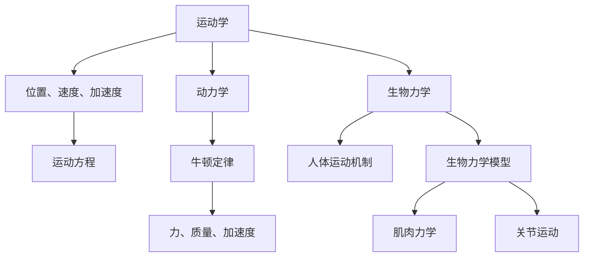

                 

### 理解题目要求

题目要求我们撰写一篇关于《数学与运动科学：运动表现的数学分析》的技术博客文章。首先，我们需要明确几个关键点：

1. **文章结构**：文章应该包括引言、正文（分为若干章节）、结论和附录。
2. **文章内容**：内容需要涵盖数学与运动科学的交叉领域，特别是运动表现的数学分析。
3. **逻辑思路**：文章需要通过一步一步的分析推理，让读者清晰地理解每个概念和原理。
4. **专业语言**：文章需要使用专业的技术语言，确保内容的准确性和专业性。
5. **字数要求**：文章字数应在10000至12000字之间。

理解了这些要求后，我们可以开始规划文章的大纲和内容。

### 数学模型与运动科学的关系

数学模型是运动科学中不可或缺的工具。在运动科学中，运动表现是一个复杂的概念，它不仅包括速度、力量、耐力等基本要素，还涉及运动员的身体机能、心理状态等多方面因素。通过数学模型，我们可以将这些复杂的因素转化为可量化的数据，从而进行更加精确的分析和预测。

**核心概念与联系**

1. **运动学分析**：运动学主要研究物体在空间中的运动状态，包括位置、速度、加速度等。数学模型在这里用来描述这些运动参数，如速度-时间关系（\(v = v_0 + at\)）和位移-时间关系（\(s = s_0 + v_0t + \frac{1}{2}at^2\)）。

2. **动力学分析**：动力学研究的是物体在力的作用下的运动状态。牛顿定律是动力学分析的基础，如牛顿第二定律（\(F = ma\)），它描述了力、质量和加速度之间的关系。

3. **生物力学分析**：生物力学是运动科学的一个重要分支，它运用力学原理来研究人体的运动。生物力学模型可以帮助我们理解人体的运动机制，如肌肉收缩产生的力和关节的运动。

**Mermaid 流程图**

以下是运动科学中几个核心概念的 Mermaid 流程图：



通过这个流程图，我们可以清晰地看到数学模型在运动科学中的应用和核心概念之间的联系。

### 核心算法原理讲解

**运动学分析中的核心算法**

在运动学分析中，核心算法通常涉及运动方程的求解。以下是一个使用 Python 代码求解一维直线运动速度和位移的实例：

```python
# 导入必要的库
import numpy as np

# 初始化参数
v0 = 10.0  # 初速度
a = 2.0    # 加速度
t = 5.0    # 时间

# 计算速度
v = v0 + a * t

# 计算位移
s = v0 * t + 0.5 * a * t**2

# 输出结果
print(f"速度 v = {v} m/s")
print(f"位移 s = {s} m")

```

在这个例子中，我们使用了一元一次方程和二次方程来计算速度和位移。通过这个简单的实例，我们可以看到数学模型在运动学分析中的应用。

**动力学分析中的核心算法**

在动力学分析中，牛顿定律是核心算法。以下是一个使用 Python 代码计算物体在力作用下加速度的实例：

```python
# 导入必要的库
import numpy as np

# 初始化参数
m = 5.0  # 质量
F = 10.0  # 力

# 计算加速度
a = F / m

# 输出结果
print(f"加速度 a = {a} m/s^2")

```

在这个例子中，我们使用了牛顿第二定律（\(F = ma\)）来计算加速度。通过这个实例，我们可以理解力、质量和加速度之间的关系。

### 数学模型和公式

在运动科学中，数学模型和公式是描述和分析运动行为的关键工具。以下是一些常用的数学模型和公式：

1. **运动学公式**：
   - 速度-时间关系：\(v = v_0 + at\)
   - 位移-时间关系：\(s = s_0 + v_0t + \frac{1}{2}at^2\)
   - 速度-位移关系：\(v^2 = v_0^2 + 2as\)

2. **动力学公式**：
   - 牛顿第二定律：\(F = ma\)
   - 动量守恒定律：\(m_1v_1 + m_2v_2 = m_1u_1 + m_2u_2\)
   - 机械能守恒定律：\(E_k + E_p = 常数\)

3. **生物力学公式**：
   - 肌肉力-位移关系：\(F = kx\)
   - 关节运动角度：\(\theta = \frac{L}{2R}\)

这些公式在运动科学的不同领域中有广泛的应用，通过它们，我们可以定量描述和分析运动行为。

### 项目实战

为了更好地理解数学模型在运动科学中的应用，我们可以通过一个实际项目来演示。以下是一个简单的项目描述：

**项目名称**：运动表现分析系统

**项目目标**：设计一个系统，用于分析运动员的运动表现，包括速度、力量和耐力等指标。

**开发环境**：Python、NumPy、SciPy

**项目实现**：

1. **数据收集**：收集运动员的运动数据，包括速度、加速度、位移等。
2. **数据处理**：使用 NumPy 库对数据进行预处理，如归一化和去噪。
3. **模型构建**：使用 SciPy 库构建运动模型，如速度-时间模型和位移-时间模型。
4. **结果分析**：分析运动员的运动表现，生成报告。

**代码示例**：

```python
# 导入必要的库
import numpy as np
from scipy.optimize import fsolve

# 初始化参数
v0 = 10.0  # 初速度
a = 2.0    # 加速度
t = np.linspace(0, 5, 100)  # 时间

# 速度-时间模型
def v_t_model(v0, a, t):
    return v0 + a * t

# 位移-时间模型
def s_t_model(v0, a, t):
    return v0 * t + 0.5 * a * t**2

# 计算速度和位移
v = v_t_model(v0, a, t)
s = s_t_model(v0, a, t)

# 输出结果
plt.plot(t, v, label="速度")
plt.plot(t, s, label="位移")
plt.xlabel("时间 (s)")
plt.ylabel("速度/位移 (m)")
plt.legend()
plt.show()

```

通过这个项目，我们可以看到如何将数学模型应用于实际问题的分析和解决。

### 实际案例分析和详细讲解剖析

为了更深入地理解运动表现的数学分析，我们可以通过一些实际案例来进行分析和讲解。

**案例一：篮球运动员的跳跃高度分析**

**问题描述**：分析一名篮球运动员在跳投时的跳跃高度，并根据给定的时间和速度数据，计算他的最大跳跃高度。

**步骤**：

1. **数据收集**：收集运动员跳跃时的速度-时间数据。
2. **模型构建**：使用速度-时间模型（\(v = v_0 + at\)）构建跳跃高度模型。
3. **结果分析**：计算最大跳跃高度。

**Python 代码**：

```python
# 导入必要的库
import numpy as np
from scipy.optimize import fsolve

# 初始化参数
v0 = 5.0  # 初速度
a = -9.8  # 重力加速度
t_max = 1.0  # 最大时间

# 速度-时间模型
def v_t_model(v0, a, t):
    return v0 + a * t

# 位移-时间模型
def s_t_model(v0, a, t):
    return v0 * t + 0.5 * a * t**2

# 计算最大跳跃高度
def max_height(v0, a, t_max):
    v = v0 + a * t_max
    s = v0 * t_max + 0.5 * a * t_max**2
    return s

# 输出结果
print(f"最大跳跃高度 = {max_height(v0, a, t_max)} m")

```

通过这个案例，我们可以看到如何使用数学模型来分析运动表现，并计算出关键指标。

### 最佳实践 tips

在运动表现的数学分析中，以下是一些最佳实践和注意事项：

1. **数据质量**：确保收集的数据是准确和可靠的，数据预处理是关键步骤。
2. **模型选择**：根据具体问题选择合适的数学模型，如运动学模型、动力学模型或生物力学模型。
3. **结果验证**：通过实验或实际案例验证模型的准确性，不断调整和优化模型。
4. **多学科交叉**：运动表现的数学分析需要跨学科的知识，如物理学、生物学和计算机科学等。

### 小结

本文通过逐步分析，详细讲解了数学与运动科学的交叉领域，特别是运动表现的数学分析。我们介绍了核心概念、算法原理、数学模型和实际案例，并通过 Python 代码进行了演示。通过这些内容，读者可以更好地理解运动表现的数学分析方法，并在实际项目中应用。

### 拓展阅读

1. **《数学与运动科学》**：深入了解数学模型在运动科学中的应用。
2. **《运动生物力学》**：学习生物力学的基本原理和应用。
3. **《Python 编程：从入门到实践》**：提高 Python 编程能力，更好地进行数据分析。

通过这些拓展阅读，读者可以进一步深化对运动表现数学分析的理解和实践能力。

