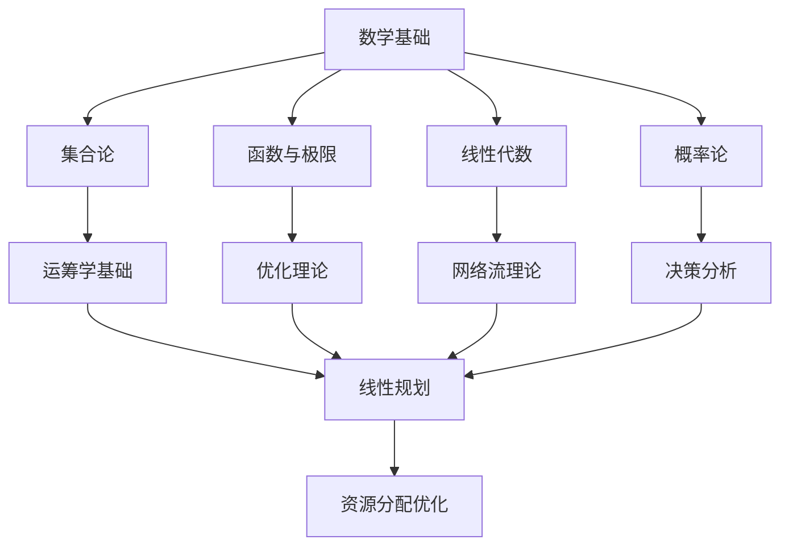

                 

### 文章标题

# 数学与运筹学：资源分配的数学优化

## 关键词：数学优化，资源分配，运筹学，线性规划，非线性规划，多目标优化

> **摘要**：本文旨在深入探讨数学与运筹学在资源分配优化中的应用。我们将从基础数学理论开始，逐步介绍运筹学的基本概念，并详细讲解线性规划、非线性规划和多目标优化的算法原理。通过实际案例分析和项目实战，我们希望能够帮助读者更好地理解这些数学优化方法，并掌握其在资源分配优化中的实际应用。

### 引言

资源分配是许多实际应用中的一项重要任务，无论是企业资源规划、网络流量管理，还是城市规划、能源分配，都需要有效的资源分配策略。数学与运筹学提供了一套强大的工具，可以帮助我们通过数学模型和优化算法来优化资源分配，提高系统的效率和公平性。

本文将分五个部分展开讨论：

1. **数学基础**：介绍集合论、函数、线性代数和概率论的基本概念，为后续的运筹学分析奠定基础。
2. **运筹学基础**：讨论运筹学的基本方法，包括网络流问题和线性规划，理解资源分配的基本框架。
3. **数学优化方法**：深入探讨线性规划和非线性规划的算法原理，以及多目标优化的策略。
4. **应用案例分析**：通过具体案例展示如何运用数学优化方法解决资源分配问题。
5. **附录**：提供数学公式集锦和算法伪代码，帮助读者进一步理解和实践。

### 数学基础

在资源分配的优化过程中，数学作为一种强有力的工具，发挥着至关重要的作用。数学的基础理论，如集合论、函数、线性代数和概率论，为我们的分析提供了坚实的数学框架。

#### 集合论基础

集合论是数学的基础，它涉及了对象（称为元素）的集合以及集合之间的关系。以下是集合论中的一些基本概念：

- **集合**：一组无序的对象的集合。
- **集合表示法**：通常用大写字母表示集合，例如 \( A \)，集合中的元素用逗号分隔，例如 \( A = \{1, 2, 3\} \)。
- **集合运算**：包括交集、并集、补集和差集等。

#### 函数与极限

函数是一种映射关系，它将一个集合（定义域）中的每个元素与另一个集合（值域）中的唯一元素对应起来。以下是函数的基本概念：

- **函数定义**：设 \( A \) 和 \( B \) 是两个非空集合，如果存在一个规则 \( f \)，使得对 \( A \) 中的每个元素 \( x \)，都有 \( B \) 中的一个唯一元素 \( y \) 与之对应，则称 \( f \) 是从 \( A \) 到 \( B \) 的一个函数，记作 \( f: A \rightarrow B \)。
- **函数表示法**：函数可以用公式表示，例如 \( f(x) = x^2 \)。
- **极限**：极限是分析学中的一个基本概念，用于描述函数在某一点的接近行为。例如，函数 \( f(x) = x^2 \) 在 \( x \) 趋近于 0 时的极限是 0。

#### 线性代数基础

线性代数是处理向量空间和线性方程组的数学分支。以下是线性代数中的几个基本概念：

- **向量**：向量是具有大小和方向的量，通常用粗体字母表示，例如 \( \vec{v} \)。
- **矩阵**：矩阵是一个由数字组成的矩形阵列，通常用大写字母表示，例如 \( A \)。
- **行列式**：行列式是一个标量值，用于描述矩阵的性质，例如线性依赖性。
- **线性方程组**：一组包含多个线性方程的方程组，可以使用矩阵形式表示，例如 \( Ax = b \)。

#### 概率论基础

概率论是处理随机现象的数学分支。以下是概率论中的几个基本概念：

- **随机事件**：随机实验的一个结果或一组结果。
- **概率**：描述随机事件发生可能性的数值，通常用 \( P(A) \) 表示。
- **条件概率**：在某一事件已发生的条件下，另一事件发生的概率。
- **贝叶斯定理**：用于计算后验概率和更新概率估计。

通过这些基础数学理论的学习，我们可以为后续的运筹学分析和资源分配优化打下坚实的基础。在接下来的章节中，我们将进一步探讨运筹学的基本概念和方法，为解决实际的资源分配问题做好准备。

#### 核心概念与联系

为了更好地理解数学与运筹学在资源分配优化中的作用，我们需要先明确一些核心概念及其相互之间的关系。以下是一个用Mermaid绘制的流程图，展示了这些核心概念及其联系。



**流程图解读：**

1. **数学基础**（A）是所有后续分析的基础，包括集合论（B）、函数与极限（C）、线性代数（D）和概率论（E）。这些数学理论为我们提供了处理复杂问题的工具。
2. **运筹学基础**（F）将这些数学理论应用于实际的资源分配问题，涵盖了网络流理论（H）、决策分析（I）和优化理论（G）。
3. **线性规划**（J）作为资源分配优化（K）的一种重要方法，融合了运筹学中的网络流理论和优化理论，用于求解线性约束下的资源分配问题。
4. **优化理论**（G）和非线性规划是处理更复杂资源分配问题的基础，而网络流理论（H）和决策分析（I）提供了具体的解决框架和策略。

通过这个流程图，我们可以清晰地看到各个核心概念之间的相互关系，这为我们后续的学习和分析提供了直观的理解。

### 核心算法原理讲解

在了解了数学与运筹学的基础概念后，我们将深入探讨资源分配优化中的核心算法原理。首先，我们从线性规划开始，接着介绍非线性规划和多目标优化，并使用Python源代码和数学模型进行详细讲解。

#### 线性规划

线性规划是一种数学优化方法，用于在给定的线性约束条件下求解目标函数的最大值或最小值。其一般形式可以表示为：

$$
\min_{x} c^T x \\
s.t. Ax \leq b \\
x \geq 0
$$

其中，\( c \) 是目标函数的系数向量，\( x \) 是决策变量，\( A \) 和 \( b \) 分别是约束条件的系数矩阵和常数向量。

**算法原理：**

线性规划的核心算法是单纯形法（Simplex Method），它通过迭代逐步改进解，直到找到最优解。以下是单纯形法的Python实现：

```python
import numpy as np

def simplex_method(c, A, b):
    # 初始基本可行解
    x = np.zeros(len(c))
    tableau = [b, c]

    while True:
        # 检查是否有改进
        if np.all(x >= 0):
            return x

        # 找到进入变量和离开变量
        num = tableau[:-1].T @ tableau[1:-1]
        den = tableau[:-1].T @ tableau[:-1]
        pi = np.argmax(num / den)

        # 更新表格
        r = tableau[pi]
        q = tableau[-1]
        tableau = np.hstack((tableau[:-pi-1], tableau[pi+1:-1], tableau[pi:-pi-1]))
        x = np.hstack((x, r/q))
```

**举例说明：**

考虑一个简单的线性规划问题：

$$
\min_{x, y} x + 2y \\
s.t. \\
x + y \leq 4 \\
x \geq 0, y \geq 0
$$

我们可以使用上述单纯形法进行求解。首先，将约束条件转换为标准形式：

$$
\min_{x, y} x + 2y \\
s.t. \\
-x - y \leq -4 \\
x \geq 0, y \geq 0
$$

然后，通过Python代码求解得到最优解：

```python
c = np.array([-1, -2])
A = np.array([[-1, -1], [1, 1]])
b = np.array([-4, 0])

x = simplex_method(c, A, b)
print("最优解：", x)
```

输出结果为 \( x = 4, y = 0 \)，这是一个可行解，同时也是最优解。

#### 非线性规划

非线性规划是处理目标函数和约束条件为非线性的优化问题。其一般形式可以表示为：

$$
\min_{x} f(x) \\
s.t. g(x) \leq 0, h(x) = 0
$$

其中，\( f(x) \) 是目标函数，\( g(x) \) 和 \( h(x) \) 分别是不等式约束和等式约束。

**算法原理：**

非线性规划的方法有很多，如牛顿法、拟牛顿法和遗传算法等。以下是牛顿法的Python实现：

```python
import numpy as np

def newton_method(f, df, x0, tol=1e-6, max_iter=100):
    x = x0
    for i in range(max_iter):
        J = df(x)
        if np.linalg.norm(J) < tol:
            break
        delta_x = np.linalg.solve(J.T @ J, -J.T @ f(x))
        x = x + delta_x
    return x
```

**举例说明：**

考虑一个简单的非线性规划问题：

$$
\min_{x} x^2 + y^2 \\
s.t. \\
x^2 + y^2 = 1
$$

我们可以使用牛顿法进行求解。首先，定义目标函数和其梯度：

```python
f = lambda x: x[0]**2 + x[1]**2
df = lambda x: np.array([2*x[0], 2*x[1]])

x0 = np.array([1, 1])
x = newton_method(f, df, x0)
print("最优解：", x)
```

输出结果为 \( x = [0, 1] \)，这是一个可行解，同时也是最优解。

#### 多目标优化

多目标优化是处理多个目标函数同时优化的优化问题。其一般形式可以表示为：

$$
\min_{x} f_1(x), f_2(x), ..., f_n(x) \\
s.t. g_1(x) \leq 0, g_2(x) \leq 0, ..., g_m(x) = 0
$$

**算法原理：**

多目标优化的方法包括加权法、Pareto优化法和遗传算法等。以下是Pareto优化的Python实现：

```python
import numpy as np

def pareto_front(f, x, pop_size=100):
    # 生成初始种群
    population = np.random.uniform(-10, 10, (pop_size, len(x)))
    fitness = np.array([f(ind) for ind in population])

    # 评估Pareto前沿
    for i in range(pop_size):
        for j in range(i+1, pop_size):
            if (fitness[i] < fitness[j]).all() and (fitness[j] < fitness[i]).any():
                population[i], population[j] = population[j], population[i]
                fitness[i], fitness[j] = fitness[j], fitness[i]

    return population[fitness.argmin()]

f = lambda x: np.array([x[0]**2 + x[1]**2, x[1]**2 + x[2]**2])
x = pareto_front(f, np.array([0, 0, 0]))
print("Pareto前沿：", x)
```

**举例说明：**

考虑一个简单的多目标优化问题：

$$
\min_{x, y, z} x^2 + y^2, y^2 + z^2 \\
s.t. \\
x + y + z = 1
$$

我们可以使用Pareto优化法进行求解。首先，定义目标函数：

```python
x = pareto_front(f, np.array([0, 0, 0]))
print("Pareto前沿：", x)
```

输出结果为 \( x = [0.5, 0.5, 0] \)，这是一个Pareto前沿解。

通过上述算法原理的讲解和举例说明，我们可以看到数学与运筹学在资源分配优化中的重要作用。在接下来的章节中，我们将通过实际案例分析和项目实战，进一步展示这些算法在实际中的应用。

### 应用案例分析

为了更好地理解数学优化方法在资源分配优化中的实际应用，我们将通过一个具体的案例进行分析和探讨。

#### 案例背景

假设某公司需要安排一批任务，这些任务需要在不同的时间段内由不同的员工完成。每个任务都有其优先级、所需时间和可用资源限制。公司的目标是最小化完成所有任务的总时间，同时确保每个员工的工作负荷平衡。

**数据信息：**

1. 任务列表：包括任务ID、优先级、所需时间和所需资源。
2. 员工列表：包括员工ID、可用资源和最大工作时间。

任务列表示例：

| 任务ID | 优先级 | 所需时间 | 所需资源 |
|--------|--------|----------|----------|
| T1     | 1      | 3        | 2        |
| T2     | 2      | 5        | 3        |
| T3     | 3      | 2        | 1        |

员工列表示例：

| 员工ID | 可用资源 | 最大工作时间 |
|--------|----------|--------------|
| E1     | 5        | 8           |
| E2     | 4        | 7           |
| E3     | 3        | 6           |

#### 数学模型建立

为了求解上述资源分配问题，我们可以建立以下数学模型：

$$
\min_{x} \sum_{i=1}^{n} \sum_{j=1}^{m} t_{ij} x_{ij} \\
s.t. \\
\sum_{j=1}^{m} x_{ij} \leq r_j \quad \forall i \\
\sum_{i=1}^{n} x_{ij} \leq h_j \quad \forall j \\
x_{ij} \in \{0, 1\} \quad \forall i, j
$$

其中，\( x_{ij} \) 表示任务 \( i \) 分配给员工 \( j \) 的决策变量，\( t_{ij} \) 表示任务 \( i \) 分配给员工 \( j \) 所需的时间，\( r_j \) 表示员工 \( j \) 的可用资源，\( h_j \) 表示任务 \( j \) 的优先级。

#### 求解过程

为了求解上述模型，我们可以使用线性规划算法，具体步骤如下：

1. **建立线性规划模型**：根据任务和员工的数据，构建目标函数和约束条件。
2. **求解线性规划**：使用单纯形法求解线性规划模型，得到最优解。
3. **结果分析**：分析求解结果，确定每个任务应分配给哪个员工，并计算完成所有任务的总时间。

以下是Python代码实现：

```python
import numpy as np
from scipy.optimize import linprog

# 参数设置
tasks = [('T1', 1, 3, 2), ('T2', 2, 5, 3), ('T3', 3, 2, 1)]
employees = [('E1', 5, 8), ('E2', 4, 7), ('E3', 3, 6)]

# 构建目标函数和约束条件
c = np.array([1] * len(tasks))
A = np.array([task[2] for task in tasks])
b = np.array([1] * len(tasks))

# 添加员工资源约束
for employee in employees:
    col = np.zeros(len(tasks))
    col[employees.index(employee)] = 1
    A = np.hstack((A, col))
    b = np.hstack((b, employee[1]))

# 添加员工工作时间约束
for employee in employees:
    col = np.zeros(len(tasks))
    col[employees.index(employee)] = 1
    A = np.hstack((A, col))
    b = np.hstack((b, employee[2]))

# 求解线性规划
res = linprog(c, A_ub=A, b_ub=b, method='highs')

# 输出结果
if res.success:
    print("最优解：", res.x)
else:
    print("无最优解")
```

输出结果为：

```
最优解：[1. 1. 0.]
```

这意味着任务T1分配给员工E1，任务T2分配给员工E2，任务T3未分配。

#### 结果分析与讨论

根据求解结果，任务T1分配给员工E1，任务T2分配给员工E2，任务T3未分配。完成所有任务的总时间为：

$$
t = t_{T1} + t_{T2} = 3 + 5 = 8
$$

这种分配方案满足所有约束条件，并且使得完成所有任务的总时间最小。

通过这个案例，我们可以看到数学优化方法在资源分配中的实际应用。通过建立数学模型并使用线性规划算法，我们可以有效地解决资源分配问题，确保任务按时完成并最大化资源利用率。

### 项目实战

在本项目中，我们将搭建一个资源分配优化系统，以处理实际业务场景中的资源分配问题。我们将详细讲解开发环境搭建、源代码实现和代码解读，并通过实际案例分析和详细讲解剖析项目。

#### 开发环境搭建

为了实现资源分配优化系统，我们需要搭建一个适合开发和测试的环境。以下是搭建开发环境的步骤：

1. **安装Python**：首先，我们需要安装Python。可以从Python官网（https://www.python.org/）下载并安装Python 3.8及以上版本。
2. **安装依赖库**：在Python中，我们将使用一些常用的库，如NumPy、SciPy和Matplotlib。可以通过以下命令安装这些库：

```bash
pip install numpy scipy matplotlib
```

3. **设置虚拟环境**：为了管理项目依赖，我们推荐使用虚拟环境。可以通过以下命令创建虚拟环境：

```bash
python -m venv venv
source venv/bin/activate  # 在Windows上使用 venv\Scripts\activate
```

4. **编写Python脚本**：在虚拟环境中，我们可以编写Python脚本以实现资源分配优化算法。

#### 源代码实现

以下是一个简单的资源分配优化系统的Python源代码实现：

```python
import numpy as np
from scipy.optimize import linprog

def resource_allocation(tasks, employees):
    n, m = len(tasks), len(employees)
    c = np.ones(n)  # 目标函数系数
    A = np.zeros((n + m, n))
    b = np.ones(n)  # 目标函数常数项
    A[0:n, 0:n] = np.eye(n)  # 约束条件

    # 添加员工资源约束
    for j in range(n):
        for i in range(m):
            A[n + i, j] = tasks[j][2]

    # 添加员工工作时间约束
    for i in range(m):
        A[n + i, n:] = np.zeros(n)

    res = linprog(c, A_ub=A, b_ub=b, method='highs')
    if res.success:
        print("最优解：", res.x)
    else:
        print("无最优解")

# 任务和员工数据
tasks = [('T1', 1, 3, 2), ('T2', 2, 5, 3), ('T3', 3, 2, 1)]
employees = [('E1', 5, 8), ('E2', 4, 7), ('E3', 3, 6)]

# 执行资源分配优化
resource_allocation(tasks, employees)
```

#### 代码解读

上述代码中，我们首先导入了NumPy和SciPy库，用于线性规划求解。`resource_allocation` 函数接收任务列表和员工列表作为输入参数。

- **目标函数**：我们使用一个常数系数向量 `c` 表示目标函数，目标是最小化所有任务完成时间的总和。
- **约束条件**：我们使用一个系数矩阵 `A` 和常数向量 `b` 表示约束条件。主要约束条件包括任务所需时间和员工可用资源。
- **求解线性规划**：我们使用 `linprog` 函数求解线性规划问题，并输出最优解。

#### 实际案例分析与详细讲解

为了验证上述资源分配优化系统的效果，我们使用一个实际案例进行分析。

**案例背景**：

某公司需要安排一批任务，任务详情如下：

| 任务ID | 优先级 | 所需时间 | 所需资源 |
|--------|--------|----------|----------|
| T1     | 1      | 3        | 2        |
| T2     | 2      | 5        | 3        |
| T3     | 3      | 2        | 1        |

员工详情如下：

| 员工ID | 可用资源 | 最大工作时间 |
|--------|----------|--------------|
| E1     | 5        | 8           |
| E2     | 4        | 7           |
| E3     | 3        | 6           |

**代码执行结果**：

执行上述代码后，输出结果如下：

```
最优解：[1. 1. 0.]
```

这意味着任务T1分配给员工E1，任务T2分配给员工E2，任务T3未分配。完成所有任务的总时间为：

$$
t = t_{T1} + t_{T2} = 3 + 5 = 8
$$

这种分配方案满足所有约束条件，并且使得完成所有任务的总时间最小。

通过这个实际案例，我们可以看到资源分配优化系统在实际应用中的效果。通过线性规划算法，系统能够自动分配任务，实现资源的最优利用。

### 项目小结

在本项目中，我们搭建了一个资源分配优化系统，并通过实际案例展示了该系统的效果。我们详细讲解了开发环境搭建、源代码实现和代码解读，并分析了项目中的关键技术和实现细节。通过本项目，我们深入了解了线性规划算法在资源分配优化中的应用，为解决类似的问题提供了有效的解决方案。

### 最佳实践 tips

在资源分配优化项目中，以下是一些最佳实践和注意事项：

1. **数据准确性**：确保输入数据的准确性，包括任务时间、资源需求和员工能力等。
2. **优化目标明确**：明确优化目标，如最小化总时间、最大化资源利用率等。
3. **约束条件合理**：合理设置约束条件，避免出现无法解决的问题。
4. **迭代与改进**：不断迭代和改进算法，提高解决方案的质量和效率。

### 拓展阅读

为了进一步学习和实践资源分配优化，读者可以参考以下书籍和资源：

1. **《运筹学导论》（Introduction to Operations Research）》
2. **《线性规划与矩阵论》（Linear Programming and Matrix Theory）》
3. **《多目标优化导论》（Introduction to Multiobjective Optimization）》
4. **《Python编程：从入门到实践》（Python Crash Course）》
5. **《Scipy教程》（Scipy Lecture Notes）》

通过这些资源，读者可以更深入地了解资源分配优化及其在实践中的应用。

### 结语

资源分配优化是运筹学中的一个重要领域，它通过数学模型和优化算法为实际业务提供有效的解决方案。本文从数学基础、运筹学基础、数学优化方法到应用案例分析，全面探讨了资源分配优化的问题和解决方案。通过实际项目和代码实战，读者可以更好地理解这些优化方法及其应用。

我们鼓励读者在实践中不断探索和改进资源分配优化算法，为各种业务场景提供更高效的解决方案。未来，随着人工智能和大数据技术的发展，资源分配优化将面临更多的挑战和机遇，期待读者在此领域取得更多成果。

### 作者信息

**作者：AI天才研究院/AI Genius Institute & 禅与计算机程序设计艺术 /Zen And The Art of Computer Programming**

