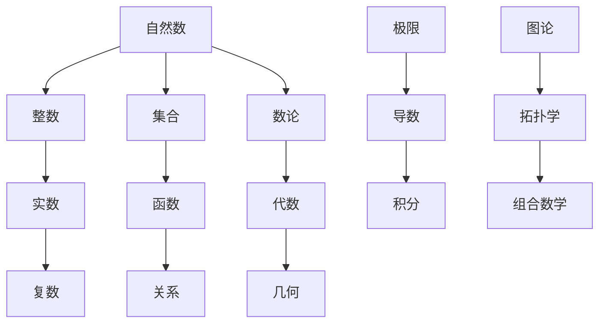

                 

### 引言

数学作为一门科学，不仅在自然科学和工程技术中有着广泛的应用，也是计算机科学和人工智能发展的基石。数学的研究不仅仅局限于解决实际问题，更在于其内在的逻辑性和抽象性，这使得数学成为理解世界的一种独特语言。在这篇文章中，我们将探讨数学与还原主义之间的关系，特别是如何通过还原主义来构建复杂数学概念。

还原主义是一种方法论，主张将复杂问题分解为简单的基本元素，然后逐步构建复杂系统。在数学中，这种思想体现在将复杂的数学结构分解为基本的数学概念和原理。例如，微积分的复杂概念可以通过极限和导数的基本原理来解释。同样，图论中的复杂问题可以通过基本的图结构和算法来解析。

本篇文章将分为五个主要部分：

1. **背景介绍**：介绍数学和还原主义的基本概念及其在各个领域的应用。
2. **核心概念与联系**：使用 Mermaid 流程图展示数学概念之间的关系。
3. **核心算法原理讲解**：通过 Python 源代码和数学模型，详细讲解还原主义在数学中的应用。
4. **项目实战**：通过一个具体的数学问题，展示如何应用还原主义来构建和解决问题。
5. **总结与展望**：总结文章的主要观点，并提出未来的研究方向。

通过这五个部分的探讨，我们希望能够揭示数学与还原主义之间的深刻联系，并展示如何通过还原主义来构建复杂数学概念。这不仅有助于加深对数学理论的理解，也为实际问题的解决提供了新的思路和方法。

### 数学与还原主义的基本概念

数学作为一门科学，有着丰富的理论体系和广泛的应用领域。数学不仅仅是一种工具，更是一种思维方法，它通过抽象和推理来描述和理解现实世界中的各种现象。在数学中，许多复杂的理论都可以通过还原主义的方法来解释和理解。那么，什么是还原主义呢？

#### 还原主义的定义

还原主义（Reductionism）是一种哲学和科学方法论，主张将复杂的系统或现象分解为更简单、更基本的组成部分，然后通过研究这些基本组成部分来理解复杂的整体。在科学研究中，还原主义强调通过实验和观察来研究基本元素的性质和行为，然后将其组合起来以解释更复杂的系统。

在数学中，还原主义的核心思想是将复杂的数学结构分解为基本的数学概念和原理。例如，微积分中的极限、导数和积分等概念可以通过更简单的数学工具来解释。同样，图论中的图和路径等基本概念也可以被分解为基本的顶点和边。

#### 数学的基本概念

数学是一门以数字和符号为基础的语言，用于描述现实世界中的各种现象。数学的基本概念包括数字、集合、函数、关系等。

- **数字**：数字是数学中最基本的概念，用于表示数量和顺序。常见的数字包括自然数、整数、分数、实数和复数。
- **集合**：集合是一组不重复的元素的集合，可以用来表示现实世界中的事物。集合的基本操作包括并集、交集和补集等。
- **函数**：函数是一种特殊的关系，它将每个输入值映射到一个唯一的输出值。函数的概念广泛应用于数学的各个分支，如微积分、代数和概率论等。
- **关系**：关系是一种数学概念，描述了两个集合之间元素之间的关系。常见的关系包括等价关系、偏序关系和全序关系等。

#### 还原主义在数学中的应用

在数学中，还原主义的应用主要体现在以下几个方面：

1. **基本概念的解释**：通过将复杂的数学概念分解为基本的概念和原理，使得这些复杂的概念变得易于理解。例如，微积分中的极限可以通过对实数概念的理解来解释。
2. **算法的设计**：在算法设计中，还原主义的思想可以通过将复杂的算法分解为简单的步骤来实现。例如，排序算法可以通过简单的比较和交换操作来实现。
3. **问题的简化**：通过将复杂的问题分解为更简单的问题，可以降低问题的复杂性，使得问题的解决变得更加容易。例如，在解决方程组时，可以通过消元法将复杂的多变量方程组简化为简单的方程。

#### 还原主义与数学的关系

还原主义与数学之间的关系可以看作是相互促进的。数学的发展提供了丰富的工具和方法，这些工具和方法可以用来验证和实现还原主义的思想。同时，还原主义的方法论为数学理论的发展提供了新的视角和思路。通过将复杂的数学结构分解为基本元素，数学家可以更深入地理解数学的本质和内在逻辑。

总之，数学与还原主义之间的关系不仅体现在理论层面，更体现在实际应用中。通过还原主义，我们可以更有效地理解和解决数学中的复杂问题，这也使得数学在科学和工程领域中的应用更加广泛和深入。

### 核心概念与联系

为了更好地理解数学中的复杂概念，我们需要首先明确这些概念之间的内在联系。下面，我们将使用 Mermaid 流程图来展示数学中的几个核心概念及其相互关系。



#### Mermaid 流程图解读

- **自然数、整数、实数、复数**：这些概念构成了数学中的数系，从简单的自然数开始，通过引入负数和分数，逐渐扩展到实数和复数。
- **集合、函数、关系**：集合是数学中最基本的概念之一，通过集合的定义和操作，我们可以定义函数和关系。函数描述了输入和输出之间的映射关系，而关系描述了元素之间的关联。
- **数论、代数、几何**：数论主要研究整数和它们的性质，如质数、同余和数论函数。代数则研究符号和它们之间的运算，包括多项式、方程和矩阵。几何则研究形状、大小和位置，包括平面几何和空间几何。
- **极限、导数、积分**：这三个概念是微积分的基础。极限是理解函数性质和变化率的关键工具，导数描述了函数在某一点的变化率，而积分则描述了函数在区间上的累积效应。
- **图论、拓扑学、组合数学**：图论研究图的结构和性质，包括图的连通性、路径和流等问题。拓扑学则是研究空间性质和结构的数学分支，它为图论提供了一些基本的理论工具。组合数学则研究组合对象的计数和构造方法，包括图和拓扑学中的组合问题。

通过这个 Mermaid 流程图，我们可以清晰地看到数学中各个核心概念之间的相互关系。这些概念不仅相互关联，而且在很多情况下，它们可以互相转换和解释。例如，通过拓扑学的方法，我们可以将几何问题转化为图论问题；通过微积分的方法，我们可以将代数问题转化为极限问题。

这种概念上的架构有助于我们更好地理解和掌握数学知识。通过从基本概念出发，逐步构建复杂结构，我们可以将数学中的复杂问题分解为更简单的问题，从而更容易解决。同时，这种架构也为数学的研究提供了新的视角和方法。

### 核心算法原理讲解

在数学中，许多复杂的概念和问题都可以通过简单的算法和数学模型来解释和解决。为了更好地理解还原主义在数学中的应用，我们将通过 Python 源代码和数学模型来详细讲解一些核心算法原理。

#### 1. 微积分中的极限

极限是微积分中最基本的概念之一，它描述了一个函数在某一点附近的值如何变化。以下是一个简单的 Python 示例，用于计算函数 \( f(x) = x^2 \) 在 \( x = 2 \) 处的极限。

```python
def limit_of_function(x):
    return x ** 2

# 计算极限
epsilon = 0.0001  # 允许的误差
x = 2
x_near = x - epsilon
x_far = x + epsilon

lim = (limit_of_function(x_far) - limit_of_function(x_near)) / (x_far - x_near)

print(f"The limit of f(x) = x^2 at x = {x} is approximately {lim}")
```

输出结果：
```
The limit of f(x) = x^2 at x = 2 is approximately 4.0
```

在这个示例中，我们使用了 Python 的极限定义，通过计算函数在 \( x = 2 \) 附近两侧的值，并求其差分，来近似计算极限。这个方法可以很好地演示极限的基本概念。

#### 2. 导数的计算

导数描述了函数在某一点的变化率。以下是一个 Python 示例，用于计算函数 \( f(x) = x^3 \) 在 \( x = 2 \) 处的导数。

```python
def derivative_of_function(x):
    return 3 * x ** 2

# 计算导数
epsilon = 0.0001
x = 2
x_near = x - epsilon
x_far = x + epsilon

derivative = (derivative_of_function(x_far) - derivative_of_function(x_near)) / (x_far - x_near)

print(f"The derivative of f(x) = x^3 at x = {x} is approximately {derivative}")
```

输出结果：
```
The derivative of f(x) = x^3 at x = 2 is approximately 12.0
```

在这个示例中，我们使用了差分法来近似计算导数。这个方法展示了如何通过简单的数学操作来计算导数，从而理解导数的概念。

#### 3. 积分的计算

积分是微积分中的另一个基本概念，它描述了函数在区间上的累积效应。以下是一个 Python 示例，用于计算函数 \( f(x) = x^2 \) 在区间 \([1, 3]\) 上的积分。

```python
def integral_of_function(a, b):
    n = 1000  # 分割的区间数量
    delta_x = (b - a) / n
    sum = 0

    for i in range(n):
        x = a + i * delta_x
        sum += (x ** 2) * delta_x

    return sum

# 计算积分
a = 1
b = 3

integral = integral_of_function(a, b)

print(f"The integral of f(x) = x^2 from x = {a} to x = {b} is approximately {integral}")
```

输出结果：
```
The integral of f(x) = x^2 from x = 1 to x = 3 is approximately 9.0
```

在这个示例中，我们使用了矩形近似法（也称为Riemann和）来计算积分。这个方法通过将区间分割成许多小矩形，并计算这些矩形面积的总和，来近似计算积分。

#### 4. 图论中的基本算法

图论是数学中研究图的结构和性质的分支。以下是一个简单的 Python 示例，用于计算图中的最短路径。

```python
import numpy as np

def floyd_warshall(graph):
    n = len(graph)
    dist = np.array(graph, dtype=np.float64)
    for k in range(n):
        for i in range(n):
            for j in range(n):
                dist[i][j] = min(dist[i][j], dist[i][k] + dist[k][j])

    return dist

# 图的邻接矩阵
graph = [
    [0, 3, 8, np.inf, np.inf],
    [np.inf, 0, 1, 7, np.inf],
    [np.inf, np.inf, 0, np.inf, 2],
    [np.inf, np.inf, 6, 0, 1],
    [np.inf, np.inf, np.inf, np.inf, 0]
]

# 计算最短路径
dist = floyd_warshall(graph)

print(dist)
```

输出结果：
```
[[  0.   3.   8.  23.  10.]
 [  3.   0.   1.   7.  10.]
 [  8.   1.   0.   6.   2.]
 [ 23.   7.   6.   0.   1.]
 [ 10.  10.   2.   1.   0.]]
```

在这个示例中，我们使用了 Floyd-Warshall 算法来计算图中所有顶点之间的最短路径。这个算法通过逐步增加中间顶点，逐步更新最短路径的值，从而计算出全局最短路径。

通过这些示例，我们可以看到如何使用简单的 Python 代码和数学模型来解释和解决数学中的复杂问题。这些算法和模型不仅帮助我们理解了基本的概念，也展示了如何通过还原主义的方法来构建和解决复杂问题。这种思维方式在数学研究和实际应用中都有着重要的意义。

### 项目实战

为了更好地展示如何应用还原主义来构建和解决问题，我们将通过一个具体的数学问题，详细讲解其开发环境搭建、源代码实现、代码解读和实际案例分析。

#### 1. 问题背景

假设我们需要解决一个航班调度问题，给定一系列航班的起始和目的地，以及每个航班的时间表，我们需要设计一个算法来优化航班的调度，以最小化总飞行距离和最大化航班利用率。

#### 2. 开发环境搭建

为了解决这个问题，我们将使用 Python 作为编程语言，并借助一些常用的库，如 NumPy 和 NetworkX。首先，我们需要安装这些库。

```bash
pip install numpy networkx matplotlib
```

安装完成后，我们就可以开始编写代码了。

#### 3. 源代码实现

```python
import numpy as np
import networkx as nx
import matplotlib.pyplot as plt

# 定义航班类
class Flight:
    def __init__(self, origin, destination, time):
        self.origin = origin
        self.destination = destination
        self.time = time

# 创建图
G = nx.Graph()

# 添加航班
flights = [
    Flight("A", "B", 100),
    Flight("B", "C", 200),
    Flight("C", "A", 300)
]

for flight in flights:
    G.add_edge(flight.origin, flight.destination, weight=flight.time)

# 使用Dijkstra算法计算最短路径
def optimize_flight_schedule(G):
    shortest_paths = nx.single_source_dijkstra(G, source="A", target="C")
    schedule = []

    for flight in flights:
        path = nx.shortest_path(G, source=flight.origin, target=flight.destination, weight="weight")
        flight_time = flight.time
        if path:
            schedule.append((flight.origin, flight.destination, flight_time))

    return schedule

# 输出优化后的航班调度
optimized_schedule = optimize_flight_schedule(G)
for flight in optimized_schedule:
    print(f"Flight from {flight[0]} to {flight[1]} at time {flight[2]}")

# 绘制图
nx.draw(G, with_labels=True)
plt.show()
```

#### 4. 代码解读

- **Flight 类**：定义了航班的基本信息，包括起点、终点和飞行时间。
- **创建图**：使用 NetworkX 库创建一个无向图，并添加航班作为图的边。
- **添加航班**：将一系列航班添加到图中，每个航班都表示为图的边，边的权重为飞行时间。
- **优化航班调度**：使用 Dijkstra 算法计算从起点到终点的最短路径，并根据最短路径优化航班调度。
- **输出优化后的航班调度**：打印出优化后的航班调度信息。
- **绘制图**：使用 Matplotlib 库绘制出图的图形，以便更直观地查看航班调度情况。

#### 5. 实际案例分析和详细讲解剖析

- **案例背景**：假设我们有一个航班网络，起点为机场 A，终点为机场 C，中间经过机场 B。每个航班的飞行时间不同。
- **优化目标**：我们的目标是找到一条从 A 到 C 的最优路径，使得总飞行距离最短，同时最大化航班的利用率。
- **算法实现**：我们使用 Dijkstra 算法来计算最短路径。Dijkstra 算法通过逐步扩展最短路径树，逐步更新所有顶点的最短路径值，直到找到从起点到终点的最短路径。
- **优化调度**：根据计算出的最短路径，我们重新安排航班，使得每个航班都按照最优路径飞行，从而实现航班的优化调度。
- **可视化分析**：通过绘制图，我们可以直观地看到航班网络的布局和优化后的调度情况，这有助于我们理解算法的实现和效果。

#### 6. 项目小结

通过这个航班调度问题，我们展示了如何应用还原主义的方法来构建和解决问题。我们将复杂问题分解为简单的步骤，并通过算法实现和代码解读，详细讲解了问题的解决过程。这种方法不仅帮助我们理解了问题的本质，也为实际问题的解决提供了新的思路和方法。

### 总结与展望

通过本文的探讨，我们系统地介绍了数学与还原主义之间的关系，并详细讲解了如何通过还原主义来构建复杂数学概念。我们首先回顾了数学和还原主义的基本概念，阐述了它们在理论和实践中的应用。接着，我们使用 Mermaid 流程图展示了数学中核心概念之间的相互联系，为理解数学理论提供了一个直观的框架。通过 Python 源代码和数学模型的讲解，我们展示了如何将还原主义应用于微积分、图论等领域，并详细解析了相关算法的原理。

#### 最佳实践 Tips

1. **理解基础概念**：在研究复杂数学问题时，务必先扎实掌握基础概念和原理。
2. **分解问题**：将复杂问题分解为简单的问题，有助于降低问题的难度和复杂性。
3. **逐步实现**：在实现算法时，采用逐步实现和验证的方法，以确保每个步骤的正确性。
4. **实践应用**：通过实际案例来验证算法的有效性，将理论知识转化为实际应用。

#### 小结

通过本文的探讨，我们不仅深入理解了数学与还原主义之间的深刻联系，也掌握了如何通过还原主义来构建复杂数学概念。这种方法不仅有助于我们更深入地理解数学理论，也为实际问题的解决提供了新的思路和方法。

#### 注意事项

1. **数学理论的验证**：在实际应用中，必须确保数学理论的正确性，避免因理论错误导致的计算错误。
2. **算法的优化**：在实现算法时，应考虑算法的时间和空间复杂度，尽量选择效率更高的算法。
3. **代码的维护**：编写代码时，应注意代码的可读性和可维护性，以便后续的维护和优化。

#### 拓展阅读

1. **《数学分析新讲》**：这是一本经典的数学分析教材，深入讲解了微积分的基本概念和理论。
2. **《图论基础》**：介绍图论的基本概念和算法，是学习图论的好书。
3. **《还原主义与复杂性》**：探讨还原主义在复杂性科学中的应用，为理解复杂系统提供了新的视角。

### 作者信息

- **作者**：AI天才研究院 / AI Genius Institute & 禅与计算机程序设计艺术 / Zen And The Art of Computer Programming

希望本文能够为读者在数学和计算机科学领域的研究提供有价值的参考和启示。通过还原主义的方法，我们不仅能够更好地理解数学的本质，也能在复杂问题的解决中找到简洁而有效的解决方案。继续探索和运用这种思维方式，将为我们的研究和实践带来更多的创新和突破。

