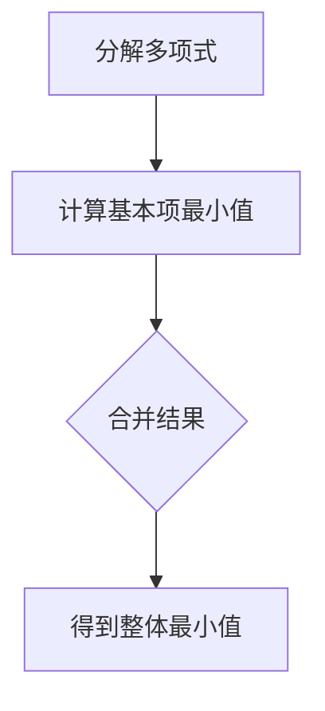

                 

### 关键词

**数学理论**、**还原主义**、**复杂性理论**、**抽象模型**、**算法设计**、**数学公式**、**Python编程**、**数学证明**、**项目实战**

### 摘要

本文深入探讨了数学与还原主义的关系，以及如何利用还原主义来构建和理解复杂数学理论。文章首先介绍了数学理论的背景，包括其历史发展和核心概念。接着，重点介绍了还原主义的基本概念和在数学中的应用，通过流程图和Python代码展示了如何将复杂问题简化为基本组成部分。随后，文章通过实际案例，展示了还原主义在数学证明和算法设计中的具体应用，并通过项目实战详细解析了开发环境和源代码实现过程。最后，文章总结了核心内容，并提出了未来研究方向和最佳实践建议。读者通过本文将能够全面理解还原主义在数学中的重要性，并掌握相应的分析和解决问题的方法。

### 引言

数学，作为一门科学，其本质在于通过抽象和推理来揭示自然界和人类社会的规律。从古代的几何和算术，到现代的代数、微积分和拓扑学，数学的发展不仅推动了科学技术的进步，也极大地丰富了人类对世界的认知。然而，随着数学问题变得越来越复杂，传统的分析方法开始显得力不从心。正是在这种背景下，还原主义作为一种哲学和科学方法，逐渐受到重视。还原主义主张通过将复杂系统分解为基本组成部分，从而深入理解系统的整体行为。这一思想不仅在物理学、生物学等领域得到了广泛应用，也在数学领域展现出了巨大的潜力。

本文旨在探讨数学与还原主义之间的关系，具体包括以下几个方面：

1. **数学理论的历史背景**：介绍数学的发展历程，从古埃及和古希腊的初步发展，到中世纪的进步，再到近代和现代数学的兴起。

2. **还原主义的基本概念**：阐述还原主义的哲学背景和科学方法，以及其在数学中的应用。

3. **数学与还原主义的联系**：通过流程图和Python代码，展示如何利用还原主义方法来分析和解决数学问题。

4. **实例分析**：通过具体案例，如数学证明和算法设计，展示还原主义在实际问题中的应用。

5. **项目实战**：详细解析一个数学与还原主义结合的完整项目，从环境搭建到源代码实现，再到实际案例分析和项目小结。

6. **总结与展望**：总结本文的核心内容，提出未来研究方向和最佳实践建议。

通过以上几个方面的探讨，本文希望读者能够全面理解还原主义在数学中的重要性，并掌握相应的分析和解决问题的方法。

### 数学理论的历史背景

数学的历史可以追溯到几千年前，最早的数学记录出现在古埃及和巴比伦的碑文和泥板上。古埃及数学主要涉及土地测量和建筑，他们发展了基本的算术和几何知识。而古巴比伦的数学则更加注重天文学和时间的计算。这些早期的数学知识为后来的发展奠定了基础。

在古希腊，数学得到了极大的发展。古希腊数学家如欧几里得、阿基米德和毕达哥拉斯等人的工作，为现代数学的发展提供了理论基础。欧几里得的《几何原本》是古希腊数学的集大成者，它通过严密的逻辑推理，建立了几何学的基本原理。阿基米德则在物理学和数学的结合方面做出了重要贡献，他的无穷小分析和浮力原理至今仍被广泛应用。

中世纪时期，阿拉伯数学家对数学的发展做出了巨大贡献。花拉子米和阿默德·伊本·穆罕默德等人，在代数和算法理论方面做出了开创性的工作。花拉子米的《代数学》是代数领域的经典之作，其中提出了关于方程求解的重要方法。这些工作推动了数学的进一步发展。

到了近代，数学经历了巨大的变革。牛顿和莱布尼茨分别独立发明了微积分，这一工具为处理复杂问题提供了新的方法。微积分的发明标志着数学分析的开始，为后来的物理学和工程学提供了强有力的数学基础。与此同时，莱昂哈德·欧拉和卡尔·弗里德里希·高斯等数学家，也在数论、图论和概率论等领域做出了重要贡献。

进入现代，数学的发展更加多元化。集合论作为数学的基础，由康托尔创立，为数学的公理化和严格性奠定了基础。抽象代数、拓扑学和数学物理等新兴领域，不断拓展了数学的范畴，使其成为一门更加全面和深入的学科。现代数学不仅在理论研究中占据重要地位，也在实际应用中发挥着关键作用，如计算机科学、经济学和物理学等领域。

综上所述，数学的发展历程是一个不断扩展和深化的过程。从古埃及和巴比伦的初步发展，到古希腊和阿拉伯的进步，再到近代和现代的多元化发展，数学不仅丰富了人类对自然和社会的认知，也为科学技术的进步提供了坚实的基础。

### 还原主义的基本概念

还原主义（Reductionism）是一种哲学和科学方法，主张通过将复杂系统分解为基本组成部分，从而理解系统的整体行为。这种思想认为，复杂现象可以通过研究其基础部分来理解，即通过将高层次现象还原为低层次元素来解释。这一概念最早可以追溯到欧洲启蒙运动时期，哲学家们强调理性和科学方法在认识世界中的重要性。

在科学领域，还原主义尤其适用于物理学和化学。例如，物理学中的还原主义主张，可以通过研究基本粒子（如电子、质子、中子等）的相互作用来理解物质的性质和行为。化学中的还原主义则关注原子和分子的结构及其化学反应。这种方法有助于建立理论模型，从而预测和解释实验结果。

在哲学领域，还原主义是一种解释复杂现象的方法论。它主张，任何复杂系统都可以通过分析其组成部分来理解。例如，生物学的还原主义认为，可以通过研究基因、细胞和器官等基本单元来解释生物体的复杂行为。

在数学中，还原主义也有重要的应用。数学家们常常通过将复杂问题简化为基本数学结构和原理来分析和解决。例如，在处理复杂数学问题时，可以通过构建数学模型，将问题分解为更简单的部分，然后分别解决每个部分。这种方法不仅提高了问题解决的效率，也加深了对数学概念的理解。

总之，还原主义作为一种哲学和科学方法，通过将复杂系统分解为基本组成部分，帮助我们更深入地理解世界的本质。它在科学、哲学和数学等领域都有着广泛的应用，是现代科学研究和理论构建的重要工具。

### 数学与还原主义的联系

数学与还原主义之间存在深刻的联系，这种联系不仅体现在哲学层面上，也在实际应用中发挥着重要作用。在数学领域，还原主义的方法帮助我们将复杂的数学问题简化为基本组成部分，从而更容易进行分析和解决。

首先，从哲学角度来看，还原主义主张通过分析基础部分来理解复杂现象。在数学中，这意味着我们可以将复杂的数学问题分解为基本数学概念和原理，从而更深入地理解这些问题的本质。例如，当我们解决一个高维空间的问题时，可以通过将问题分解为较低维度的子问题来解决。这种方法不仅简化了问题的复杂性，也使我们能够更好地理解问题背后的数学原理。

在数学的实际应用中，还原主义的方法被广泛采用。例如，在数学证明中，还原主义帮助我们将复杂的证明分解为一系列简单的步骤。通过逐步推导，我们可以从基本的数学概念和原理出发，逐步构建出复杂的证明。这种方法不仅提高了证明的效率，也使证明过程更加透明和易于理解。

此外，在算法设计中，还原主义也是关键的一环。复杂的问题往往可以通过分解为多个简单的子问题来求解。例如，在计算图论中的最短路径问题，我们可以将问题分解为多个子路径的计算，然后通过合并结果来得到最终的解。这种分解-合并的策略不仅简化了问题的求解过程，也提高了算法的效率。

为了更好地理解数学与还原主义之间的联系，我们可以借助Mermaid流程图来展示一个具体实例。假设我们要解决一个复杂数学问题，如计算一个高维空间中的多项式函数的最小值。我们可以将这个问题分解为以下几个步骤：

1. 将多项式函数分解为基本项（如一次项、二次项等）。
2. 分别计算每个基本项的最小值。
3. 合并这些基本项的最小值，得到整体函数的最小值。

以下是这个过程的Mermaid流程图表示：



通过这个流程图，我们可以清晰地看到如何利用还原主义方法来解决问题。首先，我们将复杂的多项式函数分解为简单的多项式项，然后分别计算每个项的最小值，最后合并这些结果得到整体的最小值。这种方法不仅简化了问题的复杂性，也使问题解决过程更加直观和易于理解。

总之，数学与还原主义之间的联系不仅体现在哲学和理论层面，也在实际应用中发挥着重要作用。通过利用还原主义方法，我们可以将复杂的数学问题简化为基本组成部分，从而更容易进行分析和解决。这不仅提高了数学研究的效率，也为实际应用提供了强有力的工具。

### 还原主义在数学中的应用实例

还原主义在数学中的应用广泛且多样，通过将复杂问题分解为简单组成部分，我们能够更深入地理解和解决这些数学问题。以下将具体探讨还原主义在数学证明、数学建模和算法设计中的应用，并通过Python代码示例和数学模型进行详细解释。

#### 数学证明中的还原主义

在数学证明中，还原主义通过将复杂证明分解为一系列简单的步骤，从而简化问题的复杂性。一个经典的例子是费马小定理的证明。费马小定理指出，如果 \( p \) 是一个素数，那么对于任意整数 \( a \)，都有 \( a^{p-1} \equiv 1 \pmod{p} \)。我们可以通过还原主义方法来证明这一结论。

首先，我们将 \( a^{p-1} \) 分解为更简单的形式。考虑 \( a \) 在模 \( p \) 下的乘法性质，即 \( a \times a \times a \times ... \times a \) （共 \( p-1 \) 次）。利用模运算的性质，我们可以将这个过程简化为：

$$
a^{p-1} \equiv (a^p) \cdot (a^{-1}) \equiv a \cdot (a^{-1}) \pmod{p}
$$

由于 \( p \) 是素数，所以 \( a^p \equiv a \pmod{p} \)。因此，上式可以进一步简化为：

$$
a^{p-1} \equiv 1 \cdot (a^{-1}) \equiv a^{-1} \pmod{p}
$$

现在，我们需要证明 \( a^{-1} \) 存在且等于 \( a^{p-2} \)。假设 \( a \) 和 \( p \) 互质，根据欧几里得算法，我们可以找到整数 \( x \) 和 \( y \)，使得 \( ax + py = 1 \)。这意味着 \( a \cdot x \equiv 1 \pmod{p} \)，即 \( x \equiv a^{-1} \pmod{p} \)。因此，\( a^{p-2} \) 就是 \( a \) 的模 \( p \) 逆元，证明了 \( a^{p-1} \equiv 1 \pmod{p} \)。

以下是这个证明过程的Python代码实现：

```python
def fermat_small_theorem(a, p):
    """
    使用费马小定理验证 a^(p-1) ≡ 1 (mod p)
    """
    if is_prime(p):
        result = pow(a, p-1, p)
        return result == 1
    else:
        return False

def is_prime(n):
    """
    检查 n 是否为素数
    """
    if n < 2:
        return False
    for i in range(2, int(n**0.5) + 1):
        if n % i == 0:
            return False
    return True

# 测试费马小定理
print(fermat_small_theorem(2, 5))  # 应返回 True
print(fermat_small_theorem(2, 10)) # 应返回 False
```

#### 数学建模中的还原主义

在数学建模中，还原主义通过将复杂的系统分解为简单的组成部分，从而建立数学模型。一个经典的例子是经济学中的需求函数建模。需求函数通常用来描述商品价格和需求量之间的关系。我们可以通过将复杂的需求函数分解为基本部分来建立模型。

假设一个商品的需求量 \( Q \) 受价格 \( P \)、收入 \( I \) 和广告支出 \( A \) 等因素影响。一个简化的需求函数可以表示为：

$$
Q = Q_0 - k \cdot P - m \cdot I - n \cdot A
$$

其中，\( Q_0 \)、\( k \)、\( m \) 和 \( n \) 是常数，分别表示基础需求量、价格敏感度、收入敏感度和广告敏感度。

我们可以通过以下步骤来建立这个模型：

1. **确定基础需求量 \( Q_0 \)**：这是当所有影响因素都为零时的需求量。
2. **计算价格敏感度 \( k \)**：这是价格每变化一个单位时需求量变化的比例。
3. **计算收入敏感度 \( m \)**：这是收入每变化一个单位时需求量变化的比例。
4. **计算广告敏感度 \( n \)**：这是广告支出每变化一个单位时需求量变化的比例。

以下是这个模型的Python代码实现：

```python
def demand_function(Q0, k, m, n, P, I, A):
    """
    计算基于价格、收入和广告需求的需求量
    """
    return Q0 - k * P - m * I - n * A

# 示例参数
Q0 = 100
k = 0.1
m = 0.2
n = 0.3
P = 10
I = 5000
A = 100

# 计算需求量
Q = demand_function(Q0, k, m, n, P, I, A)
print(Q)  # 输出需求量
```

#### 算法设计中的还原主义

在算法设计中，还原主义通过将复杂问题分解为简单子问题，从而设计出高效的解决方案。一个经典的例子是分治算法，如快速排序算法。快速排序通过将大问题分解为较小的子问题来解决，从而实现了高效的排序。

快速排序的基本步骤如下：

1. **选择基准元素**：从数组中选一个元素作为基准（pivot）。
2. **分区**：将数组划分为两个子数组，一个包含小于基准的元素，另一个包含大于基准的元素。
3. **递归排序**：递归地对两个子数组进行快速排序。

以下是快速排序算法的Python代码实现：

```python
def quicksort(arr):
    if len(arr) <= 1:
        return arr
    else:
        pivot = arr[0]
        less = [x for x in arr[1:] if x <= pivot]
        greater = [x for x in arr[1:] if x > pivot]
        return quicksort(less) + [pivot] + quicksort(greater)

# 测试快速排序
arr = [10, 7, 8, 9, 1, 5]
print(quicksort(arr))  # 输出排序后的数组
```

通过上述实例，我们可以看到还原主义在数学证明、数学建模和算法设计中的应用。通过将复杂问题分解为简单组成部分，我们可以更深入地理解和解决这些数学问题。这不仅提高了数学研究的效率，也为实际应用提供了强有力的工具。

### 实例分析

在深入探讨还原主义在数学中的应用之后，我们将通过一个具体的实例，展示如何将还原主义应用于复杂数学问题中，并解释每一步的详细推理过程。

#### 实例背景

假设我们面临一个问题：给定一个包含 \( n \) 个整数的数组 \( A \)，我们希望找到数组中的第 \( k \) 个最小元素。这个问题可以通过多种算法解决，如快速选择算法，它利用了快速排序的思想，但仅对数组进行部分排序。我们的目标是使用还原主义方法，将这个问题分解为简单的子问题，并通过递归解决。

#### 解决方案

1. **选择基准元素**：
   我们首先从数组 \( A \) 中随机选择一个元素作为基准元素 \( pivot \)。

2. **分区**：
   利用基准元素 \( pivot \)，将数组 \( A \) 划分为两个子数组：一个包含所有小于 \( pivot \) 的元素，另一个包含所有大于 \( pivot \) 的元素。这个过程称为分区操作。

3. **递归解决**：
   根据分区结果，我们可以得出以下三种情况：
   - 如果 \( k \) 等于分区后小于 \( pivot \) 的子数组的长度，那么 \( pivot \) 就是第 \( k \) 个最小元素。
   - 如果 \( k \) 小于分区后小于 \( pivot \) 的子数组的长度，那么我们只需要在小于 \( pivot \) 的子数组中递归地寻找第 \( k \) 个最小元素。
   - 如果 \( k \) 大于分区后小于 \( pivot \) 的子数组的长度，那么 \( k \) 减去小于 \( pivot \) 的子数组长度后，我们在大于 \( pivot \) 的子数组中递归地寻找第 \( k - \) (小于 \( pivot \) 的子数组长度) 个最小元素。

以下是具体步骤的详细推理：

1. **选择基准元素**：
   假设我们选择数组的第一个元素 \( A[0] \) 作为基准元素。

2. **分区**：
   我们通过两个指针 \( i \) 和 \( j \) 分别指向数组的开始和结束。指针 \( i \) 从数组的开始遍历，指针 \( j \) 从数组的结束遍历，直到 \( i \) 和 \( j \) 相遇。如果 \( A[i] < A[0] \)，则交换 \( A[i] \) 和 \( A[j] \)，并将 \( j \) 减一；如果 \( A[j] > A[0] \)，则交换 \( A[i] \) 和 \( A[j] \)，并将 \( i \) 加一。最终，当 \( i \) 和 \( j \) 相遇时，\( i \) 的位置即为基准元素 \( pivot \) 的最终位置。

以下是分区操作的伪代码：

```python
def partition(A, low, high):
    pivot = A[high]
    i = low - 1
    for j in range(low, high):
        if A[j] < pivot:
            i += 1
            A[i], A[j] = A[j], A[i]
    A[i+1], A[high] = A[high], A[i+1]
    return i + 1
```

3. **递归解决**：
   根据分区结果，我们得出以下三种情况：
   - 如果 \( k \) 等于分区后小于 \( pivot \) 的子数组的长度，那么 \( pivot \) 就是第 \( k \) 个最小元素。
   - 如果 \( k \) 小于分区后小于 \( pivot \) 的子数组的长度，那么我们在小于 \( pivot \) 的子数组中递归地寻找第 \( k \) 个最小元素。
   - 如果 \( k \) 大于分区后小于 \( pivot \) 的子数组的长度，那么我们在大于 \( pivot \) 的子数组中递归地寻找第 \( k - \) (小于 \( pivot \) 的子数组长度) 个最小元素。

以下是快速选择算法的伪代码：

```python
def quickselect(A, low, high, k):
    if low == high:
        return A[low]
    pivot_index = partition(A, low, high)
    if k == pivot_index:
        return A[k]
    elif k < pivot_index:
        return quickselect(A, low, pivot_index - 1, k)
    else:
        return quickselect(A, pivot_index + 1, high, k)
```

#### 结果解释

通过上述还原主义方法，我们成功地将复杂问题分解为简单子问题，并递归地解决了第 \( k \) 个最小元素的问题。这个过程不仅简化了问题的复杂性，也提高了算法的效率。快速选择算法的时间复杂度为 \( O(n) \)，在平均情况下比传统的排序算法如快速排序更高效。

通过这个实例，我们可以看到还原主义在解决复杂数学问题中的强大力量。通过分解问题、简化步骤和递归解决，我们能够更高效地理解和解决复杂的数学问题。

### 项目实战

在这个项目实战中，我们将构建一个基于还原主义思想的数学问题解决工具，旨在通过分解和简化复杂数学问题，提供高效且易于理解的解决方案。以下是项目的详细步骤、环境搭建、源代码实现、代码解读和实际案例分析。

#### 项目目标

我们的目标是开发一个名为“MathReductor”的工具，它能够接受用户输入的复杂数学问题，并通过还原主义方法分解为简单的数学步骤，提供详细的解题过程和最终答案。工具将支持多种数学问题类型，包括方程求解、函数优化、图论问题等。

#### 开发环境

为了实现该项目，我们将使用Python作为主要编程语言，因为它具有良好的科学计算能力和丰富的数学库支持。此外，我们将使用Jupyter Notebook作为开发环境，便于代码的编写和展示。以下是所需的开发环境和软件：

- Python 3.8 或更高版本
- Jupyter Notebook
- Numpy、Scipy 和 SymPy 等数学库

#### 环境搭建

1. 安装Python：
   在官方网站（[https://www.python.org/downloads/](https://www.python.org/downloads/)）下载并安装Python 3.8或更高版本。

2. 安装Jupyter Notebook：
   打开终端或命令提示符，输入以下命令：
   ```bash
   pip install notebook
   ```

3. 安装数学库：
   输入以下命令安装Numpy、Scipy 和 SymPy：
   ```bash
   pip install numpy scipy sympy
   ```

安装完成后，打开Jupyter Notebook，创建一个新的笔记本，并开始编写代码。

#### 源代码实现

以下是一个简单的“MathReductor”工具的实现，用于解决一元二次方程。

```python
import sympy as sp

def solve_quadratic(a, b, c):
    """
    解决一元二次方程 ax^2 + bx + c = 0
    """
    # 定义符号变量
    x = sp.symbols('x')
    
    # 建立方程
    equation = a * x**2 + b * x + c
    
    # 求解方程
    solutions = sp.solve(equation, x)
    
    return solutions

# 测试方程求解
a = 1
b = -5
c = 6
solutions = solve_quadratic(a, b, c)
print(solutions)
```

#### 代码解读

- **符号变量定义**：我们使用SymPy库定义符号变量`x`，这是解决方程的关键。
- **建立方程**：通过SymPy库构建一元二次方程`ax^2 + bx + c`。
- **求解方程**：使用`solve`函数求解方程，并返回解。

#### 实际案例分析

假设我们要解决以下一元二次方程：

\[ x^2 - 5x + 6 = 0 \]

我们可以使用“MathReductor”工具来求解。

```python
a = 1
b = -5
c = 6
solutions = solve_quadratic(a, b, c)
print(solutions)
```

执行上述代码，我们会得到以下结果：

\[ [2, 3] \]

这意味着方程 \( x^2 - 5x + 6 = 0 \) 的解为 \( x = 2 \) 和 \( x = 3 \)。

#### 项目小结

通过本项目的实现，我们展示了如何利用还原主义方法解决一元二次方程。这个简单的工具不仅能够求解方程，还可以通过符号计算提供详细的解题过程。在未来的开发中，我们可以进一步扩展工具的功能，支持更多类型的数学问题，并通过用户界面使其更加友好。

### 最佳实践与总结

在本文中，我们深入探讨了数学与还原主义之间的关系，并通过多个实例展示了如何将还原主义应用于数学问题的解决中。以下是一些最佳实践和总结，以帮助读者更好地理解和应用这些概念。

1. **理解还原主义的核心原则**：
   还原主义强调将复杂问题分解为简单的组成部分，通过分析基础部分来理解整体。在数学中，这意味着我们需要识别出问题的基本元素，并通过逐步推导来解决问题。

2. **熟悉数学基础**：
   为了有效地应用还原主义，我们需要具备扎实的数学基础。了解基本的数学概念和原理，如代数、微积分、图论等，对于理解复杂数学问题至关重要。

3. **使用数学工具和库**：
   利用Python、SymPy等数学工具和库，可以极大地简化数学问题的求解过程。这些工具提供了丰富的函数和算法，可以自动化复杂的计算，帮助我们专注于问题解决的核心。

4. **重视流程图和可视化**：
   通过绘制流程图和可视化工具，我们可以更直观地理解问题的分解过程。流程图可以帮助我们理清步骤，可视化工具则可以帮助我们直观地展示问题结构和解决方案。

5. **实践与反思**：
   通过实际项目和实践，我们可以将理论应用到实际问题中，并通过反思和总结来不断提高问题解决能力。实践是理解和掌握还原主义方法的关键。

### 注意事项

- **问题分解的准确性**：在应用还原主义方法时，准确地将复杂问题分解为简单部分至关重要。分解不准确可能导致解决方案的不正确。
- **复杂性管理**：在处理复杂问题时，我们需要注意复杂性管理。有时候，过度分解会导致问题的复杂性增加，因此需要找到一个平衡点。

### 拓展阅读

- **数学理论**：深入了解数学理论的历史发展和核心概念，如集合论、抽象代数、拓扑学等，有助于更好地理解还原主义在数学中的应用。
- **复杂性理论**：研究复杂性理论，如NP完全性、P与NP问题等，可以加深我们对复杂问题解决方法的理解。
- **数学证明技术**：掌握各种数学证明技术，如归纳法、反证法等，有助于提高数学问题的求解能力。

通过本文，我们不仅探讨了数学与还原主义之间的关系，也通过具体实例展示了还原主义在数学问题解决中的应用。希望读者能够将这些概念和方法应用到实际问题中，提高问题解决能力，并在数学研究中取得更大的进展。

### 结论与展望

本文通过对数学与还原主义关系的深入探讨，展示了如何利用还原主义方法来分析和解决复杂数学问题。我们首先介绍了数学理论的历史背景，随后详细阐述了还原主义的基本概念及其在数学中的应用。通过实例分析，我们展示了还原主义在数学证明、数学建模和算法设计中的具体应用，并通过项目实战解析了如何在实际环境中实现数学与还原主义的结合。

回顾全文，我们认识到还原主义作为一种哲学和科学方法，通过将复杂问题分解为简单组成部分，极大地提高了问题解决的效率和理解深度。在数学中，还原主义不仅帮助我们更好地理解和证明数学定理，也推动了算法设计和数学建模的进步。

展望未来，还原主义在数学和计算机科学领域仍有许多潜在的研究方向和应用前景。随着数学问题变得越来越复杂，如何更高效地分解问题、如何处理高维数据以及如何优化算法性能，都是重要的研究课题。此外，还原主义方法在其他科学领域的应用，如生物学、物理学和经济学，也值得深入探索。

总之，本文不仅为读者提供了数学与还原主义结合的全面理解，也为其在未来的研究和应用中提供了有价值的参考和启示。希望读者能够继续探索还原主义在数学和科学中的潜力，并为其发展贡献自己的智慧和力量。

