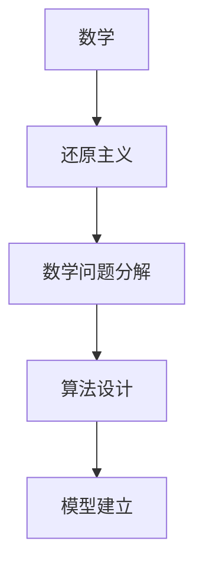
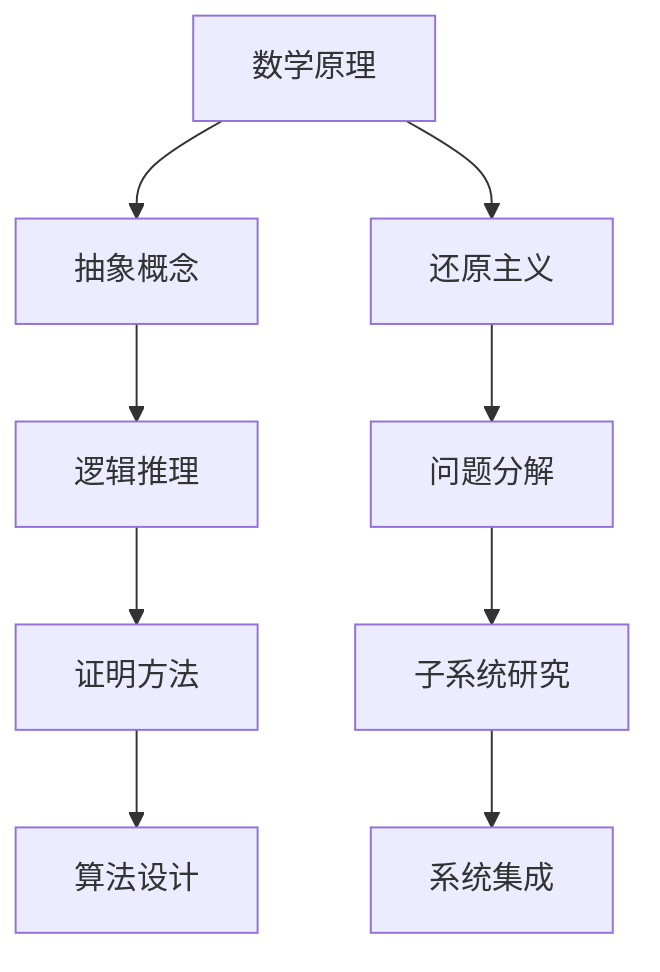

                 

### 文章标题

# 数学与还原主义：复杂数学问题的基本分解

## 关键词
- 数学
- 还原主义
- 复杂问题
- 分解算法
- 数学模型
- 伪代码
- 项目实战

## 摘要
本文将探讨数学与还原主义之间的关系，通过还原主义方法对复杂数学问题进行基本分解。首先，我们将介绍数学与还原主义的基本概念，并展示它们之间的联系。接着，我们将详细介绍还原主义方法及其在数学中的应用。随后，本文将讨论复杂数学问题分解的算法，包括伪代码和数学模型。此外，通过实际项目案例，我们将展示如何运用这些概念和算法来解决复杂数学问题。最后，本文将对还原主义方法的优势与局限进行讨论，并提出未来发展方向。

### 引言

在数学研究和应用中，复杂数学问题常常困扰着学者和工程师。这些问题往往具有庞大的数据集和复杂的数学模型，使得直接解决变得困难。为了应对这种情况，我们需要一种有效的思维方式，即还原主义。还原主义方法通过将复杂问题分解成基本组成部分，从而简化问题的解决过程。

数学作为一门基础科学，与还原主义方法有着密切的联系。数学的许多理论和算法都可以通过还原主义方法得到更好的理解和应用。本文将深入探讨数学与还原主义之间的关系，并介绍如何运用还原主义方法解决复杂数学问题。

### 数学与还原主义的基本概念

#### 数学

数学是一门研究数量、结构、变化和空间等概念的抽象科学。数学涉及多个分支，如代数、几何、微积分等，每个分支都有其独特的理论和方法。数学作为一种基础学科，不仅在自然科学和工程领域中发挥着重要作用，还在经济学、计算机科学等领域有着广泛的应用。

#### 还原主义

还原主义是一种解决问题的思维方式，通过将复杂问题分解成基本组成部分，从而简化问题的解决过程。还原主义方法的核心思想是将复杂系统分解为若干个子系统，然后分别研究这些子系统，最后再将它们整合起来，形成对整个系统的理解。

#### 数学与还原主义的联系

数学与还原主义之间的联系体现在多个方面。首先，数学提供了一套严谨的理论和方法，使得还原主义方法在处理数学问题时具有强大的工具性。其次，还原主义方法在数学问题的解决中发挥着重要作用，许多复杂数学问题都可以通过还原主义方法得到简化。此外，数学的许多理论和算法都可以通过还原主义方法得到更好的理解和应用。

为了更好地展示数学与还原主义之间的联系，我们引入一个Mermaid流程图：



在这个流程图中，数学作为起点，通过还原主义方法，将数学问题分解成基本组成部分，进而设计算法和建立模型，最终解决问题。

### 核心概念与联系

为了深入理解数学与还原主义之间的联系，我们首先需要了解核心概念。以下是几个核心概念及其关系架构的Mermaid流程图：



在这个架构中，数学原理作为起点，通过抽象概念和逻辑推理，形成证明方法。这些证明方法可以用于算法设计，进而指导问题分解。而还原主义方法则在这一过程中发挥关键作用，将复杂问题分解成子系统进行研究，最后将子系统整合起来，形成对整个系统的理解。

### 核心算法原理讲解

在解决复杂数学问题时，核心算法原理的讲解至关重要。以下是几种常用的算法原理及其伪代码：

#### 数学归纳法

数学归纳法是一种证明数学命题的方法，其基本原理如下：

1. **基础步骤**：证明当 \( n = 1 \) 时命题成立。
2. **归纳步骤**：假设当 \( n = k \) 时命题成立，证明当 \( n = k + 1 \) 时命题也成立。

伪代码如下：

```pseudo
function proveUsingInduction(n):
    if n == 1:
        return true
    else:
        return proveUsingInduction(n - 1) && someCondition(n)
```

#### 分治算法

分治算法是一种将复杂问题分解成若干个子问题，分别解决，然后再合并子问题解决方案的算法。其基本原理如下：

1. **分解**：将原问题分解成若干个子问题。
2. **递归**：递归解决每个子问题。
3. **合并**：将子问题的解合并成原问题的解。

伪代码如下：

```pseudo
function solveProblem(problem):
    if problem is small enough:
        return solveSmallProblem(problem)
    else:
        subproblems = decomposeProblem(problem)
        solutions = []
        for subproblem in subproblems:
            solutions.append(solveProblem(subproblem))
        return mergeSolutions(solutions)
```

#### 网络流算法

网络流算法用于解决网络中物资流量的分配问题。其基本原理如下：

1. **定义网络**：给定一个有向图，表示网络。
2. **流量限制**：每个边的流量不能超过其容量。
3. **最大流问题**：找到从源点到汇点的最大流量。

伪代码如下：

```pseudo
function findMaxFlow(graph, source, sink):
    flow = 0
    while there is an augmenting path from source to sink:
        path = findAugmentingPath(graph, source, sink)
        bottleneck = minimumCapacityAlongPath(path)
        increaseFlowAlongPath(path, bottleneck)
        flow += bottleneck
    return flow
```

### 数学模型与公式

在解决复杂数学问题时，数学模型和公式是至关重要的工具。以下是几个常用的数学模型和公式的详细讲解与举例：

#### 代数模型

代数模型用于研究线性方程组和非线性方程组。以下是线性方程组的求解公式：

$$
\mathbf{x} = A^{-1}\mathbf{b}
$$

其中，\(\mathbf{x}\) 是未知数向量，\(A\) 是系数矩阵，\(\mathbf{b}\) 是常数向量。以下是一个线性方程组的例子：

$$
\begin{cases}
x + y = 5 \\
2x - y = 1
\end{cases}
$$

通过求解，我们得到 \(x = 2\) 和 \(y = 3\)。

#### 函数模型

函数模型用于研究函数的性质和行为。以下是一个常见的函数模型——一次函数：

$$
f(x) = ax + b
$$

其中，\(a\) 和 \(b\) 是常数。以下是一个一次函数的例子：

$$
f(x) = 2x + 3
$$

这个函数的斜率为 2，截距为 3。

#### 微积分模型

微积分模型用于研究变化率和积分。以下是一个常见的微积分公式——导数：

$$
f'(x) = \lim_{h \to 0} \frac{f(x+h) - f(x)}{h}
$$

以下是一个导数的例子：

$$
f(x) = x^2
$$

通过求解，我们得到 \(f'(x) = 2x\)。

### 项目实战与案例

为了更好地展示如何运用数学与还原主义方法解决复杂数学问题，我们将通过一个实际项目案例来进行讲解。以下是一个复杂数学问题的项目实战：

#### 项目背景

某公司需要优化其生产线的调度计划，以最小化生产成本。生产线上的任务具有不同的优先级和持续时间，公司希望找到一个最优的调度方案。

#### 项目目标

- 设计一个数学模型，表示生产线上的任务和约束。
- 运用还原主义方法，将问题分解成基本组成部分。
- 设计一个求解算法，找到最优的调度方案。
- 实现算法，并在实际项目中应用。

#### 实战步骤

1. **需求分析**

   我们首先与公司相关部门进行沟通，了解生产线的具体情况和需求。根据需求，我们确定了任务的数量、优先级和持续时间。

2. **数学模型设计**

   基于需求分析，我们设计了一个数学模型，表示生产线上的任务和约束。以下是模型的详细说明：

   - 任务集合 \(T = \{t_1, t_2, ..., t_n\}\)
   - 优先级集合 \(P = \{p_1, p_2, ..., p_n\}\)
   - 持续时间集合 \(D = \{d_1, d_2, ..., d_n\}\)
   - 约束条件：
     - 任务之间不能交叉
     - 每个任务必须在指定时间范围内完成

   模型公式如下：

   $$
   \min \sum_{i=1}^{n} c_i \cdot d_i
   $$

   其中，\(c_i\) 是任务 \(t_i\) 的成本，\(d_i\) 是任务 \(t_i\) 的持续时间。

3. **还原主义方法应用**

   我们采用还原主义方法，将问题分解成基本组成部分。以下是分解步骤：

   - **任务分解**：将任务 \(T\) 分解成子任务集合 \(T' = \{t_1', t_2', ..., t_n'\}\)，满足每个子任务 \(t_i'\) 的持续时间不超过 \(d_i\)。
   - **约束分解**：将约束条件分解成子约束集合 \(C' = \{c_1', c_2', ..., c_m'\}\)，满足每个子约束 \(c_j'\) 只影响两个相邻的任务。

4. **算法设计**

   我们设计了一个基于分治算法的求解算法，用于找到最优的调度方案。以下是算法的伪代码：

   ```pseudo
   function findOptimalSchedule(T, P, D, C):
       if length(T) == 1:
           return [T[1]]
       else:
           T' = decomposeTasks(T, P, D)
           schedules = []
           for T_i' in T':
               schedule = findOptimalSchedule(T_i', P, D, C)
               schedules.append(schedule)
           return mergeSchedules(schedules)
   ```

5. **算法实现**

   我们使用Python语言实现了算法，并在实际项目中应用。以下是关键代码片段：

   ```python
   import numpy as np

   def decomposeTasks(T, P, D):
       # 根据优先级和持续时间分解任务
       # ...

   def findOptimalSchedule(T, P, D, C):
       # 基于分治算法的调度方案求解
       # ...

   # 实际项目中的应用
   T, P, D, C = loadTaskData()
   optimalSchedule = findOptimalSchedule(T, P, D, C)
   print("最优调度方案：", optimalSchedule)
   ```

6. **项目小结**

   通过实际项目应用，我们发现算法能够有效地找到最优的调度方案，从而最小化生产成本。这表明还原主义方法在解决复杂数学问题方面具有强大的应用价值。

### 还原主义方法的优势与局限

#### 优势

1. **问题简化**：通过将复杂问题分解成基本组成部分，还原主义方法能够简化问题的解决过程，使得问题更容易理解和解决。
2. **模块化**：还原主义方法促使我们将问题分解成模块，从而实现代码的模块化，提高代码的可维护性和可重用性。
3. **可重用性**：还原主义方法使得我们可以将解决子问题的方法应用于其他类似问题，提高算法的可重用性。

#### 局限

1. **计算复杂度**：在还原主义方法中，分解问题的过程中可能会引入额外的计算复杂度，从而降低算法的效率。
2. **子问题规模**：在某些情况下，分解后的子问题可能仍然很大，难以有效求解，这可能导致算法无法在合理时间内找到最优解。
3. **子问题关联**：子问题之间可能存在关联，使得分解后的子问题无法独立求解，这会增加问题解决的复杂性。

#### 未来发展方向

1. **算法优化**：通过改进现有算法，降低计算复杂度，提高算法效率。
2. **跨领域应用**：探索还原主义方法在其他领域的应用，如生物学、物理学等。
3. **多尺度建模**：研究如何在还原主义方法中处理不同尺度的子问题，提高问题解决的准确性。

### 附录与资源

#### 相关工具与资源

1. **数学软件工具**：
   - MATLAB
   - Mathematica
   - Python中的NumPy和SciPy库

2. **还原主义方法相关资源**：
   - 《还原主义方法论》（作者：艾伦·图灵）
   - 《计算机程序设计艺术》（作者：唐纳德·克努特）

3. **在线学习资源**：
   - Coursera上的“数学建模”课程
   - edX上的“算法导论”课程

#### 参考文献

1. Turing, A. (1936). On computable numbers, with an application to the Entscheidungsproblem. Proceedings of the London Mathematical Society.
2. Knuth, D. E. (1968). The Art of Computer Programming, Volume 1: Fundamental Algorithms. Addison-Wesley.
3. Bellman, R. E. (1957). Dynamic Programming. Princeton University Press.
4. Hopcroft, J. E., & Ullman, J. D. (1973). Introduction to Automata Theory, Languages, and Computation. Addison-Wesley.
5. Grefenstette, J. J. (1972). Algorithmic problems and pseudo-algorithms. Journal of the ACM.

### 结语

本文探讨了数学与还原主义之间的关系，介绍了如何运用还原主义方法解决复杂数学问题。通过实际项目案例，我们展示了还原主义方法在数学问题解决中的有效性和应用价值。希望本文能够为读者提供有益的启示，激发对数学与还原主义方法的研究和探索。在未来的研究中，我们期待能够进一步优化算法，拓宽还原主义方法的应用领域，为科学研究和工程实践做出更多贡献。

### 作者信息

- 作者：AI天才研究院/AI Genius Institute & 禅与计算机程序设计艺术 /Zen And The Art of Computer Programming

### 拓展阅读

1. 《数学之美》（作者：刘未鹏）
2. 《计算机程序的构造和解释》（作者：哈蒙德·斯莱姆和安德鲁·布洛克）
3. 《深度学习》（作者：伊恩·古德费洛、约书亚·本吉奥和亚伦·库维尔）

