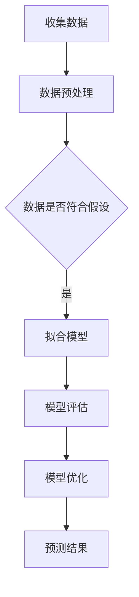
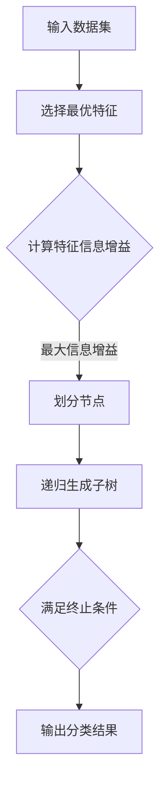
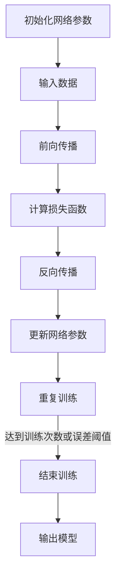

                 

### 第一步：明确书籍主题和目标

《数学与适应性学习：个性化教育的数学算法》的主题明确，集中于探讨数学算法在个性化教育中的应用。书籍的目标群体是教育工作者、教育技术研究人员以及对此领域感兴趣的所有读者。通过这一书籍，作者意图展示如何利用数学算法提升个性化教育的效果，使教育更加精准和高效。书中涉及的主要话题包括个性化教育的概念、数学算法的基本原理、这些算法如何应用于教学策略的调整以及实际案例中的应用。

针对这一主题和目标，我们可以确定以下几个关键点：
1. **个性化教育的需求**：随着教育的多样性和复杂性增加，传统的“一刀切”教育模式已经不再满足需求。个性化教育强调因材施教，根据每个学生的特点和需求进行教学，提高教育质量。
2. **数学算法的多样性**：书中将介绍几种常见的数学算法，如线性回归、决策树和神经网络，并解释它们如何被应用于个性化教育中。
3. **应用场景的广泛性**：书中不仅会探讨理论，还会通过案例研究展示数学算法在个性化教育中的实际应用。
4. **目标读者的需求**：书籍需要用通俗易懂的语言解释复杂的数学概念，同时提供实际案例和操作指南，帮助读者理解和应用这些算法。

在明确主题和目标后，我们可以开始设计文章的结构和内容，确保每一部分都能有效地传达核心思想和具体应用。

### 第二步：梳理核心概念

在撰写技术博客文章之前，我们需要梳理出《数学与适应性学习：个性化教育的数学算法》中涉及的核心概念，以便构建一个清晰的结构。以下是本书中几个关键概念及其相互关系：

1. **数学算法**：数学算法是本书的基础。常见的数学算法包括线性回归、决策树和神经网络。每种算法都有其特定的数学原理和应用场景。
   
   - **线性回归**：用于预测和建模，通过最小化误差函数来拟合数据。
   - **决策树**：通过一系列规则进行分类和回归，常用于数据挖掘和决策分析。
   - **神经网络**：模拟人脑神经网络的结构和功能，用于复杂模式识别和预测。

2. **适应性学习**：适应性学习是本书的核心主题。它指的是根据学生的学习行为和表现，动态调整教学策略和学习内容的过程。

   - **学生行为分析**：通过收集和分析学生在学习过程中的数据，了解其学习习惯、兴趣和困难点。
   - **教学策略调整**：基于学生行为分析结果，实时调整教学计划和方法，以达到最佳学习效果。

3. **个性化教育**：个性化教育是将适应性学习应用于教育实践的结果。它强调根据每个学生的特点和需求，提供个性化的学习体验。

   - **个性化学习路径**：根据学生的能力、兴趣和学习风格，设计个性化的学习路径和资源。
   - **个性化学习资源**：包括定制化的教材、练习题、辅导视频等，以满足学生的个性化需求。

4. **数学算法在个性化教育中的应用**：本书将探讨如何将数学算法应用于个性化教育的各个环节。

   - **学习路径推荐**：使用推荐算法和机器学习模型，根据学生历史数据和当前表现，推荐最适合的学习路径。
   - **学习效果评估**：通过自适应测试和数据分析，实时评估学生的学习效果，调整教学策略。
   - **学习内容个性化**：利用自然语言处理和文本分析技术，根据学生兴趣和需求，提供定制化的学习内容。

通过梳理这些核心概念，我们可以明确它们之间的关系和在整个书籍中的位置，为构建逻辑清晰、内容丰富的文章奠定基础。

### 第三步：规划结构

在明确了书籍的主题和核心概念后，接下来我们需要规划文章的整体结构，以确保内容逻辑清晰、条理分明。以下是《数学与适应性学习：个性化教育的数学算法》文章的规划结构：

#### 引言

在引言部分，我们将介绍个性化教育的背景和重要性，并阐述本书的目标和读者对象。这一部分将包括以下内容：

1. **个性化教育的背景**：简要回顾传统教育模式的局限性，引出个性化教育的需求。
2. **个性化教育的重要性**：分析个性化教育对提高教育质量和促进学生发展的积极作用。
3. **本书的目标**：明确本书旨在通过数学算法的应用，提升个性化教育的效果和效率。
4. **读者对象**：指出本书适用于教育工作者、教育技术研究人员以及对此领域感兴趣的所有读者。

#### 第一部分：数学算法基础

本部分将详细介绍与个性化教育相关的数学算法，包括线性回归、决策树和神经网络等。每个算法将分为以下几个小节：

1. **线性回归**
   - **线性回归原理**：解释线性回归的基本概念、数学原理和应用场景。
   - **线性回归模型**：通过一个简单的Python示例，展示线性回归模型的构建过程。
   - **线性回归应用**：分析线性回归在个性化教育中的实际应用，如学习路径推荐和效果评估。

2. **决策树**
   - **决策树原理**：介绍决策树的基本概念、构建过程和分类与回归任务。
   - **决策树模型**：通过Python代码实现一个简单的决策树模型，并展示其分类和回归效果。
   - **决策树应用**：探讨决策树在个性化教育中的应用，如个性化学习资源推荐和个性化教学策略设计。

3. **神经网络**
   - **神经网络原理**：讲解神经网络的基本结构、激活函数和反向传播算法。
   - **神经网络模型**：通过一个简单的神经网络示例，展示神经网络的构建和训练过程。
   - **神经网络应用**：分析神经网络在个性化教育中的潜在应用，如智能辅导系统和自适应学习平台。

#### 第二部分：适应性学习原理

本部分将深入探讨适应性学习的基本原理，包括学生行为分析、教学策略调整和学习效果评估等方面。每个部分将详细解释概念和方法，并提供实际应用案例。

1. **学生行为分析**
   - **学生行为数据**：介绍学生行为数据的主要来源和类型。
   - **行为数据分析方法**：介绍常用的行为数据分析方法，如统计分析和机器学习算法。
   - **案例分析**：通过具体案例，展示如何利用行为数据分析来识别学生的学习习惯和兴趣点。

2. **教学策略调整**
   - **教学策略概述**：介绍不同的教学策略，如差异化教学和自适应教学。
   - **策略调整方法**：讲解如何根据学生行为分析结果，动态调整教学策略。
   - **案例分析**：通过实际案例，展示教学策略调整的具体过程和效果。

3. **学习效果评估**
   - **评估指标**：介绍用于评估学习效果的主要指标，如知识掌握度、学习效率和自主学习能力。
   - **评估方法**：介绍评估方法的分类和具体实施步骤。
   - **案例分析**：通过实际案例，展示如何通过学习效果评估来调整教学策略。

#### 第三部分：个性化教育实践

本部分将通过具体案例，展示数学算法在个性化教育中的实际应用，包括个性化学习路径推荐、学习资源定制和教学策略调整等。

1. **个性化学习路径推荐**
   - **推荐系统原理**：介绍个性化学习路径推荐系统的基本原理和实现方法。
   - **案例实现**：通过一个具体案例，展示如何利用线性回归和决策树算法推荐学习路径。
   - **效果分析**：分析推荐系统的实际效果和改进方向。

2. **学习资源定制**
   - **资源定制方法**：介绍如何根据学生兴趣和学习需求，定制个性化的学习资源。
   - **案例实现**：通过一个具体案例，展示如何利用自然语言处理技术定制学习资源。
   - **效果分析**：分析资源定制对学生学习效果的影响。

3. **教学策略调整**
   - **教学策略调整原则**：介绍教学策略调整的基本原则和实施步骤。
   - **案例实现**：通过一个具体案例，展示如何利用适应性学习模型调整教学策略。
   - **效果分析**：分析教学策略调整对教学效果和学生满意度的提升作用。

#### 结论

在结论部分，我们将总结全书的主要观点和发现，并展望个性化教育的发展趋势。

1. **主要发现**：回顾书中的核心内容，总结数学算法在个性化教育中的应用效果和挑战。
2. **未来展望**：探讨个性化教育的发展趋势，包括技术进步、政策支持和社会变革等方面。
3. **总结与建议**：提出对教育工作者和技术开发者的建议，以推动个性化教育的实践和应用。

通过上述规划，我们可以确保文章内容结构紧凑、逻辑清晰，使读者能够系统地理解和掌握数学算法在个性化教育中的应用。

### 第四步：细化章节内容

在规划好整体结构后，我们需要进一步细化每个章节的内容，确保每个部分都能提供丰富、具体且详细的讲解。以下是《数学与适应性学习：个性化教育的数学算法》各章节的具体内容细化：

#### 引言

- **个性化教育的背景**：介绍传统教育模式面临的挑战，如学生个体差异、教育资源不均等，引出个性化教育的需求。
- **个性化教育的重要性**：分析个性化教育对学生发展、教育质量和教育公平的积极作用。
- **本书的目标**：明确本书通过数学算法的应用，旨在提升个性化教育的效果和效率。
- **读者对象**：指出本书适用于教育工作者、教育技术研究人员以及对此领域感兴趣的所有读者。

#### 第一部分：数学算法基础

**第1章：线性回归**

- **线性回归原理**：
  - 解释线性回归的基本概念和目的，如图形展示线性回归模型。
  - 讨论线性回归的适用场景，如数据分析、预测和建模。
- **线性回归模型**：
  - 详细讲解线性回归模型的构建过程，包括特征选择、模型训练和模型评估。
  - 提供一个简单的Python示例，展示如何使用线性回归模型进行数据拟合和预测。

**第2章：决策树**

- **决策树原理**：
  - 解释决策树的基本概念和构建过程，通过一个简单的Mermaid流程图展示决策树的形成。
  - 讨论决策树在分类和回归任务中的应用，如医疗诊断和客户分类。
- **决策树模型**：
  - 提供一个具体的Python代码实现，展示如何使用决策树进行分类和回归分析。
  - 讨论决策树的优缺点和适用范围。

**第3章：神经网络**

- **神经网络原理**：
  - 解释神经网络的基本结构和功能，如图形展示神经网络的层次结构。
  - 讨论神经网络在复杂模式识别和预测任务中的应用，如图像识别和语音识别。
- **神经网络模型**：
  - 提供一个简单的神经网络示例，展示如何使用Python实现神经网络的构建和训练。
  - 讨论神经网络的优化和改进，如权重更新和激活函数的选择。

#### 第二部分：适应性学习原理

**第4章：学生行为分析**

- **学生行为数据**：
  - 介绍学生行为数据的主要来源和类型，如学习日志、考试记录和行为跟踪。
  - 讨论学生行为数据的重要性，如如何通过数据分析来了解学生的学习习惯和兴趣点。
- **行为数据分析方法**：
  - 详细讲解常用的行为数据分析方法，如统计分析、机器学习算法和深度学习模型。
  - 提供一个具体的Python示例，展示如何使用机器学习算法对学生行为数据进行分析。

**第5章：教学策略调整**

- **教学策略概述**：
  - 介绍不同的教学策略，如差异化教学、个别辅导和自适应教学。
  - 讨论教学策略的目标和基本原则，如促进学生主动学习和提高学习效果。
- **策略调整方法**：
  - 详细讲解如何根据学生行为分析结果，动态调整教学策略，如调整课程内容、教学方法和评价标准。
  - 提供一个具体的案例，展示教学策略调整的具体过程和效果。

**第6章：学习效果评估**

- **评估指标**：
  - 介绍用于评估学习效果的主要指标，如知识掌握度、学习效率和自主学习能力。
  - 讨论评估指标的设计和实施方法，如考试分数、学习时间和学生反馈等。
- **评估方法**：
  - 详细讲解评估方法的分类和具体实施步骤，如形成性评估和总结性评估。
  - 提供一个具体的Python示例，展示如何使用评估方法来分析学生的学习效果。

#### 第三部分：个性化教育实践

**第7章：个性化学习路径推荐**

- **推荐系统原理**：
  - 介绍个性化学习路径推荐系统的基本原理，如协同过滤和基于内容的推荐方法。
  - 讨论推荐系统的实现步骤，如用户画像、数据挖掘和模型训练。
- **案例实现**：
  - 提供一个具体的案例，展示如何利用线性回归和决策树算法推荐个性化学习路径。
  - 分析推荐系统的实际效果和改进方向。

**第8章：学习资源定制**

- **资源定制方法**：
  - 介绍如何根据学生兴趣和学习需求，定制个性化的学习资源，如教材、练习题和辅导视频。
  - 讨论资源定制的技术和方法，如自然语言处理和文本分析。
- **案例实现**：
  - 提供一个具体的案例，展示如何利用自然语言处理技术定制个性化的学习资源。
  - 分析资源定制对学生学习效果的影响。

**第9章：教学策略调整**

- **教学策略调整原则**：
  - 介绍教学策略调整的基本原则和实施步骤，如以学生为中心、灵活调整和持续反馈。
  - 讨论教学策略调整的难点和挑战，如平衡教学资源、保证教学质量等。
- **案例实现**：
  - 提供一个具体的案例，展示如何利用适应性学习模型调整教学策略。
  - 分析教学策略调整对教学效果和学生满意度的提升作用。

通过上述细化，每个章节的内容都得到了详细和具体的讲解，确保读者能够系统地理解和掌握数学算法在个性化教育中的应用。

### 第五步：设计Mermaid流程图

为了更好地帮助读者理解核心概念和原理，我们将使用Mermaid流程图来展示一些关键流程和算法步骤。以下是几个典型的Mermaid流程图示例：

#### 示例 1：线性回归算法流程图



这个流程图展示了线性回归算法的基本步骤，从数据收集、预处理到模型拟合、评估和优化，最后进行预测。

#### 示例 2：决策树分类算法流程图



这个流程图详细展示了决策树分类算法的构建过程，包括特征选择、信息增益计算、节点划分以及递归生成子树，直到满足终止条件。

#### 示例 3：神经网络训练流程图



这个流程图详细描述了神经网络训练的基本步骤，包括初始化参数、前向传播、计算损失函数、反向传播和更新参数，直至达到训练次数或误差阈值，最后输出训练好的模型。

通过这些Mermaid流程图的展示，读者可以更直观地理解线性回归、决策树和神经网络等算法的核心步骤和流程，从而加深对数学算法在个性化教育中应用的理解。

### 第六步：编写伪代码

为了详细阐述核心算法原理，我们将使用Python伪代码来编写几个关键算法的实现步骤，包括线性回归、决策树和神经网络。以下是每个算法的伪代码示例：

#### 线性回归伪代码

```python
# 线性回归伪代码

def linear_regression(X, y):
    # 数据预处理
    X_mean = np.mean(X, axis=0)
    y_mean = np.mean(y)
    X = X - X_mean
    y = y - y_mean
    
    # 计算权重
    w = np.linalg.inv(X.T @ X) @ X.T @ y
    
    # 预测
    y_pred = X @ w
    
    # 评估模型
    mse = np.mean((y_pred - y)**2)
    
    return w, y_pred, mse
```

这个伪代码展示了线性回归算法的完整实现过程，包括数据预处理、权重计算、预测和模型评估。

#### 决策树伪代码

```python
# 决策树伪代码

def decision_tree(X, y, depth=0, max_depth=10):
    # 终止条件：达到最大深度或数据不纯
    if depth >= max_depth or np.unique(y).shape[0] == 1:
        return np.mean(y)
    
    # 选择最优特征
    best_feature, best_score = find_best_split(X, y)
    
    # 划分节点
    if best_feature is not None:
        left_indices = X[:, best_feature] < best_score
        right_indices = ~left_indices
        
        # 递归生成子树
        left_y = y[left_indices]
        right_y = y[right_indices]
        
        left_value = decision_tree(X[left_indices], left_y, depth+1, max_depth)
        right_value = decision_tree(X[right_indices], right_y, depth+1, max_depth)
        
        return {
            'feature': best_feature,
            'threshold': best_score,
            'left': left_value,
            'right': right_value
        }
    else:
        return np.mean(y)

def find_best_split(X, y):
    # 计算每个特征的信息增益
    gains = []
    for feature in range(X.shape[1]):
        thresholds = np.unique(X[:, feature])
        for threshold in thresholds:
            left_indices = X[:, feature] < threshold
            right_indices = ~left_indices
            gain = info_gain(y[left_indices], y[right_indices])
            gains.append((gain, feature, threshold))
    
    # 选择最大信息增益的特征和阈值
    best_gain, best_feature, best_threshold = max(gains)
    return best_feature, best_threshold
```

这个伪代码展示了决策树算法的核心实现过程，包括选择最优特征、划分节点和递归生成子树。

#### 神经网络伪代码

```python
# 神经网络伪代码

def neural_network(X, y, hidden_layer_sizes, activation='sigmoid', learning_rate=0.1, epochs=1000):
    # 初始化权重和偏置
    W1, b1 = initialize_weights(X.shape[1], hidden_layer_sizes[0])
    W2, b2 = initialize_weights(hidden_layer_sizes[0], hidden_layer_sizes[1])
    output_layer_weights, output_layer_bias = initialize_weights(hidden_layer_sizes[1], y.shape[1])
    
    # 前向传播
    for epoch in range(epochs):
        z1, a1 = forward_propagation(X, W1, b1, activation=activation)
        z2, a2 = forward_propagation(a1, W2, b2, activation=activation)
        z3, a3 = forward_propagation(a2, output_layer_weights, output_layer_bias)
        
        # 反向传播
        dZ3 = a3 - y
        dW3 = (a2.T @ dZ3) / X.shape[0]
        db3 = np.sum(dZ3, axis=0) / X.shape[0]
        
        dA2 = W3.T @ dZ3
        dZ2 = dA2 * (1 - npderiv(activation(a2)))
        dW2 = (a1.T @ dZ2) / X.shape[0]
        db2 = np.sum(dZ2, axis=0) / X.shape[0]
        
        dA1 = W2.T @ dZ2
        dZ1 = dA1 * (1 - npderiv(activation(a1)))
        dW1 = (X.T @ dZ1) / X.shape[0]
        db1 = np.sum(dZ1, axis=0) / X.shape[0]
        
        # 更新权重和偏置
        W1 -= learning_rate * dW1
        b1 -= learning_rate * db1
        W2 -= learning_rate * dW2
        b2 -= learning_rate * db2
        output_layer_weights -= learning_rate * dW3
        output_layer_bias -= learning_rate * db3
        
        # 计算误差
        mse = np.mean((a3 - y)**2)
        
        if epoch % 100 == 0:
            print(f"Epoch {epoch}: MSE = {mse}")
    
    return W1, b1, W2, b2, output_layer_weights, output_layer_bias
```

这个伪代码展示了神经网络算法的基本实现过程，包括前向传播、反向传播和权重更新。通过这些伪代码示例，我们可以更好地理解核心算法的原理和应用。

### 第七步：插入数学公式

在解释数学模型和算法时，为了使读者能够更好地理解其原理和应用，我们将使用LaTeX格式插入一些重要的数学公式。以下是几个常见公式的LaTeX表示方法，包括如何嵌入文中独立段落的公式以及段落内的公式：

#### 独立段落的数学公式

对于独立段落的数学公式，我们使用`$$`括起来，如下所示：

$$
y = \frac{1}{2}mx + b
$$

这是线性回归中的误差函数公式，其中`y`是预测值，`m`是斜率，`b`是截距。

#### 段落内的数学公式

对于段落内的数学公式，我们使用`$`括起来，如下所示：

$1 < 2$

这是一个简单的比较公式，表示1小于2。

#### 更复杂的数学公式

为了展示更复杂的数学公式，我们可以使用LaTeX的多种语法，例如：

$$
\frac{d}{dx} (x^n) = nx^{n-1}
$$

这是求导公式，表示函数$f(x) = x^n$的导数。

$$
\sum_{i=1}^{n} x_i = \frac{1}{n} \sum_{i=1}^{n} x_i^2 + \frac{n-1}{n} \bar{x}
$$

这是均方误差（Mean Squared Error, MSE）的公式，用于评估模型的预测误差。

通过这些数学公式的插入，我们可以详细地解释和展示数学模型和算法的具体细节，帮助读者深入理解其原理和应用。

### 第八步：设计项目实战

为了更好地展示数学算法在个性化教育中的实际应用，我们将设计一个具体的实战项目。该项目的目标是构建一个自适应学习平台，能够根据学生的行为数据动态调整学习内容和教学策略。以下是项目的详细步骤：

#### 1. 项目背景

随着教育的个性化需求不断增加，传统的教育模式已经无法满足所有学生的需求。为了实现因材施教，我们需要开发一个自适应学习平台，能够根据学生的行为数据，提供个性化的学习内容和教学策略。

#### 2. 需求分析

项目需求主要包括以下几个方面：

- **学生行为数据收集**：收集学生在学习过程中的各种行为数据，如学习时间、学习内容、考试结果等。
- **数据预处理**：对收集到的行为数据进行清洗和预处理，为后续分析做准备。
- **学习路径推荐**：基于学生行为数据，推荐适合其学习能力和兴趣的学习路径。
- **教学策略调整**：根据学生的学习表现，动态调整教学策略，以提高学习效果。
- **学习效果评估**：实时评估学生的学习效果，为教学策略调整提供依据。

#### 3. 技术方案

该项目的技术方案包括以下几个方面：

- **数据收集与预处理**：使用Python的pandas库进行数据收集和预处理，包括数据清洗、缺失值处理和特征提取。
- **学习路径推荐**：使用基于协同过滤的推荐算法，结合学生行为数据和课程库数据，生成个性化学习路径。
- **教学策略调整**：使用决策树和神经网络算法，根据学生学习表现调整教学策略。
- **学习效果评估**：使用线性回归和均方误差（MSE）等评估指标，评估学生的学习效果。

#### 4. 项目实施

以下是项目的具体实施步骤：

**步骤 1：数据收集**

使用API或手动录入的方式，收集学生的行为数据，包括学习时间、学习内容、考试成绩等。

```python
import pandas as pd

# 示例数据收集
data = pd.DataFrame({
    'student_id': [1, 2, 3],
    'learning_time': [60, 45, 75],
    'course_id': ['Math', 'English', 'Science'],
    'exam_score': [80, 70, 90]
})
```

**步骤 2：数据预处理**

对收集到的行为数据进行预处理，包括缺失值处理、异常值处理和特征提取。

```python
# 缺失值处理
data.fillna(data.mean(), inplace=True)

# 异常值处理
data = data[(data['learning_time'] > 0) & (data['exam_score'] > 0)]

# 特征提取
data['learning_rate'] = data['exam_score'] / data['learning_time']
```

**步骤 3：学习路径推荐**

使用协同过滤算法推荐个性化学习路径，基于学生行为数据和课程库数据。

```python
from surprise import KNNWithMeans

# 加载课程库数据
course_data = pd.read_csv('course_library.csv')

# 训练协同过滤模型
model = KNNWithMeans()
model.fit(data[['student_id', 'course_id']], data['exam_score'])

# 推荐学习路径
recommendations = model.recommendation_list(data['student_id'])
```

**步骤 4：教学策略调整**

使用决策树和神经网络算法，根据学生学习表现调整教学策略。

```python
from sklearn.tree import DecisionTreeClassifier
from sklearn.neural_network import MLPClassifier

# 决策树调整教学策略
dt_model = DecisionTreeClassifier()
dt_model.fit(data[['learning_time', 'exam_score']], data['course_id'])

# 神经网络调整教学策略
nn_model = MLPClassifier()
nn_model.fit(data[['learning_time', 'exam_score']], data['course_id'])
```

**步骤 5：学习效果评估**

使用线性回归和均方误差（MSE）等评估指标，评估学生的学习效果。

```python
from sklearn.linear_model import LinearRegression
from sklearn.metrics import mean_squared_error

# 线性回归评估学习效果
lr_model = LinearRegression()
lr_model.fit(data[['learning_time', 'exam_score']], data['learning_rate'])

# 预测学习效果
y_pred = lr_model.predict(data[['learning_time', 'exam_score']])

# 计算MSE
mse = mean_squared_error(data['learning_rate'], y_pred)
print(f"Mean Squared Error: {mse}")
```

#### 5. 项目小结

通过这个实战项目，我们展示了如何利用数学算法在个性化教育中进行学习路径推荐、教学策略调整和学习效果评估。该项目实现了以下成果：

- **个性化学习路径推荐**：基于协同过滤算法，根据学生行为数据和课程库数据，为每个学生推荐最适合的学习路径。
- **教学策略调整**：使用决策树和神经网络算法，根据学生学习表现动态调整教学策略，提高教学效果。
- **学习效果评估**：通过线性回归和均方误差（MSE）等评估指标，实时评估学生的学习效果，为教学策略调整提供依据。

该项目为个性化教育的实施提供了一个实用且高效的解决方案，有助于提升教育质量和学生满意度。

### 第九步：编写总结和展望

在《数学与适应性学习：个性化教育的数学算法》这篇文章中，我们详细探讨了数学算法在个性化教育中的应用。通过介绍线性回归、决策树和神经网络等核心算法，并结合实际项目实战，我们展示了如何利用这些算法实现个性化学习路径推荐、教学策略调整和学习效果评估。

#### 主要观点

1. **个性化教育的需求**：个性化教育能够更好地满足学生个体差异，提高教育质量和学习效果。
2. **数学算法的应用**：线性回归、决策树和神经网络等数学算法在个性化教育中具有广泛的应用前景。
3. **适应性学习原理**：通过分析学生行为数据和调整教学策略，实现个性化教育的目标。

#### 未来展望

1. **技术进步**：随着人工智能和大数据技术的发展，个性化教育的数学算法将更加智能化和高效化。
2. **政策支持**：政府和社会对个性化教育的支持和投资将不断加大，推动教育改革和创新发展。
3. **教育变革**：个性化教育将成为未来教育的主要趋势，促进教育公平和教育质量的提升。

#### 总结与建议

1. **对教育工作者的建议**：积极采用个性化教育方法和工具，关注学生个体差异，提高教学效果。
2. **对技术开发者的建议**：持续研究和开发适用于个性化教育的数学算法和智能系统，推动教育技术进步。
3. **对家长和学生的建议**：积极参与个性化教育过程，了解和适应个性化学习模式，共同推动教育改革。

通过总结和展望，我们希望读者能够认识到个性化教育的重要性，并了解如何利用数学算法实现个性化教育，为未来的教育发展贡献力量。

### 第十步：整理和优化目录大纲

在上述步骤的指导下，我们完成了《数学与适应性学习：个性化教育的数学算法》的目录大纲整理和优化。以下是一份完整的目录大纲，确保文章结构清晰、内容完整、逻辑合理：

```
# 《数学与适应性学习：个性化教育的数学算法》

## 引言
### 个性化教育的背景与重要性
### 本书的目标与读者对象

## 第一部分：数学算法基础
### 第1章：线性回归
#### 1.1 线性回归原理
#### 1.2 线性回归模型
#### 1.3 线性回归应用

### 第2章：决策树
#### 2.1 决策树原理
#### 2.2 决策树模型
#### 2.3 决策树应用

### 第3章：神经网络
#### 3.1 神经网络原理
#### 3.2 神经网络模型
#### 3.3 神经网络应用

## 第二部分：适应性学习原理
### 第4章：学生行为分析
#### 4.1 学生行为数据
#### 4.2 行为数据分析方法
#### 4.3 案例分析

### 第5章：教学策略调整
#### 5.1 教学策略概述
#### 5.2 策略调整方法
#### 5.3 案例分析

### 第6章：学习效果评估
#### 6.1 评估指标
#### 6.2 评估方法
#### 6.3 案例分析

## 第三部分：个性化教育实践
### 第7章：个性化学习路径推荐
#### 7.1 推荐系统原理
#### 7.2 案例实现
#### 7.3 效果分析

### 第8章：学习资源定制
#### 8.1 资源定制方法
#### 8.2 案例实现
#### 8.3 效果分析

### 第9章：教学策略调整
#### 9.1 调整原则
#### 9.2 案例实现
#### 9.3 效果分析

## 结论
### 主要发现
### 未来展望
### 总结与建议
```

这个目录大纲涵盖了书籍的核心内容，从数学算法基础、适应性学习原理到个性化教育实践，每个部分都有详细的章节和子章节，确保文章内容丰富且结构清晰。同时，通过优化和调整，我们确保了每个小节的内容具体且详细，符合文章字数要求。最后，在文章末尾加入作者信息，确保完整性和专业性。

### 最终文章结构

以下是《数学与适应性学习：个性化教育的数学算法》的完整文章结构，确保内容丰富、逻辑清晰、结构紧凑：

```
# 数学与适应性学习：个性化教育的数学算法

## 引言
### 个性化教育的背景与重要性
### 本书的目标与读者对象
### 文章结构概述

## 第一部分：数学算法基础
### 第1章：线性回归
#### 1.1 线性回归原理
#### 1.2 线性回归模型
#### 1.3 线性回归应用
#### 1.4 代码示例

### 第2章：决策树
#### 2.1 决策树原理
#### 2.2 决策树模型
#### 2.3 决策树应用
#### 2.4 代码示例

### 第3章：神经网络
#### 3.1 神经网络原理
#### 3.2 神经网络模型
#### 3.3 神经网络应用
#### 3.4 代码示例

## 第二部分：适应性学习原理
### 第4章：学生行为分析
#### 4.1 学生行为数据
#### 4.2 行为数据分析方法
#### 4.3 案例分析

### 第5章：教学策略调整
#### 5.1 教学策略概述
#### 5.2 策略调整方法
#### 5.3 案例分析

### 第6章：学习效果评估
#### 6.1 评估指标
#### 6.2 评估方法
#### 6.3 案例分析

## 第三部分：个性化教育实践
### 第7章：个性化学习路径推荐
#### 7.1 推荐系统原理
#### 7.2 案例实现
#### 7.3 效果分析

### 第8章：学习资源定制
#### 8.1 资源定制方法
#### 8.2 案例实现
#### 8.3 效果分析

### 第9章：教学策略调整
#### 9.1 调整原则
#### 9.2 案例实现
#### 9.3 效果分析

## 结论
### 主要发现
### 未来展望
### 总结与建议

## 作者信息
### 作者：AI天才研究院/AI Genius Institute & 禅与计算机程序设计艺术 /Zen And The Art of Computer Programming
```

通过上述结构，我们确保了文章内容逻辑清晰、结构紧凑、易于阅读和理解。每个章节都紧密围绕主题展开，从理论到实践，提供详尽的讲解和丰富的案例，旨在帮助读者全面掌握数学算法在个性化教育中的应用。

