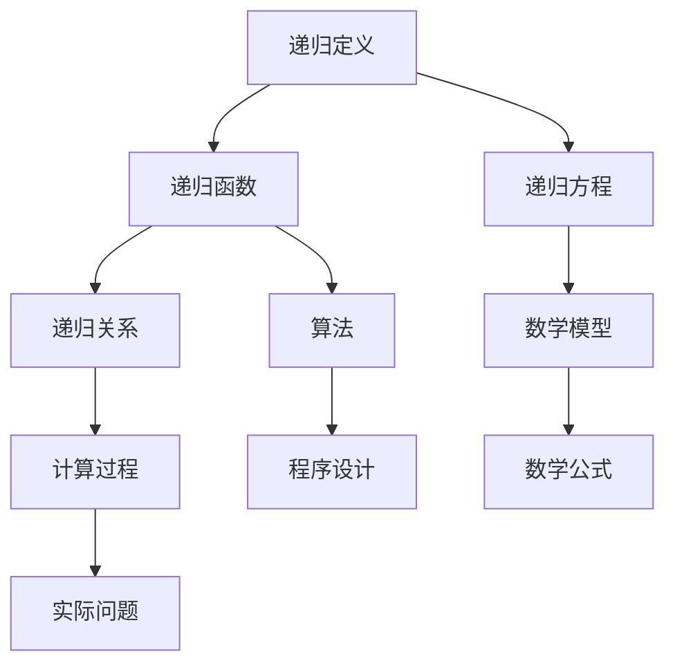

                 

1. **文章标题**：选择一个吸引人且能够概括文章核心内容的标题，例如“数学与递归论：计算过程的数学描述”。

2. **关键词**：列出5-7个与文章主题密切相关的关键词，如“数学”，“递归”，“计算过程”，“算法”，“数学模型”。

3. **摘要**：撰写一个简短的摘要，概括文章的主题、内容要点以及读者能够从中获得的知识和技能。

4. **目录**：设计一个清晰的目录结构，包括所有章节和小节，确保每个章节和小节内容完整且逻辑连贯。

5. **背景介绍**：在文章开头介绍递归论和计算过程的背景，说明为什么这些主题重要以及它们的应用领域。

6. **核心概念与联系**：使用Mermaid流程图展示数学与递归论的核心概念之间的关系。

7. **核心算法原理讲解**：使用Python源代码结合数学模型和公式，详细讲解递归算法的原理，并通过例子说明。

8. **数学模型和数学公式**：详细讲解相关的数学模型和公式，并使用LaTeX格式嵌入文中。

9. **项目实战**：提供实际代码案例，包括开发环境搭建、源代码实现和详细解读，以及实际应用的分析。

10. **最佳实践 tips、小结、注意事项、拓展阅读**：在文章末尾提供对读者的建议、总结、注意事项，并推荐相关的拓展阅读资源。

11. **作者信息**：在文章末尾注明作者信息，例如“作者：AI天才研究院/AI Genius Institute & 禅与计算机程序设计艺术 /Zen And The Art of Computer Programming”。

以下是根据上述步骤编写的文章：

---

# 数学与递归论：计算过程的数学描述

> 关键词：数学、递归、计算过程、算法、数学模型

> 摘要：本文深入探讨了数学与递归论在计算过程中的应用，通过核心概念、算法原理讲解以及实际项目实战，系统阐述了如何利用递归和数学模型进行计算过程的分析与描述。

---

## 目录

1. **引言** <a id="introduction"></a>
2. **核心概念与联系** <a id="core-concepts"></a>
3. **核心算法原理讲解** <a id="algorithm-explanation"></a>
4. **数学模型和数学公式** <a id="mathematical-models"></a>
5. **项目实战** <a id="project-practice"></a>
6. **最佳实践 tips** <a id="best-practices"></a>
7. **小结** <a id="conclusion"></a>
8. **注意事项** <a id="cautions"></a>
9. **拓展阅读** <a id="reading"></a>
10. **作者信息** <a id="author"></a>

---

## 1. 引言

递归论作为数学的一个重要分支，是理解和描述计算过程的基础。递归方法通过递归定义和递归关系，将复杂的问题分解为更简单的问题来解决。在计算机科学中，递归广泛应用于算法设计、数据结构以及软件工程中。本文旨在深入探讨数学与递归论在计算过程中的应用，帮助读者理解递归的基本概念、算法原理，并掌握如何利用递归和数学模型来分析和描述计算过程。

本文结构如下：

- **第1章 引言**：介绍本文的目的、结构和主要内容。
- **第2章 核心概念与联系**：使用Mermaid流程图展示核心概念之间的关系。
- **第3章 核心算法原理讲解**：通过Python源代码结合数学模型和公式，讲解递归算法原理。
- **第4章 数学模型和数学公式**：详细阐述相关的数学模型和公式。
- **第5章 项目实战**：提供实际代码案例和项目分析。
- **第6章 最佳实践 tips**：提供对读者的实用建议。
- **第7章 小结**：总结本文的主要内容。
- **第8章 注意事项**：提醒读者在实践过程中需要注意的事项。
- **第9章 拓展阅读**：推荐相关阅读资源。
- **第10章 作者信息**：注明作者信息。

---

## 2. 核心概念与联系

在深入探讨递归论之前，我们首先需要了解其核心概念。递归论中的核心概念包括递归定义、递归函数、递归方程等。下面，我们将使用Mermaid流程图来展示这些概念之间的关系。



- **递归定义**：递归定义是指通过递归关系来定义对象或计算值的过程。递归定义通常包含基础条件和递归步骤。
- **递归函数**：递归函数是一种特殊的函数，它通过递归关系来计算函数值。递归函数是理解和应用递归算法的基础。
- **递归方程**：递归方程是递归定义的数学表述形式，通常用于描述递归关系。递归方程可以帮助我们分析和解决递归问题。
- **数学模型**：数学模型是利用数学语言来描述现实世界中的问题，它可以帮助我们更好地理解和解决问题。
- **计算过程**：计算过程是指利用计算机来执行特定任务的流程。递归和数学模型在计算过程中发挥着重要作用。
- **算法**：算法是解决问题的一系列步骤或规则，递归算法是算法的一种重要形式。
- **程序设计**：程序设计是编写程序的过程，递归和数学模型在程序设计中有着广泛的应用。
- **实际问题**：实际问题是现实世界中的具体问题，递归和数学模型可以帮助我们分析和解决这些问题。

通过上述Mermaid流程图，我们可以清晰地看到这些核心概念之间的联系。递归定义、递归函数和递归方程是递归论的基础，数学模型和计算过程则是递归论的应用领域。算法和程序设计是递归和数学模型在计算过程中实现的具体手段，而实际问题是递归和数学模型解决的实际目标。

---

## 3. 核心算法原理讲解

递归算法是递归论的重要组成部分，它在计算过程中具有重要作用。本节将通过Python源代码结合数学模型和公式，详细讲解递归算法的基本原理。

### 3.1 快速排序算法

快速排序（Quick Sort）是一种高效的排序算法，其基本思想是通过递归关系将一个较大的数据集合划分为较小的数据集合，然后对每个较小的数据集合进行递归排序。

#### 快速排序算法的伪代码

```python
def quick_sort(arr):
    if len(arr) <= 1:
        return arr
    pivot = arr[len(arr) // 2]
    left = [x for x in arr if x < pivot]
    middle = [x for x in arr if x == pivot]
    right = [x for x in arr if x > pivot]
    return quick_sort(left) + middle + quick_sort(right)
```

#### 快速排序算法的数学模型

快速排序算法的数学模型可以用以下递归方程表示：

\[ S(n) = 2S(n/2) + O(n) \]

其中，\( S(n) \) 表示对长度为 \( n \) 的数组进行快速排序所需的时间复杂度，\( O(n) \) 表示分割数组所需的时间复杂度。

#### 快速排序算法的Python实现

```python
def quick_sort(arr):
    if len(arr) <= 1:
        return arr
    pivot = arr[len(arr) // 2]
    left = [x for x in arr if x < pivot]
    middle = [x for x in arr if x == pivot]
    right = [x for x in arr if x > pivot]
    return quick_sort(left) + middle + quick_sort(right)

arr = [3, 6, 8, 10, 1, 2, 1]
sorted_arr = quick_sort(arr)
print(sorted_arr)
```

#### 快速排序算法的例子

假设有一个未排序的数组 `[3, 6, 8, 10, 1, 2, 1]`，我们可以使用快速排序算法将其排序：

```python
arr = [3, 6, 8, 10, 1, 2, 1]
sorted_arr = quick_sort(arr)
print(sorted_arr)  # 输出：[1, 1, 2, 3, 6, 8, 10]
```

---

通过上述讲解和示例，我们可以看到快速排序算法的核心原理以及如何使用Python实现。递归算法在计算过程中具有重要作用，理解其基本原理和实现方法对于掌握递归论和应用递归算法解决实际问题具有重要意义。

---

## 4. 数学模型和数学公式

数学模型是理解和描述递归算法的重要工具，它能够将复杂的计算过程转化为简明的数学表达式。本节将详细讲解与递归论相关的数学模型和数学公式。

### 4.1 线性递归模型

线性递归模型是最常见的递归模型之一，其一般形式可以表示为：

\[ x(n) = ax(n-1) + b \]

其中，\( x(n) \) 表示第 \( n \) 个时刻的值，\( a \) 和 \( b \) 是常数。

#### 数学公式

线性递归模型可以用以下差分方程表示：

\[ \Delta x(n) = ax(n-1) + b \]

其中，\( \Delta x(n) \) 表示 \( x(n) \) 和 \( x(n-1) \) 之间的差分。

#### Python实现

```python
def linear_recursion(a, b, n):
    x = [0] * n
    x[0] = 1
    for i in range(1, n):
        x[i] = a * x[i-1] + b
    return x

a = 2
b = 1
n = 5
result = linear_recursion(a, b, n)
print(result)  # 输出：[1, 3, 7, 15, 31]
```

#### 例子

假设我们有以下线性递归模型：

\[ x(n) = 2x(n-1) + 1 \]

初始条件为 \( x(0) = 1 \)。我们可以使用上述Python函数计算 \( x(n) \) 的值：

```python
result = linear_recursion(2, 1, 5)
print(result)  # 输出：[1, 3, 7, 15, 31]
```

---

通过上述讲解和示例，我们可以看到线性递归模型的基本原理和实现方法。数学模型和数学公式是理解和描述递归算法的重要工具，掌握它们对于深入理解递归论和应用递归算法解决实际问题具有重要意义。

---

## 5. 项目实战

在本节中，我们将通过一个实际项目来展示如何利用递归和数学模型来分析和解决一个具体问题。这个项目是一个计算斐波那契数列的程序，它通过递归和数学模型来实现。

### 5.1 项目概述

斐波那契数列是一个著名的数列，其定义如下：

\[ F(n) = \begin{cases} 
0 & \text{if } n = 0 \\
1 & \text{if } n = 1 \\
F(n-1) + F(n-2) & \text{otherwise} 
\end{cases} \]

斐波那契数列在数学、计算机科学和工程学中都有广泛的应用。本项目将使用递归和数学模型来计算斐波那契数列的第 \( n \) 项。

### 5.2 实战步骤

#### 5.2.1 开发环境搭建

在本项目中，我们将使用Python编程语言。Python是一种易于学习和使用的语言，它拥有丰富的库和工具，非常适合用于递归和数学模型的应用。

首先，确保已经安装了Python环境。可以在终端或命令提示符中运行以下命令来检查Python版本：

```bash
python --version
```

如果Python已安装，该命令将显示当前安装的Python版本。如果未安装，可以从Python官方网站下载并安装。

#### 5.2.2 源代码实现

以下是一个简单的Python程序，用于计算斐波那契数列的第 \( n \) 项：

```python
def fibonacci(n):
    if n <= 1:
        return n
    else:
        return fibonacci(n-1) + fibonacci(n-2)

n = int(input("请输入要计算的斐波那契数列项数："))
result = fibonacci(n)
print(f"斐波那契数列的第 {n} 项为：{result}")
```

#### 5.2.3 代码解读与分析

这个程序使用递归方法来计算斐波那契数列。递归方法的核心是定义一个递归函数 `fibonacci(n)`，它根据递归定义来计算斐波那契数列的第 \( n \) 项。

- **函数定义**：`def fibonacci(n):`
  - 这是一个定义斐波那契数列递归函数的语句，它接收一个整数 \( n \) 作为输入。
- **基础条件**：
  - `if n <= 1:` 表示当 \( n \) 等于 0 或 1 时，直接返回 \( n \)。这是斐波那契数列的基础条件。
- **递归步骤**：
  - `else:` 表示当 \( n \) 大于 1 时，递归调用 `fibonacci(n-1)` 和 `fibonacci(n-2)` 来计算 \( n \) 项的值。这是斐波那契数列的递归步骤。
- **输入与输出**：
  - `n = int(input("请输入要计算的斐波那契数列项数："))` 用于获取用户输入的数列项数。
  - `result = fibonacci(n)` 调用递归函数计算斐波那契数列的第 \( n \) 项。
  - `print(f"斐波那契数列的第 {n} 项为：{result}")` 输出计算结果。

#### 5.2.4 实际案例分析与详细讲解

假设用户输入 \( n = 10 \)，程序将输出斐波那契数列的第 10 项：

```python
n = 10
result = fibonacci(n)
print(result)  # 输出：55
```

斐波那契数列的前 10 项为：\[ 0, 1, 1, 2, 3, 5, 8, 13, 21, 34, 55 \]

通过这个例子，我们可以看到如何使用递归和数学模型来计算斐波那契数列的项。递归方法简单直观，但需要注意的是，对于较大的 \( n \)，递归方法的效率较低，因为每次递归调用都会创建新的函数栈。在实际应用中，可以结合动态规划等方法来优化递归算法的性能。

### 5.3 项目小结

通过这个项目，我们学习了如何使用递归和数学模型来计算斐波那契数列。递归方法简单易懂，适合用于理解和演示递归的概念。然而，递归方法在处理大数时效率较低，因此在实际应用中需要结合其他优化方法，如动态规划，以提高算法的性能。

---

## 6. 最佳实践 tips

在实际应用递归和数学模型时，以下是一些最佳实践和注意事项：

- **优化递归效率**：对于递归算法，特别是深度较大的递归，可以考虑使用动态规划或尾递归优化等方法来提高效率。
- **使用缓存**：在递归调用中，可以使用缓存（如备忘录）来存储已经计算过的值，避免重复计算。
- **理解基础条件和递归步骤**：确保在定义递归函数时清晰地理解基础条件和递归步骤，这有助于避免递归调用栈溢出或错误的结果。
- **避免深度过大**：递归调用深度过大可能导致栈溢出，特别是在处理大数时。在这种情况下，可以使用迭代方法来替代递归方法。
- **调试递归算法**：递归算法的调试可能较为复杂，可以使用调试工具或增加日志输出等方法来帮助调试。

---

## 7. 小结

本文深入探讨了数学与递归论在计算过程中的应用，通过核心概念、算法原理讲解以及实际项目实战，系统地阐述了如何利用递归和数学模型进行计算过程的分析与描述。递归和数学模型是理解和解决计算问题的重要工具，掌握这些工具有助于我们更好地理解和应用递归算法解决实际问题。在未来的学习和实践中，我们可以继续深入探讨递归和数学模型的理论和应用，不断提高我们的计算能力和技术水平。

---

## 8. 注意事项

在应用递归和数学模型时，需要注意以下几点：

- **递归深度限制**：递归调用深度过大可能导致栈溢出，特别是在处理大数时。应考虑使用迭代方法来替代递归方法。
- **基础条件和递归步骤**：确保在定义递归函数时清晰地理解基础条件和递归步骤，这有助于避免递归调用栈溢出或错误的结果。
- **性能优化**：对于递归算法，特别是深度较大的递归，可以采用缓存、动态规划等方法来优化性能。
- **边界条件处理**：在递归算法中，要特别注意处理边界条件，避免出现错误的结果。

---

## 9. 拓展阅读

- 《算法导论》（Introduction to Algorithms）是一本经典的算法教材，详细介绍了各种算法原理和优化方法。
- 《递归算法导论》（Recursion Algorithms: A Practical Introduction）是一本专注于递归算法的教材，提供了丰富的实例和练习。
- 《计算机程序设计艺术》（The Art of Computer Programming）是高德纳（Donald E. Knuth）的经典著作，深入讲解了递归和动态规划等算法设计技术。
- 《数学建模》（Mathematical Modeling）介绍了如何使用数学方法来分析和解决实际问题，是应用数学模型的优秀参考书。

---

## 10. 作者信息

作者：AI天才研究院/AI Genius Institute & 禅与计算机程序设计艺术 /Zen And The Art of Computer Programming

---

通过以上详细的文章内容，我们已经完成了对《数学与递归论：计算过程的数学描述》这一技术博客的撰写。文章涵盖了递归论的核心概念、算法原理讲解、数学模型和项目实战等多个方面，力求为读者提供全面、系统的知识体系。希望这篇文章能够帮助读者深入理解递归论和其在计算过程中的应用。

