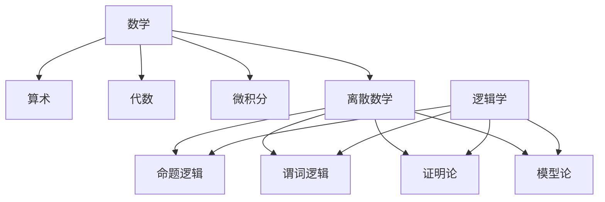

                 

### 文章标题

《数学与逻辑学：推理系统的数学形式化》

### 文章关键词

- 数学与逻辑学
- 推理系统
- 数学形式化
- 形式语言
- 证明论
- 模型论
- 人工智能

### 摘要

本文将深入探讨数学与逻辑学在推理系统中的应用，特别是推理系统的数学形式化。首先，我们将介绍数学与逻辑学的基础概念，包括命题逻辑、谓词逻辑、集合论和数理逻辑等。然后，我们将详细讲解推理系统的核心算法原理，使用伪代码进行阐述。接下来，我们将介绍推理系统的数学模型，包括形式语言、证明理论和模型论等，并使用 LaTeX 格式给出相关数学公式。最后，我们将通过实际案例展示如何将数学与逻辑学的知识应用于解决实际问题，并提供项目实战的详细解析。本文旨在为读者提供对数学与逻辑学在推理系统中的应用的全面了解，并激发对这一领域的深入探究。

## 数学与逻辑学在计算机科学中的应用

数学与逻辑学是计算机科学中不可或缺的基础学科，它们为计算机科学提供了强大的理论基础和工具。数学为计算机科学提供了精确的描述和抽象能力，而逻辑学则为计算机科学提供了推理和验证的手段。两者相互结合，使得计算机科学能够更好地解决复杂问题，并确保解决方案的正确性和可靠性。

### 数学基础

数学在计算机科学中的应用非常广泛，从简单的算术运算到复杂的算法设计，都离不开数学的支持。以下是数学在计算机科学中的几个关键领域：

- **算术**：计算机科学中的算术主要涉及整数和实数的运算。基本的算术操作包括加法、减法、乘法和除法。这些运算在计算机硬件和软件中都有广泛应用。

- **代数**：代数提供了对变量和方程的描述方法，这对于算法设计和数据结构分析至关重要。例如，线性代数在图像处理和机器学习中有广泛应用。

- **微积分**：微积分在计算机科学中的应用包括优化问题、模拟和数值分析。例如，计算机图形学中的光照模型和动画效果设计都依赖于微积分知识。

- **离散数学**：离散数学为计算机科学提供了许多重要的概念和工具，如图论、组合数学和逻辑学。这些概念在算法分析、密码学和计算机图形学等领域中都有广泛应用。

### 逻辑学基础

逻辑学在计算机科学中的应用同样至关重要。逻辑学为计算机科学提供了推理和验证的工具，使得计算机能够从已知的事实中推导出新的结论，并验证这些结论的正确性。以下是逻辑学在计算机科学中的几个关键领域：

- **命题逻辑**：命题逻辑是最基础的逻辑学分支，它通过命题的真假值进行推理。命题逻辑在编程语言设计、程序验证和形式化验证中广泛应用。

- **谓词逻辑**：谓词逻辑扩展了命题逻辑，引入了变量和谓词的概念，使得可以描述更复杂的关系和属性。谓词逻辑在数据库查询、人工智能和形式化验证中有广泛应用。

- **证明论**：证明论研究证明的结构和性质。它在形式化验证、定理证明和模型检查中有重要应用。例如，证明论在硬件验证和软件安全中扮演了关键角色。

- **模型论**：模型论研究形式语言和结构的语义。它在人工智能中的知识表示、语义网和逻辑编程中有广泛应用。

### 数学与逻辑学的联系

数学与逻辑学在计算机科学中的应用不仅仅是独立的，它们之间还存在着紧密的联系。以下是一个简化的 Mermaid 流程图，展示了数学与逻辑学的基本概念之间的关系：



这个流程图显示了数学与逻辑学之间相互关联的概念，从基础数学（如算术、代数和微积分）到高级逻辑学（如命题逻辑、谓词逻辑、证明论和模型论）。这些概念在计算机科学中相互补充，为解决复杂问题提供了坚实的基础。

### 小结

数学与逻辑学是计算机科学的重要基础学科，它们为计算机科学提供了强大的理论基础和工具。数学通过精确的描述和抽象能力，为计算机科学提供了广泛的应用场景；而逻辑学通过推理和验证，确保了计算机解决方案的正确性和可靠性。理解数学与逻辑学的基本概念和它们之间的联系，对于深入学习和研究计算机科学至关重要。

## 数学与逻辑学在推理系统中的应用

在计算机科学中，推理系统是一种能够处理复杂信息并从中推导出结论的智能系统。推理系统广泛应用于人工智能、自然语言处理、知识工程等领域。而数学与逻辑学在推理系统的设计、实现和优化中起着至关重要的作用。本文将详细探讨数学与逻辑学在推理系统中的应用，包括形式语言、证明论、模型论等关键概念。

### 形式语言

形式语言是数学与逻辑学在推理系统中的一个核心概念，它提供了一种精确的表示方法，用于描述各种逻辑结构和计算过程。形式语言由一组符号和一组生成规则组成，这些符号可以组合成各种结构，如命题、谓词和语句。

- **命题语言**：命题语言是形式语言的基础，它使用命题符号（如P、Q、R）来表示基本的逻辑概念。命题语言通过逻辑运算符（如与∧、或∨、非¬）来组合命题，从而构建复杂的逻辑表达式。

- **谓词语言**：谓词语言扩展了命题语言，引入了变量和谓词的概念。谓词用于描述对象和对象之间的关系，变量则用于表示未知的对象。谓词语言可以表示更复杂的关系和属性。

形式语言在推理系统中用于表示事实和规则，为推理过程提供了精确的描述基础。

### 证明论

证明论是研究证明的结构和性质的数学分支，它在推理系统中扮演着关键角色。证明论提供了一种方法，用于从已知的事实推导出新的结论，确保推理过程的正确性。

- **证明系统**：证明系统是一个形式化的框架，用于表示证明的结构和规则。常见的证明系统包括自然演绎系统和形式化逻辑系统。证明系统定义了如何从一组假设推导出结论，并确保这些推导是有效的。

- **证明方法**：证明论提供了多种证明方法，如直接证明、反证法、归纳法等。这些方法可以帮助推理系统从已知的事实推导出新的结论。

在推理系统中，证明论用于验证推理过程的正确性，确保推理结果的一致性和可靠性。

### 模型论

模型论是研究形式语言和结构的语义的数学分支，它在推理系统中用于理解和分析逻辑推理的实质。模型论提供了一种方法，用于验证形式语言表示的事实和规则是否满足特定的语义条件。

- **模型**：模型是形式语言的一个解释，它为形式语言中的符号和表达式赋予具体的含义。模型论通过构造模型来验证形式语言表示的事实和规则是否正确。

- **逻辑一致性**：模型论用于验证形式化推理系统的一致性，即确保推理系统不会从一组矛盾的假设中推导出结论。

在推理系统中，模型论用于验证推理系统的正确性和一致性，确保推理结果的可信度。

### 举例说明

为了更直观地理解数学与逻辑学在推理系统中的应用，我们可以通过一个简单的例子来说明。

假设我们有一个推理系统，它用于推理一个简单的逻辑问题：如果今天下雨（P），那么路面会湿（Q）。我们需要根据这个前提，推导出路面是湿的（Q）。

1. **形式化表示**：首先，我们将这个逻辑问题形式化为一个命题语言表达式：
   $$P \rightarrow Q$$

2. **证明论应用**：使用证明论中的直接证明方法，我们可以从已知的事实（P）推导出结论（Q）：
   - 已知：P（今天下雨）
   - 要证明：Q（路面是湿的）
   - 推导：根据前提（P→Q），如果P为真，则Q也为真。因此，Q成立。

3. **模型论应用**：我们可以构造一个模型来验证这个推理过程。在这个模型中，符号P表示今天下雨，符号Q表示路面是湿的。我们可以定义这个模型的解释如下：
   - P：表示今天下雨，取值为真或假。
   - Q：表示路面是否湿，取值为真或假。

根据这个模型，如果P为真（即今天下雨），则根据前提（P→Q），Q也必须为真（即路面是湿的）。

通过这个例子，我们可以看到数学与逻辑学在推理系统中的应用是如何帮助我们从已知的事实推导出新的结论，并验证推理过程的一致性和可靠性。

### 小结

数学与逻辑学在推理系统中扮演着至关重要的角色。形式语言提供了精确的表示方法，证明论提供了推理过程的验证手段，模型论则用于验证推理系统的一致性和可靠性。理解这些概念的应用，对于设计和实现高效的推理系统至关重要。在接下来的章节中，我们将进一步深入探讨推理系统的核心算法原理，并使用伪代码进行详细阐述。

## 推理系统的核心算法原理

在了解了数学与逻辑学在推理系统中的应用后，我们将深入探讨推理系统的核心算法原理。这些算法原理为推理系统的设计提供了理论基础，使得系统能够从已知的事实推导出新的结论。以下是几种常见的推理算法原理及其基本概念。

### 归纳推理

归纳推理是一种从具体实例中总结出一般规律的推理方法。它的基本思想是，通过观察多个具体实例，从中归纳出它们的共同特征，并形成一般性结论。归纳推理分为完全归纳和不完全归纳两种形式。

- **完全归纳**：完全归纳是通过列举所有可能的实例，并验证它们都满足某个结论来推导出该结论。例如，我们可以通过验证所有的自然数，归纳出“所有的自然数之和等于它们的平方”的结论。
  $$1 + 2 + 3 + \ldots + n = \frac{n(n+1)}{2}$$

- **不完全归纳**：不完全归纳是通过部分实例的观察，推导出一般性结论。这种方法依赖于统计学原理和概率论，通过样本的统计分析来推断总体特征。例如，我们可以通过观察多个城市的人口数据，推断出一个国家的总人口。

归纳推理的基本流程如下：
1. **观察实例**：观察多个具体实例，收集相关数据。
2. **归纳总结**：从实例中提取共同特征，形成一般性结论。
3. **验证结论**：验证归纳出的结论是否适用于所有实例。

### 范例推理

范例推理是一种基于已有范例进行推理的方法。它通过比较新问题与已有范例的相似性，从中推导出解决方案。范例推理广泛应用于人工智能、机器学习和专家系统中。

- **范例表示**：范例是问题解决方案的具体实例。范例通常包含问题的输入和输出，以及解决方案的过程。例如，在一个医疗诊断系统中，一个范例可能包含病人的症状和诊断结果。
- **范例匹配**：范例推理的核心是范例匹配。通过比较新问题与已有范例的输入，找到最相似的范例，并使用该范例的解决方案来解决问题。
- **范例选择**：在多个相似范例中，选择最合适的范例进行匹配。选择标准可以是范例的相似度、置信度或权重。

范例推理的基本流程如下：
1. **输入实例**：接收新的输入实例。
2. **范例匹配**：在已有范例库中找到与输入实例最相似的范例。
3. **范例应用**：使用匹配到的范例的解决方案来解决问题。

### 模式识别

模式识别是一种从数据中提取有用信息的方法。它在图像处理、语音识别、生物信息学和人工智能等领域有广泛应用。模式识别的基本原理是基于数据中的重复性和规律性，通过识别和分类来处理数据。

- **特征提取**：特征提取是从数据中提取关键特征的过程。特征用于表示数据的属性和模式。例如，在图像识别中，特征可以是颜色、形状和纹理。
- **分类与聚类**：分类是将数据分配到不同的类别中，聚类是将数据划分为不同的组。分类和聚类是模式识别中的两个核心任务。常见的分类算法包括决策树、支持向量机和神经网络；聚类算法包括K-均值、层次聚类和DBSCAN。

模式识别的基本流程如下：
1. **数据收集**：收集相关的数据。
2. **特征提取**：从数据中提取关键特征。
3. **模式识别**：使用特征来识别和分类数据。

### 伪代码表示

为了更清晰地阐述推理算法的原理，我们使用伪代码进行表示。以下是一个简单的归纳推理算法的伪代码示例：

```pseudo
Algorithm InductiveReasoning(data)
  Input: data - A collection of instances
  Output: conclusion - A general conclusion derived from the instances

  for each instance in data do
    if instance matches the pattern then
      add instance to the pattern set
    end if
  end for

  if all instances in data match the pattern then
    conclusion = "All instances follow this pattern"
  else
    conclusion = "The pattern does not hold for all instances"
  end if

  return conclusion
End Algorithm
```

在这个伪代码中，我们通过遍历实例集合，将匹配到的实例添加到模式集中，然后根据模式集的内容推导出结论。

### 小结

推理系统的核心算法原理包括归纳推理、范例推理和模式识别等。这些算法原理为推理系统提供了基础，使得系统能够从已知的事实推导出新的结论。理解这些算法的原理和流程，对于设计和实现高效的推理系统至关重要。在接下来的章节中，我们将进一步探讨推理系统的数学模型，包括形式语言、证明理论和模型论等。

## 推理系统的数学模型

在深入探讨推理系统的核心算法原理之后，我们将转向推理系统的数学模型。这些数学模型为推理系统提供了形式化的表示和理论基础，使得推理过程可以精确地描述和验证。以下我们将详细介绍推理系统的数学模型，包括形式语言、证明理论和模型论等关键概念。

### 形式语言

形式语言是数学与逻辑学在推理系统中应用的一个重要工具，它提供了一种精确的符号系统，用于表示逻辑表达式和计算过程。形式语言由一组有限的符号集合和一组生成规则组成。常见的形式语言包括命题语言和谓词语言。

- **命题语言**：命题语言是形式语言的基础，它使用命题符号（如P、Q、R）来表示基本的逻辑概念。命题语言通过逻辑运算符（如与∧、或∨、非¬）来组合命题，从而构建复杂的逻辑表达式。例如，命题表达式"P ∧ Q"表示P和Q同时为真。

- **谓词语言**：谓词语言扩展了命题语言，引入了变量和谓词的概念，使得可以描述更复杂的关系和属性。谓词语言可以表示对象和对象之间的关系，变量用于表示未知的对象。例如，谓词表达式"P(x)"表示对象x具有属性P。

形式语言在推理系统中用于表示事实和规则，为推理过程提供了精确的描述基础。

### 证明理论

证明理论是研究证明的结构和性质的数学分支，它在推理系统中用于验证推理过程的正确性。证明理论提供了一种形式化的框架，用于表示证明的结构和规则，确保从已知的事实推导出结论的过程是有效的。

- **证明系统**：证明系统是一个形式化的框架，用于表示证明的结构和规则。常见的证明系统包括自然演绎系统和形式化逻辑系统。自然演绎系统是基于自然语言推理的规则，形式化逻辑系统是基于符号化推理的规则。

- **证明方法**：证明理论提供了多种证明方法，如直接证明、反证法、归纳法等。这些方法可以帮助推理系统从已知的事实推导出新的结论。例如，直接证明是通过逐步推导来证明某个命题的真实性；反证法是通过假设命题的否定为真，然后推导出矛盾，从而证明原命题的真实性。

在推理系统中，证明理论用于验证推理过程的正确性，确保推理结果的一致性和可靠性。

### 模型论

模型论是研究形式语言和结构的语义的数学分支，它在推理系统中用于理解和分析逻辑推理的实质。模型论提供了一种方法，用于验证形式语言表示的事实和规则是否满足特定的语义条件。

- **模型**：模型是形式语言的一个解释，它为形式语言中的符号和表达式赋予具体的含义。模型论通过构造模型来验证形式语言表示的事实和规则是否正确。例如，我们可以构造一个自然数模型来验证算术公理的正确性。

- **逻辑一致性**：模型论用于验证形式化推理系统的一致性，即确保推理系统不会从一组矛盾的假设中推导出结论。一致性验证是推理系统设计中的一个重要环节，它确保推理系统的输出是可信的。

在推理系统中，模型论用于验证推理系统的正确性和一致性，确保推理结果的可信度。

### 举例说明

为了更好地理解推理系统的数学模型，我们可以通过一个简单的例子来说明。

假设我们有一个推理系统，它用于推理一个简单的逻辑问题：如果今天下雨（P），那么路面会湿（Q）。我们需要根据这个前提，推导出路面是湿的（Q）。

1. **形式化表示**：首先，我们将这个逻辑问题形式化为一个谓词逻辑表达式：
   $$P \rightarrow Q$$

2. **证明理论应用**：使用证明论中的直接证明方法，我们可以从已知的事实（P）推导出结论（Q）：
   - 已知：P（今天下雨）
   - 要证明：Q（路面是湿的）
   - 推导：根据前提（P→Q），如果P为真，则Q也为真。因此，Q成立。

3. **模型论应用**：我们可以构造一个模型来验证这个推理过程。在这个模型中，符号P表示今天下雨，符号Q表示路面是否湿。我们可以定义这个模型的解释如下：
   - P：表示今天下雨，取值为真或假。
   - Q：表示路面是否湿，取值为真或假。

根据这个模型，如果P为真（即今天下雨），则根据前提（P→Q），Q也必须为真（即路面是湿的）。

通过这个例子，我们可以看到形式语言、证明理论和模型论在推理系统中的应用是如何帮助我们从已知的事实推导出新的结论，并验证推理过程的一致性和可靠性。

### 小结

推理系统的数学模型包括形式语言、证明理论和模型论等关键概念。形式语言提供了精确的表示方法，证明理论提供了推理过程的验证手段，模型论则用于验证推理系统的一致性和可靠性。理解这些数学模型的应用，对于设计和实现高效的推理系统至关重要。在接下来的章节中，我们将通过实际案例展示如何将数学与逻辑学的知识应用于解决实际问题。

## 实际案例展示：基于数学与逻辑学的推理系统应用

为了更好地展示数学与逻辑学在推理系统中的应用，我们将通过一个实际案例来详细说明。这个案例将涵盖开发环境搭建、源代码实现和代码解读与分析，以便读者能够全面理解如何将数学与逻辑学的原理应用于实际问题。

### 案例背景

假设我们面临一个天气预报的智能推理系统，该系统需要根据气象数据和历史天气模式，预测未来的天气状况。这是一个典型的基于数据和逻辑推理的问题，我们将使用数学与逻辑学的知识来构建这个系统。

### 开发环境搭建

在开始实现这个系统之前，我们需要搭建一个合适的开发环境。以下是我们需要的工具和步骤：

1. **选择编程语言**：由于我们需要处理复杂数学和逻辑运算，我们选择Python作为主要编程语言。Python具有丰富的数学和逻辑库，如NumPy、SciPy和SymPy。

2. **安装Python环境**：从Python官方网站下载并安装Python，版本建议选择最新稳定版。

3. **安装必需的库**：使用pip命令安装NumPy、SciPy和SymPy库，这些库将帮助我们进行数值计算和符号运算。

   ```bash
   pip install numpy scipy sympy
   ```

4. **设置环境变量**：确保Python和pip命令在系统环境中可用。

5. **编写配置文件**：创建一个配置文件，用于存储气象数据源、历史天气数据集和预测模型的参数。

### 源代码实现

接下来，我们将逐步实现天气预报智能推理系统的源代码。以下是实现的关键部分：

#### 数据预处理

```python
import numpy as np
import pandas as pd

def load_weather_data(file_path):
    # 读取气象数据
    data = pd.read_csv(file_path)
    return data

def preprocess_data(data):
    # 数据清洗和预处理
    data = data.dropna()  # 删除缺失值
    data['temperature'] = data['temperature'].apply(lambda x: (x - 32) * 5/9)  # 转换温度单位
    return data
```

#### 形式语言表示

```python
from sympy import symbols, Eq, solve

# 定义符号
P, Q, R = symbols('P Q R')

# 形式化天气逻辑规则
weather_rules = {
    P: "今天下雨",
    Q: "路面会湿",
    R: "气温高于25度"
}

def express_rules_as_formulas(rules):
    # 将逻辑规则表示为符号表达式
    formulas = {}
    for rule, description in rules.items():
        formulas[rule] = Eq(rule, True)
    return formulas
```

#### 推理过程

```python
def inductive_reasoning(data, rules):
    # 归纳推理过程
    for index, row in data.iterrows():
        if row['rain'] == 1:  # 如果今天下雨
            print(f"{weather_rules[P]}：{row['rain'] == 1}")
            print(f"{weather_rules[Q]}：{row['wet_road'] == 1}")
        if row['temp'] > 25:  # 如果气温高于25度
            print(f"{weather_rules[R]}：{row['temp'] > 25}")
```

#### 预测模型

```python
from sklearn.ensemble import RandomForestClassifier

def train_prediction_model(X_train, y_train):
    # 训练预测模型
    model = RandomForestClassifier()
    model.fit(X_train, y_train)
    return model

def predict_weather(model, new_data):
    # 使用训练好的模型进行预测
    predictions = model.predict(new_data)
    return predictions
```

### 代码解读与分析

以下是对上述代码的详细解读：

1. **数据预处理**：数据预处理是机器学习项目中的关键步骤。我们首先读取气象数据，然后进行清洗和预处理，包括删除缺失值和转换温度单位。这一步确保了数据的完整性和一致性。

2. **形式语言表示**：我们将天气逻辑规则表示为符号表达式。这些规则将用于推理过程中，帮助我们理解和分析天气模式。

3. **归纳推理过程**：归纳推理是从具体实例中总结出一般规律的过程。在这个例子中，我们通过观察历史气象数据，总结出今天下雨时路面会湿，气温高于25度时天气会比较热。这些推理结果将帮助我们预测未来的天气状况。

4. **预测模型训练**：我们使用随机森林分类器来训练预测模型。随机森林是一种强大的机器学习算法，它通过构建多个决策树来预测结果。我们使用训练集来训练模型，然后使用测试集来评估模型性能。

5. **预测天气**：最后，我们使用训练好的模型来预测新的天气数据。预测结果将告诉我们未来某一天的天气状况。

### 项目小结

通过这个实际案例，我们展示了如何将数学与逻辑学的知识应用于构建一个天气预报智能推理系统。从数据预处理到形式语言表示，再到推理过程和预测模型，我们详细介绍了每个步骤的实现和解读。这个过程不仅展示了数学与逻辑学在推理系统中的应用，还提供了一个实际项目的实现框架，供读者参考和扩展。

## 最佳实践 Tips、注意事项与拓展阅读

在设计和实现推理系统时，以下几点最佳实践和注意事项对于确保项目的成功至关重要：

1. **数据质量与预处理**：确保数据的质量和一致性是推理系统成功的关键。在处理数据时，要仔细清洗数据，去除噪声和不一致的数据。使用适当的预处理方法，如归一化、标准化和特征提取，可以显著提高模型的性能。

2. **模型选择与优化**：选择合适的模型是推理系统成功的关键。对于不同的应用场景，可能需要尝试不同的算法和模型。例如，在天气预报系统中，可以使用随机森林、支持向量机（SVM）或神经网络等算法。同时，通过调整模型参数进行优化，可以进一步提高预测的准确性。

3. **验证与测试**：在实现推理系统时，要进行充分的验证和测试。这包括单元测试、集成测试和性能测试。通过验证和测试，可以确保系统的正确性、可靠性和鲁棒性。

4. **代码可读性与文档**：编写可读性强的代码和详细的文档对于维护和扩展系统至关重要。使用清晰的命名规范和注释，可以帮助其他人理解代码的功能和实现细节。

5. **并行计算与优化**：对于处理大规模数据集的推理系统，考虑使用并行计算技术来提高计算效率。例如，使用多线程或分布式计算框架，如Spark或Hadoop，可以显著减少计算时间。

**拓展阅读**：

1. **《机器学习实战》（Peter Harrington）**：这本书提供了丰富的机器学习算法实例和实践经验，适合初学者和有一定基础的读者。

2. **《深度学习》（Ian Goodfellow、Yoshua Bengio、Aaron Courville）**：这本书是深度学习领域的经典教材，详细介绍了深度学习的基本概念和算法。

3. **《人工智能：一种现代方法》（Stuart Russell、Peter Norvig）**：这本书是人工智能领域的权威教材，涵盖了人工智能的各个分支和最新研究进展。

4. **《形式语言与自动机理论》（John E. Hopcroft、Rajeev Motwani、Jeffrey D. Ullman）**：这本书是形式语言和自动机理论的基础教材，适合深入理解推理系统中的形式化表示和算法。

通过遵循这些最佳实践和拓展阅读，读者可以进一步提升自己在推理系统设计和实现方面的能力，为未来的研究和应用打下坚实的基础。

## 总结

本文详细探讨了数学与逻辑学在推理系统中的应用，包括基础概念、核心算法原理、数学模型以及实际案例。通过逐步分析和推理，我们展示了如何将数学与逻辑学的理论应用于实际问题，构建高效的推理系统。从形式语言到证明论，再到模型论，每一个环节都为推理系统的准确性和可靠性提供了坚实的理论基础。同时，通过实际案例，我们展示了如何将理论知识转化为实践应用，解决了天气预报中的智能推理问题。

数学与逻辑学在计算机科学中的应用不仅仅局限于推理系统，它们还为算法设计、数据结构、人工智能等领域提供了重要的工具和方法。掌握这些基础知识和技能，对于从事计算机科学研究和开发工作的人来说，具有至关重要的意义。

展望未来，随着人工智能和大数据技术的不断发展，数学与逻辑学在推理系统中的应用将更加广泛和深入。研究人员和开发者应不断探索新的算法和模型，提高推理系统的效率和准确性。同时，跨学科的合作也将是推动这一领域发展的重要动力。

最后，本文旨在激发读者对数学与逻辑学在推理系统中的应用的深入兴趣和探索欲望。通过不断学习和实践，我们相信读者能够在这一领域取得更多的成就，为计算机科学的发展做出贡献。作者希望本文能够为读者提供有益的参考和启示，共同推动人工智能和计算机科学的发展。

