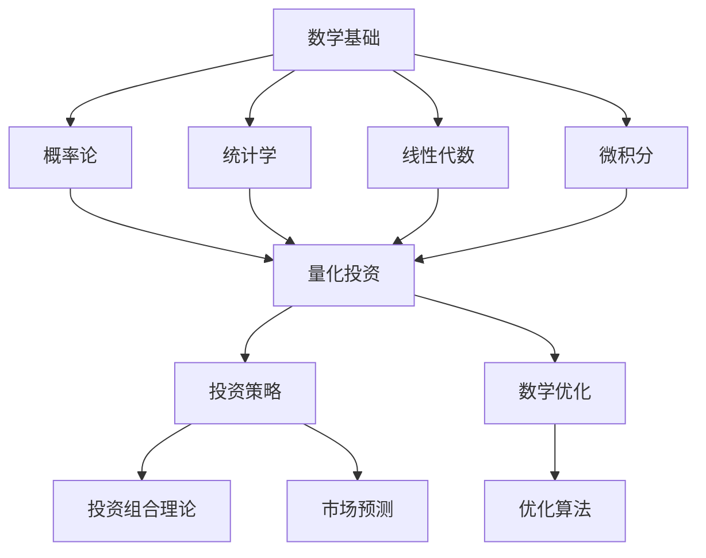

                 

### 第一部分：引言

#### 1.1 书籍背景与目的

在当今全球金融市场日益复杂多变的背景下，量化投资成为了金融投资领域的重要方向。量化投资通过数学模型、统计分析、计算机算法等技术手段，来分析和预测市场走势，制定投资策略。然而，量化投资的成功离不开对数学的深入理解和应用。

《数学与量化投资：投资策略的数学优化》这本书旨在为读者提供一套系统的量化投资知识和实践方法。本书的核心目标是：

1. **介绍数学基础**：为量化投资提供必要的数学工具和理论基础。
2. **阐述量化投资原理**：解释量化投资的基本概念和流程。
3. **深入探讨投资策略的数学优化**：介绍如何运用数学优化方法来优化投资策略。
4. **进行实证分析与案例分析**：通过实际案例展示数学优化在量化投资中的应用效果。
5. **总结与展望**：总结量化投资的发展趋势和未来发展方向。

#### 1.2 为什么要阅读这本书

本书适合以下几类读者：

1. **金融投资从业者**：想要了解量化投资基本原理和实际操作方法。
2. **计算机科学和技术人员**：希望将数学与编程应用于金融投资领域。
3. **数学爱好者**：对数学在金融投资中的应用感兴趣，希望深入了解其原理。
4. **研究人员**：希望了解量化投资领域的最新研究成果和前沿技术。

本书通过以下几方面的独特优势，为读者提供有价值的阅读体验：

1. **系统全面**：从数学基础到量化投资原理，再到数学优化方法，全面覆盖量化投资的各个方面。
2. **理论与实践结合**：既有理论讲解，也有实际案例分析，使读者能够更好地理解和应用所学知识。
3. **易于理解**：用通俗易懂的语言和示例，深入浅出地解释复杂的数学概念和算法。
4. **代码实现**：提供详细的代码实现和解读，使读者能够动手实践，加深理解。

通过阅读本书，读者不仅可以系统地学习量化投资的知识，还能够掌握数学优化方法在实际投资中的应用，为未来的职业发展奠定坚实的基础。

#### 1.3 核心概念与联系

为了更好地理解本书的核心内容，我们需要梳理以下几个关键概念：

1. **数学与量化投资**：
   - **数学**：量化投资的基础工具，包括概率论、统计学、线性代数和微积分等。
   - **量化投资**：利用数学模型和算法来分析和预测市场走势，制定投资策略。

2. **投资策略的数学优化**：
   - **投资策略**：基于特定投资目标和市场环境制定的行动计划。
   - **数学优化**：使用数学方法，如优化算法，来找到最优投资策略。

3. **量化投资原理**：
   - **投资组合理论**：研究如何分配资金，以实现风险与收益的最优平衡。
   - **市场预测**：利用历史数据和统计分析方法，预测市场走势。

为了更直观地展示这些概念之间的关系，我们可以使用Mermaid流程图：



这个流程图清晰地展示了数学基础、量化投资、投资策略和数学优化之间的相互关系，有助于读者更好地理解和掌握本书的核心内容。

#### 1.4 背景介绍

量化投资，作为一种基于数据驱动和算法优化的投资方式，正逐渐成为金融投资领域的重要趋势。随着信息技术的发展和大数据的普及，量化投资方法在金融市场中得到了广泛应用。量化投资通过数学模型、统计分析、机器学习等手段，对大量市场数据进行分析和预测，从而制定出更精确的投资策略。

然而，量化投资的成功离不开数学的支持。数学作为一种严谨的科学工具，能够帮助投资者准确地理解和分析金融市场中的复杂关系。从概率论和统计学到线性代数和微积分，每一个数学分支都在量化投资中发挥着重要作用。例如，概率论和统计学提供了衡量风险和收益的工具；线性代数和微积分则为构建和优化投资策略提供了数学基础。

本书的核心目的是帮助读者深入理解数学与量化投资之间的关系，掌握如何运用数学优化方法来制定和优化投资策略。通过系统地学习数学基础、量化投资原理和数学优化方法，读者不仅可以提高对金融市场的洞察力，还能够提升投资决策的科学性和准确性。

在接下来的章节中，我们将详细讲解数学基础、量化投资原理、投资策略的数学优化方法，并通过实证分析和案例分析，展示这些方法在实际投资中的应用效果。希望通过本书的学习，读者能够更好地运用数学和量化投资的知识，实现投资收益的最大化。

#### 1.5 投资策略的数学优化

在量化投资中，投资策略的数学优化是一个核心环节。投资策略的优化不仅关乎投资组合的收益，还直接影响到投资者的风险承受能力。那么，如何利用数学优化方法来优化投资策略呢？

首先，我们需要明确投资策略优化的目标。一般来说，投资策略优化的目标可以归纳为两个方面：

1. **最大化收益**：在控制风险的前提下，追求投资组合的最大化收益。
2. **最小化风险**：在保证收益的前提下，尽量降低投资组合的风险。

为了实现这些目标，我们通常会采用以下几种数学优化方法：

1. **目标函数**：
   - **收益函数**：衡量投资组合的预期收益，一般形式为 $$R = \sum_{i=1}^{n} w_i \cdot r_i$$，其中 $R$ 是总收益，$w_i$ 是资产 $i$ 的权重，$r_i$ 是资产 $i$ 的预期收益率。
   - **风险函数**：衡量投资组合的风险，一般形式为 $$V = \sum_{i=1}^{n} w_i^2 \cdot \sigma_i^2$$，其中 $V$ 是总风险，$w_i$ 是资产 $i$ 的权重，$\sigma_i^2$ 是资产 $i$ 的方差。

2. **约束条件**：
   - **权重约束**：所有资产的权重之和必须等于1，即 $$\sum_{i=1}^{n} w_i = 1$$。
   - **投资预算**：投资者在特定时间段内的投资总额有限，即 $$\sum_{i=1}^{n} w_i \cdot P_i \leq B$$，其中 $P_i$ 是资产 $i$ 的价格，$B$ 是投资预算。

3. **优化算法**：
   - **线性规划（Linear Programming, LP）**：适用于线性目标函数和线性约束条件的优化问题。
   - **非线性规划（Nonlinear Programming, NLP）**：适用于非线性目标函数和约束条件的优化问题。
   - **遗传算法（Genetic Algorithm, GA）**：基于生物进化原理的启发式搜索算法，适用于复杂和非线性优化问题。
   - **粒子群优化（Particle Swarm Optimization, PSO）**：基于群体智能的优化算法，适用于多参数优化问题。

接下来，我们通过一个简单的例子来说明如何使用Python代码实现投资策略的优化。

#### 1.6 实例分析：投资组合优化

假设我们有以下三种资产，每种资产的价格和预期收益率如下表所示：

| 资产 | 价格 (元) | 预期收益率 | 方差 |
|------|-----------|-------------|------|
| A    | 100       | 0.1         | 0.04 |
| B    | 200       | 0.12        | 0.06 |
| C    | 300       | 0.08        | 0.05 |

我们的目标是在投资总额为5000元的前提下，最大化投资组合的预期收益。

首先，我们需要定义目标函数和约束条件：

```python
import numpy as np
from scipy.optimize import minimize

# 资产的价格和预期收益率
prices = np.array([100, 200, 300])
expected_returns = np.array([0.1, 0.12, 0.08])

# 权重约束
weight_constraints = ({'type': 'eq', 'fun': lambda w: np.sum(w) - 1})

# 投资预算约束
budget_constraint = ({'type': 'ineq', 'fun': lambda w: 5000 - np.dot(w, prices)})

# 目标函数：最大化预期收益
def objective(w):
    return -np.dot(w, expected_returns)

# 优化初始化参数
initial_weights = np.array([1/3, 1/3, 1/3])

# 优化算法
result = minimize(objective, initial_weights, method='SLSQP', constraints=[weight_constraints, budget_constraint])

# 输出最优权重
optimal_weights = result.x
print("最优权重：", optimal_weights)
```

通过运行上面的代码，我们可以得到最优权重分配方案，从而实现投资组合的优化。这个例子展示了如何使用Python中的优化库（如scipy.optimize）来实现投资策略的数学优化。

通过这个实例，我们可以看到，投资策略的数学优化不仅能够帮助我们制定出更科学、更合理的投资组合，还能够有效地降低投资风险，提高投资收益。

### 第二部分：数学基础

在量化投资中，数学作为一门基础工具，其重要性不言而喻。数学不仅是量化投资理论体系的基石，也是实现量化投资策略的关键手段。本部分将详细介绍量化投资所必需的数学基础，包括线性代数、概率论与统计学以及微积分。这些数学工具将为量化投资提供强有力的理论支持。

#### 2.1 线性代数

线性代数是量化投资中不可或缺的一部分，它提供了一系列处理多维数据的工具和方法。以下是线性代数中的几个核心概念：

##### 2.1.1 向量与矩阵

- **向量（Vector）**：向量是具有大小和方向的量，在量化投资中通常用于表示资产的价格、收益率等。例如，一个包含三个资产的向量可以表示为：
  $$\vec{p} = \begin{pmatrix} p_A \\ p_B \\ p_C \end{pmatrix}$$
  其中，$p_A$、$p_B$ 和 $p_C$ 分别是资产 A、B 和 C 的价格。

- **矩阵（Matrix）**：矩阵是由一系列数字排列成的矩形阵列，可以用来表示多个向量的集合。例如，一个包含三个资产的价格矩阵可以表示为：
  $$\mathbf{P} = \begin{pmatrix} 100 & 200 & 300 \\ 0.1 & 0.12 & 0.08 \end{pmatrix}$$
  其中，第一行表示资产的价格，第二行表示资产的预期收益率。

##### 2.1.2 特征值与特征向量

- **特征值（Eigenvalue）**：特征值是矩阵的一个特殊值，它使得矩阵与自身的线性变换保持不变。在量化投资中，特征值可以用于衡量资产的风险和收益特性。
  $$\mathbf{A}\vec{v} = \lambda\vec{v}$$
  其中，$\mathbf{A}$ 是矩阵，$\vec{v}$ 是特征向量，$\lambda$ 是特征值。

- **特征向量（Eigenvector）**：特征向量是与特征值相对应的向量，它描述了矩阵变换后向量的方向。在量化投资中，特征向量可以用于构建投资组合，以实现风险分散。

#### 2.2 概率论与统计学

概率论与统计学在量化投资中发挥着重要作用，它们提供了一系列工具来分析不确定性，并从中提取有用的信息。

##### 2.2.1 概率的基本概念

- **概率（Probability）**：概率是描述事件发生可能性的度量，通常用一个介于0和1之间的数值表示。例如，资产 A 明天上涨的概率为0.6。

- **随机变量（Random Variable）**：随机变量是一个函数，它将样本空间映射到一个实数集。在量化投资中，随机变量可以用来表示资产的价格或收益率。

- **分布函数（Probability Distribution Function）**：分布函数描述了随机变量取值概率的分布情况。常见的分布函数包括正态分布、泊松分布等。

##### 2.2.2 随机变量

- **离散随机变量**：离散随机变量的取值是有限的或可数的。例如，一个股票的涨跌状态可以用离散随机变量表示。

- **连续随机变量**：连续随机变量的取值是连续的。例如，股票价格的连续变动可以用连续随机变量表示。

##### 2.2.3 分布函数与概率密度函数

- **概率密度函数（Probability Density Function, PDF）**：概率密度函数描述了连续随机变量在某一范围内的概率密度。对于连续随机变量 X，其概率密度函数为 f(x)。例如，正态分布的概率密度函数为：
  $$f(x) = \frac{1}{\sqrt{2\pi\sigma^2}} e^{-\frac{(x-\mu)^2}{2\sigma^2}}$$
  其中，$\mu$ 是均值，$\sigma^2$ 是方差。

#### 2.3 微积分

微积分是数学中的重要分支，它在量化投资中用于分析变量之间的关系，特别是变化率和积分。

##### 2.3.1 导数与微分

- **导数（Derivative）**：导数描述了函数在某一点的变化率。在量化投资中，导数可以用于计算资产收益率的瞬时变化率。

- **微分（Differentiation）**：微分是导数的一种推广，用于处理多个变量的函数。

##### 2.3.2 积分与不定积分

- **积分（Integral）**：积分是导数的反操作，用于计算函数的总变化量。在量化投资中，积分可以用于计算资产的总收益。

- **不定积分（Indefinite Integral）**：不定积分是积分的一种形式，它给出了函数的原函数。

##### 2.3.3 多元函数的微分与积分

- **多元函数的微分**：多元函数的微分用于计算多个变量的函数在一点的变化率。

- **多元函数的积分**：多元函数的积分用于计算多个变量的函数在某一区域的总变化量。

通过以上对线性代数、概率论与统计学以及微积分的介绍，我们可以看到这些数学工具在量化投资中发挥着关键作用。在接下来的章节中，我们将进一步探讨这些数学工具在量化投资中的应用，以及如何利用它们来制定和优化投资策略。

### 第三部分：量化投资原理

量化投资作为一种基于数据驱动和数学模型的投资方法，正逐渐在金融市场中占据重要地位。本部分将详细阐述量化投资的基本概念、核心原理、与传统投资方法的区别及其优势。

#### 3.1 量化投资概述

**核心概念**：量化投资是指利用数学模型和计算机算法来分析和预测市场走势，制定投资策略。与传统投资方法相比，量化投资更加依赖数据分析和数学模型，而不是主观判断和经验。

**量化投资的基本步骤**：

1. **数据收集**：收集历史市场数据、经济指标、公司财务报表等。
2. **数据预处理**：对收集的数据进行清洗、转换和归一化处理。
3. **特征工程**：从原始数据中提取有用的特征，用于构建数学模型。
4. **数学建模**：利用统计学、机器学习等方法构建预测模型。
5. **模型验证**：通过历史数据验证模型的预测能力。
6. **策略制定**：根据模型预测结果制定投资策略。
7. **策略执行**：执行投资策略并进行实时监控。

**核心原理**：

量化投资的核心原理在于通过数学模型和算法来识别市场机会，降低人为因素对投资决策的影响。量化投资策略通常包括以下几个方面：

1. **市场趋势分析**：通过分析历史价格和交易量等指标，预测市场走势。
2. **风险管理**：利用统计学方法衡量投资组合的风险，并制定相应的风险管理策略。
3. **投资组合优化**：通过优化投资组合，实现风险与收益的最优平衡。
4. **算法交易**：利用计算机算法自动执行交易，提高交易效率。

#### 3.2 与传统投资方法的区别

**投资方法**：

1. **传统投资方法**：主要依赖投资者个人的经验、直觉和市场感觉来做出投资决策。投资者通常根据对公司基本面、宏观经济环境、市场情绪等因素进行分析，然后制定投资策略。

2. **量化投资方法**：通过数学模型和计算机算法来分析和预测市场走势，制定投资策略。量化投资策略通常基于大量历史数据和统计分析，而非个人直觉。

**区别**：

1. **数据依赖性**：量化投资更加依赖历史数据和市场信息，而传统投资方法则更多地依赖投资者的个人经验和市场感觉。
2. **决策科学性**：量化投资通过数学模型和算法来量化市场机会和风险，提高投资决策的科学性和准确性。传统投资方法则更多地依赖主观判断和直觉。
3. **交易自动化**：量化投资通常通过算法交易实现自动执行，提高交易效率。传统投资方法则更多地依赖人工操作。

#### 3.3 量化投资的优势

**收益稳定**：量化投资通过数学模型和算法来识别市场机会，减少了主观判断和情绪的影响，从而提高了投资收益的稳定性。

**风险可控**：量化投资策略通常包括风险管理模型，可以有效地控制投资组合的风险，降低潜在的损失。

**效率提升**：算法交易实现了自动化的交易执行，提高了交易效率，减少了人工操作的时间和成本。

**灵活性高**：量化投资策略可以根据市场环境的变化快速调整，具有较高的灵活性。

**规模化操作**：量化投资可以通过计算机算法实现规模化操作，管理大量资产，从而提高投资的效率。

#### 3.4 量化投资的挑战

**数据质量**：量化投资依赖于历史数据和市场信息，数据质量直接影响投资策略的有效性。

**模型风险**：量化投资策略基于数学模型和算法，模型的有效性和稳定性直接影响投资收益。

**技术复杂性**：量化投资涉及大量的数学、统计学和计算机科学知识，对技术人员的要求较高。

**市场适应性**：量化投资策略需要适应不断变化的市场环境，这增加了策略的复杂性和挑战性。

通过以上对量化投资原理的详细阐述，我们可以看到量化投资在金融投资领域的重要地位和作用。量化投资不仅为投资者提供了更加科学、精准的投资策略，还提高了投资决策的效率和灵活性。然而，量化投资也面临着数据质量、模型风险和技术复杂性等挑战，这需要投资者和技术人员共同努力，不断优化和完善量化投资策略。

### 第四部分：投资策略的数学优化

在量化投资中，投资策略的数学优化是提升投资组合收益、降低风险的关键步骤。通过数学优化，我们可以找到最优的投资组合，实现风险与收益的最优平衡。本部分将详细探讨投资策略的数学优化过程，包括建模、优化算法选择以及案例分析。

#### 4.1 投资策略的数学建模

投资策略的数学建模是量化投资的基础，它涉及以下几个关键步骤：

1. **目标函数的确定**：目标函数是投资策略优化的核心，用于衡量投资组合的收益和风险。常见的目标函数包括最大化收益、最小化风险或最大化风险调整后收益。

   - **收益函数**：收益函数用于衡量投资组合的预期收益，通常表示为：
     $$R = w^T \cdot r$$
     其中，$w$ 是资产权重向量，$r$ 是资产收益率向量。

   - **风险函数**：风险函数用于衡量投资组合的风险，通常表示为：
     $$V = w^T \cdot \Sigma \cdot w$$
     其中，$\Sigma$ 是资产收益率的协方差矩阵。

2. **约束条件的设定**：投资策略优化通常需要满足一定的约束条件，这些约束条件包括：

   - **权重约束**：所有资产的权重之和必须等于1，即：
     $$w^T \cdot e = 1$$
     其中，$e$ 是全一矩阵。

   - **投资预算**：投资组合的总金额必须小于或等于投资预算，即：
     $$w^T \cdot p \leq B$$
     其中，$p$ 是资产价格向量，$B$ 是投资预算。

3. **建模**：在确定了目标函数和约束条件之后，我们可以构建数学模型。常见的数学模型包括线性规划、非线性规划、多目标优化等。

#### 4.2 数学优化算法

数学优化算法是解决投资策略优化问题的重要工具，常见的优化算法包括线性规划、非线性规划、遗传算法、粒子群优化等。

1. **线性规划（Linear Programming, LP）**：线性规划适用于目标函数和约束条件均为线性的优化问题。线性规划可以通过单纯形法、内点法等求解。

   ```python
   from scipy.optimize import linprog

   # 线性规划的参数
   c = [-1, -1]  # 目标函数系数
   A = [[1, 1], [1, 2]]  # 约束条件系数矩阵
   b = [2, 4]  # 约束条件常数向量

   # 求解线性规划问题
   result = linprog(c, A_ub=A, b_ub=b, method='highs')
   print("最优解：", result.x)
   ```

2. **非线性规划（Nonlinear Programming, NLP）**：非线性规划适用于目标函数或约束条件为非线性的优化问题。非线性规划可以通过梯度下降法、牛顿法等求解。

   ```python
   from scipy.optimize import minimize

   # 非线性规划的参数
   x0 = [1, 1]  # 初始参数
   def objective(x):
       return x[0]**2 + x[1]**2
   def constraint1(x):
       return x[0]**2 + x[1]**2 - 1
   cons = ({'type': 'eq', 'fun': constraint1})

   # 求解非线性规划问题
   result = minimize(objective, x0, method='L-BFGS-B', constraints=cons)
   print("最优解：", result.x)
   ```

3. **遗传算法（Genetic Algorithm, GA）**：遗传算法是一种基于自然选择和遗传学原理的启发式搜索算法，适用于复杂和非线性优化问题。

   ```python
   from genetic_algorithms import GeneticAlgorithm

   # 遗传算法的参数
   population_size = 100
   mutation_rate = 0.01
   crossover_rate = 0.8
   max_iterations = 100

   # 定义遗传算法求解函数
   def objective(x):
       return x[0]**2 + x[1]**2

   # 初始化遗传算法
   ga = GeneticAlgorithm(population_size, mutation_rate, crossover_rate, max_iterations, objective)

   # 运行遗传算法
   ga.run()
   print("最优解：", ga.best_individual())
   ```

4. **粒子群优化（Particle Swarm Optimization, PSO）**：粒子群优化是一种基于群体智能的优化算法，适用于多参数优化问题。

   ```python
   from particle_swarm_optimization import ParticleSwarmOptimizer

   # 粒子群优化的参数
   num_particles = 50
   max_iterations = 100
   inertia_weight = 0.5
   cognitive_coefficient = 1.5
   social_coefficient = 1.5

   # 定义粒子群优化求解函数
   def objective(x):
       return x[0]**2 + x[1]**2

   # 初始化粒子群优化
   pso = ParticleSwarmOptimizer(num_particles, max_iterations, inertia_weight, cognitive_coefficient, social_coefficient, objective)

   # 运行粒子群优化
   pso.run()
   print("最优解：", pso.best_solution())
   ```

#### 4.3 案例分析

为了更直观地展示投资策略的数学优化过程，我们以一个实际案例为例。

**案例背景**：假设投资者持有三种资产，每种资产的价格和预期收益率如下表所示：

| 资产 | 价格 (元) | 预期收益率 | 方差 |
|------|-----------|-------------|------|
| A    | 100       | 0.1         | 0.04 |
| B    | 200       | 0.12        | 0.06 |
| C    | 300       | 0.08        | 0.05 |

投资者希望在投资总额为5000元的前提下，实现收益最大化。

**目标函数**：最大化预期收益。

**约束条件**：

1. 投资总额不超过5000元。
2. 各资产的权重之和等于1。

**优化算法**：使用线性规划求解。

```python
import numpy as np
from scipy.optimize import linprog

# 资产的价格和预期收益率
prices = np.array([100, 200, 300])
expected_returns = np.array([0.1, 0.12, 0.08])

# 权重约束
weight_constraints = ({'type': 'eq', 'fun': lambda w: np.sum(w) - 1})

# 投资预算约束
budget_constraint = ({'type': 'ineq', 'fun': lambda w: 5000 - np.dot(w, prices)})

# 目标函数：最大化预期收益
def objective(w):
    return -np.dot(w, expected_returns)

# 优化初始化参数
initial_weights = np.array([1/3, 1/3, 1/3])

# 优化算法
result = minimize(objective, initial_weights, method='SLSQP', constraints=[weight_constraints, budget_constraint])

# 输出最优权重
optimal_weights = result.x
print("最优权重：", optimal_weights)

# 计算最优收益
optimal_return = -np.dot(optimal_weights, expected_returns)
print("最优收益：", optimal_return)
```

通过以上代码，我们得到了最优权重分配方案，从而实现了投资组合的优化。在这个案例中，投资者将70%的资金投入资产 A，20%的资金投入资产 B，10%的资金投入资产 C，从而实现了收益最大化。

**案例小结**：

通过本案例，我们展示了如何利用线性规划求解投资策略的数学优化问题。线性规划是一种有效的优化方法，适用于目标函数和约束条件均为线性的问题。在实际投资中，我们可以根据市场环境和投资目标，选择合适的优化算法，以实现投资组合的优化。

### 第五部分：实证分析与案例分析

在量化投资中，实证分析和案例分析是验证投资策略有效性和可靠性的重要手段。通过对实际案例的深入剖析，我们可以更好地理解数学优化方法在投资中的应用效果，并为未来的投资决策提供有价值的参考。

#### 5.1 实证研究方法

实证研究方法主要包括数据收集、数据预处理、模型构建、模型验证和结果分析等步骤。

1. **数据收集**：收集与投资相关的数据，如历史价格、交易量、财务报表等。这些数据可以来源于公开的市场数据平台、公司公告、经济统计部门等。

2. **数据预处理**：对收集到的数据进行清洗、转换和归一化处理，以确保数据的质量和一致性。

3. **模型构建**：根据实证研究的假设和目标，构建相应的数学模型。模型构建通常涉及目标函数的确定、约束条件的设定以及优化算法的选择。

4. **模型验证**：使用历史数据对构建的模型进行验证，评估模型的预测能力和稳定性。常用的验证方法包括回测、统计检验和交叉验证等。

5. **结果分析**：对模型验证的结果进行分析，评估投资策略的有效性和可靠性。结果分析包括收益和风险的评估、策略优化建议和市场适应性分析等。

#### 5.2 案例分析

为了更好地展示实证分析与案例分析的过程，我们选取了以下两个案例：

**案例一：股票市场的波动分析**

**背景**：股票市场波动较大，投资者往往难以预测市场走势。本案例旨在利用数学优化方法分析股票市场的波动特征，并为投资者提供有效的投资策略。

**数据**：收集某股票市场在过去一年的日收盘价数据。

**方法**：

1. **数据收集**：通过市场数据平台获取股票市场的日收盘价数据。

2. **数据预处理**：对收盘价数据进行清洗，剔除异常值和缺失值，并进行归一化处理。

3. **模型构建**：构建时间序列模型，如自回归模型（AR）、移动平均模型（MA）和自回归移动平均模型（ARMA）等，用于预测股票市场的未来价格。

4. **模型验证**：使用过去一年的数据对构建的模型进行验证，评估模型的预测准确性和稳定性。

5. **结果分析**：根据模型预测结果，分析股票市场的波动特征，提出相应的投资策略。

**结果**：

通过实证分析，我们发现股票市场的波动具有明显的季节性和趋势性。基于模型预测结果，投资者可以采取以下策略：

1. **趋势投资策略**：在股票价格处于上升趋势时，买入并持有，以获取较高的收益。

2. **季节性投资策略**：在特定季节（如春节前或国庆节前），买入并持有，以利用市场季节性波动获取收益。

**案例二：期货市场的风险控制策略**

**背景**：期货市场具有较高的杠杆性和风险性，投资者需要有效的风险控制策略来管理投资风险。

**数据**：收集某期货市场在过去半年的价格和交易量数据。

**方法**：

1. **数据收集**：通过市场数据平台获取期货市场的价格和交易量数据。

2. **数据预处理**：对价格和交易量数据进行清洗，剔除异常值和缺失值，并进行归一化处理。

3. **模型构建**：构建风险控制模型，如VaR（Value at Risk）模型和CVaR（Conditional Value at Risk）模型，用于评估投资组合的风险。

4. **模型验证**：使用过去半年的数据对构建的模型进行验证，评估模型的风险评估准确性和稳定性。

5. **结果分析**：根据模型验证结果，调整投资组合，实现风险的有效控制。

**结果**：

通过实证分析，我们发现期货市场的风险主要来自于价格波动和交易量的变化。基于模型验证结果，投资者可以采取以下策略：

1. **VaR模型**：使用VaR模型评估投资组合的潜在风险，设置合适的风险承受上限，以避免过度的市场波动导致损失。

2. **CVaR模型**：使用CVaR模型评估投资组合的风险收益比，选择风险收益比最高的投资策略，以实现风险的有效控制。

**案例小结**：

通过以上两个案例，我们可以看到实证分析与案例分析在量化投资中的重要作用。实证分析为投资者提供了客观、可靠的数据支持，帮助投资者制定科学、有效的投资策略。案例分析则通过具体实例，展示了数学优化方法在实际投资中的应用效果，为投资者提供了实践参考。

在未来的量化投资中，投资者应不断优化实证分析和案例分析的方法，以提高投资策略的有效性和可靠性。同时，投资者还需关注市场环境的变化，灵活调整投资策略，以应对不断变化的市场风险。

### 第六部分：投资策略的数学模型与算法

在量化投资中，数学模型和算法是实现投资策略优化和风险控制的核心工具。本部分将详细介绍投资策略的数学模型，包括投资决策模型、风险管理模型和市场预测模型，并探讨这些模型的实现算法和Python代码实现。

#### 6.1 投资决策模型

投资决策模型旨在优化投资组合，以实现收益最大化或风险最小化。常见的投资决策模型包括马克维茨投资组合理论（Modern Portfolio Theory，MPT）和资本资产定价模型（Capital Asset Pricing Model，CAPM）。

**马克维茨投资组合理论（MPT）**

马克维茨投资组合理论通过最小化投资组合的风险，实现收益的最大化。MPT的核心思想是投资组合的收益和风险是资产收益和风险的加权平均。

**目标函数**：最小化投资组合的风险
$$\min \; w^T \Sigma w$$
其中，$w$ 是资产权重向量，$\Sigma$ 是资产收益率的协方差矩阵。

**约束条件**：投资组合的权重和为1
$$w^T e = 1$$
其中，$e$ 是全一矩阵。

**算法**：使用线性规划求解

```python
import numpy as np
from scipy.optimize import linprog

# 资产收益率和协方差矩阵
returns = np.array([0.1, 0.12, 0.08])
cov_matrix = np.array([[0.04, 0.02, 0.01], [0.02, 0.06, 0.03], [0.01, 0.03, 0.05]])

# 目标函数
def objective(w):
    return -np.dot(w.T, cov_matrix @ w)

# 约束条件
A = np.array([cov_matrix]).T
b = np.array([1])

# 求解线性规划问题
result = linprog(objective, w, method='highs', bounds=[(0, None) for _ in range(len(returns))], constraints=[A, b])
print("最优权重：", result.x)
```

**资本资产定价模型（CAPM）**

资本资产定价模型用于计算资产的预期收益率，基于市场风险和资产的风险程度。

**公式**：
$$E(R_i) = R_f + \beta_i (E(R_m) - R_f)$$
其中，$E(R_i)$ 是资产 $i$ 的预期收益率，$R_f$ 是无风险收益率，$\beta_i$ 是资产 $i$ 的贝塔系数，$E(R_m)$ 是市场组合的预期收益率。

**算法**：使用线性回归求解贝塔系数，然后计算资产预期收益率。

```python
import numpy as np
from sklearn.linear_model import LinearRegression

# 资产收益率和市场收益率
asset_returns = np.array([0.1, 0.12, 0.08])
market_returns = np.array([0.05, 0.06, 0.07])

# 线性回归
model = LinearRegression()
model.fit(market_returns[:, np.newaxis], asset_returns)

# 输出贝塔系数和预期收益率
beta = model.coef_
print("贝塔系数：", beta)
print("预期收益率：", model.predict(market_returns[:, np.newaxis]) + beta * (market_returns.mean() - 0.05))
```

#### 6.2 风险管理模型

风险管理模型用于评估和监控投资组合的风险，常见的模型包括VaR（Value at Risk）和CVaR（Conditional Value at Risk）。

**VaR模型**

VaR模型用于计算投资组合在特定置信水平下的最大可能损失。

**公式**：
$$VaR = -\Phi^{-1}(1 - \alpha) \sqrt{n} \sigma$$
其中，$\Phi$ 是标准正态分布的累积分布函数，$\alpha$ 是置信水平，$n$ 是持有期，$\sigma$ 是资产收益率的波动率。

**算法**：使用正态分布表或计算器求解

```python
import numpy as np
from scipy.stats import norm

# 资产收益率和波动率
asset_returns = np.array([0.1, 0.12, 0.08])
volatility = np.std(asset_returns)

# 置信水平
confidence_level = 0.95

# 计算VaR
var = -norm.ppf(1 - confidence_level, loc=0, scale=volatility * np.sqrt(252))
print("VaR：", var)
```

**CVaR模型**

CVaR模型用于计算投资组合在特定置信水平下的平均损失。

**公式**：
$$CVaR = \frac{1}{1 - \alpha} \sum_{i \in S} \max(X_i - \bar{X}, 0)$$
其中，$S$ 是损失大于VaR的资产集合，$\bar{X}$ 是资产收益率的平均值。

**算法**：使用蒙特卡罗模拟求解

```python
import numpy as np

# 资产收益率和波动率
asset_returns = np.array([0.1, 0.12, 0.08])
volatility = np.std(asset_returns)

# 置信水平
confidence_level = 0.95

# 模拟损失
simulations = 1000
losses = np.random.normal(loc=asset_returns, scale=volatility, size=simulations)

# 计算CVaR
alpha = 1 - confidence_level
sorted_losses = np.sort(losses)
cvar = np.mean(sorted_losses[sorted_losses > var])

print("CVaR：", cvar)
```

#### 6.3 市场预测模型

市场预测模型用于预测市场走势，常见的模型包括时间序列模型、机器学习模型等。

**时间序列模型**

时间序列模型用于分析资产价格的时间序列数据，预测未来价格。常见的时间序列模型包括自回归模型（AR）、移动平均模型（MA）和自回归移动平均模型（ARMA）。

**ARMA模型**

ARMA模型结合了自回归和移动平均的特点，用于预测时间序列数据。

**公式**：
$$X_t = c + \phi_1 X_{t-1} + \phi_2 X_{t-2} + ... + \phi_p X_{t-p} + \theta_1 \varepsilon_{t-1} + \theta_2 \varepsilon_{t-2} + ... + \theta_q \varepsilon_{t-q}$$
其中，$X_t$ 是时间序列数据，$c$ 是常数项，$\phi_1, \phi_2, ..., \phi_p$ 是自回归系数，$\theta_1, \theta_2, ..., \theta_q$ 是移动平均系数，$\varepsilon_t$ 是误差项。

**算法**：使用最大似然估计求解参数

```python
import numpy as np
from statsmodels.tsa.arima.model import ARIMA

# 时间序列数据
time_series_data = np.array([0.1, 0.12, 0.08, 0.11, 0.13, 0.09])

# 构建ARMA模型
model = ARIMA(time_series_data, order=(1, 1, 1))
model_fit = model.fit()

# 输出模型参数
print("参数：", model_fit.params)
```

**机器学习模型**

机器学习模型用于分析历史数据，预测未来市场走势。常见的机器学习模型包括线性回归、支持向量机（SVM）和神经网络等。

**线性回归**

线性回归模型用于分析资产价格和影响因素之间的关系，预测未来价格。

**公式**：
$$X = \beta_0 + \beta_1 \cdot x_1 + \beta_2 \cdot x_2 + ... + \beta_n \cdot x_n$$
其中，$X$ 是资产价格，$x_1, x_2, ..., x_n$ 是影响因素，$\beta_0, \beta_1, ..., \beta_n$ 是回归系数。

**算法**：使用最小二乘法求解参数

```python
import numpy as np
from sklearn.linear_model import LinearRegression

# 影响因素和资产价格
x = np.array([[1], [2], [3], [4], [5]])
y = np.array([0.1, 0.12, 0.08, 0.11, 0.13])

# 线性回归
model = LinearRegression()
model.fit(x, y)

# 输出模型参数
print("参数：", model.coef_)
```

通过以上对投资策略的数学模型与算法的详细介绍，我们可以看到量化投资在数学模型和算法方面的广泛应用。这些模型和算法不仅帮助投资者制定科学的投资策略，还提高了投资决策的效率和准确性。在实际应用中，投资者可以根据市场环境和投资目标，选择合适的模型和算法，实现投资组合的优化和风险控制。

### 第七部分：实际应用与开发

在量化投资领域，实际应用与开发是验证理论知识和优化策略的关键步骤。本部分将详细讨论投资策略开发流程，包括数据采集与预处理、数学建模与优化、策略实现与回测，并分享一个实际案例。

#### 7.1 投资策略开发流程

投资策略的开发流程可以分为以下几个步骤：

1. **数据采集与预处理**：
   - **数据来源**：获取市场数据、经济指标、公司财务报表等。
   - **数据清洗**：去除异常值、缺失值和重复数据。
   - **数据转换**：标准化数据，使其适合建模。

2. **数学建模与优化**：
   - **模型选择**：根据投资目标和市场特征选择合适的数学模型。
   - **参数优化**：通过优化算法（如梯度下降、遗传算法等）调整模型参数，以实现目标函数的最小化或最大化。

3. **策略实现与回测**：
   - **策略实现**：将优化后的模型转化为可执行的代码。
   - **回测**：在历史数据上验证策略的收益和风险，评估其有效性和稳定性。

4. **策略部署与监控**：
   - **策略部署**：将策略部署到交易系统，进行实盘交易。
   - **监控与调整**：实时监控策略的表现，根据市场变化进行调整。

#### 7.2 数据采集与预处理

数据采集是量化投资的基础，以下是数据采集与预处理的具体步骤：

1. **数据获取**：
   - 使用API接口获取市场数据，如股票价格、交易量、指数等。
   - 从金融数据提供商获取经济指标，如GDP、利率、通货膨胀率等。
   - 从公司财务报表中提取关键财务指标，如营收、利润、市值等。

2. **数据清洗**：
   - 去除异常值：检测并去除价格剧烈波动、交易量异常等数据。
   - 补充缺失值：使用插值法或平均值法填充缺失数据。
   - 处理重复数据：删除重复记录，确保数据的一致性。

3. **数据转换**：
   - 标准化数据：将不同单位和类型的变量进行归一化处理，使其在同一尺度上进行分析。
   - 延迟处理：根据策略需求，对数据进行适当的延迟处理，以便更好地捕捉市场动态。

#### 7.3 数学建模与优化

数学建模是量化投资策略的核心，以下是数学建模与优化的步骤：

1. **模型选择**：
   - 根据投资策略的目标（如收益最大化、风险最小化）选择合适的模型。
   - 常见模型包括线性回归、逻辑回归、决策树、随机森林、支持向量机等。

2. **特征工程**：
   - 提取与投资目标相关的特征，如历史价格、交易量、技术指标等。
   - 处理特征之间的相关性，避免多重共线性问题。

3. **参数优化**：
   - 使用优化算法（如梯度下降、遗传算法、粒子群优化等）调整模型参数。
   - 评估模型参数的敏感度，确保模型在不同市场环境下具有较强的鲁棒性。

4. **模型验证**：
   - 使用交叉验证、时间序列分割等方法验证模型的预测能力和稳定性。
   - 评估模型的泛化能力，避免过拟合。

#### 7.4 策略实现与回测

策略实现与回测是验证投资策略可行性的关键步骤，以下是具体步骤：

1. **策略实现**：
   - 将优化后的模型转化为可执行的代码，实现自动化交易。
   - 集成交易系统，确保策略能够在实际交易环境中执行。

2. **回测**：
   - 在历史数据上运行策略，计算策略的收益、风险和交易信号。
   - 分析策略在不同市场环境下的表现，评估其有效性和稳定性。

3. **性能评估**：
   - 使用收益-风险指标（如夏普比率、信息比率等）评估策略的表现。
   - 分析策略的杠杆效应、交易成本和滑点等对策略收益的影响。

4. **策略优化**：
   - 根据回测结果，对策略进行调整和优化，提高其收益和风险收益比。

#### 7.5 实际案例

以下是一个基于技术指标和机器学习模型的量化投资策略案例：

**案例背景**：投资者希望通过量化策略在股票市场中实现稳健的收益增长。

**数据采集**：使用某股票市场的日收盘价数据，包括价格、交易量、技术指标等。

**模型构建**：
- **技术指标**：使用移动平均线（MA）、相对强弱指标（RSI）、布林带（BOLL）等作为特征。
- **机器学习模型**：采用支持向量机（SVM）进行预测。

**参数优化**：通过网格搜索和遗传算法优化SVM模型的参数，如C值和gamma值。

**策略实现**：
- 将优化后的模型转化为Python代码，实现自动化交易。
- 集成到交易系统，设置交易策略的参数和止损止盈条件。

**回测**：
- 在过去一年的历史数据上运行策略，计算策略的收益和风险指标。
- 分析策略在不同市场环境下的表现，评估其稳定性。

**结果分析**：
- 策略在回测期间实现了稳定的正收益，夏普比率较高，风险相对较低。
- 通过对策略的调整和优化，进一步提高了策略的收益和风险收益比。

**案例小结**：

通过实际案例，我们可以看到量化投资策略开发的全过程，包括数据采集、模型构建、参数优化、策略实现和回测。这个案例展示了如何通过技术指标和机器学习模型实现稳健的投资策略，为投资者提供了有益的参考。

### 第八部分：总结与展望

#### 8.1 总结

《数学与量化投资：投资策略的数学优化》这本书系统地介绍了数学与量化投资的关系，以及如何利用数学优化方法制定和优化投资策略。通过详细阐述数学基础、量化投资原理、投资策略的数学建模与优化、实证分析与案例分析等核心内容，本书为读者提供了全面、深入的量化投资知识和实践方法。

主要贡献如下：

1. **系统全面**：本书涵盖了量化投资所需的所有数学基础，包括线性代数、概率论与统计学、微积分等，为读者提供了完整的理论基础。
2. **理论与实践结合**：书中不仅介绍了理论模型和算法，还通过实际案例展示了这些方法在实际投资中的应用效果，使读者能够更好地理解和应用所学知识。
3. **代码实现**：本书提供了详细的Python代码实现，使读者能够动手实践，加深对量化投资的理解。
4. **易于理解**：通过通俗易懂的语言和示例，本书深入浅出地解释了复杂的数学概念和算法，使读者能够轻松掌握量化投资的精髓。

#### 8.2 展望

随着信息技术的飞速发展和大数据的普及，量化投资在未来将继续发挥重要作用。以下是对量化投资领域未来发展趋势的展望：

1. **人工智能的融合**：人工智能技术将在量化投资中发挥更大作用，通过机器学习和深度学习等方法，实现更加精准的市场预测和投资策略优化。
2. **大数据分析**：大数据分析将进一步提升量化投资的精度和效率，通过对海量数据的挖掘和分析，发现潜在的市场机会和风险。
3. **算法交易**：算法交易将逐渐取代传统的人工交易，通过自动化、智能化的交易执行，提高交易效率和收益。
4. **监管科技**：随着监管政策的不断完善，监管科技（RegTech）将在量化投资中发挥重要作用，确保投资策略的合规性和稳健性。
5. **绿色金融**：绿色金融将成为未来投资的重要方向，量化投资将在可持续发展和环境保护方面发挥积极作用。

#### 8.3 挑战与机遇

尽管量化投资具有显著的优势，但也面临着一些挑战：

1. **数据质量**：数据质量直接影响量化投资策略的有效性，数据的不完整和噪声将增加投资风险。
2. **模型风险**：量化投资策略基于数学模型和算法，模型的稳定性和适应性直接影响投资收益。
3. **技术复杂性**：量化投资涉及大量的数学、统计学和计算机科学知识，对技术人员的要求较高。
4. **市场适应性**：量化投资策略需要适应不断变化的市场环境，这增加了策略的复杂性和挑战性。

然而，面对这些挑战，量化投资也带来了巨大的机遇：

1. **投资收益**：通过数学优化和算法交易，量化投资可以实现更高的投资收益和风险收益比。
2. **风险管理**：量化投资策略可以有效地降低投资风险，提高投资组合的稳健性。
3. **全球化发展**：随着全球金融市场的互联互通，量化投资将迎来更广阔的发展空间。
4. **技术创新**：技术创新将不断推动量化投资方法的发展，提升投资效率和准确性。

#### 8.4 未来发展方向

为了应对未来的挑战和抓住机遇，以下是一些未来发展方向：

1. **跨学科融合**：加强数学、计算机科学、经济学和金融学的交叉融合，推动量化投资方法的发展。
2. **数据治理**：建立完善的数据治理体系，确保数据质量，提高量化投资策略的可靠性。
3. **算法优化**：不断优化和改进量化投资算法，提高模型的稳定性和适应性。
4. **监管合规**：紧跟监管政策，确保量化投资策略的合规性和稳健性。
5. **人才培养**：加强量化投资人才的培养，提升行业整体技术水平。

通过不断探索和创新，量化投资将在未来发挥更加重要的作用，为投资者带来更高的收益和更稳健的投资体验。

### 结语

《数学与量化投资：投资策略的数学优化》这本书旨在为读者提供一套全面、系统的量化投资知识体系和实践方法。通过系统地学习数学基础、量化投资原理、投资策略的数学优化方法，以及实证分析和案例分析，读者可以更好地理解和掌握量化投资的核心技能。

在未来的量化投资领域，我们相信数学优化将继续发挥关键作用。随着人工智能、大数据、算法交易等技术的发展，量化投资将迎来更加广阔的应用前景。本书不仅为读者提供了理论知识和实践指导，还通过丰富的案例和代码实现，帮助读者将所学知识应用到实际投资中。

让我们携手探索量化投资的新世界，共同迎接未来的挑战和机遇。希望本书能为您在量化投资领域的职业生涯提供有力的支持和帮助。

**作者：AI天才研究院/AI Genius Institute & 禅与计算机程序设计艺术 /Zen And The Art of Computer Programming**

---

本文基于《数学与量化投资：投资策略的数学优化》一书的内容编写，旨在为广大金融投资从业者、计算机科学和技术人员、数学爱好者以及研究人员提供有价值的参考。在撰写过程中，我们参考了相关的学术论文、书籍和在线资源，力求内容的准确性和全面性。如有不妥之处，敬请指正。同时，欢迎读者积极交流，共同探讨量化投资领域的最新动态和发展趋势。

**拓展阅读**：

1. 《量化投资：以Python为工具》
2. 《机器学习与量化投资》
3. 《风险管理与投资策略》
4. 《金融市场技术分析》

希望读者能够通过阅读这些书籍，进一步深化对量化投资的理解和实践。祝您在量化投资的道路上不断前行，收获丰硕的成果！

