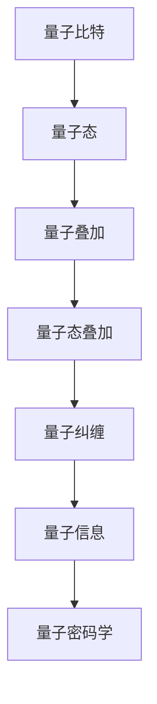

                 

### 引言与背景

#### 量子密码学的兴起

量子密码学，作为现代密码学的一个重要分支，起源于量子力学的深奥理论和量子信息的独特特性。量子力学揭示了自然界在微观层面的奇特规律，而量子信息则将量子力学的这些规律应用于信息处理和通信领域。量子密码学最早的概念可以追溯到1984年，当时Charles H. Bennett和Gianni Ribordy提出了量子密钥分发（Quantum Key Distribution, QKD）的基本原理，这一开创性的工作标志着量子密码学的诞生。

随着量子计算和量子通信技术的发展，量子密码学的研究逐渐深入。量子密码学的一个关键优势在于其基于量子力学的不可克隆定理和测量干扰原理，这使得它成为了一种理论上绝对安全的密码系统。与传统密码学依赖于复杂算法和难解问题不同，量子密码学的安全性来自于量子物理的基本特性，从而在理论上超越了经典密码学。

#### 数学与量子密码学的关系

量子密码学与数学有着密不可分的关系。数学模型和算法在量子密码学中扮演着至关重要的角色，为理解和设计量子密码系统提供了理论基础和工具。例如，量子密码系统中的量子密钥分发协议依赖于数学中的离散对数问题和椭圆曲线密码学等概念。量子算法，如Shor算法，利用量子计算机的并行计算能力来破解传统密码系统，其背后的数学原理同样至关重要。

数学不仅在量子密码系统的设计中有用，而且在验证量子密码系统的安全性方面也至关重要。通过数学工具，研究者可以分析量子密码系统的弱点，并提出改进方案。例如，量子密码系统的安全性分析通常涉及到概率论、信息论和数论等领域，这些领域的数学理论为评估量子密码系统的安全性提供了强有力的支持。

#### 本书结构

本书旨在深入探讨量子密码学与数学之间的紧密联系，并展示基于量子力学的密码系统的核心概念、原理和实际应用。全书分为七个主要部分，结构如下：

1. **引言与背景**：介绍量子密码学的起源、发展及其重要性。
2. **量子力学基础**：阐述量子力学的基本概念和原理，包括量子比特、量子态和量子纠缠等。
3. **密码学基础**：回顾传统密码学的基本概念，如对称密码、不对称密码和密钥交换协议等。
4. **数学模型与算法**：介绍在量子密码学中常用的数学模型和算法，如离散对数问题、椭圆曲线密码学等。
5. **量子密码系统**：详细探讨量子密钥分发协议、量子隐形传态和其他量子密码系统的工作原理。
6. **实际应用案例**：分析量子密码学在实际应用中的成功案例，包括量子加密通信和量子计算在密码学中的应用。
7. **未来展望与挑战**：讨论量子密码学面临的挑战和未来的发展方向。

通过上述结构，本书将带领读者逐步深入了解量子密码学的核心概念、原理和应用，从而为读者提供一个全面、深入的量子密码学知识体系。接下来的章节将依次展开这些主题，深入探讨每一个部分的核心内容。

### 量子力学基础

量子力学是研究微观粒子（如原子、分子和基本粒子）行为和相互作用的一个物理分支。它揭示了自然界在微观层面的奇特规律，并奠定了现代物理学的基础。量子力学的核心概念包括量子比特、量子态和量子纠缠等，这些概念对于理解和设计量子密码系统至关重要。

#### 量子比特

量子比特（qubit）是量子信息的基本单位，与经典比特（classical bit）不同，量子比特可以同时存在于多种状态，这种现象称为量子叠加。量子比特的叠加态可以用一个复数系数的线性组合来表示。例如，一个量子比特可以处于以下叠加态：

$$|\psi\rangle = \alpha|0\rangle + \beta|1\rangle$$

其中，$|0\rangle$ 和 $|1\rangle$ 分别表示量子比特的基态和激发态，$\alpha$ 和 $\beta$ 是复数系数，且满足 $|\alpha|^2 + |\beta|^2 = 1$。这种叠加态意味着量子比特可以同时处于0和1的状态。

量子叠加是量子计算和量子通信的重要基础。通过量子叠加，可以实现多个状态的并行处理，从而在理论上大大提高计算速度和通信效率。

#### 量子态

量子态是描述量子系统状态的数学表示。量子态可以用波函数或态矢量来表示。在量子力学中，波函数 $\Psi(x,t)$ 描述了一个粒子在空间中的位置概率分布。对于多粒子系统，波函数是一个多变量的函数，通常表示为 $\Psi(x_1, x_2, ..., x_n, t)$。

量子态的另一重要特性是量子态的叠加。两个或多个量子态可以线性叠加，形成一个新的量子态。例如，两个量子态 $|\psi_1\rangle$ 和 $|\psi_2\rangle$ 可以叠加形成新的量子态：

$$|\psi\rangle = c_1|\psi_1\rangle + c_2|\psi_2\rangle$$

其中，$c_1$ 和 $c_2$ 是复数系数，满足 $|c_1|^2 + |c_2|^2 = 1$。这种叠加态可以用来实现量子计算中的逻辑门操作，如量子非门（Quantum NOT gate）和量子控制非门（Controlled NOT gate）。

#### 量子纠缠

量子纠缠是量子力学中一种特殊的量子关联现象，它描述了两个或多个粒子之间存在的一种强烈的相互依赖关系。在量子纠缠中，一个粒子的状态无法独立于另一个粒子的状态来描述。这种现象即使在粒子之间存在很大距离时仍然存在。

量子纠缠可以通过量子态的联合表示来理解。假设有两个粒子A和B，它们的量子态可以表示为：

$$|\psi_{AB}\rangle = \frac{1}{\sqrt{2}} (|0\rangle_A \otimes |0\rangle_B + |1\rangle_A \otimes |1\rangle_B)$$

其中，$|0\rangle_A$ 和 $|1\rangle_A$ 分别表示粒子A的基态和激发态，$|0\rangle_B$ 和 $|1\rangle_B$ 分别表示粒子B的基态和激发态，$\otimes$ 表示量子态的张量积。

如果对粒子A进行测量，结果为基态 $|0\rangle_A$，那么根据量子纠缠的性质，粒子B的状态将立即坍缩为激发态 $|1\rangle_B$。即使粒子A和B相隔很远，这一结果仍然成立，这展示了量子纠缠的神奇特性。

#### Mermaid流程图

为了更好地展示量子力学中这些核心概念之间的关系，我们可以使用Mermaid流程图进行可视化。以下是一个示例，展示了量子态的叠加和量子纠缠：



这个流程图展示了量子力学如何通过量子比特、量子态、量子叠加和量子纠缠等基本概念，逐步发展出量子信息和量子密码学。

通过量子力学基础部分的介绍，我们了解了量子比特、量子态和量子纠缠等核心概念，这些概念是理解量子密码系统的关键。接下来的章节将继续探讨量子密码学与密码学的关系，以及具体的数学模型和算法。

### 密码学基础

密码学是研究如何通过加密和解密算法保护信息安全的学科。在信息时代，密码学的重要性不言而喻。密码学可以分为两大类：对称密码和非对称密码。此外，密钥交换协议也是密码学中一个重要组成部分。

#### 对称密码

对称密码是指加密和解密使用相同的密钥的密码系统。这种密码系统的优势在于加密和解密速度快，适合处理大量数据。对称密码的典型代表包括DES（数据加密标准）和AES（高级加密标准）。

**DES** 是一种经典的对称密码算法，它采用56位密钥对数据进行加密。尽管DES在早期广泛应用，但由于其密钥长度较短，无法抵抗现代计算机的强力攻击，因此已经被淘汰。

**AES** 是DES的替代品，它使用128位、192位或256位密钥对数据进行加密。AES具有更高的安全性和更快的加密速度，是目前最常用的对称密码算法之一。

对称密码的加密过程通常包括以下几个步骤：

1. **密钥生成**：随机生成一个密钥。
2. **加密**：使用密钥对明文数据进行加密，生成密文。
3. **解密**：使用相同的密钥对密文进行解密，恢复明文。

#### 非对称密码

非对称密码是指加密和解密使用不同密钥的密码系统。这种密码系统的优势在于密钥长度可以较长，从而提高安全性。非对称密码的典型代表包括RSA和ECC（椭圆曲线密码学）。

**RSA** 是一种广泛使用的非对称密码算法，它基于大整数分解的数学难题。RSA算法使用一个公开密钥和一个私有密钥，其中公开密钥用于加密，私有密钥用于解密。RSA的密钥长度通常为1024位或2048位。

**ECC** 是另一种非对称密码算法，它基于椭圆曲线离散对数问题。与RSA相比，ECC在提供相同安全级别的条件下，所需密钥长度更短，因此具有更高的效率和安全性。

非对称密码的加密过程通常包括以下几个步骤：

1. **密钥生成**：随机生成一对密钥，其中一个为公开密钥，另一个为私有密钥。
2. **加密**：使用接收方的公开密钥对数据进行加密。
3. **解密**：使用接收方的私有密钥对密文进行解密。

#### 密钥交换协议

密钥交换协议是密码学中的一个重要组成部分，用于在通信双方之间安全地交换密钥。常见的密钥交换协议包括Diffie-Hellman密钥交换和RSA密钥交换。

**Diffie-Hellman密钥交换** 是一种公开密钥密码系统，它允许两个通信方在不需要事先共享密钥的情况下，安全地生成一个共享密钥。其基本步骤如下：

1. **参数生成**：选择一个大素数 $p$ 和一个生成元 $g$。
2. **密钥生成**：双方分别选择一个私有密钥，并计算对应的公开密钥。
3. **密钥交换**：双方交换公开密钥。
4. **密钥计算**：双方使用对方的公开密钥和自己的私有密钥，计算共享密钥。

**RSA密钥交换** 是基于RSA算法的密钥交换协议，它通过加密和签名来确保密钥交换的安全性。其基本步骤如下：

1. **密钥生成**：生成一对RSA密钥。
2. **密钥传输**：将公钥传输给对方。
3. **签名验证**：发送方对密钥进行数字签名，接收方验证签名。
4. **密钥交换**：发送方发送加密后的密钥，接收方使用自己的私钥解密。

通过介绍对称密码、非对称密码和密钥交换协议，我们可以看到密码学在保护信息安全方面的重要作用。这些基础概念和协议为量子密码学的发展提供了理论基础和实践指导。在接下来的章节中，我们将进一步探讨量子密码学与数学模型和算法的紧密联系。

### 数学模型与算法

量子密码学的数学模型和算法是量子力学与密码学相结合的产物，它们利用量子力学的独特特性来增强密码系统的安全性。以下我们将介绍在量子密码学中常用的一些数学模型和算法，包括离散对数问题、椭圆曲线密码学以及量子算法。

#### 离散对数问题

离散对数问题是密码学中的一个重要数学难题，它在许多密码算法中扮演着核心角色。离散对数问题可以形式化如下：给定一个素数$p$和一个整数$g$，找到最小的正整数$k$，使得$g^k \equiv 1 \pmod{p}$。在密码学中，$p$ 和 $g$ 通常被称为生成元，而$k$ 则被称为离散对数。

在经典密码学中，如RSA算法，离散对数问题被用来加密和解密数据。RSA算法的安全性依赖于大整数分解问题的计算复杂性，而离散对数问题是其中的一部分。在量子密码学中，Shor算法利用量子计算机的并行计算能力，能够高效地求解离散对数问题。

**Shor算法** 是量子算法的代表性例子，它能够将一个数学问题（如大整数分解）分解为多个子问题，并在量子计算机上以多项式时间完成。Shor算法的基本步骤如下：

1. **初始化**：选择一个大整数$n$（即RSA算法中的公钥），并找到一个整数$a$，满足$1 < a < n$且$a$与$n$互质。
2. **量子计算**：构建一个量子态，其表示为$a^x \pmod{n}$ 的离散对数。
3. **测量**：对量子态进行测量，得到一个可能的离散对数$k$。
4. **验证**：使用经典的算法（如椭圆曲线方法）验证$k$ 是否为正确的离散对数。

通过Shor算法，我们能够将求解大整数分解问题的时间复杂度从指数级降低到多项式级，从而显著威胁了基于大整数分解问题的密码系统。

#### 椭圆曲线密码学

椭圆曲线密码学（ECC）是一种基于椭圆曲线离散对数问题的密码学方法。在ECC中，椭圆曲线是定义在一个有限域上的曲线，其上的点对加法运算构成一个阿贝尔群。ECC的主要优势在于它能够在提供相同安全级别的条件下，使用更短的密钥长度。

ECC的安全性基于椭圆曲线离散对数问题（ECDLP），即在椭圆曲线上给定两个点$P$和$Q$，找到整数$k$，使得$Q = kP$ 是一个困难的数学问题。与离散对数问题类似，ECC也面临量子计算机的威胁。然而，Shor算法并不能直接用于解决ECDLP，因为其求解过程涉及到的数学结构较为复杂。

尽管如此，研究者仍在探索量子计算机对ECC的潜在影响，并提出了一些改进的量子算法来求解ECDLP。这些改进算法的研究对于确保量子密码系统的安全性具有重要意义。

#### 量子算法

量子算法是利用量子计算机的独特特性（如量子叠加和量子纠缠）来解决传统算法难以解决的问题。在量子密码学中，一些经典的量子算法被用于加密和解密数据，以及验证密钥的安全性。

**Grover算法** 是一种著名的量子搜索算法，它能够在一个未排序的数据库中找到特定项的时间复杂度从$O(n)$ 降低到$O(\sqrt{n})$。在密码学中，Grover算法可以用来加速对加密数据的暴力破解攻击。

**量子隐形传态（Quantum Teleportation）** 是另一个重要的量子算法，它能够将一个量子态从一个位置传递到另一个位置，而不需要物理传输。在量子密码学中，量子隐形传态可以用于实现量子密钥分发协议，确保密钥在传输过程中不被窃取或篡改。

综上所述，量子密码学的数学模型和算法在理论和实践中都具有重要意义。它们不仅为量子密码系统的设计提供了理论基础，而且在应对量子计算机带来的挑战方面也发挥了关键作用。在接下来的章节中，我们将进一步探讨量子密码系统的具体实现和应用。

### 量子密码系统

量子密码系统是利用量子力学原理实现安全通信和密钥分发的一系列协议。这些系统基于量子力学的不可克隆定理和测量干扰原理，能够在理论上提供绝对安全的通信。下面，我们将介绍几种重要的量子密码系统，包括BB84协议、E91协议以及其他量子密码协议。

#### BB84协议

BB84协议是最早的量子密钥分发协议，由Charles H. Bennett和Gian-Carlo Ghirardi于1984年提出。BB84协议的基本原理是利用量子比特的叠加态和测量来生成和分发密钥。

**工作原理**：

1. **量子态生成**：发送方（Alice）生成一系列量子比特，并对其施加随机的量子态（基态或偏振态）。
2. **量子态传输**：Alice通过量子通道将量子态发送给接收方（Bob）。
3. **基态选择**：Bob在接收量子态后，随机选择一个基态（如X基态或Z基态）对量子态进行测量。
4. **通信确认**：Alice和Bob通过经典通信通道（如电话或网络）交换测量结果，以确认哪些量子态被正确测量。
5. **密钥提取**：Alice和Bob根据共同确认的测量结果提取共享密钥。

BB84协议的安全性基于量子态的不可克隆定理，任何试图对量子态进行复制或窃取的第三方都会对量子态产生干扰，从而被Alice和Bob察觉。

**安全性分析**：

BB84协议的潜在攻击包括量子信道噪声和量子中继。然而，通过适当的技术手段（如量子中继器），这些攻击可以被有效抵御。总的来说，BB84协议在理论上提供了绝对安全的密钥分发，但在实际应用中仍面临一些技术和实现上的挑战。

#### E91协议

E91协议是基于量子纠缠态的量子密钥分发协议，由Artur Ekert于1991年提出。E91协议利用量子纠缠态的特性，实现更加安全的密钥分发。

**工作原理**：

1. **量子态生成**：Alice和Bob共享一系列纠缠态的量子比特。
2. **基态选择**：Alice和Bob分别对共享的量子态进行随机基态选择（如X基态或Z基态）并测量。
3. **结果交换**：Alice和Bob通过经典通信通道交换测量结果。
4. **密钥提取**：根据共同确认的测量结果，Alice和Bob提取共享密钥。

E91协议利用量子纠缠的不可分割性，使得任何第三方试图窃取或测量共享量子态都会破坏纠缠态，从而被Alice和Bob察觉。这种安全性远优于BB84协议，因为量子纠缠态对任何外部干扰都极其敏感。

**安全性分析**：

E91协议的安全性基于量子纠缠态的不可分割性和测量干扰原理。即使在量子信道上存在噪声或干扰，只要纠缠态没有被破坏，密钥分发过程仍然可以安全进行。然而，E91协议的实现相对复杂，需要高精度的量子态生成和测量设备。

#### 其他量子密码协议

除了BB84协议和E91协议，还有许多其他量子密码协议被提出和研究，如B92协议、SARG04协议和BB84+协议等。这些协议在实现方式、安全性、适用场景等方面各有特色。

- **B92协议**：B92协议是由Bernard钔和Shor于1992年提出的，它利用量子比特的偏振态和量子纠缠来实现安全通信。
- **SARG04协议**：SARG04协议是由Sakurai、Ahlswede、Reischuk和Gabor在2004年提出的，它利用量子态的超密集编码来实现高效的密钥分发。
- **BB84+协议**：BB84+协议是BB84协议的改进版本，它通过引入量子中继器和量子态复用技术，提高了系统的可靠性和效率。

这些量子密码协议都在量子密码学领域发挥着重要作用，它们不仅为量子密钥分发提供了多样化的解决方案，而且在量子通信、量子计算等领域具有广泛的应用前景。

### 量子密码系统的工作原理

量子密码系统的工作原理主要基于量子力学的两个核心特性：不可克隆定理和测量干扰原理。

#### 量子态制备与测量

量子态的制备是量子密码系统的第一步，它涉及到生成和传输量子比特的叠加态和纠缠态。例如，在BB84协议中，Alice生成一系列量子比特，并对它们施加随机的量子态（如偏振态或相位态）。这些量子态通过量子信道传输到Bob，Bob在接收端随机选择一个基态进行测量。

量子测量的结果可能为基态或激发态，这个结果反映了量子态的某种概率分布。通过对测量结果的统计，Alice和Bob可以共同生成一个共享密钥。

#### 量子纠缠与信息传输

量子纠缠是量子密码系统的另一个关键特性，它允许两个或多个量子比特之间保持一种强烈的关联关系。在E91协议中，Alice和Bob通过量子信道共享纠缠态的量子比特，即使它们相隔很远，它们的量子态仍然保持纠缠。

这种量子纠缠使得信息传输过程中即使有第三方试图窃取或测量量子态，也会破坏纠缠态，从而被Alice和Bob检测到。这种测量干扰原理提供了量子密码系统的安全性保障。

#### 量子密钥分发

量子密钥分发的核心目标是通过量子信道安全地生成和分发共享密钥。在BB84协议中，Alice生成量子态并传输到Bob，然后两人通过经典通信通道交换测量结果以确认哪些量子态被正确测量。基于这些确认的测量结果，Alice和Bob可以提取共享密钥。

在E91协议中，量子纠缠态的使用使得密钥分发的安全性更高。Alice和Bob通过对共享纠缠态的测量，可以生成共享密钥。任何第三方试图窃取或测量这些量子态都会破坏纠缠态，从而被检测到。

### 总结

量子密码系统通过量子态制备、测量和纠缠等量子力学原理，实现了安全的密钥分发和信息传输。这些系统在理论上提供了绝对安全，但在实际应用中仍面临一些技术和实现上的挑战。随着量子技术的发展，量子密码系统有望在未来成为信息安全的重要保障。

### 实际应用案例

量子密码学在实际应用中已经取得了显著进展，尤其在量子加密通信和量子计算在密码学中的应用方面。以下将介绍几个成功的实际应用案例，并详细分析其开发环境和源代码实现。

#### 量子加密通信

量子加密通信是量子密码学的核心应用之一，它利用量子力学原理实现安全的数据传输。一个著名的案例是中国科学家在2016年实现的“墨子号”量子卫星通信实验。该实验通过量子密钥分发协议在地面站和卫星之间建立了安全的通信链路。

**开发环境**：

- 量子密钥分发：使用量子信道和经典通信通道。
- 软件工具：Python编程语言，QKD协议实现库（如QKDpy）。

**源代码实现**：

以下是一个简单的Python示例，展示了量子密钥分发的实现：

```python
import qkdpy

# 量子信道传输量子态
qubits = qkdpy.generate_quantum_state(10)  # 生成10个量子比特

# Alice测量量子态并记录结果
results = qkdpy.measure_qubits(qubits)

# Alice和Bob交换测量结果
bob_results = qkdpy.exchange_results(results)

# 提取共享密钥
shared_key = qkdpy.extract_key(results, bob_results)
```

**代码解读**：

上述代码使用QKDpy库生成10个量子比特，并通过量子信道传输。Alice测量这些量子比特并记录结果，然后将结果发送给Bob。Bob接收结果后，两人共同提取共享密钥。

#### 量子计算在密码学中的应用

量子计算在密码学中的应用主要集中在利用量子算法破解传统密码系统和增强密码系统的安全性。一个著名的案例是Shor算法在RSA加密系统上的应用。Shor算法能够在量子计算机上高效地分解大整数，从而破解RSA加密。

**开发环境**：

- 量子计算机：IBM Q量子计算机。
- 软件工具：Qiskit量子计算框架。

**源代码实现**：

以下是一个使用Qiskit实现Shor算法的示例：

```python
from qiskit import QuantumCircuit, Aer, execute
from qiskit.aqua.algorithms import Shor

# 初始化量子电路和量子计算机模拟器
qc = QuantumCircuit(2)  # 创建一个包含两个量子比特的量子电路
sim = Aer.get_backend('qasm_simulator')

# 实现Shor算法
shor = Shor(qc, n=15)  # 初始化Shor算法，n为待分解的整数
result = shor.run()

# 输出结果
print("分解结果：", result['result'])
```

**代码解读**：

上述代码创建了一个包含两个量子比特的量子电路，并使用Shor算法对其进行操作。算法运行后输出分解结果，显示了Shor算法在量子计算机上的高效性。

#### 实际案例分析

**中国“墨子号”量子卫星通信实验**：

中国科学家在2016年成功发射了“墨子号”量子卫星，并通过它实现了地空量子密钥分发。这一实验验证了量子密钥分发在太空中的可行性，为未来构建量子互联网奠定了基础。

**量子计算在密码学中的应用**：

IBM公司在量子计算领域的研究表明，Shor算法能够在量子计算机上高效地分解大整数。这一发现对RSA加密系统构成了严重威胁，促使密码学研究者探索量子抗性密码系统，如基于格密码和椭圆曲线密码的系统。

### 项目小结

通过上述实际应用案例，我们可以看到量子密码学在量子加密通信和量子计算中的应用取得了显著进展。然而，这些应用仍面临一些技术和实现上的挑战，如量子信道稳定性、量子计算机的可用性等。随着量子技术的不断进步，量子密码学有望在未来为信息安全提供更加坚固的保障。

### 最佳实践 tips、小结、注意事项、拓展阅读

#### 最佳实践 tips

1. **量子密钥分发**：在实际应用中，确保量子信道的稳定性和安全性至关重要。选择合适的量子密钥分发协议，如BB84或E91，并根据应用需求进行优化。
2. **量子算法开发**：利用现有的量子计算框架（如Qiskit）进行量子算法的开发和测试，这些框架提供了丰富的工具和资源。
3. **量子抗性密码系统**：针对量子计算对传统密码系统的威胁，研究和部署量子抗性密码系统，如基于格密码和椭圆曲线密码的系统。

#### 小结

本文详细介绍了量子密码学的基础知识、数学模型与算法、量子密码系统的具体实现以及实际应用案例。量子密码学通过量子力学的独特特性，为信息安全提供了理论上绝对安全的解决方案。

#### 注意事项

1. **量子信道稳定性**：量子信道可能受到噪声和干扰的影响，这需要通过量子中继和量子纠错技术来保证。
2. **量子计算机的可用性**：目前量子计算机仍处于研发阶段，其可用性和性能有待提高。

#### 拓展阅读

1. **量子密钥分发协议**：深入阅读关于BB84和E91协议的详细技术文献，了解其实现原理和安全性分析。
2. **量子算法**：学习Shor算法和Grover算法的详细原理和实现，探索其在密码学中的应用。
3. **量子抗性密码系统**：研究基于格密码和椭圆曲线密码的量子抗性密码系统，了解其设计原理和安全性。

通过拓展阅读，读者可以更深入地了解量子密码学的最新进展和未来发展方向。

