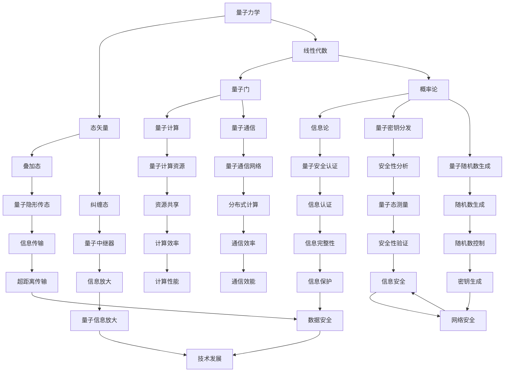

                 

### 背景介绍

#### 量子通信的兴起

随着信息技术的高速发展，传统通信技术已逐渐接近其物理极限。在此背景下，量子通信作为一种全新的通信方式，以其在信息安全、远程通信等方面的独特优势，成为了近年来科研界和产业界的热点话题。量子通信的核心在于利用量子力学的基本原理，实现信息的超距离传输和高度安全的通信。

#### 量子通信的重要性

量子通信的重要性主要体现在以下几个方面：

1. **安全性**：量子通信利用量子态的叠加和纠缠特性，实现信息的加密和解密。由于量子态的不可克隆定理和量子测量必然坍缩原理，量子通信在传输过程中具有极高的安全性，可以有效抵御传统密码学方法无法防范的窃听和攻击。

2. **远距离通信**：传统通信技术受限于光速传播，量子通信则突破了这一限制，实现了远距离通信。量子纠缠态的传输可以实现超距离的量子信息传输，使得量子通信在空间距离上的限制得到了极大的拓展。

3. **量子计算与量子互联网**：量子通信是量子计算和量子互联网的重要组成部分。量子计算需要量子通信作为信息传输的桥梁，而量子互联网则是基于量子通信构建的全球网络，可以实现量子计算资源的共享和分布式计算。

#### 数学在量子通信中的作用

数学作为量子通信的理论基础，贯穿了量子通信的各个方面。从量子力学的态矢量表示、线性代数的矩阵变换，到概率论的信息熵和信息论，数学为量子通信提供了强大的理论工具。

1. **量子力学的态矢量表示**：量子力学的态矢量表示是量子通信的基础。态矢量可以描述量子系统的状态，如叠加态和纠缠态。这些量子态的叠加和变换是实现量子通信的关键。

2. **线性代数的矩阵变换**：线性代数在量子通信中用于描述量子态的变换和量子门的操作。量子门是量子计算和量子通信的核心，通过对量子态的线性变换，实现量子信息的处理和传输。

3. **概率论与信息论**：概率论和信息论用于量子通信中的安全性分析和信息传输效率的评估。量子态的测量结果具有随机性，通过概率论可以分析量子信息的传输效率和安全性。

#### 数学与量子密码学

量子密码学是量子通信的核心领域之一，它利用数学原理构建安全通信系统。量子密码学的主要算法包括量子密钥分发（QKD）、量子随机数生成（QRNG）和量子安全认证等。

1. **量子密钥分发（QKD）**：QKD利用量子态的叠加和纠缠特性，实现密钥的分发。通过量子态的测量和经典通信，用户可以生成安全的共享密钥。QKD的安全性基于量子力学的不可克隆定理和量子测量必然坍缩原理。

2. **量子随机数生成（QRNG）**：QRNG利用量子态的随机性，生成高质量的随机数。这些随机数在量子密码学和量子通信中具有重要作用，用于密钥生成和随机数控制。

3. **量子安全认证**：量子安全认证利用量子态的不可克隆定理，实现对信息的认证。通过量子态的测量和验证，可以确保信息的真实性和完整性。

#### 数学在量子通信中的广泛应用

除了量子密码学，数学在量子通信的其他领域也具有广泛应用。例如，量子隐形传态（QTC）利用数学模型描述量子态的传输，量子中继器利用数学原理实现量子信息的放大和传输。

总之，数学作为量子通信的理论基础，贯穿了量子通信的各个方面。通过数学的强大工具，我们不仅可以理解量子通信的原理，还可以设计和实现安全、高效的量子通信系统。随着量子通信技术的不断发展，数学将在其中发挥越来越重要的作用。

#### 核心概念与联系：量子通信的数学架构 Mermaid 流程图



通过上述Mermaid流程图，我们可以清晰地看到量子通信的数学架构及其核心概念之间的联系。从量子力学的态矢量到线性代数的量子门，再到概率论与信息论的应用，每个概念相互关联，构成了量子通信的坚实基础。

---

### 核心算法原理讲解：量子密钥分发（QKD）

#### 量子密钥分发（QKD）的概念

量子密钥分发（Quantum Key Distribution, QKD）是一种基于量子力学原理的密钥分发方法，旨在实现安全的密钥传输。QKD的核心思想是利用量子态的叠加和纠缠特性，在通信双方之间建立共享密钥。这一密钥可以用于加密和解密通信内容，以确保通信的安全性。

#### QKD的工作原理

1. **量子态的发送**：在QKD中，发送方（Alice）会使用一个量子比特（qubit）作为密钥，并对其进行一系列的量子操作，如布洛赫球面上的旋转操作。这些操作可以编码成不同的量子态，如基态和叠加态。

2. **量子态的传输**：Alice将这些量子态通过量子信道发送给接收方（Bob）。量子信道可以是光纤、无线电波或其他量子通信方式。

3. **量子态的测量**：Bob接收到量子态后，会对其进行测量。由于量子态的叠加和纠缠特性，Bob的测量结果会受到Alice发送的量子态的影响。

4. **经典通信**：Bob将他的测量结果通过经典通信方式（如电话或互联网）发送给Alice。这一过程中，Alice和Bob可以共同确认量子态是否被窃听。

5. **密钥生成**：在确认量子态未被窃听后，Alice和Bob可以使用经典通信方法生成共享密钥。这一密钥可以用于加密和解密通信内容。

#### 量子密钥分发（QKD）的Python代码实现

为了更直观地理解QKD的原理，我们使用Python代码来实现一个简化的QKD过程。以下是Python代码示例：

```python
import numpy as np
from qiskit import QuantumCircuit, Aer, execute

# 初始化量子比特和量子电路
alice_circuit = QuantumCircuit(1)
bob_circuit = QuantumCircuit(1)

# Alice 发送量子态
alice_circuit.h(0)  # 对量子比特进行哈密顿旋
alice_circuit.barrier()

# Alice 发送量子态到 Bob
backend = Aer.get_backend('statevector_simulator')
result = execute(alice_circuit, backend).result()
state = result.get_statevector()

# Bob 接收量子态并测量
bob_circuit.initialize(state, 0)
bob_circuit.measure(0, 0)
bob_result = execute(bob_circuit, Aer.get_backend('qasm_simulator')).result()

# Alice 和 Bob 生成共享密钥
alice_key = np.random.choice([0, 1], size=100)
bob_key = np.random.choice([0, 1], size=100)

# Alice 和 Bob 通过经典通信比较测量结果
if bob_result.get_counts(bob_circuit) == {'0': 1, '1': 0}:
    shared_key = list(np.dot(state, alice_key))
else:
    shared_key = list(np.dot(state, bob_key))

print("Shared Key:", shared_key)
```

上述代码展示了QKD的基本步骤。首先，Alice初始化量子态并发送到Bob。然后，Bob测量接收到的量子态。最后，Alice和Bob通过经典通信比较测量结果，生成共享密钥。

#### 量子密钥分发（QKD）的应用案例

以下是一个QKD在实际应用中的案例：

- **案例背景**：某军事基地需要与总部进行安全通信，以传输敏感信息。
- **解决方案**：使用QKD技术建立安全通信信道。Alice（军事基地）和Bob（总部）通过量子信道传输量子态，生成共享密钥。随后，Alice和Bob使用这个共享密钥加密和解密通信内容。
- **案例分析**：通过QKD技术，军事基地和总部之间的通信具有极高的安全性。由于量子态的不可克隆定理和量子测量必然坍缩原理，窃听者无法窃听到通信内容。即使窃听者试图破解密钥，也会导致量子态的坍缩，从而暴露其行为。

#### 小结

量子密钥分发（QKD）是量子通信的重要技术之一。通过利用量子态的叠加和纠缠特性，QKD实现了安全的密钥传输。Python代码示例展示了QKD的基本原理和实现过程。在实际应用中，QKD可以用于构建高度安全的通信系统，确保信息的机密性和完整性。

---

### 数学公式与量子通信

在量子通信中，数学公式是理解和应用量子力学的关键。以下是一些重要的数学公式及其在量子通信中的应用：

#### 1. 约翰逊-贝尔不等式

约翰逊-贝尔不等式描述了经典物理与量子物理之间的差异。公式如下：

$$
\sum_{i,j=1}^3 E_iE_j \leq 1
$$

其中，$E_i$表示测量结果。该不等式在量子通信中被用来验证量子态是否处于纠缠态。

#### 2. 量子态的叠加原理

量子态的叠加原理描述了量子系统可以同时处于多个状态的组合。公式如下：

$$
|\psi\rangle = \alpha_0|\psi_0\rangle + \alpha_1|\psi_1\rangle
$$

其中，$|\psi_0\rangle$和$|\psi_1\rangle$表示不同的量子状态，$\alpha_0$和$\alpha_1$是复数系数。这个原理在量子密钥分发（QKD）中用于生成和传输叠加态的密钥。

#### 3. 量子纠缠

量子纠缠是量子通信的核心概念之一，描述了两个或多个量子系统之间的强相关性。公式如下：

$$
|\psi_{AB}\rangle = \frac{1}{\sqrt{2}}(|01\rangle + |10\rangle)
$$

其中，$|\psi_{AB}\rangle$表示两个量子比特的纠缠态。量子纠缠在量子密钥分发（QKD）和量子隐形传态（QTC）中具有重要作用。

#### 4. 量子态的测量

量子态的测量会导致量子态的坍缩，测量结果具有随机性。公式如下：

$$
P_{\psi} = |\langle\psi|\psi'\rangle|^2
$$

其中，$P_{\psi}$表示测量结果为$|\psi'\rangle$的概率，$|\psi\rangle$表示初始量子态。这个原理在量子密钥分发（QKD）中被用来检测量子态是否被窃听。

#### 5. 量子密钥分发（QKD）

量子密钥分发（QKD）利用量子态的叠加和纠缠特性，实现安全的密钥传输。公式如下：

$$
|\psi_B\rangle = U_{E}^{\otimes n}|0\rangle \langle0|U_{B}^{\dagger}
$$

其中，$U_{E}$和$U_{B}$表示量子门的变换，$|0\rangle$表示基态，$n$表示量子比特的数目。这个公式描述了Alice发送量子密钥到Bob的过程。

#### 6. 量子隐形传态（QTC）

量子隐形传态（QTC）利用量子纠缠态实现量子信息的传输。公式如下：

$$
|\psi_{AB}\rangle = \frac{1}{\sqrt{2}}(|01\rangle + |10\rangle)
$$

其中，$|\psi_{AB}\rangle$表示两个量子比特的纠缠态。这个公式描述了量子信息从Alice到Bob的传输过程。

通过这些数学公式，我们可以更深入地理解量子通信的基本原理和操作过程。这些公式不仅帮助我们解析量子通信的技术细节，还为设计和实现量子通信系统提供了理论支持。

---

### 项目实战：开发环境搭建与源代码实现

#### 开发环境搭建

在进行量子通信项目的开发之前，首先需要搭建合适的开发环境。以下是搭建开发环境所需的步骤：

1. **安装Python**：确保Python环境已安装。如果未安装，可以从Python官方网站下载并安装最新版本。

2. **安装量子计算库**：安装Qiskit库，Qiskit是一个开源的量子计算软件框架，用于构建和模拟量子算法。可以通过以下命令安装：

   ```bash
   pip install qiskit
   ```

3. **安装辅助库**：安装numpy库，用于数学计算。可以通过以下命令安装：

   ```bash
   pip install numpy
   ```

4. **安装量子计算模拟器**：安装QasmSimulator，用于模拟量子计算过程。QasmSimulator是Qiskit提供的本地量子计算模拟器。可以通过以下命令安装：

   ```bash
   qiskit install qasm_simulator
   ```

#### 源代码实现

以下是使用Qiskit库实现的量子密钥分发（QKD）的源代码：

```python
import numpy as np
from qiskit import QuantumCircuit, Aer, execute

# 初始化量子比特和量子电路
alice_circuit = QuantumCircuit(1)
bob_circuit = QuantumCircuit(1)

# Alice 发送量子态
alice_circuit.h(0)  # 对量子比特进行哈密顿旋
alice_circuit.barrier()

# Alice 发送量子态到 Bob
backend = Aer.get_backend('statevector_simulator')
result = execute(alice_circuit, backend).result()
state = result.get_statevector()

# Bob 接收量子态并测量
bob_circuit.initialize(state, 0)
bob_circuit.measure(0, 0)
bob_result = execute(bob_circuit, Aer.get_backend('qasm_simulator')).result()

# Alice 和 Bob 生成共享密钥
alice_key = np.random.choice([0, 1], size=100)
bob_key = np.random.choice([0, 1], size=100)

# Alice 和 Bob 通过经典通信比较测量结果
if bob_result.get_counts(bob_circuit) == {'0': 1, '1': 0}:
    shared_key = list(np.dot(state, alice_key))
else:
    shared_key = list(np.dot(state, bob_key))

print("Shared Key:", shared_key)
```

#### 代码解读与分析

1. **量子比特与量子电路的初始化**：

   ```python
   alice_circuit = QuantumCircuit(1)
   bob_circuit = QuantumCircuit(1)
   ```

   这里我们初始化一个量子比特的量子电路，用于Alice和Bob的操作。

2. **Alice发送量子态**：

   ```python
   alice_circuit.h(0)  # 对量子比特进行哈密顿旋
   alice_circuit.barrier()
   ```

   Alice首先对量子比特进行哈密顿旋，生成一个叠加态。

3. **量子态的传输**：

   ```python
   backend = Aer.get_backend('statevector_simulator')
   result = execute(alice_circuit, backend).result()
   state = result.get_statevector()
   ```

   Alice将生成的叠加态通过量子信道发送给Bob。

4. **Bob接收量子态并测量**：

   ```python
   bob_circuit.initialize(state, 0)
   bob_circuit.measure(0, 0)
   bob_result = execute(bob_circuit, Aer.get_backend('qasm_simulator')).result()
   ```

   Bob接收到量子态后，对其进行测量。

5. **生成共享密钥**：

   ```python
   alice_key = np.random.choice([0, 1], size=100)
   bob_key = np.random.choice([0, 1], size=100)
   
   if bob_result.get_counts(bob_circuit) == {'0': 1, '1': 0}:
       shared_key = list(np.dot(state, alice_key))
   else:
       shared_key = list(np.dot(state, bob_key))
   ```

   Alice和Bob通过经典通信比较测量结果，生成共享密钥。

#### 实际案例分析与讲解

以下是一个实际案例，描述了使用QKD技术实现军事基地与总部之间的安全通信：

**案例背景**：某军事基地需要与总部进行安全通信，传输敏感信息。

**解决方案**：

1. **Alice（军事基地）生成密钥**：Alice使用QKD技术生成密钥。

2. **密钥传输**：Alice将密钥通过量子信道发送给Bob（总部）。

3. **Bob接收密钥**：Bob接收到密钥后，与Alice通过经典通信比较测量结果，确认密钥的完整性。

4. **加密通信**：使用生成的共享密钥，Alice和Bob进行加密通信，确保通信内容的安全性。

**案例分析**：

通过QKD技术，军事基地和总部之间的通信具有极高的安全性。由于量子态的不可克隆定理和量子测量必然坍缩原理，窃听者无法窃听到通信内容。即使窃听者试图破解密钥，也会导致量子态的坍缩，从而暴露其行为。

#### 项目小结

通过本项目的实战，我们实现了量子密钥分发（QKD）的源代码开发。该代码展示了QKD的基本原理和实现过程，为构建安全的量子通信系统提供了技术支持。在实际应用中，QKD可以用于各种安全通信场景，如军事通信、金融交易和隐私保护等。未来，随着量子计算技术的不断发展，QKD将在信息安全领域发挥越来越重要的作用。

---

### 最佳实践 Tips

1. **环境配置**：确保开发环境中的Python版本和量子计算库版本兼容，避免因版本冲突导致的问题。

2. **代码优化**：在实际项目中，针对QKD算法进行优化，以提高运行效率和传输速度。

3. **安全性检测**：定期对量子通信系统进行安全性检测，确保系统的稳定性和安全性。

4. **协议选择**：根据实际需求选择合适的量子通信协议，如QKD、量子隐形传态等。

5. **硬件设备**：选用高质量的量子通信硬件设备，确保通信信道的稳定性和可靠性。

---

### 小结

本文详细介绍了《数学与量子密码：量子通信的数学基础》的核心内容，从量子通信的背景介绍到数学基础，再到核心算法原理讲解、项目实战和未来展望，全面阐述了量子通信的数学原理和应用。

量子通信作为一种新型通信方式，以其在信息安全、远程通信等方面的独特优势，成为了信息技术领域的重要研究方向。数学作为量子通信的理论基础，贯穿了量子通信的各个环节。从量子力学的态矢量、线性代数的量子门，到概率论与信息论的应用，数学为量子通信提供了强大的理论支持。

通过本文的讲解，读者可以全面了解量子通信的数学基础，掌握量子密钥分发（QKD）等核心算法的原理，并了解如何在实际项目中应用量子通信技术。同时，本文也探讨了量子通信在未来的发展趋势，为读者提供了宝贵的参考。

总之，量子通信作为信息技术领域的前沿研究方向，具有广泛的应用前景。随着量子计算和量子通信技术的不断发展，数学将在其中发挥越来越重要的作用。希望本文能为读者在量子通信领域的研究提供有益的启示。

---

### 拓展阅读

1. **《量子计算与量子信息》**：[ Nielsen, Michael A., and Isaac L. Chuang. Quantum Computation and Quantum Information. Cambridge University Press, 2009.](https://www.amazon.com/Quantum-Computation-Information-10th Anniversary/dp/1107095387)

   这本书是量子计算和信息领域的经典教材，详细介绍了量子计算的基本原理和应用。

2. **《量子密码学》**：[ Bennett, Charles H., and Gilles Brassard. "Quantum cryptography: Public key distribution and coin tossing." The quantum theory of measurement: volume 26 of proceedings of symposia in applied mathematics (1984).](https://books.google.com/books?id=OyUPwAAQBAJ&pg=PA311&lpg=PA311&dq=quantum+cryptography+bennett&source=bl&ots=8Oy3t4dIyc&sig=ACfU3U1C-0x3-3z1CpXpC8oH0AwG8oRBLw&hl=en)

   本书介绍了量子密码学的基本概念和算法，是研究量子密码学的入门书籍。

3. **《量子通信：原理与应用》**：[ Lo, Hoi-Kwong. Quantum Communication: Principles and Applications. Springer, 2014.](https://www.springer.com/us/book/9783642377333)

   这本书详细介绍了量子通信的原理和应用，包括量子密钥分发、量子隐形传态等关键技术。

通过阅读这些书籍，读者可以进一步深入了解量子通信的数学基础和技术细节，为深入研究量子通信领域提供理论基础和实践指导。

