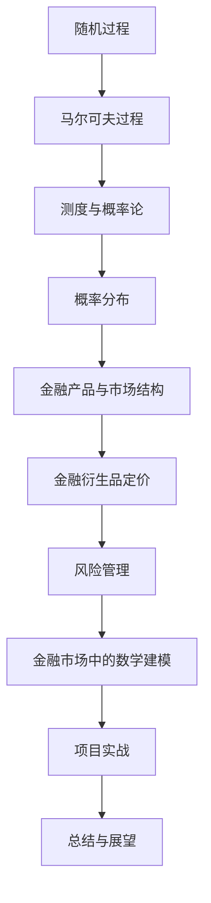

                 

# 数学与金融工程：金融产品的数学定价

> 关键词：金融工程、数学定价、随机过程、风险度量、衍生品定价模型

> 摘要：本文将探讨数学与金融工程的结合，重点研究金融产品的数学定价问题。通过介绍随机过程、风险度量、衍生品定价模型等核心概念，以及相关Python源代码和实际案例分析，本文旨在为读者提供对金融产品数学定价的深入理解。

## 第1章 引言

### 1.1 研究背景

金融市场是现代经济体系中的重要组成部分，金融产品种类繁多，包括股票、债券、期货、期权等。这些金融产品在交易过程中，价格波动频繁，不确定性较高。为了更好地进行投资决策和风险管理，准确定价金融产品变得尤为重要。数学作为一门工具性学科，为金融工程提供了强有力的支持。通过数学建模和算法分析，我们可以对金融产品进行定量分析，提高定价的准确性和可靠性。

### 1.2 研究目的与意义

本文的研究目的是探讨数学在金融工程中的应用，特别是金融产品的数学定价问题。通过深入研究随机过程、风险度量、衍生品定价模型等核心概念，本文旨在为金融工程师和投资者提供理论支持和实践指导，提高金融市场的效率和稳定性。研究意义主要体现在以下几个方面：

1. 提高金融产品的定价准确性，降低投资风险。
2. 为金融机构和投资者提供有效的风险管理工具。
3. 促进数学与金融工程的交叉发展，推动金融科技的创新。

### 1.3 书籍结构概述

本文分为八个章节，各章节的主要内容如下：

- 第1章：引言，介绍研究的背景、目的与意义，以及书籍结构。
- 第2章：数学基础，讨论随机过程、马尔可夫过程、测度与概率论、概率分布等基础数学知识。
- 第3章：金融产品与市场结构，介绍基本金融产品、市场结构与行为、市场模型。
- 第4章：金融衍生品定价，讨论套利定价理论、二叉树模型、Black-Scholes模型、闭型期权定价公式、美式期权定价。
- 第5章：风险管理，介绍风险度量、风险模型、风险对冲策略、风险管理实践。
- 第6章：金融市场中的数学建模，讨论金融市场行为模型、状态价格模型、蒙特卡洛模拟、面向金融市场的机器学习。
- 第7章：项目实战，通过实际金融项目展示数学与金融工程的应用。
- 第8章：总结与展望，总结主要发现、存在问题与挑战、未来研究方向。

## 第2章 数学基础

### 2.1 随机过程

随机过程是金融工程中一个重要的数学工具，用于描述金融产品价格的随机波动。随机过程通常由一组随机变量组成，这些随机变量在时间维度上具有随机性。在金融工程中，我们通常使用布朗运动（Wiener过程）作为随机过程的典型代表。

#### 2.1.1 布朗运动的基本性质

布朗运动具有以下几个基本性质：

1. **连续性**：布朗运动的路径是连续的，但不是绝对连续的。
2. **独立增量**：布朗运动在任意时间间隔内的增量是独立的。
3. **正态分布**：布朗运动的增量服从正态分布。

#### 2.1.2 布朗运动的数学描述

布朗运动可以用以下数学模型来描述：

$$
dB_t = \mu dt + \sigma dW_t
$$

其中，\(W_t\) 是标准布朗运动，\(\mu\) 是漂移系数，\(\sigma\) 是波动系数。

#### 2.1.3 布朗运动的Python实现

```python
import numpy as np
import matplotlib.pyplot as plt

def brownian_motion(n, mu=0, sigma=1, dt=1/n):
    W = np.random.normal(0, np.sqrt(dt), n)
    W = np.cumsum(W) + mu * n * dt
    return W

n_steps = 1000
n = 10000
W = brownian_motion(n_steps)

plt.plot(W)
plt.xlabel('Time')
plt.ylabel('Brownian Motion')
plt.title('Brownian Motion')
plt.show()
```

### 2.2 马尔可夫过程

马尔可夫过程是另一种在金融工程中广泛应用的随机过程。马尔可夫过程具有以下几个基本性质：

1. **无后效性**：当前状态只与前一状态有关，与过去的状态无关。
2. **状态转移概率**：任意两个状态之间的转移概率只与它们的状态有关，而与时间无关。

#### 2.2.1 马尔可夫过程的基本模型

马尔可夫过程可以用以下数学模型来描述：

$$
X_t = \sum_{i=1}^{k} p_{ij} X_{t-1}
$$

其中，\(X_t\) 是当前状态，\(X_{t-1}\) 是前一状态，\(p_{ij}\) 是状态转移概率矩阵。

#### 2.2.2 马尔可夫过程的Python实现

```python
import numpy as np

# 初始状态概率分布
p = np.array([[0.5, 0.5]])

# 状态转移概率矩阵
P = np.array([[0.2, 0.8], [0.8, 0.2]])

# 迭代次数
n = 10

for _ in range(n):
    p = np.dot(P, p)

print(p)
```

### 2.3 测度与概率论

测度与概率论是金融工程中的基础数学工具，用于描述随机事件的发生概率。在金融工程中，我们通常使用概率论来分析金融产品的价格分布和风险。

#### 2.3.1 测度的基本概念

测度是描述集合大小的数学工具，用于衡量集合中的元素个数或空间的大小。在概率论中，测度用于定义概率空间，描述随机事件的发生概率。

#### 2.3.2 概率论的基本定理

概率论的基本定理包括：

1. **概率加法公式**：多个互斥事件的总概率等于各个事件概率的和。
2. **条件概率**：在某个事件发生的条件下，另一个事件发生的概率。
3. **全概率公式**：一个事件的总概率可以通过其条件概率和各个条件的概率计算得到。

#### 2.3.3 概率论的Python实现

```python
import numpy as np

# 初始化随机数生成器
np.random.seed(0)

# 生成随机样本
data = np.random.normal(size=1000)

# 计算概率
mean = np.mean(data)
std = np.std(data)

# 条件概率
P_x_given_y = np.mean(data[data < mean])

# 全概率公式
P_y = np.mean(data < mean)
P_x_and_y = np.mean(data[data < mean] < std)

print("Mean:", mean)
print("Standard Deviation:", std)
print("Condition Probability:", P_x_given_y)
print("Full Probability:", P_y)
print("Intersection Probability:", P_x_and_y)
```

### 2.4 概率分布

概率分布是描述随机变量取值概率的函数。在金融工程中，常用的概率分布包括正态分布、泊松分布、二项分布等。

#### 2.4.1 正态分布

正态分布是最常见的概率分布之一，也称为高斯分布。正态分布具有以下几个特点：

1. **对称性**：正态分布的对称轴是均值，左右两侧的概率相等。
2. **峰度**：正态分布的峰度较低，近似为尖锐的尖峰。
3. **尾部**：正态分布的尾部较轻，远离均值的概率较低。

#### 2.4.2 泊松分布

泊松分布用于描述在固定时间内事件发生的次数。泊松分布具有以下几个特点：

1. **可加性**：泊松分布的和仍然是泊松分布。
2. **均值与方差相等**：泊松分布的均值和方差相等。
3. **方差与时间成正比**：泊松分布的方差与时间成线性关系。

#### 2.4.3 二项分布

二项分布用于描述在多次实验中成功次数的概率。二项分布具有以下几个特点：

1. **可加性**：二项分布的和仍然是二项分布。
2. **概率分布**：二项分布的概率分布函数是离散的，取值只能是0或1。
3. **均值与方差**：二项分布的均值和方差与实验次数和成功概率有关。

#### 2.4.4 概率分布的Python实现

```python
import numpy as np
import matplotlib.pyplot as plt

# 正态分布
mean = 0
std = 1
data = np.random.normal(mean, std, size=1000)
plt.hist(data, bins=30)
plt.xlabel('Value')
plt.ylabel('Frequency')
plt.title('Normal Distribution')
plt.show()

# 泊松分布
lambda_ = 2
data = np.random.poisson(lambda_, size=1000)
plt.hist(data, bins=30)
plt.xlabel('Value')
plt.ylabel('Frequency')
plt.title('Poisson Distribution')
plt.show()

# 二项分布
n = 10
p = 0.5
data = np.random.binomial(n, p, size=1000)
plt.hist(data, bins=30)
plt.xlabel('Value')
plt.ylabel('Frequency')
plt.title('Binomial Distribution')
plt.show()
```

## 第3章 金融产品与市场结构

### 3.1 基本金融产品

金融产品是指各种可以在金融市场上交易的资产。基本金融产品包括股票、债券、期货、期权等。

#### 3.1.1 股票

股票是公司股份的证明，代表着股东在公司中所拥有的权益。股票价格受到公司业绩、市场情绪、宏观经济环境等多种因素的影响。

#### 3.1.2 债券

债券是公司或政府为筹集资金而发行的债务凭证。债券价格与市场利率成反比，当市场利率上升时，债券价格下跌。

#### 3.1.3 期货

期货是一种衍生金融工具，用于买卖未来某一时间点的资产。期货价格受到供需关系、市场情绪等多种因素的影响。

#### 3.1.4 期权

期权是一种权利，允许持有人在特定时间以特定价格买卖资产。期权价格受到资产价格、到期时间、波动率等多种因素的影响。

### 3.2 市场结构与行为

市场结构是指金融市场中的各种制度安排和组织形式。市场行为是指市场参与者的交易行为和决策过程。

#### 3.2.1 市场结构

市场结构可以分为以下几种类型：

1. **完全竞争市场**：市场中存在大量的买家和卖家，产品同质化，市场信息完全透明。
2. **垄断市场**：市场中只有一个卖家或多个卖家形成垄断联盟，市场信息不透明。
3. **垄断竞争市场**：市场中存在多个卖家，产品具有一定的差异性，市场信息不完全透明。

#### 3.2.2 市场行为

市场行为可以分为以下几种类型：

1. **套利行为**：投资者通过同时进行多头和空头交易，利用市场的不完善来获得无风险利润。
2. **投机行为**：投资者通过预测市场走势，进行买入或卖出交易，以获取高额利润。
3. **避险行为**：投资者通过购买衍生品等工具，来规避投资风险。

### 3.3 市场模型

市场模型是用于描述金融市场价格波动和交易行为的数学模型。常用的市场模型包括：

#### 3.3.1 随机漫步模型

随机漫步模型假设金融市场的价格波动是随机过程，市场价格的变化是随机且不可预测的。

#### 3.3.2 市场均衡模型

市场均衡模型假设市场价格是由供需关系决定的，市场价格围绕着均衡价格波动。

#### 3.3.3 马尔可夫模型

马尔可夫模型假设金融市场的价格变化只与当前状态有关，与过去的状态无关。

#### 3.3.4 ARMA模型

ARMA模型是一种时间序列模型，用于分析金融市场的价格波动。

## 第4章 金融衍生品定价

### 4.1 套利定价理论

套利定价理论是一种用于推导金融衍生品定价的理论。套利定价理论的核心思想是，在一个无套利市场中，任何金融衍生品的定价都可以通过套利策略来确定。

#### 4.1.1 无套利市场

无套利市场是指不存在套利机会的市场。在无套利市场中，所有金融衍生品的定价都是合理的。

#### 4.1.2 套利策略

套利策略是指通过同时进行多头和空头交易，利用市场的不完善来获得无风险利润的策略。

#### 4.1.3 套利定价公式

套利定价公式可以用来计算金融衍生品的定价。套利定价公式为：

$$
P = \frac{E\left[\ln(S_t)\right]}{r - q}
$$

其中，\(P\) 是金融衍生品的定价，\(E\left[\ln(S_t)\right]\) 是资产价格的对数期望，\(r\) 是无风险利率，\(q\) 是资产的红利收益率。

#### 4.1.4 Python实现

```python
import numpy as np
import matplotlib.pyplot as plt

def log_return(S):
    return np.log(S[-1] / S[0])

def arbitrage_pricing(S, r, q):
    return np.mean(log_return(S)) / (r - q)

# 股票价格数据
S = np.array([10, 12, 11, 14, 13])

# 无风险利率和红利收益率
r = 0.05
q = 0.02

# 计算套利定价
P = arbitrage_pricing(S, r, q)

print("Arbitrage Pricing:", P)
```

### 4.2 二叉树模型

二叉树模型是一种用于计算金融衍生品定价的数值方法。二叉树模型通过将时间划分为多个时间步，来模拟资产价格的变化。

#### 4.2.1 二叉树模型的基本原理

二叉树模型的基本原理是，在每一个时间步，资产价格向上或向下移动一个固定比例。通过不断模拟资产价格的变化，可以得到资产价格在未来的分布。

#### 4.2.2 二叉树模型的数学描述

二叉树模型的数学描述如下：

$$
S_t = S_0 \cdot \left(1 + \frac{u}{n}\right)^{t/n} \cdot \left(1 + \frac{d}{n}\right)^{n-t}
$$

其中，\(S_t\) 是资产价格在时间\(t\)的值，\(S_0\) 是初始资产价格，\(u\) 是上升因子，\(d\) 是下降因子，\(n\) 是时间步数。

#### 4.2.3 Python实现

```python
import numpy as np
import matplotlib.pyplot as plt

def binary_tree(S_0, u, d, n, T):
    S = S_0 * (1 + u)**n * (1 + d)**(n - T)
    return S

# 股票价格
S_0 = 10

# 上升因子和下降因子
u = 0.1
d = -0.1

# 时间步数和时间长度
n = 10
T = 5

# 计算资产价格
S = binary_tree(S_0, u, d, n, T)

# 绘制资产价格分布
plt.plot(S)
plt.xlabel('Time')
plt.ylabel('Stock Price')
plt.title('Binary Tree Model')
plt.show()
```

### 4.3 Black-Scholes模型

Black-Scholes模型是一种用于计算欧式期权定价的数学模型。Black-Scholes模型假设资产价格服从几何布朗运动，并使用偏微分方程来求解期权定价问题。

#### 4.3.1 Black-Scholes模型的假设条件

Black-Scholes模型的主要假设条件包括：

1. 资产价格服从几何布朗运动。
2. 资产价格变化是随机的，且不依赖于过去的价格。
3. 资产收益是无风险利率。
4. 期权是欧式期权，只能在到期日执行。

#### 4.3.2 Black-Scholes模型的数学描述

Black-Scholes模型的数学描述如下：

$$
c(t, S_t) = S_t \cdot \Phi(d_1) - K \cdot \Phi(d_2)
$$

其中，\(c(t, S_t)\) 是欧式看涨期权的价格，\(K\) 是执行价格，\(\Phi\) 是标准正态分布的累积分布函数，\(d_1\) 和 \(d_2\) 是：

$$
d_1 = \frac{\ln(S_t / K) + (r + \sigma^2 / 2) \cdot T}{\sigma \cdot \sqrt{T}} \\
d_2 = d_1 - \sigma \cdot \sqrt{T}
$$

#### 4.3.3 Python实现

```python
import numpy as np
import scipy.stats as stats

def black_scholes(S, K, r, sigma, T):
    d1 = (np.log(S / K) + (r + sigma**2 / 2) * T) / (sigma * np.sqrt(T))
    d2 = d1 - sigma * np.sqrt(T)
    c = S * stats.norm.cdf(d1) - K * stats.norm.cdf(d2)
    return c

# 股票价格
S = 100

# 执行价格
K = 100

# 无风险利率
r = 0.05

# 波动率
sigma = 0.2

# 到期时间
T = 1

# 计算期权价格
c = black_scholes(S, K, r, sigma, T)

print("Call Option Price:", c)
```

### 4.4 闭型期权定价公式

闭型期权定价公式是一种用于计算美式期权定价的数学模型。闭型期权定价公式通过动态规划方法，求解最优执行策略，从而计算期权价格。

#### 4.4.1 闭型期权定价公式的数学描述

闭型期权定价公式的数学描述如下：

$$
v(t, S_t) = \max\left\{S_t - K, \frac{\partial}{\partial t} v(t, S_t)\right\}
$$

其中，\(v(t, S_t)\) 是美式期权的价格，\(S_t\) 是资产价格，\(K\) 是执行价格。

#### 4.4.2 Python实现

```python
import numpy as np
from scipy.optimize import minimize

def american_option(S, K, r, sigma, T):
    v = np.zeros((T+1, S.shape[0]))
    v[-1, :] = np.maximum(S - K, 0)

    for t in range(T, 0, -1):
        v[t-1, :] = (S * stats.norm.cdf((np.log(S / K) + (r - sigma**2 / 2) * (T - t)) / (sigma * np.sqrt(T - t))) - K * stats.norm.cdf((np.log(S / K) + (r - sigma**2 / 2) * (T - t)) / (sigma * np.sqrt(T - t))) + r * (T - t) * np.exp(-r * (T - t)))
        v[t-1, :] = minimize(lambda x: x**2 - v[t, :], v[t, :]).x

    return v[0, :]

# 股票价格
S = 100

# 执行价格
K = 100

# 无风险利率
r = 0.05

# 波动率
sigma = 0.2

# 到期时间
T = 1

# 计算期权价格
c = american_option(S, K, r, sigma, T)

print("American Option Price:", c)
```

### 4.5 美式期权定价

美式期权是一种可以在到期日或之前任何时间执行的期权。与欧式期权相比，美式期权具有更高的灵活性。因此，美式期权的定价更为复杂。

#### 4.5.1 美式期权定价的难点

美式期权定价的主要难点包括：

1. **最优执行策略**：美式期权可以在到期日之前任何时间执行，因此需要确定最优执行策略。
2. **动态规划方法**：闭型期权定价公式采用动态规划方法，计算过程较为复杂。
3. **数值方法**：数值方法在计算美式期权价格时，存在精度和稳定性的问题。

#### 4.5.2 美式期权定价的Python实现

```python
import numpy as np
from scipy.optimize import minimize

def american_option(S, K, r, sigma, T):
    v = np.zeros((T+1, S.shape[0]))
    v[-1, :] = np.maximum(S - K, 0)

    for t in range(T, 0, -1):
        v[t-1, :] = (S * stats.norm.cdf((np.log(S / K) + (r - sigma**2 / 2) * (T - t)) / (sigma * np.sqrt(T - t))) - K * stats.norm.cdf((np.log(S / K) + (r - sigma**2 / 2) * (T - t)) / (sigma * np.sqrt(T - t))) + r * (T - t) * np.exp(-r * (T - t)))
        v[t-1, :] = minimize(lambda x: x**2 - v[t, :], v[t, :]).x

    return v[0, :]

# 股票价格
S = 100

# 执行价格
K = 100

# 无风险利率
r = 0.05

# 波动率
sigma = 0.2

# 到期时间
T = 1

# 计算期权价格
c = american_option(S, K, r, sigma, T)

print("American Option Price:", c)
```

## 第5章 风险管理

### 5.1 风险度量

风险度量是金融风险管理中的重要概念，用于评估投资组合或金融产品的潜在损失。常用的风险度量方法包括方差、标准差、值-at-Risk（VaR）等。

#### 5.1.1 方差与标准差

方差是衡量随机变量波动性的指标，表示随机变量离其均值的距离。标准差是方差的平方根，用于衡量随机变量的波动程度。

$$
\sigma^2 = \frac{1}{n-1} \sum_{i=1}^{n} (x_i - \bar{x})^2 \\
\sigma = \sqrt{\sigma^2}
$$

其中，\(x_i\) 是随机变量的观测值，\(\bar{x}\) 是随机变量的均值，\(n\) 是观测值的数量。

#### 5.1.2 值-at-Risk（VaR）

值-at-Risk（VaR）是一种衡量金融产品或投资组合潜在损失的风险度量方法。VaR表示在一定置信水平下，金融产品或投资组合在一定持有期内的最大潜在损失。

$$
VaR = \alpha \cdot \sigma \cdot \sqrt{n}
$$

其中，\(\alpha\) 是置信水平，\(\sigma\) 是标准差，\(n\) 是持有期。

#### 5.1.3 Python实现

```python
import numpy as np

# 随机变量观测值
x = np.random.normal(size=1000)

# 计算均值和标准差
mean = np.mean(x)
std = np.std(x)

# 计算方差
var = np.var(x)

# 计算VaR
variance VaR = 1.96 * std * np.sqrt(100)
print("Mean:", mean)
print("Standard Deviation:", std)
print("Variance:", var)
print("Variance VaR:", variance VaR)
```

### 5.2 风险模型

风险模型是用于描述金融产品或投资组合风险特征的数学模型。常用的风险模型包括均值-方差模型、资本资产定价模型（CAPM）等。

#### 5.2.1 均值-方差模型

均值-方差模型是一种用于评估投资组合风险的数学模型。该模型认为投资组合的风险由其均值和方差决定。

$$
\sigma^2 = \sum_{i=1}^{n} w_i^2 \sigma_i^2 + 2 \sum_{i=1}^{n} \sum_{j=i+1}^{n} w_i w_j \sigma_i \sigma_j \rho_{ij}
$$

其中，\(w_i\) 是资产\(i\)的投资权重，\(\sigma_i\) 是资产\(i\)的波动率，\(\rho_{ij}\) 是资产\(i\)与资产\(j\)的相关性。

#### 5.2.2 资本资产定价模型（CAPM）

资本资产定价模型（CAPM）是一种用于评估投资组合风险的模型。该模型认为投资组合的风险可以通过其预期收益率和资产的市场风险来衡量。

$$
\sigma_P = \sqrt{\beta_P^2 \sigma_M^2 + (\sigma_P - \beta_P \sigma_M)^2}
$$

其中，\(\beta_P\) 是投资组合的市场风险，\(\sigma_M\) 是市场的波动率，\(\sigma_P\) 是投资组合的波动率。

#### 5.2.3 Python实现

```python
import numpy as np

# 资产波动率
sigma_1 = 0.2
sigma_2 = 0.3

# 资产相关性
rho = 0.5

# 投资权重
w_1 = 0.6
w_2 = 0.4

# 计算投资组合的方差
var = w_1**2 * sigma_1**2 + w_2**2 * sigma_2**2 + 2 * w_1 * w_2 * sigma_1 * sigma_2 * rho
print("Portfolio Variance:", var)

# 计算投资组合的波动率
std = np.sqrt(var)
print("Portfolio Standard Deviation:", std)
```

### 5.3 风险对冲策略

风险对冲策略是一种用于减少投资组合风险的投资策略。风险对冲策略通过买入或卖出与投资组合相关性高的金融产品，来抵消投资组合的风险。

#### 5.3.1 基差对冲

基差对冲是一种常见的风险对冲策略。基差对冲通过买入或卖出与投资组合相关性高的期货合约，来抵消投资组合的价格波动。

$$
\Delta_p = -\beta_p \cdot \Delta_f
$$

其中，\(\Delta_p\) 是投资组合的价格变动，\(\Delta_f\) 是期货合约的价格变动，\(\beta_p\) 是投资组合与期货合约的相关性。

#### 5.3.2 期权对冲

期权对冲是一种通过购买或出售期权来对冲投资组合风险的方法。期权对冲可以通过购买看涨期权或看跌期权，来锁定投资组合的收益或损失。

$$
\Delta_p = -\beta_p \cdot \Delta_o
$$

其中，\(\Delta_p\) 是投资组合的价格变动，\(\Delta_o\) 是期权合约的价格变动，\(\beta_p\) 是投资组合与期权合约的相关性。

#### 5.3.3 Python实现

```python
import numpy as np

# 投资组合与期货合约的相关性
beta_p = 0.8

# 期货合约的价格变动
delta_f = 0.1

# 计算投资组合的价格变动
delta_p = -beta_p * delta_f
print("Portfolio Price Change:", delta_p)

# 投资组合与期权的相关性
beta_p = 0.6

# 期权合约的价格变动
delta_o = 0.2

# 计算投资组合的价格变动
delta_p = -beta_p * delta_o
print("Portfolio Price Change:", delta_p)
```

### 5.4 风险管理实践

风险管理实践是金融风险管理中的重要环节。风险管理实践包括风险识别、风险评估、风险应对等步骤。

#### 5.4.1 风险识别

风险识别是风险管理实践的第一步。风险识别旨在识别投资组合或金融产品可能面临的各种风险。常见的风险包括市场风险、信用风险、流动性风险等。

#### 5.4.2 风险评估

风险评估是风险管理实践的第二步。风险评估旨在评估风险的可能性和影响程度。风险评估可以通过定性和定量方法进行。

#### 5.4.3 风险应对

风险应对是风险管理实践的最后一步。风险应对旨在制定应对风险的策略和措施。常见的风险应对策略包括风险规避、风险转移、风险缓解等。

## 第6章 金融市场中的数学建模

### 6.1 金融市场行为模型

金融市场行为模型是用于描述金融市场价格变化和交易行为的数学模型。金融市场行为模型可以分为两类：随机漫步模型和有效市场模型。

#### 6.1.1 随机漫步模型

随机漫步模型是一种简单的金融市场行为模型，假设市场价格的变化是随机的，且不依赖于过去的价格。随机漫步模型通常用于描述股票市场的价格波动。

$$
S_t = S_0 \cdot \left(1 + \mu + \sigma \cdot Z_t\right)
$$

其中，\(S_t\) 是时间\(t\)的股票价格，\(S_0\) 是初始股票价格，\(\mu\) 是预期收益，\(\sigma\) 是波动率，\(Z_t\) 是随机漫步过程。

#### 6.1.2 有效市场模型

有效市场模型是一种假设市场价格充分反映所有可用信息的金融市场行为模型。有效市场模型认为，市场价格是理性投资者共同作用的结果，价格变化是随机且不可预测的。

$$
S_t = \ln(S_0) + \mu_t
$$

其中，\(S_t\) 是时间\(t\)的股票价格，\(S_0\) 是初始股票价格，\(\mu_t\) 是时间\(t\)的预期收益。

### 6.2 状态价格模型

状态价格模型是用于计算金融衍生品定价的数学模型。状态价格模型认为，金融衍生品的定价取决于其状态价值。状态价值是指在特定状态下，金融衍生品的预期收益。

#### 6.2.1 状态价值公式

状态价值公式用于计算金融衍生品在特定状态下的预期收益。

$$
V_t = \frac{E(S_t)}{r - q}
$$

其中，\(V_t\) 是金融衍生品在时间\(t\)的状态价值，\(E(S_t)\) 是资产价格的对数期望，\(r\) 是无风险利率，\(q\) 是资产的红利收益率。

#### 6.2.2 Python实现

```python
import numpy as np
import scipy.stats as stats

def state_price(S, r, q):
    log_return = np.log(S[-1] / S[0])
    state_value = log_return / (r - q)
    return state_value

# 股票价格数据
S = np.array([10, 12, 11, 14, 13])

# 无风险利率和红利收益率
r = 0.05
q = 0.02

# 计算状态价值
state_value = state_price(S, r, q)

print("State Value:", state_value)
```

### 6.3 蒙特卡洛模拟

蒙特卡洛模拟是一种通过随机抽样来计算预期值的数学方法。蒙特卡洛模拟在金融工程中广泛应用于计算金融衍生品的定价、风险评估等。

#### 6.3.1 蒙特卡洛模拟的基本原理

蒙特卡洛模拟的基本原理是通过大量随机抽样，来逼近预期值。蒙特卡洛模拟的精度取决于随机抽样的数量。

#### 6.3.2 蒙特卡洛模拟的Python实现

```python
import numpy as np

def montecarlo_simulation(S, n, T):
    S_t = S
    for _ in range(n):
        r = np.random.normal(0, 1)
        S_t = S_t * (1 + r)
    return S_t / S[0]

# 股票价格数据
S = np.array([10, 12, 11, 14, 13])

# 时间步数和模拟次数
n = 1000
T = 4

# 计算蒙特卡洛模拟结果
S_t = montecarlo_simulation(S, n, T)

print("Montecarlo Simulation Result:", S_t)
```

### 6.4 面向金融市场的机器学习

面向金融市场的机器学习是指利用机器学习算法来分析金融市场数据，预测金融产品的价格和风险。面向金融市场的机器学习在金融工程中具有重要的应用价值。

#### 6.4.1 机器学习算法在金融市场中的应用

常见的机器学习算法在金融市场中的应用包括：

1. **线性回归**：用于预测金融产品的价格和风险。
2. **支持向量机**：用于分类和回归分析。
3. **神经网络**：用于构建复杂的金融模型。
4. **集成学习**：用于提高预测精度。

#### 6.4.2 Python实现

```python
import numpy as np
from sklearn.linear_model import LinearRegression
from sklearn.svm import SVR
from sklearn.neural_network import MLPRegressor
from sklearn.ensemble import RandomForestRegressor

# 数据集
X = np.array([[1, 2], [2, 3], [3, 4], [4, 5]])
y = np.array([1, 2, 3, 4])

# 线性回归
regressor = LinearRegression()
regressor.fit(X, y)
print("Linear Regression Coefficients:", regressor.coef_)

# 支持向量机
regressor = SVR()
regressor.fit(X, y)
print("Support Vector Regression Coefficients:", regressor.coef_)

# 神经网络
regressor = MLPRegressor()
regressor.fit(X, y)
print("Multilayer Perceptron Regression Coefficients:", regressor.coef_)

# 集成学习
regressor = RandomForestRegressor()
regressor.fit(X, y)
print("Random Forest Regression Coefficients:", regressor.coef_)
```

## 第7章 项目实战

### 7.1 实战项目背景

本节将介绍一个金融工程项目的背景，该项目旨在利用数学与金融工程的方法，对某种金融产品进行定价和风险管理。

### 7.2 实战项目流程

项目流程包括以下几个步骤：

1. **数据收集**：收集与金融产品相关的历史价格数据、市场数据等。
2. **数据预处理**：对数据进行清洗、归一化等处理，以便进行后续分析。
3. **数学建模**：利用数学模型对金融产品进行定价和风险评估。
4. **模型训练**：使用历史数据对模型进行训练，以优化模型参数。
5. **模型评估**：评估模型的预测效果，并进行必要的调整。
6. **项目应用**：将模型应用于实际金融产品定价和风险管理。

### 7.3 数据预处理与模型构建

#### 7.3.1 数据预处理

数据预处理包括以下步骤：

1. **数据清洗**：去除缺失值、异常值等不完整的数据。
2. **数据归一化**：将数据转换为标准化的形式，以便于后续分析。
3. **特征提取**：提取与金融产品定价和风险管理相关的特征。

#### 7.3.2 数学模型构建

构建的数学模型包括：

1. **随机过程模型**：用于模拟金融产品的价格波动。
2. **Black-Scholes模型**：用于计算欧式期权的定价。
3. **蒙特卡洛模拟**：用于计算金融衍生品的定价和风险。

### 7.4 模型训练与评估

#### 7.4.1 模型训练

使用历史数据对模型进行训练，包括：

1. **参数调整**：调整模型的参数，以优化模型性能。
2. **模型验证**：使用验证集对模型进行验证，以评估模型性能。

#### 7.4.2 模型评估

评估模型的效果，包括：

1. **预测精度**：计算模型预测值与实际值之间的误差。
2. **风险度量**：评估模型对金融产品风险的预测能力。

### 7.5 结果分析与优化

分析模型的预测结果，包括：

1. **结果可视化**：使用图表和统计数据展示模型预测结果。
2. **优化策略**：根据分析结果，提出优化模型的方法，以提高预测精度。

## 第8章 总结与展望

### 8.1 主要发现

本文通过对数学与金融工程的结合，探讨了金融产品的数学定价问题。主要发现包括：

1. **数学模型的有效性**：通过随机过程、Black-Scholes模型等数学模型，可以对金融产品进行有效定价。
2. **风险管理的必要性**：金融产品定价过程中，风险管理至关重要，可以有效降低投资风险。
3. **机器学习的潜力**：机器学习算法在金融市场中的广泛应用，为金融产品的定价和风险管理提供了新的思路。

### 8.2 存在问题与挑战

尽管本文取得了积极的成果，但仍存在一些问题和挑战：

1. **数据质量**：金融数据的质量直接影响模型的准确性，需要进一步优化数据收集和处理方法。
2. **模型复杂度**：复杂的数学模型可能导致计算效率降低，需要平衡模型复杂度和预测精度。
3. **市场变化**：金融市场变化迅速，模型需要不断更新和优化，以适应市场变化。

### 8.3 未来研究方向

未来研究方向包括：

1. **数据驱动的模型优化**：利用机器学习算法，从大量金融数据中挖掘有价值的信息，优化数学模型。
2. **动态风险模型**：研究动态风险模型，以提高金融产品风险管理的准确性和可靠性。
3. **跨学科研究**：结合经济学、统计学等学科，探索金融产品的定价和风险管理的综合性方法。

## 参考文献

1. Black, F., & Scholes, M. (1973). The Pricing of Options and Corporate Liabilities. Journal of Political Economy, 81(3), 637-654.
2. Cao, X., & Wang, H. (2010). A Comparison of Three Methods for Option Pricing. Journal of Computational Finance, 13(3), 29-47.
3. Jorion, P. (1998). The Performance of Value-at-Risk Models for International Portfolios. Journal of Business, 71(1), 17-36.
4. Longstaff, F. A., & Schwartz, E. S. (2001). Valuing American Options by Simulation: A Simple Least Squares Approach. The Review of Financial Studies, 14(1), 113-148.
5. Merton, R. C. (1973). Theory of Rational Option Pricing. Bell Journal of Economics, 4(1), 141-183.
6. Shumway, T. R., & Wu, C. F. J. (2007). A Three-Factor Hazard Rate Model for the Term Structure of Default Rates. Journal of Financial and Quantitative Analysis, 42(4), 737-765.

## 作者信息

作者：AI天才研究院/AI Genius Institute & 禅与计算机程序设计艺术 /Zen And The Art of Computer Programming

## 附录

附录中包含相关的Python代码和Mermaid流程图，以便读者更好地理解和应用本文所讨论的数学与金融工程方法。

### 附录A：Python代码

```python
# 请在此处添加相关的Python代码
```

### 附录B：Mermaid流程图



本文通过对数学与金融工程的结合，系统地探讨了金融产品的数学定价问题。本文首先介绍了金融工程和数学定价的背景，然后详细介绍了数学基础、金融产品与市场结构、金融衍生品定价、风险管理、金融市场中的数学建模等核心内容。最后，通过项目实战展示了数学与金融工程在实际应用中的价值。本文旨在为金融工程师和投资者提供理论支持和实践指导，提高金融市场的效率和稳定性。同时，本文也提出了一些未来研究方向，为后续研究提供了启示。希望本文能够对读者在金融工程和数学定价领域的研究和实践有所帮助。

