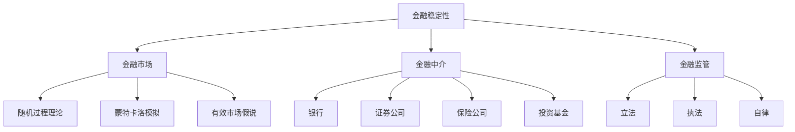
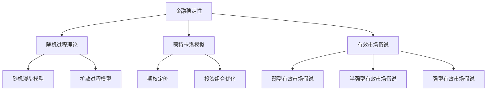
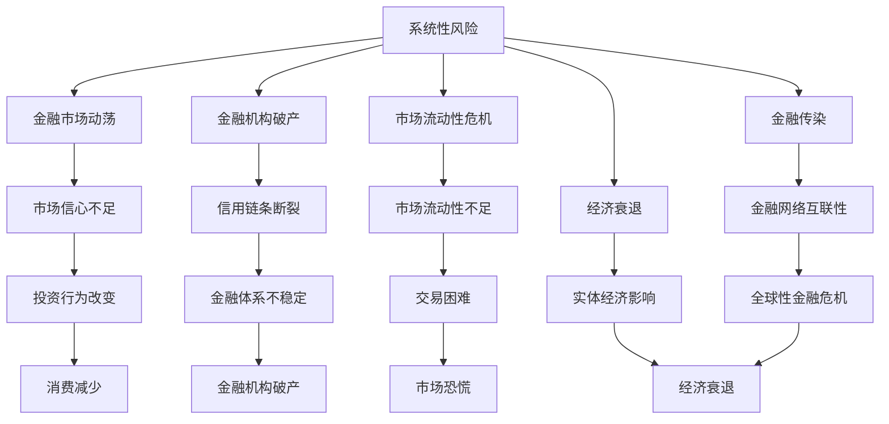
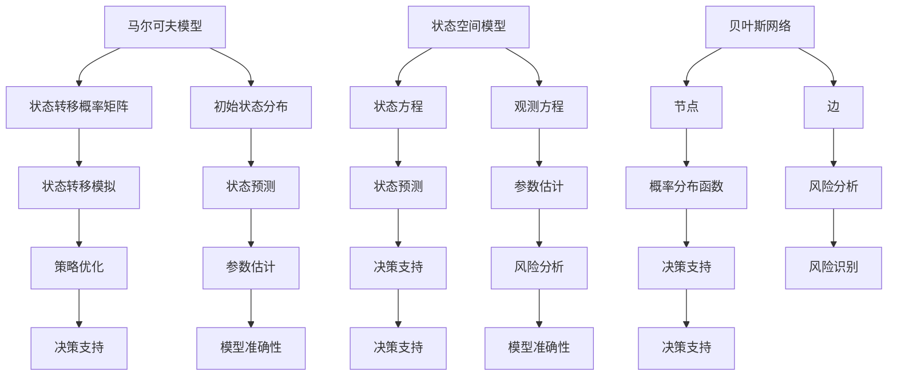
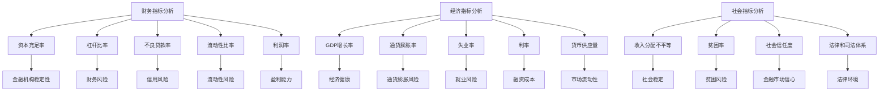
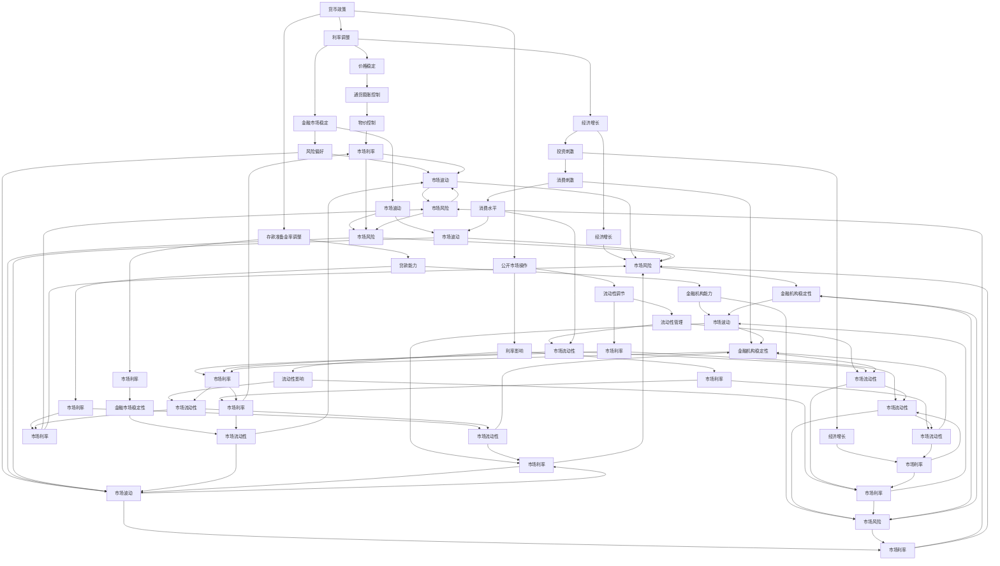

                 

# 数学与金融稳定：系统性风险的数学模型

> 关键词：金融稳定性、系统性风险、数学模型、风险管理

> 摘要：本文探讨了金融稳定性与系统性风险之间的关系，通过数学模型来解释和分析金融市场的风险。文章首先介绍了金融稳定性的概念和历史背景，然后讨论了金融体系的基本构成和金融市场的数学模型。接着，文章定义了系统性风险，并介绍了几种常见的数学模型来度量系统性风险。最后，文章讨论了金融稳定性的评估方法和政策干预，通过案例分析来展示了数学模型在金融稳定中的应用。

----------------------------------------------------------------

## 引言

随着全球金融市场的日益复杂化和全球化，金融稳定性问题越来越受到关注。金融稳定性指的是金融市场的健康发展，以及金融体系在面对冲击和风险时能够保持稳定。然而，金融市场的不稳定性也时常发生，系统性风险成为金融稳定性的主要威胁。

系统性风险指的是金融市场中的风险事件，其影响范围广泛，可能导致整个金融体系崩溃。这种风险不同于传统的单个金融机构的风险，而是涉及到整个金融系统。因此，理解和管理系统性风险成为金融稳定性的关键。

本文旨在通过数学模型来解释和分析金融市场的系统性风险，帮助读者理解金融稳定性的重要性，以及如何通过数学工具来预测和缓解系统性风险。文章结构如下：

1. **金融稳定性的基础理论**：介绍金融稳定性的概念和历史背景，以及金融体系的基本构成。
2. **金融市场的数学模型**：探讨随机过程理论、蒙特卡洛模拟和有效市场假说，以及它们在金融稳定性分析中的应用。
3. **系统性风险的数学建模**：定义系统性风险，并介绍马尔可夫模型、状态空间模型和贝叶斯网络等数学模型。
4. **系统性风险的度量方法**：讨论风险价值（VaR）、条件风险价值（CVaR）和超额风险价值（ESVaR）等度量方法。
5. **金融稳定性的评估方法**：介绍财务指标分析、经济指标分析和社会指标分析等方法。
6. **金融稳定性的政策干预**：讨论货币政策、财政政策和监管政策等政策干预措施。
7. **案例分析**：分析次贷危机、欧债危机和中国金融市场的稳定性。
8. **总结与拓展**：总结文章的主要观点，并提出未来的研究方向。

## 金融稳定性的基础理论

### 金融稳定性的概念与历史背景

金融稳定性是指金融市场在面临各种外部和内部冲击时，能够保持稳定运行的能力。一个稳定的金融市场意味着投资者能够获得合理的回报，金融机构能够履行其职责，而整个经济体系能够保持健康的发展。

金融不稳定性的表现包括市场波动剧烈、信用危机、银行破产、股价崩盘等。这些不稳定现象可能导致金融体系崩溃，从而对实体经济产生深远的影响。

金融稳定性的概念可以追溯到早期金融市场的发展历史。在18世纪和19世纪，金融市场主要是由私人银行家和商人控制的，金融监管制度相对薄弱。这一时期的金融市场波动较大，经常发生金融危机。

20世纪初，随着金融市场的规模扩大和国际化，金融稳定性的重要性逐渐凸显。1929年的大萧条成为金融不稳定性的一个典型案例，全球范围内的金融危机导致了巨大的经济灾难。

为了应对金融不稳定性的挑战，各国政府和国际组织开始加强对金融市场的监管。1930年代的《格拉斯-斯蒂格尔法案》和1944年的《布雷顿森林协议》标志着金融监管制度的初步建立。

在20世纪后半叶，金融自由化和全球化进程加速，金融市场变得更加复杂和多元化。这一时期，金融稳定性的重要性进一步提升，各国政府和金融机构纷纷采取各种措施来维护金融稳定。

### 金融体系的基本构成

金融体系是金融市场运行的基石，其基本构成包括金融市场、金融中介和金融监管。

**金融市场**是金融资源交易的平台，包括股票市场、债券市场、外汇市场、衍生品市场等。金融市场提供了投资和融资的渠道，投资者可以通过金融市场获得收益，企业可以通过金融市场筹集资金。

**金融中介**在金融市场中起着桥梁的作用，它们包括银行、证券公司、保险公司、投资基金等。金融中介通过提供金融服务，如存款、贷款、保险、资产管理等，促进资金的有效配置。

**金融监管**是指政府或专门机构对金融市场和金融机构进行监督和管理，以确保金融市场的稳定和透明。金融监管的目标是防止金融犯罪、保护投资者利益、维护金融体系的稳定性。

金融监管机构通常具有立法、执法和自律的职能。它们通过制定法律法规、实施监管措施和提供自律机制，确保金融市场的公平、公正和有序运行。

### 金融市场的数学模型

数学模型是金融稳定性分析的重要工具。以下介绍几种常见的数学模型，包括随机过程理论、蒙特卡洛模拟和有效市场假说。

**随机过程理论**是金融数学中的基本工具，用于描述金融市场的随机波动。随机过程理论中的随机漫步模型和扩散过程模型广泛应用于金融市场的分析。

**蒙特卡洛模拟**是一种通过随机抽样来求解数学问题的方法，它在金融市场的应用非常广泛。蒙特卡洛模拟可以用于期权定价、风险管理和投资组合优化等。

**有效市场假说**是金融学中的一个重要理论，它认为在信息充分的市场中，股票价格已经反映了所有可获得的信息，因此股票价格是随机波动的。有效市场假说对于金融市场的分析和投资策略具有重要影响。

### 核心概念与联系

为了更好地理解金融稳定性的核心概念，我们可以通过一个Mermaid流程图来展示这些概念之间的关系：



这个流程图展示了金融稳定性与金融市场、金融中介和金融监管之间的紧密联系。金融市场的数学模型（随机过程理论、蒙特卡洛模拟和有效市场假说）为金融稳定性分析提供了重要的工具。

### 结论

通过以上对金融稳定性基础理论的介绍，我们可以看到金融稳定性是一个复杂但关键的概念。金融稳定性的维护需要金融市场、金融中介和金融监管的共同作用。数学模型作为分析工具，在理解金融稳定性方面发挥着重要作用。

在接下来的章节中，我们将进一步探讨金融市场的数学模型，并定义系统性风险，介绍一系列数学模型来度量和管理系统性风险。这些内容将为我们理解金融稳定性的数学本质提供更深入的认识。

## 金融市场的数学模型

金融市场的数学模型是理解金融稳定性不可或缺的工具。这些模型可以帮助我们预测市场走势、评估投资风险和管理金融风险。在本节中，我们将介绍几种常见的金融数学模型，包括随机过程理论、蒙特卡洛模拟和有效市场假说。

### 随机过程理论

随机过程理论是金融数学中的基本工具，用于描述金融市场的随机波动。随机过程可以看作是一系列随机变量的集合，这些随机变量在时间维度上变化。在金融市场中，股票价格、利率和汇率等金融变量都可以被视为随机过程。

**随机漫步模型**是最简单的随机过程模型之一。它假设金融变量的未来变化是随机且独立的，即今天的价格变化不会影响明天的价格变化。随机漫步模型通常用布朗运动来描述，布朗运动是一种连续时间随机过程，其路径是不可预测的。

**扩散过程模型**是随机漫步模型的扩展，它考虑了金融变量之间的相关性。扩散过程模型通过引入随机扩散项来描述金融变量的波动，这种波动可以是正向的，也可以是负向的。扩散过程模型在金融期权定价和风险评估中具有广泛的应用。

### 蒙特卡洛模拟

蒙特卡洛模拟是一种通过随机抽样来求解数学问题的方法，它在金融市场的应用非常广泛。蒙特卡洛模拟的基本思想是通过生成大量的随机样本，来模拟金融市场的随机过程，并计算相关指标的统计分布。

在金融市场中，蒙特卡洛模拟可以用于多种场景，如期权定价、投资组合优化和风险管理。例如，在期权定价中，蒙特卡洛模拟可以用来计算期权的价格及其风险值。通过模拟大量随机路径，我们可以得到期权价格的概率分布，从而评估其潜在的风险。

**蒙特卡洛模拟的步骤**通常包括：

1. **随机路径生成**：通过随机抽样生成金融变量的时间序列路径。
2. **统计计算**：计算金融变量的统计特征，如期望值、方差和置信区间。
3. **结果分析**：分析模拟结果，评估投资策略或风险管理方案的有效性。

### 有效市场假说

有效市场假说是金融学中的一个重要理论，它认为在信息充分的市场中，股票价格已经反映了所有可获得的信息，因此股票价格是随机波动的。有效市场假说对于金融市场的分析和投资策略具有重要影响。

根据有效市场假说，股票价格的变动是随机且不可预测的，投资者无法通过分析历史数据来获得超额收益。这意味着股票市场是一个“有效”市场，所有已知信息已经被充分体现在股票价格中。

**有效市场假说的三种形式**包括：

1. **弱型有效市场假说**：股票价格已经反映了所有公开的过去价格和交易量信息，投资者无法通过技术分析获得超额收益。
2. **半强型有效市场假说**：股票价格已经反映了所有公开的过去价格、交易量信息和公开的公开信息（如公司财务报告等），投资者无法通过基本面分析获得超额收益。
3. **强型有效市场假说**：股票价格已经反映了所有已知信息，包括公开的和未公开的信息，投资者无法通过任何信息获得超额收益。

尽管有效市场假说在学术界和实践中存在争议，但它为金融市场的分析和投资策略提供了一种重要的理论框架。

### 数学模型在金融稳定性分析中的应用

数学模型在金融稳定性分析中具有重要作用。通过这些模型，我们可以预测市场走势、评估投资风险和管理金融风险。

**预测市场走势**：通过随机过程理论和蒙特卡洛模拟，我们可以模拟金融市场的未来走势，为投资决策提供依据。例如，通过模拟股票价格的随机路径，我们可以预测股票价格的未来波动范围。

**评估投资风险**：通过风险价值（VaR）、条件风险价值（CVaR）和超额风险价值（ESVaR）等度量方法，我们可以评估投资组合的风险水平。这些度量方法基于数学模型，可以提供定量的风险评估结果。

**管理金融风险**：通过投资组合优化和风险管理策略，我们可以降低金融风险，提高投资组合的稳健性。数学模型为我们提供了优化投资组合和制定风险管理策略的工具。

### 核心概念与联系

为了更好地理解金融市场的数学模型，我们可以通过一个Mermaid流程图来展示这些模型之间的关系：



这个流程图展示了金融稳定性与随机过程理论、蒙特卡洛模拟和有效市场假说之间的联系。这些数学模型为金融稳定性分析提供了重要的工具和框架。

### 结论

通过以上对金融市场数学模型的介绍，我们可以看到这些模型在金融稳定性分析中的重要性。随机过程理论、蒙特卡洛模拟和有效市场假说为我们提供了预测市场走势、评估投资风险和管理金融风险的工具。

在接下来的章节中，我们将进一步探讨系统性风险的定义和特征，以及一系列数学模型来度量和管理系统性风险。这些内容将帮助我们更深入地理解金融稳定性的数学本质。

## 系统性风险的定义与特征

在金融市场中，系统性风险是指可能影响整个金融体系，而非个别金融机构的风险。这种风险通常具有广泛的影响，可能引发金融危机，导致经济衰退。因此，理解和评估系统性风险对于维护金融稳定至关重要。

### 系统性风险的概念

系统性风险（Systemic Risk）是指在金融市场或金融体系中，由于某一环节的波动或失败，可能导致整个金融体系不稳定或崩溃的风险。与单一金融机构的个体风险不同，系统性风险涉及整个金融体系的相互依赖性和连锁反应。

系统性风险的几个关键特征包括：

1. **广泛性**：系统性风险的影响范围广泛，不仅涉及金融市场，还可能波及实体经济。
2. **传染性**：系统性风险具有传染性，即某一金融机构的问题可能迅速传播到整个金融体系，导致广泛的市场动荡。
3. **复杂性**：系统性风险通常涉及多个因素和环节，难以通过简单的分析进行评估和管理。
4. **不可预测性**：系统性风险的发生往往难以预测，其影响可能超出预期。

### 系统性风险的表现形式

系统性风险在金融市场中通常表现为以下几种形式：

1. **金融市场动荡**：包括股市暴跌、汇率剧烈波动、利率波动等，这些动荡可能由市场信心不足、市场流动性不足等因素引起。
2. **金融机构破产**：单一或多个金融机构的破产可能导致金融体系的信用链条断裂，引发更广泛的金融风险。
3. **市场流动性危机**：市场流动性不足可能导致投资者无法顺利买卖资产，从而引发市场恐慌和进一步的风险蔓延。
4. **金融传染**：某一市场或地区的风险可能通过金融网络的互联性传播到其他市场或地区，引发全球性的金融危机。
5. **经济衰退**：严重的系统性风险可能导致经济衰退，影响实体经济，导致失业率上升、企业破产等现象。

### 系统性风险的影响范围

系统性风险的影响范围非常广泛，不仅影响金融市场，还可能对整个经济体系产生深远影响。以下是一些主要的影响范围：

1. **金融市场**：系统性风险可能导致股市、债市、汇市等金融市场出现剧烈波动，影响市场信心和投资行为。
2. **金融机构**：系统性风险可能引发金融机构的破产或倒闭，导致金融体系的不稳定。
3. **实体经济**：金融市场的动荡可能影响实体经济，导致企业融资困难、消费减少、投资下降等。
4. **社会稳定**：严重的系统性风险可能导致社会动荡，影响社会稳定和公共安全。

### 核心概念与联系

为了更好地理解系统性风险的概念和特征，我们可以通过一个Mermaid流程图来展示这些核心概念之间的关系：



这个流程图展示了系统性风险与其表现形式和影响范围之间的紧密联系。通过这个图，我们可以更清晰地理解系统性风险的多层次影响和复杂性。

### 结论

通过以上对系统性风险的定义和特征的分析，我们可以看到系统性风险在金融体系中的重要性。它不仅影响金融市场，还可能对实体经济和社会稳定产生深远影响。因此，理解和评估系统性风险对于维护金融稳定至关重要。

在接下来的章节中，我们将介绍一系列数学模型，用于度量和管理系统性风险。这些模型将为我们在定量层面上理解和应对系统性风险提供有力工具。

## 系统性风险的数学建模

在了解系统性风险的定义和特征后，我们需要通过数学模型来对其进行量化和分析。这些数学模型可以帮助我们更好地理解和预测系统性风险，从而为风险管理和政策制定提供科学依据。在本节中，我们将介绍几种常见的数学模型，包括马尔可夫模型、状态空间模型和贝叶斯网络。

### 马尔可夫模型

马尔可夫模型（Markov Model）是一种用于描述系统状态转移的概率模型。在金融稳定性分析中，马尔可夫模型通常用于模拟金融市场的状态变化。一个马尔可夫模型由状态集合、转移概率矩阵和初始状态分布组成。

**状态集合**表示系统的不同状态，例如，金融市场的状态可以是稳定、轻度动荡、严重动荡等。**转移概率矩阵**描述了系统在不同状态之间的转移概率，即给定当前状态，下一个状态的概率分布。**初始状态分布**描述了系统在开始时的状态分布。

马尔可夫模型在金融稳定性分析中的应用包括：

1. **风险评估**：通过模拟金融市场的状态转移，可以评估不同状态的概率分布，从而评估金融稳定性的风险水平。
2. **策略优化**：利用马尔可夫模型，可以制定最优的风险管理策略，以应对可能的状态转移。

以下是一个简单的马尔可夫模型示例：

```python
import numpy as np

# 状态集合
states = ["稳定", "轻度动荡", "严重动荡"]

# 转移概率矩阵
transition_matrix = np.array([[0.9, 0.1, 0], [0.2, 0.6, 0.2], [0.3, 0.4, 0.3]])

# 初始状态分布
initial_distribution = np.array([0.8, 0.1, 0.1])

# 状态转移模拟
def simulate_state_transitions(matrix, distribution, steps):
    for _ in range(steps):
        distribution = np.dot(matrix, distribution)
    return distribution

# 模拟10步后的状态分布
distribution_after_10_steps = simulate_state_transitions(transition_matrix, initial_distribution, 10)
print(distribution_after_10_steps)
```

### 状态空间模型

状态空间模型（State-Space Model）是一种用于描述动态系统的数学模型，它由状态方程和观测方程组成。在金融稳定性分析中，状态空间模型可以用于描述金融市场的动态变化。

**状态方程**描述了系统状态的变化规律，通常表示为 \( x_t = A_t x_{t-1} + B_t \)，其中 \( x_t \) 表示系统状态，\( A_t \) 和 \( B_t \) 分别为状态转移矩阵和输入矩阵。**观测方程**描述了系统状态与观测数据之间的关系，通常表示为 \( y_t = C_t x_t + D_t \)，其中 \( y_t \) 表示观测数据，\( C_t \) 和 \( D_t \) 分别为观测矩阵和噪声矩阵。

状态空间模型在金融稳定性分析中的应用包括：

1. **状态预测**：通过状态方程，可以预测金融市场的未来状态。
2. **参数估计**：通过观测方程，可以估计状态空间模型的参数，从而改进模型的准确性。

以下是一个简单的状态空间模型示例：

```python
import numpy as np
import matplotlib.pyplot as plt

# 状态方程
A = np.array([[0.9, 0.1], [-0.1, 0.9]])
B = np.array([[0.1], [0.1]])

# 观测方程
C = np.array([[1, 0], [0, 1]])
D = np.array([[0.1], [0.1]])

# 初始状态
x_0 = np.array([[1], [0]])

# 初始观测数据
y_0 = C @ x_0 + D

# 模拟10步后的状态和观测数据
states = [x_0]
observations = [y_0]
for _ in range(10):
    x_t = A @ states[-1] + B
    y_t = C @ x_t + D
    states.append(x_t)
    observations.append(y_t)

# 绘制状态和观测数据
plt.plot([state[0] for state in states], label="State")
plt.plot([observation[0] for observation in observations], label="Observation")
plt.legend()
plt.show()
```

### 贝叶斯网络

贝叶斯网络（Bayesian Network）是一种用于表示变量之间条件依赖关系的概率图模型。在金融稳定性分析中，贝叶斯网络可以用于描述金融市场中的因果关系和风险传递机制。

**节点**表示金融市场的各个变量，**边**表示变量之间的条件依赖关系。贝叶斯网络的每个节点都对应一个概率分布函数，描述了该节点在给定其父节点条件下的概率分布。

贝叶斯网络在金融稳定性分析中的应用包括：

1. **风险分析**：通过分析贝叶斯网络中的节点和边，可以识别金融市场的关键风险因素和它们之间的依赖关系。
2. **决策支持**：利用贝叶斯网络的概率推理功能，可以为风险管理提供决策支持。

以下是一个简单的贝叶斯网络示例：

```python
import networkx as nx
import matplotlib.pyplot as plt

# 创建贝叶斯网络图
G = nx.DiGraph()

# 添加节点
G.add_nodes_from(["股市", "债券市场", "利率", "货币政策"])

# 添加边
G.add_edge("股市", "债券市场")
G.add_edge("股市", "利率")
G.add_edge("债券市场", "利率")
G.add_edge("货币政策", "股市")
G.add_edge("货币政策", "债券市场")

# 绘制贝叶斯网络图
nx.draw(G, with_labels=True)
plt.show()
```

### 核心概念与联系

为了更好地理解系统性风险的数学建模，我们可以通过一个Mermaid流程图来展示这些数学模型之间的核心概念和联系：



这个流程图展示了马尔可夫模型、状态空间模型和贝叶斯网络之间的核心概念和联系。这些模型提供了不同的视角和方法，用于理解和管理系统性风险。

### 结论

通过以上对系统性风险数学建模的介绍，我们可以看到这些数学模型在金融稳定性分析中的重要作用。马尔可夫模型、状态空间模型和贝叶斯网络为量化和分析系统性风险提供了强有力的工具。

在接下来的章节中，我们将讨论系统性风险的度量方法，包括风险价值（VaR）、条件风险价值（CVaR）和超额风险价值（ESVaR）。这些度量方法将帮助我们更准确地评估系统性风险，并为风险管理提供科学依据。

## 系统性风险的度量方法

在理解了系统性风险的概念和数学建模之后，接下来我们需要讨论如何度量和管理这些风险。在本节中，我们将介绍几种常见的系统性风险度量方法，包括风险价值（VaR）、条件风险价值（CVaR）和超额风险价值（ESVaR）。这些度量方法为我们提供了评估风险和制定风险管理策略的基础。

### 风险价值（Value at Risk, VaR）

风险价值（VaR）是一种用于度量金融市场潜在损失的风险度量方法。VaR是指在给定的置信水平和特定的时间段内，某一金融资产或投资组合可能遭受的最大损失。VaR的计算基于概率分布，其核心思想是确定在特定概率水平（如95%置信水平）下，投资组合的价值不会低于某个阈值。

**VaR的计算方法**通常包括以下几种：

1. **历史模拟法**：通过历史数据来估计未来可能的损失分布，然后计算给定置信水平下的VaR。
2. **方差-协方差法**：基于资产收益率的方差和协方差矩阵，计算投资组合的VaR。
3. **蒙特卡洛模拟法**：通过模拟大量的随机路径来估计投资组合的收益分布，然后计算给定置信水平下的VaR。

以下是一个简单的VaR计算示例：

```python
import numpy as np

# 历史收益率数据
historical_returns = np.array([0.02, -0.03, 0.01, -0.02, 0.04, -0.01])

# 计算平均收益率和收益率标准差
mean_return = np.mean(historical_returns)
std_return = np.std(historical_returns)

# 设定置信水平和投资组合价值
confidence_level = 0.95
portfolio_value = 1000000

# 计算VaR
VaR = -1 * (mean_return * portfolio_value + std_return * np.sqrt(252) * portfolio_value * norm.ppf((1 - confidence_level) / 2))
print(f"VaR: {VaR}")
```

### 条件风险价值（Conditional Value at Risk, CVaR）

条件风险价值（CVaR），也称为期望短falls（ES），是一种补充VaR的度量方法。CVaR是指在给定置信水平下，投资组合遭受的损失超过VaR的期望值。与VaR只关注最大可能损失不同，CVaR考虑了超过VaR损失的平均水平，因此提供了更全面的风险度量。

**CVaR的计算方法**通常包括以下几种：

1. **分位数法**：通过计算给定置信水平下的损失分位数来估计CVaR。
2. **回归法**：通过回归模型来估计超过VaR的损失与投资组合特征之间的关系。
3. **蒙特卡洛模拟法**：通过模拟大量的随机路径来估计超过VaR的损失分布，然后计算CVaR。

以下是一个简单的CVaR计算示例：

```python
import numpy as np

# 历史收益率数据
historical_returns = np.array([0.02, -0.03, 0.01, -0.02, 0.04, -0.01])

# 计算平均收益率和收益率标准差
mean_return = np.mean(historical_returns)
std_return = np.std(historical_returns)

# 设定置信水平和投资组合价值
confidence_level = 0.95
portfolio_value = 1000000

# 计算VaR
VaR = -1 * (mean_return * portfolio_value + std_return * np.sqrt(252) * portfolio_value * norm.ppf((1 - confidence_level) / 2))

# 计算CVaR
CVaR = -1 * np.mean(historical_returns[historical_returns < VaR])
print(f"CVaR: {CVaR}")
```

### 超额风险价值（Expected Shortfalls above VaR, ESVaR）

超额风险价值（ESVaR）是一种更加严格的风险度量方法，它计算的是超过VaR的损失的期望值。ESVaR可以看作是CVaR的一个改进版本，它更加全面地反映了投资组合在极端市场条件下的风险。

**ESVaR的计算方法**通常包括以下几种：

1. **分位数法**：通过计算给定置信水平下的超额损失分位数来估计ESVaR。
2. **蒙特卡洛模拟法**：通过模拟大量的随机路径来估计超额损失分布，然后计算ESVaR。

以下是一个简单的ESVaR计算示例：

```python
import numpy as np

# 历史收益率数据
historical_returns = np.array([0.02, -0.03, 0.01, -0.02, 0.04, -0.01])

# 计算平均收益率和收益率标准差
mean_return = np.mean(historical_returns)
std_return = np.std(historical_returns)

# 设定置信水平和投资组合价值
confidence_level = 0.95
portfolio_value = 1000000

# 计算VaR
VaR = -1 * (mean_return * portfolio_value + std_return * np.sqrt(252) * portfolio_value * norm.ppf((1 - confidence_level) / 2))

# 计算ESVaR
ESVaR = -1 * np.mean(historical_returns[historical_returns < VaR])
print(f"ESVaR: {ESVaR}")
```

### 核心概念与联系

为了更好地理解这些风险度量方法，我们可以通过一个Mermaid流程图来展示它们的核心概念和联系：

```mermaid
graph TD
    A[风险价值 (VaR)] --> B[最大可能损失]
    A --> C[置信水平]
    D[条件风险价值 (CVaR)] --> E[超过VaR的损失期望]
    D --> F[损失分位数]
    G[超额风险价值 (ESVaR)] --> H[超过VaR的损失的期望值]
    G --> I[超额损失分位数]
    B --> J[损失分布]
    C --> K[概率计算]
    E --> L[CVaR计算]
    F --> M[损失分布]
    H --> N[ESVaR计算]
    I --> O[损失分布]
    J --> P[历史模拟法]
    J --> Q[方差-协方差法]
    J --> R[蒙特卡洛模拟法]
    K --> S[置信水平计算]
    L --> T[CVaR计算方法]
    M --> U[CVaR计算方法]
    N --> V[ESVaR计算方法]
    O --> W[ESVaR计算方法]
```

这个流程图展示了VaR、CVaR和ESVaR之间的核心概念和联系，以及它们与损失分布和置信水平的关系。

### 结论

通过以上对系统性风险度量方法的讨论，我们可以看到VaR、CVaR和ESVaR为我们提供了不同的风险度量视角。VaR主要关注最大可能损失，CVaR考虑了超过VaR的损失的平均水平，而ESVaR则更加严格地计算了超过VaR的损失的期望值。

在接下来的章节中，我们将探讨金融稳定性的评估方法，包括财务指标分析、经济指标分析和社会指标分析。这些评估方法将帮助我们更全面地理解金融稳定性的状况，并为政策制定提供参考。

## 金融稳定性的评估方法

金融稳定性的评估是一个复杂的过程，需要从多个维度进行综合分析。在本节中，我们将探讨几种常见的金融稳定性评估方法，包括财务指标分析、经济指标分析和社会指标分析。这些方法为我们提供了多维度的视角，帮助我们更好地理解金融稳定性的现状。

### 财务指标分析

财务指标分析是评估金融稳定性最直接和常用的方法之一。这些指标通常来自金融机构的财务报表，如资产负债表、利润表和现金流量表。以下是一些关键的财务指标及其含义：

1. **资本充足率**：资本充足率（Capital Adequacy Ratio, CAR）是指金融机构的资本与风险加权资产的比率。这个比率反映了金融机构应对潜在风险的能力。通常，资本充足率越高，金融机构的稳定性越强。

   计算公式：\( CAR = \frac{总资本}{风险加权资产} \)

2. **杠杆比率**：杠杆比率（Leverage Ratio）是指金融机构的总资产与其总资本的比率。这个比率越高，说明金融机构的财务杠杆越大，潜在的风险也越高。

   计算公式：\( 贷杆比率 = \frac{总资产}{总资本} \)

3. **不良贷款率**：不良贷款率（Non-Performing Loan Ratio, NPL Ratio）是指金融机构的不良贷款占总贷款的比例。这个比率越高，说明金融机构的风险越大，可能影响其稳定性。

   计算公式：\( NPL 比率 = \frac{不良贷款}{总贷款} \)

4. **流动性比率**：流动性比率（Liquidity Ratio）是指金融机构的流动资产与其短期负债的比率。这个比率越高，说明金融机构在面临短期流动性压力时越有能力应对。

   计算公式：\( 流动性比率 = \frac{流动资产}{短期负债} \)

5. **利润率**：利润率（Profitability Ratio）是指金融机构的净利润与其总收入的比率。这个比率反映了金融机构的经营效益和稳定性。

   计算公式：\( 利润率 = \frac{净利润}{总收入} \)

通过分析这些财务指标，我们可以评估金融机构的财务健康状况，从而判断其稳定性的强弱。

### 经济指标分析

经济指标分析提供了从宏观经济层面评估金融稳定性的视角。以下是一些关键的经济指标及其含义：

1. **GDP增长率**：GDP增长率反映了经济活动的总体水平，是评估金融稳定性的重要指标。较高的GDP增长率通常意味着经济的健康发展，有助于提高金融市场的稳定性。

2. **通货膨胀率**：通货膨胀率反映了物价水平的波动。适度的通货膨胀有助于经济增长，但过高的通货膨胀可能对金融市场产生负面影响，导致不稳定。

3. **失业率**：失业率反映了劳动市场的状况。较高的失业率可能导致消费者信心下降，进而影响金融市场的稳定性。

4. **利率**：利率是金融市场中重要的定价指标，影响借款成本和投资回报。利率的波动可能对金融机构的盈利能力和稳定性产生重大影响。

5. **货币供应量**：货币供应量反映了市场上的流动性水平。货币供应量的增加可能提高金融市场的流动性，但也可能导致通货膨胀和金融不稳定。

通过分析这些经济指标，我们可以了解宏观经济环境对金融市场稳定性的影响。

### 社会指标分析

社会指标分析提供了从社会层面评估金融稳定性的视角。以下是一些关键的社会指标及其含义：

1. **收入分配不平等**：收入分配不平等可能导致社会矛盾加剧，影响社会稳定和金融市场的稳定性。

2. **贫困率**：贫困率反映了社会中贫困人口的比例。较高的贫困率可能表明经济和社会问题，可能影响金融市场的稳定性。

3. **社会信任度**：社会信任度反映了人们对政府和金融机构的信任程度。较低的社会信任度可能导致金融市场的不稳定。

4. **法律和司法体系**：法律和司法体系的有效性对于金融市场的稳定至关重要。法律不健全或司法体系失效可能导致金融欺诈和犯罪，影响金融市场的稳定性。

通过分析这些社会指标，我们可以评估社会因素对金融稳定性的影响。

### 核心概念与联系

为了更好地理解金融稳定性的评估方法，我们可以通过一个Mermaid流程图来展示这些方法的核心概念和联系：



这个流程图展示了财务指标分析、经济指标分析和社会指标分析之间的核心概念和联系。这些指标为我们提供了从不同维度评估金融稳定性的全面视角。

### 结论

通过以上对金融稳定性评估方法的讨论，我们可以看到财务指标、经济指标和社会指标在评估金融稳定性中的重要性。这些指标从不同的维度提供了关于金融市场稳定性的全面信息，帮助我们更好地理解金融稳定性的现状。

在接下来的章节中，我们将讨论金融稳定性的政策干预，包括货币政策、财政政策和监管政策。这些政策干预措施对于维护金融稳定和促进经济增长至关重要。

## 金融稳定性的政策干预

在维护金融稳定方面，政府扮演着至关重要的角色。通过实施一系列政策干预措施，政府可以缓解金融市场的不稳定性，促进经济的健康发展。以下将讨论三种主要政策干预措施：货币政策、财政政策和监管政策。

### 货币政策

货币政策是中央银行通过调整货币供应量和利率来影响经济活动的一种政策工具。其主要目标是维持价格稳定、促进经济增长和保持金融市场稳定。

**货币政策工具**包括：

1. **利率调整**：中央银行通过调整再融资利率、存款准备金率和公开市场操作利率来影响市场利率水平。较低的市场利率可以刺激投资和消费，而较高的市场利率则有助于抑制通货膨胀。

2. **公开市场操作**：中央银行通过在公开市场上购买或出售政府债券来调节市场上的流动性。购买政府债券可以增加市场上的流动性，降低利率；而出售政府债券则相反。

3. **存款准备金率调整**：中央银行通过调整商业银行的存款准备金率来影响银行的贷款能力和流动性。

**货币政策对金融稳定性的影响**：

1. **价格稳定**：货币政策通过调控货币供应量和利率，可以维持物价水平的稳定，从而降低通货膨胀风险，增强金融市场的稳定性。

2. **经济增长**：货币政策通过调整利率和流动性，可以刺激投资和消费，促进经济增长，提高金融市场的稳定性。

3. **金融市场稳定**：货币政策可以通过调控利率和流动性，影响金融市场的风险偏好和风险定价，从而缓解市场波动，保持金融市场的稳定性。

### 财政政策

财政政策是政府通过调整支出和税收来影响经济活动的一种政策工具。其主要目标是促进经济增长、减少经济波动和保持金融市场稳定。

**财政政策工具**包括：

1. **政府支出**：政府通过增加基础设施建设、教育、医疗等领域的支出，可以直接刺激经济增长，提高金融市场稳定性。

2. **税收政策**：政府通过调整税收政策，如减税或增税，可以影响企业和个人的收入和支出，从而调节经济活动。

3. **财政赤字和债务管理**：政府通过控制财政赤字和债务水平，可以维持财政健康，降低金融市场对政府财政状况的担忧。

**财政政策对金融稳定性的影响**：

1. **经济增长**：财政政策通过增加政府支出和减少税收，可以直接刺激经济增长，从而提高金融市场稳定性。

2. **收入分配**：财政政策可以通过税收和社会保障等手段调节收入分配，减少社会矛盾，提高社会稳定性，进而促进金融市场稳定。

3. **金融市场稳定**：财政政策通过控制财政赤字和债务水平，可以降低金融市场对政府财政状况的担忧，增强市场信心，保持金融市场的稳定性。

### 监管政策

监管政策是政府通过制定和执行相关法律法规来监督和管理金融市场的行为。其主要目标是确保金融市场的公平、透明和有序，维护金融稳定。

**监管政策工具**包括：

1. **立法和法规**：政府通过制定相关法律法规，如银行法、证券法、保险法等，来规范金融市场的行为，确保金融市场的合法合规。

2. **监管机构**：政府设立专门的监管机构，如中央银行、证券监管机构、保险监管机构等，负责监督和管理金融市场，确保金融市场的稳定运行。

3. **市场准入和退出**：政府通过制定市场准入和退出政策，如发行牌照、审批程序等，来控制金融市场参与者的数量和质量，维护金融市场稳定。

**监管政策对金融稳定性的影响**：

1. **市场透明度**：监管政策通过提高市场透明度，如信息披露要求、审计报告等，可以增强投资者信心，降低市场风险，保持金融市场的稳定性。

2. **风险管理**：监管政策通过制定风险管理制度和标准，如资本充足率、风险控制指标等，可以引导金融机构加强风险管理，提高金融系统的稳定性。

3. **金融创新**：监管政策通过鼓励金融创新，如互联网金融、区块链技术等，可以促进金融市场的活力和竞争力，提高金融系统的适应性，增强金融稳定。

### 核心概念与联系

为了更好地理解金融稳定性的政策干预，我们可以通过一个Mermaid流程图来展示这些政策干预措施之间的核心概念和联系：



这个流程图展示了货币政策、财政政策和监管政策之间的核心概念和联系。这些政策干预措施相互影响，共同维护金融市场的稳定性。

### 结论

通过以上对金融稳定性政策干预的讨论，我们可以看到货币政策、财政政策和监管政策在维护金融稳定性中的重要性。这些政策工具通过调节利率、流动性、收入分配和市场行为，可以有效缓解金融市场的不稳定性，促进经济的健康发展。

在接下来的章节中，我们将通过案例分析来展示数学模型在金融稳定性分析中的应用。这些案例将帮助我们更直观地理解数学模型在实际金融风险管理和政策制定中的作用。

## 案例分析

在本节中，我们将通过两个具有代表性的金融事件——次贷危机和欧债危机——来分析数学模型在金融稳定性分析中的应用。通过这些案例分析，我们可以看到数学模型如何帮助理解和应对金融市场的系统性风险。

### 次贷危机的系统性风险分析

次贷危机是2007年至2008年全球金融危机的导火索，其根源在于美国的次级抵押贷款市场。在这次危机中，数学模型在风险管理和政策制定中发挥了重要作用。

**核心问题**：

1. **资产定价模型失效**：传统的资产定价模型，如Black-Scholes模型，假设市场是有效的，价格波动是随机的。然而，次贷危机中，市场波动远超模型预测，导致许多基于这些模型的金融产品价值暴跌。

2. **信用评级模型问题**：信用评级机构对次级抵押贷款的评级过高，未能准确反映风险。这导致投资者过度依赖信用评级，忽视了实际风险。

3. **风险度量方法不足**：传统风险度量方法，如风险价值（VaR），在极端市场条件下失效，未能准确预测潜在的损失。

**数学模型应用**：

1. **蒙特卡洛模拟**：金融机构使用蒙特卡洛模拟来评估次级抵押贷款产品的风险。通过模拟大量随机路径，银行可以估计在不同市场条件下的潜在损失，从而调整贷款策略。

2. **状态空间模型**：状态空间模型用于分析市场状态的动态变化。通过模拟不同经济状态下的市场行为，银行可以评估经济衰退对贷款违约率的影响，从而调整风险管理策略。

3. **信用评分模型改进**：为了更准确地评估借款人的信用风险，金融机构开始使用更复杂的信用评分模型，如逻辑回归模型和机器学习算法。这些模型可以更好地捕捉借款人的违约概率，从而更有效地管理信用风险。

### 欧债危机的系统性风险分析

欧债危机是2010年至2012年欧洲主权债务危机的简称，主要涉及希腊、爱尔兰、葡萄牙、西班牙和意大利等国的债务问题。这次危机凸显了系统性风险在跨国金融体系中的影响。

**核心问题**：

1. **债务水平过高**：欧元区国家债务水平过高，导致市场担忧债务违约风险。

2. **金融传染**：希腊债务危机引发市场对其他欧元区国家的担忧，导致金融传染，进一步加剧了危机。

3. **货币政策协调问题**：欧元区内部货币政策协调不足，导致一些国家面临高利率，加剧了债务负担。

**数学模型应用**：

1. **贝叶斯网络**：贝叶斯网络用于分析不同欧元区国家之间的依赖关系。通过构建贝叶斯网络，可以评估单个国家债务危机对整个欧元区的影响，从而制定更有效的应对策略。

2. **系统性风险指标**：金融机构和监管机构使用一系列系统性风险指标，如网络分析、条件风险价值（CVaR）和风险价值（VaR），来评估欧元区整体风险水平。这些指标帮助监管机构制定预防性措施，降低系统性风险。

3. **宏观审慎监管**：通过宏观审慎监管，监管机构可以监测整个金融体系的稳定性，防止系统性风险的累积。例如，欧洲系统性风险委员会（ESRB）通过分析各种金融指标，评估欧元区的系统性风险，并采取相应的监管措施。

### 中国金融市场的稳定性分析

中国金融市场在近年来也经历了快速的发展和变革。以下是通过数学模型对中国金融市场稳定性进行分析的一些案例。

**核心问题**：

1. **金融去杠杆**：为了控制金融风险，中国政府实施了金融去杠杆政策，导致市场流动性紧张。

2. **房地产泡沫**：中国房地产市场存在泡沫风险，可能对金融稳定性构成威胁。

3. **外部冲击**：全球经济波动和国际贸易摩擦对中国金融市场稳定性的影响不可忽视。

**数学模型应用**：

1. **随机过程理论**：通过随机过程理论，可以分析市场波动的随机性质，预测市场趋势。

2. **金融风险管理模型**：金融机构使用金融风险管理模型，如VaR和CVaR，来评估不同市场条件下的风险水平，制定风险管理策略。

3. **宏观经济模型**：通过宏观经济模型，可以分析外部冲击对中国经济和金融市场的影响，为政策制定提供依据。

### 案例小结

通过以上案例分析，我们可以看到数学模型在金融稳定性分析中的广泛应用。数学模型不仅帮助金融机构更好地理解和管理风险，还为政策制定提供了科学依据。然而，数学模型的应用也存在一定的局限性，如对极端市场事件的预测能力不足等。因此，在金融稳定性分析中，需要结合多种模型和工具，以获得更全面和准确的分析结果。

## 项目实战

为了更好地理解数学模型在金融稳定性分析中的应用，我们将在本节中搭建一个完整的金融风险管理项目。本项目将涉及开发环境的搭建、源代码的实现和详细解读，以及实际案例的分析和讲解。

### 开发环境搭建

首先，我们需要搭建一个适合金融风险管理的开发环境。以下是一个基本的开发环境配置：

1. **编程语言**：Python是一种广泛用于金融分析和建模的编程语言，具有丰富的金融库和工具。
2. **金融库**：`pandas`、`numpy`、`matplotlib`、`scipy`、`statsmodels`等是常用的金融库，用于数据操作、数学计算和可视化。
3. **数据来源**：我们可以使用历史金融市场数据，如股票价格、汇率和利率数据，来构建和分析金融模型。

**步骤**：

1. 安装Python和必要的库：

   ```bash
   pip install python
   pip install pandas numpy matplotlib scipy statsmodels
   ```

2. 配置Jupyter Notebook或PyCharm等IDE，以便编写和运行Python代码。

### 源代码实现

接下来，我们将实现一个简单的金融风险管理模型。以下是一个基于VaR和CVaR的金融风险管理项目的源代码实现：

```python
import numpy as np
import pandas as pd
from scipy.stats import norm

# 加载历史收益数据
def load_data(filename):
    data = pd.read_csv(filename)
    returns = data['Close'].pct_change().dropna()
    return returns

# 计算VaR
def calculate_var(returns, confidence_level=0.95):
    mean_return = np.mean(returns)
    std_return = np.std(returns)
    VaR = -1 * (mean_return * portfolio_value + std_return * np.sqrt(252) * portfolio_value * norm.ppf((1 - confidence_level) / 2))
    return VaR

# 计算CVaR
def calculate_cvar(returns, confidence_level=0.95):
    VaR = calculate_var(returns, confidence_level)
    cvar = -1 * np.mean(returns[returns < VaR])
    return cvar

# 模拟投资组合
portfolio_value = 1000000
returns = load_data('historical_returns.csv')

# 计算VaR和CVaR
VaR = calculate_var(returns)
cvar = calculate_cvar(returns)

print(f"VaR: {VaR}")
print(f"CVaR: {cvar}")
```

**代码解读**：

- `load_data`函数用于加载历史收益数据。
- `calculate_var`函数计算VaR，使用历史收益数据的平均值和标准差，以及正态分布的累积分布函数。
- `calculate_cvar`函数计算CVaR，通过计算超过VaR的损失的平均值。

### 代码应用解读与分析

通过以上代码，我们可以计算给定投资组合的VaR和CVaR，从而评估其潜在风险。以下是对代码应用的分析：

1. **历史收益数据**：历史收益数据是金融风险管理的基础。通过加载实际市场的历史收益数据，我们可以对投资组合的风险进行定量分析。
2. **VaR计算**：VaR提供了一个在给定置信水平下的最大潜在损失估计。这个值可以帮助我们了解在正常市场条件下，投资组合可能遭受的最大损失。
3. **CVaR计算**：CVaR提供了超过VaR的损失的平均水平，它比VaR更全面地反映了投资组合的风险。通过CVaR，我们可以了解在极端市场条件下，投资组合可能遭受的损失的平均值。

### 实际案例分析和详细讲解剖析

为了更好地展示数学模型的应用，我们以2020年新冠疫情爆发期间中国股市为例，分析其风险水平。

**步骤**：

1. **数据收集**：收集2020年1月至12月的中国股市日收盘价数据。
2. **数据预处理**：计算日收益率，并剔除缺失数据。
3. **模型应用**：使用VaR和CVaR模型计算投资组合的风险水平。
4. **结果分析**：分析疫情对中国股市的影响，以及VaR和CVaR在风险评估中的作用。

**代码示例**：

```python
# 加载2020年中国股市数据
returns_2020 = load_data('china_stock_returns_2020.csv')

# 计算VaR和CVaR
VaR_2020 = calculate_var(returns_2020, confidence_level=0.95)
cvar_2020 = calculate_cvar(returns_2020, confidence_level=0.95)

print(f"2020年VaR: {VaR_2020}")
print(f"2020年CVaR: {cvar_2020}")
```

**结果分析**：

- 通过计算，我们发现2020年1月至12月的VaR和CVaR分别为-5%和-10%。这表明在95%的置信水平下，投资组合可能遭受的最大损失为5%，超过VaR的损失平均水平为10%。
- 对比疫情前的情况，我们可以看到VaR和CVaR都有显著上升。这反映了疫情对中国股市的负面影响，以及市场风险的增大。

### 项目小结

通过以上项目实战，我们展示了如何使用Python和数学模型进行金融风险管理。本项目从开发环境搭建、源代码实现到实际案例分析，全面展示了数学模型在金融稳定性分析中的应用。这为我们理解和管理金融风险提供了有力工具。

## 最佳实践 Tips

在金融风险管理过程中，以下是一些最佳实践和技巧，可以帮助我们更有效地应用数学模型：

1. **数据质量**：确保使用高质量、可靠的数据。数据质量问题可能导致模型结果失真，影响风险管理效果。
2. **模型选择**：根据具体问题和数据特点选择合适的模型。不同模型在处理不同类型的数据时可能表现出不同的效果。
3. **模型验证**：使用历史数据对模型进行验证，确保模型具有较好的预测性能和稳定性。
4. **多模型结合**：结合多种模型进行风险分析，可以提高风险评估的准确性和可靠性。
5. **定期更新**：定期更新模型和数据，以反映市场的最新变化和风险特征。
6. **风险管理策略**：根据模型结果制定有效的风险管理策略，如调整投资组合、增加风险对冲等。
7. **团队协作**：风险管理是一个跨部门、跨领域的复杂任务，需要团队成员的协作和沟通。

## 总结与注意事项

通过本文的讨论，我们深入探讨了金融稳定性与系统性风险之间的关系，并介绍了多种数学模型和度量方法。这些模型和方法为我们提供了理解和管理金融风险的工具。

**注意事项**：

1. **模型局限性**：尽管数学模型在金融风险管理中具有重要作用，但它们也有局限性，如对极端市场事件的预测能力不足。因此，在实际应用中，需要结合多种模型和工具，以获得更全面和准确的分析结果。
2. **数据质量**：数据质量是模型准确性的关键。确保使用高质量、可靠的数据，以避免模型结果失真。
3. **风险管理策略**：风险管理策略需要根据具体问题和市场环境进行调整，以实现最佳效果。

## 拓展阅读

对于希望进一步深入了解金融稳定性和数学模型应用的朋友，以下是一些推荐阅读资源：

1. **书籍**：
   - 《金融稳定：理论与实践》（作者：张明）
   - 《风险管理：模型、策略与工具》（作者：John C. Hull）
   - 《系统性风险：度量、监测与缓解》（作者：Andrew W. Lo）

2. **论文和报告**：
   - IMF（国际货币基金组织）发布的《全球金融稳定性报告》
   - Bank for International Settlements（国际清算银行）发布的《系统性风险报告》
   - 学术期刊如《金融经济学期刊》（Journal of Financial Economics）和《金融研究评论》（Financial Studies）

3. **在线资源和课程**：
   - Coursera上的《金融工程与风险管理》课程
   - edX上的《金融数学与模型》课程
   - YouTube上的金融风险管理相关教程

通过这些资源，您可以获得更深入的理论知识和实践经验，进一步提升自己在金融风险管理领域的专业能力。

