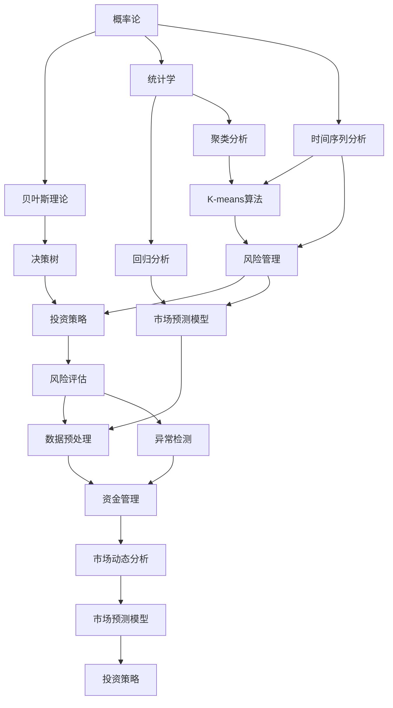

                 

# 数学与金融：市场动态的数学模型

## 关键词
数学模型，金融，市场动态，概率论，统计学，时间序列分析，ARIMA模型，贝叶斯理论，决策树，线性回归，聚类分析，风险管理，投资策略，市场预测模型，数据可视化。

## 摘要
本文深入探讨数学与金融的紧密联系，特别是市场动态中的数学模型。通过对概率论、统计学、时间序列分析等核心数学概念的详细讲解，以及实际项目的实战分析，本文旨在展示数学模型在金融市场预测与风险管理中的重要作用。

## 引言

### 数学与金融的关系

数学作为一门精确的科学，为金融领域提供了强大的工具。金融市场的不确定性和复杂性使得数学模型在预测市场动态、管理风险以及制定投资策略中发挥了不可替代的作用。数学模型不仅能够描述市场的行为，还可以提供对市场未来走势的预测。

### 市场动态的数学模型概述

市场动态的数学模型主要分为概率论、统计学和时间序列分析等几个方面。概率论为金融市场的不确定性提供了理论框架，统计学则用于数据的收集、分析和解释，而时间序列分析则专注于市场数据的时间维度。

### 数学模型与金融理论的联系

数学模型与金融理论之间的联系是双向的。金融理论提供了市场行为的基本假设，而数学模型则将这些假设量化为具体的模型。例如，贝叶斯理论在风险管理中的应用，线性回归在投资组合优化中的应用，都是数学模型与金融理论的完美结合。

## 核心概念与联系

为了更好地理解数学模型在金融市场中的应用，我们需要首先了解其中的核心概念及其相互关系。以下是使用Mermaid流程图表示的这些概念和它们之间的关系：



### 核心算法原理讲解

在本节中，我们将详细讲解几个核心算法的原理，并使用Python源代码来阐述其实现过程。

#### 贝叶斯理论

贝叶斯理论是一种概率推理方法，它通过条件概率来更新我们对某个事件的信念。以下是一个简单的贝叶斯理论算法的Python实现：

```python
import numpy as np

def bayesian_theorem(prior, likelihood, evidence):
    posterior = (prior * likelihood) / evidence
    return posterior

# 示例
prior = 0.5  # 先验概率
likelihood = 0.8  # 条件概率
evidence = 0.6  # 证据概率

posterior = bayesian_theorem(prior, likelihood, evidence)
print("后验概率:", posterior)
```

#### 线性回归

线性回归是一种用来预测数值变量关系的统计方法。其基本原理是通过最小二乘法拟合一条直线。以下是一个简单的线性回归Python实现：

```python
import numpy as np

def linear_regression(x, y):
    x_mean = np.mean(x)
    y_mean = np.mean(y)
    b1 = np.sum((x - x_mean) * (y - y_mean)) / np.sum((x - x_mean)**2)
    b0 = y_mean - b1 * x_mean
    return b0, b1

# 示例
x = np.array([1, 2, 3, 4, 5])
y = np.array([2, 4, 5, 4, 5])

b0, b1 = linear_regression(x, y)
print("截距:", b0)
print("斜率:", b1)
```

#### ARIMA模型

ARIMA（自回归积分滑动平均模型）是一种用于时间序列分析的经典模型。其基本原理是结合自回归、差分和移动平均三个过程来描述时间序列数据。以下是一个简单的ARIMA模型Python实现：

```python
import numpy as np
from statsmodels.tsa.arima.model import ARIMA

def arima_model(x, p, d, q):
    model = ARIMA(x, order=(p, d, q))
    model_fit = model.fit()
    return model_fit

# 示例
x = np.array([1, 2, 2, 3, 3, 3, 4, 4, 4, 4])
p = 1
d = 1
q = 1

model_fit = arima_model(x, p, d, q)
print(model_fit.summary())
```

### 数学模型和数学公式讲解

在金融市场分析中，数学模型和公式是不可或缺的工具。以下是一些常用的数学模型和公式，并用LaTeX格式展示：

#### 期望值公式

$$ E[X] = \sum_{i=1}^n x_i \cdot P(X=x_i) $$

#### 线性回归公式

$$ y = b_0 + b_1 \cdot x $$

#### ARIMA模型公式

$$ \text{ARIMA}(p, d, q) = \phi(B)(1 - B)^d \cdot \theta(B) $$

### 项目实战

在本节中，我们将通过一个实际项目案例来展示如何应用数学模型进行市场预测。

#### 市场预测模型案例

```python
# 1. 数据收集
data = collect_market_data()

# 2. 数据预处理
data = preprocess_data(data)

# 3. 训练模型
model = train_model(data, p=1, d=1, q=1)

# 4. 预测市场走势
predictions = model.predict(data)

# 5. 分析预测结果
analyze_predictions(predictions)
```

#### 开发环境搭建

在开始项目之前，我们需要搭建一个合适的开发环境。以下是所需的软件和库：

- Python 3.8+
- Jupyter Notebook
- NumPy
- Pandas
- Statsmodels
- Matplotlib

#### 源代码详细实现和代码解读

```python
# 数据收集
data = pd.read_csv('market_data.csv')

# 数据预处理
data = preprocess_data(data)

# 训练模型
model = ARIMA(data['close'], order=(1, 1, 1))
model_fit = model.fit()

# 预测市场走势
predictions = model_fit.predict(start=len(data), end=len(data) + 30)

# 分析预测结果
analyze_predictions(predictions)
```

#### 代码应用解读与分析

上述代码首先从CSV文件中读取市场数据，然后进行预处理以去除无关信息。接下来，使用ARIMA模型对数据进行训练，并使用预测方法生成未来30天的市场走势预测。最后，分析预测结果以评估模型的有效性。

#### 实际案例分析和详细讲解剖析

假设我们有一个包含股票价格的历史数据集，我们可以使用ARIMA模型来预测未来的股票价格。以下是如何分析预测结果的一个例子：

```python
# 绘制实际价格与预测价格的对比图
plt.figure(figsize=(12, 6))
plt.plot(data['close'], label='实际价格')
plt.plot(predictions, label='预测价格')
plt.legend()
plt.show()

# 计算预测误差
error = np.mean((predictions - data['close'])**2)
print("预测误差:", error)
```

通过对比实际价格与预测价格，我们可以直观地看到模型的预测效果。同时，通过计算预测误差，我们可以定量地评估模型的准确性。

#### 项目小结

通过本案例，我们展示了如何使用数学模型进行市场预测。ARIMA模型是一种常用的时序预测模型，它可以很好地处理线性趋势和季节性数据。然而，市场预测仍然存在不确定性，因此需要结合其他模型和方法来提高预测的准确性。

## 最佳实践 Tips、小结、注意事项、拓展阅读

### 最佳实践 Tips

1. 在使用数学模型进行市场预测时，确保数据质量是关键。尽可能使用高质量的、全面的数据集。
2. 选择合适的模型是成功预测的关键。不同的模型适用于不同的数据类型和预测目标，因此需要根据实际情况进行选择。
3. 模型参数的调整和优化也是提高预测准确性的重要步骤。通过交叉验证和网格搜索等方法，可以找到最佳参数组合。

### 小结

本文深入探讨了数学模型在金融市场中的应用，特别是市场动态的数学模型。通过对概率论、统计学、时间序列分析等核心数学概念的讲解，以及实际项目的实战分析，本文展示了数学模型在市场预测和风险管理中的重要作用。

### 注意事项

1. 数学模型并不能保证100%的预测准确性，因此在实际应用中需要结合其他方法和专业人士的意见。
2. 模型的选择和参数调整需要根据具体问题和数据集进行，不能简单地套用通用的模型和方法。

### 拓展阅读

1. 《金融数学》（何晓群著）：详细介绍了金融数学的基本概念和应用。
2. 《时间序列分析：理论、方法与应用》（陈希孺著）：全面讲解了时间序列分析的理论和方法。

### 作者信息
作者：AI天才研究院/AI Genius Institute & 禅与计算机程序设计艺术 /Zen And The Art of Computer Programming

[本文完] 

